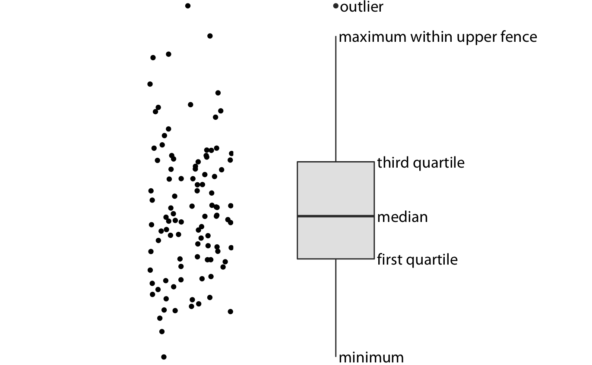
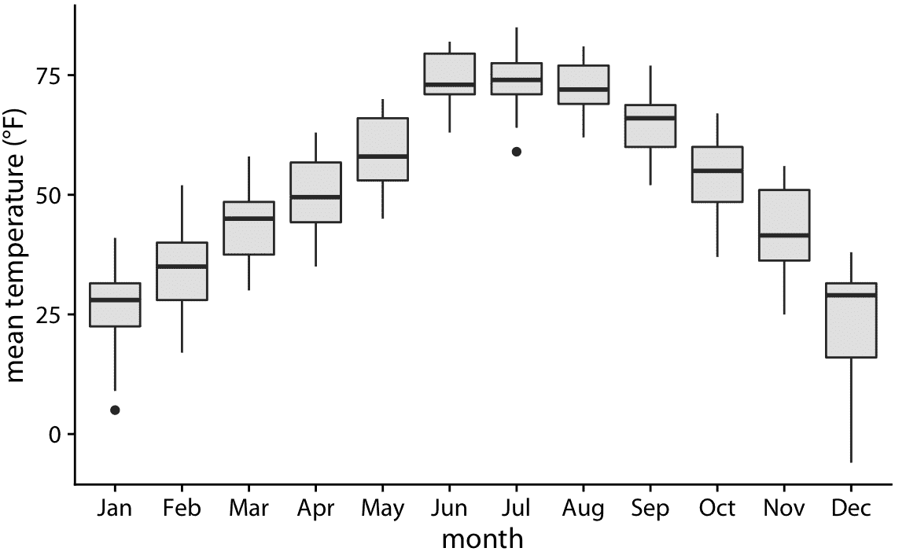
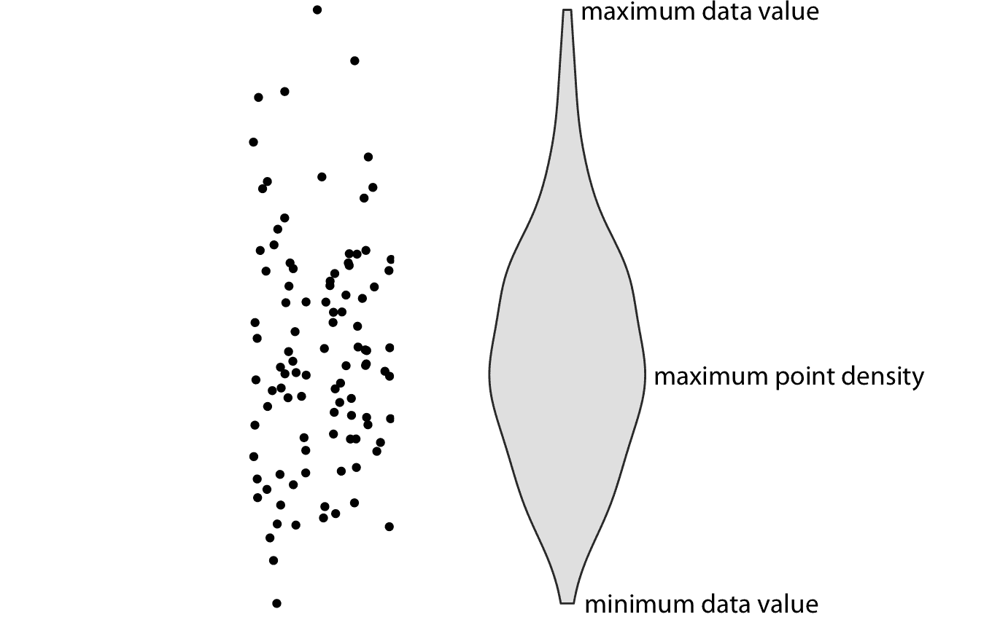
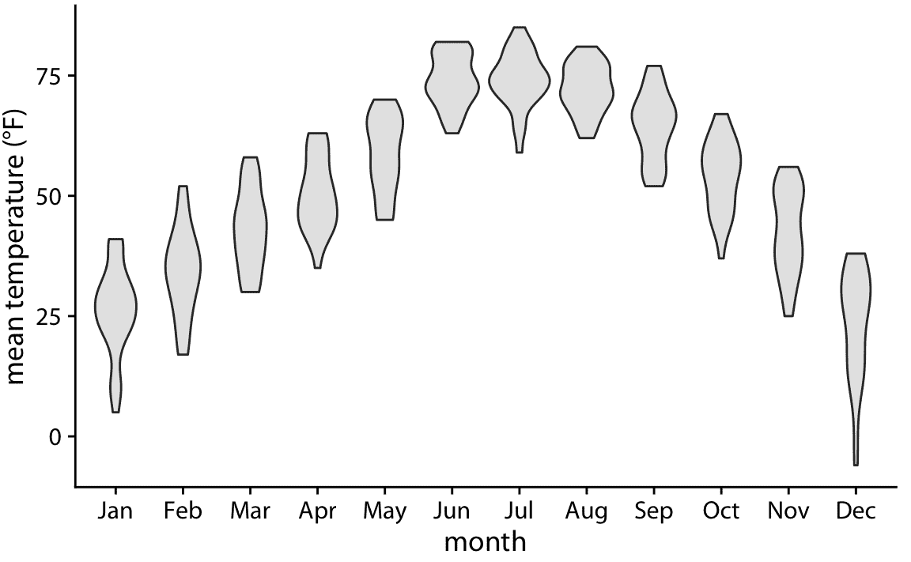
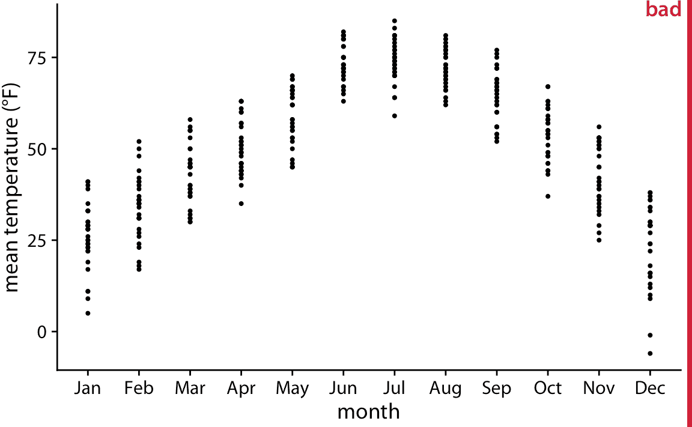
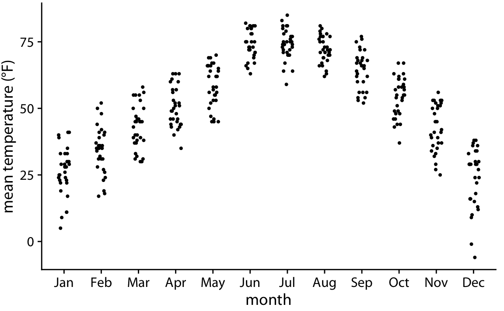
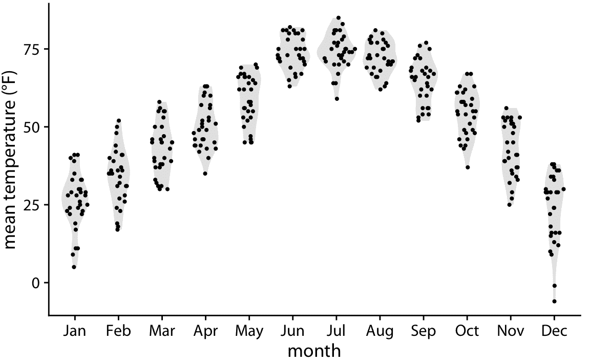
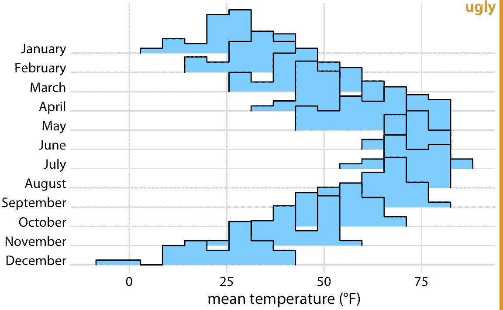
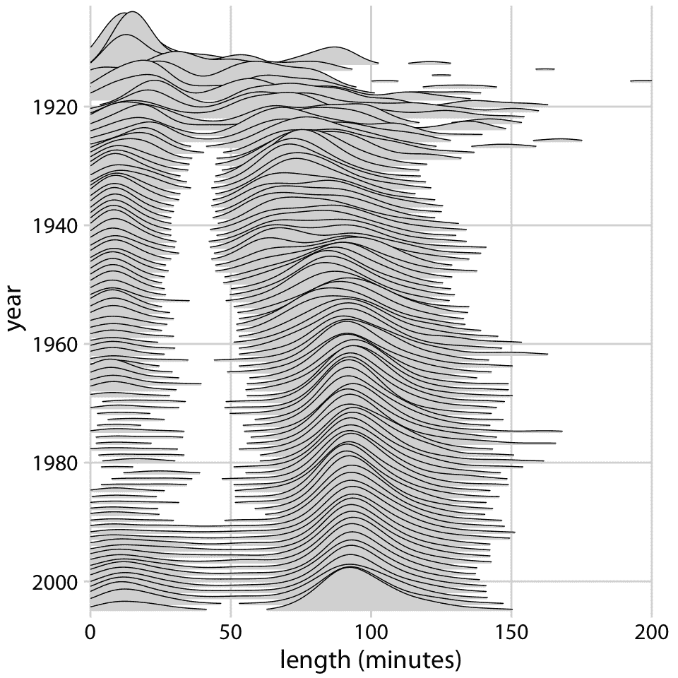
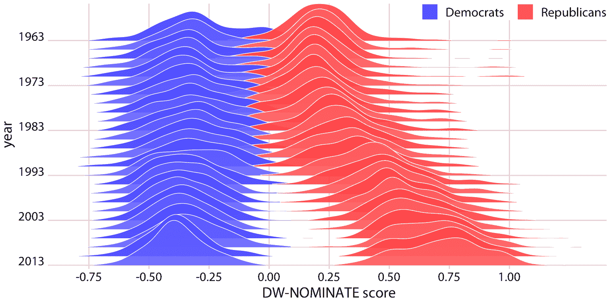

# 9 一次可视化多个分布

> 原文： [9 Visualizing many distributions at once](https://serialmentor.com/dataviz/boxplots-violins.html)

> 校验：[飞龙](https://github.com/wizardforcel)

> 自豪地采用[谷歌翻译](https://translate.google.cn/)

在许多情况下，我们希望同时可视化多个分布。例如，考虑天气数据。我们可能想要了解不同月份的温度变化情况，同时还显示每个月内观测到的温度分布。这种情况需要一次显示 12 个温度分布，每个月一个。在这种情况下，第七和八章中讨论的所有可视化都不起作用。相反，可行的方法包括箱形图，提琴图和脊线图。

每当我们处理许多分布时，根据响应变量和一个或多个分组变量进行思考是有帮助的。响应变量是我们想要显示其分布的变量。分组变量定义具有响应变量的不同分布的数据的子集。例如，对于跨月的温度分布，响应变量是温度，分组变量是月。本章讨论的所有技术都沿一个轴绘制响应变量，沿另一个轴绘制分组变量。在下文中，我将首先描述沿垂直轴显示响应变量的方法，然后我将描述沿水平轴显示响应变量的方法。在所讨论的所有情况下，我们都可以翻转轴并获得另一种可行的可视化。我在这里展示了各种可视化的规范形式。

## 9.1 沿垂直轴可视化分布

一次显示多个分布的最简单方法是将它们的平均值或中位数显示为点，并通过误差条显示平均值或中值附近的变化。图 9.1 将这种方法，用于展示 2016 年内布拉斯加州林肯市的月气温分布。我将此图形标记为不好，因为这种方法存在多个问题。首先，通过仅用一个点和两个误差条表示每个分布，我们丢失了大量的数据信息。其次，即使大多数读者可能猜测它们代表均值或中位数，但这些点代表的东西并不是很明显。第三，误差条代表什么肯定不明显。它们是否代表数据的标准差，均值的标准误差，95% 置信区间或其他一些东西？没有普遍接受的标准。通过阅读图 9.1 的图标题，我们可以看到，它们在这里代表日平均温度标准差的两倍，意味着指示包含大约 95% 数据的范围。但是，误差条更常用于显示标准误差（或 95% 置信区间的标准误差的两倍），读者很容易将标准误差与标准差混淆。标准误差量化了我们对均值估计的准确程度，而标准差则估计了数据在均值周围的分散程度。数据集可能具有非常小的均值标准误差和非常大的标准差。第四，如果数据存在任何偏差，对称误差线会产生误导，这种情况几乎适用于所有真实世界的数据集。


图 9.1：2016 年内布拉斯加州林肯市的日平均气温。点表示每月的日平均温度，在一个月的所有日期上计算平均，误差条代表每个月的日平均温度的两倍标准差。这个图形被标记为“不好”，因为误差条通常用于显示估计值的不确定性，而不是总体的可变性。数据来源：Weather Underground

我们可以通过使用传统且常用的可视化分布方法（箱形图）来解决图 9.1 的所有四个缺点。箱形图将数据划分为四分位数并以标准化方式将其可视化（图 9.2 ）。



图 9.2：箱形图的剖析。显示的是点云（左）和相应的箱形图（右）。只有点的 *y* 值在箱线图中可视化。箱形图中间的线表示中位数，箱中包含 50% 的中间数据。顶部和底部的线延伸到数据的最大值和最小值，或者延伸到箱子高度的 1.5 倍以内的最大值或最小值，以较短的线为准。在任一方向上箱子高度的 1.5 倍的距离称为上围栏和下围栏。超出围栏的单个数据点称为异常值，通常显示为单个点。

箱形图是简单但信息丰富的，并且它们在彼此相邻绘制，并一次可视化许多分布时，可以工作得很好。对于林肯温度数据，使用箱线图产生图 9.3 。在该图中，我们现在可以看到 12 月的温度高度偏斜（大多数日子是中度冷，有些是非常寒冷），并且在其他几个月（例如 7 月份）根本没有偏斜。



图 9.3：内布拉斯加州林肯市的日平均温度，可视化为箱线图。

箱形图是由统计学家 John Tukey 在 20 世纪 70 年代早期发明的，并且很快就受到欢迎，因为它们具有很高的信息量而且易于手工绘制。那时的大多数数据可视化都是手工绘制的。但是，凭借现代计算和可视化功能，我们不仅限于手工绘制的内容。因此，最近，我们看到箱形图被提琴图取代，这相当于第 7 章中讨论的密度估计，但旋转了 90 度然后生成镜像（图 9.4 ）。无论何时箱形都可以换成提琴图，并且它们提供了更加细致的数据图像。特别是，提琴图将准确地表示双峰数据，而箱形图则不会。



图 9.4：提琴图的剖析。显示的是一团点（左）和相应的提琴图（右）。只有点的 *y* 值在提琴图中可视化。给定 *y* 值处的提琴宽度表示 *y* 值处的点密度。从技术上讲，提琴曲线是一个旋转 90 度然后镜像的密度估计。因此提琴是对称的。提琴分别以最小数据值开始，最大数据值结束。提琴最厚的部分对应于数据集中的最大点密度。

在使用提琴图可视化分布之前，请确认每组中有足够多的数据点，以便点密度为平滑线。

当我们用提琴图显示林肯温度数据时，我们得到图 9.5 。我们现在可以看到，几个月确实有适度的双峰数据。例如，11 月似乎有两个温度峰值，一个约 50 度，一个约 35 华氏度。



图 9.5：内布拉斯加州林肯市的平均日气温，可视化为提琴曲线。

因为提琴图是从密度估计得出的，所以它们也有类似的缺点（第七章）。特别是，它们可以在数据不存在的位置生成数据外观，或者实际上数据集非常稀疏时数据集非常密集。我们可以尝试通过简单地直接绘制所有单个数据点来避免这些问题，如图 9.6 。这样的图称为带状图。带状图原则上很好，只要我们确保我们不会在彼此之上绘制太多的点。过度绘制的简单解决方案是通过在 *x* 维度中添加一些随机噪声（图 9.7），在 *x* 轴上使点稍微分散。这种技术也被称为抖动。



图 9.6：内布拉斯加州林肯市的日平均温度，可视化为带状图。每个点代表一天的平均温度。这个图形被标记为“不好”，因为很多点相互叠加，因此不可能确定每个月最常见的温度。



图 9.7：内布拉斯加州林肯市的日平均温度，可视化为带状图。这些点沿 *x* 轴分散，以便更好地显示每个温度值的点密度。

每当数据集太稀疏而无法证明提琴可视化时，可以将原始数据绘制为单独的点。

最后，通过在给定 *y* 坐标处，将点与点密度成比例散开，我们可以组合两个图的优势。这种方法，称为 sina 图（Sidiropoulos 等 2018），可以被认为是提琴图和展开点之间的混合，它显示每个单独的点，同时也可视化分布。我在这里在提琴之上绘制了 Sina 图，以突出这两种方法之间的关系（图 9.8）。



图 9.8：内布拉斯加州林肯市的日平均气温，可视化为 Sina 阴影（单独的点和提琴的组合）。这些点沿着 *x* 轴与各个温度下的点密度成比例地散开。名称 Sina 图旨在表彰丹麦哥本哈根大学的学生 Sina Hadi Sohi，他编写了该大学研究人员制作此类图形的第一版代码（Frederik O. Bagger, personal communication）。

## 9.2 沿水平轴可视化分布

在第七章中，我们使用直方图和密度图来沿水平轴显示分布。在这里，我们将通过在垂直方向上错开分布图来扩展这个想法。由此产生的可视化称为脊线图，因为这些图看起来像脊线。如果想要显示随时间变化的分布趋势，脊线图往往效果特别好。

标准脊线图使用密度估计（图 9.9 ）。它与提琴图密切相关，但经常激发对数据的更直观的理解。例如，11 月左右的 35 度和 50 华氏度的两个温度簇，在图 9.9 中比图 9.5 更加明显。


图 9.9：2016 年内布拉斯加州林肯市的气温，可视化为脊线图。对于每个月，我们以华氏度为单位显示测量的日平均温度的分布。原始图概念： Wehrwein（2017）。

因为 *x* 轴显示响应变量而 *y* 轴显示分组变量，所以在脊线图中没有单独的轴用于密度估计。密度估计与分组变量一起显示。这与提琴图没有什么不同，其中密度也与分组变量一起显示，没有单独的显式刻度。在这两种情况下，绘图的目的不是显示特定的密度值，而是为了便于比较各组的密度形状和相对高度。

原则上，我们可以在脊线可视化中使用直方图代替密度图。但是，所得图形通常看起来不太好（图 9.10）。这些问题类似于堆叠或重叠的直方图（第七章）。由于这些脊线直方图中的垂直线始终显示完全相同的 *x* 值，因此来自不同直方图的条形以令人困惑的方式彼此对齐。在我看来，最好不要绘制这样重叠的直方图。



图 9.10：2016 年内布拉斯加州林肯市的气温，可视化为直方图的脊线图。单个直方图在视觉上不能很好地分离，整体图形非常嘈杂且令人困惑。

脊线图可以扩展到非常大的分布。例如，图 9.11 显示了从 1913 年到 2005 年的电影长度分布。该图包含近 100 种不同的分布，但它很容易阅读。我们可以看到，在 20 世纪 20 年代，电影有很多不同的长度，但自从大约 1960 年以来，电影长度标准化为大约 90 分钟。



图 9.11：电影长度随时间的演变。自 20 世纪 60 年代以来，大部分电影都长约 90 分钟。数据来源：互联网电影数据库，IMDB

如果我们想比较两种趋势，脊线图也很有效。如果我们想要分析两个不同党派的成员的投票模式，则通常会出现这种情况。我们可以通过在时间上垂直交错分布，并在每个时间点绘制两个不同颜色的分布来进行比较，代表两个党派（图 9.12 ）。



图 9.12：美国众议院的投票模式日益两极分化。 DW-NOMINATE 分数经常用于比较各党派之间的代表的投票模式，以及随着时间的推移。对于 1963 年至 2013 年的每个国会，这里分别展示了民主党人和共和党人的分数分布。每个国会都由第一年表示。原图概念：McDonald（2017）。

### 参考

```
Sidiropoulos, N., S. H. Sohi, T. L. Pedersen, B. T. Porse, O. Winther, N. Rapin, and F. O. Bagger. 2018. “SinaPlot: An Enhanced Chart for Simple and Truthful Representation of Single Observations over Multiple Classes.” J. Comp. Graph. Stat 27: 673–76. doi:10.1080/10618600.2017.1366914.

Wehrwein, Austin. 2017. “It Brings Me Ggjoy.” http://austinwehrwein.com/data-visualization/it-brings-me-ggjoy/.

McDonald, Ian. 2017. “DW-NOMINATE Using Ggjoy.” http://rpubs.com/ianrmcdonald/293304.
```