# 10 可视化比例

> 原文： [10 Visualizing proportions](https://serialmentor.com/dataviz/visualizing-proportions.html)

> 校验：[飞龙](https://github.com/wizardforcel)

> 自豪地采用[谷歌翻译](https://translate.google.cn/)

我们经常想要展示一些分组，实体或金额如何分解成单个部分，各自代表整体的一部分。常见的例子包括一群人中的男女比例，选举中不同政党投票的百分比，或公司的市场份额。这种可视化的原型是饼图，在任何业务演示中无所不在，并且在数据科学家中备受诟病。正如我们将要看到的，可视化比例可能具有挑战性，特别是当整体被分成许多不同的部分，或者我们希望看到不同部分随时间或条件变化的时候。没有一种理想的可视化方法始终有效。为了说明这个问题，我将讨论一些不同的场景，每个场景都需要不同类型的可视化。

请记住：您始终需要选择最适合您的特定数据集的可视化，并突出显示您要显示的关键数据特征。

## 10.1 饼图的一个案例

从 1961 年到 1983 年，德国议院（称为 Bundestag）由三个不同党派的成员组成，CDU/CSU，SPD 和 FDP。在大部分时间里，CDU/CSU 和 SPD 的席位数量大致相当，而 FDP 通常只占一小部分席位。例如，在 1976 年至 1980 年的第 8 届联邦议会中，CDU/CSU 共有 243 个席位，SPD 有 214，FDP 有 39，共计 496 个。这种议会数据最常以饼图可视化（图 10.1）。

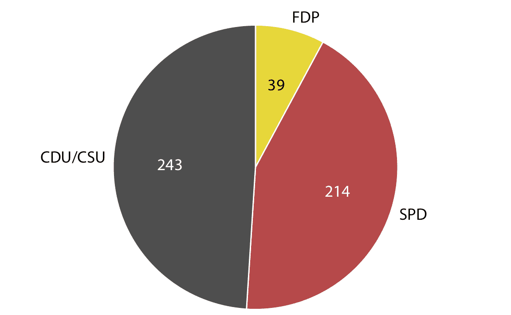

图 10.1：1976 年至 1980 年第 8 届德国联邦议院的党派组成，可视化为饼图。这种可视化清楚地表明，SPD 和 FDP 的执政联盟与反对派 CDU/CSU 相比多一小部分。

饼图将圆圈分成切片，使得每个切片的面积与其表示的总体比例成正比。可以在矩形上执行相同的过程，结果是堆叠条形图（图 10.2 ）。根据我们是垂直还是水平切割条形，我们获得垂直堆叠的条形图（图 10.2 a）或水平堆叠的条形图（图 10.2 b）。

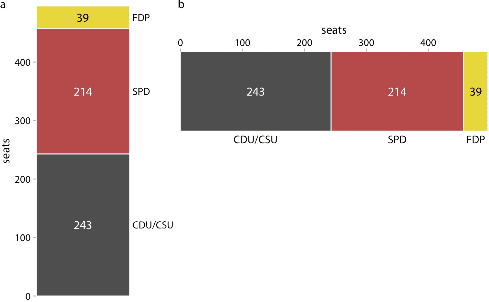

图 10.2：1976 年至 1980 年第 8 届德国联邦议院的党派组成，可视化为堆叠条形。 （a）垂直堆叠的条形。 （b）水平堆叠的条形。 SPD 和 FDP 共同拥有的席位并不比 CDU / CSU 更明显。

我们也可以从图 10.2a 中取出它们并将它们并排放置，而不是将它们堆叠在一起。这种可视化使得更容易直接比较三组，但它模糊了数据的其他方面（图 10.3）。最重要的是，在并排条形图中，每个条形与总数的关系在视觉上并不明显。

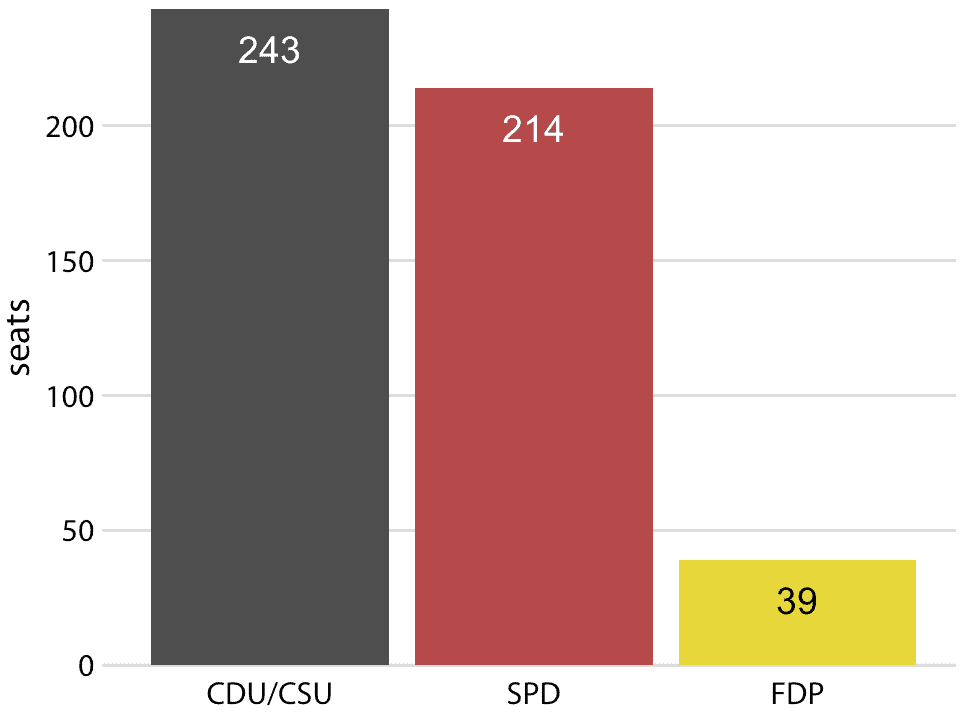

图 10.3：1976 年至 1980 年第 8 届德国联邦议院的党派组成，可视化为并排的条形。如图 10.2 所示，SPD 和 FDP 共同拥有的席位并不比 CDU / CSU 更明显。

许多作者断然拒绝饼图并赞成并排或堆叠条形图。其他人则在某些应用中坚持使用饼图。我个人认为，这些可视化中没有一个比任何其他可视化都优越。根据数据集的特征和您想要讲述的具体故事，您可能希望采用一种或另一种方法。在第 8 届德国联邦议院的情况下，我认为饼图是最好的选择。它清楚地表明，SPD 和 FDP 的共同执政联盟比 CDU / CSU 多一小部分（图 10.1）。在任何其他图中，这一事实在视觉上并不明显（图 10.2 和 10.3）。

通常，当目标是强调简单比例（例如，一半，三分之一或四分之一）时，饼图效果很好。当我们有非常小的数据集时，它们也能工作得很好。单个饼图，如图 10.1 ，看起来很好，但是如图 10.2a 中的单列堆叠条形看起来很尴尬。另一方面，堆叠条形可以用于多个条件或时间序列的并排比较，并且当我们想要直接比较各个部分时，并排条形是优选的。表 10.1 中提供了饼图，堆叠条形和并排条形的各种优缺点的摘要。

表 10.1：可视化比例的常用方法的利弊：饼图，堆叠条形图和并排条形图。

|  | 饼图 | 堆叠条形图 | 并排条形图 |
| --- | :-: | :-: | :-: |
| 将数据清楚地可视化为整体的比例 | ✔ | ✔ | ✖ |
| 可以轻松直观地比较相对比例 | ✖ | ✖ | ✔ |
| 视觉上强调简单的比例，例如 1/2, 1/3, 1/4 | ✔ | ✖ | ✖ |
| 即使对于非常小的数据集，看起来也很吸引人 | ✔ | ✖ | ✔ |
| 当整体被分成许多部分时效果很好 | ✖ | ✖ | ✔ |
| 适用于多组比例或时间序列比例的可视化 | ✖ | ✔ | ✖ |

## 10.2 并排条形的情况

我现在将演示饼图失败的情况。这个例子是在最初发布在维基百科（维基百科 2007）上的饼图评论之后建模的。考虑五家公司 A，B，C，D 和 E 的假设情景，他们的市场份额大致相当于约 20%。我们的假设数据集连续三年列出了每家公司的市场份额。当我们使用饼图可视化此数据集时，很难看到究竟发生了什么（图 10.4）。似乎公司 A 的市场份额正在增长，而公司 E 的市场份额正在缩小，但这一观察结果之外，我们无法分辨出正在发生的事情。特别是，目前尚不清楚不同公司的市场份额在每年内具体如何。

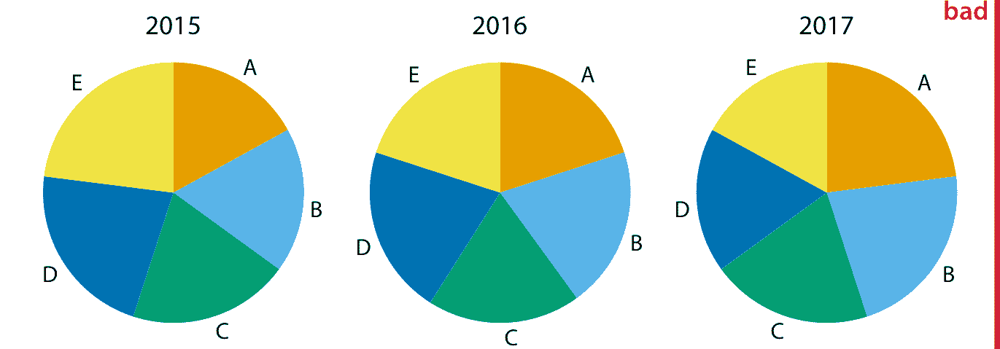

图 10.4：2015 - 2017 年五个假设公司 A-E 的市场份额，可视化为饼图。这种可视化有两个主要问题：1、几年内相对市场份额的比较几乎是不可能的，2、很难看到多年来市场份额的变化。

当我们切换到堆叠条形图时，图像会变得更清晰（图 10.5）。现在，A 公司不断增长的市场份额和 E 公司萎缩的市场份额的趋势清晰可见。但是，每年五家公司的相对市场份额仍难以比较。并且很难比较多年之内公司 B，C 和 D 的市场份额，因为这些条形在多年之内相对于彼此平移。这是堆叠条形图的一般问题，也是我通常不推荐这种可视化的主要原因。

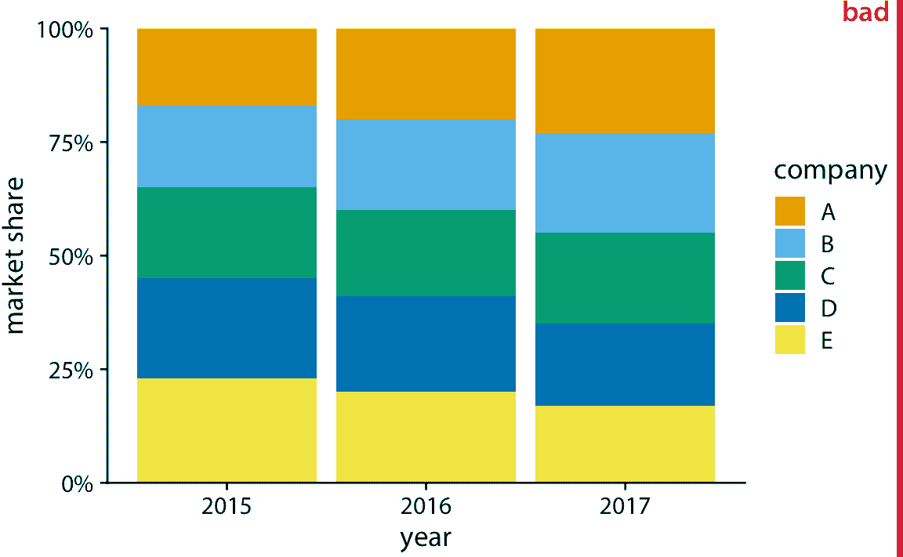

图 10.5：2015-2017 年五家假设公司的市场份额，可视化为堆叠条形图。这种可视化有两个主要问题：1、难以比较多年内的相对市场份额，2、很难看到中间的公司 B，C 和 D 多年内市场份额的变化，因为金色条形的位置会随着年份而变化。

对于这个假设数据集，并排条形是最佳选择（图 10.6 ）。这种可视化突出显示，公司 A 和 B 都在 2015 年至 2017 年间增加了市场份额，而公司 D 和 E 都减少了他们的市场份额。它还显示 A 公司到 E 公司的 2015 年市场份额依次增加，2017 年同样下降。

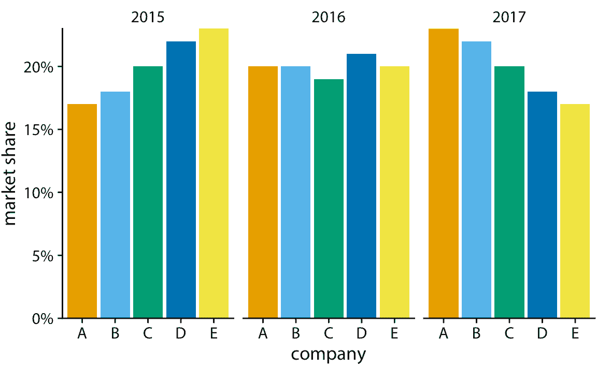

图 10.6：2015-2017 年五家假设公司的市场份额，可视化为并排条形图。

## 10.3 堆叠条和堆叠密度图的情况

在 10.2 一节中，我写道我通常不建议堆叠条形的序列，因为内部条形的位置沿着序列移动。但是，如果每个堆叠中只有两个条形，则内部条形移动的问题就会消失，在这些情况下，所得到的可视化可以非常清晰。例如，考虑一个国家议会中妇女的比例。我们将特别关注非洲国家卢旺达，截至 2016 年，卢旺达是女议员比例最高的国家之一。自 2008 年以来，卢旺达女议员占多数，自 2013 年以来，议会中近三分之二的议员是女性议员。为了想象卢旺达议会中妇女的比例随时间如何变化，我们可以绘制一系列堆叠的条形图（图 10.7）。该图为随时间变化的比例提供了直观视觉表示。为了帮助读者确切地看到大多数人变成女性的时间，我添加了 50% 的虚线水平线。没有这条线，几乎不可能确定从 2003 年到 2007 年，大部分是男性还是女性。我没有在 25% 和 75% 添加类似的线条，以避免使图形太杂乱。

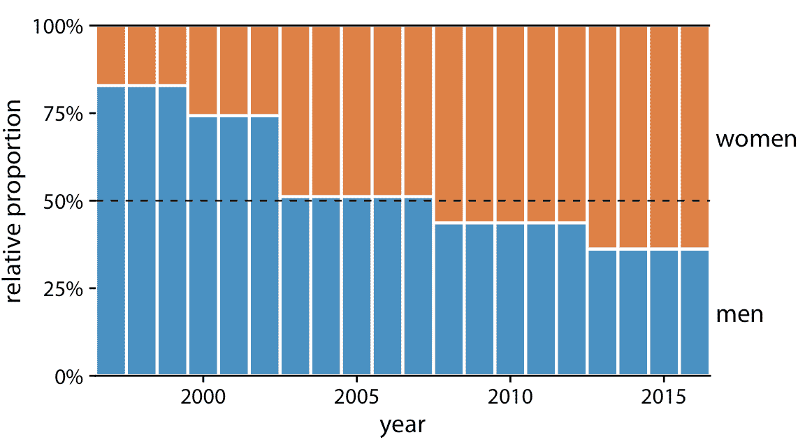

图 10.7：1997 年至 2016 年卢旺达议会性别构成的变化。数据来源：各国议会联盟（IPU），ipu.org。

如果我们希望想象比例如何变化来回应连续变量，我们可以从堆叠条形切换到堆叠密度。堆叠密度可以被认为是并排排列的无限多个无限小的堆叠条形的极限情况。堆叠密度图中的密度通常从核密度估计中获得，如第七章所述，我将向您推荐这一章，其中对该方法的优缺点进行了一般性讨论。

举一个堆叠密度可能合适的例子，考虑人的健康状况随年龄的变化。年龄可以被认为是一个连续变量，以这种方式可视化数据工作得相当好（图 10.8）。虽然我们这里有四个健康类别，而且我通常不喜欢堆叠多个条件，如上所述，我认为在这种情况下这个图形是可以接受的。我们可以清楚地看到，随着人们年龄的增长，整体健康状况会下降，我们也可以看到，尽管有这种趋势，但超过一半的人口在年老之前仍保持良好或很棒的健康状态。

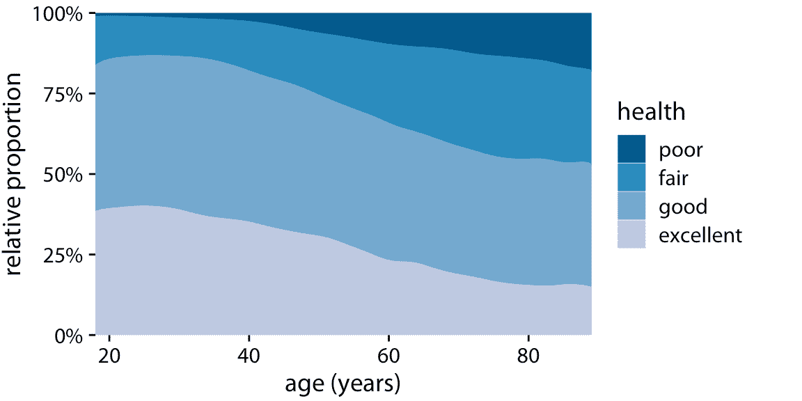

图 10.8：一般社会调查（GSS）报告的不同年龄的健康状况。

然而，这个图形有一个主要的局限性：通过将四种健康状况的比例可视化为总数的百分比，该图形模糊了数据集中的年轻人比老年人多得多。因此，尽管报告健康的人的百分比在七十年的年龄段内大致保持不变，但健康状况良好的人的绝对数量，随着特定年龄的人口总数下降而下降。我将在下一节介绍这个问题的潜在解决方案。

## 10.4 将比例分别展示为总数的一部分

并排条形具有这样的问题：它们不能清楚地展示各个部分相对于整体的大小，并且堆叠条形具有不能容易地比较不同的条形的问题，因为它们具有不同的基线。我们可以通过为每个部分制作单独的图，并且在每个图中展示相对于整体的相应部分，来解决这两个问题。对于图 10.8 的健康数据集，该过程得到图 10.9。数据集中的总体年龄分布显示为灰色阴影区域，每个健康状态的年龄分布显示为蓝色。这个图形突出显示，从绝对意义上讲，健康状况优秀或健康状况良好的人数在 30-40 岁之间下降，而健康一般的人数在各个年龄段都保持不变。

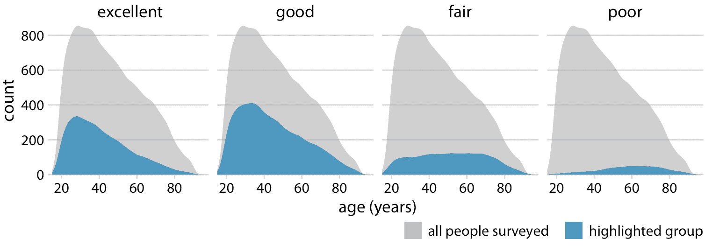

图 10.9：不同年龄的健康状况，显示为调查中总人数的比例。彩色区域显示具有相应健康状况的人的年龄的密度估计，并且灰色区域显示总体年龄分布。

为了提供第二个例子，让我们考虑来自同一调查的不同变量：婚姻状况。随着年龄的增长，婚姻状况的变化远远大于健康状况，婚姻状况与年龄的叠加密度图并不十分可读（图 10.10）。

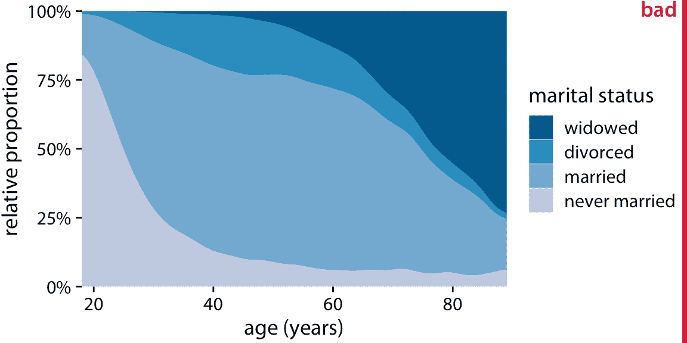

图 10.10：一般社会调查（GSS）所报告的不同年龄的婚姻状况。为了简化图形，我删除了少数报告为分开的案例。我把这个图形称为“不亮”，因为从未结婚或丧偶的人的频率随着年龄的增长而变化非常大，以至于已婚和离婚的人的年龄分布高度扭曲且难以解释。

可视化为部分密度的相同数据集更清晰（图 10.11 ）。特别是，我们看到已婚人口的比例在 30-40 岁末期达到峰值，离婚人口的比例在 40-50 岁初期达到峰值，而丧偶人口的比例在 70-80 岁中期达到峰值。

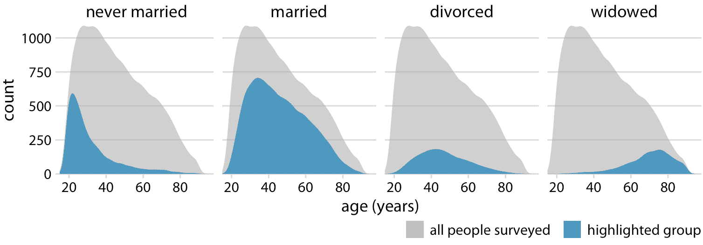

图 10.11：不同年龄的婚姻状况，显示为调查中总人数的比例。彩色区域显示具有相应婚姻状况的人的年龄的密度估计，并且灰色区域显示总体年龄分布。

然而，图 10.11 的一个缺点是，这种表示不容易确定任何给定时间点的相对比例。例如，如果我们想知道在什么年龄超过 50% 的受访者都已婚，我们不能轻易地从图 10.11 中看出。为了回答这个问题，我们可以使用相同类型的显示，但显示相对比例而不是沿 *y* 轴的绝对计数（图 10.12）。现在我们看到已婚人口在 20 多岁时开始占多数，而丧偶人口在 70-80 岁中期开始占多数。

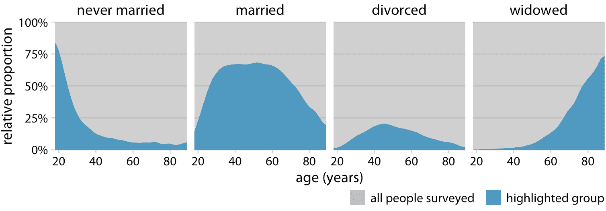

图 10.12：不同年龄的婚姻状况，显示为调查中总人数的比例。蓝色区域显示给定年龄的具有相应的状况的人口百分比，灰色区域显示具有所有其他婚姻状况的人口百分比。

### 参考

```
Wikipedia, User:Schutz. 2007. “File:Piecharts.svg.” https://en.wikipedia.org/wiki/File:Piecharts.svg.
```