# 12 可视化两个或多个定量变量之间的关联

> 原文： [12 Visualizing associations among two or more quantitative variables](https://serialmentor.com/dataviz/visualizing-associations.html)

> 校验：[飞龙](https://github.com/wizardforcel)

> 自豪地采用[谷歌翻译](https://translate.google.cn/)

许多数据集包含两个或更多个定量变量，我们可能对这些变量如何相互关联感兴趣。例如，我们可能有一个不同动物的量化测量值数据集，例如动物的身高，体重，长度和日常能量需求。仅绘制两个这样的变量的关系，例如：身高和体重，我们通常会使用散点图。如果我们想一次显示两个以上的变量，我们可能会选择气泡图，散点图矩阵或相关图。最后，对于非常高维的数据集，执行降维可能是有用的，例如以主成分分析的形式。

## 12.1 散点图

我将使用在 123 只蓝色杰伊鸟上进行的测量值数据集，来演示基本散点图及其若干变体。数据集包含每只鸟的头部长度（从头部的尖端到头部后部测量），头骨大小（头部长度减去喙部长度）以及体重等信息。我们希望这些变量之间存在关系。例如，具有较长喙部的鸟类预计具有较大的头骨大小，具有较大体重的鸟类应具有比具有较小体重的鸟类更大的喙部和头骨。

为了探索这些关系，我先从头部长度与体重的关系图开始（图 12.1）。在该图中，头长度沿 *y* 轴显示，体重沿 *x* 轴显示，每只鸟用一个点表示。 （注意术语：我们说，我们根据沿 *x* 轴显示的变量绘制沿 *y* 轴显示的变量。）点形成一个分散的云（因此术语是散点图），但毫无疑问，一个趋势是，体重较大的鸟类有更长的头部。头部最长的鸟接近观察到的最大体重，头部最短的鸟接近观察到的最小体重。

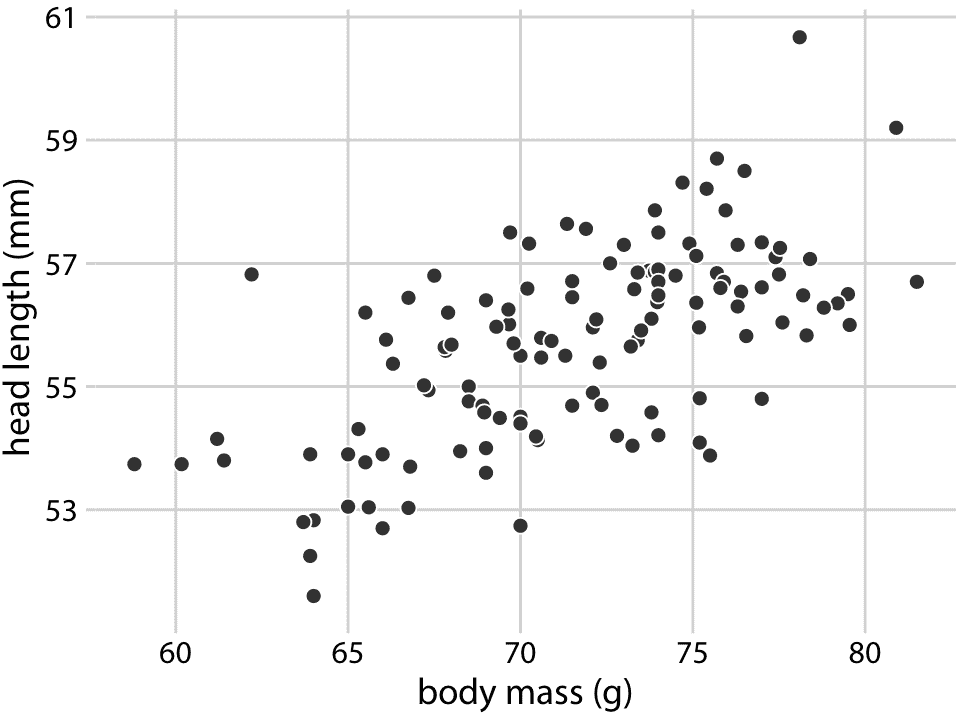

图 12.1：头部长度（从喙部尖端到头部后部测量，单位为 mm）与体重（以克为单位），123 个蓝颜色刻度记。每个点对应一只鸟。倾向是较重的鸟类有较长的头部。数据来源：欧柏林学院的 Keith Tarvin

蓝色杰伊数据集鸟包含雄鸟和雌鸟，我们可能想知道头长和体重之间的总体关系是否对每个性别分别成立。为了解决这个问题，我们可以按照鸟的性别对散点图中的点进行着色（图 12.2 ）。该图显示头部长度和体重的总体趋势，至少部分是由鸟类的性别驱动的。在相同的体重下，雌性的头部往往比雄性短。与此同时，雌性平均比雄性轻。

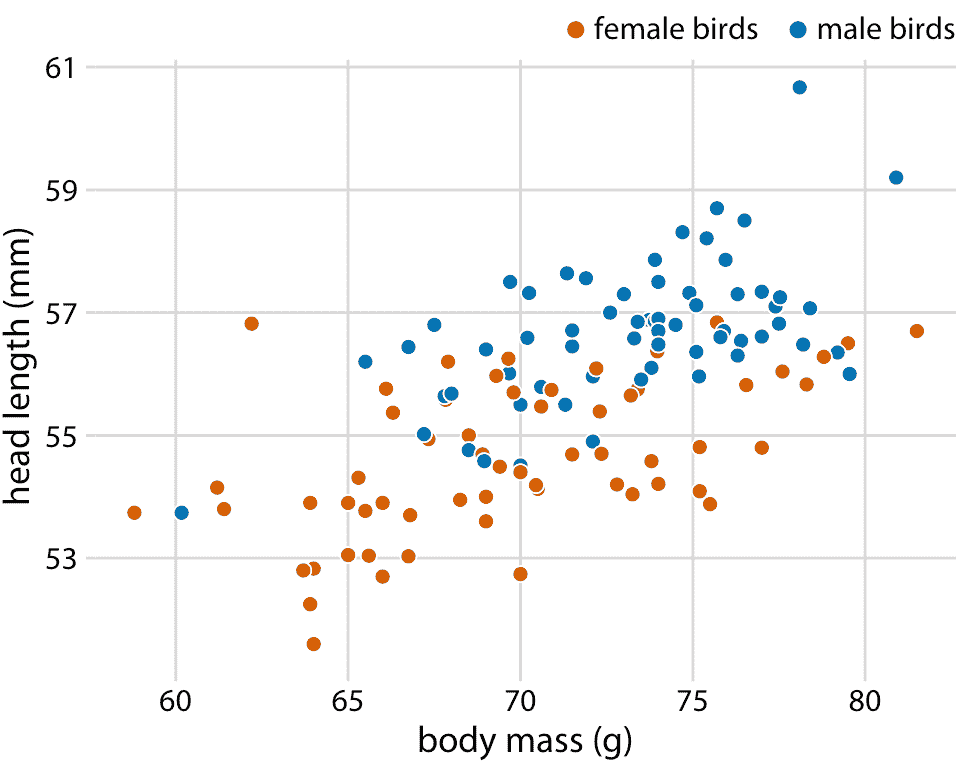

图 12.2：123 只蓝鸟的头长与体重的关系。鸟的性别用颜色表示。在相同的体重下，雄鸟往往比雌鸟头更长（特别是更长的喙部）。数据来源：欧柏林学院的 Keith Tarvin

因为头部长度被定义为从喙尖到头部后部的距离，所以较大的头部长度可能意味着较长的喙，较大的头骨或两者。我们可以通过查看数据集中的另一个变量（头骨大小）来理清喙部长度和头骨大小，这与头长相似但不包括喙部。由于我们已经将 *x* 位置用于体重，*y* 位置用于头部长度 和点的颜色用于鸟类性别，我们需要另一种美学来绘制头骨大小。一种选择是使用点的大小，产生称为气泡图的可视化（图 12.3）。

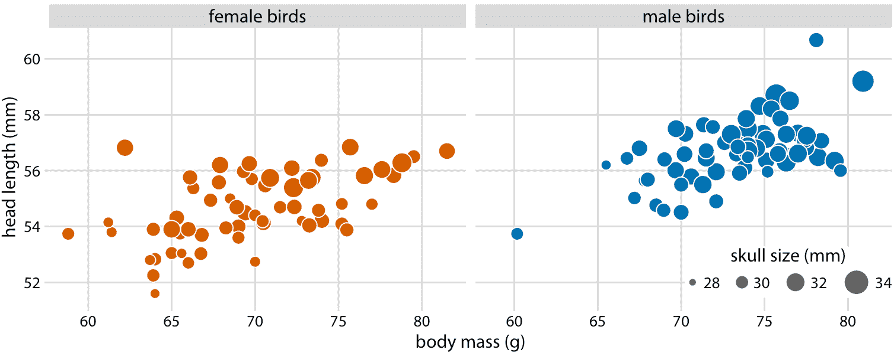

图 12.3：123 只蓝鸟的头长与体重的关系。鸟的性别用颜色表示，鸟的头骨大小用标记大小表示。头部长度测量值包括喙部的长度，而头骨大小测量值则不包括。头部长度和头骨大小往往是相关的，但是有些鸟类的头骨大小非常长或短。数据来源：欧柏林学院的 Keith Tarvin

气泡图的缺点是它们显示相同类型的变量，定量变量，具有两种不同类型的比例，位置和大小。这使得难以在视觉上确定各种变量之间的关联强度。此外，编码为气泡大小的数据值之间的差异，比编码为位置的数据值之间的差异更难以察觉。因为即使最大的气泡与总的图形尺寸相比也需要稍微小一些，即使最大和最小气泡之间的尺寸差异也必然很小。因此，数据值的较小差异将对应于实际上不可能看到的非常小的尺寸差异。在图 12.3 中，我使用了一个尺寸映射，可以直观地放大最小的头骨（大约 28mm）和最大的头骨（大约 34mm）之间的差异，但很难确定头骨大小和体重或头部长度之间的关系。

作为气泡图的替代方案，最好显示一个根据全部变量的散点图矩阵，其中每个单独的图显示两个数据维度（图 12.4 ）。该图清楚地表明，除了雌鸟往往稍微小一些之外，雌性和雄性鸟的头骨大小和体重之间的关系是相似的。然而，头部长度和体重之间的关系也是如此。不同性别有着显著的差异。雄性鸟类的喙部通常比雌性鸟类更长，其他变量相同。

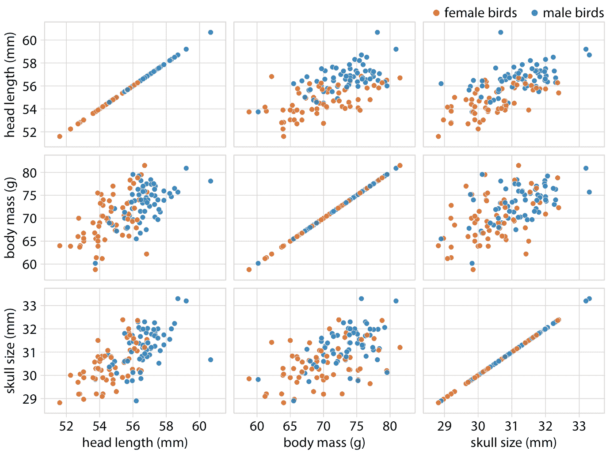

图 12.4：123 只蓝鸟的头部长度，体重和头骨大小的散点图矩阵。该图显示了与图 12.2 完全相同的数据。然而，因为我们更善于判断位置而不是标记大小，所以在成对散点图中，头骨大小和其他两个变量之间的相关性比图 12.2 更容易察觉。数据来源：欧柏林学院的 Keith Tarvin

## 12.2 相关图

当我们有超过三到四个量化变量时，散点图矩阵很快变得难以处理。在这种情况下，量化变量对之间的关​​联量并使该数量可视化而不是原始数据更有用。一种常见的方法是计算相关系数。相关系数 *r* 是介于 -1 和 1 之间的数字，用于衡量两个变量的变化程度。 *r = 0* 的值意味着没有任何关联，并且值 1 或 -1 表示完美关联。相关系数的符号表示变量是正相关（一个变量中的较大值与另一个变量中的较大值一致）或负相关（一个变量中的较大值与另一个中的较小值一致）。为了提供不同相关强度的可视化示例，在图 12.5 中，我显示了随机生成的点集，这些点在 *x* 和 *y* 的相关程度上有很大差异。

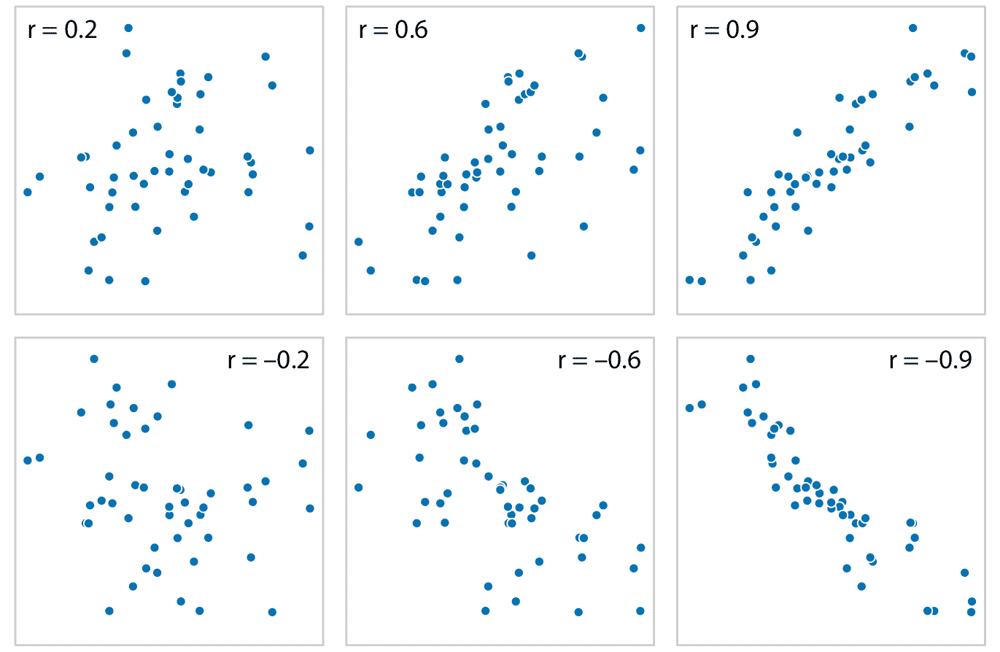

图 12.5：不同幅度和方向的相关性示例，以及相关的相关系数 *r* 。在这两行中，从左到右的相关性从弱到强。在顶行中，相关性为正（一个量的较大值与另一个量的较大值相关联），在底行中它们为负（一个量的较大值与另一个量的较小值相关联）。在所有六个图中， *x* 和 *y* 值的集合是相同的，但是个体 *x* 和 *y* 值之间的配对已经重组来产生指定的相关系数。

相关系数定义为

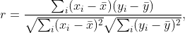

其中 $x_i$ 和 $y_i$ 是两组观测值，$\bar x$ 和 $\bar y$ 是相应的样本均值。我们可以从这个公式中观察到一些事情。首先，公式在 $x_i$ 和 $y_i$ 中是对称的，因此 *x* 与 *y* 的相关性与 *y* 与 *x* 的相关性相同。其次，单个值 $x_i$ 和 $y_i$ 仅在相应样本均值的差的上下文中输入公式，因此如果我们以恒定的量移动整个数据集，例如对于某些常数 $C$，我们用 $x_i'= x_i + C$ 替换 $x_i$，相关系数保持不变。第三，如果我们重新调整数据，$x_i'= C x_i$，相关系数也保持不变，因为常数 $C$ 将出现在公式的分子和分母中，因此可以约分。

相关系数的可视化称为相关图。为了说明相关图的使用，我们将考虑在取证工作期间获得的 200 多个玻璃碎片的数据集。对于每个玻璃碎片，我们测量其成分，表示为各种矿物氧化物的重量百分比。我们测量了七种不同的氧化物，总共产生 6 + 5 + 4 + 3 + 2 + 1 = 21 对成对相关性。我们可以将这 21 个相关性一次显示为彩色方块矩阵，其中每个方块代表一个相关系数（图 12.6 ）。该相关图允许我们快速掌握数据的趋势，例如镁与几乎所有其他氧化物负相关，并且铝和钡具有强烈的正相关性。

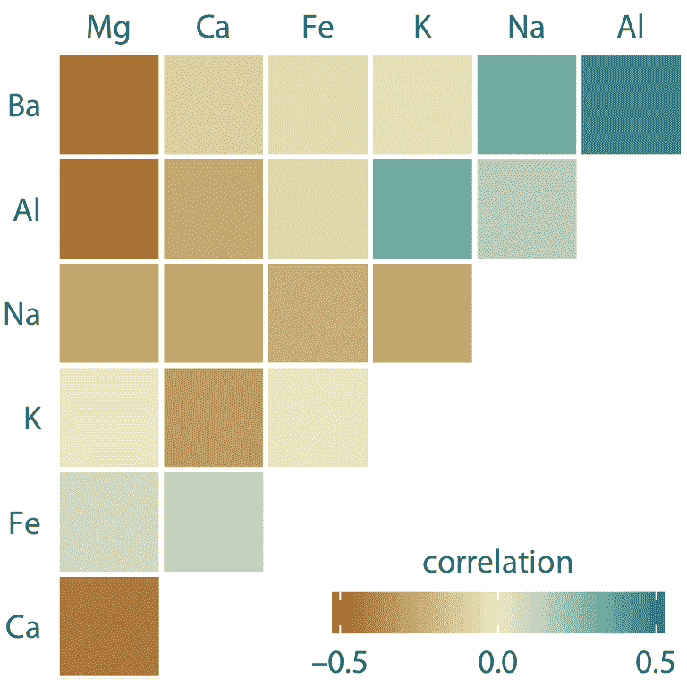

图 12.6：取证工作期间获得的 214 个玻璃碎片样本的矿物质含量相关性。该数据集包含七个变量，用于测量每个玻璃片段中发现的镁（Mg），钙（Ca），铁（Fe），钾（K），钠（Na），铝（Al）和钡（Ba）的含量。彩色方块表示这些变量对之间的相关性。数据来源：B. German

图 12.6 的相关图的一个弱点是低相关性，即绝对值在零附近的相关性，不应该像这样在视觉上被抑制。例如，镁（Mg）和钾（K）完全没有相关性，但图 12.6 没有立即显示出来。为了克服这个限制，我们可以将相关性显示为彩色圆圈，并使用相关系数的绝对值来缩放圆形大小（图 12.6 ）。以这种方式，低相关性被抑制并且高相关性更好地突出。

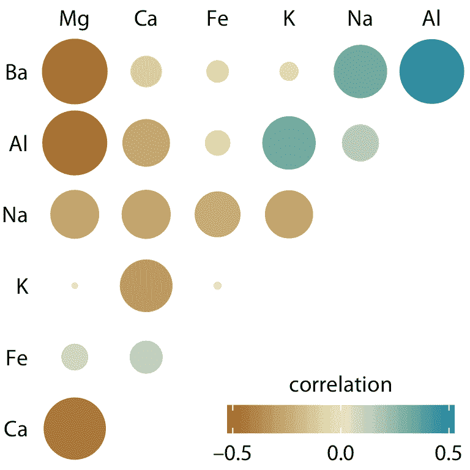

图 12.7：取证玻璃样本中矿物质含量的相关性。颜色刻度与图 12.6 相同。但是，现在每个相关的幅度也以彩色圆圈的大小编码。这种选择在视觉上不强调相关性接近于零的情况。数据来源：B. German

所有相关图都有一个重要的缺点：它们相当抽象。虽然它们向我们展示了数据中的重要模式，但它们也隐藏了基础数据点，并可能使我们得出错误的结论。最好是可视化原始数据，而不是从中计算出的抽象的派生数量。幸运的是，我们经常可以在显示重要模式和通过应用降维技术显示原始数据之间找到一个平衡。

## 12.3 降维

降维依赖于一个关键视角，即大多数高维数据集由多个相关变量组成，这些变量传达重叠信息。这样的数据集可以减少到较少数量的关键维度，而不会丢失太多关键信息。作为一个简单直观的例子，考虑一个人的多种身体特征的数据集，包括每个人的身高和体重，手臂和腿的长度，腰部，臀部和胸部的周长等数量。我们可以立即理解，所有这些数量将首先与每个人的总体规模相关。在其他条件相同的情况下，较大的人会更高，体重更重，手臂和腿更长，腰围，臀部和胸围更大。下一个重要的维度是人的性别。男性和女性的测量值对于大小相似的人来说是显着不同的。例如，女人的臀围往往比男人高，其他一切都是一致的。

有许多降维的技术。我将在这里讨论一种最常用的技术，称为主成分分析（PCA）。 PCA 通过数据中原始变量的线性组合引入一组新的变量（称为主成分，PC），原始变量标准化为零均值和单位方差（参见图 12.8 ，用于二维玩具示例） 。选择主成分使得它们不相关，并且对它们进行排序，使得第一个成分捕获数据中尽可能大的变化量，并且随后的成分捕获越来越少的变化量。通常，只能从前两或三个主成分中看到数据中的关键特征。

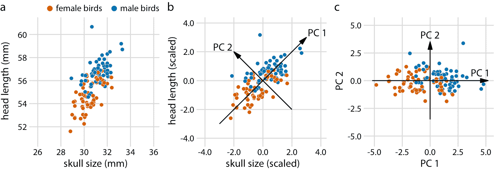

图 12.8：二维示例主成分（PC）分析。 （a）原始数据。作为示例数据，我使用蓝鸟数据集中的头长和头骨大小测量值。雌鸟和雄鸟以颜色区分，但这种区分对主成分分析没有影响。 （b）作为 PCA 的第一步，我们将原始数据值缩放为零均值和单位方差。然后，我们沿着数据的最大变化方向定义新变量（主成分，PC）。 （c）最后，我们将数据投影到新坐标中。在数学上，该投影相当于数据点在原点周围的旋转。在此处显示的 2D 示例中，数据点顺时针旋转 45 度。

当我们执行 PCA 时，我们通常对两条信息感兴趣：（i）主成分的组成和（ii）主成分空间中各个数据点的位置。让我们在取证玻璃数据集的主成分分析中看一下这两部分。

首先，我们来看主成分组成（图 12.9）。在这里，我们只考虑前两个成分，PC1 和 PC2。因为 PC 是原始变量（在标准化之后）的线性组合，我们可以将原始变量表示为箭头，指示它们对主成分的贡献程度。在这里，我们看到钡和钠主要贡献于 PC1 而不是 PC2，钙和钾主要贡献于 PC2 而不是 PC1，其他变量对两种成分的贡献不同（图 12.9）。箭头的长度各不相同，因为有两个以上的主成分。例如，铁的箭头特别短，因为它主要用于高阶主成分（未示出）。

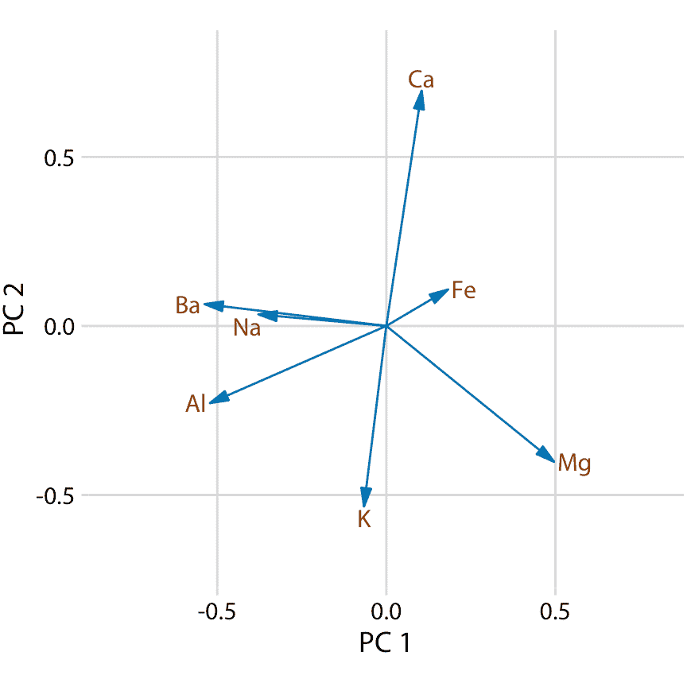

图 12.9：取证玻璃数据集的主成分分析（PCA）中前两个成分的组成。主成分 1（PC 1）主要测量玻璃碎片中铝，钡，钠和镁含量，而主成分 2（PC 2）主要测量钙和钾含量，并在一定程度上测量铝和镁的含量。

接下来，我们将原始数据投影到主成分空间（图 12.10 ）。我们在该图中看到了不同类型的玻璃碎片的清晰聚类。来自前照灯和车窗的碎片落入 PC 图中清晰描绘的几个区域，几乎没有离群点。来自餐具和容器的碎片更加分散，但与前照灯和窗户碎片明显不同。通过比较图 12.10 和图 12.9 ，我们可以得出结论，窗户样本的镁含量高于平均值，钡，铝和钠含量低于平均值，而前照灯样本相反。

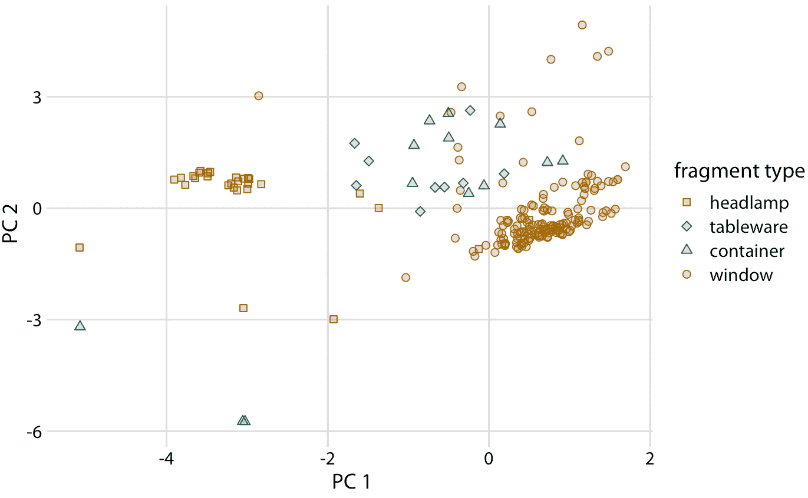

图 12.10：单个玻璃碎片的组成，在 12.9 中定义的主成分空间中可视化。我们看到不同类型的玻璃样本聚集在不同 PC1 和 2 的特征值上。特别是，前照灯的特征是负 PC1 值，而窗户倾向于具有正 PC1 值。餐具和容器的 PC1 值接近零，并且往往具有正 PC2 值。但是，有一些例外情况，容器碎片同时具有负 PC1 值和负 PC2 值。这些碎片的组成与所分析的所有其他碎片完全不同。

## 12.4 配对数据

多变量定量数据的一个特例是配对数据：在略微不同的条件下，有两个或多个相同数量的测量值的数据。示例包括每个受试者的两个类似测量值（例如，人的右臂和左臂的长度），在不同时间点对同一受试者的重复测量值（例如，一年中两个不同时间的人的体重），或两个密切相关的主题的测量值（例如，两个同卵双胞胎的高度）。对于配对数据，可以合理地假设，属于一对的两个测量值，而不是其他对的测量值彼此更相似。两个双胞胎的高度大约相同，但高度与其他双胞胎不同。因此，对于配对数据，我们需要选择可突出配对测量之间任何差异的可视化。

在这种情况下，一个很好的选择是在对角线上标记 *x = y* 的简单散点图。在这样的图中，如果每对的两个测量值之间的唯一差异是随机噪声，那么样本中的所有点将围绕该线对称地分布。相比之下，配对测量值之间的任何系统差异，将在数据点相对于对角线向上或向下的系统移位中可见。例如，考虑一下 1970 年和 2010 年 166 个国家的人均二氧化碳（CO2）排放量（图 12.11 ）。此示例突出显示配对数据的两个常见特征。首先，大多数点相对接近对角线。尽管各国的 CO2 排放量差异超过近四个数量级，但在 40 年的时间跨度内，每个国家的排放量相当一致。其次，这些点相对于对角线系统地向上移动。在所考虑的 40 年中，大多数国家的 CO2 排放量增加。

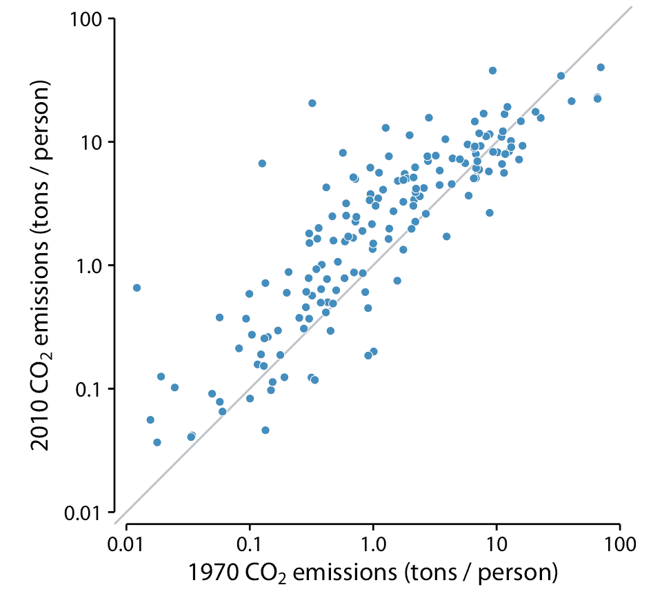

图 12.11：1970 年和 2010 年，166 个国家的人均二氧化碳（CO2）排放量。每个点代表一个国家。对角线表示 1970 年和 2010 年的相同 CO2 排放量。这些点相对于对角线系统地向上移动：在大多数国家，2010 年的排放量高于 1970 年。数据来源：二氧化碳信息分析中心

当我们有大量数据点，和/或对整个数据集与零期望的系统偏差感兴趣时，图 12.11 这样的散点图很有效。相比之下，如果我们只有少量的观测值，并且主要对每个个例的身份感兴趣，那么斜率图可能是更好的选择。在斜率图中，我们将各个测量值绘制为排列成两列的点，并通过将成对的点与线连接来表示偶对。每条线的斜率突出了变化的幅度和方向。图 12.12 使用这种方法显示 2000 年至 2010 年间人均 CO2 排放量差异最大的 10 个国家。

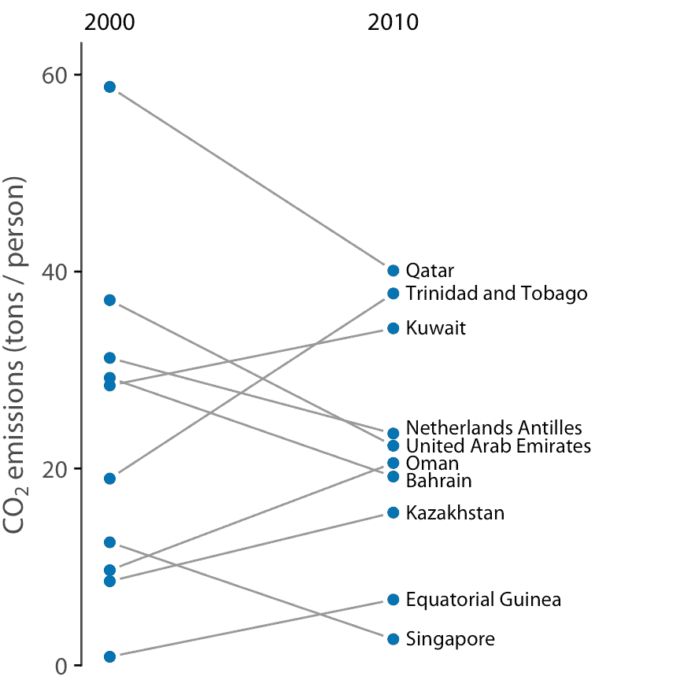

图 12.12：2000 年和 2010 年人均二氧化碳（CO2）排放量，显示差异最大的十个国家。数据来源：二氧化碳信息分析中心

与散点图相比，斜率图具有一个重要优势：它们可用于一次比较两个以上的测量值。例如，我们可以修改图 12.12 来显示三个时间点的 CO2 排放量，这里是 2000 年，2005 年和 2010 年（图 12.13 ）。这一选择突出了整个十年排放量发生重大变化的国家，以及卡塔尔或特立尼达和多巴哥等国家，它们的第一个和第二个五年间隔的趋势有很大差异。

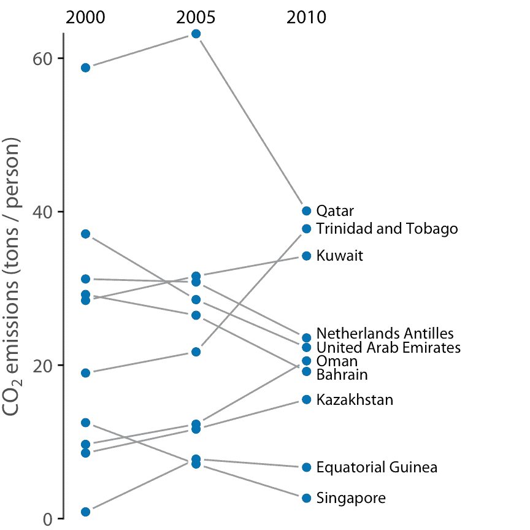

图 12.13：2000 年，2005 年和 2010 年人均 CO2 排放量，显示差异最大的 10 个国家。数据来源：二氧化碳信息分析中心