# 13 可视化自变量的时间序列和其他函数

> 原文： [13 Visualizing time series and other functions of an independent variable](https://serialmentor.com/dataviz/time-series.html)

> 校验：[飞龙](https://github.com/wizardforcel)

> 自豪地采用[谷歌翻译](https://translate.google.cn/)

前一章讨论了散点图，其中我们根据一个定量变量绘制了另一个定量变量。当两个变量中的一个可以被认为是时间时会出现一种特殊情况，因为时间会对数据施加额外的结构。现在数据点具有固有的顺序；我们可以按照时间增加的顺序排列点，并为每个数据点定义前导和后继。我们经常希望用折线图来可视化这个时间顺序。然而，折线图不限于时间序列。只要数据可以按照一个变量排序，它们就是合适的。例如，在受控实验中也出现这种情况，其中治疗变量有目的地设定为一系列不同的值。如果我们有多个依赖于时间的变量，我们可以绘制单个折线图，也可以绘制规则的散点图，然后绘制直线来连接时间上相邻的点。

## 13.1 单个时间序列

作为时间序列的第一个演示，我们将考虑生物学预印本每月提交的模式。预印本是研究人员在正式同行评审和在科研期刊上发表之前，在线发表的学术文章。预印本服务器 bioRxiv 成立于 2013 年 11 月，专门面向从事生物科学研究的研究人员，自那以后，每月提交的作品大幅增长。我们可以通过制作一种散点图来可视化这种增长（第 12 章），其中我们绘制了代表每个月提交数量的点（图 13.1）。

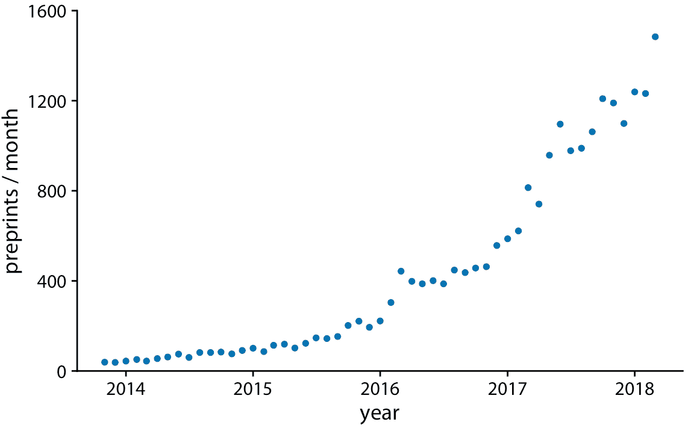

图 13.1：从 2014 年 11 月到 2018 年 4 月，预印本服务器 bioRxiv 的每月提交量。每个点代表一个月内提交量。在整个 4.5 年期间，提交量一直在稳步增加。数据来源：Jordan Anaya，[prepubmed.org](http://www.prepubmed.org/)

然而，图 13.1 与第 12 章中讨论的散点图之间存在重要差异。在图 13.1 中，点沿着 *x* 轴均匀分布，并且它们之间有一个确定的顺序。每个点只有一个左边和一个右边的邻居（除了最左边和最右边的点，每个点只有一个邻居）。我们可以通过用直线连接相邻点来在视觉上强调这个顺序（图 13.2）。这样的图被称为折线图。

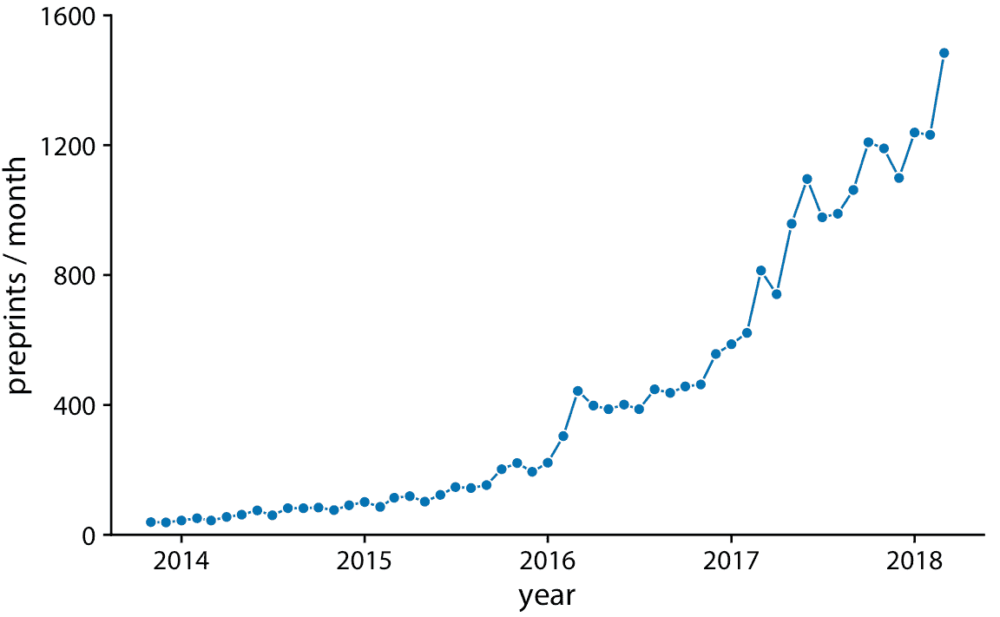

图 13.2：预印本服务器 bioRxiv 的每月提交量，显示为由线连接的点。这些线不代表数据，但仅作为眼睛的向导。通过用直线连接各个点，我们强调点之间有一个顺序，每个点恰好有一个前面的相邻点和后面的一个相邻点。数据来源：Jordan Anaya，[prepubmed.org](http://www.prepubmed.org/)

有些人反对在点之间绘制线条，因为线条不代表观察到的数据。特别是，如果只有很少的观测值，距离相隔很远，那么在中间时间进行观测时，它们可能不会精确地落在所示的线上。因此，在某种意义上，线对应于补充数据。然而，当点间隔很远或间距不均匀时，它们可能有助于感知。我们可以通过在图形标题中指出它来解决这个难题，例如通过写“直线作为眼睛的向导”（参见图 13.2 的标题）。

然而，使用直线来表示时间序列，并且通常完全省略点，是通常可接受的做法（图 13.3）。没有点，该图更加强调数据的整体趋势，而不是单个观测值。没有点的图形在视觉上也不那么嘈杂。一般来说，时间序列越密集，用点来表示单个观测值就越不重要。对于此处显示的预印本数据集，我认为省略这些点很好。

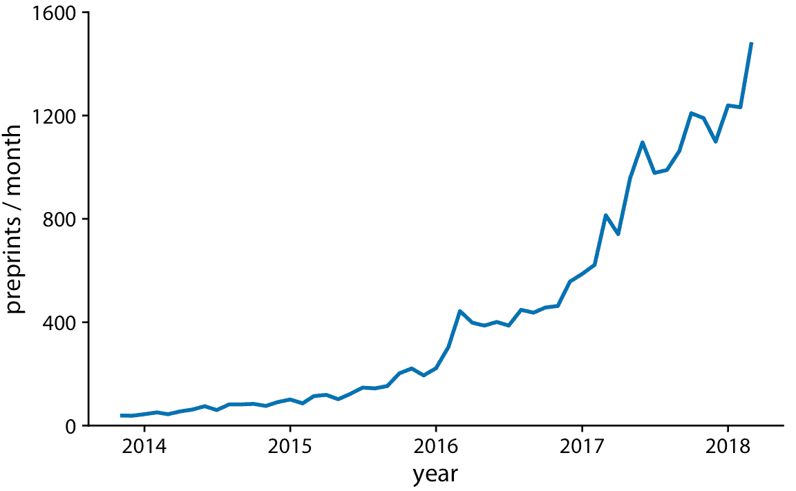

图 13.3：预印本服务器 bioRxiv 的每月提交量，显示为没有点的折线图。点的省略强调整体时间趋势，同时强调特定时间点处的个别观测值。当时间点的间隔非常密集时，它特别有用。数据来源：Jordan Anaya，[www.prepubmed.org](http://www.prepubmed.org/)

我们也可以用纯色填充曲线下区域（图 13.4 ）。这种选择进一步强调了数据的总体趋势，因为它在视觉上将曲线上方的区域与下方区域分开。但是，此可视化仅在 *y* 轴从零开始时有效，因此每个时间点处的阴影区域高度表示该时间点的数据值。

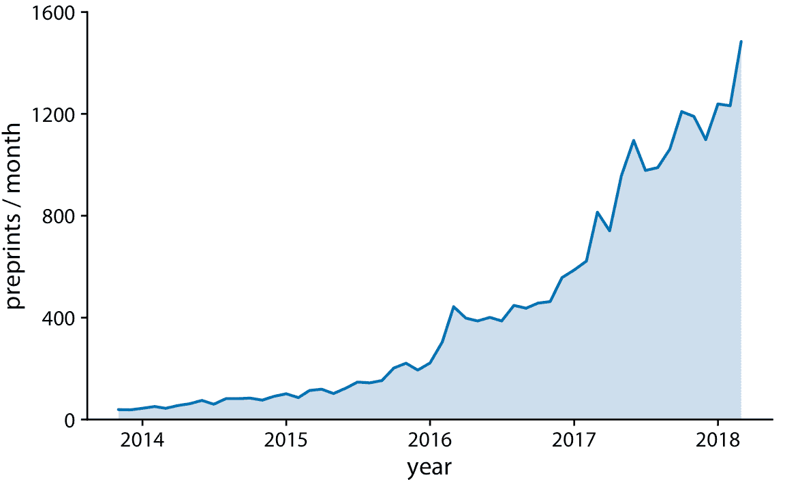

图 13.4：预印本服务器 bioRxiv 的每月提交量，显示为折线图和下侧填充区域。通过填充曲线下区域，我们更加强调总体时间趋势，而不是仅仅画一条线（图 13.3）。数据来源：Jordan Anaya，[prepubmed.org](http://www.prepubmed.org/)

## 13.2 多个时间序列和剂量反应曲线

我们经常有多个时间序列，我们想要一次显示它们。在这种情况下，我们必须更加谨慎地绘制数据，因为图形可能会变得混乱或难以阅读。例如，如果我们想要显示每月向多个预印本服务器提交的内容，则散点图不是一个好主意，因为各个时间序列相互碰撞（图 13.5）。用直线连接点可以缓解这个问题（图 13.6）。

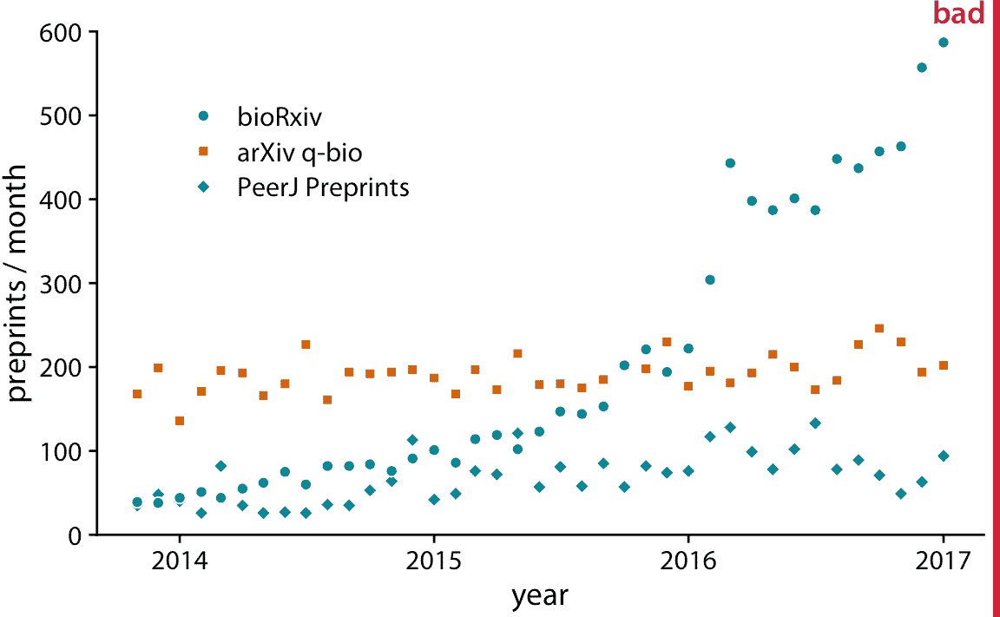

图 13.5：生物医学研究相关的三个预印本服务器的每月提交量：bioRxiv，arXiv 的 q-bio 部分和 PeerJ Preprints。每个点代表一个月内相应预印本服务器的提交数量。这个图形被标记为“不好”，因为这三个时间序列在视觉上相互干扰并且难以阅读。数据来源：Jordan Anaya，[prepubmed.org](http://www.prepubmed.org/)

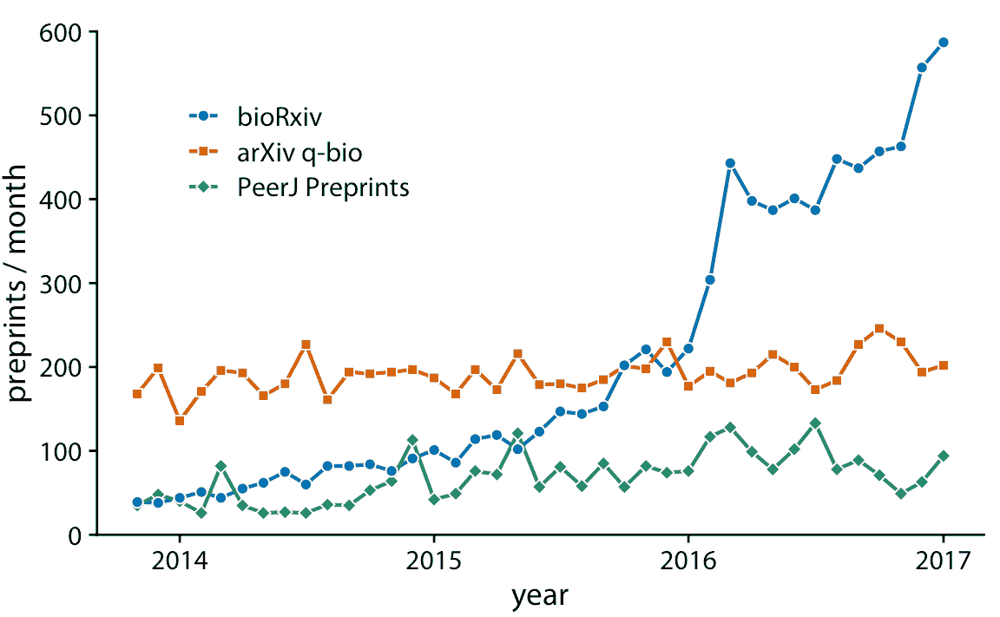

图 13.6：生物医学研究相关的三个预印本服务器的每月提交量。通过使用线连接图 13.5 中的点，我们帮助观众跟踪每个时间序列。数据来源：Jordan Anaya，[prepubmed.org](http://www.prepubmed.org/)

图 13.6 表示预印本数据集的可接受的可视化。但是，单独的图例会产生不必要的认知负担。我们可以通过直接标记线条来减少这种认知负担（图 13.7 ）。我们还消除了该图中的各个点，结果比原始起点图 13.5 更加流畅和易读。

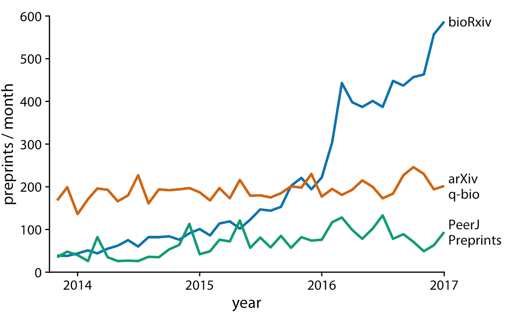

图 13.7：生物医学研究相关的三个预印本服务器的每月提交量。通过直接标记线条而不是提供图例，我们减少了读取图形所需的认知负担。消除图例消除了对不同形状点的需求。因此，我们可以通过消除点来进一步简化图形。数据来源：Jordan Anaya， [www.prepubmed.org](http://www.prepubmed.org/)

折线图不限于时间序列。只要数据点具有自然顺序，由沿 *x* 轴显示的变量反映，它们就是合适的，因此相邻点可以用线连接。例如，这种情况在剂量 - 反应曲线中出现，我们测量改变实验中的一些数值参数（剂量），如何影响感兴趣的结果（响应）。图 13.8 显示了这种类型的经典实验，根据增加的受精量来测量燕麦产量。折线图可视化突出了对于所考虑的三种燕麦品种，剂量 - 响应曲线如何具有相似的形状，但在没有受精的情况下起点不同（即一些品种具有比其他品种更高的产量）。

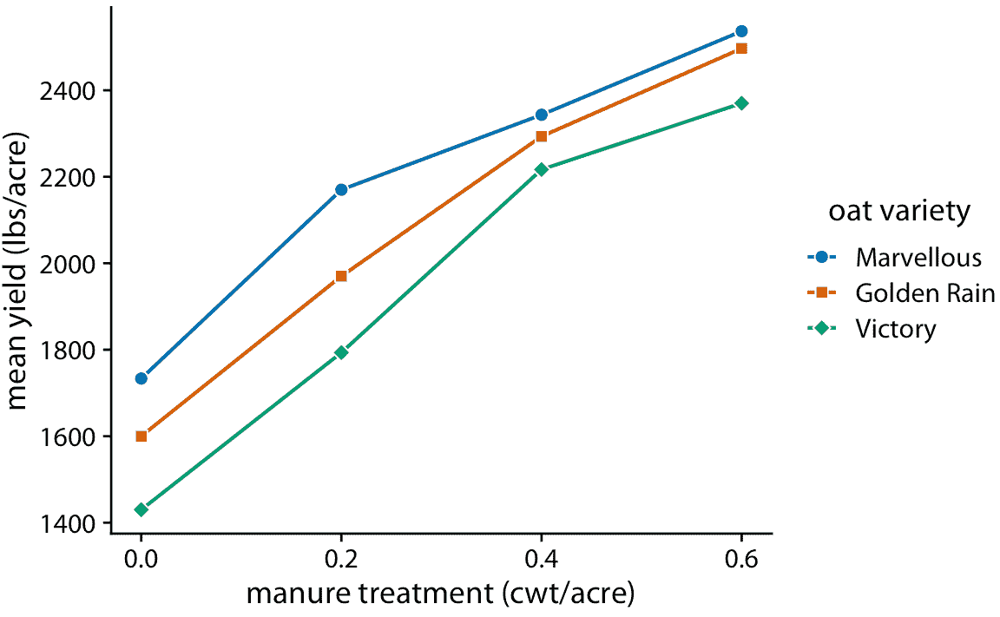

图 13.8：剂量 - 反应曲线显示了粪肥施肥后燕麦品种的平均产量。有了粪肥作为氮源，燕麦产量通常随着氮的增加而增加，无论品种是什么。这里，粪肥施用量以英担（cwt）计。英担是一个旧的英制单位，等于 112 磅或 50.8 千克。数据源：Yates（1935）

## 13.3 两个或多个响应变量的时间序列

在前面的例子中，我们只处理了一个响应变量的时间过程（例如，每月的预印本提交量或燕麦产量）。但是，拥有多个响应变量并不罕见。这种情况通常出现在宏观经济学中。例如，我们可能对过去 12 个月房价的变化感兴趣，因为它与失业率有关。我们可以预期，当失业率较低时房价会上涨，反之亦然。

鉴于前面小节中的工具，我们可以将这些数据可视化为两个相互叠加的独立折线图（图 13.9 ）。该图直接显示了两个感兴趣的变量，并且可以直接解释。但是，因为这两个变量显示为单独的折线图，所以它们之间的绘图比较可能很麻烦。在两个变量在相同或相反的方向上移动时，如果我们想要识别时间区域，我们需要在两个图形之间来回切换并比较两条曲线的相对斜率。

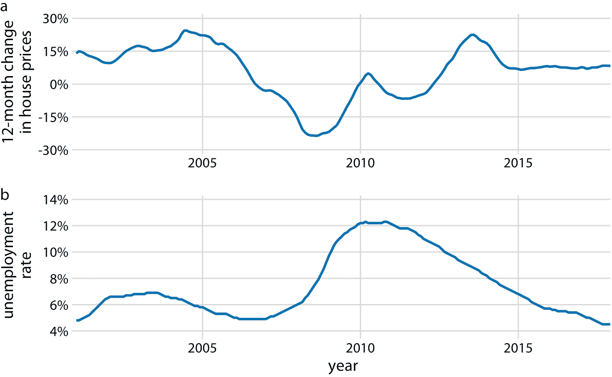

图 13.9：2001 年 1 月至 2017 年 12 月房价（a）和失业率（b）12 个月的随时间的变化。数据来源：美国劳工统计局 Freddie Mac 房价指数。

作为显示两个单独的折线图的替代方法，我们可以将两个变量相互绘制，绘制从最早的时间点到最晚的时间点的路径（图 13.10）。这种可视化被称为连通散点图，因为我们在技术上在汇智两个变量间的散点图，然后连接相邻点。物理学家和工程师经常将其称为相位图，因为在他们的学科中，它通常用于表示相位空间中的运动。我们之前在第三章中遇到了连通散点图，其中我们绘制了休斯顿，TX 的日常温度法线，与加利福尼亚州圣地亚哥的日常温度法线（图 3.3）。

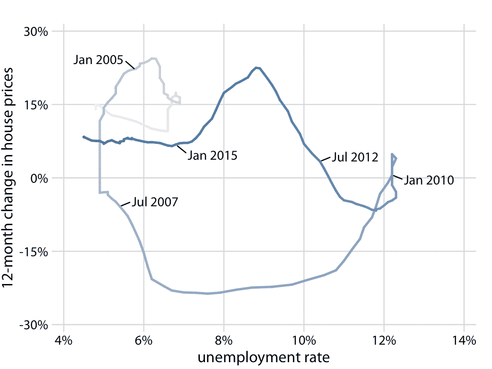

图 13.10：2001 年 1 月至 2017 年 12 月房价与失业率的 12 个月变化，显示为连通散点图。较暗的色调代表最近几个月。图 13.9 中看到的房价和失业率之间的负相关，导致连通散点图形成两个逆时针圆。数据来源：美国劳工统计局 Freddie Mac 房价指数。原始图概念：Len Kiefer

在连通散点图中，从左下角到右上角的方向上的线表示两个变量之间的相关运动（当一个变量增长时，另一个变量增长），并且从左上角到右下方沿垂直方向的线，表示负相关运动（随着一个变量增长，另一个变量收缩）。如果两个变量具有某种循环关系，我们将在连通散点图中看到圆或螺旋。在图 13.10 中，我们看到 2001 年至 2005 年的一个小圆圈和剩余时间过程的一个大圆圈。

绘制连通散点图时，重要的是我们指明数据的方向和时间刻度。如果没有这样的提示，绘图可能变成毫无意义的涂鸦（图 13.11）。（在图 13.10 中）我在这里使用逐渐变暗的颜色来指示方向。或者，可以沿着路径绘制箭头。

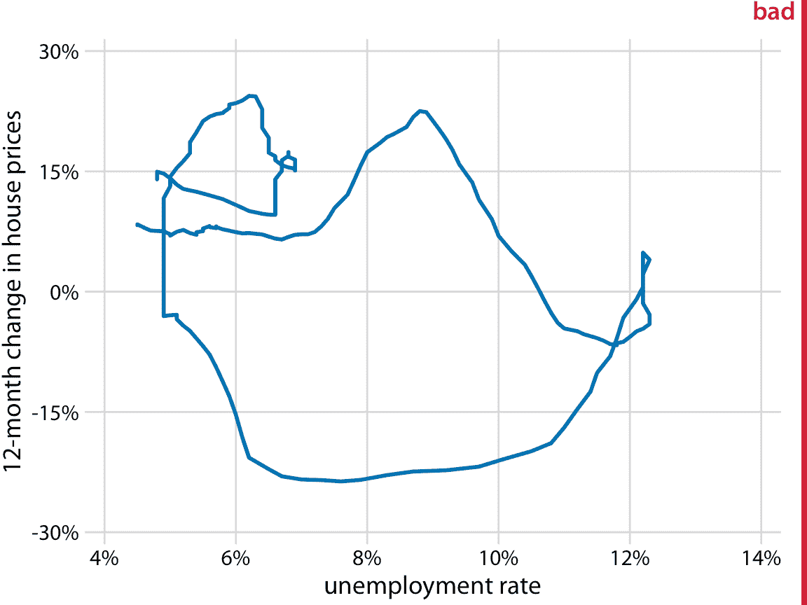

图 13.11：从 2001 年 1 月到 2017 年 12 月，房价与失业率的 12 个月变化。这个绘图被标记为“不好”，因为没有图 13.10 的日期标记和颜色渐变，我们既看不到数据的方向也看不到数据变化速度。数据来源：美国劳工统计局 Freddie Mac 价格指数。

使用连通散点图或两个单独的折线图哪个更好？单独的折线图往往更容易阅读，但是一旦人们习惯连通散点图，他们就可以提取某些模式（例如具有一些不规则性的循环行为），这些模式很难在折线图中找到。事实上，对我来说，房价变化和失业率之间的周期性关系很难在图 13.9 中看到，但图 13.10 中的逆时针螺旋清楚地表明了这一点。研究报告说，读者更容易混淆连通散点图，而不是折线图中的顺序和方向，并且不太可能看出相关性（Haroz，Kosara 和 Franconeri 2016）。另一方面，连通散点图似乎导致更高的参与度，因此这些图可能是吸引读者进入故事的有效工具（Haroz，Kosara 和 Franconeri 2016）。

即使连通散点图一次只能显示两个变量，我们也可以使用它们来可视化更高维的数据集。技巧是首先应用降维（见第 12 章）。然后，我们可以在低维空间中绘制连通散点图。作为这种方法的一个例子，我们将可视化由圣路易斯联邦储备银行提供的 100 多个宏观经济指标的月度观测值的数据库。我们对所有指标进行主成分分析（PCA），然后绘制 PC2 与 PC1（图 13.12a），以及 PC2 与 PC3（图 13.12b）的连通散点图。

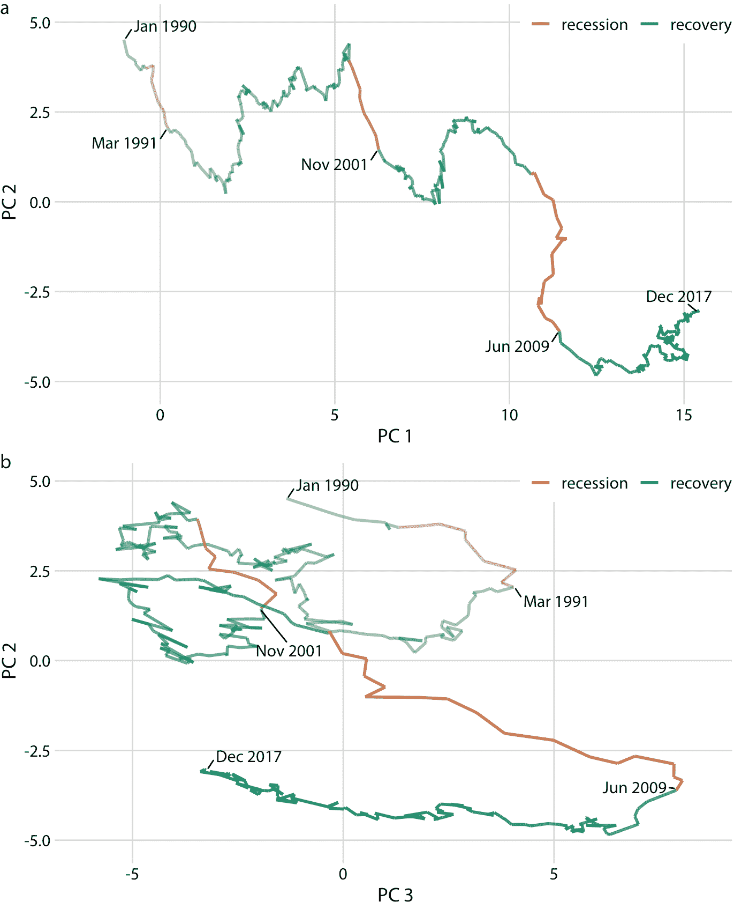

图 13.12：将高维时间序列可视化为主成分空间中的连通散点图。该绘图展示了 1990 年 1 月至 2017 年 12 月期间的 100 多个宏观经济指标的联合运动。经济衰退和复苏的时间以颜色表示，三次经济衰退的终点（1991 年 3 月，2001 年 11 月和 2009 年 6 月）也被标记。（a）PC2 与 PC1，（b）PC2 与 PC3。数据来源：M. W. McCracken，St. Louis Fed

值得注意的是，图 13.12a 看起来几乎像一个常规折线图，时间从左到右递增。这种模式是由 PCA 的一个共同特征引起的：第一个成分通常测量系统的总体规模。在这里，PC1 大致衡量经济的总体规模，这种规模很少随着时间的推移而减少。

通过按照衰退和复苏时间，对连通散点图进行着色，我们可以看到衰退与 PC2 下降有关，而复苏与 PC1 或 PC2 中的明显特征无关（图 13.12a）。然而，复苏似乎与 PC3 的下降相对应（图 13.12b）。此外，在 PC2 与 PC3 的图中，我们看到该线遵循顺时针螺旋的形状。这种模式突出了经济的周期性，经济复苏后出现衰退，反之亦然。

### 参考

```
Yates, F. 1935. “Complex Experiments.” Supplement to the Journal of the Royal Statistical Society 2: 181–247. doi:10.2307/2983638.

Haroz, S., R. Kosara, and S. Franconeri. 2016. “The Connected Scatterplot for Presenting Paired Time Series.” IEEE Transactions on Visualization and Computer Graphics 22: 2174–86. doi:10.1109/TVCG.2015.2502587.
```