# 14 可视化趋势

> 原文： [14 Visualizing trends](https://serialmentor.com/dataviz/visualizing-trends.html)

> 校验：[飞龙](https://github.com/wizardforcel)

> 自豪地采用[谷歌翻译](https://translate.google.cn/)

在制作散点图（第 12 章）或时间序列（第 13 章）时，我们通常对数据的总体趋势更感兴趣，而不是每个单独数据点的位置的具体细节。通过在实际数据点之上或代替实际数据点绘制趋势，通常以直线或曲线的形式，我们可以创建可视化，帮助读者立即查看数据的关键特征。确定趋势有两种基本方法：我们可以通过某种方法平滑数据，例如移动平均值，或者我们可以拟合曲线，它具有所定义的函数形式，然后绘制拟合曲线。一旦我们确定了数据集中的趋势，特别注意相对于趋势的偏差，或将数据分成多个成分（包括基础趋势，任何现有的循环成分，偶然成分或随机噪声）也可能很有用。

## 14.1 平滑

让我们考虑一下道琼斯工业平均指数（简称道琼斯）的时间序列，这是一个股票市场指数，代表 30 家大型上市公司的价格。具体来说，我们将看看 2008 年崩盘后的 2009 年（图 14.1）。在崩盘的末期，2009 年的前三个月，市场损失超过 2400 点（约 27%）。然后它在当年余下的时间里慢慢恢复。我们如何看待这些长期趋势，同时不再强调不那么重要的短期波动？

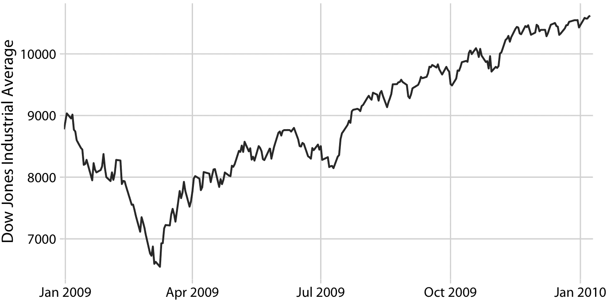

图 14.1：道琼斯工业平均指数 2009 年的每日收盘价。数据来源：雅虎金融

在统计方面，我们正在寻找一种方法来平滑股市时间序列。平滑操作产生一个函数，捕获数据中的关键模式，同时去除不相关的细微细节或噪声。金融分析师通常通过计算移动平均值来平滑股市数据。要生成移动平均值，我们需要一个时间窗口，比如时间序列中的前 20 天，计算这 20 天的平均价格，然后将时间窗口移动一天，所以它现在跨越第 2 天到第 21 天，计算这 20 天的平均值，再次移动时间窗口，依此类推。结果是一个由一系列平均价格组成的新时间序列。

为了绘制这个移动平均值序列，我们需要确定与每个时间窗口的平均值关联的特定时间点。财务分析师经常在每个时间窗口的末尾绘制每个平均值。这种选择导致曲线滞后于原始数据（图 14.2a），更严重的滞后对应于更大的平均时间窗口。另一方面，统计学家在时间窗口的中心绘制平均值，这导致曲线完全覆盖原始数据（图 14.2b）。

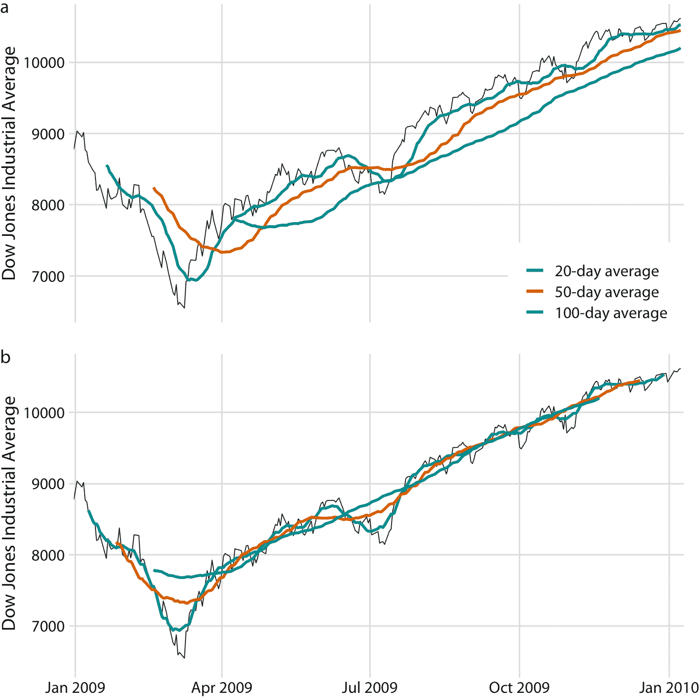

图 14.2：2009 年道琼斯工业平均指数的每日收盘价，以及 20 天，50 天和 100 天移动平均值。（a）移动平均值绘制在移动时间窗口的末尾。（b）移动平均值绘制在移动时间窗口的中心。数据来源：雅虎金融

无论我们绘制具有或不具有滞后的平滑时间序列，我们都可以看到，我们计算平均的时间窗口的长度，设置了在平滑曲线中保持可见的波动规模。 20 日移动平均值仅消除小的短期峰值，但其他方面也紧随日常数据。另一方面，100 天移动平均值甚至可以消除在数周时间内出现的相当大幅度的下跌或峰值。例如，2009 年第一季度到 7000 点以下的大幅下跌，对于 100 日移动平均值是不可见的，取而代之的是不会低于 8000 点的温和曲线（图 14.2 ）。同样，2009 年 7 月左右的下跌在 100 日移动平均值中完全看不到。

移动平均值是最简单的平滑方法，它有一些明显的局限性。首先，它导致平滑的曲线比原始曲线短（图 14.2 ）。开头或结尾部分或两者都缺失。并且时间序列被平滑得越多（即，平均窗口越大），平滑曲线越短。其次，即使平均窗口较大，移动平均值也不一定平滑。即使已经实现了更大规模的平滑，它也可能表现出小的凸起和摆动（图 14.2）。这些摆动是由进入或退出平均窗口的各个数据点引起的。由于窗口中的所有数据点均等加权，因此窗口边界处的各个数据点可能对平均值产生明显影响。

统计学家已经开发了许多平滑方法，以减轻移动平均值的缺陷。这些方法复杂得多且计算成本高，但它们在现代统计计算环境中很容易获得。一种广泛使用的方法是 LOESS（局部估计的散点图平滑， W. S. Cleveland（1979）），它将低阶多项式拟合到数据的子集。重要的是，每个子集中心的点比边界点的权重更重，这种加权方案产生的结果比加权平均值更平滑（图 14.3 ）。此处显示的 LOESS 曲线看起来类似于 100 天平均值，但不应过度解释这种相似性。可以通过调整参数来调整 LOESS 曲线的平滑度，并且不同的参数选择会使 LOESS 曲线看起来更像 20 天或 50 天的平均值。

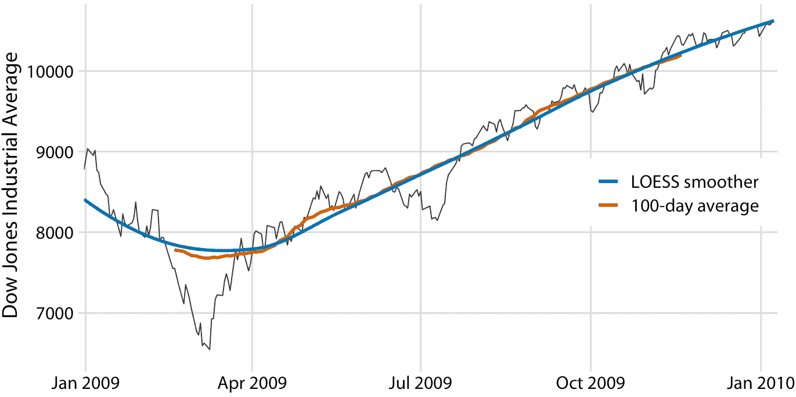

图 14.3：图 14.2 道琼斯数据的 LOESS 拟合与 100 天移动平均值的比较。 LOESS 平滑显示的整体趋势几乎与 100 天移动平均值相同，但 LOESS 曲线更平滑，并且延伸到整个数据范围。数据来源：雅虎金融

重要的是，LOESS 不仅限于时间序列。它可以应用于任意散点图，从其名称“局部估计的散点图平滑”可以看出。例如，我们可以使用 LOESS 来寻找汽车油箱容量与其价格之间关系的趋势（图 14.4）。 LOESS 序列显示，油箱容量与廉价汽车（低于 20,000 美元）的价格大致成线性增长，但是对于更昂贵的汽车而言，它保持不变。超过大约 20,000 美元，购买更昂贵的汽车将不会让你拥有一个更大的油箱。


图 14.4：1993 年车型的 93 辆汽车的油箱容量与价格。每个点对应一辆汽车。实线表示数据的 LOESS 平滑。我们看到油箱容量相对于价格近似线性增加，直到约 20,000 美元的价格，然后稳定下来。数据来源：圣劳伦斯大学 Robin H. Lock

LOESS 是一种非常流行的平滑方法，因为它往往会产生适合人眼的效果。但是，它需要拟合许多单独的回归模型。这使得其对于大型数据集较慢，即使在现代计算设备上也是如此。

作为 LOESS 的更快替代品，我们可以使用样条模型。样条曲线是一种分段多项式函数，它具有高度的灵活性，但总是看起来很平滑。使用样条线时，我们会遇到术语“结”。样条曲线中的结是各个样条曲线段的端点。如果我们使用 *k* 段拟合样条曲线，我们需要指定 *k* + 1 个结。虽然样条拟合在计算上是有效的，特别是如果结的数量不是太大，样条有其自身的缺点。最重要的是，存在一系列令人眼花缭乱的不同类型的样条曲线，包括三次样条曲线，B 样条曲线，薄板样条曲线，高斯过程样条曲线以及其他许多样条曲线，选择哪个可能并不明显。样条类型和使用的结数的具体选择，可能导致相同数据的平滑函数大不相同（图 14.5 ）。

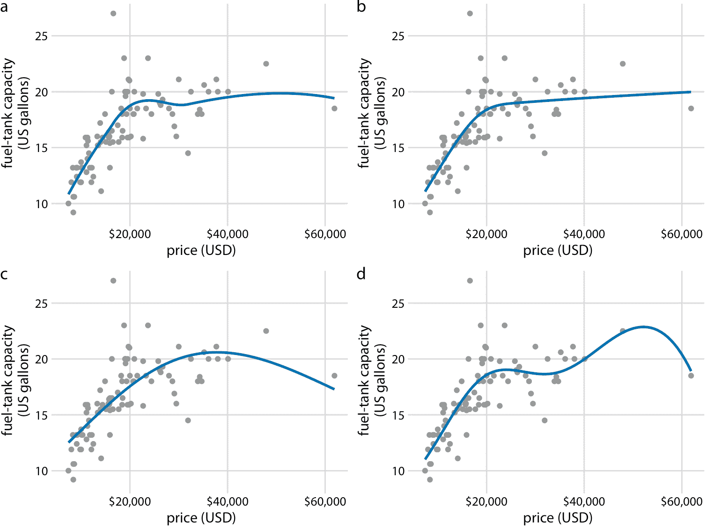

图 14.5：不同的平滑模型表现出极大不同的行为，特别是在数据边界附近。 （a）LOESS 更平滑，如图 14.4。（b）具有 5 个结的立方回归样条。 （c）具有 3 个结的薄板回归样条。（d）高斯过程样条，6 个结。数据来源：圣劳伦斯大学 Robin H. Lock

大多数数据可视化软件将提供平滑功能，可能实现为一种局部回归（如 LOESS）或一种样条曲线。平滑方法可以称为 GAM，广义附加模型，它是所有这些类型的平滑器的超集。重要的是要注意，平滑特征的输出高度依赖于适合的特定 GAM 模型。除非您尝试了许多不同的选择，否则您可能永远不会意识到，您看到的结果在多大程度上取决于统计软件所做的特定默认选择。

在解释平滑函数的结果时要小心。可以通过许多不同方式平滑相同的数据集。

## 14.2 以所定义的函数形式显示趋势

我们在图 14.5 中看到，对于任何给定的数据集，通用平滑器的行为可能有些不可预测。这些平滑器也不提供具有有意义的解释的参数估计值。因此，只要有可能，最好使用适合于数据的特定函数形式拟合曲线，并使用具有明确含义的参数。

对于油箱数据，我们需要一条曲线，该曲线最初线性上升但随后以恒定值平稳。函数`y = A - B exp(-mx)`可能适合该顺序。这里，`A`，`B`和`m`是常数，我们调整它来使曲线适合数据。对于较小的`x`，函数近似为线性，`y ~ A - B + B mx`，对于较大`x`，它接近常数值，`y ~ A`，对于`x`的所有制它严格递增。图 14.6 表明该方程至少与我们之前考虑的任何平滑器一样适合数据（图 14.5）。

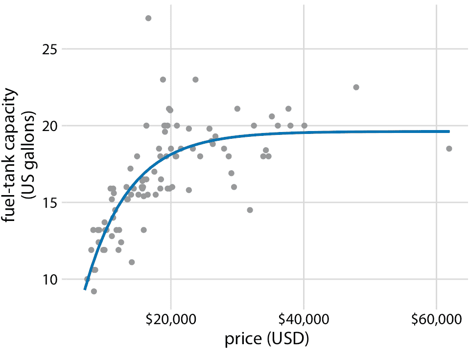

图 14.6：用明确的分析模型表示的油箱数据。实线对应于公式`y = A-B exp(-mx)`与数据的最小二乘拟合。拟合参数为`A = 19.6 `，`B = 29.2`，`m = 0.00015 `。数据来源：圣劳伦斯大学 Robin H. Lock

在许多不同的上下文中适用的函数形式是简单的直线， `y = A + mx`。在现实世界的数据集中，两个变量之间的近似线性关系非常常见。例如，在第 12 章中，我讨论了蓝鸟的头长和体重之间的关系。这种关系对于雌鸟和雄鸟都是近似线性的，并且在散点图中，在点之上绘制线性趋势线，有助于读者感知趋势（图 14.7）。

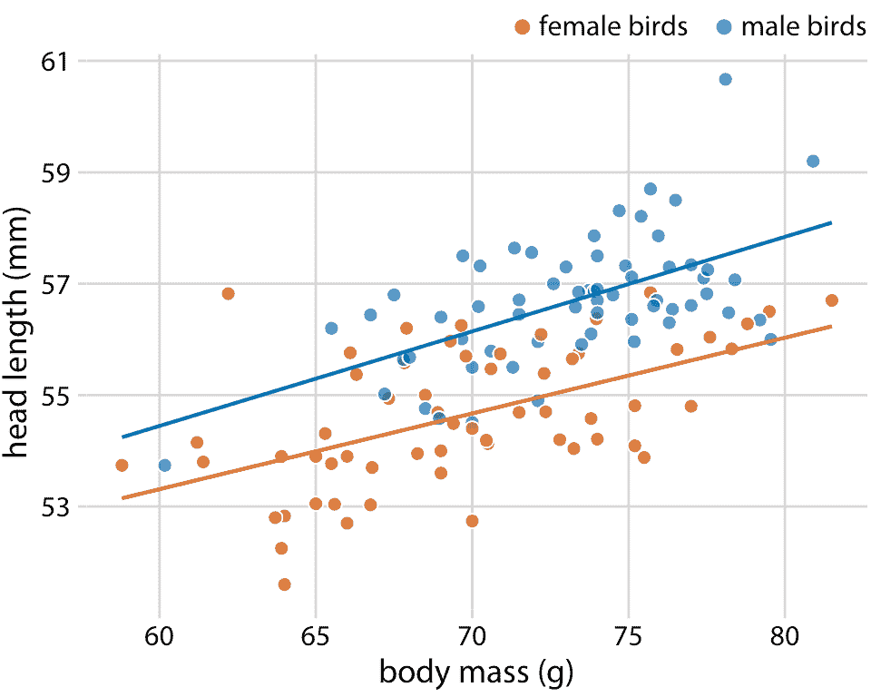

图 14.7：123 只蓝鸟的头长与体重的关系。鸟的性别用颜色表示。这个图形相当于图 12.2，但现在我们已经在各个数据点之上绘制了线性趋势直线。数据来源：欧柏林学院的 Keith Tarvin

当数据表现出非线性关系时，我们需要猜测适当的函数形式可能是什么。在这种情况下，通过转换轴使线性关系出现，我们可以评估我们猜测的准确性。为了证明这一原理，让我们回到预印本服务器 bioRxiv 的每月提交量，在第 12 章中讨论。如果每个月提交量的增量与上个月的提交量成比例，即，如果每月的提交量以一个固定的百分比增长，那么得到的曲线是指数的。 bioRxiv 数据似乎满足了这个假设，因为指数形式的曲线`y = A exp(mx)`，很好地符合 bioRxiv 提交数据（图 14.8）。

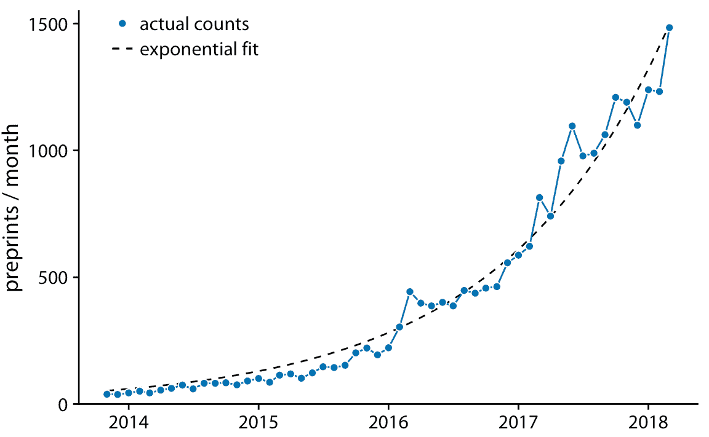

图 14.8：预印本服务器 bioRxiv 的每月提交量。蓝色实线表示预印本的实际的每月计数，黑色虚线表示数据的指数拟合，`y = 60 exp(0.77(x - 2014))`。数据来源：Jordan Anaya，[prepubmed.org](http://www.prepubmed.org/)

如果原始曲线是指数，`y = A exp(mx)`，则 *y* 值的对数变换将使其变为线性关系，`log(y) = log(A) + mx`。因此，使用对数变换的 *y* 值（或等效地，使用对数 *y* 轴）绘制数据并寻找线性关系，是确定数据集是否呈现指数增长的好方法。对于 bioRxiv 提交图形，当使用对数 *y* 轴时，我们确实获得了线性关系（图 14.9）。

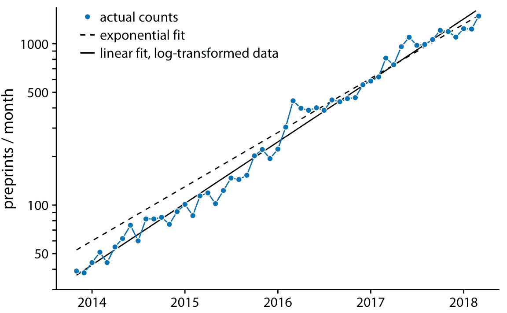

图 14.9：预印本服务器 bioRxiv 每月提交量，以对数刻度显示。蓝色实线表示预印本的实际的每月计数，黑色虚线表示图 14.8 的指数拟合，黑色实线表示对数变换数据的线性拟合，对应于`y = 43 exp(0.88(x - 2014))`。数据来源：Jordan Anaya，[prepubmed.org](http://www.prepubmed.org/)

在图 14.9 中，除了实际提交计数外，我还显示了图 14.8 的指数拟合以及对数变换数据的线性拟合。这两种拟合相似但不相同。特别是，虚线的斜率似乎略微偏离。在一半时间序列中，该线系统地高于各个数据点。这是指数拟合的常见问题：对于最大数据值，从数据点到拟合曲线的平方偏差与最小数据值相比要大得多，因为最小数据值的偏差对总和平方的贡献很小适合度最小化。结果，拟合直线系统地高于或低于最小数据值。出于这个原因，我通常建议避免指数拟合，而是在对数变换数据上使用线性拟合。

通常，将直线拟合到变换数据，比将非线性曲线拟合到未变换数据更好。

图 14.9 的图通常被称为对数线性的，因为 *y* 轴是对数的， *x* 轴是线性的。我们可能遇到的其他图包括双对数，其中 *y* 和 *x* 轴都是对数，或线性对数，其中 *y* 是线性的， *x* 是对数的。在双对数图中，`y ~ x ^ alpha`形式的幂律显示为直线（例如，参见图 8.7），线性对数图，`y ~ log(x)`形式的对数关系显示为直线。其他函数形式可以通过更专业的坐标转换，转换为线性关系，但这三种（对数线性，双对数，线性对数）涵盖了广泛的实际应用。

## 14.3 趋势和时间序列分解

对于具有突出长期趋势的任何时间序列，删除此趋势来特别突出任何显着​​偏差可能是有用的。这种技术被称为去趋势 ，我将在这里用房价来证明它。在美国，抵押贷款机构 Freddie Mac 发布月度指数，称为 Freddie Mac 房价指数，它跟踪房价随时间的变化。该指数试图捕捉给定区域中整个房屋市场的状态，因此，例如 10% 的指数增加可以被解释为，相应市场中的平均房价增加 10% 。该指数在 2000 年 12 月任意设定为 100。

在很长一段时间内，房价往往呈现出一致的年增长率，与通货膨胀基本一致。然而，覆盖这一趋势的是房地产泡沫，导致严重的繁荣和萧条周期。图 14.10 显示了美国四个州的实际房价指数及其长期趋势。我们看到，在 1980 年到 2017 年之间，加利福尼亚经历了两次泡沫，一次是在 1990 年，一次是在 2000 年代中期。在同一时期，内华达州在 2000 年代中期只经历过一次泡沫，德克萨斯州和西弗吉尼亚州的房价一直紧跟其长期趋势。因为房价倾向于以增量的百分比增长，即指数增长，所以我在图 14.10 中选择了对数 *y* 轴。直线相当于加利福尼亚州年度价格增长的 4.7%，内华达州，德克萨斯州和西弗吉尼亚州年度价格增长的 2.8%。

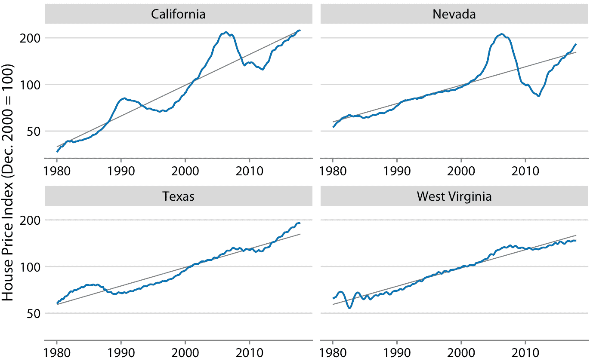

图 14.10：1980 年至 2017 年 Freddie Mac 房价指数，显示四个选定州（加利福尼亚州，内华达州，德克萨斯州和西弗吉尼亚州）。房价指数是一个无单位数字，用于跟踪所选地理区域内的相对房价。该指数任意缩放，使其在 2000 年 12 月等于 100。蓝线表示指数的月度波动，而灰色直线表示各州的长期价格趋势。注意， *y* 轴是对数的，因此灰色直线代表一致的指数增长。数据来源：房地美房价指数

我们通过将每个时间点的实际价格指数，除以长期趋势中的相应值来抵消住房价格。在视觉上，这个除法看起来像是从图 14.10 中的蓝线中减去灰线，因为未转换值的除法相当于对数转换值的减法。由此产生的去趋势房屋价格更清晰地显示房屋泡沫（图 14.11 ），因为趋势强调了时间序列中的意外移动。例如，在原始时间序列中，加利福尼亚州从 1990 年到 1998 年的房价下跌看起来不大（图 14.10 ）。但是，在同一时期，根据长期趋势，我们预计价格会上涨。相对于预期的上涨，价格下跌幅度很大，在最低点达到 25%（图 14.11）。

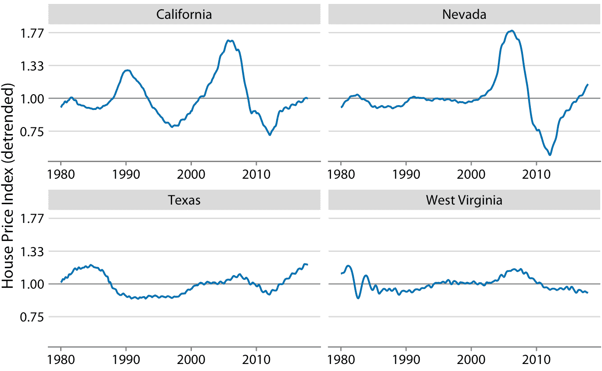

图 14.11：Freddie Mac 房屋价格指数的去趋势版本如图 14.10 所示。通过将实际指数（图 14.10 中的蓝线）除以基于长期趋势的预期值（图 14.10 中的直灰线）来计算去趋势指数。这种可视化表明，加利福尼亚经历了两次房地产泡沫，大约在 1990 年和 2000 年代中期，可以通过相对于长期趋势的预期的实际房价的快速上涨和随后的下降来确定。同样，内华达州在 2000 年代中期经历了一次房地产泡沫，德克萨斯州和西弗吉尼亚州都没有经历过太多的泡沫。数据来源：Freddie Mac 房价指数

除了简单的去趋势之外，我们还可以将时间序列分成多个不同的成分，以便它们的总和复原原始时间序列。一般而言，除了长期趋势外，还有三个不同的成分可能影响时间序列。首先，存在随机噪声，这会导致小的上下不稳定运动。在本章所示的所有时间序列中都可以看到这种噪声，但可能在图 14.9 中最清楚。其次，可能会有独特的外部事件在时间序列中留下痕迹，例如图 14.10 中所见的明显的房屋泡沫。第三，可能存在周期性变化。例如，室外温度表现出每日周期性变化。下午早些时候温度最高，清晨温度最低。室外温度也显示出每年的周期性变化。它们倾向于在春季上升，在夏季达到最大值，然后在秋季下降并在冬季达到最小值（图 3.2 ）。

为了证明时间序列不同成分的概念，我将在此处分解基林曲线，其显示 CO2 丰度随时间的变化（图 14.12）。 CO2 以百万分率（ppm）测量。我们看到 CO2 丰度的长期增长略快于线性，从 20 世纪 60 年代的 325 ppm 以下到 21 世纪第二个十年的 400 以上（图 14.12）。 CO2 丰度也具有年度波动，在整体增长之上遵循一致的上下模式。年度波动是由北半球的植物生长推动的。植物在光合作用期间消耗 CO2 。由于全球大部分陆地都位于北半球，而且春季和夏季植物生长最活跃，我们看到全球大气 CO2 的年度下降与北半球的夏季月份相重合。

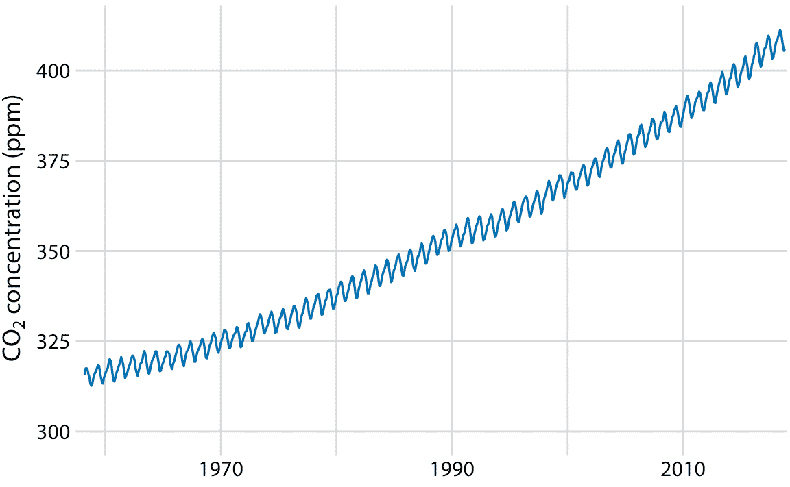

图 14.12：基林曲线。基林曲线显示了大气中 CO2 丰度随时间的变化。自 1958 年以来，CO2 的丰度一直在夏威夷的莫纳罗亚天文台进行监测，最初是在 Charles Keeling 的指导下进行的。这里显示的是月平均 CO2 读数，以百万分率（ppm）表示。 CO2 读数随季节而波动，但显示出一致的长期增长趋势。数据来源：NOAA/ESRL 的 Pieter Tans 博士和 Scripps 海洋学研究所的 Ralph Keeling 博士

我们可以将基林曲线分解为长期趋势，季节性波动和剩余部分（图 14.13 ）。我在这里使用的具体方法称为 STL（使用 LOESS 的时间序列的季节性分解，RB Cleveland 等人，1990），但还有许多其他方法可以实现类似目标。分解表明，在过去的三十年中，CO2 丰度增加了 50ppm 以上。相比之下，季节性波动小于 8 ppm（相对于长期趋势，它们永远不会导致增加或减少超过 4 ppm），其余则小于 1.6 ppm（图 14.13）。剩余部分是实际读数与长期趋势和季节性波动之和之间的差异，这里它对应于每月 CO2 读数中的随机噪声。然而，更一般地，剩余部分也可以捕获独特的外部事件。例如，如果大规模的火山爆发释放出大量的 CO2，这种事件可能会被看作是剩余部分的突然飙升。图 14.13 表明，近几十年来没有这种独特的外部事件对基林曲线产生重大影响。

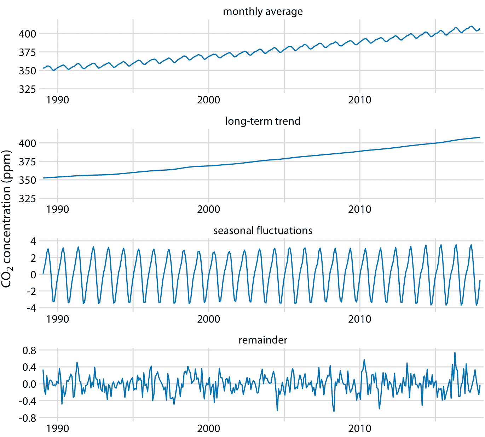

图 14.13：基林曲线的时间序列分解，显示月平均值（如图 14.12 ），长期趋势，季节性波动和剩余部分。剩余部分是实际读数与长期趋势和季节波动之和的差异，它代表随机噪声。我已经缩放到最近 30 年的数据，以更清楚地显示年度波动的形状。数据来源：NOAA/ESRL 的 Pieter Tans 博士和 Scripps 海洋学研究所的 Ralph Keeling 博士

### 参考

```
Cleveland, W. S. 1979. “Robust Locally Weighted Regression and Smoothing Scatterplots.” Journal of the American Statistical Association 74: 829–36.

Cleveland, R. B., W. S. Cleveland, J. E. McRae, and I. Terpenning. 1990. “STL: A Seasonal-Trend Decomposition Procedure Based on Loess.” Journal of Official Statistics 6: 3–73.
```