# 15 可视化地理空间数据

> 原文： [15 Visualizing geospatial data](https://serialmentor.com/dataviz/geospatial-data.html)

> 校验：[飞龙](https://github.com/wizardforcel)

> 自豪地采用[谷歌翻译](https://translate.google.cn/)

许多数据集包含链接到物理世界中的位置的信息。例如，在生态学研究中，数据集可列出特定植物或动物被发现的位置。同样，在社会经济或政治背景下，数据集可能包含具有特定属性（如收入，年龄或教育程度）的人的居住地，或人造物体（如桥梁，道路，建筑物）所在地的信息。在所有这些情况下，在适当的地理空间环境中可视化数据，可能是有帮助的，即，在真实地图上显示数据或者作为类似地图的图形。

地图往往对读者来说很直观，但它们对设计来说可能很有挑战性。我们需要考虑地图投影之类的概念，以及对于我们的具体应用，角度或区域的准确表示是否更为关键。一种常见的映射技术，等值线图，包括空间区域，其中数据值表示为不同颜色。等值线图有时非常有用，而在其他时候则极具误导性。作为替代方案，我们可以构建称为统计地图，可以有目的地扭曲地图区域或以形式化形式表示它们，例如作为相等大小的正方形。

## 15.1 投影

地球大约是一个球体（图 15.1 ），更准确地说是一个沿其旋转轴稍微变平的扁球体。旋转轴与球体相交的两个位置称为极（北极和南极）。我们将球体分成两个半球，即北半球和南半球，通过在球体周围画一条到两极距离相等的线。这条线称为赤道。为了唯一地指定地球上的位置，我们需要三条信息：我们沿着赤道方向（经度）的位置，当垂直于赤道（纬度）移动时，我们到两极的距离（纬度），我们离地球中心有多远（海拔）。经度，纬度和海拔，相对于称为基准的参考系统指定。该数据指定了一些属性，例如地球的形状和大小以及零经度，纬度和海拔的位置等。一个广泛使用的数据是世界大地测量系统（WGS）84，它被全球定位系统（GPS）使用。

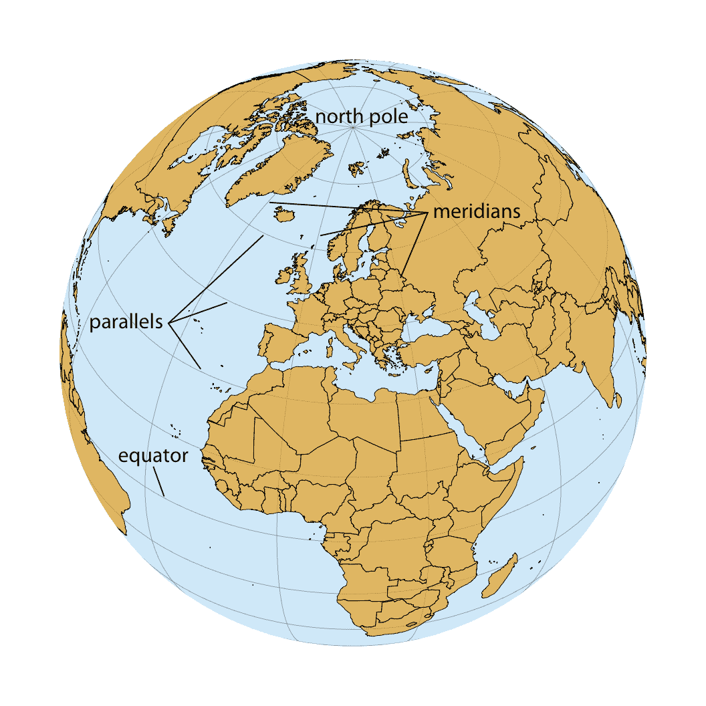

图 15.1：世界的正投影，显示欧洲和北非，因为它们可以从太空中看到。从北极发出并向南行进的线称为经线，与经线正交的线称为纬线。所有经线都有相同的长度，但随着我们越接近任一极，纬线越短。

虽然海拔是许多地理空间应用中的重要数量，但在以地图形式显示地理空间数据时，我们主要关注的是其他两个维度，即经度和纬度。经度和纬度都是角度，以度表示。经度衡量一个位置在东部或西部有多远。经度相等的线被称为经线（子午线），所有经线终止于两极（图 15.1 ）。经度为 0° 的本初子午线贯穿英国的格林威治村。与本初子午线相对的经线位于 180° 经度（也称为 180°E），相当于 -180° 经度（也称为 180°W），接近国际日期线。纬度测量位置在北边或南边有多远。赤道对应于 0° 纬度，北极对应于 90° 纬度（也称为 90°N），南极对应于 -90° 纬度（也称为 90°S）。纬度相等的线被称为纬线（平行线），因为它们与赤道平行。所有经线都具有相同的长度，相当于全球大圆的一半，而纬线的长度取决于它们的纬度（图 15.1 ）。最长的纬线是赤道，纬度为 0°，最短的纬线位于北极和南极，90°N 和 90°S，长度为零。

地图制作中的挑战是，我们需要选取地球的球形表面并将其展平，以便我们可以将其显示在地图上。这个过程称为投影，必然会引入扭曲，因为曲面不能精确地投射到平面上。具体地说，投影可以保留角度或面积，但不能同时保留两者。前者的投影称为共形，后者的投影称为等面积。其他投影可以既不保留角度也不保留面积，而是保留其他兴趣量，例如到某个参考点或线的距离。最后，一些投影尝试在保留角度和面积之间达成平衡。这些折衷投影经常用于以美学上令人愉悦的方式显示整个世界，并且它们接受一定的角度和面积失真（图 3.11 ）。为了系统化和跟踪为特定地图投射部分或全部地球的不同方式，各种标准组织和机构，如 EPSG（欧洲石油调查组）或 ESRI（环境系统研究所），维护投影登记处。例如，EPSG：4326 表示 GPS 使用的 WGS 84 坐标系中，未投影的经度和纬度值。有几个网站可以方便地访问这些已注册的投影，包括 [spatialreference.org](http://spatialreference.org/) 和 [epsg.io](https://epsg.io/)。

墨卡托投影是最早使用的地图投影之一，于 16 世纪开发用于航海导航。它是一个精确表示形状的共形投影，但在极点附近引入了严重的面积扭曲（图 15.2 ）。墨卡托投影将地球映射到圆柱体上，然后展开圆柱体以获得矩形地图。该投影中的经线是均匀间隔的垂直线，而纬线是水平线，当我们远离赤道时，其间距变大（图 15.2 ）。平行线之间的间距与它们必须拉伸来接近极点的程序成正比，来保持经线完全垂直。

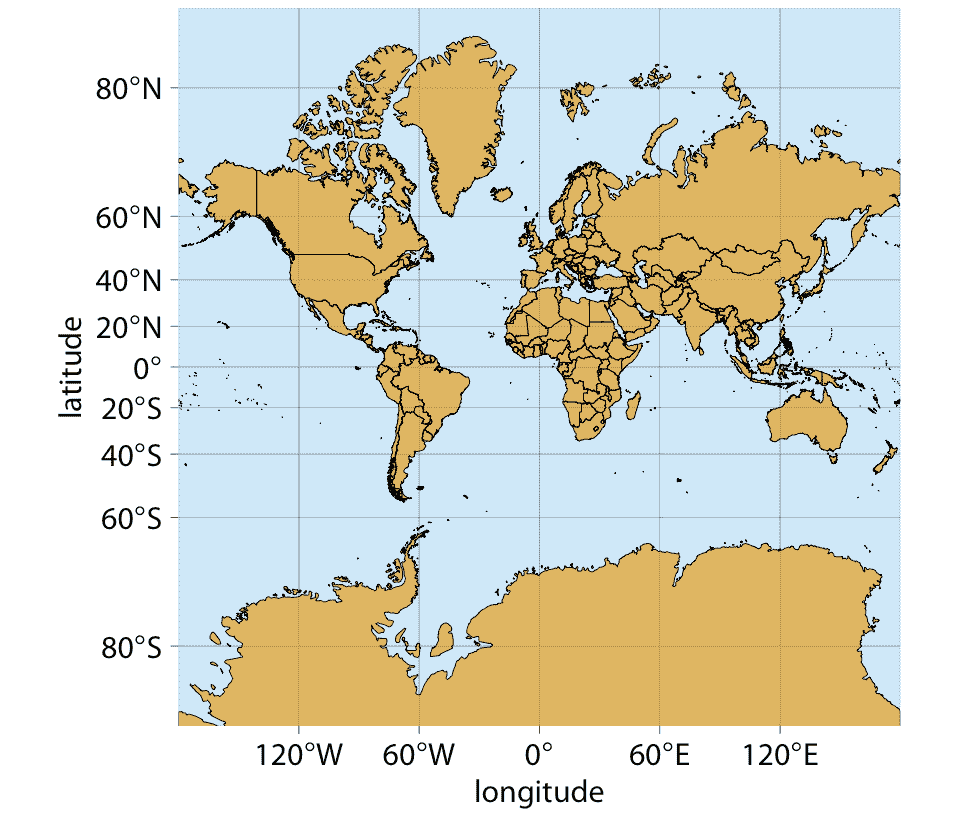

图 15.2：世界的墨卡托投影。在该投影中，纬线是直的水平线，经线是直的垂直线。它是保持局部角度的共形投影，但它向极点附近的面积引入了严重的失真。例如，在这一投影中，格陵兰岛似乎比非洲大，而实际上非洲比格陵兰岛大十倍（见图 15.1 和 15.3 ）。

由于它产生了严重的面积扭曲，墨卡托投影已经失去了整个世界对地图的青睐。但是，这一投影的变体仍继续存在。例如，横向墨卡托投影通常用于大尺寸地图，在较大放大率下显示中小区域（经度跨度小于几度）。另一个变体，Web 墨卡托投影，由谷歌用于谷歌地图，并被几个在线地图应用使用。

一个完全保留面积的全球投影是 Goode homolosine（图 15.3 ）。它通常以断续的形式显示，在北半球有一个切口，在南半球有三个切口，经过精心挑选，因此它们不会中断大陆块（图 15.3 ）。这些切割使投影能够保护面积并大致保留角度，代价是海洋不连续，穿过格陵兰岛中部，以及穿过南极洲的几次切割。虽然被中断的 Goode homolosine 具有不同寻常的美学和奇怪的名称，但对于需要在全球范围内精确重制面积的地图应用来说，它是一个不错的选择。

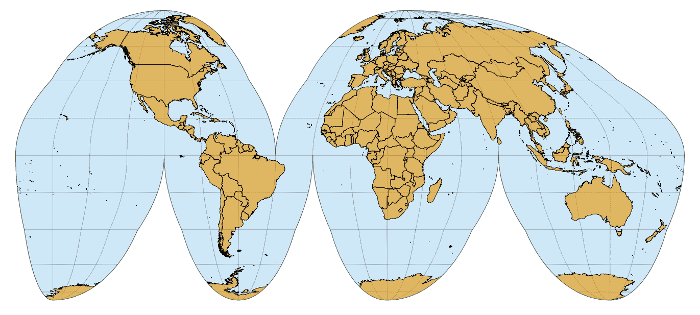

图 15.3：世界的中断的 Goode homolosine 投影。这种投影可以精确地保留面积，同时最大限度地减少角度扭曲，但代价是以不连续的方式显示海洋和一些陆地（格陵兰，南极洲）。

当我们试图绘制整个世界的地图时，由于地图投影导致的形状或面积扭曲尤为突出，但即使在各个大陆或国家的规模上也会造成麻烦。例如，考虑美国，其中包括 48 个本土州，阿拉斯加和夏威夷（图 15.4）。虽然单独 48 个州可以很容易地投射到地图上，但阿拉斯加和夏威夷距离较远，将所有 50 个州投射到一张地图上变得麻烦。

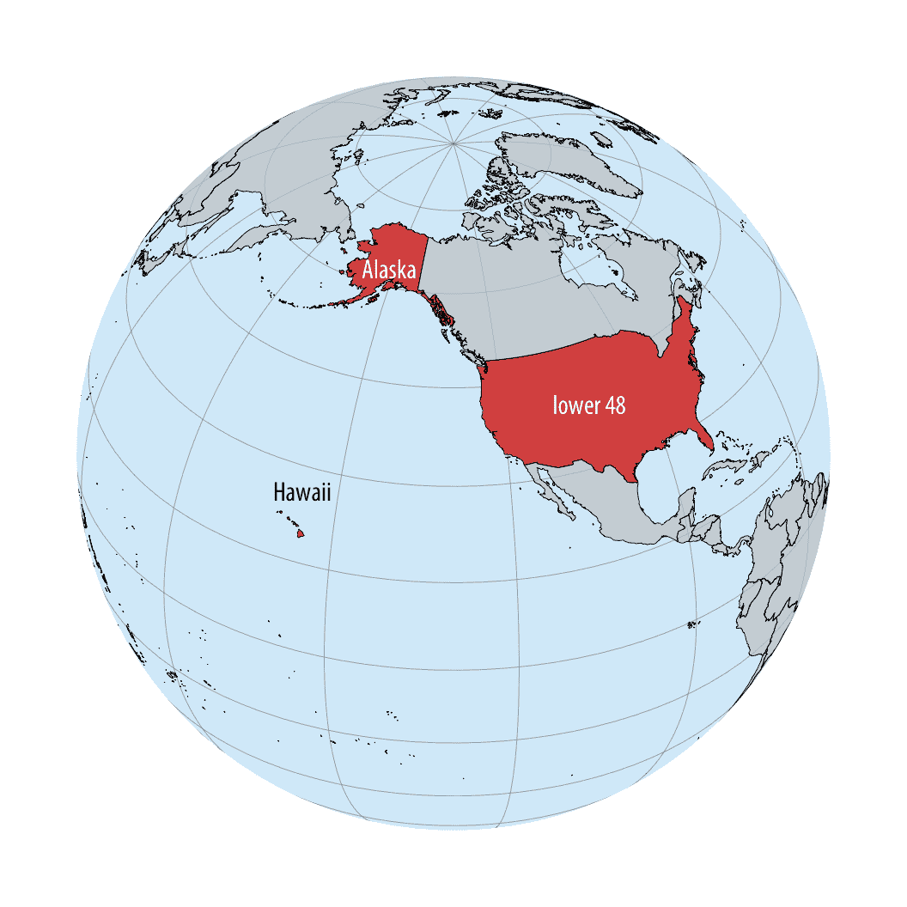

图 15.4：地球上显示的阿拉斯加，夏威夷和 48 个州的相对位置。

图 15.5 显示了使用等面积 Albers 投影制作的所有 50 个州的地图。该投影提供了 50 个州的相对形状，面积和位置的合理表示，但我们注意到一些问题。首先，与其外观相比，阿拉斯加看起来很奇怪，例如，图 15.2 或 15.4 。其次，地图以海洋/空的空间为主。如果我们可以进一步放大，那将是更好的选择，以便较低的 48 个州占据较大比例的地图面积。

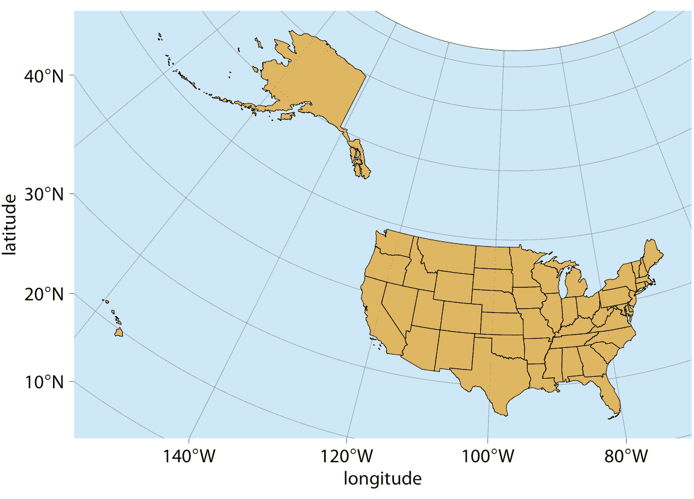

图 15.5：美国地图，使用保留面积的 Albers 投影（ESRI：102003，通常用于投影 48 个州）。阿拉斯加和夏威夷的真实位置显示了出来。

为了解决空的空间的问题，通常的做法是分别投射阿拉斯加和夏威夷（来尽量减少形状扭曲），然后移动它们，使它们显示在 48 个州下方（图 15.6 ）。您可能会注意到图 15.6 中阿拉斯加相对于 48 个州看起来比图 15.5 中的小得多。造成这种差异的原因是，阿拉斯加不仅已被移动，而且已经扩大规模，因此其规模与典型的中西部或西部各州相当。这种扩展虽然是常见的做法，却极具误导性，因此我将这个图形标记为“不好”。

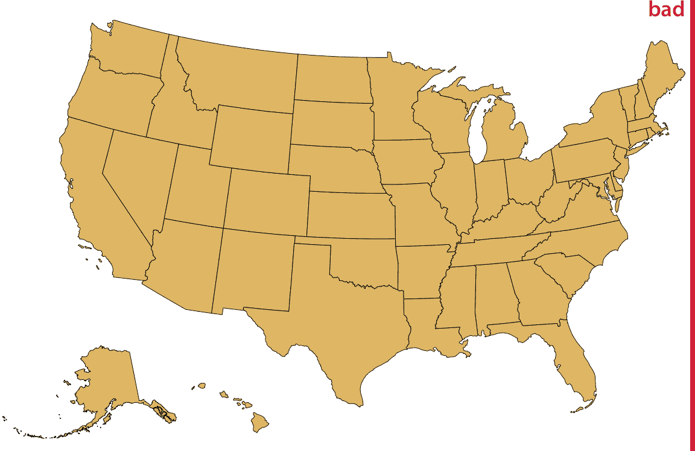

图 15.6：美国的可视化，阿拉斯加州和夏威夷州位于 48 个州的下方。阿拉斯加也已按比例调整，因此其线性规模仅为该州实际规模的 35%。 （换句话说，该州的面积已减少到其真实尺寸的大约 12%。）这种缩放经常应用于阿拉斯加，使其在视觉上看起来与典型的中西部或西部州相似。然而，缩放是非常误导的，因此该图形被标记为“不好”。

我们可以在不改变其规模的情况下移动它，而不是移动和缩放阿拉斯加（图 15.7 ）。这种可视化清楚地表明，阿拉斯加州是最大的州，面积超过德克萨斯州的两倍。我们不习惯看到以这种方式显示的美国，但在我看来，这是 50 个州的一个更合理的表示，而不是图 15.6 。

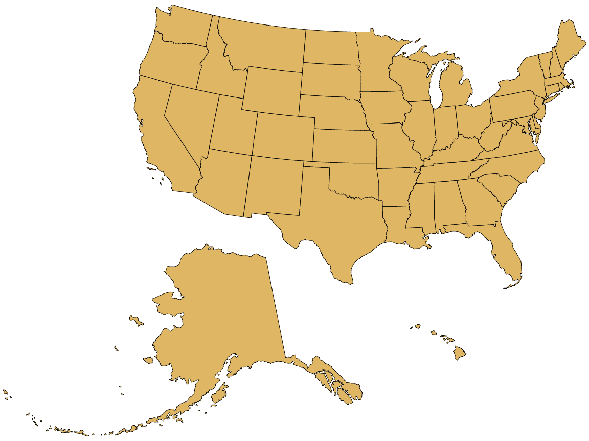

图 15.7：美国的可视化，阿拉斯加州和夏威夷州位于 48 个州的下方。

## 15.2 层

为了在适当的上下文中可视化地理空间数据，我们通常创建由多个层组成的地图，显示不同类型的信息。为了证明这一概念，我将想象一下旧金山湾区风力涡轮机的位置。在湾区，风力涡轮机聚集在两个位置。一个位置，我将其称为 Shiloh 风电场，位于 Rio Vista 附近，另一个位于 Hayward 以东靠近 Tracy（图 15.8 ）。

图 15.8：旧金山湾区的风力涡轮机。单个风力涡轮机显示为紫色点。具有高密度风力涡轮机的两个区域用黑色矩形突出显示。我将 Rio Vista 附近的风力涡轮机统称为 Shiloh 风电场。地图由 Stamen Design 制作，以 CC BY 3.0 授权。地图数据来自 OpenStreetMap，以 ODbL 授权。风力涡轮机数据：美国风力涡轮机数据库

图 15.8 由四个独立的层组成。在底部，我们有地形层，显示山丘，山谷和水。下一层显示道路网络。在路面层的顶部，我放置了一个指示单个风力涡轮机位置的层。该层还包含突出大部分风力涡轮机的两个矩形。最后，顶层添加城市的位置和名称。这四层在图 15.9 中单独显示。对于我们想要制作的任何给定地图，我们可能想要添加或删除其中一些层。例如，如果我们想要绘制投票区的地图，我们可能会认为地形信息无关紧要并且分散注意力。或者，如果我们想要绘制暴露或屋顶覆盖区域的地图，来评估太阳能发电的潜力，我们可能希望用显示单个屋顶和实际植被的卫星图像替换地形信息。您可以在大多数在线地图应用（例如 Google 地图）中，以交互方式尝试这些不同类型的层。我想强调的是，无论我们决定保留或删除哪些层，通常建议添加比例尺和北向箭头。比例尺有助于读者了解地图中显示的空间要素的大小，而北向箭头则可以明确地图的方向。

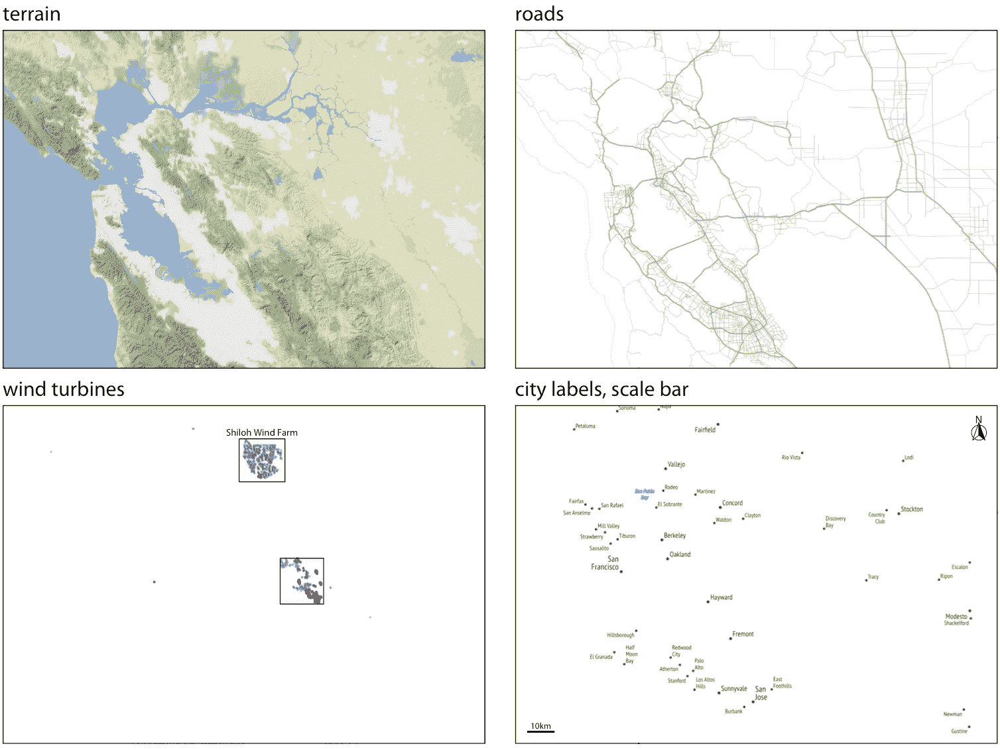

图 15.9：图 15.8 的各个层。从下到上，图形由地形层，道路层，显示风力涡轮机的层和标记城市的层，以及添加比例尺和北向箭头组成。地图由 Stamen Design 制作，以 CC BY 3.0 授权。地图数据来自 OpenStreetMap，以 ODbL 授权。风力涡轮机数据：美国风力涡轮机数据库

将数据映射到美学的第二章中讨论的所有概念都转移到了地图上。我们可以将数据点放入其地理环境中，并通过颜色或形状等美学显示其他数据维度。例如，图 15.10 提供了图 15.8 中标有“Shiloh Wind Farm”的矩形的放大视图。各个风力涡轮机显示为点，点的颜色表示特定涡轮机何时建造，并且形状代表风力涡轮机所属的项目。像这样的地图可以简单概述区域的开发方式。例如，在这里我们看到 EDF Renewables 是一个相对较小的项目，建于 2000 年之前，High Winds 是一个中等规模的项目，建于 2000 年到 2004 年之间，Shiloh 和 Solano 是该地区最大的两个项目，两个项目都建立了很长一段时间。

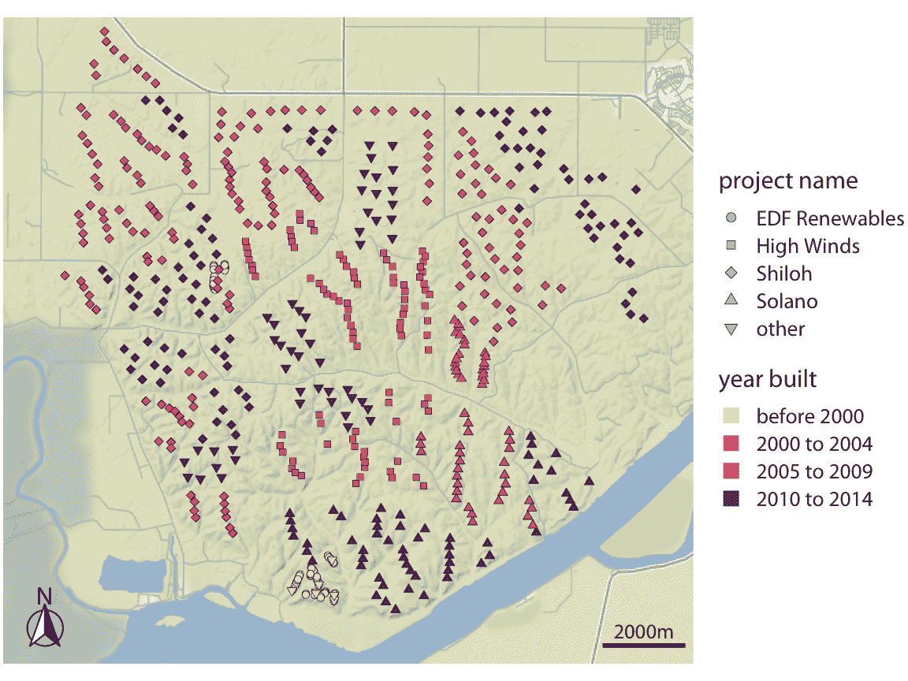

图 15.10：Shiloh 风电场中各个风力涡轮机的位置。每个点突出显示一个风力涡轮机的位置。地图区域对应于图 15.8 中的矩形。点的颜色代表风力涡轮机的建造时间，并且点的形状代表各个风力涡轮机所属的各种项目。地图由 Stamen Design 制作，以 CC BY 3.0 授权。地图数据来自 OpenStreetMap，以 ODbL 授权。风力涡轮机数据：美国风力涡轮机数据库

## 15.3 等值线图

我们经常想要展示一些数量在不同地点的变化情况。我们可以通过根据我们想要显示的数据维度对地图中的各个区域进行着色来实现。这种地图称为等值线图。

举一个简单的例子，考虑美国各地的人口密度（每平方公里人数）。我们取美国每个县的人口数量，除以县的面积，然后绘制一个地图，每个县的颜色对应于人口数量和面积之间的比例（图 15.11） 。我们可以看到，东部和西部海岸线上的主要城市是美国人口最多的地区，大平原和西部各州人口密度低，阿拉斯加州人口最少。

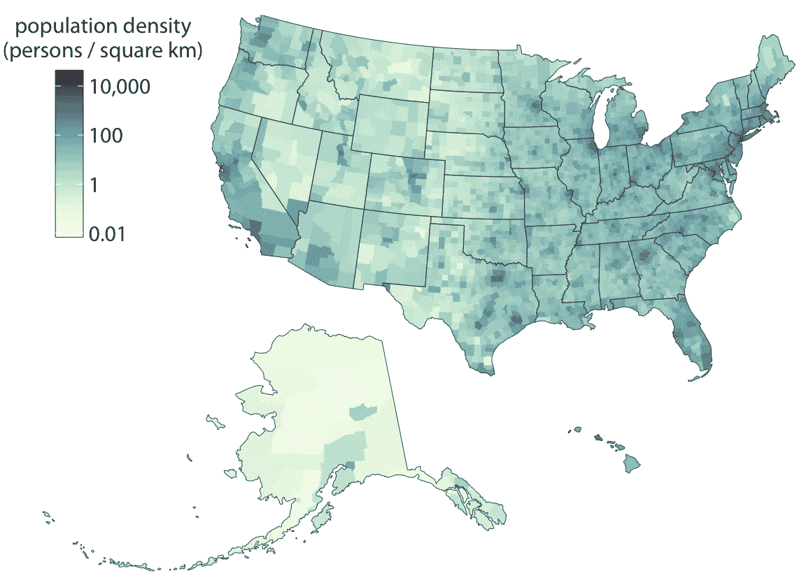

图 15.11：美国每个县的人口密度，以等值线图形示。人口密度报告为每平方公里人数。数据来源：2015 年五年美国社区调查

图 15.11 使用浅色表示低人口密度和深色表示高密度，因此高密度都市区域在浅色背景上突出显示为深色。当图形的背景颜色较浅时，我们倾向于将较暗的颜色与较高的强度相关联。但是，我们也可以在深色背景上选择高值较浅的颜色刻度（图 15.12 ）。只要较浅的颜色落入红黄色光谱中，使它们看起来发光，它们就可以被认为代表更高的强度。作为一般原则，当图形打印在白纸上时，浅色背景区域（如图 15.11 ）通常会更好。对于在线观看或在深色背景上，深色背景区域（如图 15.12 ）可能更好。

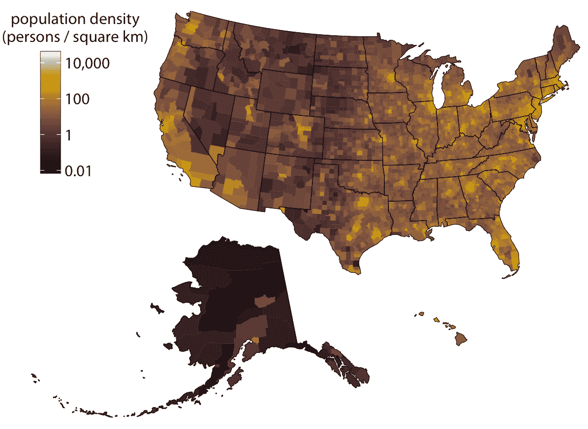

图 15.12：美国每个县的人口密度，以等值线图形示。该图与图 15.11 相同，不同之处在于现在颜色刻度的浅色用于高人口密度，和深色用于低人口密度。数据来源：2015 年五年美国社区调查

当着色代表密度（即，一些量除以表面积，如图 15.11 和 15.12 ）时，等值线最佳。我们认为较大的区域对应于较大的总量而不是较小的总量（另见关于比例墨水的章节，第十七章），并且密度的阴影校正了这种影响。然而，在实践中，我们经常看到根据一些非密度量着色的等值线。例如，在图 4.4 中，我显示了德克萨斯州的年收入中位数的等值线。这些等值线图要谨慎准备。我们可以通过两种条件对非密度量进行颜色映射：首先，如果我们着色的所有区域具有大致相同的大小和形状，那么我们不必担心，某些区域仅仅因为他们的大小，而获得不成比例的关注。其次，如果我们着色的各个区域相对于地图的整体尺寸相对较小，并且如果颜色所代表的数量，在比单个着色区域大的规模上发生变化，那么我们再次不必担心某些区域仅仅由于它们的大小而获得不成比例的注意力。图 4.4 中大致满足这两个条件。

在等值线图中考虑连续与离散颜色刻度的影响也很重要。虽然连续的颜色刻度往往看起来很吸引人（例如，图 15.11 和 15.12 ），但它们可能难以阅读。我们不太擅长识别特定的颜色值并将其与连续刻度相匹配。因此，通常将数据值分组为用不同颜色表示的离散组。大约四到六个箱是一个不错的选择。分箱会牺牲一些信息，但另一方面，分箱颜色可以被唯一识别。例如，图 15.13 将德克萨斯州的收入中位数图（图 4.4 ）扩展到美国所有县，并使用由五个不同收入箱组成的颜色刻度。

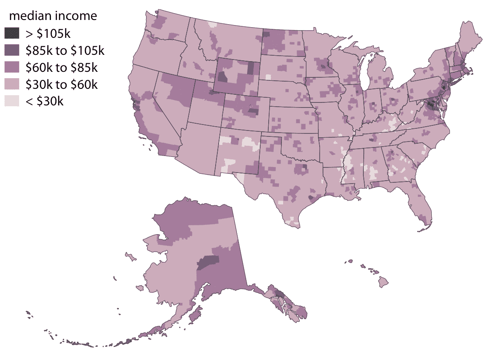

图 15.13：美国每个县的收入中位数，显示为等值线图。收入中位数值被分为五个不同的组，因为分箱颜色刻度度通常比连续颜颜色刻度度更容易阅读。数据来源：2015 年五年美国社区调查

虽然整个美国的县的大小和形状都不像德克萨斯州那样，但我认为图 15.13 仍然可以作为一个等值线图。没有个别的县过度主导地图。但是，当我们在州一级绘制一张类似的地图时，情况会有所不同（图 15.14 ）。然后阿拉斯加主导了等值线，并且由于其规模，表明收入中位数超过 70,000 美元是常见的。然而，阿拉斯加人口稀少（参见图 15.11 和 15.12 ），因此阿拉斯加的收入水平仅适用于美国人口的一小部分。绝大多数美国县，其人口比阿拉斯加州的人口都要多，收入中位数低于 60,000 美元。

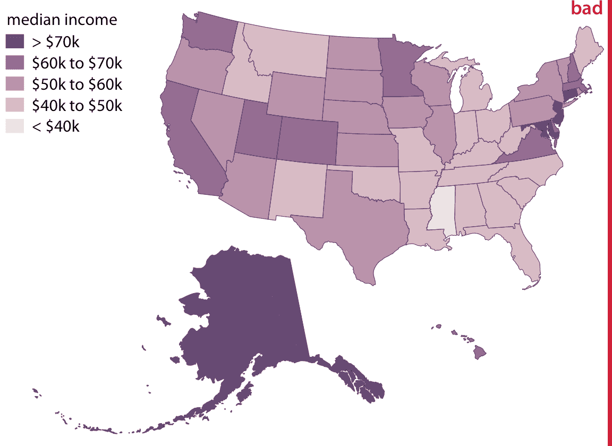

图 15.14：美国每个州的收入中位数，显示为等值线图。这张地图在视觉上由阿拉斯加州主导，阿拉斯加州的收入中位数很高但人口密度很低。与此同时，东海岸人口密集的高收入州在这张地图上看起来并不十分突出。总的来说，这张地图提供了美国收入分布的可视化，因此我将其标记为“不好”。数据来源：2015 年五年美国社区调查

## 15.4 统计地图

并非每个类似地图的可视化都必须在地理上准确才有用。例如，图 15.14 的问题在于，一些州占据了相对较大的区域，但人口稀少，而其他州占据了一小块区域，但却拥有大量居民。如果我们对各州进行变形，使其规模与居民人数成比例怎么样？这样的修改后的地图称为统计地图，图 15.15 显示了收入中位数数据集的外观。我们仍然可以识别个别州，但我们也看到，形状的调整如何产生了重要的修改。东海岸各州，佛罗里达州和加利福尼亚州的规模增长很多，而其他西部州和阿拉斯加州则已经折叠。

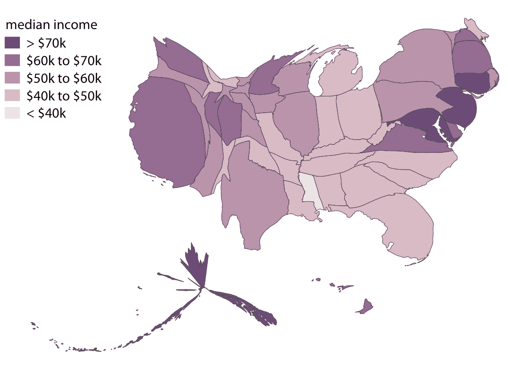

图 15.15：美国每个州的收入中位数，以统计地图的形式显示。各个州的形状已被修改，使得它们的面积与居民的数量成比例。数据来源：2015 年五年美国社区调查

作为具有扭曲形状的统计地图的替代方案，我们还可以绘制更简单的统计热图，其中每个州由彩色方块表示（图 15.16 ）。虽然这种表示不能纠正每个州的人口数量，因此低度表示代表人口较多的州，并过度表示人口较少的州，但至少它平等地对待所有州，并且不会根据其形状或大小任意权衡它们。

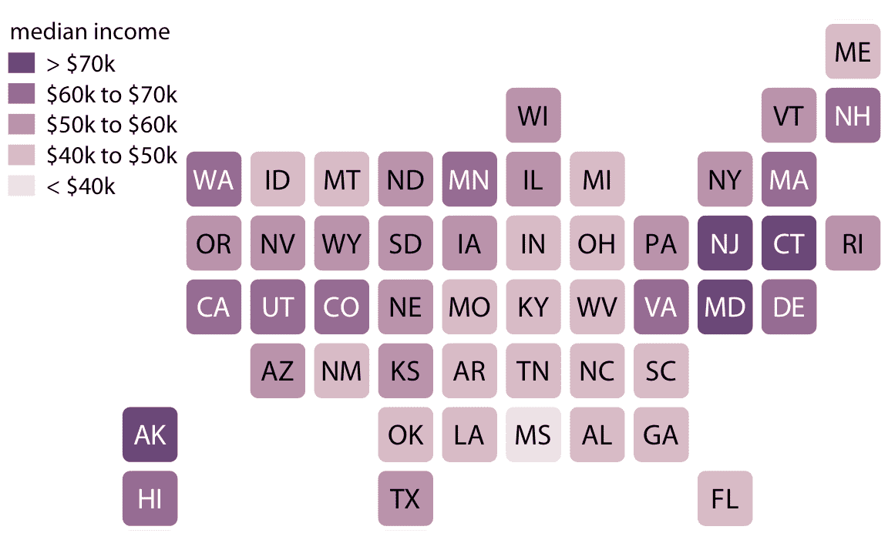

图 15.16：美国每个州的收入中位数，显示为统计热图。每个州由相同大小的方块表示，并且方块根据每个州相对于其他州的近似位置来排列。该表示为每个州提供相同的视觉权重。数据来源：2015 年五年美国社区调查

最后，我们可以通过在每个州的位置放置单独的绘图，来绘制更复杂的统计地图。例如，如果我们想要了解每个州的失业率随时间的演变，为每个州绘制一个单独的图形，然后根据各州之间的近似相对位置排列图形（图 15.17 ）有所帮助。对于熟悉美国地理的人来说，这种排列可以使得更容易找到特定州的图形而不是，例如，按字母顺序排列它们。此外，人们会期望相邻州显示类似的模式，图 15.17 表明情况确实如此。

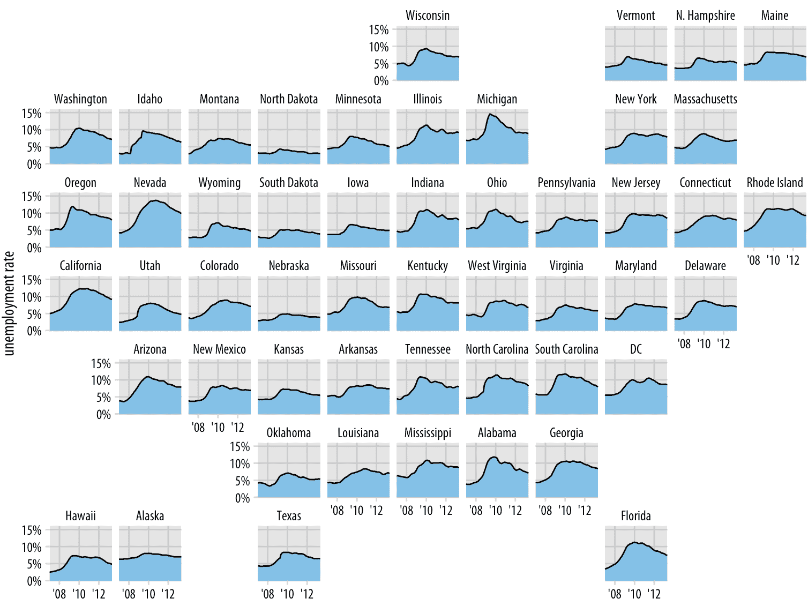

图 15。17：各州在 2008 年金融危机之前和之后的失业率。每个面板显示一个州的失业率，包括哥伦比亚特区（DC），从 2007 年 1 月至 2013 年 5 月。垂直网格线标记 2008 年，2010 年和 2012 年 1 月。地理位置接近的州在失业率方面往往表现出类似的趋势。数据来源：美国劳工统计局