# 16 可视化不确定性

> 原文： [16 Visualizing uncertainty](https://serialmentor.com/dataviz/visualizing-uncertainty.html)

> 校验：[飞龙](https://github.com/wizardforcel)

> 自豪地采用[谷歌翻译](https://translate.google.cn/)

数据可视化最具挑战性的方面之一是不确定性的可视化。当我们看到在特定位置绘制的数据点时，我们倾向于将其解释为真实数据值的精确表示。很难想象数据点实际上可能位于尚未绘制的某个位置。然而，这种情况在数据可视化中无处不在。几乎我们使用的每个数据集都有一些不确定性，我们选择表示这种不确定性的方式，对我们的受众多么准确地感知数据的含义，可能产生重大影响。

指示不确定性的两种常用方法，是误差条和置信带。这些方法是在科学出版物的背景下开发的，它们需要正确解释一些专业知识。然而，它们精确且节省空间。例如，通过使用误差条，我们可以在单个图中显示许多不同参数估计值的不确定性。然而，对于非专业读者而言，产生不确定性的强烈直观印象的可视化策略可能更好，即使它们的代价是降低可视化精度或减少密集数据的展示。这里的选项包括频率成帧，我们以近似比例明确绘制不同的可能场景，或者循环不同可能场景的动画。

## 16.1 将概率表现为频率

在我们讨论如何可视化不确定性之前，我们需要定义它实际上是什么。我们可以在未来事件的背景下直观掌握不确定性的概念。如果我要翻硬币，我不知道结果会是什么样。最终的结果是不确定的。不过，我也不确定过去的事件。如果昨天我从我的厨房窗户向外看了两次，一次是在早上 8 点，一次是在下午 4 点，我在早上 8 点看到一辆红色汽车停在街对面，下午 4 点没有，然后我可以总结，汽车在八小时的时间窗口中的某个时间点离开了，但我不确切知道是什么时候。可能是上午 8:01，上午 9:30，下午 2 点，或者在这八个小时的任何其他时间。

在数学上，我们通过使用概率概念来处理不确定性。概率的精确定义很复杂，远远超出了本书的范围。然而，我们可以在不了解数学的所有错综复杂的细节的情况下，成功地推导概率。对于许多实际相关的问题，考虑相对频率就足够了。假设您执行某种随机试验，例如掷硬币或掷骰子，并寻找特定结果（例如，正面或六点）。你可以称这个结果为成功，和任何其他结果为失败。然后，如果你一遍又一遍地重复随机试验，成功的概率大约由你看到结果的一小部分给出。例如，如果特定结果以 10% 的概率发生，那么我们预计在许多重复试验中，结果将在大约十分之一的情况中出现。

可视化单个概率很困难。你如何可视化在彩票中获胜，或者用匀质的骰子掷出六点的几率？在这两种情况下，概率都是单个数字。我们可以将该数字视为一个数量，并使用第六章中讨论的任何技术显示它，例如条形图或点图，但结果不会非常有用。大多数人缺乏概率值如何转化为经验现实的直观理解。将概率值显示为条形或作为点放在一条线上，无助于此问题。

我们可以通过创建一个图形，强调随机试验的频率切面和不可预测性，来使概率概念变得有形，例如通过绘制随机排列的不同颜色的方块。在图 16.1 中，我使用这种技术可视化三种不同的概率，1% 的成功几率，10% 的成功几率和 40% 的成功率。为了阅读这个图，想象一下，你得到了一个选择深色方块的任务，通过选择一个方块，然后看到哪个方块是深色，哪个方块是浅色。 （如果你愿意的话，你可以考虑闭着眼睛挑选一个方块。）直观地说，你可能会理解在 1% 几率情况下，不太可能选择一个深色的方块。同样，在 10% 几率 的情况下，仍然不太可能选择深色的方块。然而，在 40% 的情况下，胜率看起来并不那么糟糕。这种可视化风格，其中我们显示特定的潜在结果，被称为离散结果可视化，并且将概率可视化为频率的行为被称为频率成帧。我们根据易于理解的结果的频率来表现结果的概率性质。

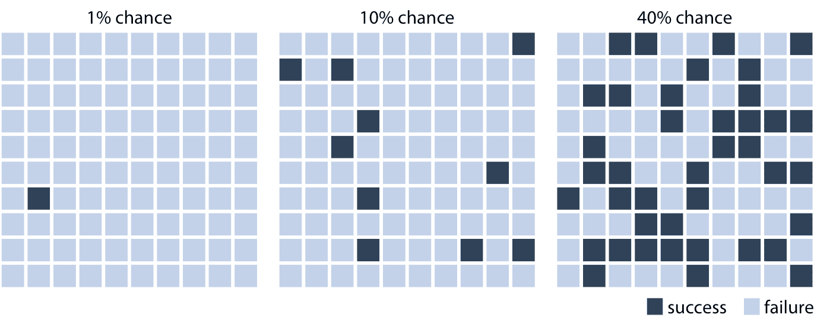

图 16.1：将概率可视化为频率。每个网格中有 100 个方块，每个方块表示在某些随机试验中成功或失败。 1% 的成功几率对应于一个深色和 99 个浅色方块，10% 的成功几率对应于十个深色和 90 个浅色方块，并且 40% 的成功几率对应于 40 个深色和 60 个浅色方块。通过在浅色方块中随机放置深色方块，我们可以创建随机性的视觉印象，强调单个试验结果的不确定性。

如果我们只对两个不连续的结果（成功或失败）感兴趣，那么诸如图 16.1 之类的可视化就可以正常工作。然而，我们经常处理更复杂的情况，其中随机试验的结果是数字变量。一个常见的情况是选举预测，我们不仅对谁将获胜而且对多少人感兴趣。让我们考虑一个假设的例子，即即将举行的选举，包括黄方和蓝方。假设您在广播中听到蓝方预计比黄方有一个百分点的优势，误差率为 1.76 个百分点。这些信息告诉你选举的可能结果是什么？听到“蓝方会赢”是人类本性，但现实更为复杂。首先，最重要的是，有一系列不同的可能结果。蓝方最终可能以 2 个百分点的领先优势赢得选举，或者黄方最终以半个百分点的领先优势获胜。可能结果的范围及其相关可能性称为概率分布，我们可以将其绘制为平滑曲线，该曲线上升然后落在可能结果的范围内（图 16.2 ）。特定结果的曲线越高，结果越可能。概率分布与第七章中讨论的直方图和核密度密切相关，您可能需要重新阅读该章以刷新记忆。

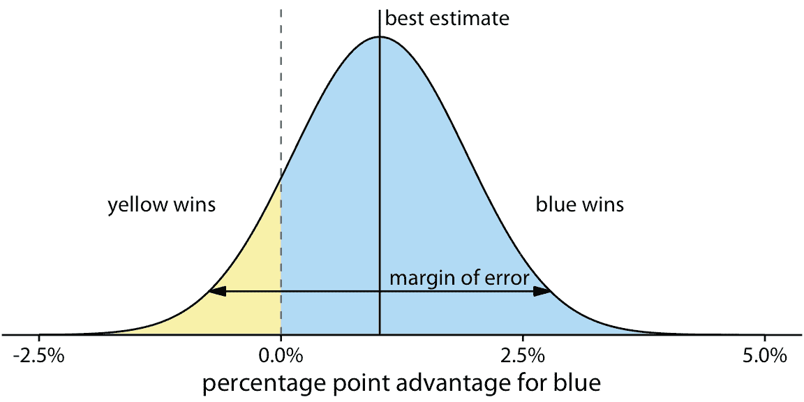

图 16.2：选举结果的假设预测。预计蓝方将赢得黄方约一个百分点（标记为“最佳估计值”），但该预测存在误差幅度（它覆盖 95% 的可能结果，以最佳预测为中心，两个方向上的 1.76 个百分点）。蓝色阴影区域占总数的 87.1%，代表蓝色获胜的所有结果。同样，黄色阴影区域占总数的 12.9%，代表黄色获胜的所有结果。在这个例子中，蓝色有 87% 的机会赢得选举。

通过做一些数学计算，我们可以计算出，对于我们的例子，黄方获胜的几率是 12.9%。因此，黄方获胜的几率比图 16.1 中显示的 10% 几率情况要好一些。如果你喜欢蓝方，你可能不会过于担心，但黄方有足够的获胜几率，他们可能碰巧成功。如果将图 16.2 与图 16.1 进行比较，您可能会发现图 16.1 在结果中创造了更好的不确定性的感觉，即使阴影区域在图 16.2 准确地表示蓝方或黄方获胜的概率。这是离散结果可视化的力量。对人类感知的研究表明，我们在识别，计数和判断离散物体的相对频率方面要好得多 - 只要它们的总数不是太大 - 而不是判断不同区域的相对大小。

我们可以通过绘制分位数点图（Kay 等人 2016）将图 16.1 的离散结果性质与图 16.2 中的连续分布相结合）。在分位数点图中，我们将曲线下的总面积细分为均匀大小的单位，并将每个单位绘制为圆形。然后我们堆叠圆形使得它们的排列大致代表原始分布曲线（图 16.3 ）。

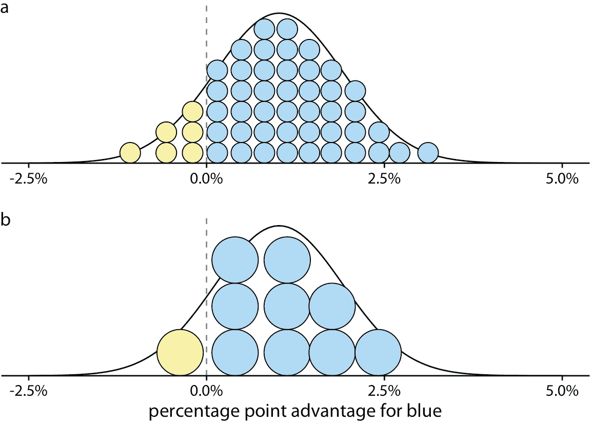

图 16.3：图 16.2 的选举结果分布的分位数点图形示。 （a）平滑分布用 50 个点近似，每个代表 2% 的几率。因此，六个黄点对应的概率为 12%，合理接近 12.9% 的真实值。 （b）平滑分布近似为 10 个点，每个点几率为 10%。因此，一个黄点对应 10% 的几率，仍然接近真实值。具有较少数量点的分位数点图往往更容易阅读，因此在该示例中，10 点版本可能优于 50 点版本。

作为一般原则，分位点点图应使用小到中等数量的点。如果点太多，那么我们倾向于将它们视为连续体而不是单独的离散单位。这抵消了离散图的优点。图 16.3 显示具有 50 个点（图 16.3a）和 10 个点（图 16.3b）的变体。虽然 50 个点的版本更准确地捕获真实的概率分布，但是点的数量太大而不能容易地区分各个点。十个点的版本立即传达了蓝方或黄方获胜的相对几率。对十个点的版本的一个缺陷可能是它不是很精确。我们对黄方获胜的几率过少表示为 2.9 个百分点。然而，通常值得牺牲一些数学精度，来获得所得可视化的更准确的人类感知，特别是在与非专业读者进行交流时。在数学上正确但感知上不正确的可视化在实践中没有用。

## 16.2 可视化点估计的不确定性

在图 16.2 中，我显示了“最佳估计值”和“误差幅度”，但我没有解释这些量究竟是什么或者如何获得它们。为了更好地理解它们，我们需要快速介绍统计抽样的基本概念。在统计数据中，我们的首要目标是通过查看世界的一小部分来了解世界。继续选举的例子，假设有许多不同的选区，每个选区的公民都要为蓝方或黄方投票。我们可能想要预测每个选区的投票方式，以及各地区的整体投票均值（平均值）。为了在选举前做出预测，我们不能对每个选区的每个公民进行民意调查，来了解他们将如何投票。相反，我们必须轮询选区子集的公民子集，并使用这些数据得出最佳猜测。在统计语言中，所有选区所有公民的可能投票总数称为总体，我们调查的公民和/或选区的子集是样本。总体代表了世界的潜在真实状态，样本是我们进入这个世界的窗口。

我们通常对汇总总体重要属性的具体数量感兴趣。在选举的例子中，这些可能是跨选区的投票结果的均值或选区结果之间的标准差。描述总体的数量称为参数，并且它们通常是不可知的。但是，我们可以使用样本来猜测真实参数值，统计学家将这些猜测称为估计值。样本均值是总体均值的估计值，这是一个参数。各个参数值​​的估计值也称为点估计，因为每个参数值可以由线上的点表示。

图 16.4 显示了这些关键概念如何相互关联。兴趣变量（例如，每个选区的投票结果）在总体中具有一些分布，总体具有总体平均值和总体标准差。样本将包含一组特定的观测值。样本中单个观测值的数量称为样本大小。从样本中我们可以计算样本均值和样本标准差，这些通常与总体均值和标准差不同。最后，我们可以定义采样分布，如果我们多次重复采样过程，它是我们将获得的估计分布。采样分布的宽度称为标准误差，它告诉我们估计的精确程度。换句话说，标准误差提供了与我们的参数估计值相关的不确定性的度量。作为一般规则，样本量越大，标准误差越小，因此估计的不确定性越小。

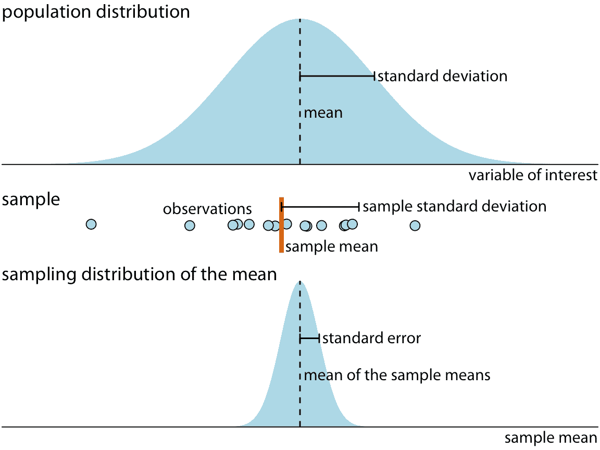

图 16.4：统计抽样的关键概念。我们正在研究的兴趣变量在总体中具有一些真实的分布，具有真实的总体平均值和标准差。该变量的任何有限样本将具有样本均值和标准差，与总体参数不同。如果我们每次重复采样并计算平均值，则所得均值遵循均值的采样分布。标准误差提供采样分布宽度的信息，告诉我们估计兴趣参数（这里是总体平均值）的准确程度。

至关重要的是，我们不要混淆标准差和标准误差。标准差是总体的属性。它告诉我们，我们可以做出的个别观测值的分散程度。例如，如果我们考虑投票区的总体，标准差告诉我们不同的选域的差异是多少。相比之下，标准误差告诉我们，我们确定参数估计值的准确程度。如果我们想估计所有选区的投票结果均值，那么标准误差会告诉我们对均值的估计有多准确。

所有统计学家都使用样本来计算参数估计值及其不确定性。然而，他们将这些计算方式分为贝叶斯主义者和频率论者。贝叶斯假设他们对世界有一些先验知识，他们使用样本来更新这些知识。相比之下，频率论者试图在没有任何先验知识的情况下，对世界做出精确的陈述。幸运的是，当涉及可视化不确定性时，贝叶斯和频率论者通常可以采用相同类型的策略。在这里，我将首先讨论频率论方法，然后描述贝叶斯环境特有的一些特定问题。

频率论者最常用误差条来表示不确定性。虽然误差条可用作不确定性的可视化，但它们并非没有问题，我在第九章中已经提到（见图 9.1 ）。读者很容易对误差条代表什么感到困惑。为了突出这个问题，在图 16.5 中，我展示了同一数据集的误差条的五种不同用法。该数据集包含巧克力棒的专家评级，针对在许多不同国家制造的巧克力棒，评级为 1 至 5。对于图 16.5 ，我提取了加拿大制造的巧克力棒的所有评级。样本显示为分散点的条带图，在它下方，我们看到样本均值加/减样本标准差，样本均值加/减标准误差，以及 80%，95% 和 99% 置信区间。所有五个误差条都来自样本中的变化，它们都是数学上相关的，但它们具有不同的含义。它们在视觉上也非常独特。


图 16.5：巧克力棒评级示例中的样本，样本均值，标准差，标准误差和置信区间之间的关系。组成样本的观测值（显示为分散的绿点）代表来自加拿大制造商的 125 个巧克力棒的专家评级，评级从 1（最差）到 5（最好）。较大橙色点代表评级的平均值。误差条从上到下表示标准差的两倍，标准误差的两倍（平均值的标准差），以及平均值的 80%，95% 和 99% 置信区间。数据来源：曼哈顿巧克力学会 Brady Brelinski

每当您使用误差条显示不确定性时，您必须指定误差条表示的数量和/或置信度。

标准误差近似为样本标准差除以样本大小的平方根，置信区间是通过将标准误差乘以小的常数值来计算的。例如，95% 置信区间在平均值的任一方向上延伸约为标准误差的两倍。因此，较大的样本往往具有较窄的标准误差和置信区间，即使它们的标准差相同。当我们比较加拿大巧克力棒和瑞士巧克力棒的评级时，我们可以看到这种效应（图 16.6 ）。加拿大和瑞士巧克力棒的评级均值和样本标准差相当，但我们对 125 加拿大棒和 38 瑞士棒进行评级，因此瑞士棒的均值的置信区间要宽得多。

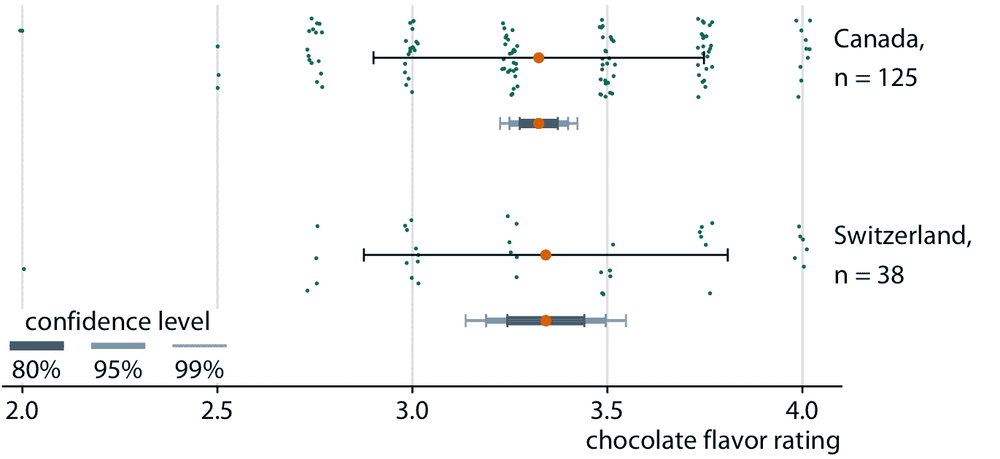

图 16.6：随着样本量的缩小，置信区间变宽。来自加拿大和瑞士的巧克力棒具有可比较的评级均值和可比较的标准差（用简单的黑色误差条表示）。然而，被评级的加拿大巧克力棒是瑞士的三倍，因此瑞士的评级均值（用不同颜色和厚度的误差条表示）的置信区间，比加拿大要宽。数据来源：曼哈顿巧克力学会 Brady Brelinski

在图 16.6 中，我同时显示三个不同的置信区间，使用较暗的颜色和较粗的线条表示较低置信度的区间。我将这些可视化称为分级误差条。分级有助于读者认识到存在一系列不同的可能性。如果我向一组人显示简单的误差条（没有分级），则至少其中一些人可能会以确定性的方式感知误差条，例如表示数据的最小值和最大值。或者，他们可能认为误差条描绘了参数估计值的可能范围，即，估计值永远不会落在误差条之外。这些类型的误解称为确定性解释错误。我们越能将确定性解释错误的风险降至最低，我们对不确定性的可视化就越好。

误差条很方便，因为它们允许我们同时显示许多估计值及其不确定性。因此，它们通常用于科学出版物，其主要目标通常是向专业读者传达大量信息。作为此类应用的一个例子，图 16.7 显示了在六个不同国家生产的巧克力棒的巧克力评级均值和相关置信区间。

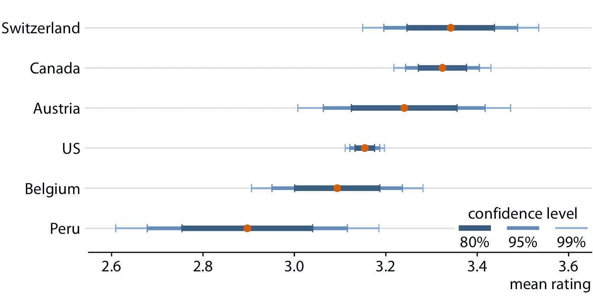

图 16.7：来自六个不同国家的制造商的巧克力棒的巧克力风味评级均值和相关置信区间。数据来源：曼哈顿巧克力学会 Brady Brelinski

在查看图 16.7 时，您可能想知道，它告诉我们关于评级均值的差异的什么事情。加拿大，瑞士和奥地利的评级均值高于美国，但考虑到这些评级均值的不确定性，均值有显着差异吗？这里的“显着”一词是统计学家使用的技术术语。如果我们有一定程度的置信度，可以拒绝观察到的差异是由随机抽样引起的假设，我们称差异显着。由于仅仅有限数量的加拿大和美国巧克力棒得到了评级，评估者可能会意外地考虑更多更好的加拿大巧克力棒和更少更好的美国巧克力棒，而这种随机几率可能像是加拿大对美国巧克力棒的系统评级优势。

评估图 16.7 的显著性是困难的，因为加拿大和美国的评级均值都有不确定性。两个不确定性都对均值是否不同很重要。统计教科书和在线教程有时会发布，如何根据误差条重叠或不重叠的程度来判断重要性的经验法则。但是，这些经验法则不可靠，应该避免。评估评级均值是否存在差异的正确方法是计算差异的置信区间。如果这些置信区间不包括零，那么我们知道在相应的置信水平上差异是显着的。对于巧克力评级数据集，我们看到只有来自加拿大巧克力棒的评级明显高于美国（图 16.8）。对于瑞士的巧克力棒，差异的 95% 置信区间几乎不包括零值。因此，美国和瑞士巧克力棒的评级均值之间的差异在 5% 水平上几乎不显着。最后，根本没有证据表明奥地利巧克力棒的评级均值系统高于美国。

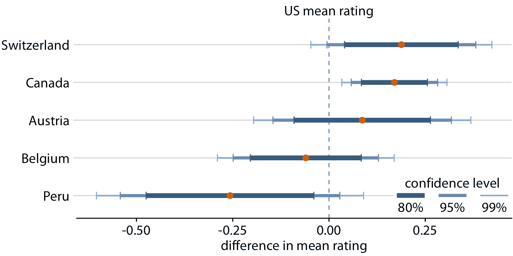

图 16.8：来自五个不同国家的制造商的巧克力风味评级均值，相对于美国巧克力棒的评级均值。加拿大巧克力棒的评级明显高于美国。对于其他四个国家，在 95% 置信水平下，与美国的评级均值没有显着差异。使用 Dunnett 方法对多个比较调整了置信水平。数据来源：曼哈顿巧克力学会 Brady Brelinski

在前面的图中，我使用了两种不同类型的误差条，分级和简单。更多变体是可能的。例如，我们可以在末尾绘制带或不带帽子的误差条（图 16.9a，c 对比图 16.9b，d）。所有这些选择都有优点和缺点。分级误差条突出显示对应于不同置信水平的不同区间的存在。然而，这些附加信息的另一面是增加了视觉噪声。根据图形的复杂程度和信息密集程度，简单的误差条可能优于分级条形图。是否绘制带有或不带帽子的误差条主要是个人品味的问题。帽子突出显示误差条的结束位置（图 16.9 a，c），而没有帽子的误差条同样强调整个区间范围（图 16.9b， d）。此外，再次，帽子增加了视觉噪声，因此在具有许多误差条的图中省略帽子可能是优选的。

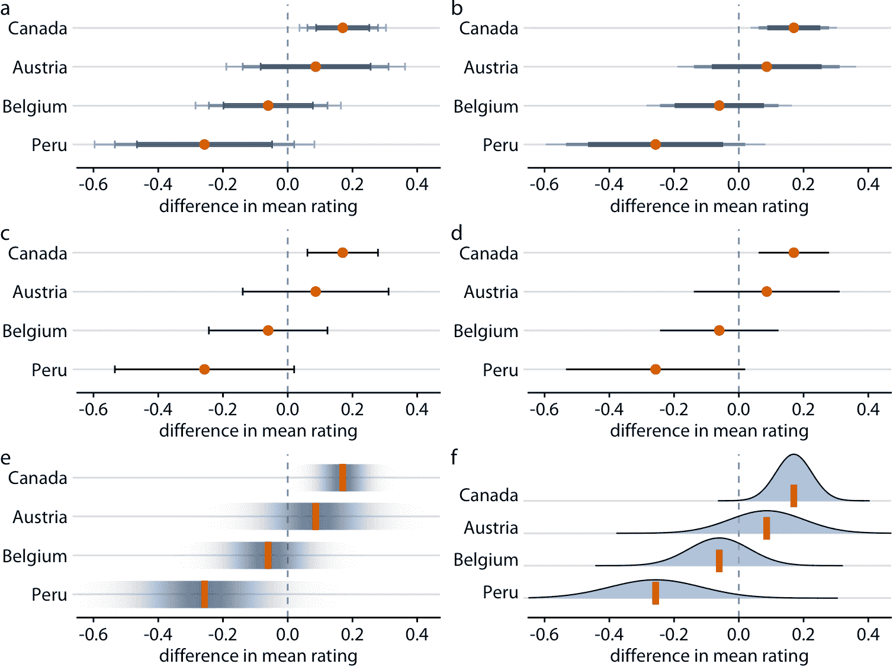

图 16.9：来自四个不同国家的制造商的巧克力风味评级均值，相对于美国巧克力棒的评级均值。每个面板使用不同的方法来可视化相同的不确定性信息。 （a）带帽子的分级误差条。 （b）无帽子的分级误差条。 （c）带帽子的单区间误差条。 （d）无帽子的单区间误差条。 （e）置信带。 （f）置信分布。

作为误差条的替代方案，我们可以绘制逐渐消失的置信带（图 16.9 e）。置信带更好地传达了不同值的可能性，但它们很难阅读。我们必须在视觉上整合不同的颜色阴影，来确定特定置信度结束的位置。从图 16.9 中我们可以得出结论，秘鲁巧克力棒的评级均值明显低于美国巧克力棒，但事实并非如此。当我们显示明确的置信度分布时会出现类似的问题（图 16.9 f）。很难在视觉上整合曲线下面积，并确定给定置信水平的确切位置。然而，通过绘制分位数点图可以稍微减轻这个问题，如图 16.3。

对于简单的二维图形，误差条比更复杂的不确定性显示具有一个重要优势：它们可以与许多其他类型的图形组合。对于我们可能具有的几乎任何可视化，我们可以通过添加误差条来添加一些不确定性指示。例如，我们可以通过绘制带有误差条的条形图，来显示具有不确定性的数量（图 16.10）。这种类型的可视化通常用于科学出版物中。我们还可以在散点图中沿 *x* 和 *y* 方向绘制误差条（图 16.11）。

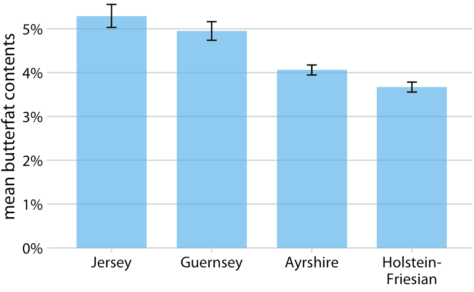

图 16.10：四种牛的牛奶的平均乳脂含量。误差条表示平均值加减一个标准误差。这种可视化在科学文献中经常出现。虽然它们在技术上是正确的，但它们既不很好地代表每个类别中的变化，也不代表样本的不确定性。有关单个品种中乳脂含量的变化，请参见图 7.11。数据来源：加拿大纯种奶牛的表现记录

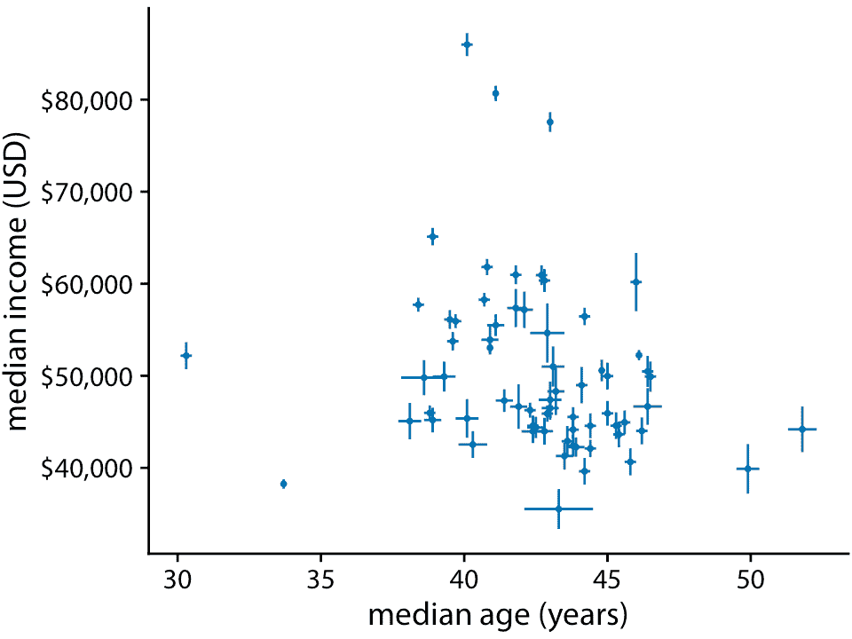

图 16。11：宾夕法尼亚州 67 个县的收入中位数与年龄中位数。误差条表示 90% 置信区间。数据来源：2015 年美国五年社区调查

让我们回到频率论者和贝叶斯主义者的话题。频率论者用置信区间评估不确定性，而贝叶斯学家计算后验分布和可信区间。贝叶斯后验分布告诉我们，给定输入数据的特定参数估计值的可能性。可信区间表示一个值的范围，参数值以给定概率位于其中，就像从后验分布中计算一样。例如，95% 的可信区间对应于后验分布的中间 95%。真实参数值有 95% 的可能性处于 95% 可信区间。

如果您不是统计学家，您可能会对我对可信区间的定义感到惊讶。您可能认为它实际上是置信区间的定义。它不是。贝叶斯可信区间告诉您真实参数可能在哪里，频率论置信区间告诉您真实参数可能不在哪里。虽然这种区别可能看起来像语义上的，但两种方法之间存在重要的概念差异。在贝叶斯方法下，您使用数据和您之前的所研究系统的知识（称为先验）来计算概率分布（后验），告诉您可以预期真实参数值位于哪里。相比之下，在频率论方法下，你首先假设你打算拒绝。该假设被称为零（原）假设，并且通常简单地假设参数等于零（例如，两个条件之间没有差异）。然后计算随机抽样生成的数据，类似于零假设为真时的观测数据的概率。置信区间是该概率的表示。如果给定置信区间排除零假设下的参数值（即零值），则可以在该置信水平拒绝零假设。或者，您可以将置信区间视为一个区间，它以指定可能性在重复采样下捕获真实参数值（图 16.12 ）。因此，如果真实参数值为零，则 95% 置信区间仅在 5% 的分析样本中排除零。

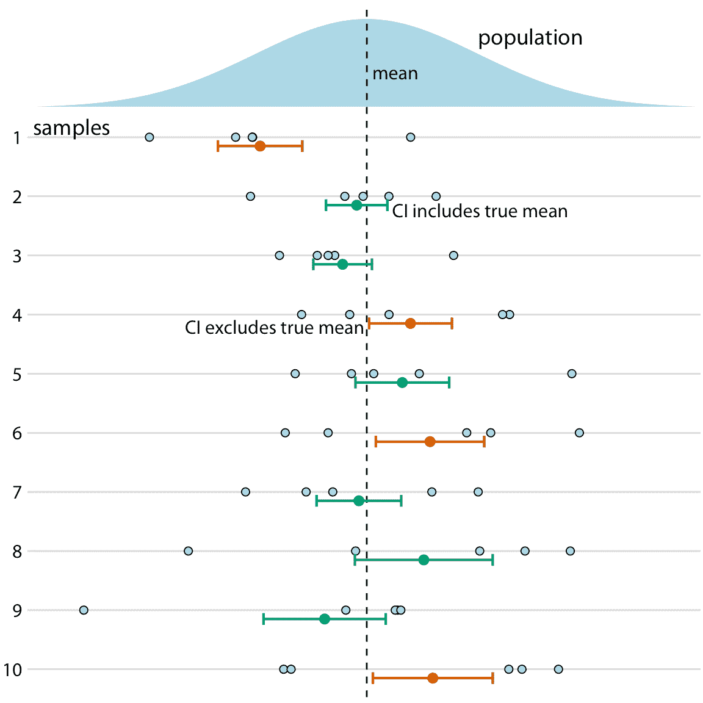

图 16.12：置信区间的频率解释。最好在重复采样的背景下理解置信区间（CI）。对于每个样本，特定置信区间包括或排除真实参数，这里是平均值。但是，如果我们重复采样，那么置信区间（此处显示为 68% 置信区间，对应于样本均值+/-标准误差）在约 68% 的时间中包含真实均值。

总而言之，贝叶斯可信区间对真实参数值进行陈述，频率置信区间对零假设进行陈述。然而，在实践中，贝叶斯和频率论的估计通常非常相似（图 16.13 ）。贝叶斯方法的一个概念优势，是它强调思考效果的大小，而频率论思维强调效果的二元视角，无论是否存在。

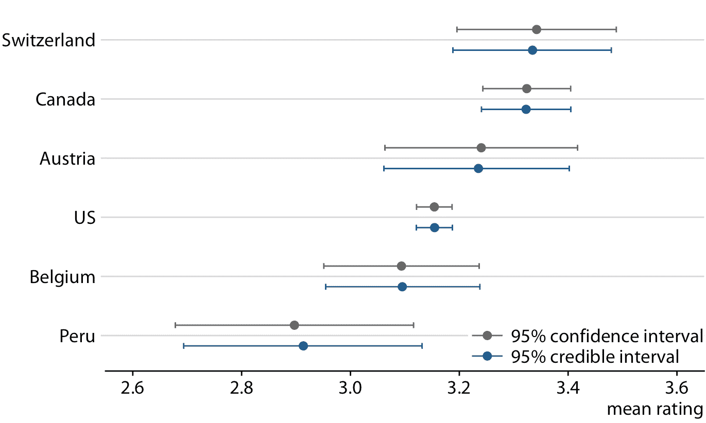

图 16.13：平均巧克力评级的频率论置信区间和贝叶斯可信区间的比较。我们看到两种方法产生相似但不完全相同的结果。特别是，贝叶斯估计显示出少量的收缩，这是最极端的参数估计在整体均值方向上的调整。 （注意瑞士的贝叶斯估计略微向左移动，秘鲁的贝叶斯估计相对于相应的频率估计稍微向右移动。）此处显示的频率估计和置信区间，与图 16.7 所示的 95% 置信的结果相同。

贝叶斯可信区间回答了这样一个问题：“我们期望真实参数值位于何处？”频率主义置信区间回答了一个问题：“我们对于真实参数值不是零的确定程度如何？”

贝叶斯估计的中心目标是获得后验分布。因此，贝叶斯通常将整个分布可视化，而不是将其简化为可信区间。因此，在数据可视化方面，在第七、八、九章中讨论的可视化分布的所有方法都是适用的。具体而言，直方图，密度图，箱线图，提琴图和脊线图都常用于可视化贝叶斯后验分布。由于这些方法已经在他们的具体章节中进行了详细讨论，我将在这里仅展示一个例子，使用脊线图来显示平均巧克力评级的贝叶斯后验分布（图 16.14）。在这个特定情况下，我在曲线下添加了阴影来指示后验概率的定义区域。作为着色的替代方法，我也可以绘制分位数点图，或者我可以在每个分布下添加分级误差条。带有误差条的脊线图称为半眼图，带有误差条的提琴图称为眼图（章节 5.6）。

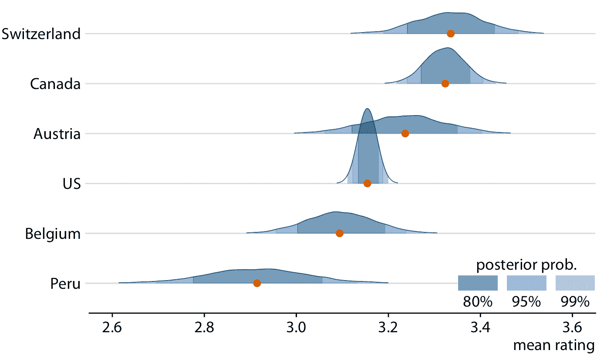

图 16.14：平均巧克力棒评级的贝叶斯后验分布，显示为脊线图。红点代表每个后验分布的中位数。由于难以通过眼睛将连续分布转换为特定置信区域，因此我在每条曲线下添加了阴影来指示每个后验分布的中心 80%，95% 和 99%。

## 16.3 可视化曲线拟合的不确定性

在第 14 章中，我们讨论了如何通过将直线或曲线拟合到数据，来显示数据集中的趋势。这些趋势估计也存在不确定性，并且习惯上在具有置信区间的趋势线中显示不确定性（图 16.15）。置信区间为我们提供了一系列与数据兼容的不同拟合线。当学生第一次遇到一个置信区间时，他们常常会惊讶地发现，即使是完美的直线拟合也会产生一个弯曲的置信带。弯曲的原因是直线拟合可以在两个不同的方向上移动：它可以上下移动（即，具有不同的截距），并且它可以旋转（即，具有不同的斜率）。我们可以通过绘制从拟合参数的后验分布随机生成的一组替代拟合线，来可视地显示置信带是如何产生的。这在图 16.16 中完成，它显示了 15 个随机选择的替代拟合。我们看到，即使每条线都是完全笔直的，每条线的不同斜率和截距的组合也会产生一个整体形状，看起来就像置信区间一样。

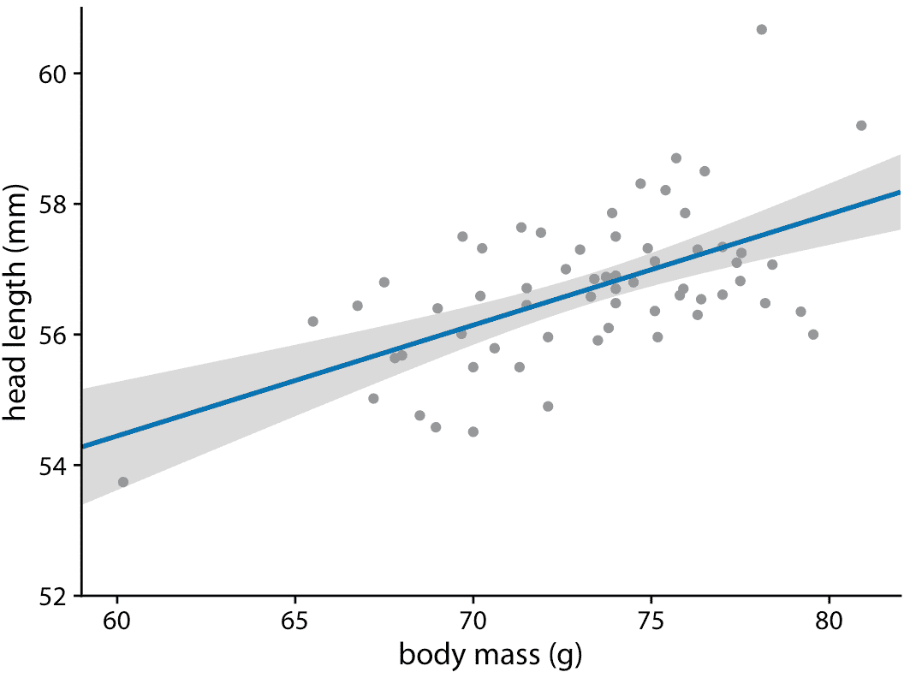

图 16.15：雄性蓝鸟的头长与体重的关系，如图 14.7 所示。蓝色直线代表数据的最佳线性拟合，线周围的灰色条带显示线性拟合的不确定性。灰色条带代表 95% 的置信水平。数据来源：欧柏林学院的 Keith Tarvin

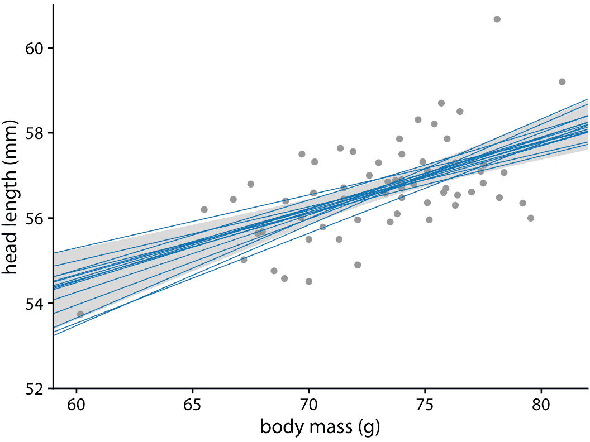

图 16.16：雄性蓝鸟的头长与体重的关系。与图 16.15 相比，蓝色直线现在代表从后验分布中随机抽取的等可能的替代拟合。数据来源：欧柏林学院的 Keith Tarvin

为了绘制置信带，我们需要指定置信水平，正如我们在误差条和后验概率中看到的那样，突出不同的置信水平会很有用。这导致我们进入分级置信区间，一次显示几个置信水平（图 16.17 ）。分级置信带增强了读者的不确定感，并迫使读者面对数据可能支持不同替代趋势线的可能性。

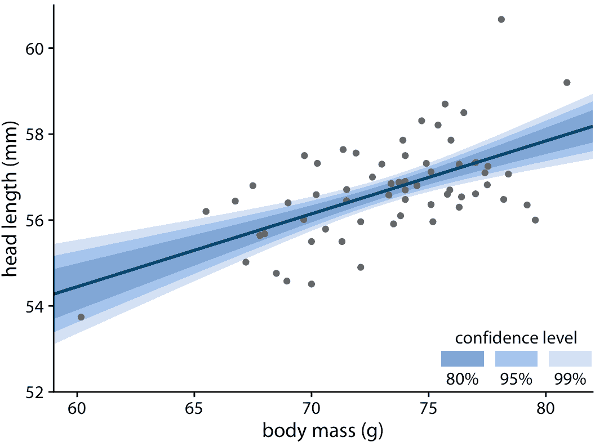

图 16.17：雄性蓝鸟的头长与体重的关系。与误差条的情况一样，我们可以绘制分级置信带，来突出估计中的不确定性。数据来源：欧柏林学院的 Keith Tarvin

我们还可以绘制非线性曲线拟合的置信区间。这样的置信区间看起来不错，但很难解释（图 16.18 ）。如果我们看一下图 16.18a，我们可能会认为，通过向上和向下移动蓝线并可能稍微变形来产生置信带。然而，如图 16.18b 所揭示的，置信带表示一系列曲线，它们比部分（a）所示的整体最佳拟合摆动更大。这是非线性曲线拟合的一般原理。不确定性不仅对应于曲线的上下运动，还对应于增加的摆动。

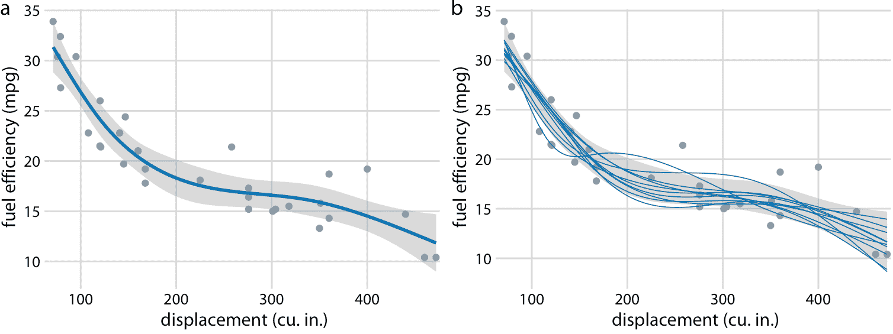

图 16.18：32 辆汽车（1973-74 型号）的燃油效率与排量的关系。每个点代表一辆汽车，通过拟合 5 节的立方回归样条获得平滑线。 （a）最佳拟合样条和置信带。 （b）从后验分布中抽取的等可能的替代拟合。数据来源：Motor Trend，1974。

## 16.4 假设结果图

所有不确定性的静态可视化都受到以下问题的困扰：读者可能将不确定性可视化的某些方面，解释为数据的确定性特征（确定性构造误差）。我们可以通过动画来可视化不确定性，通过循环通过许多不同但等可能的绘图来避免这个问题。这种可视化被称为假设结果图（Hullman，Resnick 和 Adar 2015）或 HOP。虽然在打印介质中不可能有 HOP，但它们在在线设置中非常有效，其中动画可视化可以以 GIF 或 MP4 视频形式提供。 HOP 在口头陈述的背景下也可以很好地运作。

为了说明 HOP 的概念，让我们再回到巧克力棒评级。当您站在杂货店考虑购买一些巧克力时，您可能不关心某些巧克力棒组的平均风味评级，和相关的不确定性。相反，你可能想知道一个更简单的问题的答案，例如：如果我随机拿起一个加拿大和美国制造的巧克力棒，我应该期望哪个更好？为了得到这个问题的答案，我们可以从数据集中随机选择加拿大和美国的巧克力棒，比较他们的评级，记录结果，然后多次重复这个过程。如果我们这样做，我们会发现在大约 53% 的情况下，加拿大巧克力棒将排名更高，47% 的情况下美国巧克力棒排名更高或两个并列。我们可以通过在这几个随机采样中循环，在视觉上显示这个过程，并显示每次抽取的两个巧克力棒的相对评级（图 16.19/16.20）。

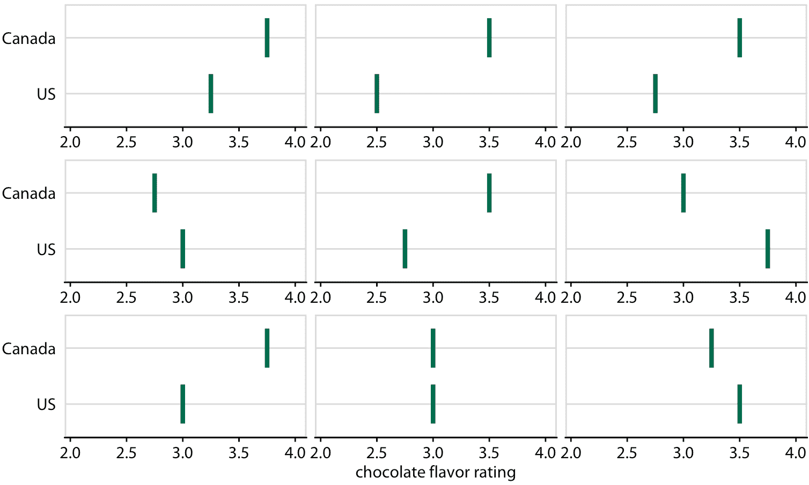

图 16.19 :（用于印刷版）加拿大和美国巧克力棒评级的假设结果图示意图。每个垂直的绿条表示一个巧克力棒的评级，每个面板显示两个随机选择的巧克力棒的比较，每个巧克力棒来自加拿大制造商和美国制造商。在实际的假设结果图中，界面将在不同的绘图面板之间循环，而不是并排显示它们。


图 16.20 ：（对于在线版本）加拿大和美国的巧克力棒评级的假设结果图。每个垂直的绿条表示一个巧克力棒的评级。动画在两个随机选择的巧克力棒的不同情况之间循环，每个来自加拿大制造商和美国制造商。

作为第二个例子，考虑图 16.18b 中等可能的趋势线中的形状变化。由于所有趋势线都是相互重叠绘制的，因此我们主要感知趋势线覆盖的整体区域，这类似于置信区间。理解各个趋势线很困难。通过将此图转换为 HOP，我们可以一次突出显示一个趋势线（图 16.21/16.22）。

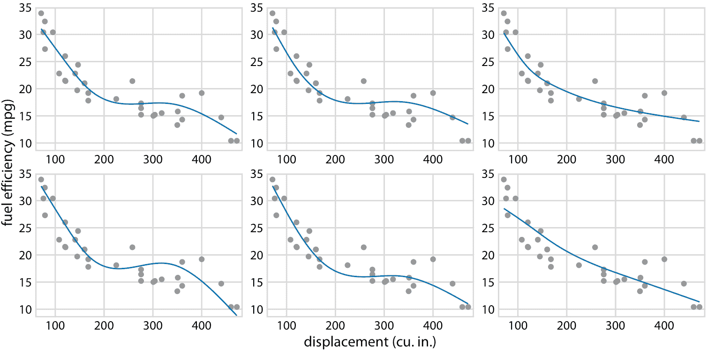

图 16.21 ：（用于印刷版）燃料效率与排量的假设结果图示意图。每个点代表一辆汽车，通过拟合 5 节的立方回归样条获得平滑线。每个面板中的每条线代表一个替代的拟合结果，从拟合参数的后验分布中抽取。在实际的假设结果图中，界面将在不同的绘图面板之间循环，而不是并排显示它们。


图 16.22 ：（对于在线版本）燃料效率与排量的假设结果图。每个点代表一辆汽车，通过拟合 5 节的立方回归样条获得平滑线。界面在不同替代拟合结果之间循环，它们从拟合参数的后验分布抽取。

在制作 HOP 时，您可能想知道在不同结果之间进行硬切换（如在幻灯片投影仪中），或者从一个结果平滑过渡到下一个结果（例如，将一个结果的趋势线慢慢变形直到它看起来像另一个结果的趋势线）是否更好。虽然这在某种程度上是一个需要继续研究的开放性问题，但一些证据表明，平滑过渡使得更难判断所代表的概率（Kale 等 [2018](#ref-Kale_et_al_2018) ）。如果您考虑在结果之间制作动画，您可能希望至少使这些动画很快，或者选择一种动画样式，其中结果淡入淡出而不是从一个变为另一个。

在制作 HOP 时，我们需要注意一个关键方面：我们需要确保我们所展示的结果能够代表可能结果的真实分布。否则，我们的 HOP 可能会产生误导。例如，回到巧克力评级的情况下，如果我随机选择十对结果巧克力棒，其中美国巧克力棒在七种情况下被评为高于加拿大巧克力棒，那么 HOP 会产生错误印象：美国巧克力棒的往往比加拿大巧克力棒评级更高。我们可以通过选择大量结果来防止这个问题，或者通过某种形式验证所展示的结果是否合适，因此采样偏差是不太可能的。在制作图 16.19/16.20 时，我确认加拿大巧克力棒的获胜次数接近 53% 的真实百分比。

### 参考

```
Kay, M., T. Kola, J. Hullman, and S. Munson. 2016. “When (Ish) Is My Bus? User-centered Visualizations of Uncertainty in Everyday, Mobile Predictive Systems.” CHI Conference on Human Factors in Computing Systems, 5092–5103. doi:10.1145/2858036.2858558.

Hullman, J., P. Resnick, and E. Adar. 2015. “Hypothetical Outcome Plots Outperform Error Bars and Violin Plots for Inferences About Reliability of Variable Ordering.” PLOS ONE 10: e0142444. doi:10.1371/journal.pone.0142444.

Kale, A., F. Nguyen, M. Kay, and J. Hullman. 2018. “Hypothetical Outcome Plots Help Untrained Observers Judge Trends in Ambiguous Data.” IEEE Transactions on Visualization and Computer Graphics. doi:10.1109/TVCG.2018.2864909.
```