# 18 处理重叠点

> 原文： [18 Handling overlapping points](https://serialmentor.com/dataviz/overlapping-points.html)

> 校验：[飞龙](https://github.com/wizardforcel)

> 自豪地采用[谷歌翻译](https://translate.google.cn/)

当我们想要显示大型或非常大的数据集时，我们经常遇到这样的挑战：简单的 *x* - *y* 散点图不能工作得很好，因为许多点位于彼此的顶部并且部分或完全重叠。如果以低精度或四舍五入的方式记录数据值，即使在小数据集中也会出现类似的问题，这样多个观测值具有完全相同的数值。通常用于描述这种情况的技术术语是“过度绘图”，即，将许多点绘制在彼此之上。在这里，我将描述您在遇到此挑战时可以采取的几种策略。

## 18.1 局部透明和抖动

我们首先考虑的是仅具有中等数量的数据点但具有大量舍入的场景。我们的数据集包含 1999 年至 2008 年间发布的 234 种流行车型的城市燃油效率和发动机排量（图 18.1 ）。在此数据集中，燃油效率以英里/加仑（mpg）为单位进行测量，并四舍五入到最接近的整数值。发动机排量以升为单位测量，并四舍五入到最接近的分升值。由于这种四舍五入，许多车型具有完全相同的值。例如，共有 21 辆汽车具有 2.0 升发动机排量，他们作为一组，只有四种不同的燃油效率值，19, 20, 21 或 22 英里/加仑。因此，在图 18.1 中，这 21 辆汽车仅由四个不同的点代表，因此 2.0 升发动机看起来比实际上更不受欢迎。此外，该数据集包含两个带 2.0 升发动机的四轮驱动车，以黑点表示。然而，这些黑点完全被黄点遮挡，因此看起来没有配备 2.0 升发动机的四轮驱动车。

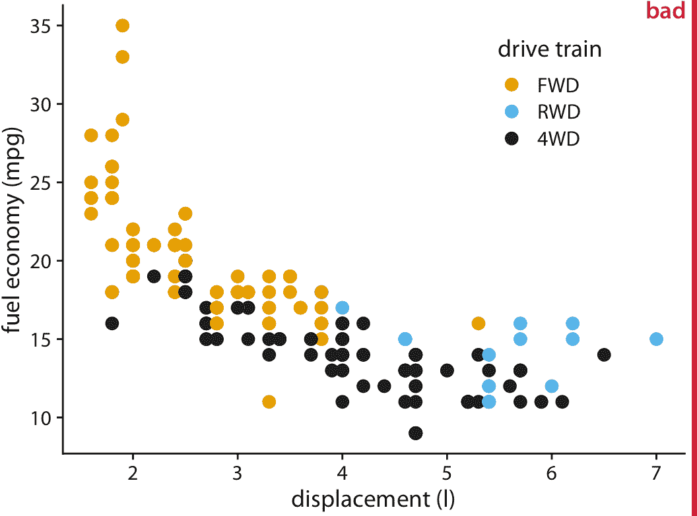

图 18.1：1999 年至 2008 年间发布的流行车型的城市燃油效率与发动机排量。每个点代表一辆汽车。点的颜色编码传动系统：前轮驱动（FWD），后轮驱动（RWD）或四轮驱动（4WD）。该图标记为“不好”，因为许多点都是在其他点上绘制的并且模糊了它们。

改善此问题的一种方法是使用部分透明度。如果我们使各个点部分透明，则过度绘制的点显示为较暗的点，因此点的阴影反映了图形位置处点的密度（图 18.2 ）。

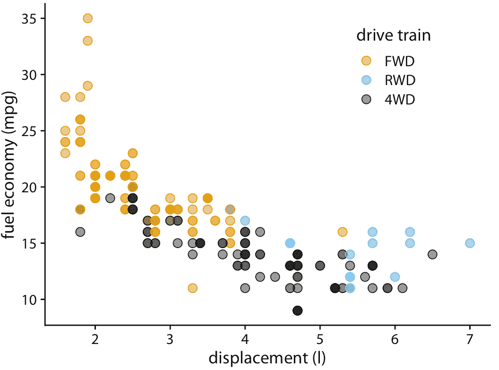

图 18.2：城市燃油效率与发动机排量。因为点已经部分透明，所以位于其他点之上的点现在可以通过其较暗的阴影来识别。

然而，使点部分透明并不总是足以解决过度绘图的问题。例如，尽管我们可以在图 18.2 中看到某些点的阴影比其他点更暗，但很难估计每个位置在彼此的顶部绘制了多少个点。此外，虽然阴影的差异清晰可见，但它们并不是不言自明的。第一次看到这个图形的读者可能会想知道为什么有些点比其他点更暗，并且不会意识到这些点实际上是多个点叠在一起。在这种情况下有用的一个简单技巧是对点施加少量抖动，即在 *x* 或 *y* 或两者的方向上，随机移动少量点。对于抖动，很明显，较暗的区域来自彼此重叠的点（图 18.3 ）。此外，现在，代表具有 2.0 升发动机的四轮驱动汽车的黑点第一次清晰可见。

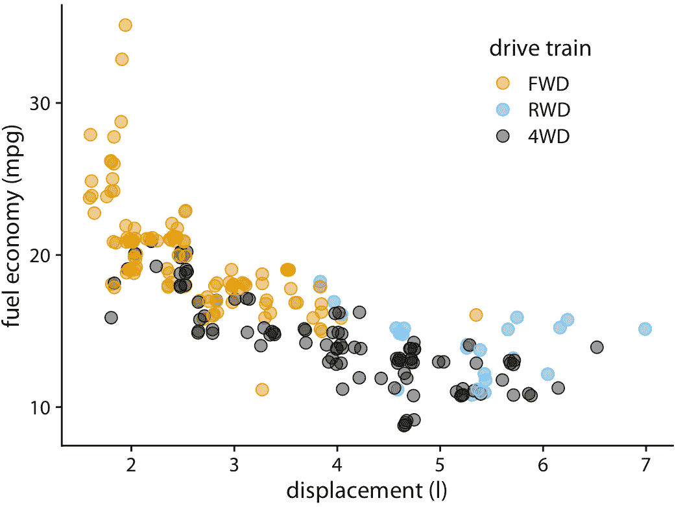

图 18.3：城市燃油效率与发动机排量的关系。通过向每个点添加少量抖动，我们可以使得过度绘制的点更清晰可见，而不会显着扭曲绘图的消息。

抖动的一个缺点是它确实会改变数据，因此必须小心执行。如果我们抖动太多，我们最终会在不代表底层数据集的位置放置点。结果是误导性的数据可视化。参见图 18.4 作为示例。

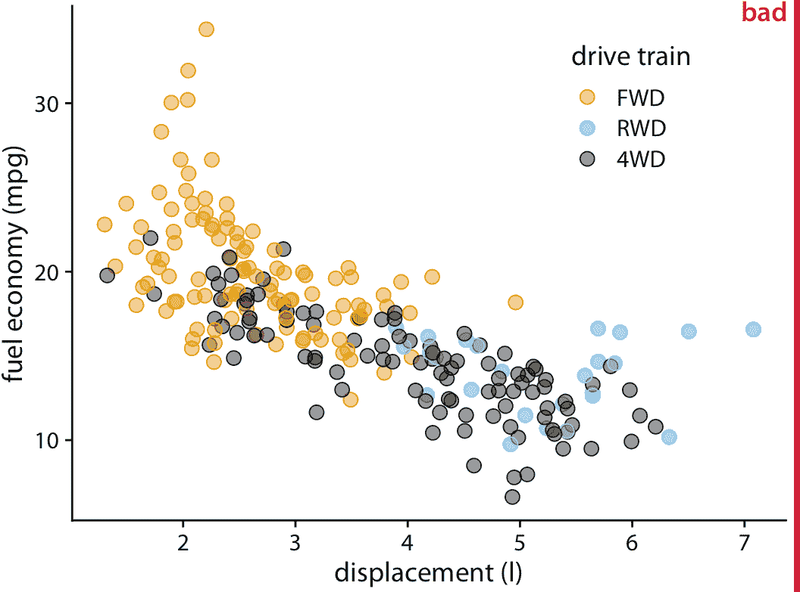

图 18.4：城市燃油效率与发动机排量。通过向点添加过多抖动，我们创建了一个无法准确反映底层数据集的可视化。

## 18.2 2D 直方图

当单个点的数量变得非常大时，部分透明度（有或没有抖动）将不足以解决过度绘图问题。通常会发生的是，点密度高的区域将显示为深色的均匀斑点，而在点密度低的区域中，各个点几乎不可见（图 18.5 ）。而改变个别点的透明度水平将改善这些问题中的一个，同时使另一个问题恶化；没有透明度设置可以同时解决这两个问题。

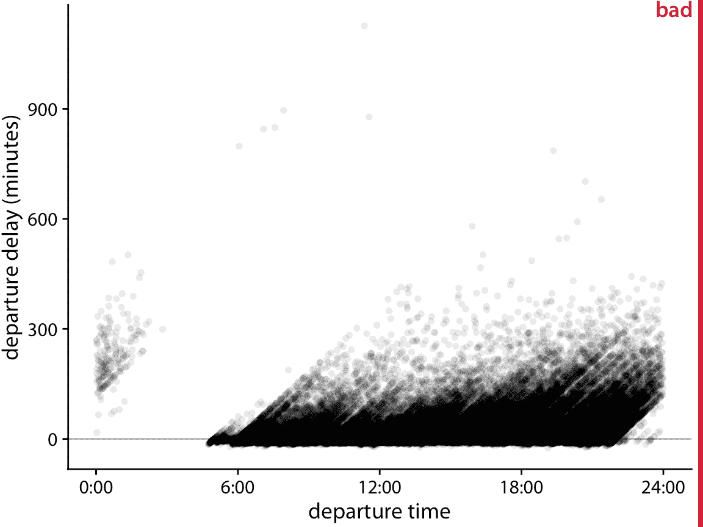

图 18.5：2013 年从纽瓦克机场（EWR）起飞的所有航班的起飞延误（分钟）与航班起飞时间的关系。每个点代表一次起飞。

图 18.5 显示超过 100,000 个单独航班的起飞延误，每个点代表一次航班起飞。尽管我们已经使各个点相当透明，但是它们中的大多数只是在 0 到 300 分钟的起飞延误之间形成黑带。这个带子模糊了大多数航班是否准时起飞或大幅延误（比如 50 分钟或更长时间）。同时，由于点的透明度，最延误的航班（延误 400 分钟或更长时间）几乎看不到。

在这种情况下，我们可以制作 2D 直方图，而不是绘制单个点。 2D 直方图在概念上类似于第七章中讨论的一维直方图，但现在我们将数据在二维中分桶。我们将整个 *x* - *y* 平面细分为小矩形，计算落入每个桶的观测值数量，然后按该计数来着色矩形。图 18.6 使用这种方法，显示了起飞延误数据的结果。该可视化清晰地突出了航班起飞数据的几个重要特征。首先，白天（早上 6 点到晚上 9 点）的绝大多数航班，实际上是在没有延误甚至提前（负延误）的​​情况下起飞的。然而，一定数量的航班有很大的延误。此外，一架飞机在当天的起飞得越晚，它的延误就越大。重要的是，起飞时间是实际的起飞时间，而不是预定的起飞时间。所以这个图形并不一定告诉我们计划提前起飞的飞机从未经历过延误。然而，它告诉我们的是，如果飞机提前起飞，它要么没有延误，要么在极少数情况下延误大约 900 分钟。

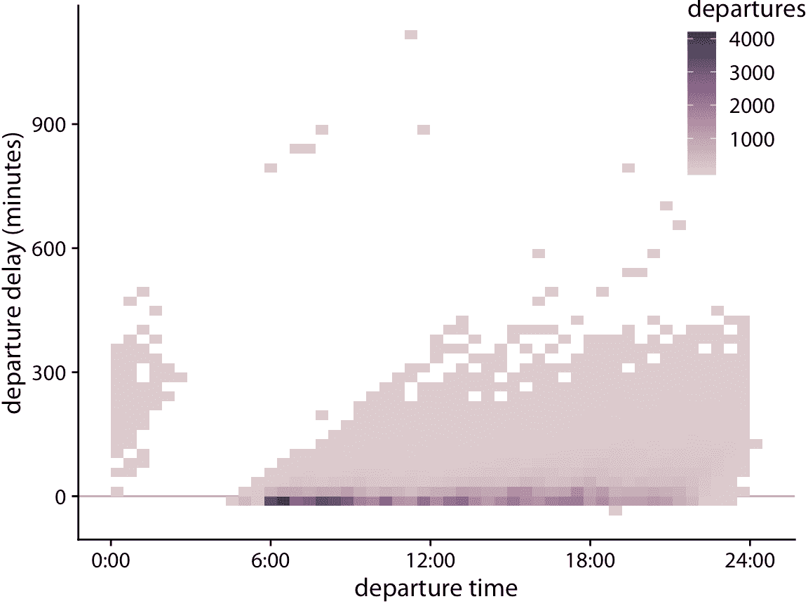

图 18.6：以分钟为单位的起飞延误与航班起飞时间的关系。每个彩色矩形代表当时起飞的起飞延误为指定值的所有航班。着色表示该矩形的航班数。

作为将数据合并为矩形的替代方法，我们也可以将其分成六边形。这种方法首先由 Carr 等人（1987）提出，具有以下优点：比等面积方形中的点，六边形中的点平均更接近其中心。因此，彩色六边形比彩色矩形更准确地表示数据。图 18.7 显示六边形分桶而非矩形分桶的航班起飞数据。

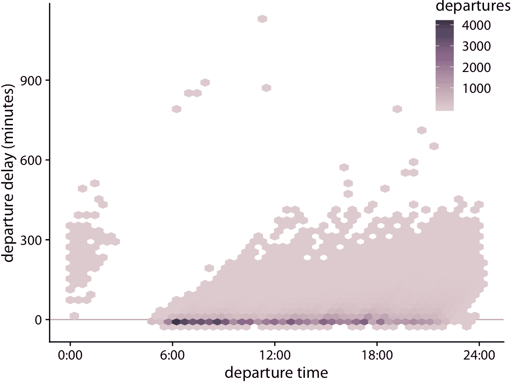

图 18.7：以分钟为单位的起飞延误与航班起飞时间的关系。每个彩色六边形代表当时起飞的起飞延误为指定值的所有航班。着色表示该六边形的航班数。

## 18.3 等值线

我们还可以估计绘图区域内的点密度，并用等值线指示不同点密度的区域，而不是将数据点分组为矩形或六边形。当点密度在 *x* 和 *y* 维度上缓慢变化时，该技术很有效。

作为这种方法的一个例子，我们返回第 12 章节的蓝鸟数据集。图 12.1 显示了 123 只蓝鸟的头长和体重之间的关系，并且这些点之间存在一些重叠。我们可以通过使点更小和部分透明，来更清楚地突出点的分布，并将它们绘制在等值线之上（图 18.8 ），它描绘点密度相似的区域。我们可以通过对由等值线包围的区域进行着色，来进一步增强对点密度变化的感知，对于表示较高点密度的区域使用较暗的颜色（图 18.9 ）。

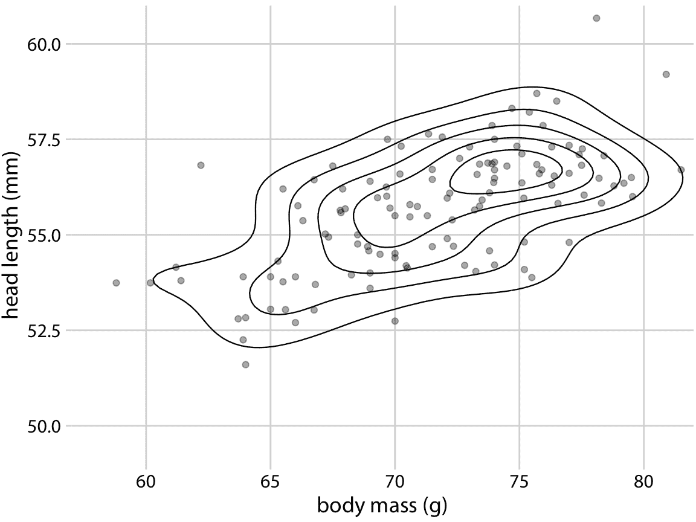

图 18.8：123 个蓝鸟的头长与体重的关系，如图 12.1 所示。每个点对应一只鸟，线条表示点密度相似的区域。点密度朝着图的中心增加，体重接近 75g，头长在 55mm 和 57.5mm 之间。数据来源：欧柏林学院的 Keith Tarvin

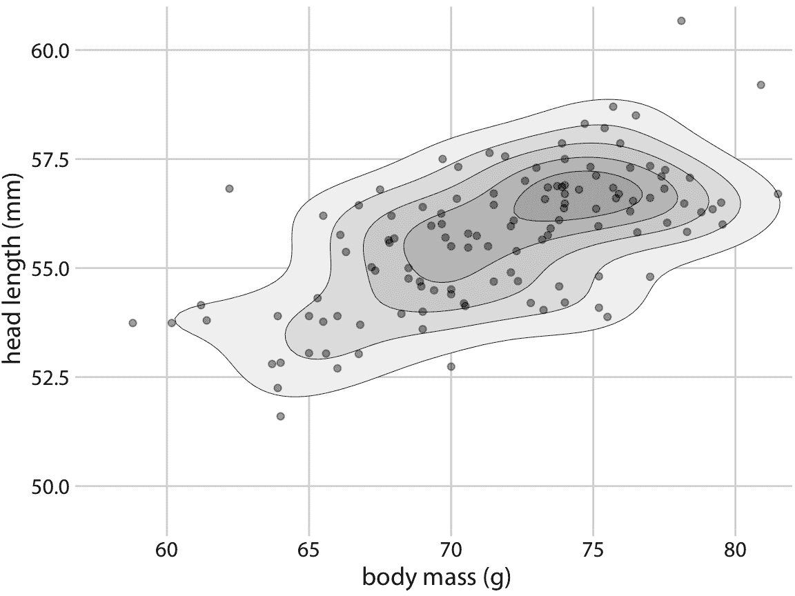

图 18.9：123 个蓝鸟的头长与体重的关系。这个图与图 12.1 几乎相同，但现在等值线包围的区域用越来越深的灰色阴影着色。这种阴影产生了更强的视觉印象，即点密度朝着点云的中心增加。数据来源：欧柏林学院的 Keith Tarvin

在第 12 章中，我们还分别研究了雄鸟和雌鸟的头长和体重之间的关系（图 12.2 ）。我们可以通过为雄鸟和雌鸟分别绘制彩色等值线来绘制等值线图（图 18.10 ）。

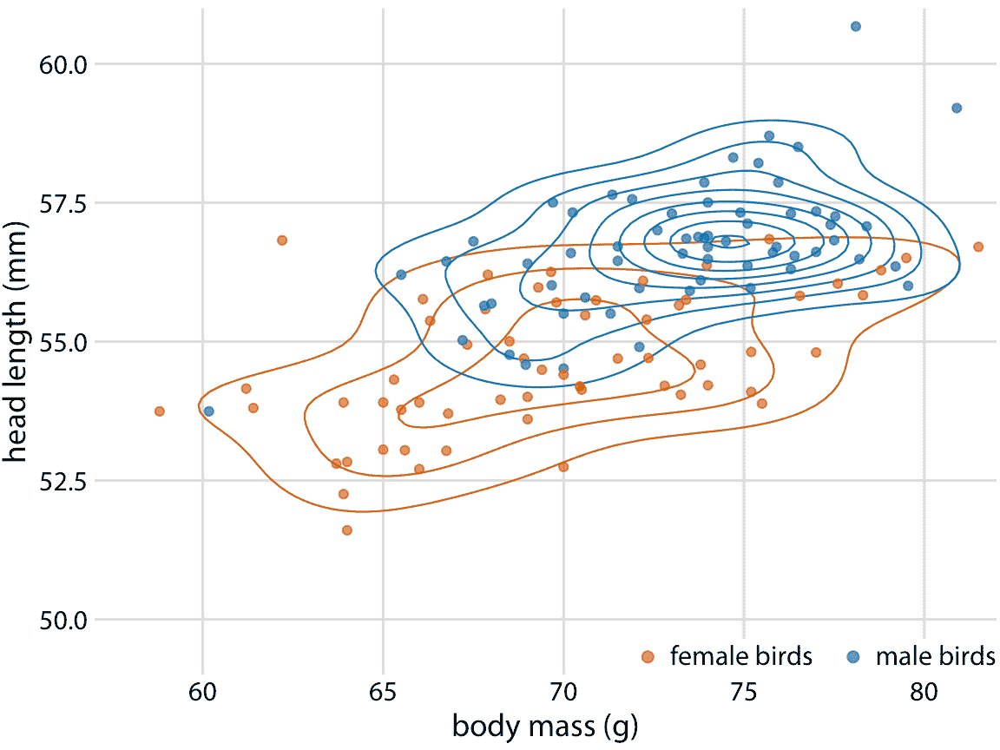

图 18.10：123 个蓝鸟的头长与体重的关系。如图 12.2 ，我们还可以在绘制等值线时通过颜色指示鸟类的性别。该图突出显示了雄鸟和雌鸟的点的分布是如何不同的。特别是，雄鸟在绘图区域的一个区域中更密集，而雌鸟则更加分散。数据来源：欧柏林学院的 Keith Tarvin

绘制不同颜色的多组等值线，可能是一次显示多个点云分布的强大策略。但是，这种技术需要谨慎使用。它仅在具有不同颜色的组的数量较小（两到三个），并且组明确分离时才有效。否则，我们最终会得到一条毛球，它的不同颜色的线彼此交叉，并且根本不显示任何特定的图案。

为了说明这个潜在的问题，我将使用钻石数据集，其中包含 53,940 颗钻石的信息，包括它们的价格，重量（克拉）和切割。图 18.11 将此数据集显示为散点图。我们看到了过度绘图的明显问题。有许多不同颜色的点在彼此之上，除了钻石落在价格克拉谱上的整体形状之外，不可能辨别出任何东西。

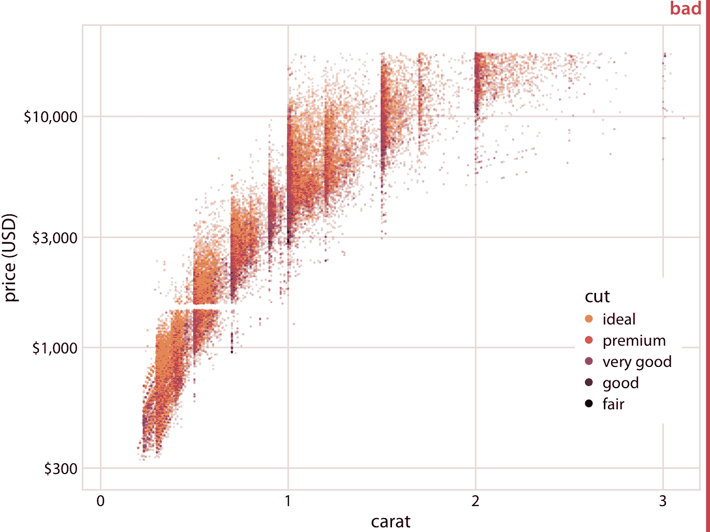

图 18.11：53,940 枚单颗钻石的钻石价格与其克拉值的关系。每颗钻石的切割都用颜色表示。该图被标记为“不好”，因为大量的过度绘图使我们无法辨别不同钻石切割的任何规律。数据来源：Hadley Wickham，ggplot2

我们可以尝试为不同的切割质量绘制彩色等值线，如图 18.10 。但是，在钻石数据集中，我们有五种不同的颜色，这些组严重重叠。因此，等值线图（图 18.12 ）并没有比原始散点图好很多（图 18.11 ）。

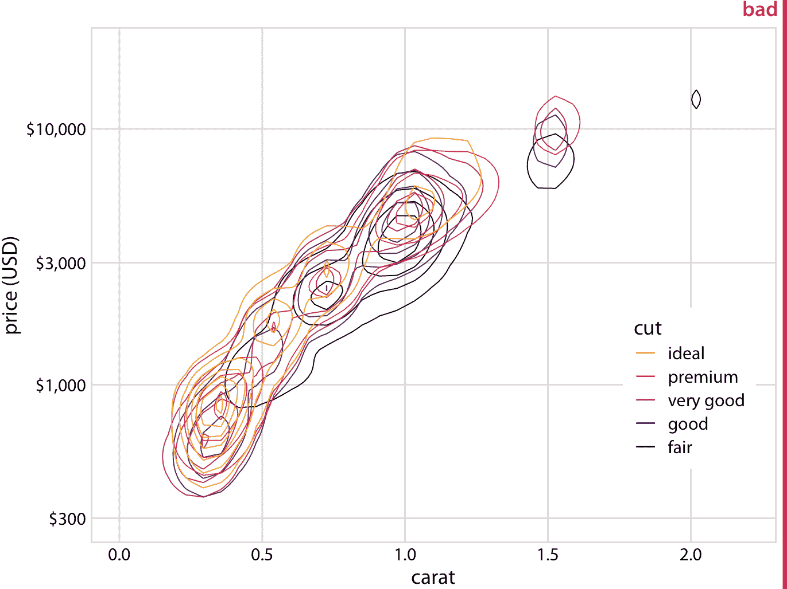

图 18.12：钻石价格与克拉值的关系。如图 18.11 ，但现在个别点已被等值线所取代。得到的图仍然标记为“不好”，因为等值线全部位于彼此之上。无论是单个切割的点的分布还是整体的点的分布都不能被辨别出来。数据来源：Hadley Wickham，ggplot2

在独立的绘图面板中绘制每个切割质量的等值线，会有所帮助（图 18.13 ）。在一个面板中绘制它们的目的，可能是为了实现组之间的视觉比较，但是图 18.12 非常嘈杂，无法进行比较。相反，在图 18.13 中，背景网格使我们能够通过关注等值线相对于网格线的确切位置，来对切割质量进行比较。 （通过在每个面板中绘制部分透明的单个点而不是等值线，可以实现类似的效果。）

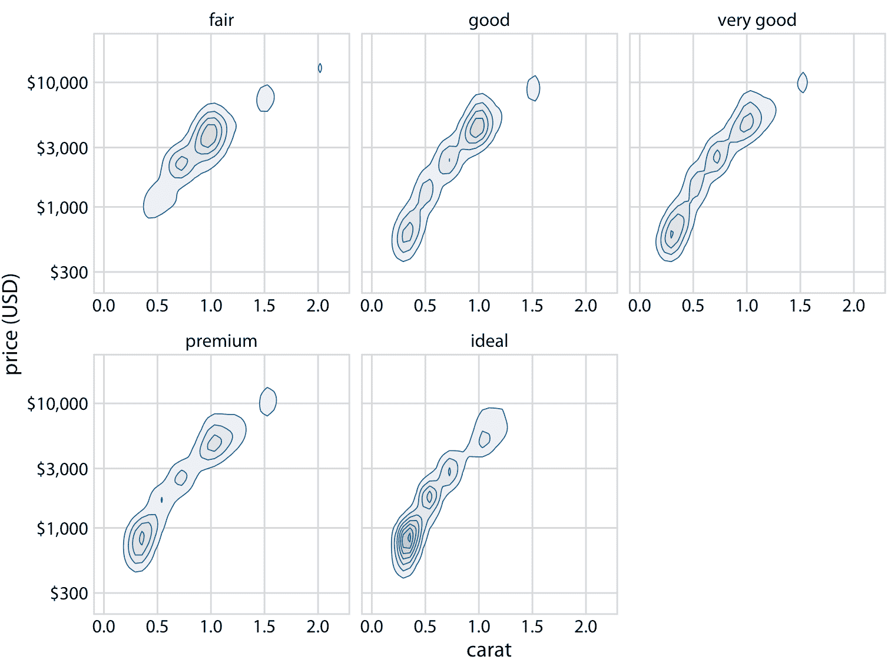

图 18.13：钻石价格与克拉值的关系。在这里，我们从图 18.12 中获取了密度等值线，并为每个切割分别绘制它们。我们现在可以看到，更好的切割（非常好，优质，理想）往往比较差的切割（一般，良好）具有更低的克拉值，但是每克拉的价格更高。数据来源：Hadley Wickham，ggplot2

我们可以提出两个主要趋势。首先，更好的切割（非常好，优质，理想）往往比较差的切割（一般，良好）具有更低的克拉值。回想一下克拉是衡量钻石重量的指标（1 克拉 = 0.2 克）。更好的切割往往会产生较轻的钻石（平均而言），因为需要去除更多的材料来创造它们。其次，在相同的克拉值下，更好的切割倾向于更高的价格。要查看此模式，请查看 0.5 克拉的价格分布示例。对于更好的切割，分布向上移动，特别是对于具有理想切割的钻石而言，其分布比具有一般或良好切割的钻石高得多。

### 参考

```
Carr, D. B., R. J. Littlefield, W. L. Nicholson, and J. S. Littlefield. 1987. “Scatterplot Matrix Techniques for Large N.” J. Am. Stat. Assoc. 82: 424–36.
```