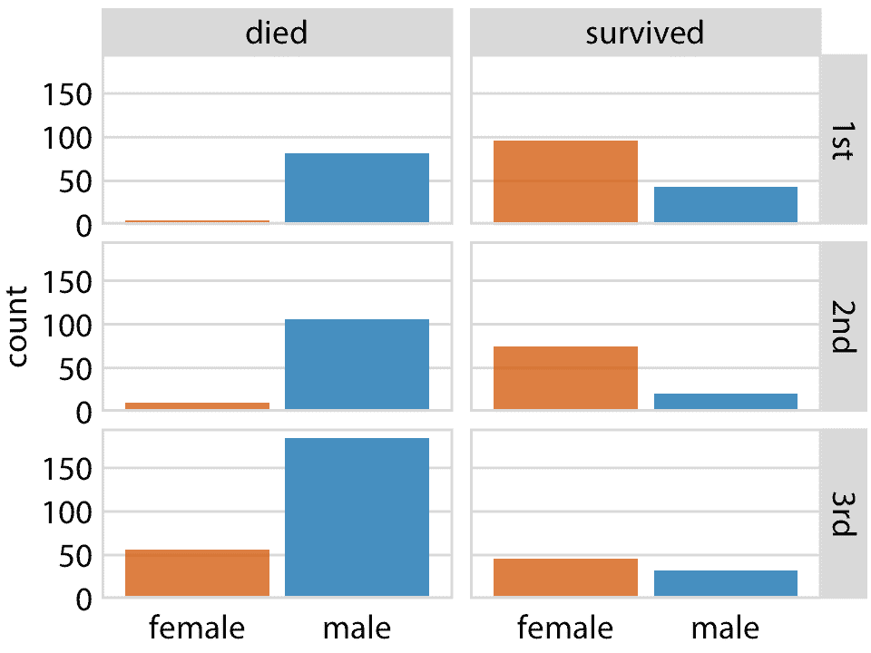
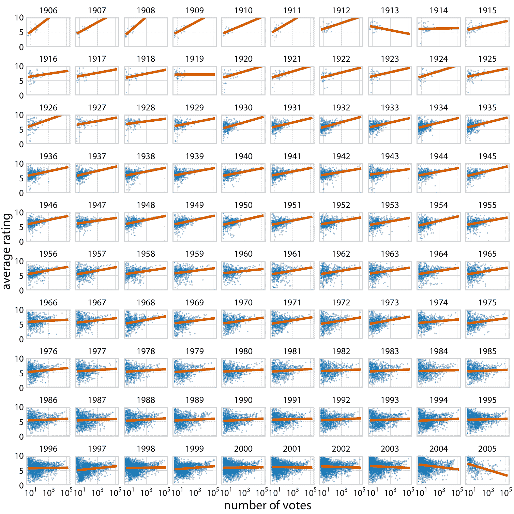
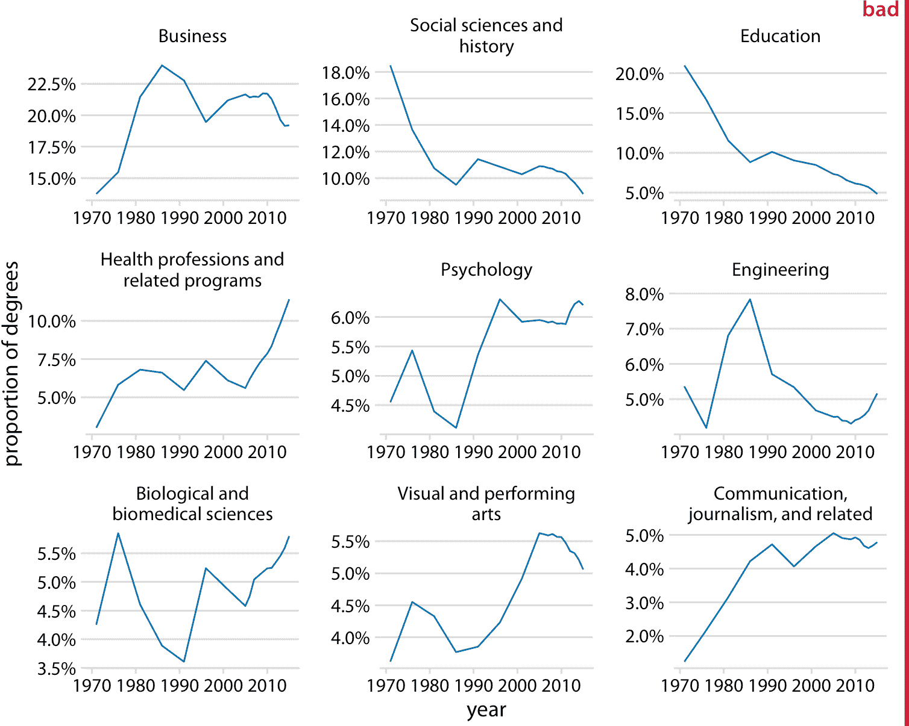
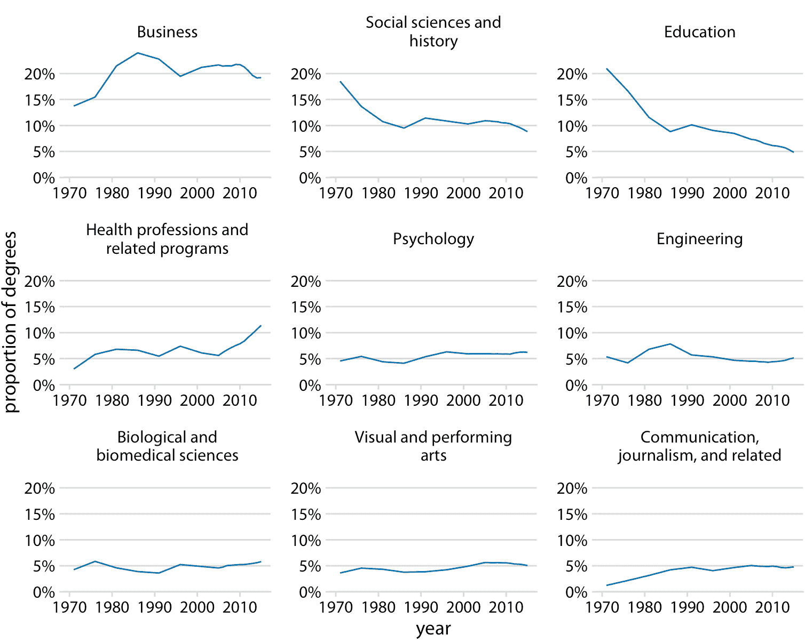
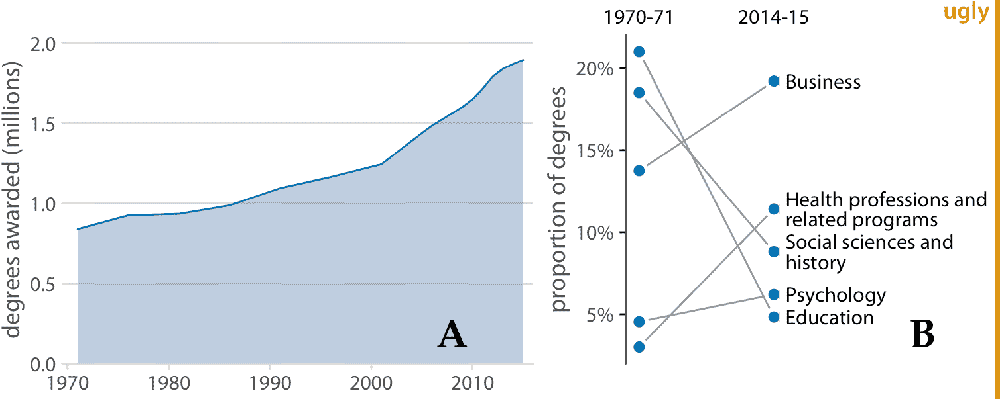
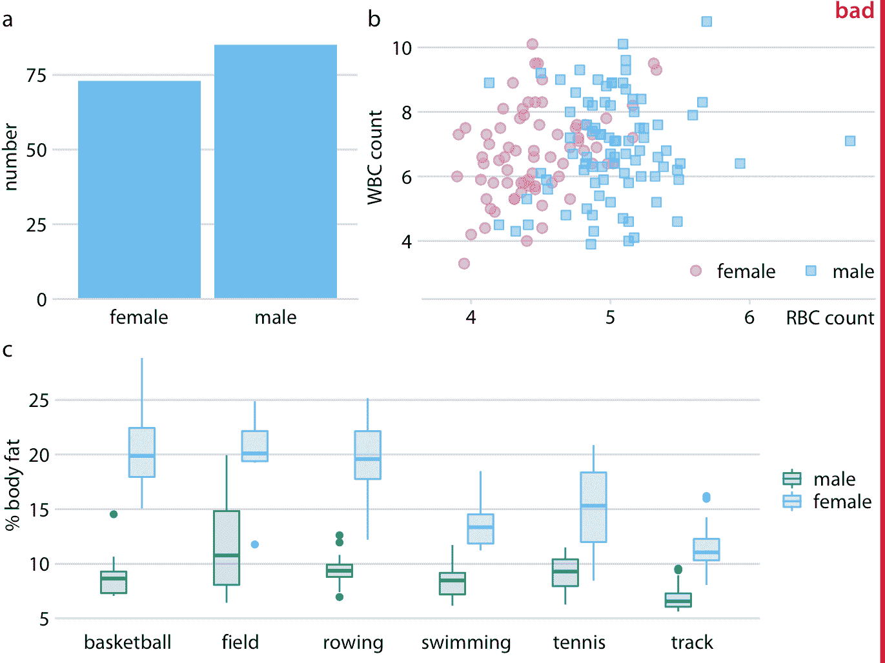
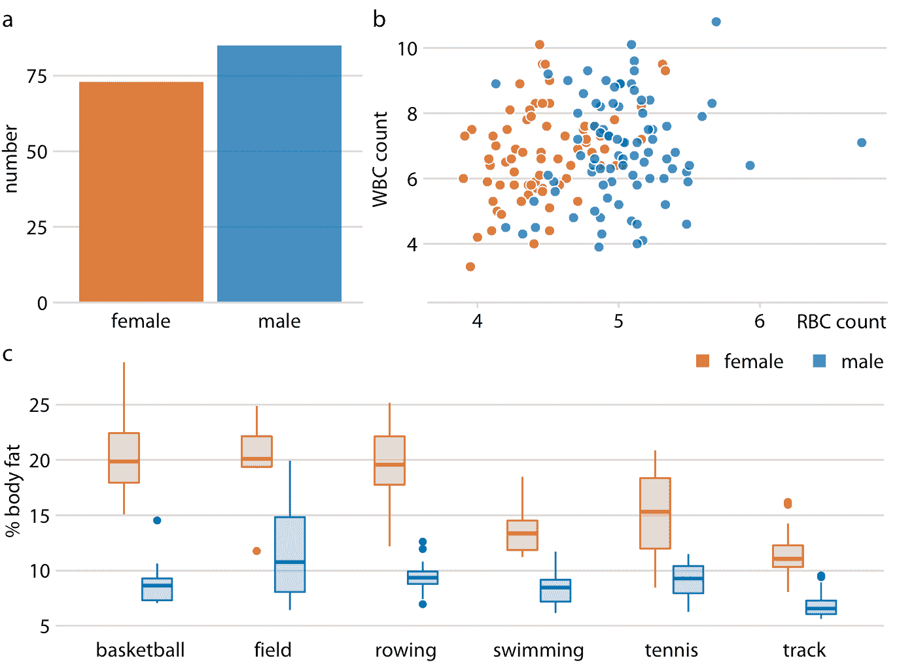
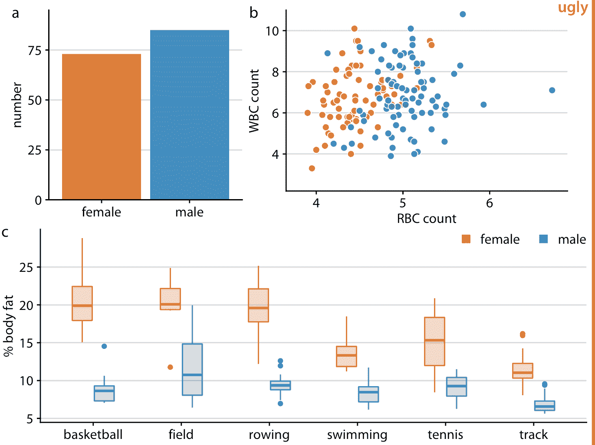

# 21 多面板图形

> 原文： [21 Multi-panel figures](https://serialmentor.com/dataviz/multi-panel-figures.html)

> 校验：[飞龙](https://github.com/wizardforcel)

> 自豪地采用[谷歌翻译](https://translate.google.cn/)

当数据集变得庞大且复杂时，它们通常包含的信息，比单个图形面板中合理显示的信息要多得多。要可视化此类数据集，创建多面板图形会很有帮助。这些是由多个图形面板组成的图形，其中每个图形面板显示数据的一些子集。这些图形有两种截然不同的类别：1）小型多图是由多个面板组成的图，它们以规则网格排列。每个面板显示数据的不同子集，但所有面板使用相同类型的可视化。 2）复合图包括以任意排列（可能是或可能不是基于网格）组成的单独的图形面板，并且显示完全不同的可视化，甚至可能不同的数据集。

在本书的许多地方，我们遇到过两种类型的多面板图形。通常，这些图形直观且易于理解。但是，在制作这些图形时，我们需要注意一些问题，例如适当的轴缩放，对齐以及单个面板之间的一致性。

## 21.1 小型多图（Small Multiple）

术语“小型多图”由 Tufte（1990）推广。贝尔实验室的 Cleveland，Becker 及其同事（WS Cleveland 1993；Becker，Cleveland 和 Shyu 1996）同时推广了另一个术语“格子图”。无论术语如何，关键思想是根据一个或多个数据维度将数据切片为部分，分别可视化每个数据切片，然后将各个可视化排列成网格。网格中的列，行或单个面板由定义数据切片的数据维度的值标记。最近，这种技术有时也称为“切面”，以在广泛使用的 ggplot2 绘图库中创建此类绘图的方法命名（例如，`facet_grid()`，参见 Wickham（2016））。

作为第一个例子，我们将这种技术应用于泰坦尼克号乘客的数据集。我们可以根据每位乘客所乘坐的舱位，以及乘客是否幸存来细分该数据集。在这六个数据片段中的每一个中，都有男性和女性乘客，我们可以使用条形图来显示他们的数字。结果是六个条形图，我们排列成两列（一个用于死亡乘客，一个用于幸存者）三行（每个舱位一个）（图 21.1 ）。标记列和行，因此可以立即清楚六个图中的哪一个对应于生存状态和类别的哪个组合。



图 21.1：按性别，生存状态和他们乘坐的舱位（第 1，第 2 或第 3）划分的泰坦尼克号乘客。

这种可视化为泰坦尼克号乘客的命运提供了直观且高度可解释的可视化。我们清楚地看到，大多数男性死亡，大多数女性幸存。此外，几乎所有死亡的女性都乘坐三等舱。

小型多图是一次可视化大量数据的强大工具。图 21.1 使用六个独立的面板，但我们可以使用更多。图 21.2 显示了互联网电影数据库（IMDB）上电影的平均评级与电影收到的投票数之间的关系，分别针对 100 年时间内发布的电影。在这里，数据集仅按一个维度，年份进行切片，每年的面板从左上角到右下角按行排列。该可视化显示平均评级和投票数之间存在总体关系，具有更多投票的电影倾向于具有更高的评级。然而，这种趋势的强度随着年份而变化，对于 21 世纪初期发行的电影来说，没有任何关系，甚至是负面关系。



图 21.2：从 1906 年到 2005 年的电影的平均评级与投票数。点表示单个电影，线表示每部电影的平均评级与电影收到的投票数的对数的线性回归。在大多数年份中，具有较高票数的电影平均具有较高的平均评级。然而，这种趋势在 20 世纪末已经趋于衰弱，并且在 21 世纪初发布的电影中可以看到负面关系。数据来源：互联网电影数据库（IMDB，[imdb.com](http://imdb.com/)）

为了使这些大图易于理解，重要的是每个面板使用相同的轴范围和刻度。人类心理预计会出现这种情况。如果不是，那么读者很可能会错误地解释图中显示的内容。例如，考虑图 21.3，介绍了不同学位领域的学士学位比例随时间的变化情况。该图显示了 1971 年至 2015 年间的九个学位领域，平均占所有学位的 4% 以上。面板的 *y* 轴被缩放，使得每个学位领域的曲线覆盖整个 *y* 轴范围。因此，对图 21.3 的粗略检查表明，九个学位领域都同样受欢迎，并且在受欢迎程度上都经历了相似幅度的变化。



图 21.3：美国高等教育机构授予的学士学位趋势。显示的是所有学位领域，平均占所有学位的 4% 以上。该图标记为“不好”，因为所有面板使用不同的 *y* 轴范围。这种选择模糊了不同学位领域的相对大小，并且过度夸大了某些学位领域的变化。数据来源：国家教育统计中心

然而，将所有面板放置在相同的 *y* 轴上，显示出这种解释具有高度误导性（图 21.4 ）。某些学位领域比其他领域更受欢迎，同样一些领域比其他领域增长或缩小更多。例如，教育学已经下降很多，而视觉和表演艺术几乎保持不变或者可能略有增加。



图 21.4：美国高等教育机构授予的学士学位趋势。显示的是所有学位领域，平均占所有学位的 4% 以上。数据来源：国家教育统计中心

我通常建议不要在小型多图的单个面板中使用不同的轴刻度。但是，有时，这个问题确实是无法避免的。如果遇到这种情况，那么我认为至少你需要在图标题中让读者注意这个问题。例如，您可以添加一个句子，例如：“请注意， *y* 轴的刻度在此图的不同面板之间有所不同”。

在小型多图中考虑单个面板的顺序也很重要。如果顺序遵循一些逻辑原则，则该图将更容易解释。在图 21.1 中，我从最舱位（一等）到最舱位（三行）排列了行。在图 21.2 中，我通过从左上角到右下角按照递增年份来排列面板。在图 21.4 中，我通过递减的学位平均受欢迎程度来排列面板，使得最受欢迎的学位位于最上面一行和/或左边，最不受欢迎的学位位于最下面一行和/或在右边。

始终按照有意义的逻辑顺序将面板排列在一个小型多图中。

## 21.2 复合图

并非每个具有多个面板的图形都符合小型多图的模式。有时我们只是想将几个独立的面板组合成一个复合图，传达一个总体点。在这种情况下，我们可以采用不同的绘图并按行，列或其他更复杂的方式排列它们，并将整个排列看作一个图形。例如，见图 21.5 ，它继续分析美国高等教育机构授予的学士学位的趋势。图 21.5 的面板（a）显示了从 1971 年到 2015 年授予的学位总数的增长，在此期间，授予的学位数大约翻了一番。 面板（b）显示了同一时期五个最受欢迎学位领域的所授予学位的百分比变化。我们可以看到社会科学，历史和教育从 1971 年到 2015 年经历了大幅下降，而商业和健康专业则出现了大幅增长。

请注意，在我的小型多图示例中，复合图形的各个面板按字母顺序标记。通常使用拉丁字母表中的大写或小写字母。需要标签来唯一地指定特定面板。例如，当我想谈谈图 21.5 的一部分，它显示所授予学位的百分比变化时，我可以引用该图的图（b）或简单地引用图 21.5b。如果没有标签，我将不得不笨拙地谈论图 21.5 的“右侧面板”或“左侧面板”，并且对于更复杂的面板布局而言，提及特定面板会更加笨拙。小型多图不需要标记，或者通常不会对小型多图进行标记，因为每个面板都由切面变量唯一指定，它作为图形标签而提供。


图 21.5：美国高等教育机构授予的学士学位的趋势。（a）从 1970 年到 2015 年，学位总数几乎翻了一番。 （b）在最受欢迎的学位领域中，社会科学，历史和教育经历了大幅下降，而商业和健康专业则有所增长。数据来源：国家教育统计中心

标记复合图形的不同面板时，请注意标签如何适合整体图形设计。我经常看到这样的图形，标签看起来就像是由另一个人放在上面。并不罕见的是，标签制作得过于庞大和突出，放置在一个尴尬的位置，或者以与图中其他部分不同的字体排版。 （参见图 21.6 的例子。）当你看一个复合图时，标签不应该是你看到的第一件事。事实上，他们根本不需要脱颖而出。我们通常知道哪个图形面板具有哪个标签，因为约定是从左上角的“a”开始，标签从左到右，从上到下连续。我认为这些标签等同于页码。您通常不会阅读页码，并且哪个页面具有哪个号码是毫无疑问的，但有时使用页码来引用书籍或文章中的特定位置会很有帮助。



图 21.6：标记为“不好”的图 21.5 的变体。标签太大而且很厚，它们的字体不对，而且它们位于一个尴尬的位置。此外，虽然用大写字母标记很好并且实际上很常见，但标签需要在文档中的所有图形中保持一致。在本书中，惯例是多面板图形使用较小的小写标签，因此这个图形与本书中的其他图形不一致。

我们还需要注意复合图形的各个面板如何组合在一起。可以制作一组图形面板，它们各自都很好，但是不能共同工作。特别是，我们需要采用一致的视觉语言。 “视觉语言”是指我们用来显示数据的颜色，符号，字体等。简而言之，保持语言的一致性意味着相同的事物在数字上看起来相同或至少基本相似。

让我们看一个违反这一原则的例子。图 21.7 是一个三面板图，可视化男性和女性运动员的生理和身体成分的数据集。面板（a）显示数据集中的男性和女性数量，面板（b）显示男性和女性的红细胞和白细胞计数，面板（c）显示男性和女性的体脂百分比，按照运动细分。每个面板都是可接受的图形。但是，三个面板组合起来不起作用，因为它们不共享共同的视觉语言。首先，面板（a）对男性和女性运动员使用相同的蓝色，面板（b）仅用于男性运动员，面板（c）用于女运动员。此外，面板（b）和（c）引入了额外的颜色，但这两个面板之间的颜色不同。最好是为男性和女性运动员使用相同的两种颜色，并将相同的着色方案应用于面板（a）。其次，在图（a）和（b）中，女性在左侧，男性在右侧，但在图（c）中，顺序是相反的。应切换面板（c）中的箱形图顺序，使其与面板（a）和（b）相匹配。



图 21.7：男性和女性运动员的生理和身体组成。（a）数据集包括 73 名女性和 85 名男性职业运动员。（b）与女性运动员相比，男性运动员往往有较高的红细胞计数（以每升 10^12 个为单位），但白细胞计数没有这种差异（WBC，以每升 10^9 为单位）。 （c）男性运动员的体脂百分比，往往低于在同一运动中参赛的女运动员。数据来源：Telford 和 Cunningham（1991）

图 21.8 解决了所有这些问题。在这个图中，女性运动员一直以橙色显示，并且男性运动员在左侧显示为蓝色。请注意，阅读此图比图 21.7 更容易。当我们使用一致的视觉语言时，确定不同面板中哪些视觉元素代表女性和哪些男性，并不需要花费太多精力。另一方面，图 21.7 可能非常令人困惑。特别是，一目了然，它可能会产生一种印象，即男性的体脂百分比往往高于女性。另请注意，我们在图 21.8 中只需要单个图例，但在图 21.7 中需要两个。由于视觉语言是一致的，因此相同的图例适用于面板（b）和（c）。



图 21.8：男性和女性运动员的生理和身体组成。该图显示的数据与图 21.7 完全相同，但现在使用的是一致的视觉语言。女性运动员的数据总是显示在男性运动员的相应数据的左侧，并且性别在图的所有元素中始终采用颜色编码。数据来源：Telford 和 Cunningham（1991）

最后，我们需要注意复合图中各个图形面板的对齐。各个面板的轴和其他图形元素应全部彼此对齐。使对齐正确可能非常棘手，特别是如果单独的面板可能由不同的人和/或在不同的程序中单独制作，然后在图像处理程序中粘贴在一起。为了引起你对这种对齐问题的注意，图 21.9 显示了图 21.8 的变体，现在所有的图形元素都略微不对齐。我已经在图 21.9 的所有面板上添加了轴线，来强调这些对齐问题。请注意，图中任何一个面板的轴线都没有与其他轴线对齐。



图 21.9：图 21.8 的变体，其中所有图形面板略微未对齐。不对齐是丑陋的，应该避免。

### 参考

```
Tufte, E. R. 1990. Envisioning Information. Cheshire, Connecticut: Graphics Press.

Cleveland, W. 1993. “Visualizing Data.” Summit, New Jersey: Hobart Press.

Becker, R. A., W. S. Cleveland, and M.-J. Shyu. 1996. “The Visual Design and Control of Trellis Display.” Journal of Computational and Graphical Statistics 5: 123–55.

Wickham, H. 2016. ggplot2: Elegant Graphics for Data Analysis. 2nd ed. New York: Springer.

Telford, R. D., and R. B. Cunningham. 1991. “Sex, Sport, and Body-Size Dependency of Hematology in Highly Trained Athletes.” Medicine and Science in Sports and Exercise 23: 788–94.
```