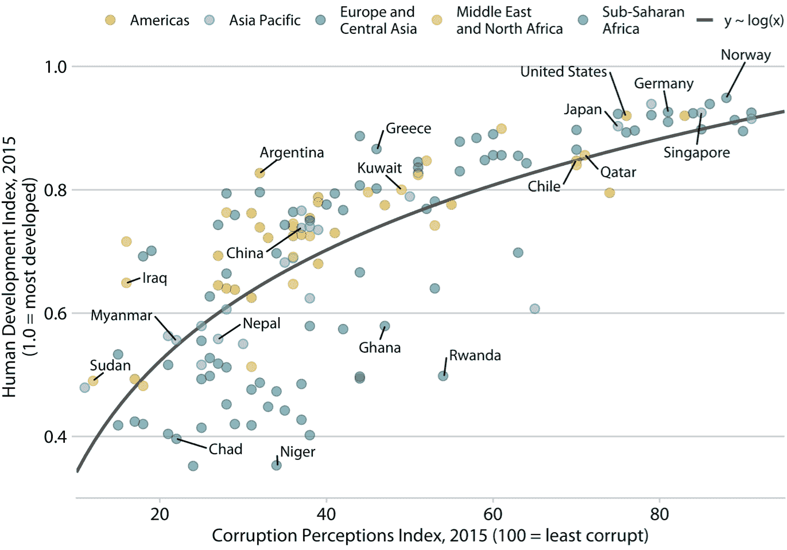
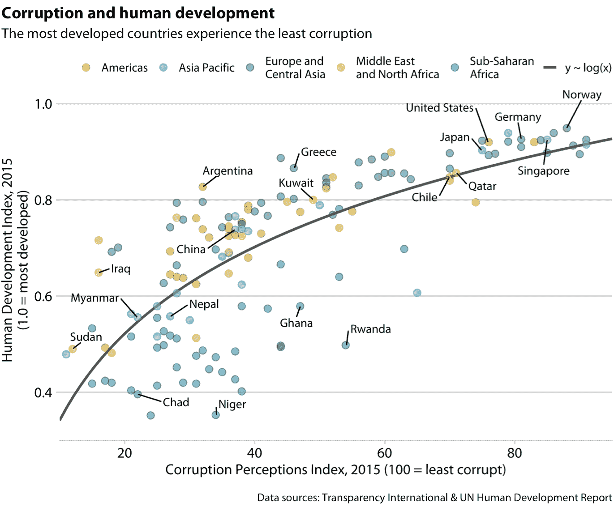
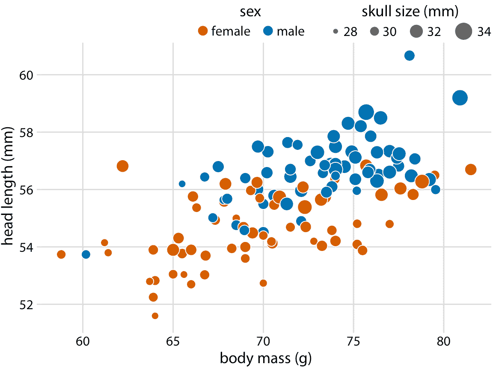
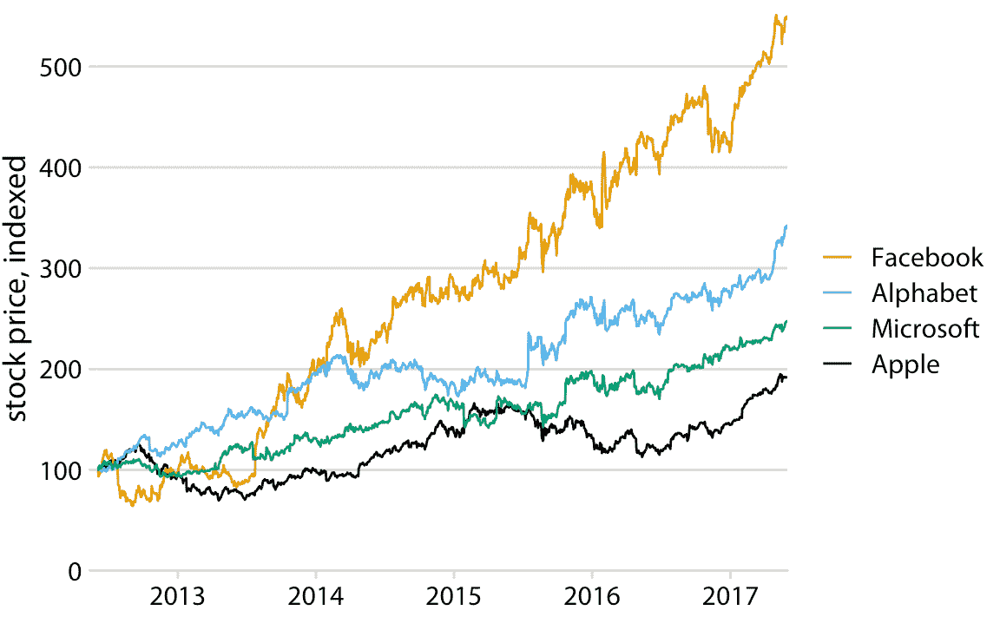
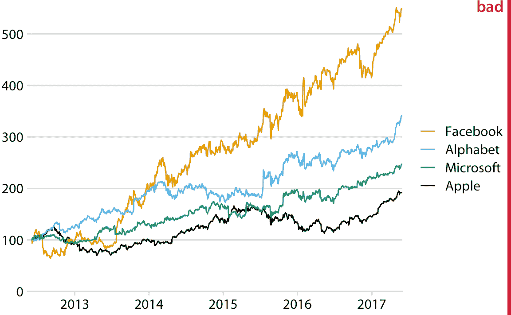
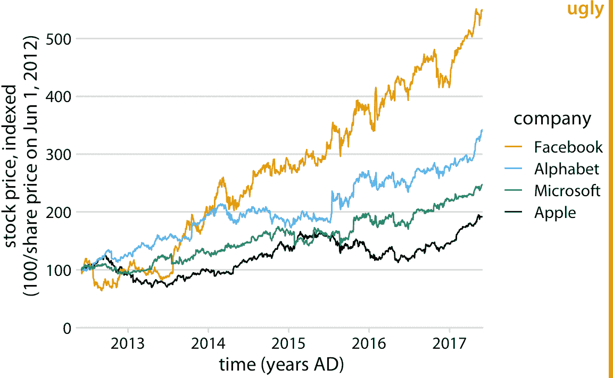
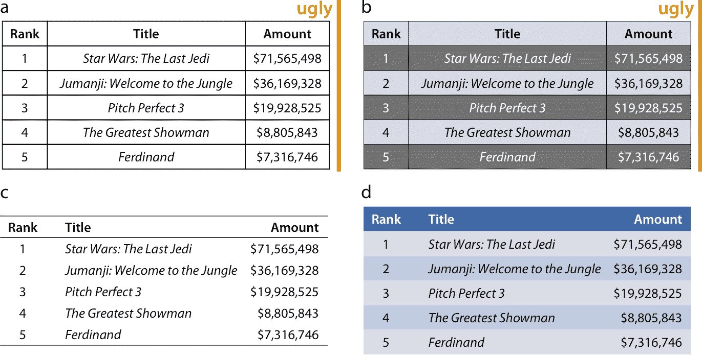

# 22 标题，说明和表格

> 原文： [22 Titles, captions, and tables](https://serialmentor.com/dataviz/figure-titles-captions.html)

> 校验：[飞龙](https://github.com/wizardforcel)

> 自豪地采用[谷歌翻译](https://translate.google.cn/)

数据可视化不是一件仅仅因其美学上令人愉悦的特征而被关注的艺术品。相反，它的目的是传达信息并提出一个观点。为了在制作可视化时可靠地实现此目标，我们必须将数据放入上下文并提供附带的标题，说明和其他注解。在本章中，我将讨论如何正确为图形起标题和标注图形。我还将讨论如何以表格形式呈现数据。

## 22.1 图标题和说明

每个图形的一个关键组成是图标题。每个图形都需要标题。标题的工作是准确地向读者传达这个图形是关于什么，它提出了什么观点。但是，图标题可能不一定出现在您期望看到它的位置。考虑图 22.1 。它的标题是“Corruption and human development: The most developed countries experience the least corruption”（腐败和人类发展：最发达的国家经历了最少的腐败）。然而，这个标题并未在图上方显示。相反，标题作为说明栏的第一部分提供，位于图形显示下方。这是我在本书中使用的风格。我一直展示没有集成标题和单独说明的图形。（一个例外是五章节中的程序化绘图示例，它们有标题而没有说明。）



图 22.1：腐败和人类发展：最发达国家经历了最少的腐败。这个图形的灵感来自经济学人在线（2011）。数据来源：Transparency International，和联合国人类发展报告

或者，我可以将图标题以及说明的其他元素（例如数据源声明）合并到主显示中（图 22.2 ）。在直接比较中，您可能会发现图 22.2 比图 22.1 更具吸引力，您可能想知道为什么我在本书中选择后者的风格。我这样做是因为这两种风格具有不同的应用领域，具有集成标题的图形不适合传统的书籍布局。基本原则是一个图形只能有一个标题。标题被集成到实际的图形显示中，或者作为图形下方的说明的第一个元素提供。并且，如果出版物的布局是，每个图形在显示项目下面都有一个常规说明栏，则标题必须在该文本块中提供。出于这个原因，在传统书籍或文章出版的背景下，我们通常不会将标题整合到图形中。但是，如果它们旨在用作独立信息图形，或者在社交媒体或网页上发布而不附带说明文本，具有集成标题，副标题和数据源声明的图形是合适的。



图 22.2：图 22.1 的信息图版本。标题，副标题和数据源声明已合并到图中。这个图形可以原样张贴在网上，也可以在没有单独的说明栏的情况下使用。

如果您的文档布局在每个图形下方使用说明栏，则将图标题作为每个说明栏的第一个元素放置，而不是在图形的顶部。

我在图标题中看到的最常见的错误之一，是遗漏了一个正确的图像标题，作为说明的第一个元素。回顾图 22.1 的标题。它以“腐败和人类发展”开头。并没有以“这个图显示了腐败与人类发展的关系”开头。标题的第一部分始终是标题，而不是该图内容的描述。标题不一定是完整的句子，尽管做出明确断言的短句可以作为标题。例如，对于图 22.1 ，诸如“最发达国家是最不腐败的”这样的标题就可以正常工作。

## 22.2 轴和图例头衔

就像每个绘图都需要一个标题，轴和图例也需要标题。 （轴标题通常通俗地称为轴标签。）轴标签和图例标题说明了显示的数据值，以及它们如何映射到绘图美学。

为了展示所有轴和图例都经过适当标注和配有标题的图形示例，我在第  12 章中详细讨论了蓝色杰伊鸟数据集，并将其显示为气泡图（图 22.3 ）。在该图中，轴标题清楚地表明 *x* 轴显示以克为单位的体重，*y* 轴显示以毫米为单位的头部长度。同样，图例标题显示，点的着色表示鸟类的性别，点的大小表示鸟类的头骨大小，以毫米为单位。我强调，对于所有数值变量（体重，头长和头骨大小），相关标题不仅说明所显示的变量，还说明变量的测量单位。这是一种很好的做法，应该尽可能地实现。类别变量（例如性别）不需要单位。



图 22.3：123 只蓝鸟的头长与体重的关系。鸟的性别用颜色表示，鸟的头骨大小用符号大小表示。头部长度测量值包括喙部的长度，而头骨大小测量值则不包括。数据来源：欧柏林学院的 Keith Tarvin

但是，有些情况下，可以省略轴或图例标题，即标签完全自解释时。例如，显示标记为“雌性”和“雄性”的两个不同颜色的点的图例，清楚地表明颜色编码性别。标题“性别”不需要澄清这一事实，事实上在本书中，我经常省略表示性别的图例的图例标题（参见例如图 6.10 ， 12.2 ，或 21.1）。同样，国家或地区名称通常不需要标题来表明它们是什么（图 6.11 ），电影标题（图 6.1 ）或年份（图 22.4 ）也不需要。



图 22.4：四家主要科技公司的随时间变化的股票价格。 2012 年 6 月，每家公司的股票价格已经标准化为 100。这个图形是第 20 章 20.6 的略微修改版本。这里，表示时间的 *x* 轴没有标题。从上下文可以清楚地看出，2013 年，2014 年等数字是指年份。

但是，在省略轴或图例标题时我们必须要小心，因为很容易误判上下文中的内容和不明显的内容。我经常看到大众媒体中的图形，以一种让我感到不舒服的程度省略轴标题。例如，一些出版物可能会产生一个图形，例如图 22.5 ，假设轴的含义在图形标题和副标题中清晰可见（这里：“四个主要科技公司的随时间变化的股票价格”和“2012 年 6 月，每家公司的股票价格已经标准化为 100”）。我不同意上下文明确定义轴的观点。因为标题通常不包括诸如“*x* / *y* 轴显示”之类的单词，所以总是需要一定量的猜测来解释该图。根据我自己的经验，轴没有正确标记的图形往往会让我感到不安 - 即使我 95% 确定我明白所展示的内容，我也不会 100% 肯定。作为一般原则，我认为让读者猜出你的意思是一种不好的做法。你为什么要对读者产生一种不确定感？



图 22.5：四家主要科技公司的随时间变化的股票价格。 2012 年 6 月，每家公司的股票价格已经标准化为 100。图 22.4 的这个变体被标记为“不好”，因为 *y* 轴现在没有标题，或者 *y* 轴上显示的值代表什么，从上下文中不是立即显而易见的。

另一方面，我们可能过度标注。如果图例列出了四家知名公司的名称，则图例标题“公司”是多余的，并没有添加任何有用的东西（图 22.6 ）。同样地，即使我们通常应该报告所有定量变量的单位，如果 *x* 轴显示近几年，将其标题设为“时间（年份 AD）”是笨拙的（图 22.6）。



图 22.6：四家主要科技公司的随时间变化的股票价格。 2012 年 6 月，每家公司的股票价格已经标准化为 100。图 22.4 的这个变体被标记为“丑陋”，因为它是过度标记的。特别地，为 *x* 轴上的值提供单位（“年份 AD”）是笨拙的。

最后，在某些情况下，不仅可以省略轴标题而且可以省略整个轴。饼图通常没有明确的轴（例如，图 10.1），树形图也没有（图 11.4）。如果图的含义清楚，则可以显示没有一个或两个轴的马赛克图或条形图（图 11.3 和 6.10）。省略带有轴刻度和刻度标签的显式轴向读者发出信号，表明图的定性特征比特定数据值更重要。

## 22.3 表格

表格是可视化数据的重要工具。然而，由于它们显而易见的简单性，它们可能并不总是得到所需的关注。我在本书中展示了一些表，例如表 6.1 ， 7.1 和 19.1 。花点时间找到这些表格，查看它们的格式，并将它们与您或同事最近制作的表格进行比较。很有可能，存在重要的差异。根据我的经验，如果没有适当的表格格式上的训练，很少有人会本能地做出正确的格式选择。在自行发布的文档中，格式较差的表格比设计不佳的图形更为普遍。此外，通常用于创建表格的大多数软件都提供了不推荐的默认值。例如，我的 Microsoft Word 版本提供了 105 种预定义的表格样式，其中至少 70-80 违反了我将在这里讨论的一些表格规则。因此，如果您随机选择 Microsoft Word 表格布局，则有 80% 的几率选择一个有问题的表格。如果你选择默认值，那么每次都会得到一张格式不佳的表格。

表格布局的一些关键规则如下：

1.  不要使用垂直线。
2.  不要在数据行之间使用水平线。 （水平线作为标题行和第一个数据行之间的分隔符，或者作为整个表的框架都可以。）
3.  文本列应保持对齐。
4.  数字列应右对齐，并且应始终使用相同数量的十进制数字。
5.  包含单个字符的列居中。
6.  标题字段与其数据对齐，即，文本列的标题将左对齐，数字列的标题将右对齐。

图 22.7 以四种不同的方式从第六章中重制表 6.1 ，其中两个（a，b）违反了其中一些规则，其中两个（c ，d）没有。



图 22.7：使用第六章 6.1 中的数据，格式不佳和格式适当的表格示例。 （a）该表违反了许多正确的表格格式惯例，包括使用垂直线，使用数据行之间的水平线和使用居中数据列。 （b）该表遇到表（a）的所有问题，此外，通过在非常暗和非常亮的行之间交替，它产生额外的视觉噪声。此外，表头在视觉上与表体强烈分离。 （c）这是一个格式适当的表格，带有最少的设计。 （d）颜色可以有效地用于将数据分组成行，但颜色差异应该是微小的。可以使用更强的颜色来设置表头。数据来源：Box Office Mojo（[boxofficemojo.com](http://www.boxofficemojo.com/)），经许可使用

当作者绘制具有数据行间的水平线的表格时，目的通常是帮助眼睛跟随各个线。但是，除非表格非常宽且稀疏，否则通常不需要这种视觉辅助。我们也不会在一段常规文本中的行之间绘制水平线。水平（或垂直）线的成本是视觉混乱。比较图 22.7 的（a）和（c）部分。 （c）部分比（a）部分更容易阅读。如果我们觉得需要一个分隔表格的行的视觉辅助，那么行的较亮和较暗的交替阴影往往会工作得很好，而不会产生太多的混乱（图 22.7 d）。

最后，图形和表格之间有个关键区别，即说明相对于显示项目所在的位置。对于图形，习惯上将说明放在下面，而对于表格，通常将说明放在上面。说明的放置由读者处理图形和表格的方式指导。对于图形，读者倾向于首先查看图形显示，然后阅读上下文的说明，因此说明在图下方有意义。相比之下，表格往往像文本一样从上到下进行处理，在阅读说明之前读取表格内容通常没有用处。因此，说明位于表格上方。

### 参考

```
The Economist online. 2011. “Corrosive Corruption.” https://www.economist.com/graphic-detail/2011/12/02/corrosive-corruption.
```
