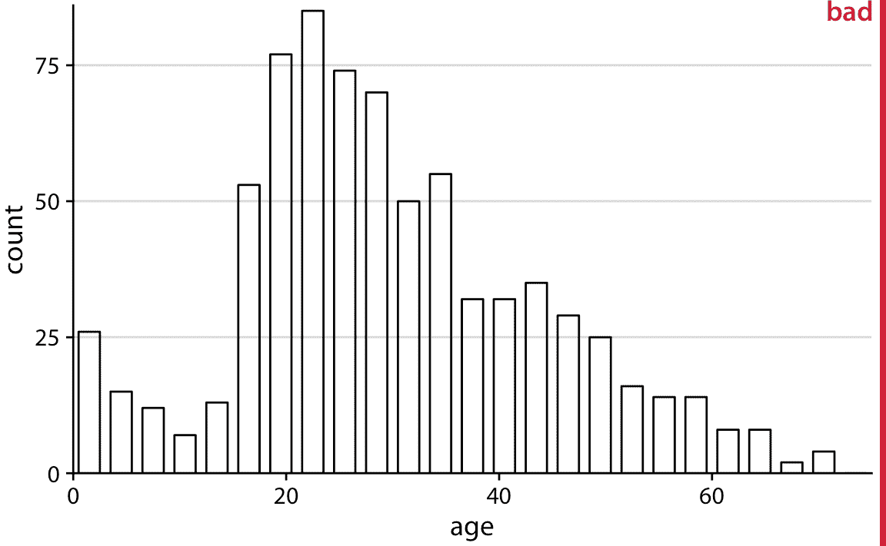
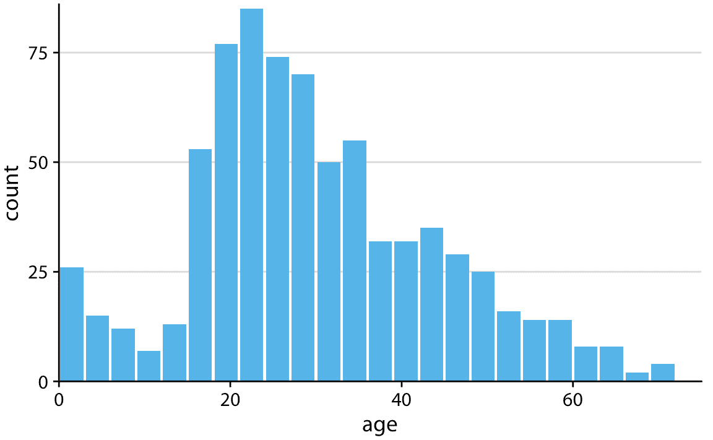
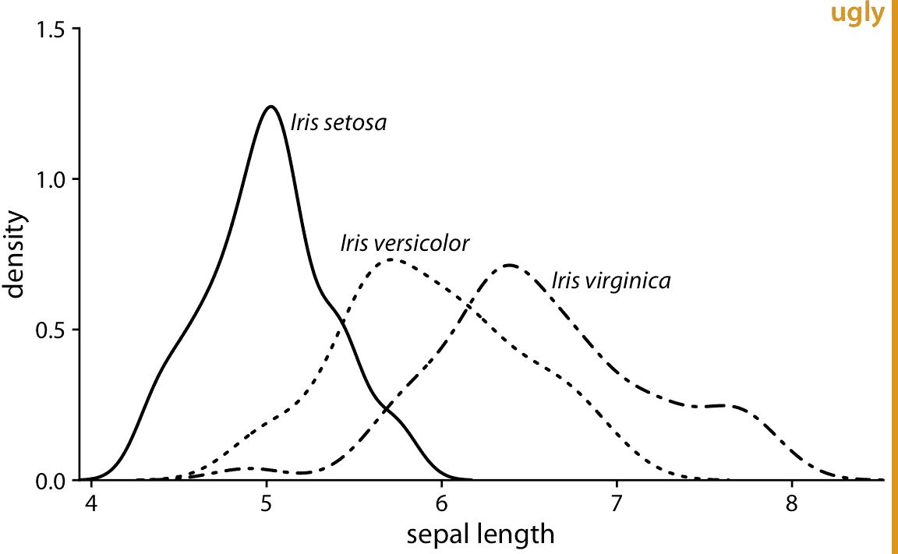
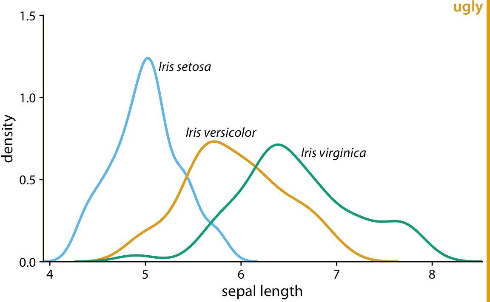
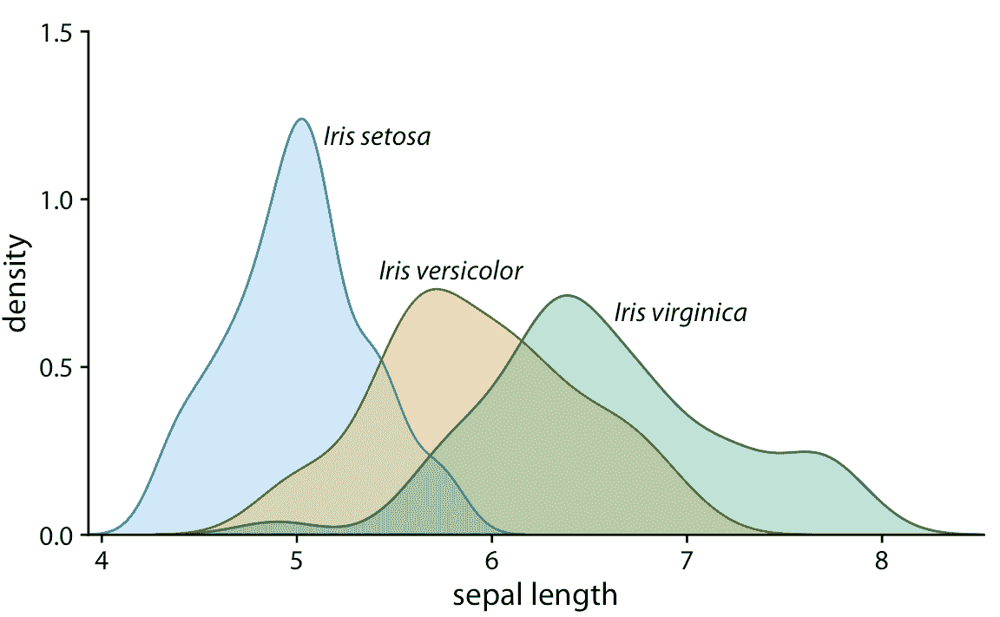
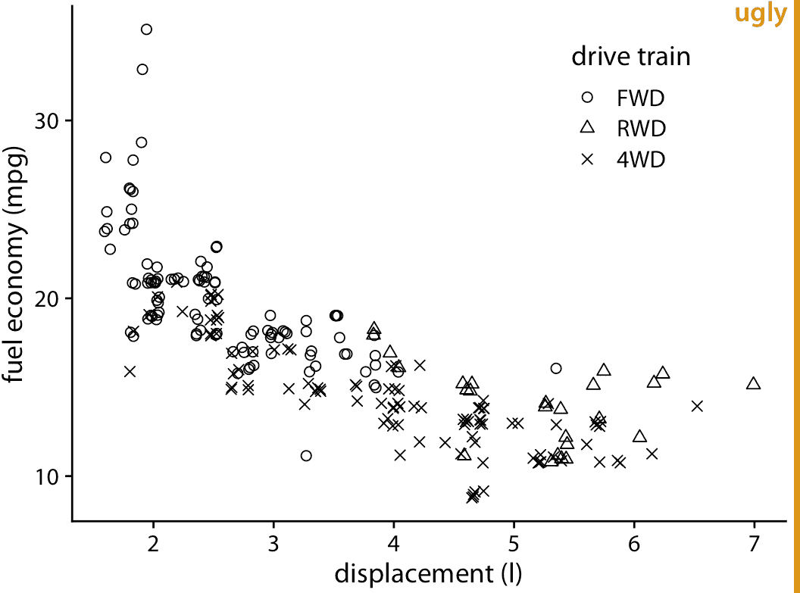
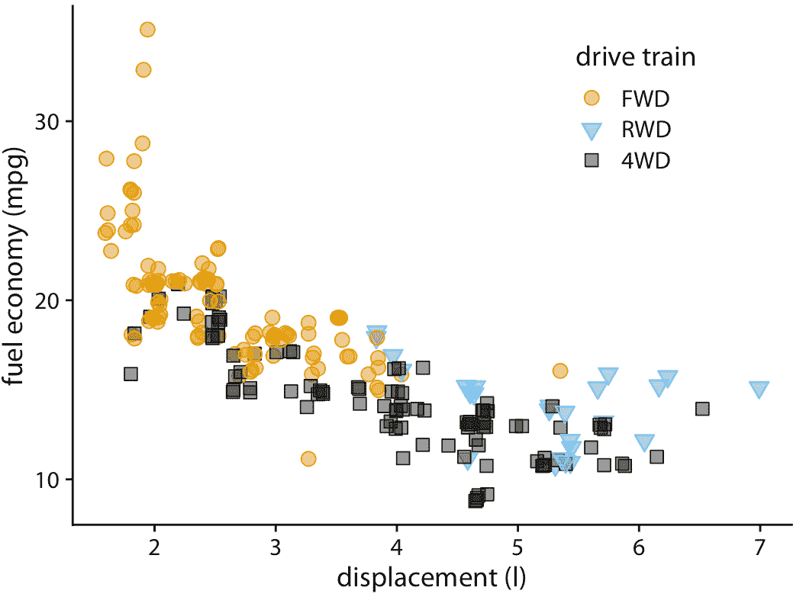
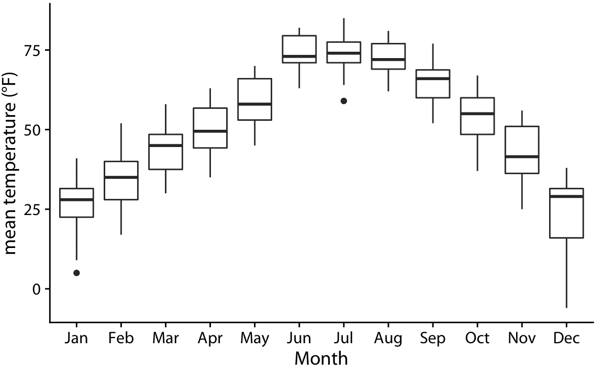
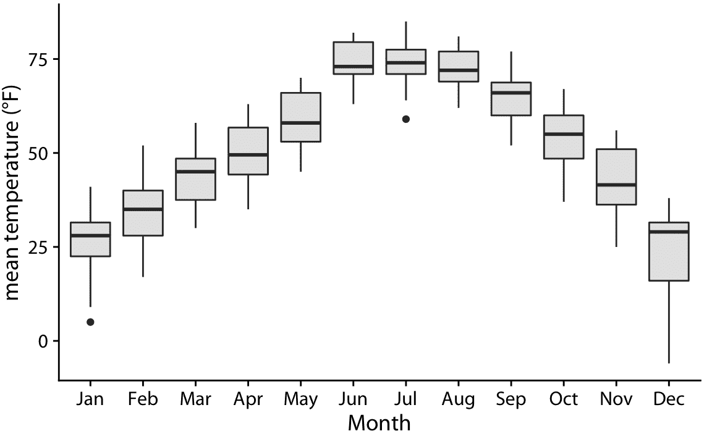

# 25 避免线条图

> 原文： [Avoid line drawings](https://serialmentor.com/dataviz/avoid-line-drawings.html)

> 校验：[飞龙](https://github.com/wizardforcel)

> 自豪地采用[谷歌翻译](https://translate.google.cn/)

尽可能使用实心有色的形状来显示数据，而不是使用勾勒出这些形状的线条。实心形状更容易被视为连贯的对象，不太可能产生视觉虚影或光学幻觉，并且比轮廓更容易传递东西。根据我的经验，使用实心形状的可视化，比使用线条图的等效版本更清晰，更令人愉悦。因此，我尽可能避免使用线条图。但是，我想强调的是，这一建议并未取代比例墨水原理（第 17 章）。

线条图在数据可视化领域有着悠久的历史，因为在 20 世纪的大部分时间里，科学可视化都是手工绘制的，必须以黑白再现。这排除了填充纯色的区域的使用，包括实心灰度填充。相反，有时通过应用阴影线，网状线或点画图案来模拟填充区域。早期绘图软件模仿手绘，同样广泛使用线条图，虚线或点线图案，和阴影线。虽然现代可视化工具和现代重制和发布平台没有先前的限制，但许多绘图应用仍默认使用轮廓和空心形状而不是填充区域。为了提高你对这个问题的认识，我将在这里向你展示几个例子，用线条和填充形状绘制的相同图形的。

在直方图和条形图中，可以看到线条图的最常见且同时最不合适的使用方式。将条形绘制为轮廓的问题在于，任何给定线的哪一侧在条形内部，以及哪一侧在外部并不是立即显而易见的。因此，特别是当条形之间存在间隙时，我们最终会产生一种令人困惑的视觉图案，这会损害图形的主要信息（图 25.1 ）。用浅色填充条形，或者如果不能进行彩色重制，则用灰色填充避免了这个问题（图 25.2）。

图 25.1：使用空心条形绘制的泰坦尼克号乘客年龄的直方图。空心条形形成一个令人困惑的视觉图案。在直方图的中心，很难分辨出哪些部分位于条形图内部，以及哪些部分位于外部。

图 25.2：图 25.1 的相同直方图，现在用实心条形绘制。在该图的变形中，年龄分布的形状更容易辨别。

接下来，我们来看看旧式的密度绘图。我正在显示三种鸢尾花的萼片长度分布的密度估计，完全绘制为黑白线条图（图 25.3 ）。分布仅通过它们的轮廓显示，并且因为图形是黑白的，我们使用不同的线条样式来区分它们。这个图形有两个主要问题。首先，虚线样式不能在曲线下方的区域与其上方的区域之间提供清晰的分离。虽然我们的视觉系统非常擅长将各个线条元素连接成一条连续的线条，但虚线看起来仍然是多孔的，并不能作为封闭区域的有效边界。其次，因为线条相交并且它们所包围的区域没有阴影，所以难以从六个不同的形状轮廓中，分割出不同的密度。如果我对所有三个分布使用实线而不是虚线，这种效果会更强。

图 25.3：三个不同鸢尾花物种的萼片长度的密度估计。用于杂色和弗吉尼亚鸢尾的虚线样式，减损了曲线下方的区域与它们上方的区域不同的感觉。

我们可以尝试通过使用彩色线条而不是虚线，来解决多孔边界的问题（图 25.4 ）。然而，所得图中的密度区域仍然几乎没有视觉存在感。总的来说，我发现填充区域的版本（图 25.5 ）最清晰直观。然而，重要的是使填充区域部分透明，以便可以看到每个物种的完整分布。

图 25.4：三个不同鸢尾花物种的萼片长度的密度估计。通过使用实线，彩色线条，我们解决了图 25.3 的问题，即线条下方和上方的区域似乎是连通的。但是，我们仍然不了解每条曲线下面积的大小。

图 25.5：三个不同鸢尾花物种的萼片长度的密度估计，显示为部分透明的阴影区域。

当不同类型的点绘制为空心圆，三角形，十字等时，折现图也会出现在散点图的上下文中。例如，请考虑图 25.6 。该图包含许多视觉噪声，并且不同类型的点彼此之间没有很强的分离。用实心有色形状绘制相同的图形解决了这个问题（图 25.7 ）。

图 25.6：城市燃油效率与发动机排量的关系，适用于带前轮驱动（FWD），后轮驱动（RWD）和四轮驱动（4WD）的汽车。不同的点样式，所有黑白线条绘图符号，都会产生大量的视觉噪音，并且使图形难以阅读。

图 25.7：城市燃油效率与发动机排量的关系。通过对不同的传动系统使用不同的颜色和不同的实心形状，该图清楚地分离了传动系统，同时在需要时保持可以灰度重现。

我非常喜欢实心点而非空心点，因为实心点具有更多的视觉存在感。我有时听到支持空心点的论点是，它们有助于过度绘图，因为每个点中间的空白区域允许我们看到可能位于其下方的其他点。在我看来，能够看到过度绘制的点的好处，通常不会超过空心符号增加的视觉噪音的损害。还有其他处理过度绘图的方法，请参阅第 18 章获取一些建议。

最后，让我们考虑一下箱线图。箱线图通常用空箱子绘制，如图 25.8 。我更喜欢箱子的浅色阴影，如图 25.9 。阴影将箱子与背景分离得更清楚，特别是当我们显示彼此相邻的多个箱图时，如图 25.8 和 25.9 的情况。在图 25.8 中，大量的箱子和线条可以再次创造出幻觉，即箱子外面的背景区域实际上在其他形状的内部，就像我们在图 25.1 中看到的那样。图 25.9 消除了这个问题。我有时听到过这样的批评：箱子内部的阴影给中间 50% 的数据带来了太多的权重，但我不同意这个论点。无论箱子的阴影是否存在，给予中心 50% 的数据权重而不是其他数据，是箱线图固有的。如果您不想强调这一点，那么请不要使用箱线图。相反，使用提琴图，抖动的点或 Sina 图（第九章）。

图 25.8：2016 年内布拉斯加州林肯市的日平均温度分布。箱子采用传统方式绘制，没有阴影。

图 25.9：2016 年内布拉斯加州林肯市的日平均温度分布。通过给于箱子浅灰色阴影，我们可以使它们在背景中更加突出。