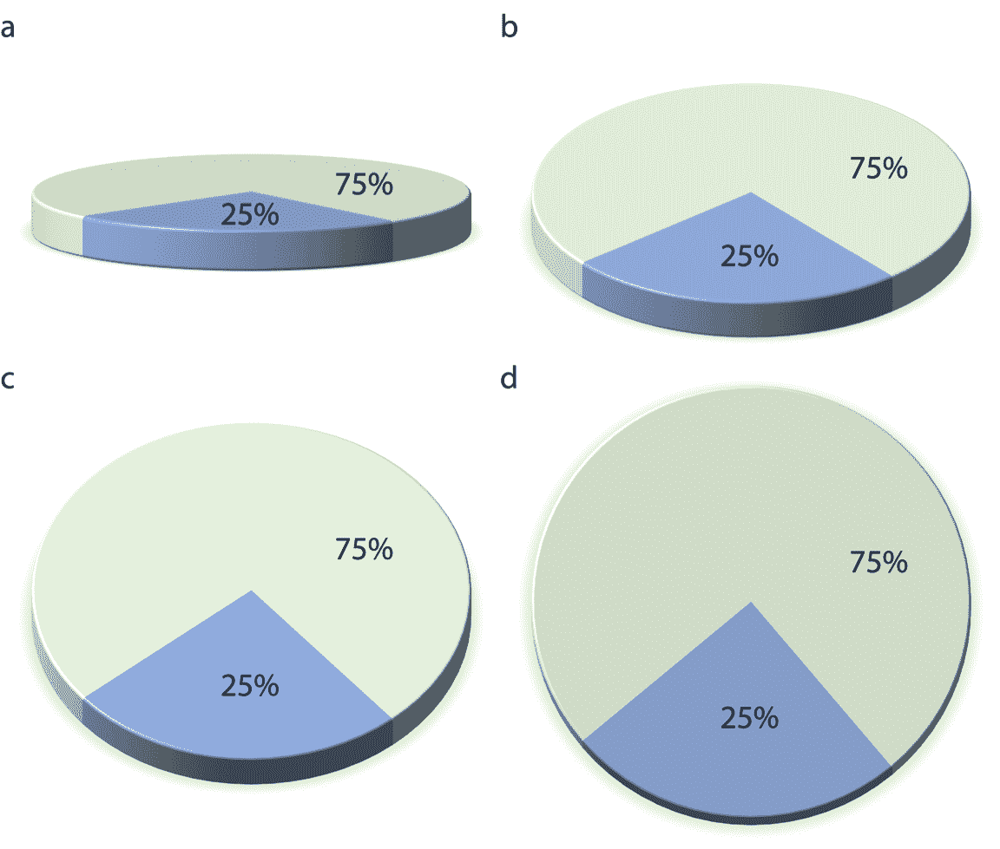
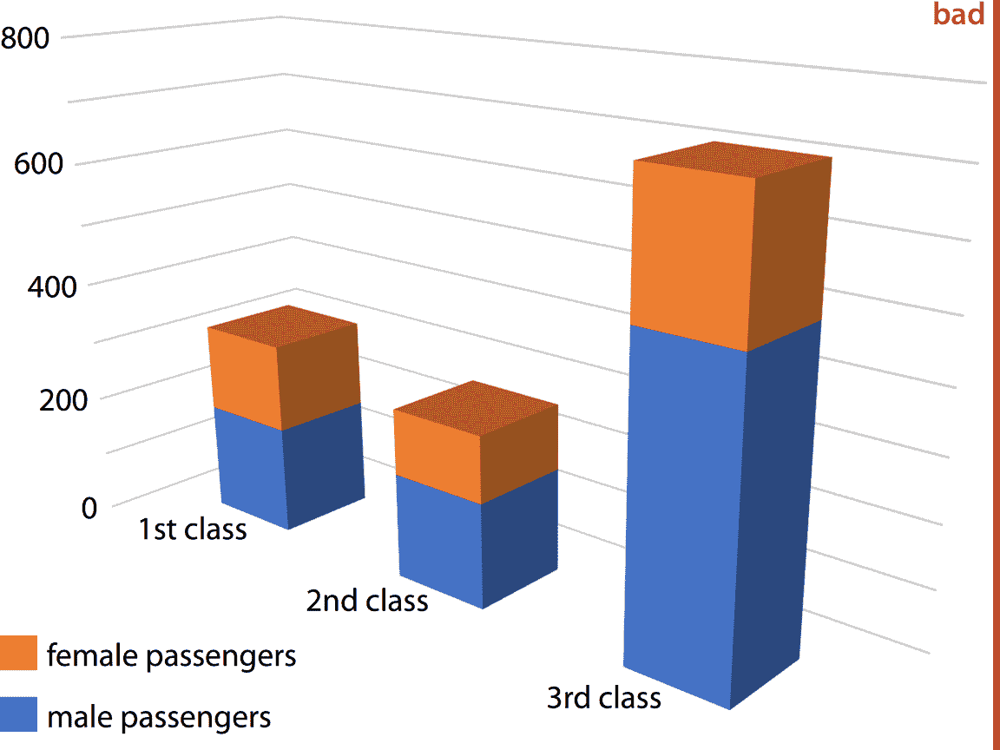
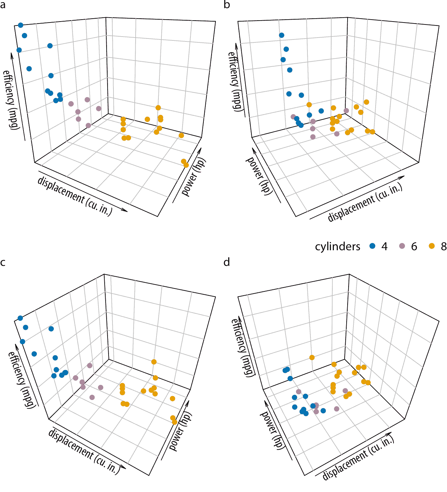
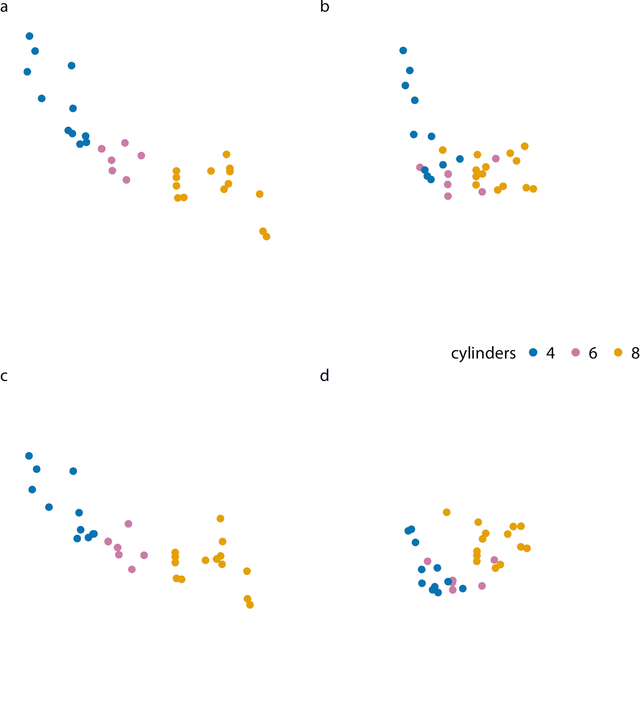
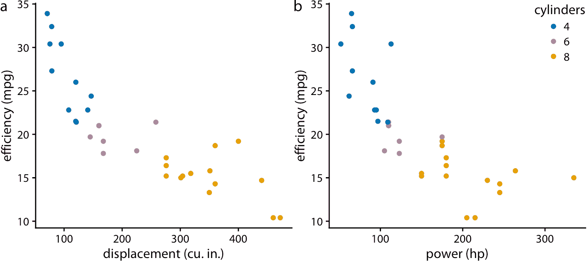
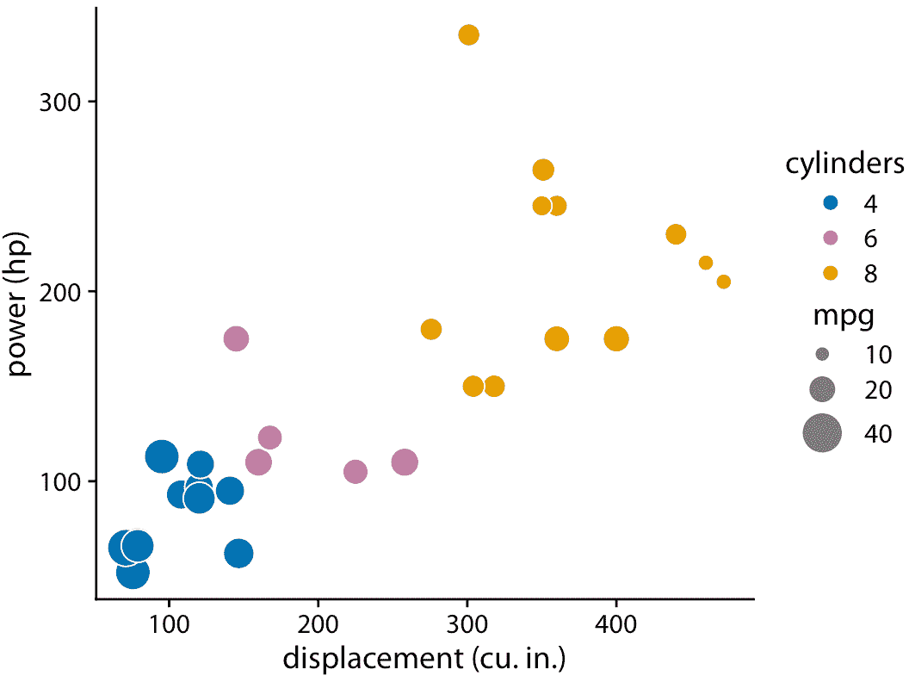
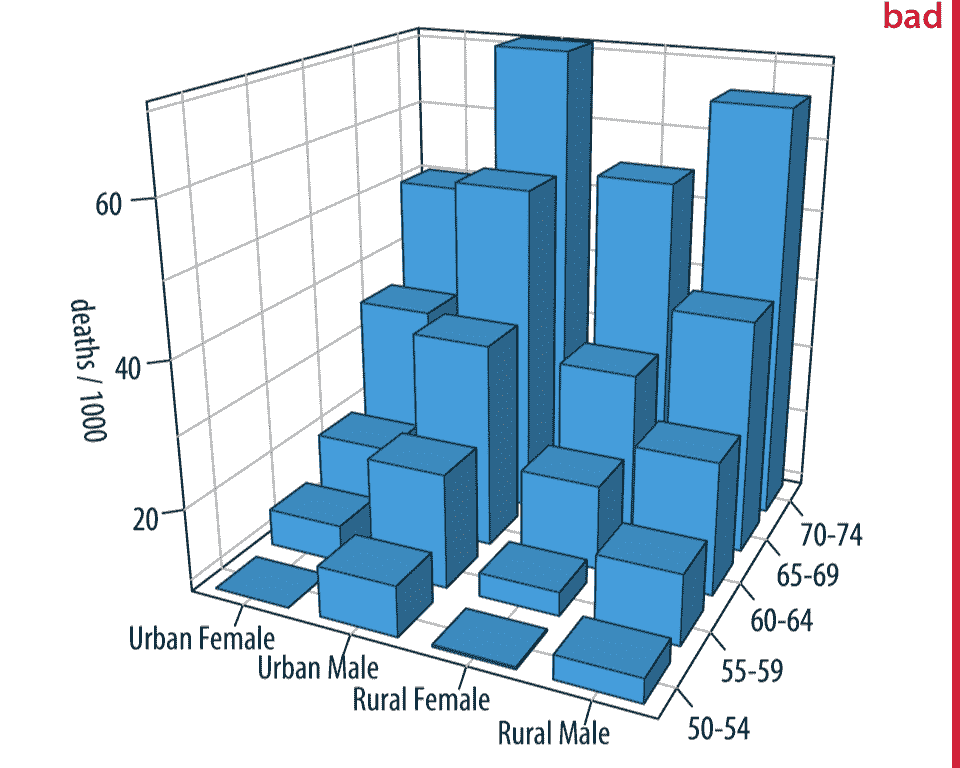
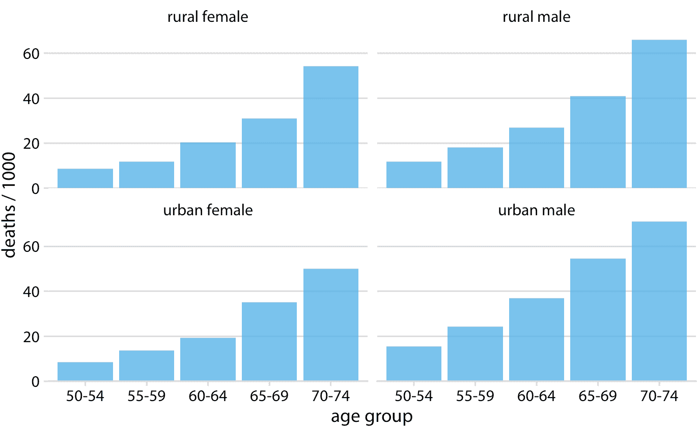
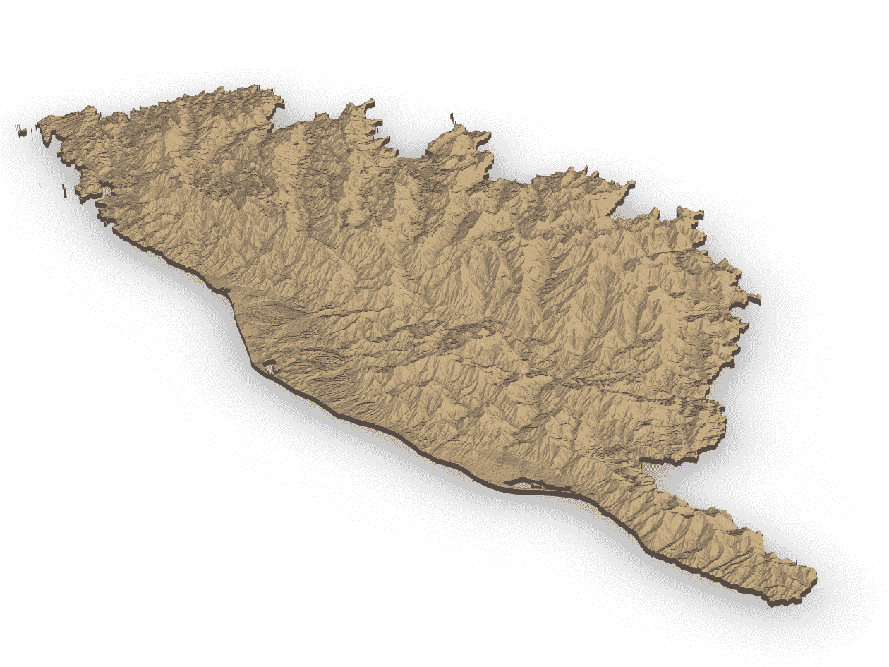
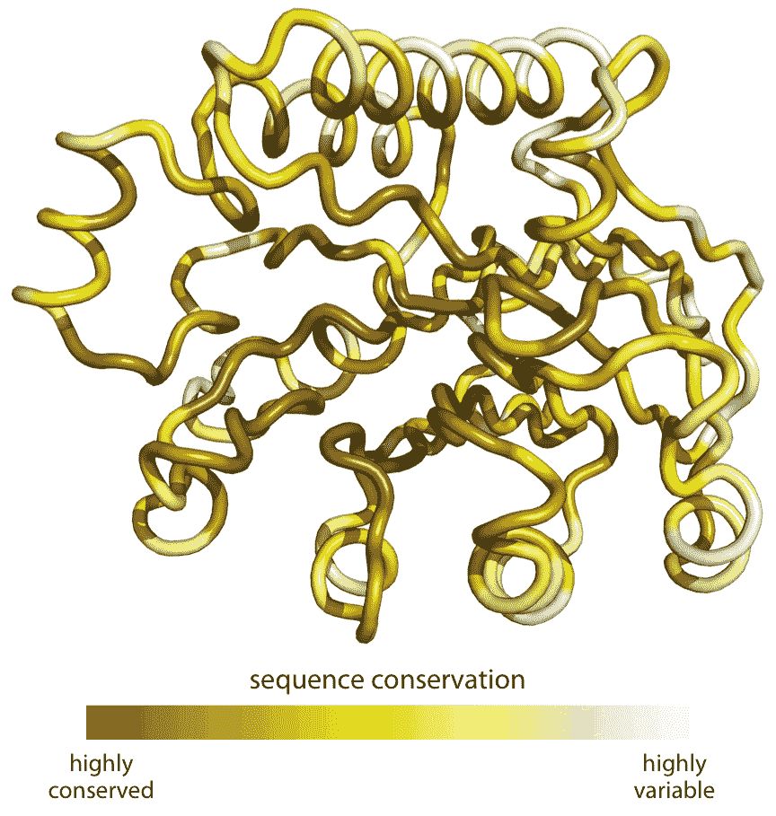

# 26 不要走向 3D

> 原文： [https://serialmentor.com/dataviz/no-3d.html](https://serialmentor.com/dataviz/no-3d.html)

> 校验：[飞龙](https://github.com/wizardforcel)

> 自豪地采用[谷歌翻译](https://translate.google.cn/)

3D 绘图非常受欢迎，特别是在商业演示中，也在学术界中。它们也几乎总是被不恰当地使用。我很少看到 3D 无法图形通过转换为常规 2D 图形来改进。在本章中，我将解释为什么 3D 图形存在问题，为什么通常不需要它们，以及在有限的情况下 3D 图可能是合适的。

## 26.1 避免无理由的 3D

许多可视化软件使您可以通过将图形元素转换为三维对象来修改图形。最常见的是，我们看到饼图变成了在空间中旋转的圆盘，条形图变成了列，折线图变成了带子。值得注意的是，在这些情况中，第三维都没有传达任何实际数据。 3D 仅用于装饰和点缀绘图。我认为 3D 的使用是无理由的。这是非常糟糕的，应该从数据科学家的视觉词汇中删除。

无理由 3D 的问题是，将 3D 对象投影到二维来在监视器上打印或显示，会使数据失真。当人类视觉系统将 3D 图像的 2D 投影映射回 3D 空间时，它试图校正这种失真。但是，这种修正只能是局部的。举个例子，让我们看一个带有两个切片的简单饼图，一个代表 25% 的数据，一个代表 75%，并在空间中旋转这个饼图（图 26.1 ）。当我们改变我们看饼图的角度时，切片的大小似乎也会改变。特别是，当我们从水平角度观察饼图时，位于饼图前面的 25% 切片看起来比 25% 大得多（图 26.1 a）。



图 26.1：从四个不同角度显示的相同 3D 饼图。在三维中旋转的饼图，会使前面的饼图切片看起来比实际大，后面的饼图切片看起来更小。这里，在部分（a），（b）和（c）中，对应于 25% 的数据的蓝色切片在视觉上占据了饼图区域的 25% 以上。只有部分（d）是数据的准确表示。

对于其他类型的 3D 绘图也会出现类似的问题。图 26.2 使用 3D 条形图显示按类别和性别划分的泰坦尼克号乘客。由于条形相对于轴线的布置方式，条形都看起来比它们实际上短。例如，一等乘客共有 322 名，但图 26.2 表明这个数字小于 300。这种错觉的产生是因为代表数据的列对于两个背面有一定距离，灰色水平线在其上绘制。要查看此效果，请考虑延伸其中一列的任何底边，直到它到达最低的灰线（表示 0）。然后，想象对任何顶边执行相同操作，您将看到所有列比第一眼看到的样子要高。 （有关此图的更合理的 2D 版本，请参见第六章中的图 6.10。）



图 26.2：泰坦尼克号上一，二，三等舱的男性和女性乘客人数，显示为三维堆叠条形图。一等，二等和三等舱的乘客总数分别为 322，279 和 711（见图 6.10 ）。然而在这个绘图中，一等舱的条形似乎代表不到 300 名乘客，三等舱的条形似乎代表不到 700 名乘客，而二等舱的条形似乎比实际的 279 名乘客更接近 210-220 名乘客。此外，三等舱的条形在视觉上占主导地位，并使三等舱乘客的数量看起来比实际大。

## 26.2 避免 3D 位置刻度

虽然无理由使用 3D 的可视化很容易被视为不好，但如何考虑使用三个真正的位置刻度（*x* ， *y* 和 *z*）来表示数据的可视化，却不太清楚。在这种情况下，第三维的使用用于实际目的。然而，由此产生的绘图经常难以解释，在我看来应该避免。

考虑一下 32 辆汽车的燃油效率与排量和功率的三维散点图。我们之前在第二章中看到过这个数据集。在这里，我们沿 *x* 轴绘制排量，沿 *y* 轴绘制功率，沿 *z* 轴绘制燃油效率，我们用点表示每辆车（图 26.3 ）。尽管从四个不同的角度展示了这种 3D 可视化，但很难想象这些点在空间中的确切分布。我发现图 26.3 的部分（d）特别令人困惑。它几乎似乎显示了一个不同的数据集，即使除了我们查看点的角度之外没有任何变化。



图 26.3：32 辆汽车（型号 1973-74 ）的燃油效率与排量和功率的关系。每个点代表一辆汽车，点的颜色代表汽车的汽缸数。四个面板（a）-（d）显示完全相同的数据，但使用不同的视角。数据来源：Motor Trend，1974。

这种 3D 可视化的基本问题是，它们需要两个独立的连续数据转换。第一个转换将数据从数据空间映射到 3D 可视化空间，在第二章和第三章中的位置刻度上下文中讨论。第二个将来自 3D 可视化空间的数据映射到最终图形的 2D 空间。（对于在真实 3D 环境中显示的可视化，显然不会发生第二次转换，例如当显示为物理雕塑或 3D 打印的对象时。这里我的主要目标是在 2D 显示器上显示 3D 可视化。）第二次转换不可逆的，因为 2D 显示器上的每个点对应于 3D 可视化空间中的直线上的点。因此，我们无法唯一地确定任何特定数据点在 3D 空间中的位置。

然而，我们的视觉系统试图逆转 3D 到 2D 的转换。然而，这个过程是不可靠的，充满了错误，并且高度依赖于图像中的适当线索，它们传达了一些三维的感觉。当我们删除这些线索时，逆转变得完全不可能。这可以在图 26.4 中看到，除了所有深度线索都被删除外，它与图 26.3 相同。结果是四个随机排列的点，我们根本无法解释，它们甚至不容易相互关联。你能说出部分（a）中哪些点对应部分（b）中的哪些点？我当然不能。



图 26.4：32 辆汽车（型号 1973-74）的燃油效率与排量和功率的关系。四个面板（a）-（d）对应于图 26.3 中的相同面板，只是所有提供深度线索的网格线都已被移除。数据来源：Motor Trend，1974。

我认为通常应该只应用一个适当的可逆转换，并将数据直接映射到 2D 空间，而不是应用两个单独的数据转换，其中一个是不可逆的。由于变量也可以映射到颜色，大小或形状刻度上，因此很少需要将第三维添加为位置刻度。例如，在第二章中，我同时绘制了燃料效率数据集的五个变量，但仅使用了两个位置刻度（图 2.5）。

在这里，我想展示两种替代方法来精确绘制图 26.3 中使用的变量。首先，如果我们主要关注燃料效率作为响应变量，我们可以绘制两次，一次针对排量，一次针对功率（图 26.5）。其次，如果我们对排量和功率如何相互关联更感兴趣，将燃油效率作为第二兴趣变量，我们可以绘制功率与排量的关系，并将燃油效率映射为点的大小（图 26.6 ）。这两个图形比图 26.3 更有用，更不容易混淆。



图 26.5：燃油效率与排量（a）和功率（b）的关系。数据来源：Motor Trend，1974。



图 26.6：32 辆汽车的功率与排量，燃料效率由点的大小表示。数据来源：Motor Trend，1974。

您可能想知道 3D 散点图的问题是实际数据表示（点）本身不会传达任何 3D 信息。例如，如果我们使用 3D 条形图会发生什么？图 26.7 显示了一个典型的数据集，可以用 3D 条形图显示，1940 年弗吉尼亚州的死亡率，按年龄、性别和住房位置分组。我们可以看到 3D 条形确实帮助我们解释绘图。人们不太可能将前景中的条形误认为背景中的条形，反之亦然。然而，在图 26.2 的背景下讨论的问题也存在于此。很难准确判断单个条的高度，并且很难进行直接比较。例如，在 60-64 岁年龄组的城市女性死亡率，是高于还是低于 65-69 岁年龄组的城市男性？



图 26.7：弗吉尼亚州 1940 年的死亡率，可视化为 3D 条形图。显示四组人（城市和农村，女性和男性）和五个年龄组（50-54,55-59,60-64,65-69,70-74）的死亡率，并以每一千人的死亡数为单位报告。这个图形标记为“不好”，因为 3D 视角使得绘图难以阅读。数据来源： Molyneaux，Gilliam 和 Florant（1947）

通常，最好使用格子图（第 21 章）而不是 3D 可视化。当显示为格子图时，弗吉尼亚死亡率数据集仅需要四个图（图 26.8 ）。我认为这个图形清晰易懂。很明显，男性的死亡率高于女性，城市男性的死亡率似乎高于农村男性，而城市和农村女性的这种趋势并不明显。



图 26.8：1940 年弗吉尼亚州的死亡率，可视化为格子图图。显示四组人（城市和农村，女性和男性）和五个年龄组（50-54,55-59,60-64,65-69,70-74）的死亡率，并以每千人死亡数为单位报告。数据来源： Molyneaux，Gilliam 和 Florant（1947）

## 26.3 3D 可视化的适当使用

但是，带有 3D 位置刻度的可视化有时是合适的。首先，如果可视化是交互式的并且可以由观看者旋转，或者如果它在 VR 或增强现实环境中显示，并可以从多个角度检查，则前一部分中描述的问题就不重要了。其次，即使可视化不是交互式的，显示它慢慢旋转，而不是从一个角度作为静态图像来查看，将允许观看者辨别不同图形元素所在的 3D 空间中的哪里。人脑非常善于从不同角度拍摄的一系列图像重建 3D 场景，图形的慢速旋转恰好提供了这些图像。

最后，当我们想要显示实际的 3D 对象和/或映射到它们的数据时，使用 3D 可视化是有意义的。例如，显示山区的地形起伏是一个合理的选择（图 26.9 ）。类似地，如果我们想要可视化映射到其结构上的蛋白质的进化序列保守性，则将结构显示为 3D 对象是有意义的（图 26.10 ）。然而，在任何一种情况下，如果它们被显示为旋转动画，这些可视化仍将更容易解释。虽然这在传统印刷出版物中是不可能的，但是当在网上发布图形或进行演示时，可以很容易地完成。



图 26.9：地中海科西嘉岛的地形。数据来源：哥白尼土地监测服务



图 26.10：蛋白质进化变异的模式。有色的管子代表来自细菌大肠杆菌的蛋白质外切核酸酶 III 的主链（蛋白质数据库标识符：1AKO）。着色表示该蛋白质中各个位点的进化保守性，深色表示保守氨基酸，浅色表示可变氨基酸。数据来源： Marcos 和 Echave（2015）

### 参考

```
Molyneaux, L., S. K. Gilliam, and L. C. Florant. 1947. “Differences in Virginia Death Rates by Color, Sex, Age, and Rural or Urban Residence.” American Sociological Review 12: 525–35.

Marcos, M. L., and J. Echave. 2015. “Too Packed to Change: Side-Chain Packing and Site-Specific Substitution Rates in Protein Evolution.” PeerJ 3: e911.
```