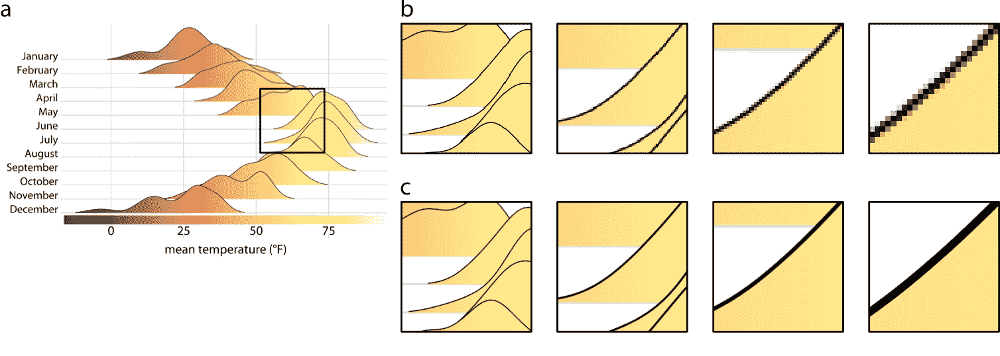
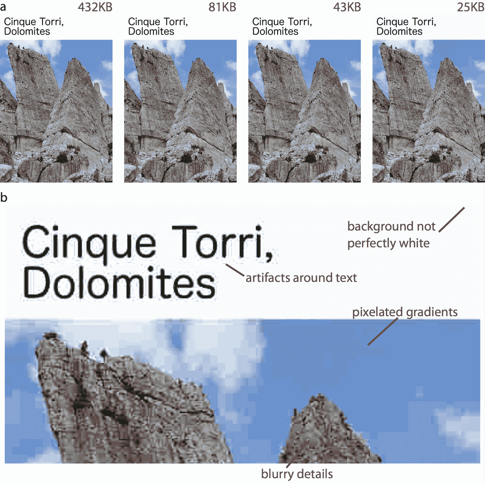

# 27 了解最常用的图像文件格式

> 原文： [27 Understanding the most commonly used image file formats](https://serialmentor.com/dataviz/image-file-formats.html)

> 校验：[飞龙](https://github.com/wizardforcel)

> 自豪地采用[谷歌翻译](https://translate.google.cn/)

任何为数据可视化制作图形的人，最终都必须知道一些信息，关于图形如何存储在计算机上。有许多不同的图像文件格式，每种格式都有其自身的优点和缺点。选择正确的文件格式和正确的工作流程，可以缓解许多图形制作问题。

我自己的偏好是将 pdf 用于高质量的可供出版的文件，并且通常尽可能使用 png 用于在线文档和需要位图图形的其他场景，如果 png 文件太大，则将 jpeg 作为最后的手段。在下文中，我将解释这些文件格式之间的主要区别，以及它们各自的优缺点。

## 27.1 位图和矢量图形

各种图形格式之间最重要的区别在于，它们是位图还是矢量（表 27.1 ）。位图或光栅图形将图像存储为各个点（称为像素）的网格，每个点都具有指定的颜色。相比之下，矢量图形存储图像中各个图形元素的几何排列。因此，矢量图像包含诸如“从左上角到右下角的黑线，以及从左下角到右上角的红线”的信息，并且随着它显示在屏幕上或打印出来，图像在运行中实时重新创建。

表 27.1：常用的图像文件格式

| 缩写 | 名称 | 类型 | 应用 |
| :-- | :-- | :-- | :-- |
| PDF | Portable Document Format（可移植文档格式） | 矢量 | 一般用途 |
| EPS | Encapsulated PostScript（封装的 PostScript） | 矢量 | 一般用途，过时；应使用 pdf |
| SVG | Scalable Vector Graphics（可缩放矢量图形） | 矢量 | 在线使用 |
| PNG | Portable Network Graphics（便携式网络图形） | 位图 | 针对线条图进行了优化 |
| JPEG | Joint Photographic Experts Group（联合图像专家组） | 位图 | 针对摄影图像进行了优化 |
| TIFF | Tagged Image File Format（标记图像文件格式） | 位图 | 印刷制作，准确的色彩再现 |
| RAW | 原始图像文件 | 位图 | 数码摄影，需要后期处理 |
| GIF | Graphics Interchange Format（图形交换格式） | 位图 | 对静态图形过时，对于动画不错 |

矢量图形也称为“与分辨率无关”，因为它们可以放大到任意大小而不会丢失细节或清晰度。对于演示，请参见图 27.1 。

图 27.1：矢量图形和位图之间关键区别的图示。 （a）原始图像。黑色方块表示我们在（b）和（c）部分放大的区域。 （b）当图像被存储为位图图形时，来自部分（a）的高粱区域的渐进放大。随着我们进一步放大，我们可以看到图像如何变得越来越像素化。 （c）图像的矢量表示的渐进放大。图像在任意放大倍率下保持完美清晰度。

矢量图形有两个缺点，可能并且经常会在实际应用中造成麻烦。首先，因为矢量图形由显示它们的图形程序在运行中重新绘制，在两个不同程序或两台不同计算机上，可能出现相同图形的外观差异。文本最常出现此问题，例如，当所需字体不可用且由呈现软件替换为不同字体时。字体替换通常允许观看者按预期阅读文本，但是得到的图像很少看起来很好。有一些方法可以避免这些问题，例如在 pdf 文件中概述或嵌入所有字体，但它们可能需要特殊的软件和/或特殊技术知识才能实现。相比之下，位图图像看起来总是一样的。

其次，对于非常大和/或复杂的图形，矢量图形的文件大小可能会大幅增长的并且渲染速度很慢。例如，数百万个数据点的散点图，将包含每个单独点的 x 和 y 坐标，并且在渲染图像时需要绘制每个点，即使点重叠和/或被其他图形元素隐藏。因此，文件的大小可能是几兆字节，并且渲染软件可能花费一些时间来显示该图形。当我在 21 世纪初期担任博士后时，我曾经创建了一个 pdf 文件，当时花了将近一个小时才能在 Acrobat 阅读器中显示。虽然现代计算机速度更快，几分钟的渲染时间几乎都是闻所未闻的，但如果你想将你的图形嵌入到更大的文档中，并且每次你显示带有有问题的图形的页面，你的 pdf 阅读器停止运行，即使是几秒钟的渲染时间也可能是破坏性的。当然，另一方面，只有少量元素（比如一些数据点和一些文本）的简单图形作为矢量图形通常会小得多，而且查看软件甚至可以比相应的位图图像更快地渲染这些图形。

## 27.2 位图图形的无损和有损压缩

大多数位图文件格式采用某种形式的数据压缩来保持文件大小可管理。压缩有两种基本类型：无损和有损。无损压缩可确保压缩图像的像素与原始图像与像素相同，而有损压缩则接受一些图像质量下降，来换取较小的文件大小。

要了解何时使用无损或有损压缩是合适的，有必要对这些不同的压缩算法如何工作有基本的了解。我们首先考虑无损压缩。想象一下具有黑色背景的图像，其中图像的大部分区域是纯黑色，因此许多黑色像素紧挨着彼此出现。每个黑色像素可以由一行中的三个零表示：`0 0 0`，表示图像的红色，绿色和蓝色通道中的零强度。图像中的黑色背景区域对应于图像文件中的数千个零。现在假设图像中的某个位置是 1000 个连续的黑色像素，对应于 3000 个零。我们可以简单地存储我们需要的零的总数，而不是写出所有这些零。通过写入`3000 0`。通过这种方式，我们只用两个数字传递完全相同的信息，即计数（此处为 3000）和值（此处为 0）。多年来，已经开发了许多按照这种方法的巧妙技巧，现代无损图像格式（例如 png）可以以惊人的效率存储位图数据。然而，当图像具有大面积的均匀颜色时，所有无损压缩算法都表现最佳，因此表 27.1 列出了针对线条图优化的 png。

摄影图像很少有彼此相邻的相同颜色和亮度的多个像素。相反，他们在许多不同的刻度上都有渐变和其他有规律的图案。因此，这些图像的无损压缩通常不能工作得很好，并且已经开发出有损压缩作为替代方案。有损压缩的关键思想是，图像中的某些细节对于人眼来说太微小，并且可以丢弃那些细节而不会明显降低图像质量。例如，考虑 1000 像素的渐变，每个像素的颜色值略有不同。如果仅使用 200 种不同颜色绘制渐变并且每五个相邻像素以完全相同的颜色着色，则渐变看起来几乎相同。

最广泛使用的有损图像格式是 jpeg（表 27.1 ），实际上许多数码相机默认输出图像为 jpeg。 Jpeg 压缩对于摄影图像非常有效，并且通常可以在图像质量几乎没有降低的情况下，使文件大小的大幅减少。但是，当图像包含锐边（例如由线条图或文本创建）时，jpeg 压缩会失效。在这些情况下，jpeg 压缩会导致非常明显的虚影（图 27.2 ）。

图 27.2：jpeg 虚影的图示。 （a）使用逐渐增强的 jpeg 压缩多次再现相同的图像。生成的文件大小在每个图像上方以红色文本显示。文件大小减少了 10 倍，从原始图像中的 432KB 减少到压缩图像中的 43KB，导致图像质量的轻微降低。但是，文件大小进一步减少 2 倍，仅为 25KB，会导致大量可见的虚影。 （b）放大最大压缩的图像会显示各种压缩虚影。照片来源：Claus O. Wilke

即使 jpeg 虚影非常微小以至于它们不能立即被肉眼看到，它们也会引起麻烦，例如在印刷生产中。因此，尽可能避免使用 jpeg 格式是个好主意。特别是，对于包含线条图或文本的图像，您应该避免使用它，就像数据可视化或屏幕截图一样。这些图像的适当格式是 png 或 tiff。我将 jpeg 格式专门用于摄影图像。如果图像包含摄影元素和线条图或文本，您仍应使用 png 或 tiff。这些文件格式的最坏情况是你的图像文件变大，而 jpeg 的最坏情况是你的最终产品看起来很难看。

## 27.3 在图像格式之间转换

通常可以将任何图像格式转换为任何其他图像格式。例如，在 Mac 上，您可以使用“预览”打开图像，然后导出为多种不同的格式。但是，在这个过程中，重要信息可能会丢失，信息永远不会重新获得。例如，在将矢量图形保存为位图格式之后，例如，作为 jpeg 的 pdf 文件，作为矢量图形的关键特征的分辨率无关已经丢失。相反，将 jpeg 图像保存为 pdf 文件并不会将图像神奇地转换为矢量图形。图像仍然是位图图像，只是存储在 pdf 文件中。同样，将 jpeg 文件转换为 png 文件不会删除 jpeg 压缩算法可能引入的任何虚影。

因此，始终以保持最大分辨率，准确性和灵活性的格式存储原始图像，是一个很好的经验法则。因此，对于数据可视化，要么将图形创建为 pdf，然后在必要时转换为 png 或 jpg，要么存储为高分辨率 png。同样，对于仅提供为位图的图像（如数码照片），将其存储为不带有损压缩的格式，或者如果无法实现，则尽可能少地压缩。此外，以尽可能高的分辨率存储图像，并在需要时缩小图像。