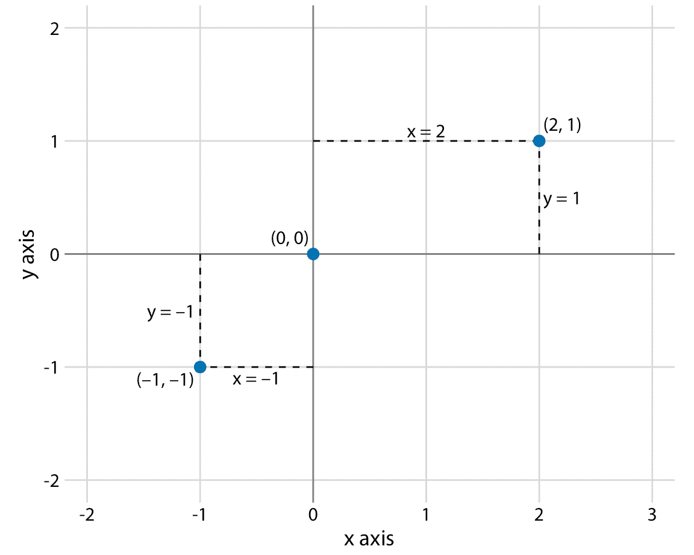
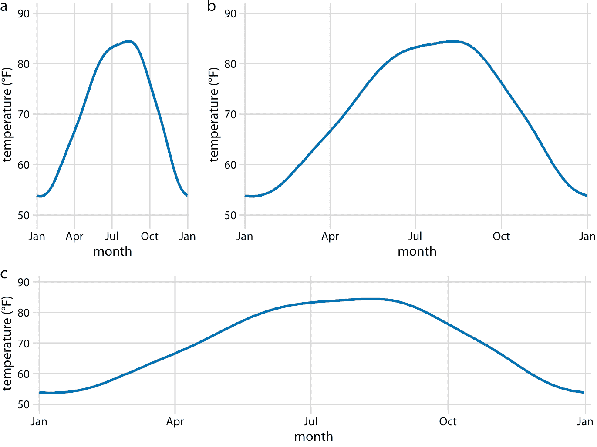
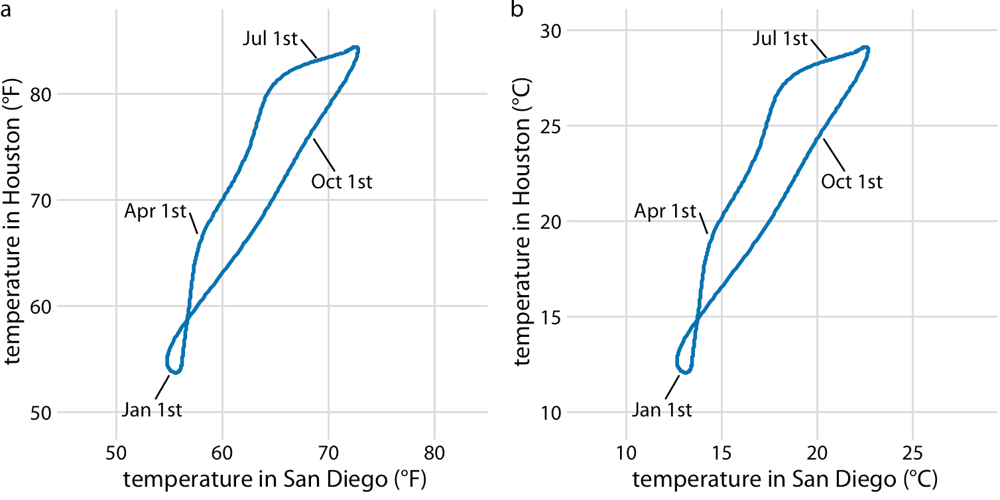
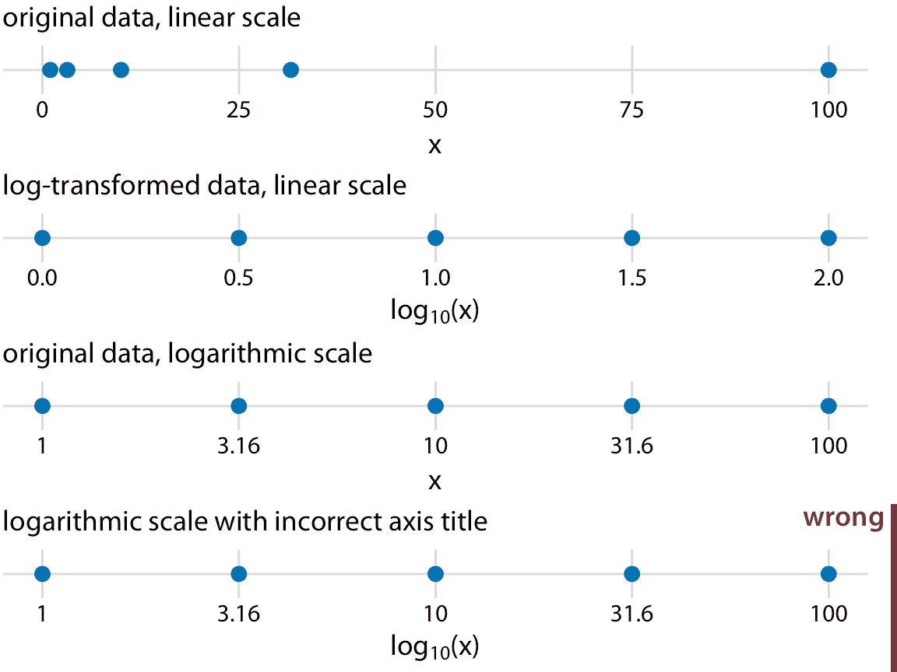
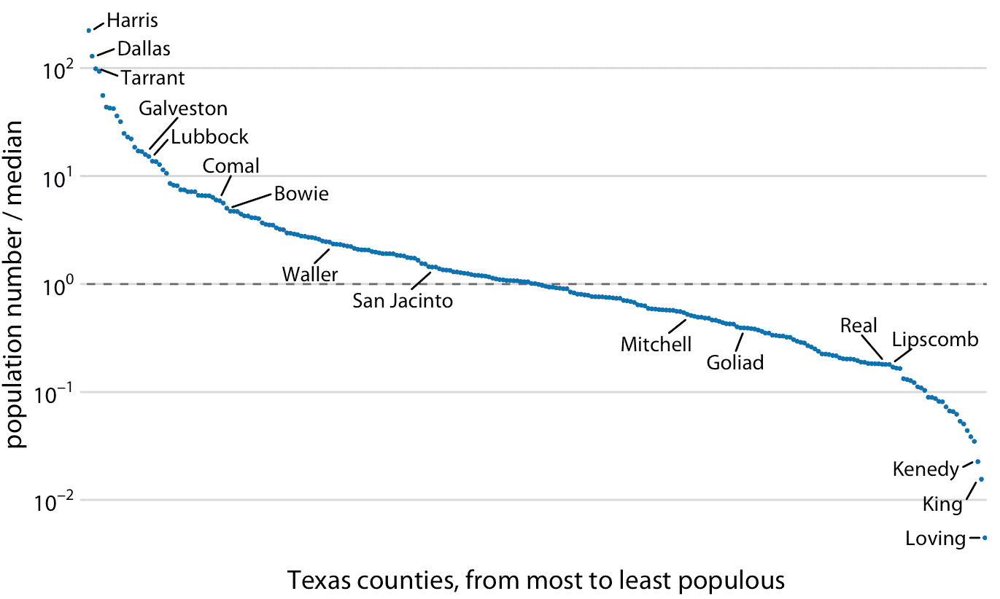
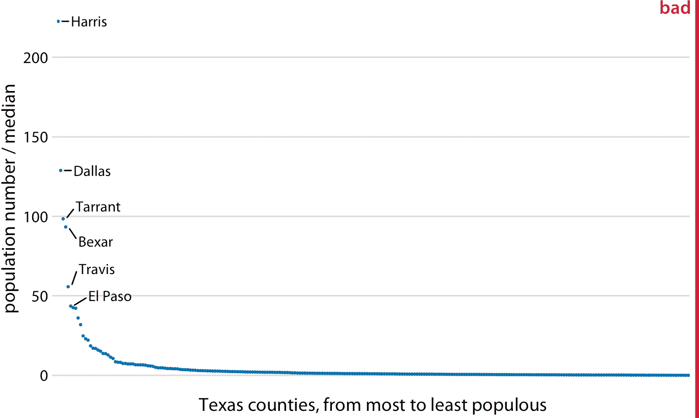
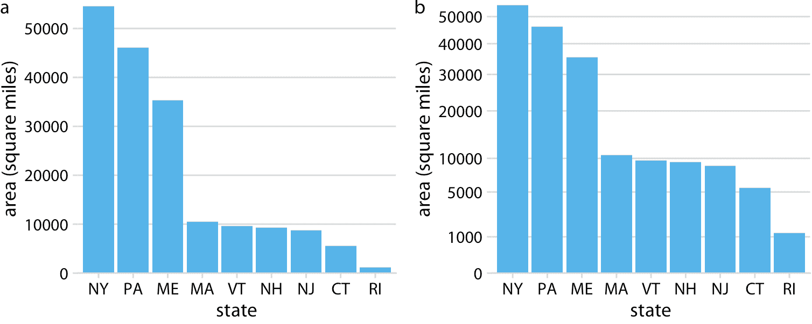
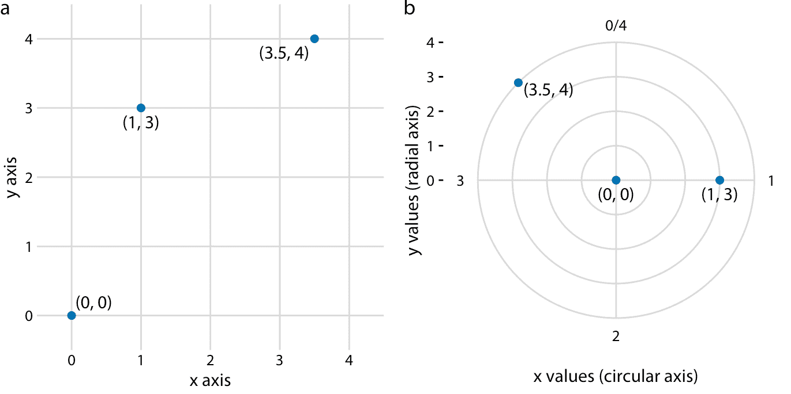
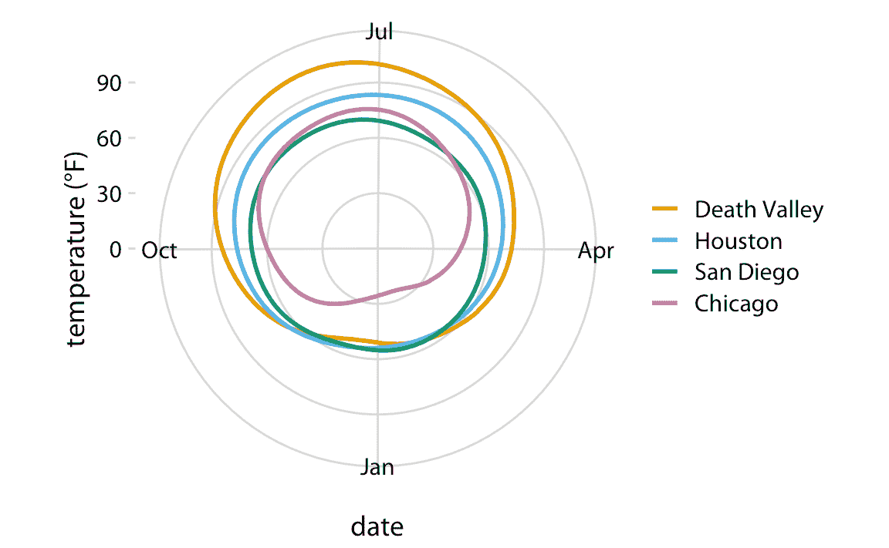
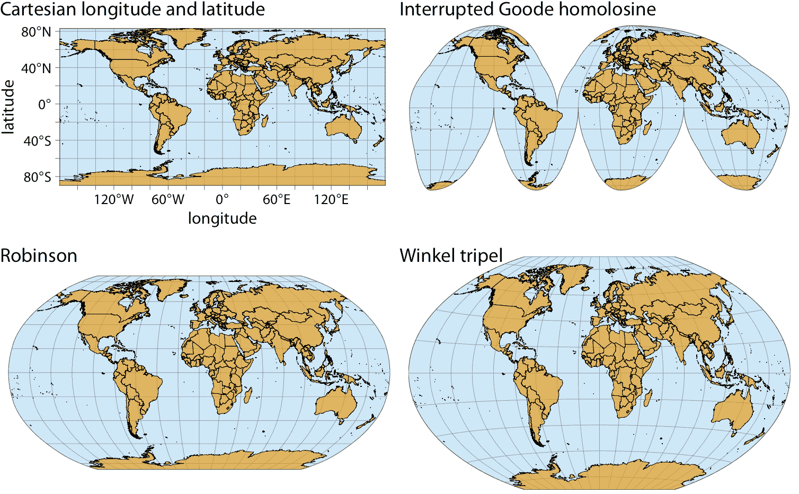

# 3 坐标系和轴

> 原文： [3 Coordinate systems and axes](https://serialmentor.com/dataviz/coordinate-systems-axes.html)

> 校验：[飞龙](https://github.com/wizardforcel)

> 自豪地采用[谷歌翻译](https://translate.google.cn/)

要进行任何类型的数据可视化，我们需要定义位置刻度，来确定不同数据值的在图形中的位置。如果不将不同数据点放置在不同位置，我们就无法可视化数据，即使我们只是沿着一条线将它们彼此相邻排列。对于常规的 2d 可视化，需要两个数字来唯一地指定一个点，因此我们需要两个位置刻度。这两个刻度通常但不一定是图的 *x* 和 *y* 轴。我们还必须指定这些刻度的相对几何排列。通常， *x* 轴水平延伸，*y* 轴垂直，但我们可以选择其他排列。例如，我们可以使 *y* 轴相对于 *x* 轴成锐角，或者我们可以让一个轴成圆形而另一个轴径向延伸。一组位置刻度及其相对几何排列的组合称为坐标系。

## 3.1 笛卡尔坐标

最广泛使用的数据可视化坐标系是 2d 笛卡尔坐标系，其中每个位置由 *x* 和 *y* 值唯一指定。 *x* 和 *y* 轴彼此正交，数据值沿两个轴均等间隔放置（图 3.1 ）。两个轴是连续的位置刻度，它们可以表示正实数和负实数。要完全指定坐标系，我们需要指定每个轴覆盖的数字范围。在图 3.1 中， *x* 轴从 -2.2 到 3.2，*y* 轴从 -2.2 到 2.2。这些轴边界之间的任何数据值都放置在图中的相应位置。轴边界之外的任何数据值都将被丢弃。

图 3.1：标准笛卡尔坐标系。横轴通常称为 *x*，纵轴为 *y* 。两个轴形成等间距的网格。这里， *x* 和 *y* 网格均以 1 为单位分开。点`(2, 1)`位于原点`(0, 0)`右侧的两个 *x* 单位和上方的一个 *y* 单位。点`(-1, -1)`位于原点左侧的一个 *x* 单位和位于下方的一个 *y* 单位。

但是，数据的值通常不仅仅是数字。他们有单位。例如，如果我们测量温度，则可以以摄氏度或华氏度为单位。类似地，如果我们测量距离，则可以以公里或英里为单位，如果我们测量持续时间，则可以以分钟，小时或天为单位。在笛卡尔坐标系中，沿轴的网格线之间的间距对应于这些数据单元中的离散步长。例如，在温度范围内，我们可能每 10 华氏度有一个网格线，而在距离范围内，我们可能每 5 公里有一个网格线。

笛卡尔坐标系可以具有代表两个不同单位的两个轴。每当我们将两种不同类型的变量映射到 *x* 和 *y* 时，就会出现这种情况。例如，在图 2.3 中，我们绘制了温度与一年中的天数。图 2.3 的 *y* 轴以华氏度为单位测量，网格线均为 20 度，*x* 轴以月为单位测量，网格线在每三个月的第一个月。无论何时以不同的单位测量两个轴，我们都可以相对于另一个轴拉伸或压缩，并保持数据的有效可视化（图 3.2 ）。哪个版本更合适，取决于我们想传达的故事。高而窄的图形强调沿 *y* 轴的变化，而短而宽的图形则相反。理想情况下，我们希望选择一个宽高比，以确保任何位置上的重要差异都是显而易见的。

图 3.2：德克萨斯州休斯顿的日平均温度。温度映射到 *y* 轴以及一年中的某一天映射到 *x* 轴。部分（a），（b）和（c）以不同的纵横比展示相同的图。所有三个部分都是温度数据的有效可视化。数据来源：NOAA。

另一方面，如果 *x* 和 *y* 轴以相同的单位测量，那么两个轴的网格间距应该相等，这样沿着 *x* 或 *y* 轴的相同的距离，对应于相同数量的数据单位。例如，我们可以绘制一年中每天的休斯顿，德克萨斯州与加利福尼亚州圣地亚哥的温度（图 3.3a）。由于沿两个轴绘制相同的定量值，我们需要确保网格线形成完美的正方形，如图 3.3 中的情况。

图 3.3：休斯顿，TX 的日平均温度，相对于加利福尼亚州圣地亚哥的相应平均温度绘制。突出显示 1 月，4 月，7 月和 10 月的第一天，来提供时间参考。 （a）气温以华氏度表示。 （b）温度以摄氏度表示。数据来源：NOAA。

您可能想知道如果更改数据单位会发生什么。毕竟，单位是任意的，你的偏好可能与其他人不同。单位变化是线性变换，我们在所有数据值中添加或减去一个数字和/或将所有数据值与另一个数字相乘。幸运的是，笛卡尔坐标系在这种线性变换下是不变的。因此，您可以更改数据的单位，只要相应地更改轴，所得图形就不会改变。例如，比较图 3.3a 和 3.3b。两者都显示相同的数据，但在部分（a）中温度单位是​​华氏度，而在部分（b）中它们是摄氏度。即使网格线位于不同的位置并且沿轴的数字不同，两个数据可视化看起来完全相同。

## 3.2 非线性轴

在笛卡尔坐标系中，沿轴的网格线在数据单元和所得可视化中均匀间隔。我们将这些坐标系中的位置刻度称为线性的。虽然线性刻度通常提供数据的准确表示，但是存在非线性刻度更佳的情况。在非线性刻度中，数据单元中的均匀间距对应于可视化中的不均匀间隔，或者相反地，甚至可视化中的间距对应于数据单元中的不均匀间隔。

最常用的非线性刻度是对数（log）刻度。对数刻度在乘法中是线性的，因此刻度上的单位步长相当于乘上固定值。要创建对数刻度，我们需要对数据值进行对数转换，同时对沿轴网格线显示的数字进行求幂。该过程在图 3.4 中进行了演示，其中显示了在线性和对数刻度上的数字 1, 3.16, 10, 31.6 和 100。数字 3.16 和 31.6 似乎是一个奇怪的选择，但选择它们是因为它们正好在 1 到 10 之间，在对数刻度上在 10 到 100 之间。我们可以通过观察 $10 ^ {0.5} = \sqrt{10} \sim 3.16$ 和等价的 $3.16 \times 3.16 \sim 10 $ 来看到这一点。类似地，$10^{1.5} = 10 \times 10^{0.5} \sim 31.6$。

图 3.4：线性和对数刻度之间的关系。点对应于数据值 1, 3.16, 10, 31.6, 100，它们是对数刻度上的均匀间隔数。我们可以在线性刻度上显示这些数据点，我们可以对它们进行对数转换然后以线性刻度显示，或者我们可以在对数刻度上显示它们。重要的是，对数刻度的正确轴标题是显示的变量的名称，而不是该变量的对数。

在数学上，在线性刻度上绘制对数变换数据，或在对数刻度上绘制原始数据之间没有区别（图 3.4 ）。唯一的区别在于单个轴刻度线和整个轴的标签。在大多数情况下，对数刻度的标签是优选的，因为它对读者施加较少的精神负担，来解释显示为轴刻度线标签的数字。关于对数基数的混淆风险也较小。当使用对数转换的数据时，我们可能会对数据是使用自然对数还是使用基数 10 的对数感到困惑。不常见的标签是模棱两可的，例如： `log(x)`，它根本没有指定基数。我建议您在使用对数转换数据时始终标明基数。绘制对数转换的数据时，请始终在轴标签中指定基数。

因为对数刻度上的乘法看起来像线性刻度上的加法，所以对数刻度是通过乘法或除法获得的任何数据的自然选择。特别是，比值通常应以对数刻度显示。例如，我已经记录了德克萨斯州每个县的居民人数，并将其除以德克萨斯州所有县的居民人数中位数。得到的比值是可以大于或小于 1 的数字。恰好为 1 的比值意味着相应的县具有居民的中位数。当以对数刻度可视化这些比值时，我们可以清楚地看到，德克萨斯州的人口数量对称地分布在中位数附近，并且人口最多的县的人数比中位数多 100 多倍，而人口最少的县则少 100 多倍（图 3.5 ）。相比之下，对于相同的数据，线性刻度模糊了中等人口数量的县与人口数量小于中位数的县之间的差异（图 3.6）。

图 3.5：德克萨斯州的人口数量与其中值的关系。选择县按名称突出显示。虚线表示比值为 1，对应于具有中值人口数的县。人口最多的县的居民人数比中位数县大约多 100 倍，人口最少的县居民人数比中位数县少 100 倍。数据来源：2010 年美国十年普查。

图 3.6：德克萨斯州的人口规模与其中值的关系。通过在线性刻度上显示比值，我们过分强调了大于 1 的比值，并且模糊了小于 1 的比值。作为一般规则，比值不应以线性刻度显示。数据来源：2010 年美国十年普查。

在对数刻度上，值 1 是自然中点，类似于线性刻度上的值 0。我们可以认为大于 1 的值表示乘法而小于 1 的值表示除法。例如，我们可以写`10 = 1 x 10`和`0.1 = 1 / 10`。另一方面，值 0 永远不会出现在对数刻度上。它远离 1。它的一个方法是考虑`log0 = -inf`。或者，考虑从 1 到 0，它需要除以无限多个有限值（例如，`1/10/10/10/10/10/10 ... = 0`或者一个除以无穷大（即`1 / inf = 0`）。

当数据集包含规模非常不同的数量时，经常使用对数刻度。对于图 3.5 和 3.6 中显示的德克萨斯州，人口最多的县（Harris）在 2010 年美国人口普查中有 4,092,459 名居民，而人口最少的县（Loving）有 82 人。所以即使我们没有将人口数量除以中位数来将他们变成比值，对数刻度也是合适的。但如果有一个拥有 0 居民的县，我们会怎么做？这个县无法以对数刻度显示，因为它位于负无穷大。在这种情况下，建议有时使用平方根刻度，它使用平方根变换而不是对数变换（图 3.7 ）。就像对数刻度一样，平方根刻度将较大的数字压缩成较小的范围，但与对数刻度不同，它允许存在 0。

图 3.7：线性和平方根刻度之间的关系。点对应于数据值 0, 1, 4, 9, 16, 25, 36, 49，它们是平方根刻度上的等间隔数，因为它们是从 0 到 7 的整数的平方。我们可以以线性刻度显示这些数据点，我们可以对它们进行平方根变换然后以线性刻度显示，或者我们可以在平方根刻度上显示它们。

我看到了平方根刻度的两个问题。首先，虽然在线性刻度上，一个单位步长对应于常数值的加或减，并且在对数刻度上它对应于常数值的乘或除，平方根刻度不存在这样的规则。平方根刻度上的单位步长的含义取决于我们开始时的刻度值。其次，目前还不清楚如何最好地将轴刻度线放在平方根刻度上。为了获得等间隔的刻度，我们必须将它们放置在正方形上，但是在例如位置 0, 4, 25, 49, 81（每个偶数的平方）处的轴刻度线将非常不直观。或者，我们可以以线性间隔（10, 20, 30 等）放置它们，但这会导致刻度的小端附近的轴刻度线太少，或在大端附近太多。在图 3.7 中，我将轴刻度线放在平方根刻度上的位置 0, 1, 5, 10, 20, 30, 40 和 50 处。这些值是任意的，但可以合理覆盖数据范围。

尽管平方根刻度存在这些问题，但它们是有效的位置刻度，我并不打算否认它们具有适当应用的可能性。例如，就像对数刻度是比值的自然刻度一样，人们可以争辩说，平方根刻度是平方数据的自然刻度。数据是自然平方的一种情况是在地理面积的背景下。如果我们以平方根刻度显示地理面积，我们将突出显示区域从东到西或从北到南的线性范围。例如，如果我们想知道开车穿过一个地区可能需要多长时间，这些范围可能是相关的。图 3.8 以线性和平方根刻度显示美国东北部的州的面积。即使这些州的面积完全不同（图 3.8 a），穿过每个州所需的时间将更接近于平方根刻度上的数字（图 3.8b）而不是线性刻度上的数字（图 3.8a）。

图 3.8：美国东北部各州的面积。（a）以线性刻度显示的面积。 （b）以平方根刻度显示的面积。数据来源：Google。

## 3.3 带曲线轴的坐标系

到目前为止，我们遇到的所有坐标系都使用了两个相互成直角的直轴，即使这些轴本身也建立了从数据值到位置的非线性映射。然而，还有其他坐标系，其中轴本身是弯曲的。特别是，在极坐标系中，我们通过角度和到原点的径向距离来指定位置，因此角度轴是圆形的（图 3.9）。

图 3.9：笛卡尔坐标和极坐标之间的关系。 （a）笛卡尔坐标系中显示的三个数据点。 （b）极坐标系中显示的相同三个数据点。我们从（a）部分取 *x* 坐标并将它们用作角坐标，并将来自（a）部分的 *y* 坐标用作径向坐标。在该示例中，圆轴从 0 到 4，因此 *x* = 0 和 *x* = 4 是该坐标系中的相同位置。

极坐标对于周期性数据可能是有用的，使得刻度一端的数据值可以从逻辑上连接到另一端的数据值。例如，考虑一年中的天数。 12 月 31 日是一年中的最后一天，但它也是一年中第一天的前一天。如果我们想要显示一年中某些数量的变化，那么使用极坐标系和指定为日期的角度坐标是合适的。让我们将这个概念应用于图 2.3 的平均温度。因为平均温度是与任何特定年份无关的平均温度，12 月 31 日可以被认为比 1 月 1 日晚 366 天（平均温度包括 2 月 29 日）以及早一天。通过在极坐标系中绘制平均温度，我们强调它们具有的这种周期特性（图 3.10）。与图 2.3 相比，极坐标版本突出了死亡谷，休斯顿和圣地亚哥从秋末到早春的温度。在笛卡尔坐标系中，这个事实是模糊的，因为 12 月下旬和 1 月初的温度值显示在图的不同部分，因此不形成单个视觉单元。

图 3.10：美国四个选定位置的日平均温度，以极坐标显示。到中心点的径向距离表示平均温度（华氏），一年中的日期从 1 月 1 日开始在六点钟位置逆时针排列。

我们遇到弯曲线轴的第二种情况是地理空间数据，即地图。地球上的位置由其经度和纬度指定。但由于地球是一个球体，绘制纬度和经度作为笛卡尔轴是误导和不推荐的（图 3.11）。相反，我们使用各种类型的非线性投影，试图最大限度地减少错误，并且相对于地球上真实形状的线条，在保留面积或角度之间取得不同的平衡（图 3.11）。

图 3.11：世界地图，以四种不同的投影显示。笛卡尔经纬度系统将每个位置的经度和纬度映射到常规笛卡尔坐标系。该映射导致面积和角度相对于其在 3D 球体上的真实值的实质性失真。中断的 Goode homolosine 投影完美地代表了真实的表面面积，代价是将一些陆块分成单独的部分，最着名的是格陵兰岛和南极洲。罗宾逊投影和 Winkel tripel 投影都在角度和面积扭曲之间取得平衡，它们通常用于整个地球的地图。