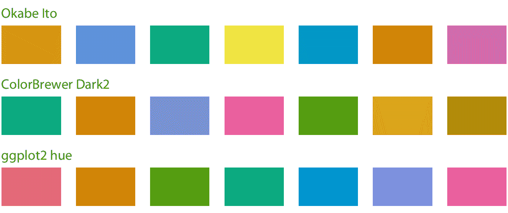
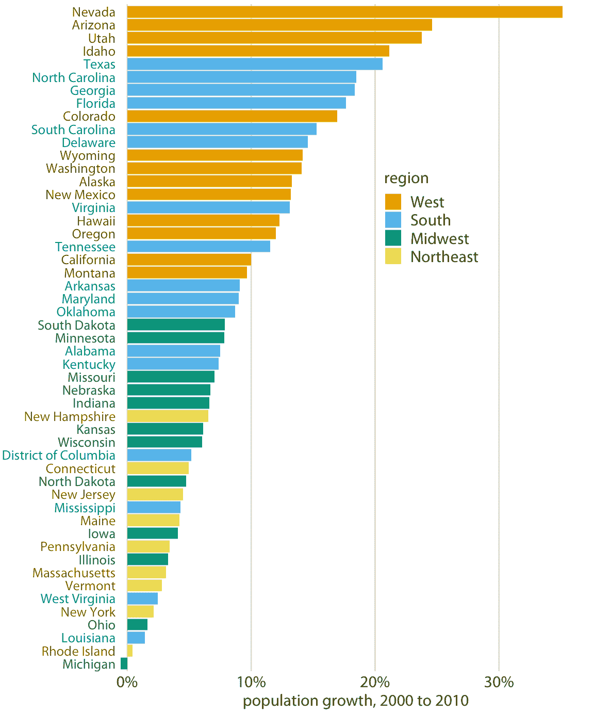
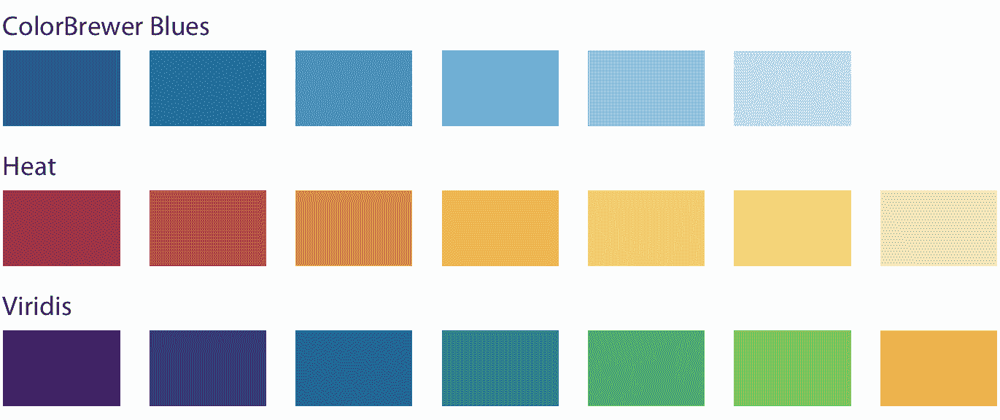
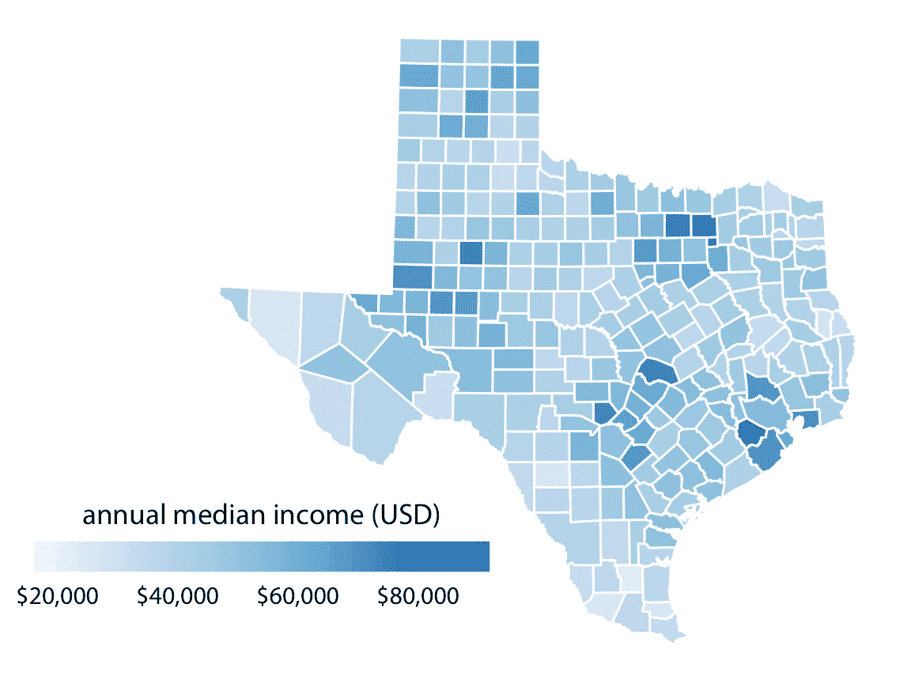
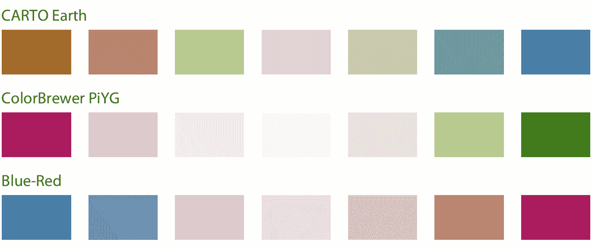
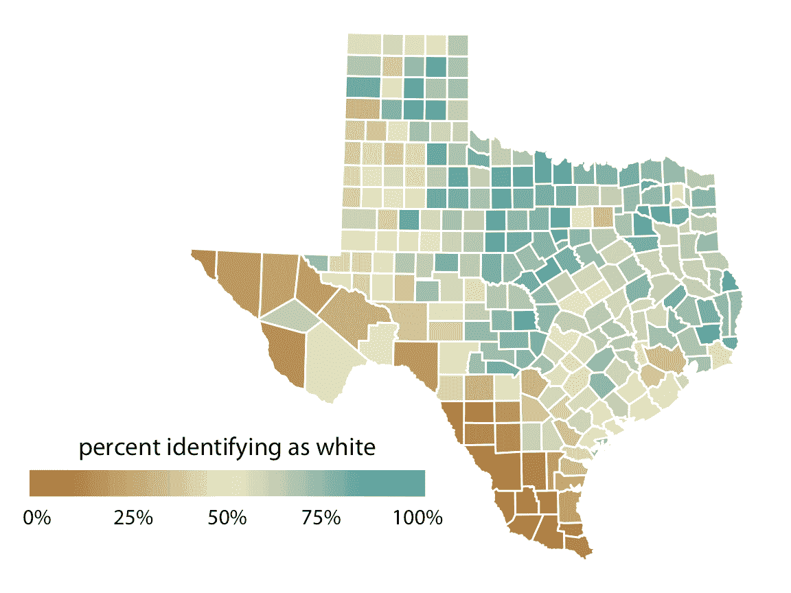
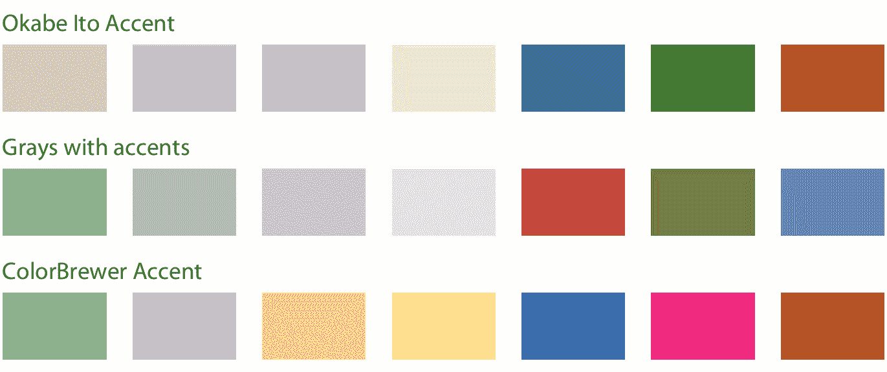
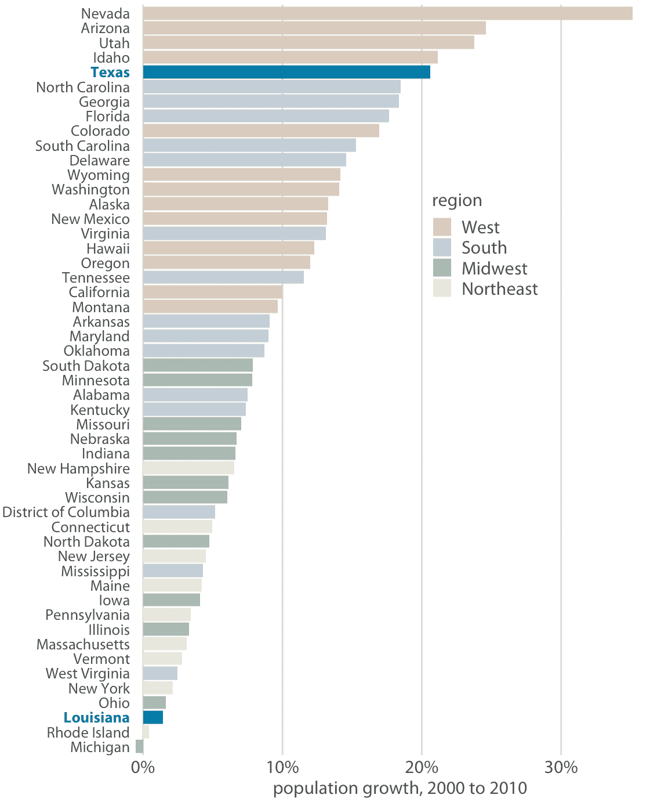
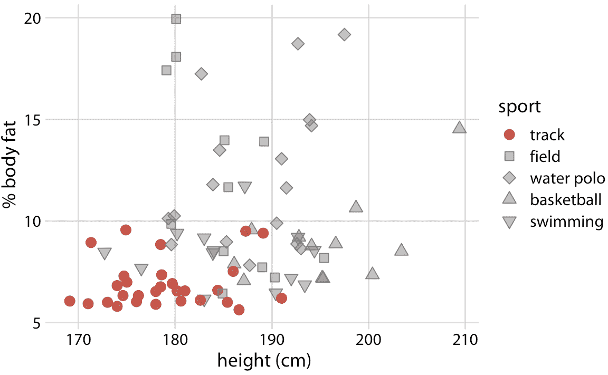

# 4 颜色刻度

> 原文： [4 Color scales](https://serialmentor.com/dataviz/color-basics.html)

> 校验：[飞龙](https://github.com/wizardforcel)

> 自豪地采用[谷歌翻译](https://translate.google.cn/)

数据可视化中的颜色有三个基本用例：（i）我们可以使用颜色来区分数据组; （ii）我们可以用颜色来表示数据值; （iii）我们可以使用颜色突出显示。我们使用的颜色类型以及我们使用它们的方式在这三种情况下完全不同。

## 4.1 作为区分的工具的颜色

我们经常使用颜色作为区分不具有内在顺序的离散项目或分组的手段，例如地图上的不同国家或某个产品的不同制造商。在这种情况下，我们使用定性颜色刻度。这样的刻度包含一组有限的特定颜色，选择这些颜色是为了看起来彼此明显不同，同时也彼此相同。第二个条件要求相对于其他颜色，不应该突出任何一种颜色。并且，颜色不应该产生顺序的印象，就像持续变亮的一系列颜色的情况一样。这些颜色会在被着色的物品之间产生明显的顺序，根据定义，它们没有顺序。

许多合适的定性颜色刻度很容易获得。图 4.1 显示了三个代表性的例子。特别是，ColorBrewer 项目提供了很好的定性颜色刻度选择，包括相当浅和相当深的颜色（Brewer 2017）。



图 4.1：定性颜色刻度示例。 Okabe Ito 刻度是本书（Okabe 和 Ito 2008）中使用的默认刻度。 ColorBrewer Dark2 刻度由 ColorBrewer 项目（Brewer 2017）提供。 ggplot2 色调刻度是广泛使用的绘图软件 ggplot2 中的默认定性刻度。

作为我们如何使用定性颜色刻度的一个例子，请考虑图 4.2 。它显示了美国各州 2000 年至 2010 年的人口增长率。我按照人口增长的顺序排列了各州，我按地理区域对它们进行了着色。这种着色突出表明，同一地区的国家经历了类似的人口增长。特别是，西部和南部各州人口增长最多，而中西部和东北部各州增长较少。



图 4.2：2000 年至 2010 年美国的人口增长。西部和南部的州增长最大，而中西部和东北部的州增长小得多，甚至在密歇根州也有所下降。数据来源：美国人口普查局

## 4.2 代表数据值的颜色

颜色也可用于表示数据值，例如收入，温度或速度。在这种情况下，我们使用顺序颜色刻度。这样的刻度包含一系列颜色，其清楚地指示（i）哪些值大于或小于哪些值，以及（ii）两个特定值彼此有多远。第二点意味着需要感知颜色刻度在其整个范围内均匀变化。

顺序刻度可以基于单个色调（例如，从深蓝色到浅蓝色）或基于多个色调（例如，从深红色到浅黄色）（图 4.3 ）。多色调刻度倾向于遵循自然界中可见的颜色渐变，例如深红色，绿色或蓝色至浅黄色，或深紫色至浅绿色。相反，例如深黄色至浅蓝色，看起来不自然，并没有生成有用的顺序刻度。



图 4.3：连续颜色刻度示例。 ColorBrewer Blues 刻度是一种单色刻度，从深蓝到浅蓝不等。 Heat 和 Viridis 刻度是多色调刻度，分别从深红色到浅黄色，从深蓝色到绿色到浅黄色。

当我们想要显示数据值如何跨地理区域变化时，将数据值表示为颜色特别有用。在这种情况下，我们可以绘制地理区域的地图，并按照数据值对它们进行着色。这种地图称为等值线。图 4.4 显示了一个示例，其中我将德克萨斯州每个县的年收入中位数映射到这些县的地图上。



图 4.4：德克萨斯州的年收入中位数。德克萨斯州主要城市地区的收入中位数最高，特别是在休斯顿和达拉斯附近。西德克萨斯州的 Loving 县没有收入中位数估计值，因此该县显示为灰色。数据来源：2015 年的美国五年社区调查

在某些情况下，我们需要将数据值的偏差可视化为相对于中性点的两个方向之一。一个简单的例子是包含正数和负数的数据集。我们可能想要使用不同颜色来显示它们，这样就可以立即看出一个值是正还是负，以及它在任何一个方向上到零的距离。在这种情况下，适当的颜色刻度是发散颜色刻度。我们可以将一个不同的刻度视为两个连续的刻度，它们在一个共同的中点处拼接在一起，通常用浅色来表示（图 4.5 ）。发散刻度需要平衡，以便从中心的浅色到外侧的深色的渐变，在任一方向上大致相同。否则，数据值的感知幅度将取决于它是否高于或低于中点值。



图 4.5：发散颜色刻度示例。发散的刻度可以被认为是在共同的中点颜色处拼接在一起的两个连续刻度。发散刻度的常见颜色选择包括棕色至蓝绿色，粉红色至黄绿色以及蓝色至红色。

作为发散颜色刻度的示例应用，请考虑图 4.6 ，其显示德克萨斯州的县的白人百分比。尽管百分比总是一个正数，但这里的发散刻度是合理的，因为 50% 是一个有意义的中点值。高于 50% 的数字表明白人占多数，低于 50% 的数字表示相反。可视化清楚地显示了哪些县白人占多数，哪些县他们是少数，以及哪些县中白人和非白人以大致相等的比例出现。



图 4.6：德克萨斯州的县的白人的百分比。白人在德克萨斯州北部和东部占多数，但在德克萨斯州南部或西部则不然。数据来源：2010 年美国十年普查

## 4.3 作为突出显示的工具的颜色

颜色也可以是突出显示数据中特定元素的有效工具。数据集中可能存在特定的类别或值，其中包含有关我们想要讲述的故事的关键信息，我们可以通过向读者强调相关的图形元素来强调故事。实现强调的一个简单方法是，将这些图形元素用一种颜色或一组颜色着色，这些颜色可以生动地突出图形的其他部分。这种效果可以通过强调色刻度来实现，这些颜色刻度包含一组柔和颜色和一组匹配的更强，更暗和/或更柔和的颜色（图 4.7）。



图 4.7：强调色刻度示例，每个都有四种基色和三种强调色。强调色刻度可以通过几种不同的方式得出：（顶部）我们可以采用现有的颜色刻度（例如，Okabe Ito 刻度，图 4.1 ）并使某些颜色变淡和/或部分去饱和，同时使其他颜色变暗；（中）我们可以采用灰度值并将它们与颜色配对; （下）我们可以使用现有的强调色刻度，例如 ColorBrewer 项目中的那个。

作为相同数据如何使用不同着色方法支持不同故事的示例，我创建了图 4.2 的变体，现在我突出显示两个特定州，Texas 和 Louisiana（图 4.8 ）。这两个州都在南方，他们是近邻，然而一个州（德克萨斯州）是美国增长速度第五快的州，而另一个州是 2000 年至 2010 年间增长最慢的州。



图 4.8：从 2000 年到 2010 年，两个邻近的南部州，德克萨斯州和路易斯安那州，经历了美国最高和最低的人口增长率，数据来源：美国人口普查局

使用强调色时，基线颜色不会引起注意，这一点至关重要。注意基线颜色是多么单调（图 4.8）。然而，它们很好地支持强调色。很容易犯下使用过于丰富多彩的基线颜色的错误，这样他们最终会争夺读者对强调色的注意力。但是，有一个简单的补救措施。只需删除图中所有元素的所有颜色，但突出显示的数据类别或点除外。图 4.9 中提供了该策略的一个示例。



图 4.9：田径运动员是参加流行运动的最矮和最瘦的男性职业运动员之一。数据来源：Telford and Cunningham（1991）

### 参考

```
Brewer, Cynthia A. 2017. “ColorBrewer 2.0. Color Advice for Cartography.” http://www.ColorBrewer.org.

Okabe, M., and K. Ito. 2008. “Color Universal Design (CUD): How to Make Figures and Presentations That Are Friendly to Colorblind People.” http://jfly.iam.u-tokyo.ac.jp/color/.

Telford, R. D., and R. B. Cunningham. 1991. “Sex, Sport, and Body-Size Dependency of Hematology in Highly Trained Athletes.” Medicine and Science in Sports and Exercise 23: 788–94.
```