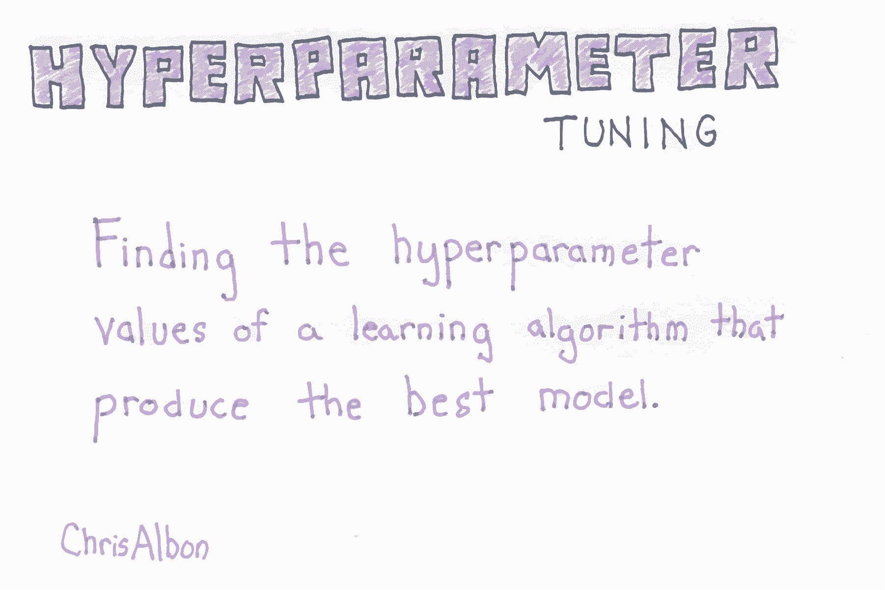
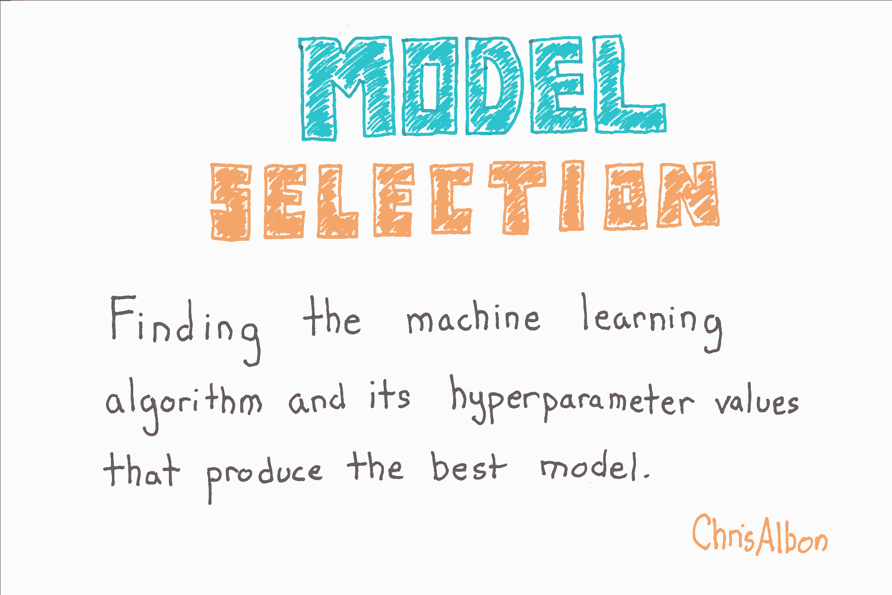

# 十、模型选择

> 作者：[Chris Albon](https://chrisalbon.com/)
> 
> 译者：[飞龙](https://github.com/wizardforcel)
> 
> 协议：[CC BY-NC-SA 4.0](http://creativecommons.org/licenses/by-nc-sa/4.0/)

## 在模型选择期间寻找最佳预处理步骤

在进行模型选择时，我们必须小心正确处理预处理。 首先，`GridSearchCV`使用交叉验证来确定哪个模型表现最好。 然而，在交叉验证中，我们假装作为测试集被留出的一折是不可见的，因此不适合一些预处理步骤（例如缩放或标准化）。 出于这个原因，我们无法预处理数据然后运行`GridSearchCV`。

其次，一些预处理方法有自己的参数，通常必须由用户提供。 通过在搜索空间中包括候选成分值，可以像对待任何想要搜索其他超参数一样对待它们。

```py
# 加载库
import numpy as np
from sklearn import datasets
from sklearn.feature_selection import SelectKBest
from sklearn.linear_model import LogisticRegression
from sklearn.model_selection import GridSearchCV
from sklearn.pipeline import Pipeline, FeatureUnion
from sklearn.decomposition import PCA
from sklearn.preprocessing import StandardScaler

# 设置随机种子
np.random.seed(0)

# 加载数据
iris = datasets.load_iris()
X = iris.data
y = iris.target
```

我们包括两个不同的预处理步骤：主成分分析和 k 最佳特征选择。

```py
# 创建组合预处理对象
preprocess = FeatureUnion([('pca', PCA()), ("kbest", SelectKBest(k=1))])

# 创建流水线
pipe = Pipeline([('preprocess', preprocess), ('classifier', LogisticRegression())])

# 创建候选值空间
search_space = [{'preprocess__pca__n_components': [1, 2, 3],
                 'classifier__penalty': ['l1', 'l2'],
                 'classifier__C': np.logspace(0, 4, 10)}]

# 创建网格搜索
clf = GridSearchCV(pipe, search_space, cv=5, verbose=0, n_jobs=-1)

# 拟合网格搜索
best_model = clf.fit(X, y)

# 查看最佳超参数
print('Best Number Of Princpal Components:', best_model.best_estimator_.get_params()['preprocess__pca__n_components'])
print('Best Penalty:', best_model.best_estimator_.get_params()['classifier__penalty'])
print('Best C:', best_model.best_estimator_.get_params()['classifier__C'])

'''
Best Number Of Princpal Components: 3
Best Penalty: l1
Best C: 59.9484250319 
'''
```

## 使用网格搜索的超参数调优



```py
# 加载库
import numpy as np
from sklearn import linear_model, datasets
from sklearn.model_selection import GridSearchCV

# 加载数据
iris = datasets.load_iris()
X = iris.data
y = iris.target

# 创建逻辑回归
logistic = linear_model.LogisticRegression()

# 创建正则化惩罚空间
penalty = ['l1', 'l2']

# 创建正则化超参数空间
C = np.logspace(0, 4, 10)

# 创建超参数选项
hyperparameters = dict(C=C, penalty=penalty)

# 使用 5 折交叉验证创建网格搜索
clf = GridSearchCV(logistic, hyperparameters, cv=5, verbose=0)

# 拟合网格搜索
best_model = clf.fit(X, y)

# 查看最佳超参数
print('Best Penalty:', best_model.best_estimator_.get_params()['penalty'])
print('Best C:', best_model.best_estimator_.get_params()['C'])
'''
Best Penalty: l1
Best C: 7.74263682681 
'''

# 预测目标向量
best_model.predict(X)
'''
array([0, 0, 0, 0, 0, 0, 0, 0, 0, 0, 0, 0, 0, 0, 0, 0, 0, 0, 0, 0, 0, 0, 0,
       0, 0, 0, 0, 0, 0, 0, 0, 0, 0, 0, 0, 0, 0, 0, 0, 0, 0, 0, 0, 0, 0, 0,
       0, 0, 0, 0, 1, 1, 1, 1, 1, 1, 1, 1, 1, 1, 1, 1, 1, 1, 1, 1, 1, 1, 1,
       1, 2, 1, 1, 1, 1, 1, 1, 1, 1, 1, 1, 1, 1, 2, 1, 1, 1, 1, 1, 1, 1, 1,
       1, 1, 1, 1, 1, 1, 1, 1, 2, 2, 2, 2, 2, 2, 2, 2, 2, 2, 2, 2, 2, 2, 2,
       2, 2, 2, 2, 2, 2, 2, 2, 2, 2, 2, 2, 2, 2, 2, 2, 2, 2, 1, 2, 2, 2, 2,
       2, 2, 2, 2, 2, 2, 2, 2, 2, 2, 2, 2]) 
'''
```

## 使用随机搜索的超参数调优


```py
# 加载库
from scipy.stats import uniform
from sklearn import linear_model, datasets
from sklearn.model_selection import RandomizedSearchCV

# 加载数据
iris = datasets.load_iris()
X = iris.data
y = iris.target

# 创建逻辑回归
logistic = linear_model.LogisticRegression()

# 创建正则化惩罚空间
penalty = ['l1', 'l2']

# 使用均匀分布创建正则化超参数分布
C = uniform(loc=0, scale=4)

# 创建超参数选项
hyperparameters = dict(C=C, penalty=penalty)

# 使用 5 折交叉验证和 100 个迭代
clf = RandomizedSearchCV(logistic, hyperparameters, random_state=1, n_iter=100, cv=5, verbose=0, n_jobs=-1)

# 拟合随机搜索
best_model = clf.fit(X, y)

# 查看最佳超参数
print('Best Penalty:', best_model.best_estimator_.get_params()['penalty'])
print('Best C:', best_model.best_estimator_.get_params()['C'])
'''
Best Penalty: l1
Best C: 1.66808801881 
'''

# 预测目标向量
best_model.predict(X)
'''
array([0, 0, 0, 0, 0, 0, 0, 0, 0, 0, 0, 0, 0, 0, 0, 0, 0, 0, 0, 0, 0, 0, 0,
       0, 0, 0, 0, 0, 0, 0, 0, 0, 0, 0, 0, 0, 0, 0, 0, 0, 0, 0, 0, 0, 0, 0,
       0, 0, 0, 0, 1, 1, 1, 1, 1, 1, 1, 1, 1, 1, 1, 1, 1, 1, 1, 1, 1, 1, 1,
       1, 2, 1, 1, 1, 1, 1, 1, 1, 1, 1, 1, 1, 1, 2, 2, 1, 1, 1, 1, 1, 1, 1,
       1, 1, 1, 1, 1, 1, 1, 1, 2, 2, 2, 2, 2, 2, 2, 2, 2, 2, 2, 2, 2, 2, 2,
       2, 2, 2, 2, 2, 2, 2, 2, 2, 2, 2, 2, 2, 2, 1, 2, 2, 2, 1, 2, 2, 2, 2,
       2, 2, 2, 2, 2, 2, 2, 2, 2, 2, 2, 2]) 
'''
```

## 使用网格搜索的模型选择




```py
# 加载库
import numpy as np
from sklearn import datasets
from sklearn.linear_model import LogisticRegression
from sklearn.ensemble import RandomForestClassifier
from sklearn.model_selection import GridSearchCV
from sklearn.pipeline import Pipeline

# 设置随机种子
np.random.seed(0)

# 加载数据
iris = datasets.load_iris()
X = iris.data
y = iris.target
```

请注意，我们包括需要搜索的多个可能的学习算法和多个可能的超参数值。

```py
# 创建流水线
pipe = Pipeline([('classifier', RandomForestClassifier())])

# 创建候选学习算法和它们的超参数的空间
search_space = [{'classifier': [LogisticRegression()],
                 'classifier__penalty': ['l1', 'l2'],
                 'classifier__C': np.logspace(0, 4, 10)},
                {'classifier': [RandomForestClassifier()],
                 'classifier__n_estimators': [10, 100, 1000],
                 'classifier__max_features': [1, 2, 3]}]

# 创建网格搜索
clf = GridSearchCV(pipe, search_space, cv=5, verbose=0)

# 拟合网格搜索
best_model = clf.fit(X, y)

# 查看最佳模型
best_model.best_estimator_.get_params()['classifier']
'''
LogisticRegression(C=7.7426368268112693, class_weight=None, dual=False,
          fit_intercept=True, intercept_scaling=1, max_iter=100,
          multi_class='ovr', n_jobs=1, penalty='l1', random_state=None,
          solver='liblinear', tol=0.0001, verbose=0, warm_start=False) 
'''

# 预测目标向量
best_model.predict(X)
'''
array([0, 0, 0, 0, 0, 0, 0, 0, 0, 0, 0, 0, 0, 0, 0, 0, 0, 0, 0, 0, 0, 0, 0,
       0, 0, 0, 0, 0, 0, 0, 0, 0, 0, 0, 0, 0, 0, 0, 0, 0, 0, 0, 0, 0, 0, 0,
       0, 0, 0, 0, 1, 1, 1, 1, 1, 1, 1, 1, 1, 1, 1, 1, 1, 1, 1, 1, 1, 1, 1,
       1, 2, 1, 1, 1, 1, 1, 1, 1, 1, 1, 1, 1, 1, 2, 1, 1, 1, 1, 1, 1, 1, 1,
       1, 1, 1, 1, 1, 1, 1, 1, 2, 2, 2, 2, 2, 2, 2, 2, 2, 2, 2, 2, 2, 2, 2,
       2, 2, 2, 2, 2, 2, 2, 2, 2, 2, 2, 2, 2, 2, 2, 2, 2, 2, 1, 2, 2, 2, 2,
       2, 2, 2, 2, 2, 2, 2, 2, 2, 2, 2, 2]) 
'''
```

## 带有参数选项的流水线


```py
# 导入所需的包
import numpy as np
from sklearn import linear_model, decomposition, datasets
from sklearn.pipeline import Pipeline
from sklearn.model_selection import GridSearchCV, cross_val_score
from sklearn.preprocessing import StandardScaler

# 加载乳腺癌数据集
dataset = datasets.load_breast_cancer()

# 从数据集特征中创建 X
X = dataset.data

# 从数据集目标中创建 y
y = dataset.target

# 创建缩放器对象
sc = StandardScaler()

# 创建 PCA 对象
pca = decomposition.PCA()

# 创建逻辑回归对象，带有 L2 惩罚
logistic = linear_model.LogisticRegression()

# 创建三步流水线。首先，标准化数据。
# 其次，使用 PCA 转换数据。
# 然后在数据上训练逻辑回归。
pipe = Pipeline(steps=[('sc', sc), 
                       ('pca', pca), 
                       ('logistic', logistic)])

# 创建 1 到 30 的一列整数（X + 1，特征序号）
n_components = list(range(1,X.shape[1]+1,1))

# 创建正则化参数的一列值
C = np.logspace(-4, 4, 50)

# 为正则化乘法创建一列选项
penalty = ['l1', 'l2']

# 为所有参数选项创建字典 
# 注意，你可以使用 '__' 来访问流水线的步骤的参数
parameters = dict(pca__n_components=n_components, 
                  logistic__C=C,
                  logistic__penalty=penalty)

# 创建网格搜索对象
clf = GridSearchCV(pipe, parameters)

# 拟合网格搜索
clf.fit(X, y)

# 查看超参数
print('Best Penalty:', clf.best_estimator_.get_params()['logistic__penalty'])
print('Best C:', clf.best_estimator_.get_params()['logistic__C'])
print('Best Number Of Components:', clf.best_estimator_.get_params()['pca__n_components'])

# 使用 3 折交叉验证拟合网格搜索
cross_val_score(clf, X, y)
```