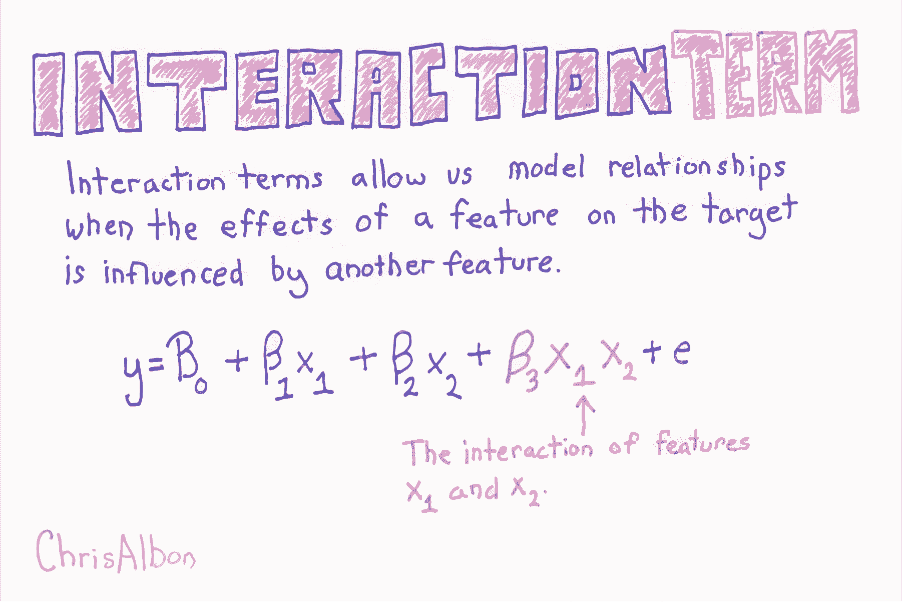
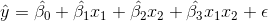
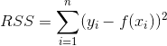
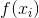
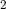
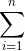
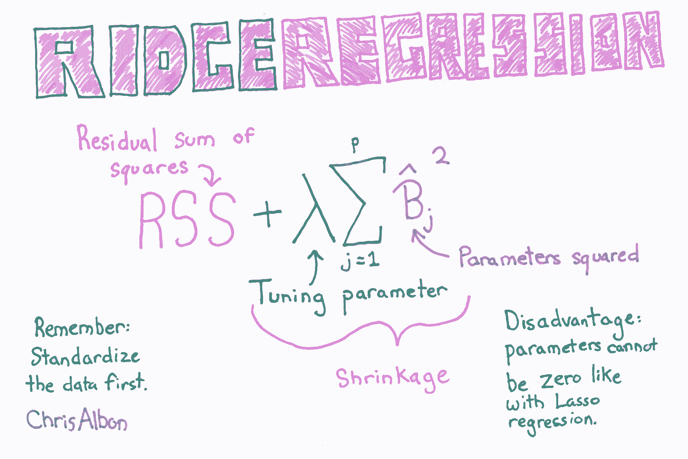
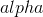

# 十一、线性回归

> 作者：[Chris Albon](https://chrisalbon.com/)
> 
> 译者：[飞龙](https://github.com/wizardforcel)
> 
> 协议：[CC BY-NC-SA 4.0](http://creativecommons.org/licenses/by-nc-sa/4.0/)

## 添加交互项



```py
# 加载库
from sklearn.linear_model import LinearRegression
from sklearn.datasets import load_boston
from sklearn.preprocessing import PolynomialFeatures
import warnings

# 屏蔽警告
warnings.filterwarnings(action="ignore", module="scipy", message="^internal gelsd")

# 加载只有两个特征的数据
boston = load_boston()
X = boston.data[:,0:2]
y = boston.target
```

通过添加一个新的特征，它是交互特征的乘积，来添加交互项。



其中  和  分别是两个特征的值， 表示两者之间的交互。使用 scikit-learn 的`PolynomialFeatures`，来为所有特征组合创建交互术项会很有用。 然后，我们可以使用模型选择策略，来识别产生最佳模型的特征和交互项的组合。

```py
# 创建交互项（非多项式特征）
interaction = PolynomialFeatures(degree=3, include_bias=False, interaction_only=True)
X_inter = interaction.fit_transform(X)

# 创建线性回归
regr = LinearRegression()

# 拟合线性回归
model = regr.fit(X_inter, y)
```

## 创建交互特征

```py
# 加载库
from sklearn.preprocessing import PolynomialFeatures
import numpy as np

# 创建特征矩阵
X = np.array([[2, 3], 
              [2, 3], 
              [2, 3]])

# 创建 PolynomialFeatures 对象，它的 interaction_only 设为 True
interaction = PolynomialFeatures(degree=2, interaction_only=True, include_bias=False)

# 转换特征矩阵
interaction.fit_transform(X)
'''
array([[ 2.,  3.,  6.],
       [ 2.,  3.,  6.],
       [ 2.,  3.,  6.]]) 
'''
```

## Lasso 回归的 Alpha 的效果

我们通常希望执行一个称为[正则化](https://en.wikipedia.org/wiki/Regularization)的过程，其中我们会惩罚模型中的系数数量，以便仅保留最重要的系数。 当你拥有带有 100,000 多个系数的数据集时，这一点尤为重要。

[Lasso 回归](https://en.wikipedia.org/wiki/Lasso_(statistics))是正则化的常用建模技术。 它背后的数学非常有趣，但实际上，你需要知道的是，Lasso 回归带有一个参数`alpha`，而`alpha`越高，大多数特征系数越会为零。

也就是说，当`alpha`为`0`时，Lasso 回归产生与线性回归相同的系数。 当`alpha`非常大时，所有系数都为零。

在本教程中，我运行三个 Lasso 回归，具有不同的`alpha`值，并显示对系数结果的影响。

```py
from sklearn.linear_model import Lasso
from sklearn.preprocessing import StandardScaler
from sklearn.datasets import load_boston
import pandas as pd

boston = load_boston()
scaler = StandardScaler()
X = scaler.fit_transform(boston["data"])
Y = boston["target"]
names = boston["feature_names"]

# 创建函数 lasso
def lasso(alphas):
    '''
    接受 alpha 列表。输出数据帧，包含每个 alpha 的 Lasso 回归的系数。
    '''
    # 创建空数据帧
    df = pd.DataFrame()

    # 创建特征名称列
    df['Feature Name'] = names

    # 对于每个列表中的 alpha 值，
    for alpha in alphas:
        # 创建这个 alpha 值的 laaso 回归，
        lasso = Lasso(alpha=alpha)

        # 拟合 lasso 回归
        lasso.fit(X, Y)

        # 为这个 alpha 值创建列名称
        column_name = 'Alpha = %f' % alpha

        # 创建系数列
        df[column_name] = lasso.coef_

    # 返回数据帧
    return df

# 调用函数 lasso
lasso([.0001, .5, 10])
```

|  | Feature Name | Alpha = 0.000100 | Alpha = 0.500000 | Alpha = 10.000000 |
| --- | --- | --- | --- | --- |
| 0 | CRIM | -0.920130 | -0.106977 | -0.0 |
| 1 | ZN | 1.080498 | 0.000000 | 0.0 |
| 2 | INDUS | 0.142027 | -0.000000 | -0.0 |
| 3 | CHAS | 0.682235 | 0.397399 | 0.0 |
| 4 | NOX | -2.059250 | -0.000000 | -0.0 |
| 5 | RM | 2.670814 | 2.973323 | 0.0 |
| 6 | AGE | 0.020680 | -0.000000 | -0.0 |
| 7 | DIS | -3.104070 | -0.169378 | 0.0 |
| 8 | RAD | 2.656950 | -0.000000 | -0.0 |
| 9 | TAX | -2.074110 | -0.000000 | -0.0 |
| 10 | PTRATIO | -2.061921 | -1.599574 | -0.0 |
| 11 | B | 0.856553 | 0.545715 | 0.0 |
| 12 | LSTAT | -3.748470 | -3.668884 | -0.0 |

请注意，随着alpha值的增加，更多特征的系数为 0。

# Lasso 回归

```py
# 加载库
from sklearn.linear_model import Lasso
from sklearn.datasets import load_boston
from sklearn.preprocessing import StandardScaler

# 加载数据
boston = load_boston()
X = boston.data
y = boston.target

# 标准化特征
scaler = StandardScaler()
X_std = scaler.fit_transform(X)
```

超参数  让我们控制我们对系数的惩罚程度，更高的  值创建更简单的模型。 的理想值应该像任何其他超参数一样调整。 在 scikit-learn中，使用`alpha`参数设置 。

```py
# 创建带有某个 alpha 值的 Lasso
regr = Lasso(alpha=0.5)

# 拟合 Lasso 回归
model = regr.fit(X_std, y)
```

## 线性回归

来源：[scikit-learn](http://scikit-learn.org/stable/auto_examples/linear_model/plot_ols.html#example-linear-model-plot-ols-py)，[DrawMyData](http://robertgrantstats.co.uk/drawmydata.html).

本教程的目的是，简要介绍机器学习中使用的统计模型构建的逻辑。如果你想更加了解本教程背后的理论，请查看[统计学习导论](https://www.amazon.com/Introduction-Statistical-Learning-Applications-Statistics/dp/1461471370)。

让我们开始吧。

```py
import pandas as pd
from sklearn import linear_model
import random
import numpy as np
%matplotlib inline
```

添加这些库后，让我们加载数据集（数据集可以在他的站点的 GitHub 仓库中找到）。

```py
# 加载数据
df = pd.read_csv('../data/simulated_data/battledeaths_n300_cor99.csv')

# 打乱数据的行（这是必要的，
# 仅仅由于我使用 DrawMyData 创建数据的方式。真正的分析中通常不需要
df = df.sample(frac=1)
```

让我们看一下数据的前几行，以便了解它。

```py
# 查看数据的前几行
df.head()
```

|  | friendly_battledeaths | enemy_battledeaths |
| --- | --- | --- |
| 7 | 8.2051 | 9.6154 |
| 286 | 88.7179 | 86.1538 |
| 164 | 14.3590 | 8.8462 |
| 180 | 38.9744 | 36.5385 |
| 89 | 93.0769 | 93.0769 |

现在让我们绘制数据，以便我们可以看到它的结构。

```py
# 绘制两个变量，彼此对照
df.plot(x='friendly_battledeaths', y='enemy_battledeaths', kind='scatter')

# <matplotlib.axes._subplots.AxesSubplot at 0x1145cdb00> 
```


现在是真正的工作了。 为了判断我们的模型有多好，我们需要一些东西来测试它。 我们可以使用称为交叉验证的技术来实现这一目标。 交叉验证可以变得更加复杂和强大，但在这个例子中，我们将使用这种技术的最简单版本。

### 步骤

1.  将数据集划分为两个数据集：我们将用于训练模型的“训练”数据集，和我们将用于判断该模型准确率的“测试”数据集。
2.  在“训练”数据上训练模型。
3.  将该模型应用于测试数据的`X`变量，创建模型对测试数据`Y`的猜测。
4.  比较模型对测试数据`Y`的预测，与实际测试数据`Y`的接近程度。

```py
# 创建我们的预测器/自变量
# 以及我们的响应/因变量
X = df['friendly_battledeaths']
y = df['enemy_battledeaths']

# 从前 30 个观测中创建测试数据
X_test = X[0:30].reshape(-1,1)
y_test = y[0:30]

# 从剩余的观测中创建我们的训练数据
X_train = X[30:].reshape(-1,1)
y_train = y[30:]
```

让我们使用我们的训练数据训练模型。

```py
# 创建 OLS 回归对象
ols = linear_model.LinearRegression()

# 使用训练数据来训练模型
model = ols.fit(X_train, y_train)
```

以下是模型的一些基本输出，特别是系数和 R 方得分。

```py
# 查看训练模型的系数
model.coef_

# array([ 0.97696721]) 

# 查看 R 方得分
model.score(X_test, y_test)

# 0.98573393818904709 
```

现在我们已经使用训练数据，来训练一个名为`model`的模型，我们可以将它应用于测试数据的`X`，来预测测试数据的`Y`。

以前我们使用`X_train`和`y_train`来训练线性回归模型，我们将其存储为一个名为`model`的变量。 代码`model.predict(X_test)`将训练好的模型应用于`X_test`数据，这是模型以前从未见过的数据，来生成`Y`的预测值。

只需运行代码即可轻松看到：

```py
# 在 X_test 上运行模型并显示前五个结果
list(model.predict(X_test)[0:5])
'''
[7.4633347104887342,
 86.121700007313791,
 13.475493202059415,
 37.523931774900845,
 90.380300060086256] 
'''
```

这个数组是模型对测试数据`Y`值的最佳猜测。 将它们与实际测试数据`Y`值进行比较：

```py
# 查看前五个测试 Y 值
list(y_test)[0:5]
'''
[9.6153999999999993,
 86.153800000000004,
 8.8461999999999996,
 36.538499999999999,
 93.076899999999995] 
'''
```

模型的预测值与实际值之间的差异，是我们判断模型的准确率的方式，因为完全准确的模型没有残差。

但是，要判断模型，我们需要一个可用作度量的统计量（数字）。 我们希望这个度量能够捕获数据中所有观测的预测值与实际值之间的差异。

用于量化`Y`的最常见统计量是**残差平方和**：



不要让数学符号吓到：

*    是我们训练的模型：`model.predict(X_test)`
*    是测试数据的`y`：`y_test`
*    是指数：`**2`
*    是求和：`.sum()`

在残差的平方和中，对于每个观测，我们找到模型的预测`Y`和实际`Y`值之间的差异，然后将该差异平方来使所有值为正。 然后我们将所有这些平方差加在一起得到一个数字。 最终结果是一个统计量，表示模型的预测与实际值的距离。

```py
# 将我们使用训练数据创建的模型
# 应用于测试数据，并计算RSS。
((y_test - model.predict(X_test)) **2).sum()

# 313.6087355571951 
```

注意：你还可以使用均方差（MSE），它是 RSS 除以自由度。 但我发现用 RSS 来思考是有帮助的。

```py
# 计算 MSE
np.mean((model.predict(X_test) - y_test) **2)

# 10.45362451857317 
```

## Sklearn 线性回归

```py
# 加载库
from sklearn.linear_model import LinearRegression
from sklearn.datasets import load_boston
import warnings

# 屏蔽警告
warnings.filterwarnings(action="ignore", module="scipy", message="^internal gelsd")

# 加载数据
boston = load_boston()
X = boston.data
y = boston.target

# 创建线性回归
regr = LinearRegression()

# 拟合线性回归
model = regr.fit(X, y)

# 查看截距（偏差）
model.intercept_

# 36.491103280361038 

# 查看特征系数（权重）
model.coef_

'''
array([ -1.07170557e-01,   4.63952195e-02,   2.08602395e-02,
         2.68856140e+00,  -1.77957587e+01,   3.80475246e+00,
         7.51061703e-04,  -1.47575880e+00,   3.05655038e-01,
        -1.23293463e-02,  -9.53463555e-01,   9.39251272e-03,
        -5.25466633e-01]) 
'''
```

# 岭回归



```py
# 加载库
from sklearn.linear_model import Ridge
from sklearn.datasets import load_boston
from sklearn.preprocessing import StandardScaler

# 加载数据
boston = load_boston()
X = boston.data
y = boston.target

# 标准化特征
scaler = StandardScaler()
X_std = scaler.fit_transform(X)
```

超参数  让我们控制我们对系数的惩罚程度，更高的  值创建更简单的模型。 的理想值应该像任何其他超参数一样调整。 在 scikit-learn中，使用`alpha`参数设置 。

```py
# 创建带有 alpha 值的岭回归
regr = Ridge(alpha=0.5)

# 拟合岭回归
model = regr.fit(X_std, y)
```

# 为岭回归选择最佳的 alpha 值

```py
# 加载库
from sklearn.linear_model import RidgeCV
from sklearn.datasets import load_boston
from sklearn.preprocessing import StandardScaler

# 加载数据
boston = load_boston()
X = boston.data
y = boston.target
```

注意：因为在线性回归中，系数的值由特征的尺度部分确定，并且在正则化的模型中，所有系数加在一起，我们必须确保在训练之前将特征标准化。

```py
# 标准化特征
scaler = StandardScaler()
X_std = scaler.fit_transform(X)

# 创建带有三个可能 alpha 值的岭回归
regr_cv = RidgeCV(alphas=[0.1, 1.0, 10.0])
```

scikit-learn 包含`RidgeCV`方法，允许我们为  选择理想值：

```py
# 拟合岭回归
model_cv = regr_cv.fit(X_std, y)

# 查看 alpha
model_cv.alpha_

# 1.0 
```