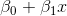
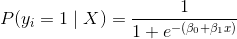
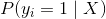
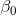

# 十二、逻辑回归

> 作者：[Chris Albon](https://chrisalbon.com/)
> 
> 译者：[飞龙](https://github.com/wizardforcel)
> 
> 协议：[CC BY-NC-SA 4.0](http://creativecommons.org/licenses/by-nc-sa/4.0/)

## C 超参数快速调优

有时，学习算法的特征使我们能够比蛮力或随机模型搜索方法更快地搜索最佳超参数。

scikit-learn 的`LogisticRegressionCV`方法包含一个参数`C`。 如果提供了一个列表，`C`是可供选择的候选超参数值。 如果提供了一个整数，`C`的这么多个候选值，将从 0.0001 和 10000 之间的对数标度（`C`的合理值范围）中提取。

```py
# 加载库
from sklearn import linear_model, datasets

# 加载数据
iris = datasets.load_iris()
X = iris.data
y = iris.target

# 创建逻辑回归的交叉验证
clf = linear_model.LogisticRegressionCV(Cs=100)

# 训练模型
clf.fit(X, y)

'''
LogisticRegressionCV(Cs=100, class_weight=None, cv=None, dual=False,
           fit_intercept=True, intercept_scaling=1.0, max_iter=100,
           multi_class='ovr', n_jobs=1, penalty='l2', random_state=None,
           refit=True, scoring=None, solver='lbfgs', tol=0.0001, verbose=0) 
'''
```

# 在逻辑回归中处理不平衡类别

像 scikit-learn 中的许多其他学习算法一样，`LogisticRegression`带有处理不平衡类的内置方法。 如果我们有高度不平衡的类，并且在预处理期间没有解决它，我们可以选择使用`class_weight`参数来对类加权，确保我们拥有每个类的平衡组合。 具体来说，`balanced`参数会自动对类加权，与其频率成反比：


其中  是类  的权重， 是观察数， 是类  中的观察数， 是类的总数。

```py
# 加载库
from sklearn.linear_model import LogisticRegression
from sklearn import datasets
from sklearn.preprocessing import StandardScaler
import numpy as np

# 加载数据
iris = datasets.load_iris()
X = iris.data
y = iris.target

# 通过移除前 40 个观测，使类高度不均衡
X = X[40:,:]
y = y[40:]

# 创建目标向量，如果表示类别是否为 0
y = np.where((y == 0), 0, 1)

# 标准化特征
scaler = StandardScaler()
X_std = scaler.fit_transform(X)

# 创建决策树分类器对象
clf = LogisticRegression(random_state=0, class_weight='balanced')

# 训练模型
model = clf.fit(X_std, y)
```

## 逻辑回归

尽管其名称中存在“回归”，但逻辑回归实际上是广泛使用的二分类器（即，目标向量只有两个值）。 在逻辑回归中，线性模型（例如 ）包含在 logit（也称为 sigmoid）函数中，，满足：



其中  是第  个观测的目标值  为 1 的概率， 是训练数据， 和  是要学习的参数， 是自然常数。

```py
# 加载库
from sklearn.linear_model import LogisticRegression
from sklearn import datasets
from sklearn.preprocessing import StandardScaler

# 加载只有两个类别的数据
iris = datasets.load_iris()
X = iris.data[:100,:]
y = iris.target[:100]

# 标准化特征
scaler = StandardScaler()
X_std = scaler.fit_transform(X)

# 创建逻辑回归对象
clf = LogisticRegression(random_state=0)

# 训练模型
model = clf.fit(X_std, y)

# 创建新的观测
new_observation = [[.5, .5, .5, .5]]

# 预测类别
model.predict(new_observation)

# array([1]) 

# 查看预测的概率
model.predict_proba(new_observation)

# array([[ 0.18823041,  0.81176959]]) 
```

# 大量数据上的逻辑回归

scikit-learn 的`LogisticRegression`提供了许多用于训练逻辑回归的技术，称为求解器。 大多数情况下，scikit-learn 会自动为我们选择最佳求解器，或警告我们，你不能用求解器做一些事情。 但是，我们应该注意一个特殊情况。

虽然精确的解释超出了本书的范围，但随机平均梯度下降使得我们在数据非常大时，比其他求解器更快训练模型。 但是，对特征尺度也非常敏感，标准化我们的特征尤为重要。 我们可以通过设置`solver ='sag'`来设置我们的学习算法来使用这个求解器。

```py
# 加载库
from sklearn.linear_model import LogisticRegression
from sklearn import datasets
from sklearn.preprocessing import StandardScaler

# 加载数据
iris = datasets.load_iris()
X = iris.data
y = iris.target

# 标准化特征
scaler = StandardScaler()
X_std = scaler.fit_transform(X)

# 创建使用 SAG 求解器的逻辑回归
clf = LogisticRegression(random_state=0, solver='sag')

# 训练模型
model = clf.fit(X_std, y)
```

# 带有 L1 正则化的逻辑回归

L1 正则化（也称为最小绝对误差）是数据科学中的强大工具。 有许多教程解释 L1 正则化，我不会在这里尝试这样做。 相反，本教程将展示正则化参数`C`对系数和模型精度的影响。

```py
import numpy as np
from sklearn.linear_model import LogisticRegression
from sklearn import datasets
from sklearn.model_selection import train_test_split
from sklearn.preprocessing import StandardScaler
```

本教程中使用的数据集是着名的[鸢尾花数据集](https://en.wikipedia.org/wiki/Iris_flower_data_set)。鸢尾花数据包含来自三种鸢尾花`y`，和四个特征变量`X`的 50 个样本。

数据集包含三个类别（三种鸢尾），但是为了简单起见，如果目标数据是二元的，则更容易。因此，我们将从数据中删除最后一种鸢尾。

```py
# 加载鸢尾花数据集
iris = datasets.load_iris()

# 从特征中创建 X
X = iris.data

# 从目标中创建 y
y = iris.target

# 重新生成变量，保留所有标签不是 2 的数据
X = X[y != 2]
y = y[y != 2]

# 查看特征
X[0:5]

'''
array([[ 5.1,  3.5,  1.4,  0.2],
       [ 4.9,  3\. ,  1.4,  0.2],
       [ 4.7,  3.2,  1.3,  0.2],
       [ 4.6,  3.1,  1.5,  0.2],
       [ 5\. ,  3.6,  1.4,  0.2]]) 
'''

# 查看目标数据
y

'''
array([0, 0, 0, 0, 0, 0, 0, 0, 0, 0, 0, 0, 0, 0, 0, 0, 0, 0, 0, 0, 0, 0, 0,
       0, 0, 0, 0, 0, 0, 0, 0, 0, 0, 0, 0, 0, 0, 0, 0, 0, 0, 0, 0, 0, 0, 0,
       0, 0, 0, 0, 1, 1, 1, 1, 1, 1, 1, 1, 1, 1, 1, 1, 1, 1, 1, 1, 1, 1, 1,
       1, 1, 1, 1, 1, 1, 1, 1, 1, 1, 1, 1, 1, 1, 1, 1, 1, 1, 1, 1, 1, 1, 1,
       1, 1, 1, 1, 1, 1, 1, 1]) 
'''

# 将数据拆分为测试和训练集
# 将 30% 的样本放入测试集
X_train, X_test, y_train, y_test = train_test_split(X, y, test_size=0.3, random_state=0)
```

因为正则化惩罚由系数的绝对值之和组成，所以我们需要缩放数据，使系数都基于相同的比例。

```py
# 创建缩放器对象
sc = StandardScaler()

# 将缩放器拟合训练数据，并转换
X_train_std = sc.fit_transform(X_train)

# 将缩放器应用于测试数据
X_test_std = sc.transform(X_test)
```

L1 的用处在于它可以将特征系数逼近 0，从而创建一种特征选择方法。 在下面的代码中，我们运行带有 L1 惩罚的逻辑回归四次，每次都减少了`C`的值。 我们应该期望随着`C`的减少，更多的系数变为 0。

```py
C = [10, 1, .1, .001]

for c in C:
    clf = LogisticRegression(penalty='l1', C=c)
    clf.fit(X_train, y_train)
    print('C:', c)
    print('Coefficient of each feature:', clf.coef_)
    print('Training accuracy:', clf.score(X_train, y_train))
    print('Test accuracy:', clf.score(X_test, y_test))
    print('')

'''
C: 10
Coefficient of each feature: [[-0.0855264  -3.75409972  4.40427765  0\.        ]]
Training accuracy: 1.0
Test accuracy: 1.0

C: 1
Coefficient of each feature: [[ 0\.         -2.28800472  2.5766469   0\.        ]]
Training accuracy: 1.0
Test accuracy: 1.0

C: 0.1
Coefficient of each feature: [[ 0\.         -0.82310456  0.97171847  0\.        ]]
Training accuracy: 1.0
Test accuracy: 1.0

C: 0.001
Coefficient of each feature: [[ 0\.  0\.  0\.  0.]]
Training accuracy: 0.5
Test accuracy: 0.5 
'''
```

注意，当`C`减小时，模型系数变小（例如，从`C = 10`时的`4.36276075`变为`C = 0.1`时的`0.0.97175097`），直到`C = 0.001`，所有系数都是零。 这是变得更加突出的，正则化惩罚的效果。

# OVR 逻辑回归

逻辑回归本身只是二分类器，这意味着它们无法处理具有两个类别以上的目标向量。 但是，逻辑回归有一些聪明的扩展来实现它。 在 One-VS-Rest（OVR）逻辑回归中，针对每个类别训练单独的模型，预测观测是否是该类（因此使其成为二分类问题）。 它假定每个分类问题（例如是不是类 0）是独立的。

```py
# 加载库
from sklearn.linear_model import LogisticRegression
from sklearn import datasets
from sklearn.preprocessing import StandardScaler

# 加载数据
iris = datasets.load_iris()
X = iris.data
y = iris.target

# 标准化特征
scaler = StandardScaler()
X_std = scaler.fit_transform(X)

# 创建 OVR 逻辑回归对象
clf = LogisticRegression(random_state=0, multi_class='ovr')

# 训练模型
model = clf.fit(X_std, y)

# 创建新的观测
new_observation = [[.5, .5, .5, .5]]

# 预测类别
model.predict(new_observation)

# array([2]) 

# 查看预测概率
model.predict_proba(new_observation)

# array([[ 0.0829087 ,  0.29697265,  0.62011865]]) 
```