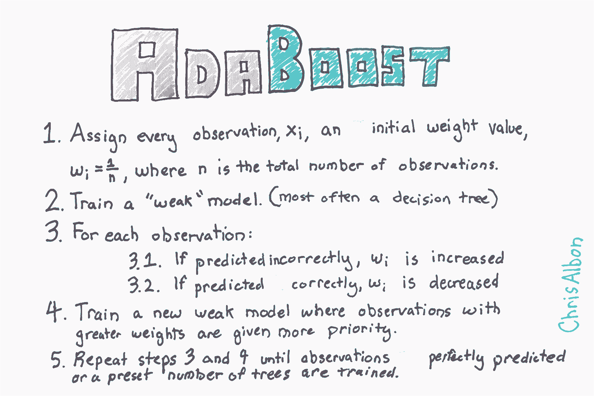
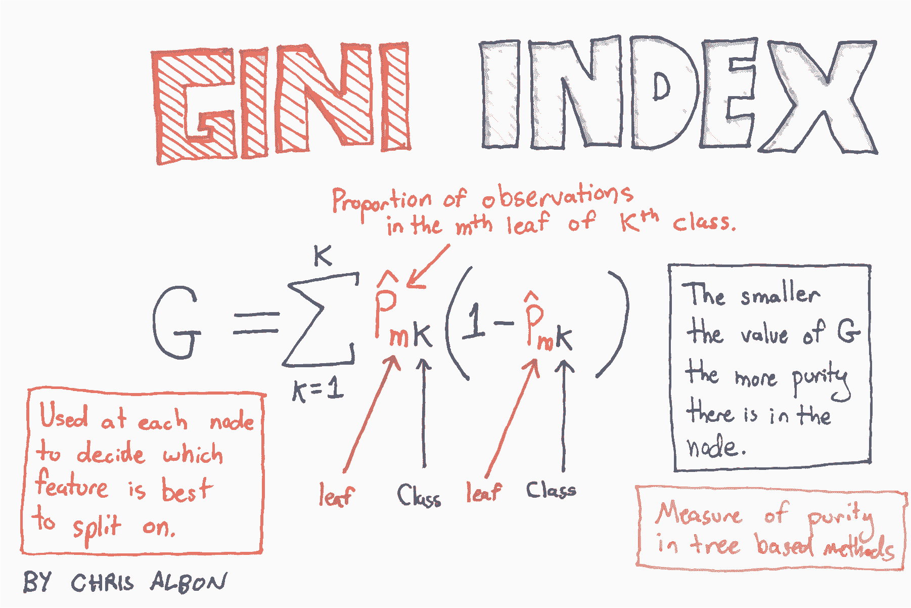
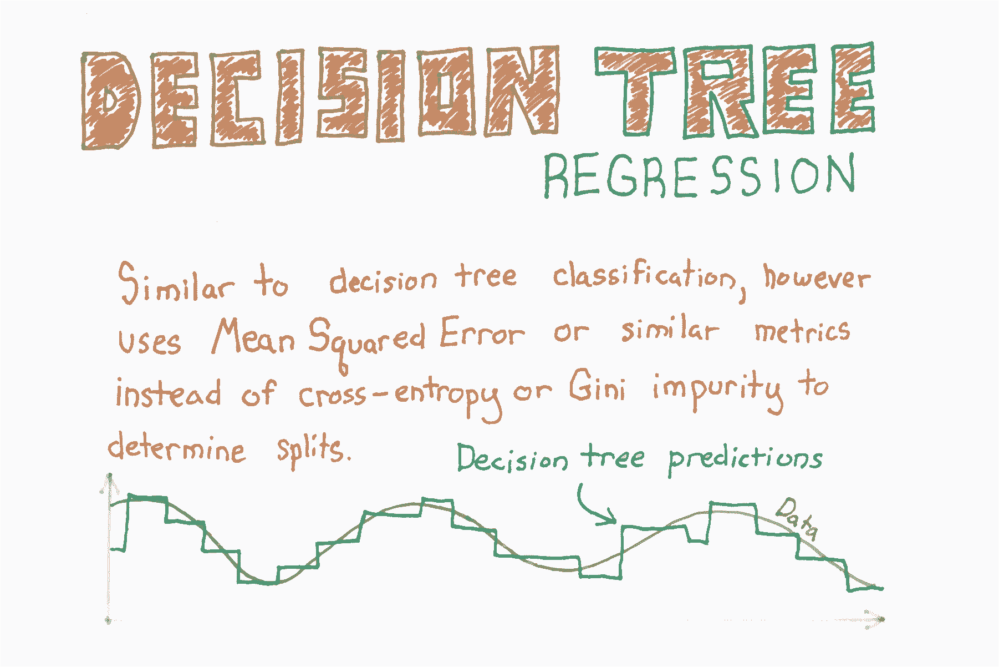
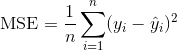
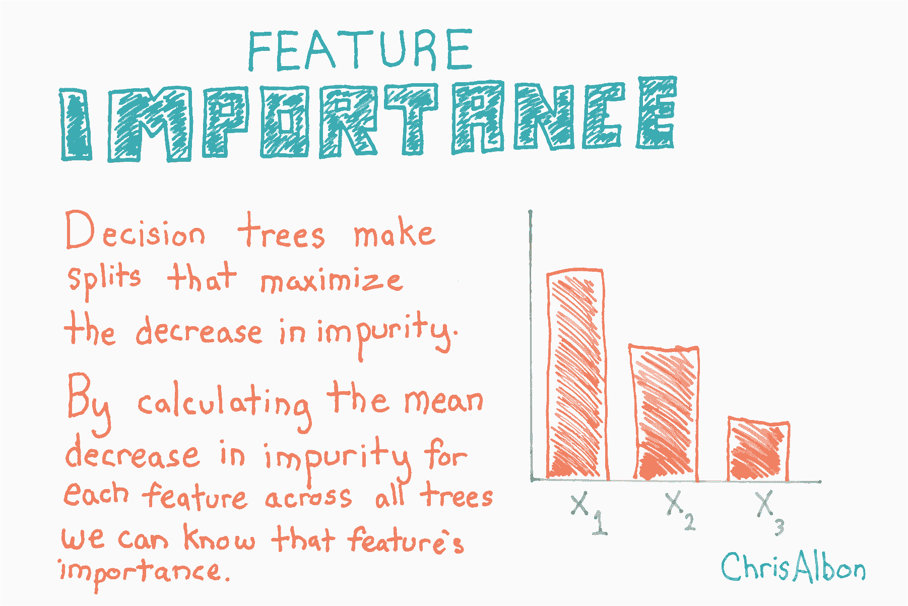

# 十三、树和森林

> 作者：[Chris Albon](https://chrisalbon.com/)
> 
> 译者：[飞龙](https://github.com/wizardforcel)
> 
> 协议：[CC BY-NC-SA 4.0](http://creativecommons.org/licenses/by-nc-sa/4.0/)

## Adaboost 分类器



```py
# 加载库
from sklearn.ensemble import AdaBoostClassifier
from sklearn import datasets

# 加载数据
iris = datasets.load_iris()
X = iris.data
y = iris.target
```

最重要的参数是`base_estimator`，`n_estimators`和`learning_rate`。

*   `base_estimator`是用于训练弱模型的学习算法。 这几乎总是不需要改变，因为到目前为止，与 AdaBoost 一起使用的最常见的学习者是决策树 - 这个参数的默认参数。
*   `n_estimators`是迭代式训练的模型数。
*   `learning_rate`是每个模型对权重的贡献，默认为`1`。 降低学习率将意味着权重将增加或减少到很小的程度，迫使模型训练更慢（但有时会产生更好的表现得分）。
*   `loss`是`AdaBoostRegressor`独有的，它设置了更新权重时使用的损失函数。 这默认为线性损失函数，但可以更改为`square`或`exponential`。

```py
# 创建 adaboost 决策树分类器对象
clf = AdaBoostClassifier(n_estimators=50,
                         learning_rate=1,
                         random_state=0)

# 训练模型
model = clf.fit(X, y)
```

## 决策树分类器



```py
# 加载库
from sklearn.tree import DecisionTreeClassifier
from sklearn import datasets

# 加载数据
iris = datasets.load_iris()
X = iris.data
y = iris.target

# 创建使用 GINI 的决策树分类器对象
clf = DecisionTreeClassifier(criterion='gini', random_state=0)

# 训练模型
model = clf.fit(X, y)

# 生成新的观测
observation = [[ 5,  4,  3,  2]]

# 预测观测的类别
model.predict(observation)

# array([1]) 

# 查看三个类别的预测概率
model.predict_proba(observation)

# array([[ 0.,  1.,  0.]]) 
```

## 决策树回归



```py
# 加载库
from sklearn.tree import DecisionTreeRegressor
from sklearn import datasets

# 加载只有两个特征的数据
boston = datasets.load_boston()
X = boston.data[:,0:2]
y = boston.target
```

决策树回归的工作方式类似于决策树分类，但不是减少基尼杂质或熵，而是测量潜在的分割点，它们减少均方误差（MSE）的程度：



其中  是目标的真实值， 是预测值。

```py
# 创建决策树回归器对象
regr = DecisionTreeRegressor(random_state=0)

# 训练模型
model = regr.fit(X, y)

# 生成新的观测
observation = [[0.02, 16]]

# 预测观测的值
model.predict(observation)

# array([ 33.]) 
```

## 特征的重要性



```py
# 加载库
from sklearn.ensemble import RandomForestClassifier
from sklearn import datasets
import numpy as np
import matplotlib.pyplot as plt

# 加载数据
iris = datasets.load_iris()
X = iris.data
y = iris.target

# 创建决策树分类器对象
clf = RandomForestClassifier(random_state=0, n_jobs=-1)

# 训练模型
model = clf.fit(X, y)

# 计算特征重要性
importances = model.feature_importances_

# 对特征重要性降序排序
indices = np.argsort(importances)[::-1]

# 重新排列特征名称，使它们匹配有序的特征重要性
names = [iris.feature_names[i] for i in indices]

# 创建绘图
plt.figure()

# 创建绘图标题
plt.title("Feature Importance")

# 添加条形
plt.bar(range(X.shape[1]), importances[indices])

# 添加特征名称作为 x 轴标签
plt.xticks(range(X.shape[1]), names, rotation=90)

# 展示绘图
plt.show()
```


## 使用随机森林的特征选择

通常在数据科学中，我们有数百甚至数百万个特征，我们想要一种方法来创建仅包含最重要特征的模型。 这有三个好处。 首先，我们使模型更易于解释。 其次，我们可以减少模型的方差，从而避免过拟合。 最后，我们可以减少训练模型的计算开销（和时间）。 仅识别最相关特征的过程称为“特征选择”。

数据科学工作流程中，随机森林通常用于特征选择。 原因是，随机森林使用的基于树的策略，自然按照它们如何改善节点的纯度来排序。 这意味着所有树的不纯度的减少（称为[基尼不纯度](https://en.wikipedia.org/wiki/Decision_tree_learning#Gini_impurity)）。 不纯度减少最多的节点出现在树的开始处，而不纯度减少最少的节点出现在树的末端。 因此，通过在特定节点下修剪树，我们可以创建最重要特征的子集。

在这个教程中，我们将要：

1.  准备数据集
2.  训练随机森林分类器
3.  识别最重要的特征
4.  创建新的“有限特征的”数据集，仅仅包含那些特征
5.  在新数据集上训练第二个分类器
6.  将“全部特征的”分类器的准确率，和“有限特征的”分类器比较

注：还有其他重要定义，但在本教程中，我们将讨论限制为基尼重要性。

```py
import numpy as np
from sklearn.ensemble import RandomForestClassifier
from sklearn import datasets
from sklearn.model_selection import train_test_split
from sklearn.feature_selection import SelectFromModel
from sklearn.metrics import accuracy_score
```

本教程中使用的数据集是着名的[鸢尾花数据集](https://en.wikipedia.org/wiki/Iris_flower_data_set)鸢尾花数据包含来自三种鸢尾`y`和四个特征变量`X`的 50 个样本。

```py
# 加载鸢尾花数据集
iris = datasets.load_iris()

# 创建特征名称列表
feat_labels = ['Sepal Length','Sepal Width','Petal Length','Petal Width']

# 从特征中创建 X
X = iris.data

# 从目标中创建 y
y = iris.target

# 查看特征
X[0:5]

'''
array([[ 5.1,  3.5,  1.4,  0.2],
       [ 4.9,  3\. ,  1.4,  0.2],
       [ 4.7,  3.2,  1.3,  0.2],
       [ 4.6,  3.1,  1.5,  0.2],
       [ 5\. ,  3.6,  1.4,  0.2]]) 
'''

# 查看目标数据
y

'''
array([0, 0, 0, 0, 0, 0, 0, 0, 0, 0, 0, 0, 0, 0, 0, 0, 0, 0, 0, 0, 0, 0, 0,
       0, 0, 0, 0, 0, 0, 0, 0, 0, 0, 0, 0, 0, 0, 0, 0, 0, 0, 0, 0, 0, 0, 0,
       0, 0, 0, 0, 1, 1, 1, 1, 1, 1, 1, 1, 1, 1, 1, 1, 1, 1, 1, 1, 1, 1, 1,
       1, 1, 1, 1, 1, 1, 1, 1, 1, 1, 1, 1, 1, 1, 1, 1, 1, 1, 1, 1, 1, 1, 1,
       1, 1, 1, 1, 1, 1, 1, 1, 2, 2, 2, 2, 2, 2, 2, 2, 2, 2, 2, 2, 2, 2, 2,
       2, 2, 2, 2, 2, 2, 2, 2, 2, 2, 2, 2, 2, 2, 2, 2, 2, 2, 2, 2, 2, 2, 2,
       2, 2, 2, 2, 2, 2, 2, 2, 2, 2, 2, 2]) 
'''

# 将数据分为 40% 的测试和 60% 的训练集
X_train, X_test, y_train, y_test = train_test_split(X, y, test_size=0.4, random_state=0)

# 创建随机森林分类器
clf = RandomForestClassifier(n_estimators=10000, random_state=0, n_jobs=-1)

# 训练分类器
clf.fit(X_train, y_train)

# 打印每个特征的名称和基尼重要性
for feature in zip(feat_labels, clf.feature_importances_):
    print(feature)

'''
('Sepal Length', 0.11024282328064565)
('Sepal Width', 0.016255033655398394)
('Petal Length', 0.45028123999239533)
('Petal Width', 0.42322090307156124) 
'''
```

上面的得分是每个变量的重要性得分。 有两点需要注意。 首先，所有重要性得分加起来为 100%。 其次，“花瓣长度”和“花瓣宽度”远比其他两个特征重要。结合起来，“花瓣长度”和“花瓣宽度”的重要性约为 0.86！显然，这些是最重要的特征。

```py
# 创建一个选择器对象，
# 该对象将使用随机森林分类器来标识重要性大于 0.15 的特征
sfm = SelectFromModel(clf, threshold=0.15)

# 训练选择器
sfm.fit(X_train, y_train)

'''
SelectFromModel(estimator=RandomForestClassifier(bootstrap=True, class_weight=None, criterion='gini',
            max_depth=None, max_features='auto', max_leaf_nodes=None,
            min_impurity_split=1e-07, min_samples_leaf=1,
            min_samples_split=2, min_weight_fraction_leaf=0.0,
            n_estimators=10000, n_jobs=-1, oob_score=False, random_state=0,
            verbose=0, warm_start=False),
        prefit=False, threshold=0.15) 
'''

# 打印最重要的特征的名称
for feature_list_index in sfm.get_support(indices=True):
    print(feat_labels[feature_list_index])

'''
Petal Length
Petal Width 
'''

# 转换数据来创建仅包含最重要特征的新数据集
# 注意：我们必须将变换应用于训练 X 和测试 X 数据。
X_important_train = sfm.transform(X_train)
X_important_test = sfm.transform(X_test)

# 为最重要的特征创建新的随机森林分类器
clf_important = RandomForestClassifier(n_estimators=10000, random_state=0, n_jobs=-1)

# 在包含最重要特征的新数据集上训练新分类器
clf_important.fit(X_important_train, y_train)

'''
RandomForestClassifier(bootstrap=True, class_weight=None, criterion='gini',
            max_depth=None, max_features='auto', max_leaf_nodes=None,
            min_impurity_split=1e-07, min_samples_leaf=1,
            min_samples_split=2, min_weight_fraction_leaf=0.0,
            n_estimators=10000, n_jobs=-1, oob_score=False, random_state=0,
            verbose=0, warm_start=False) 
'''

# 将全部特征的分类器应用于测试数据
y_pred = clf.predict(X_test)

# 查看我们的全部特征（4 个特征）的模型的准确率
accuracy_score(y_test, y_pred)

# 0.93333333333333335 

# 将全部特征的分类器应用于测试数据
y_important_pred = clf_important.predict(X_important_test)

# 查看我们有限特征（2 个特征）的模型的准确率
accuracy_score(y_test, y_important_pred)

# 0.8833333333333333 
```

从准确率得分可以看出，包含所有四个特征的原始模型准确率为 93.3%，而仅包含两个特征的“有限”模型准确率为 88.3%。 因此，为了精确率的低成本，我们将模型中的特征数量减半。

## 在随机森林中处理不平衡类别

```py
# 加载库
from sklearn.ensemble import RandomForestClassifier
import numpy as np
from sklearn import datasets

# 加载数据
iris = datasets.load_iris()
X = iris.data
y = iris.target

# 通过移除前 40 个观测，生成高度不平衡的类别
X = X[40:,:]
y = y[40:]

# 创建目标向量，表示类别是否为 0 
y = np.where((y == 0), 0, 1)
```

当使用`RandomForestClassifier`时，有用的设置是`class_weight = balanced`，其中类自动加权，与它们在数据中出现的频率成反比。具体来说：


其中  是类  的权重， 是观测数， 是类  中的观测数， 是类的总数。

```py
# 创建决策树分类器对象
clf = RandomForestClassifier(random_state=0, n_jobs=-1, class_weight="balanced")

# 训练模型
model = clf.fit(X, y)
```

## 随机森林分类器

```py
# 加载库
from sklearn.ensemble import RandomForestClassifier
from sklearn import datasets

# 加载数据
iris = datasets.load_iris()
X = iris.data
y = iris.target

# 创建使用熵的随机森林分类器
clf = RandomForestClassifier(criterion='entropy', random_state=0, n_jobs=-1)

# 训练模型
model = clf.fit(X, y)

# 创建新的观测
observation = [[ 5,  4,  3,  2]]

# 预测观测的类别
model.predict(observation)
```

```py
array([1]) 
```

## 随机森林分类器示例

本教程基于 Yhat 2013 年的[ Python 中的随机森林]教程(http://blog.yhat.com/posts/random-forests-in-python.html)。 如果你想要随机森林的理论和用途的总结，我建议你查看他们的指南。 在下面的教程中，我对文章末尾提供的随机森林的简短代码示例进行了注释，更正和扩展。 具体来说，我（1）更新代码，使其在最新版本的 pandas 和 Python 中运行，（2）编写详细的注释，解释每个步骤中发生的事情，以及（3）以多种方式扩展代码。

让我们开始吧！

### 数据的注解

本教程的数据很有名。 被称为[鸢尾花数据集](https://en.wikipedia.org/wiki/Iris_flower_data_set)，它包含四个变量，测量了三个鸢尾花物种的各个部分，然后是带有物种名称的第四个变量。 它在机器学习和统计社区中如此着名的原因是，数据需要很少的预处理（即没有缺失值，所有特征都是浮点数等）。

```py
# 加载鸢尾花数据集
from sklearn.datasets import load_iris

# 加载 sklearn 的随机森林分类器
from sklearn.ensemble import RandomForestClassifier

# 加载 pandas
import pandas as pd

# 加载 numpy
import numpy as np

# 设置随机种子
np.random.seed(0)

# Create an object called iris with the iris data
iris = load_iris()

# 创建带有四个特征变量的数据帧
df = pd.DataFrame(iris.data, columns=iris.feature_names)

# 查看前五行
df.head()
```

|  | sepal length (cm) | sepal width (cm) | petal length (cm) | petal width (cm) |
| --- | --- | --- | --- | --- |
| 0 | 5.1 | 3.5 | 1.4 | 0.2 |
| 1 | 4.9 | 3.0 | 1.4 | 0.2 |
| 2 | 4.7 | 3.2 | 1.3 | 0.2 |
| 3 | 4.6 | 3.1 | 1.5 | 0.2 |
| 4 | 5.0 | 3.6 | 1.4 | 0.2 |

```py
# 添加带有物种名称的新列，我们要尝试预测它
df['species'] = pd.Categorical.from_codes(iris.target, iris.target_names)

# 查看前五行
df.head()
```

|  | sepal length (cm) | sepal width (cm) | petal length (cm) | petal width (cm) | species |
| --- | --- | --- | --- | --- | --- |
| 0 | 5.1 | 3.5 | 1.4 | 0.2 | setosa |
| 1 | 4.9 | 3.0 | 1.4 | 0.2 | setosa |
| 2 | 4.7 | 3.2 | 1.3 | 0.2 | setosa |
| 3 | 4.6 | 3.1 | 1.5 | 0.2 | setosa |
| 4 | 5.0 | 3.6 | 1.4 | 0.2 | setosa |

```py
# 创建一个新列，每列生成一个0到1之间的随机数，
# 如果该值小于或等于.75，则将该单元格的值设置为 True
# 否则为 False。这是一种简洁方式，
# 随机分配一些行作为训练数据，一些作为测试数据。
df['is_train'] = np.random.uniform(0, 1, len(df)) <= .75

# 查看前五行
df.head()
```

|  | sepal length (cm) | sepal width (cm) | petal length (cm) | petal width (cm) | species | is_train |
| --- | --- | --- | --- | --- | --- | --- |
| 0 | 5.1 | 3.5 | 1.4 | 0.2 | setosa | True |
| 1 | 4.9 | 3.0 | 1.4 | 0.2 | setosa | True |
| 2 | 4.7 | 3.2 | 1.3 | 0.2 | setosa | True |
| 3 | 4.6 | 3.1 | 1.5 | 0.2 | setosa | True |
| 4 | 5.0 | 3.6 | 1.4 | 0.2 | setosa | True |

```py
# 创建两个新的数据帧，一个包含训练行，另一个包含测试行
train, test = df[df['is_train']==True], df[df['is_train']==False]

# 显示测试和训练数据帧的观测数
print('Number of observations in the training data:', len(train))
print('Number of observations in the test data:',len(test))

'''
Number of observations in the training data: 118
Number of observations in the test data: 32 
'''

# 创建特征列名称的列表
features = df.columns[:4]

# 查看特征
features

'''
Index(['sepal length (cm)', 'sepal width (cm)', 'petal length (cm)',
       'petal width (cm)'],
      dtype='object') 
'''

# train['species'] 包含实际的物种名称。 
# 在我们使用它之前，我们需要将每个物种名称转换为数字。
# 因此，在这种情况下，有三种物种，它们被编码为 0, 1 或 2。
y = pd.factorize(train['species'])[0]

# 查看目标
y

'''
array([0, 0, 0, 0, 0, 0, 0, 0, 0, 0, 0, 0, 0, 0, 0, 0, 0, 0, 0, 0, 0, 0, 0,
       0, 0, 0, 0, 0, 0, 0, 0, 0, 0, 0, 0, 0, 0, 1, 1, 1, 1, 1, 1, 1, 1, 1,
       1, 1, 1, 1, 1, 1, 1, 1, 1, 1, 1, 1, 1, 1, 1, 1, 1, 1, 1, 1, 1, 1, 1,
       1, 1, 1, 1, 1, 1, 1, 1, 1, 1, 1, 2, 2, 2, 2, 2, 2, 2, 2, 2, 2, 2, 2,
       2, 2, 2, 2, 2, 2, 2, 2, 2, 2, 2, 2, 2, 2, 2, 2, 2, 2, 2, 2, 2, 2, 2,
       2, 2, 2]) 
'''

# 创建随机森林分类器。按照惯例，clf 表示“分类器”
clf = RandomForestClassifier(n_jobs=2, random_state=0)

# 训练分类器，来接受训练特征
# 并了解它们与训练集 y（物种）的关系
clf.fit(train[features], y)

'''
RandomForestClassifier(bootstrap=True, class_weight=None, criterion='gini',
            max_depth=None, max_features='auto', max_leaf_nodes=None,
            min_impurity_split=1e-07, min_samples_leaf=1,
            min_samples_split=2, min_weight_fraction_leaf=0.0,
            n_estimators=10, n_jobs=2, oob_score=False, random_state=0,
            verbose=0, warm_start=False) 
'''
```

好哇！ 我们做到了！ 我们正式训练了我们的随机森林分类器！ 现在让我们玩玩吧。 分类器模型本身存储在`clf`变量中。

如果你一直跟着，你会知道我们只在部分数据上训练了我们的分类器，留出了剩下的数据。 在我看来，这是机器学习中最重要的部分。 为什么？ 因为省略了部分数据，我们有一组数据来测试我们模型的准确率！

让我们现在实现它。

```py
# 将我们训练的分类器应用于测试数据
# （记住，以前从未见过它）
clf.predict(test[features])

'''
array([0, 0, 0, 0, 0, 0, 0, 0, 0, 0, 0, 0, 0, 1, 1, 1, 2, 2, 1, 1, 2, 2, 2,
       2, 2, 2, 2, 2, 2, 2, 2, 2]) 
'''
```

你在上面看到什么？ 请记住，我们将三种植物中的每一种编码为 0, 1 或 2。 以上数字列表显示，我们的模型基于萼片长度，萼片宽度，花瓣长度和花瓣宽度，预测每种植物的种类。 分类器对于每种植物有多自信？ 我们也可以看到。

```py
# 查看前 10 个观测值的预测概率
clf.predict_proba(test[features])[0:10]

'''
array([[ 1\. ,  0\. ,  0\. ],
       [ 1\. ,  0\. ,  0\. ],
       [ 1\. ,  0\. ,  0\. ],
       [ 1\. ,  0\. ,  0\. ],
       [ 1\. ,  0\. ,  0\. ],
       [ 1\. ,  0\. ,  0\. ],
       [ 1\. ,  0\. ,  0\. ],
       [ 0.9,  0.1,  0\. ],
       [ 1\. ,  0\. ,  0\. ],
       [ 1\. ,  0\. ,  0\. ]]) 
'''
```

有三种植物，因此`[1, 0, 0]`告诉我们分类器确定植物是第一类。 再举一个例子，`[0.9, 0.1, 0]`告诉我们，分类器给出植物属于第一类的概率为90%，植物属于第二类的概率为 10%。 因为 90 大于 10，分类器预测植物是第一类。

现在我们已经预测了测试数据中所有植物的种类，我们可以比较我们预测的物种与该植物的实际物种。

```py
# 为每个预测的植物类别
# 创建植物的实际英文名称
preds = iris.target_names[clf.predict(test[features])]

# 查看前五个观测值的预测物种
preds[0:5]

'''
array(['setosa', 'setosa', 'setosa', 'setosa', 'setosa'],
      dtype='<U10') 
'''

# 查看前五个观测值的实际物种
test['species'].head()

'''
7     setosa
8     setosa
10    setosa
13    setosa
17    setosa
Name: species, dtype: category
Categories (3, object): [setosa, versicolor, virginica]
''' 
```

看起来很不错！ 至少对于前五个观测。 现在让我们看看所有数据。

[混淆矩阵](https://en.wikipedia.org/wiki/Confusion_matrix)可能令人混淆，但它实际上非常简单。 列是我们为测试数据预测的物种，行是测试数据的实际物种。 因此，如果我们选取最上面的行，我们可以完美地预测测试数据中的所有 13 个山鸢尾。 然而，在下一行中，我们正确地预测了 5 个杂色鸢尾，但错误地将两个杂色鸢尾预测为维吉尼亚鸢尾。

混淆矩阵的简短解释方式是：对角线上的任何东西都被正确分类，对角线之外的任何东西都被错误地分类。

```py
# 创建混淆矩阵
pd.crosstab(test['species'], preds, rownames=['Actual Species'], colnames=['Predicted Species'])
```

| Predicted Species | setosa | versicolor | virginica |
| --- | --- | --- | --- |
| Actual Species |  |  |  |
| setosa | 13 | 0 | 0 |
| versicolor | 0 | 5 | 2 |
| virginica | 0 | 0 | 12 |

虽然我们没有像 OLS 那样得到回归系数，但我们得到的分数告诉我们，每个特征在分类中的重要性。 这是随机森林中最强大的部分之一，因为我们可以清楚地看到，在分类中花瓣宽度比萼片宽度更重要。

```py
# 查看特征列表和它们的重要性得分
list(zip(train[features], clf.feature_importances_))

'''
[('sepal length (cm)', 0.11185992930506346),
 ('sepal width (cm)', 0.016341813006098178),
 ('petal length (cm)', 0.36439533040889194),
 ('petal width (cm)', 0.5074029272799464)] 
'''
```

## 随机森林回归

```py
# 加载库
from sklearn.ensemble import RandomForestRegressor
from sklearn import datasets

# 加载只有两个特征的数据
boston = datasets.load_boston()
X = boston.data[:,0:2]
y = boston.target

# Create decision tree classifer object
regr = RandomForestRegressor(random_state=0, n_jobs=-1)

# 训练模型
model = regr.fit(X, y)
```

## 在随机森林中选择特征重要性

```py
# 加载库
from sklearn.ensemble import RandomForestClassifier
from sklearn import datasets
from sklearn.feature_selection import SelectFromModel

# 加载数据
iris = datasets.load_iris()
X = iris.data
y = iris.target

# 创建随机森林分类器
clf = RandomForestClassifier(random_state=0, n_jobs=-1)
```

数字越大，特征越重要（所有重要性得分总和为1）。 通过绘制这些值，我们可以为随机森林模型添加可解释性。

```py
# 创建选择重要性大于或等于阈值的特征的对象
selector = SelectFromModel(clf, threshold=0.3)

# 使用选择器生成新的特征矩阵
X_important = selector.fit_transform(X, y)

# 查看特征的前五个观测
X_important[0:5]

'''
array([[ 1.4,  0.2],
       [ 1.4,  0.2],
       [ 1.3,  0.2],
       [ 1.5,  0.2],
       [ 1.4,  0.2]]) 
'''

# 使用最重要的特征训练随机森林
model = clf.fit(X_important, y)
```

## 泰坦尼克比赛和随机森林

```py
import pandas as pd
import numpy as np
from sklearn import preprocessing
from sklearn.ensemble import RandomForestClassifier
from sklearn.model_selection import GridSearchCV, cross_val_score
import csv as csv
```

你可以在 [Kaggle](https://www.kaggle.com/c/titanic) 获取数据。

```py
# 加载数据
train = pd.read_csv('data/train.csv')
test = pd.read_csv('data/test.csv')

# 创建特征列表，我们最终会接受他们
features = ['Age', 'SibSp','Parch','Fare','male','embarked_Q','embarked_S','Pclass_2', 'Pclass_3']
```

### 性别

在这里，我们将性别标签（`male`，`female`）转换为虚拟变量（`1`，`0`）。

```py
# 创建编码器
sex_encoder = preprocessing.LabelEncoder()

# 使编码器拟合训练数据，因此它知道 male = 1
sex_encoder.fit(train['Sex'])

# 将编码器应用于训练数据
train['male'] = sex_encoder.transform(train['Sex'])

# 将编码器应用于测试数据
test['male'] = sex_encoder.transform(test['Sex'])

# 使用单热编码，将编码的特征转换为虚拟值
# 去掉第一个类别来防止共线性
train_embarked_dummied = pd.get_dummies(train["Embarked"], prefix='embarked', drop_first=True)

# 使用单热编码
# 将“已编码”的测试特征转换为虚拟值
# 去掉第一个类别来防止共线性
test_embarked_dummied = pd.get_dummies(test["Embarked"], prefix='embarked', drop_first=True)

# 将虚拟值的数据帧与主数据帧连接起来
train = pd.concat([train, train_embarked_dummied], axis=1)
test = pd.concat([test, test_embarked_dummied], axis=1)

# 使用单热编码将 Pclass 训练特征转换为虚拟值
# 去掉第一个类别来防止共线性
train_Pclass_dummied = pd.get_dummies(train["Pclass"], prefix='Pclass', drop_first=True)

# 使用单热编码将 Pclass 测试特征转换为虚拟值
# 去掉第一个类别来防止共线性
test_Pclass_dummied = pd.get_dummies(test["Pclass"], prefix='Pclass', drop_first=True)

# 将虚拟值的数据帧与主数据帧连接起来
train = pd.concat([train, train_Pclass_dummied], axis=1)
test = pd.concat([test, test_Pclass_dummied], axis=1)
```

### 年龄

`Age`特征的许多值都缺失，并且会妨碍随机森林进行训练。 我们解决这个问题，我们将用年龄的平均值填充缺失值（一个实用的操作）。


```py
# 创建填充器对象
age_imputer = preprocessing.Imputer(missing_values='NaN', strategy='mean', axis=0)

# 将填充器对象拟合训练数据
age_imputer.fit(train['Age'].reshape(-1, 1))

# 将填充器对象应用于训练和测试数据
train['Age'] = age_imputer.transform(train['Age'].reshape(-1, 1))
test['Age'] = age_imputer.transform(test['Age'].reshape(-1, 1))

# 创建填充器对象
fare_imputer = preprocessing.Imputer(missing_values='NaN', strategy='mean', axis=0)

# 将填充器对象拟合训练数据
fare_imputer.fit(train['Fare'].reshape(-1, 1))

# 将填充器对象应用于训练和测试数据
train['Fare'] = fare_imputer.transform(train['Fare'].reshape(-1, 1))
test['Fare'] = fare_imputer.transform(test['Fare'].reshape(-1, 1))

# 创建包含参数所有候选值的字典
parameter_grid = dict(n_estimators=list(range(1, 5001, 1000)),
                      criterion=['gini','entropy'],
                      max_features=list(range(1, len(features), 2)),
                      max_depth= [None] + list(range(5, 25, 1)))

# 创建随机森林对象
random_forest = RandomForestClassifier(random_state=0, n_jobs=-1)

# 创建网格搜索对象，使用 5 倍交叉验证
# 并使用所有核（n_jobs = -1）
clf = GridSearchCV(estimator=random_forest, param_grid=parameter_grid, cv=5, verbose=1, n_jobs=-1)

# 将网格搜索嵌套在 3 折 CV 中来进行模型评估
cv_scores = cross_val_score(clf, train[features], train['Survived'])

# 打印结果
print('Accuracy scores:', cv_scores)
print('Mean of score:', np.mean(cv_scores))
print('Variance of scores:', np.var(cv_scores))

# 在整个数据集上重新训练模型
clf.fit(train[features], train['Survived'])

# 预测在测试数据集中的幸存者
predictions = clf.predict(test[features])

# 获取乘客 ID
ids = test['PassengerId'].values

# 创建 csv
submission_file = open("submission.csv", "w")

# 写入这个 csv
open_file_object = csv.writer(submission_file)

# 写入 CSV 标题
open_file_object.writerow(["PassengerId","Survived"])

# 写入 CSV 的行
open_file_object.writerows(zip(ids, predictions))

# 关闭文件
submission_file.close()
```

## 可视化决策树

```py
# 加载库
from sklearn.tree import DecisionTreeClassifier
from sklearn import datasets
from IPython.display import Image  
from sklearn import tree
import pydotplus

# 加载数据
iris = datasets.load_iris()
X = iris.data
y = iris.target

# 创建决策树分类器对象
clf = DecisionTreeClassifier(random_state=0)

# 训练模型
model = clf.fit(X, y)

# 创建 DOT 数据
dot_data = tree.export_graphviz(clf, out_file=None, 
                                feature_names=iris.feature_names,  
                                class_names=iris.target_names)

# 绘制图形
graph = pydotplus.graph_from_dot_data(dot_data)  

# 展示图形
Image(graph.create_png())
```


```py
# 创建 PDF
graph.write_pdf("iris.pdf")

# 创建 PNG
graph.write_png("iris.png")

# True 
```
