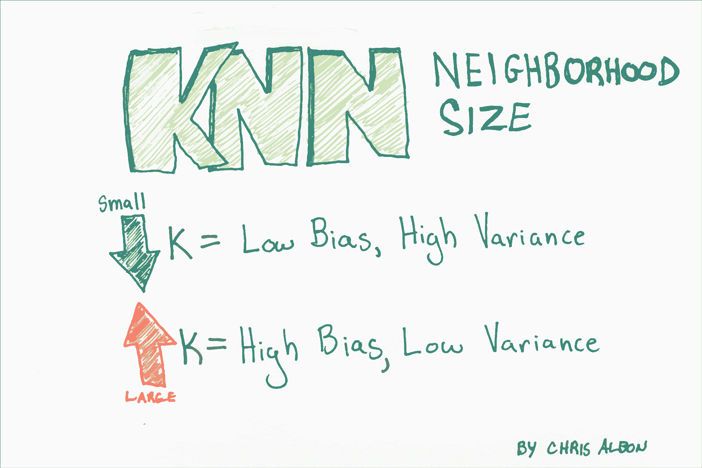
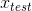
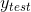
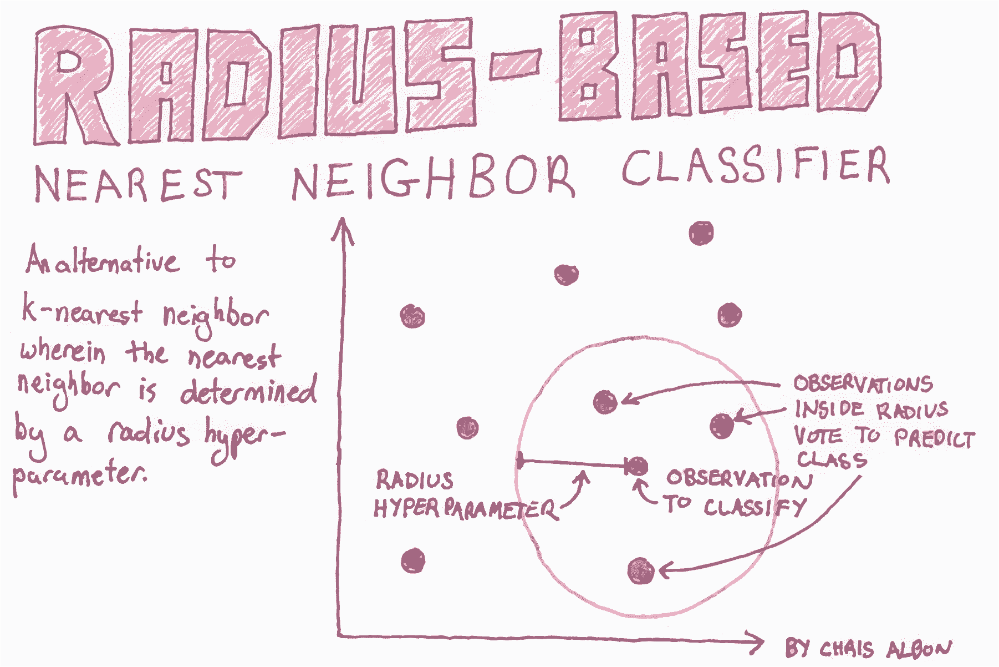

# 十四、K 最近邻

> 作者：[Chris Albon](https://chrisalbon.com/)
> 
> 译者：[飞龙](https://github.com/wizardforcel)
> 
> 协议：[CC BY-NC-SA 4.0](http://creativecommons.org/licenses/by-nc-sa/4.0/)

## 确定 K 的最佳值



```py
# 加载库
from sklearn.neighbors import KNeighborsClassifier
from sklearn import datasets
from sklearn.preprocessing import StandardScaler
from sklearn.pipeline import Pipeline, FeatureUnion
from sklearn.model_selection import GridSearchCV

# 加载数据
iris = datasets.load_iris()
X = iris.data
y = iris.target

# 创建标准化器
standardizer = StandardScaler()

# 标准化特征
X_std = standardizer.fit_transform(X)

# 拟合 5 个邻居的 KNN 分类器
knn = KNeighborsClassifier(n_neighbors=5, metric='euclidean', n_jobs=-1).fit(X_std, y)

# 创建流水线
pipe = Pipeline([('standardizer', standardizer), ('knn', knn)])

# 创建候选值空间
search_space = [{'knn__n_neighbors': [1, 2, 3, 4, 5, 6, 7, 8, 9, 10]}]

# 创建网格搜索
clf = GridSearchCV(pipe, search_space, cv=5, verbose=0).fit(X_std, y)

# 最佳邻居大小（K）
clf.best_estimator_.get_params()['knn__n_neighbors']

# 6 
```

## KNN 分类

K 最近邻分类器（KNN）是一种简单而强大的分类学习器。

KNN 有三个基本部分

*   : 观测的类别（我们试图在测试数据中预测的东西）。
*   : 观察的预测因子/ IV /属性。
*   : 研究者指定的正数。 K 表示最接近特定观测的观测数，它定义了“邻域”。 例如，`K = 2`意味着每个观测都有一个邻域，包含最接近它的另外两个观测。

想象一下，我们有一个观测，我们知道它的自变量 ，但不知道它的类别 。 KNN 学习器找到最接近  的K个其他观测，并使用他们已知的类别，将类别分配给 。

```py
import pandas as pd
from sklearn import neighbors
import numpy as np
%matplotlib inline  
import seaborn
```

这里我们创建三个变量，`test_1`和`test_2`是我们的自变量，`outcome`是我们的因变量。 我们将使用这些数据来训练我们的学习器。

```py
training_data = pd.DataFrame()

training_data['test_1'] = [0.3051,0.4949,0.6974,0.3769,0.2231,0.341,0.4436,0.5897,0.6308,0.5]
training_data['test_2'] = [0.5846,0.2654,0.2615,0.4538,0.4615,0.8308,0.4962,0.3269,0.5346,0.6731]
training_data['outcome'] = ['win','win','win','win','win','loss','loss','loss','loss','loss']

training_data.head()
```

|  | test_1 | test_2 | outcome |
| --- | --- | --- | --- |
| 0 | 0.3051 | 0.5846 | win |
| 1 | 0.4949 | 0.2654 | win |
| 2 | 0.6974 | 0.2615 | win |
| 3 | 0.3769 | 0.4538 | win |
| 4 | 0.2231 | 0.4615 | win |

这不是必需的，但因为我们只有三个变量，所以我们可以绘制训练数据集。 X 轴和 Y 轴是自变量，而点的颜色是它们的类别。

```py
seaborn.lmplot('test_1', 'test_2', data=training_data, fit_reg=False,hue="outcome", scatter_kws={"marker": "D","s": 100})

# <seaborn.axisgrid.FacetGrid at 0x11008aeb8> 
```


`scikit-learn`库需要将数据格式化为`numpy`数组。 这是重新格式化的代码。

```py
X = training_data.as_matrix(columns=['test_1', 'test_2'])
y = np.array(training_data['outcome'])
```

这是我们的重点。 我们使用“观测的邻域是其三个最近的邻居”的参数来训练 KNN 学习器。 `weights ='uniform'`可以当做所用的投票系统。 例如，`uniform`意味着所有邻居对观测的类别进行同等权重的“投票”，而`weight ='distance'`则告诉学习器根据到我们正在分类的观测的距离，来调整每个观测的“投票”。

```py
clf = neighbors.KNeighborsClassifier(3, weights = 'uniform')
trained_model = clf.fit(X, y)
```

与训练数据相比，我们训练的模型有多好？

```py
trained_model.score(X, y)

# 0.80000000000000004 
```

我们的模型准确率达 80%！

注：在任何现实世界的例子中，我们都希望将训练的模型与一些保留的测试数据进行比较。 但由于这是一个玩具示例，我使用了训练数据。

现在我们已经训练了我们的模型，我们可以预测班级的任何新观测，。 我们现在就这样做吧！

```py
# 使用 'test_1' 第一个和第二个自变量的值
# 创建一个新观测，为 .4 和 .6
x_test = np.array([[.4,.6]])

# 将学习者应用于新的未分类的观测。
trained_model.predict(x_test)

# array(['loss'], dtype=object) 
```

好哇！ 我们可以看到学习器预测的新观测的类是“输”。

我们甚至可以查看学习器分配给每个分类的概率：

```py
trained_model.predict_proba(x_test)

# array([[ 0.66666667,  0.33333333]]) 
```

根据这个结果，模型预测观测结果是“输”的概率约为  67%，“赢”的概率为 33%。 因为观测有更大的“输”的概率，所以它预测为这个分类。

## 注

*   K 的选择对创建的分类器有重大影响。
*   K 越大，决策边界越线性（高偏差和低方差）。
*   有多种方法可以测量距离，两种流行的方法是简单的欧几里德距离和余弦相似度。

# 基于半径的 KNN 分类器


 
```py
# 加载库
from sklearn.neighbors import RadiusNeighborsClassifier
from sklearn.preprocessing import StandardScaler
from sklearn import datasets

# 加载数据
iris = datasets.load_iris()
X = iris.data
y = iris.target

# 创建标准化器
standardizer = StandardScaler()

# 标准化特征
X_std = standardizer.fit_transform(X)
```

在 scikit-learn 中，`RadiusNeighborsClassifier`与`KNeighborsClassifier`非常相似，但有两个参数除外。 首先，在`RadiusNeighborsClassifier`中，我们需要指定固定区域的半径，用于确定观测是否是半径内的邻居。 将半径设置为某个值，最好将其视为任何其他超参数，并在模型选择期间对其进行调整。 第二个有用的参数是`outlier_label`，它表示半径内没有观测的观测的标签 - 这本身通常可以是识别异常值的有用工具。

```py
# 训练半径邻居分类器
rnn = RadiusNeighborsClassifier(radius=.5, n_jobs=-1).fit(X_std, y)

# 创建两个观测
new_observations = [[ 1,  1,  1,  1]]

# 预测两个观测的类别
rnn.predict(new_observations)

# array([2]) 
```