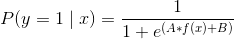
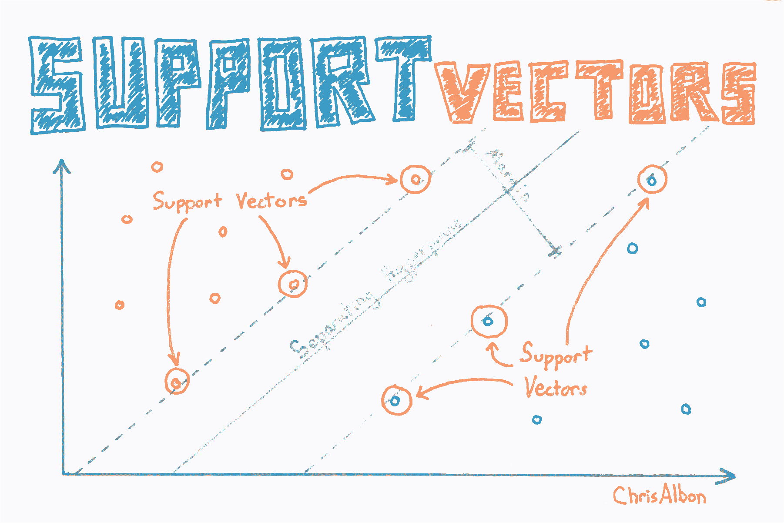
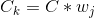
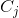
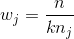
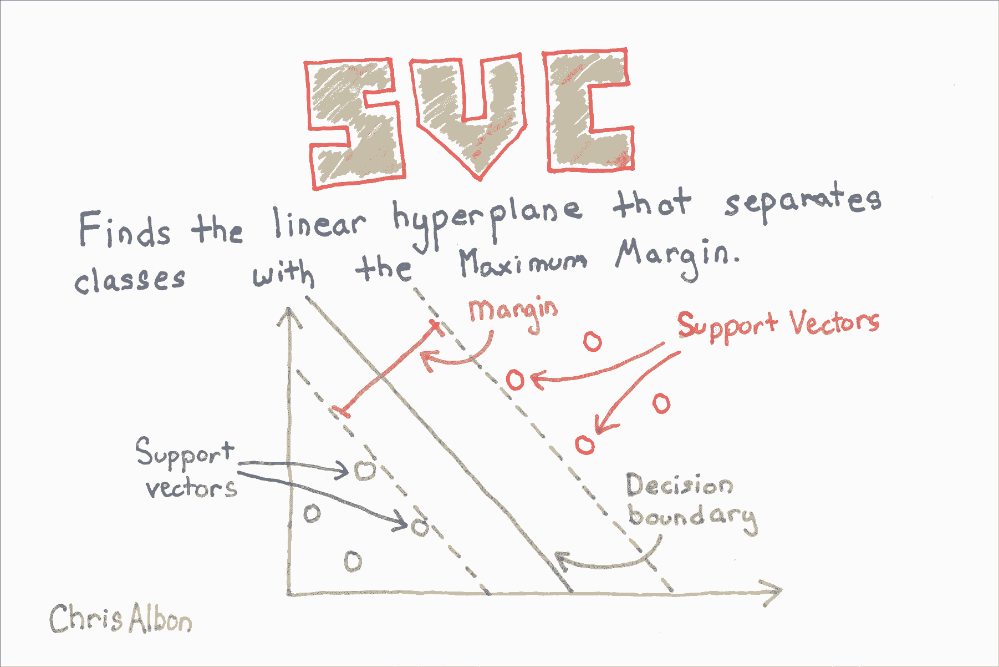
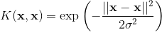
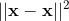
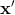

# 十五、支持向量机

> 作者：[Chris Albon](https://chrisalbon.com/)
> 
> 译者：[飞龙](https://github.com/wizardforcel)
> 
> 协议：[CC BY-NC-SA 4.0](http://creativecommons.org/licenses/by-nc-sa/4.0/)

## 校准 SVC 中的预测概率

SVC 使用超平面来创建决策区域，不会自然输出观察是某一类成员的概率估计。 但是，我们实际上可以通过一些技巧输出校准的类概率。 在 SVC 中，可以使用 Platt 缩放，其中首先训练 SVC，然后训练单独的交叉验证逻辑回归来将 SVC 输出映射到概率：



其中  和  是参数向量， 是第  个观测点与超平面的有符号距离。 当我们有两个以上的类时，使用 Platt 缩放的扩展。

在 scikit-learn 中，必须在训练模型时生成预测概率。 这可以通过将`SVC`的`probability`设置为`True`来完成。 在训练模型之后，我们可以使用`predict_proba`输出每个类的估计概率。

```py
# 加载库
from sklearn.svm import SVC
from sklearn import datasets
from sklearn.preprocessing import StandardScaler
import numpy as np

# 加载数据
iris = datasets.load_iris()
X = iris.data
y = iris.target

# 标准化特征
scaler = StandardScaler()
X_std = scaler.fit_transform(X)

# 创建支持向量分类器对象
svc = SVC(kernel='linear', probability=True, random_state=0)

# 训练分类器
model = svc.fit(X_std, y)

# 创建新的观测
new_observation = [[.4, .4, .4, .4]]

# 查看预测的概率
model.predict_proba(new_observation)

# array([[ 0.00588822,  0.96874828,  0.0253635 ]]) 
```

## 寻找最近邻

```py
# 加载库
from sklearn.neighbors import NearestNeighbors
from sklearn import datasets
from sklearn.preprocessing import StandardScaler
import numpy as np

# 加载数据
iris = datasets.load_iris()
X = iris.data
y = iris.target
```

在计算任何距离之前标准化我们的数据非常重要。

```py
# 创建标准化器
standardizer = StandardScaler()

# 标准化特征
X_std = standardizer.fit_transform(X)

# 根据欧氏距离找到三个最近邻居（包括其自身）
nn_euclidean = NearestNeighbors(n_neighbors=3, metric='euclidean').fit(X)

# 列表的列表，表示每个观测的 3 个最近邻
nearest_neighbors_with_self = nn_euclidean.kneighbors_graph(X).toarray()

# 删除距离自身最近的一个观测
for i, x in enumerate(nearest_neighbors_with_self):
    x[i] = 0

# 查看第一个观测的两个最近邻
nearest_neighbors_with_self[0]

'''
array([ 0.,  0.,  0.,  0.,  1.,  0.,  0.,  0.,  0.,  0.,  0.,  0.,  0.,
        0.,  0.,  0.,  0.,  1.,  0.,  0.,  0.,  0.,  0.,  0.,  0.,  0.,
        0.,  0.,  0.,  0.,  0.,  0.,  0.,  0.,  0.,  0.,  0.,  0.,  0.,
        0.,  0.,  0.,  0.,  0.,  0.,  0.,  0.,  0.,  0.,  0.,  0.,  0.,
        0.,  0.,  0.,  0.,  0.,  0.,  0.,  0.,  0.,  0.,  0.,  0.,  0.,
        0.,  0.,  0.,  0.,  0.,  0.,  0.,  0.,  0.,  0.,  0.,  0.,  0.,
        0.,  0.,  0.,  0.,  0.,  0.,  0.,  0.,  0.,  0.,  0.,  0.,  0.,
        0.,  0.,  0.,  0.,  0.,  0.,  0.,  0.,  0.,  0.,  0.,  0.,  0.,
        0.,  0.,  0.,  0.,  0.,  0.,  0.,  0.,  0.,  0.,  0.,  0.,  0.,
        0.,  0.,  0.,  0.,  0.,  0.,  0.,  0.,  0.,  0.,  0.,  0.,  0.,
        0.,  0.,  0.,  0.,  0.,  0.,  0.,  0.,  0.,  0.,  0.,  0.,  0.,
        0.,  0.,  0.,  0.,  0.,  0.,  0.]) 
'''
```

## 寻找支持向量



```py
# 加载库
from sklearn.svm import SVC
from sklearn import datasets
from sklearn.preprocessing import StandardScaler
import numpy as np

# 加载只有两个分类的数据
iris = datasets.load_iris()
X = iris.data[:100,:]
y = iris.target[:100]

# 标准化特征
scaler = StandardScaler()
X_std = scaler.fit_transform(X)

# 创建支持向量对象
svc = SVC(kernel='linear', random_state=0)

# 训练分类器
model = svc.fit(X_std, y)

# 查看支持向量
model.support_vectors_

'''
array([[-0.5810659 ,  0.43490123, -0.80621461, -0.50581312],
       [-1.52079513, -1.67626978, -1.08374115, -0.8607697 ],
       [-0.89430898, -1.46515268,  0.30389157,  0.38157832],
       [-0.5810659 , -1.25403558,  0.09574666,  0.55905661]]) 
'''

# 查看支持向量的下标
model.support_

# array([23, 41, 57, 98], dtype=int32) 

# 查看每个分类的支持向量数
model.n_support_

# array([2, 2], dtype=int32) 
```

## SVM 不平衡分类

在支持向量机中， 是一个超参数，用于确定对观测的错误分类的惩罚。 处理支持向量机中处理不平衡类的一种方法是按类加权 。



其中  是错误分类的惩罚， 是与类  频率成反比的权重， 是类  的  值。 一般的想法是，增加对少数类的错误分类的惩罚，来防止他们被多数类“淹没”。

在 scikit-learn 中，当使用`SVC`时，我们可以通过设置`class_weight ='balanced'`来自动设置  的值.`balance`参数自动对类进行加权，使得：



其中  是类  的权重， 是观察数， 是类  中的观测数， 是类的总数。

```py
# 加载库
from sklearn.svm import SVC
from sklearn import datasets
from sklearn.preprocessing import StandardScaler
import numpy as np

# 加载只有两个类别的数据
iris = datasets.load_iris()
X = iris.data[:100,:]
y = iris.target[:100]

# 通过删除前 40 个观察值使类高度不平衡
X = X[40:,:]
y = y[40:]

# 创建目标向量，表示类别是否为 0
y = np.where((y == 0), 0, 1)

# 标准化特征
scaler = StandardScaler()
X_std = scaler.fit_transform(X)

# 创建支持向量分类器
svc = SVC(kernel='linear', class_weight='balanced', C=1.0, random_state=0)

# 训练分类器
model = svc.fit(X_std, y)
```

## 绘制支持向量分类器超平面



```py
# 加载库
from sklearn.svm import LinearSVC
from sklearn import datasets
from sklearn.preprocessing import StandardScaler
import numpy as np
from matplotlib import pyplot as plt

# 加载只有两个分类和两个特征数据
iris = datasets.load_iris()
X = iris.data[:100,:2]
y = iris.target[:100]

# 标准化特征
scaler = StandardScaler()
X_std = scaler.fit_transform(X)

# 创建支持向量分类器
svc = LinearSVC(C=1.0)

# 训练模型
model = svc.fit(X_std, y)
```

在该可视化中，类 0 的所有观测都是黑色的，类 1 的观测是浅灰色的。 超平面是决定新观测如何分类的决策边界。 具体而言，直线上方的任何观察将分为类 0，而下方的任何观测将分为类 1。

```py
# 使用他们的类别绘制数据点和颜色
color = ['black' if c == 0 else 'lightgrey' for c in y]
plt.scatter(X_std[:,0], X_std[:,1], c=color)

# 创建超平面
w = svc.coef_[0]
a = -w[0] / w[1]
xx = np.linspace(-2.5, 2.5)
yy = a * xx - (svc.intercept_[0]) / w[1]

# 绘制超平面
plt.plot(xx, yy)
plt.axis("off"), plt.show();
```


## 使用 RBF 核时的 SVM 参数

在本教程中，我们将使用径向基函数核（RBF）直观地探索支持向量分类器（SVC）中两个参数的影响。 本教程主要依据 Sebastian Raschka 的书 [Python Machine Learning](http://amzn.to/2iyMbpA) 中使用的代码。

```py
# 导入可视化分类器的包
from matplotlib.colors import ListedColormap
import matplotlib.pyplot as plt
import warnings

# 导入执行分类的包
import numpy as np
from sklearn.svm import SVC
```

你可以忽略以下代码。 它用于可视化分类器的决策区域。 但是，本教程中，不了解函数的工作原理并不重要。

```py
def versiontuple(v):
    return tuple(map(int, (v.split("."))))

def plot_decision_regions(X, y, classifier, test_idx=None, resolution=0.02):

    # 配置标记生成器和颜色表
    markers = ('s', 'x', 'o', '^', 'v')
    colors = ('red', 'blue', 'lightgreen', 'gray', 'cyan')
    cmap = ListedColormap(colors[:len(np.unique(y))])

    # 绘制决策平面
    x1_min, x1_max = X[:, 0].min() - 1, X[:, 0].max() + 1
    x2_min, x2_max = X[:, 1].min() - 1, X[:, 1].max() + 1
    xx1, xx2 = np.meshgrid(np.arange(x1_min, x1_max, resolution),
                           np.arange(x2_min, x2_max, resolution))
    Z = classifier.predict(np.array([xx1.ravel(), xx2.ravel()]).T)
    Z = Z.reshape(xx1.shape)
    plt.contourf(xx1, xx2, Z, alpha=0.4, cmap=cmap)
    plt.xlim(xx1.min(), xx1.max())
    plt.ylim(xx2.min(), xx2.max())

    for idx, cl in enumerate(np.unique(y)):
        plt.scatter(x=X[y == cl, 0], y=X[y == cl, 1],
                    alpha=0.8, c=cmap(idx),
                    marker=markers[idx], label=cl)

    # 高亮测试样本
    if test_idx:
        # plot all samples
        if not versiontuple(np.__version__) >= versiontuple('1.9.0'):
            X_test, y_test = X[list(test_idx), :], y[list(test_idx)]
            warnings.warn('Please update to NumPy 1.9.0 or newer')
        else:
            X_test, y_test = X[test_idx, :], y[test_idx]

        plt.scatter(X_test[:, 0],
                    X_test[:, 1],
                    c='',
                    alpha=1.0,
                    linewidths=1,
                    marker='o',
                    s=55, label='test set')
```

在这里，我们生成一些非线性可分的数据，我们将用它们训练我们的分类器。 此数据类似于你的训练数据集。 我们的`y`向量中有两个类：蓝色`x`和红色方块。

```py
np.random.seed(0)
X_xor = np.random.randn(200, 2)
y_xor = np.logical_xor(X_xor[:, 0] > 0,
                       X_xor[:, 1] > 0)
y_xor = np.where(y_xor, 1, -1)

plt.scatter(X_xor[y_xor == 1, 0],
            X_xor[y_xor == 1, 1],
            c='b', marker='x',
            label='1')
plt.scatter(X_xor[y_xor == -1, 0],
            X_xor[y_xor == -1, 1],
            c='r',
            marker='s',
            label='-1')

plt.xlim([-3, 3])
plt.ylim([-3, 3])
plt.legend(loc='best')
plt.tight_layout()
plt.show()
```


使用 SVC 的最基本方法是使用线性核，这意味着决策边界是一条直线（或更高维度的超平面）。 线性核在实践中很少使用，但我想在此处显示它，因为它是 SVC 的最基本版本。 如下所示，它在分类方面不是很好（从红色区域中的所有蓝色`X`，可以看出来）因为数据不是线性的。

```py
# 使用线性核创建SVC分类器
svm = SVC(kernel='linear', C=1, random_state=0)
# 训练分类器
svm.fit(X_xor, y_xor)

# 可视化决策边界
plot_decision_regions(X_xor, y_xor, classifier=svm)
plt.legend(loc='upper left')
plt.tight_layout()
plt.show()
```


径向基函数是 SVC 中常用的核：



其中  是两个数据点  和  之间的欧几里德距离的平方。 如果你不了解，塞巴斯蒂安的书有完整的描述。 但是，对于本教程，重要的是要知道，使用 RBF 核的 SVC 分类器有两个参数：`gamma`和`C`。

### Gamma

`gamma`是 RBF 核的一个参数，可以被认为是核的“扩展”，因此也就是决策区域。 当`gamma`较低时，决策边界的“曲线”非常低，因此决策区域非常宽。 当`gamma`较高时，决策边界的“曲线”很高，这会在数据点周围创建决策边界的孤岛。 我们将在下面非常清楚地看到它。

### C

`C`是 SVC 学习器的参数，是对数据点的错误分类的惩罚。 当`C`很小时，分类器可以使用错误分类的数据点（高偏差，低方差）。 当`C`很大时，分类器因错误分类的数据而受到严重惩罚，因此与之相反来避免任何错误分类的数据点（低偏差，高方差）。

## Gamma

在下面的四个图表中，我们将相同的 SVC-RBF 分类器应用于相同的数据，同时保持`C`不变。 每个图表之间的唯一区别是每次我们都会增加`gamma`的值。 通过这样做，我们可以直观地看到`gamma`对决策边界的影响。

### `Gamma = 0.01`

在我们的 SVC 分类器和数据的情况下，当使用像 0.01 这样的低`gamma`时，决策边界不是非常“曲线”，它只是一个巨大的拱门。

```py
# 使用 RBF 核创建 SVC 分类器
svm = SVC(kernel='rbf', random_state=0, gamma=.01, C=1)
# 训练分类器
svm.fit(X_xor, y_xor)

# 可视化决策边界
plot_decision_regions(X_xor, y_xor, classifier=svm)
plt.legend(loc='upper left')
plt.tight_layout()
plt.show()
```


### `Gamma = 1.0`

当我们将`gamma`增加到 1 时，你会发现很大的不同。 现在，决策边界开始更好地覆盖数据的延展。

```py
# 使用 RBF 核创建 SVC 分类器
svm = SVC(kernel='rbf', random_state=0, gamma=1, C=1)
# 训练分类器
svm.fit(X_xor, y_xor)

# 可视化决策边界
plot_decision_regions(X_xor, y_xor, classifier=svm)
plt.legend(loc='upper left')
plt.tight_layout()
plt.show()
```


### `Gamma = 10.0`

`gamma = 10`时，核的延展不太明显。 决策边界开始极大地受到各个数据点（即方差）的影响。

```py
# 使用 RBF 核创建 SVC 分类器
svm = SVC(kernel='rbf', random_state=0, gamma=10, C=1)
# 训练分类器
svm.fit(X_xor, y_xor)

# 可视化决策边界
plot_decision_regions(X_xor, y_xor, classifier=svm)
plt.legend(loc='upper left')
plt.tight_layout()
plt.show()
```


### `Gamma = 100.0`

对于高“伽玛”，决策边界几乎完全依赖于各个数据点，从而形成“孤岛”。 这些数据显然过拟合了。

```py
# 使用 RBF 核创建 SVC 分类器
svm = SVC(kernel='rbf', random_state=0, gamma=100, C=1)
# 训练分类器
svm.fit(X_xor, y_xor)

# 可视化决策边界
plot_decision_regions(X_xor, y_xor, classifier=svm)
plt.legend(loc='upper left')
plt.tight_layout()
plt.show()
```


## C - 惩罚参数

现在我们将对`C`重复这个过程：我们将使用相同的分类器，相同的数据，并保持`gamma`常量不变。 我们唯一要改变的是`C`，错误分类的惩罚。

### `C = 1`

使用“C = 1”，分类器明显容忍错误分类的数据点。 蓝色区域有许多红点，红色区域有蓝点。

```py
# 使用 RBF 核创建 SVC 分类器
svm = SVC(kernel='rbf', random_state=0, gamma=.01, C=1)
# 训练分类器
svm.fit(X_xor, y_xor)

# 可视化决策边界
plot_decision_regions(X_xor, y_xor, classifier=svm)
plt.legend(loc='upper left')
plt.tight_layout()
plt.show()
```


### `C = 10`

在`C = 10`时，分类器对错误分类的数据点的容忍度较低，因此决策边界更严格。

```py
# 使用 RBF 核创建 SVC 分类器
svm = SVC(kernel='rbf', random_state=0, gamma=.01, C=10)
# 训练分类器
svm.fit(X_xor, y_xor)

# 可视化决策边界
plot_decision_regions(X_xor, y_xor, classifier=svm)
plt.legend(loc='upper left')
plt.tight_layout()
plt.show()
```


### C = 1000

When `C = 1000`, the classifier starts to become very intolerant to misclassified data points and thus the decision boundary becomes less biased and has more variance (i.e. more dependent on the individual data points).

```py
# 使用 RBF 核创建 SVC 分类器
svm = SVC(kernel='rbf', random_state=0, gamma=.01, C=1000)
# 训练分类器
svm.fit(X_xor, y_xor)

# 可视化决策边界
plot_decision_regions(X_xor, y_xor, classifier=svm)
plt.legend(loc='upper left')
plt.tight_layout()
plt.show()
```


### `C = 10000`

在`C = 10000`时，分类器“非常努力”，不会对数据点进行错误分类，我们会看到过拟合的迹象。

```py
# 使用 RBF 核创建 SVC 分类器
svm = SVC(kernel='rbf', random_state=0, gamma=.01, C=10000)
# 训练分类器
svm.fit(X_xor, y_xor)

# 可视化决策边界
plot_decision_regions(X_xor, y_xor, classifier=svm)
plt.legend(loc='upper left')
plt.tight_layout()
plt.show()
```


### `C = 100000`

在`C = 100000`时，对于任何错误分类的数据点，分类器都会受到严重惩罚，因此边距很小。

```py
# 使用 RBF 核创建 SVC 分类器
svm = SVC(kernel='rbf', random_state=0, gamma=.01, C=100000)
# 训练分类器
svm.fit(X_xor, y_xor)

# 可视化决策边界
plot_decision_regions(X_xor, y_xor, classifier=svm)
plt.legend(loc='upper left')
plt.tight_layout()
plt.show()
```


## 支持向量分类器


SVC 在最大化超平面边距和最小化错误分类之间取得平衡。 在 SVC 中，后者由超参数  控制，对错误施加惩罚。`C`是 SVC 学习器的参数，是对数据点进行错误分类的惩罚。 当`C`很小时，分类器可以使用错误分类的数据点（高偏差但低方差）。 当`C`很大时，分类器因错误分类的数据而受到严重惩罚，因此向后弯曲避免任何错误分类的数据点（低偏差但高方差）。

在 scikit-learn 中， 由参数`C`确定，默认为`C = 1.0`。 我们应该将  看做我们应该学习的算法的超参数，我们使用模型选择技术调整它。

```py
# 加载库
from sklearn.svm import LinearSVC
from sklearn import datasets
from sklearn.preprocessing import StandardScaler
import numpy as np

# 加载特征和目标数据
iris = datasets.load_iris()
X = iris.data
y = iris.target

# 标准化特征
scaler = StandardScaler()
X_std = scaler.fit_transform(X)

# 创建支持向量分类器
svc = LinearSVC(C=1.0)

# 训练模型
model = svc.fit(X_std, y)

# 创建新的观测
new_observation = [[-0.7, 1.1, -1.1 , -1.7]]

# 预测新观测的类别
svc.predict(new_observation)

# array([0]) 
```