# 十六、朴素贝叶斯

> 作者：[Chris Albon](https://chrisalbon.com/)
> 
> 译者：[飞龙](https://github.com/wizardforcel)
> 
> 协议：[CC BY-NC-SA 4.0](http://creativecommons.org/licenses/by-nc-sa/4.0/)

## 伯努利朴素贝叶斯

伯努利朴素贝叶斯分类器假设我们的所有特征都是二元的，它们仅有两个值（例如，已经是独热编码的标称分类特征）。

```py
# 加载库
import numpy as np
from sklearn.naive_bayes import BernoulliNB

# 创建三个二元特征
X = np.random.randint(2, size=(100, 3))

# 创建二元目标向量
y = np.random.randint(2, size=(100, 1)).ravel()

# 查看前十个观测
X[0:10]

'''
array([[1, 1, 1],
       [0, 1, 0],
       [1, 1, 1],
       [0, 0, 0],
       [1, 0, 1],
       [1, 1, 1],
       [0, 1, 1],
       [1, 1, 1],
       [1, 1, 1],
       [1, 1, 0]]) 
'''

# 创建伯努利朴素贝叶斯对象，带有每个类别的先验概率
clf = BernoulliNB(class_prior=[0.25, 0.5])

# 训练模型
model = clf.fit(X, y)
```

## 校准预测概率

类别概率是机器学习模型中常见且有用的部分。 在 scikit-learn 中，大多数学习算法允许我们使用`predict_proba`来查看成员的类别预测概率。 例如，如果我们想要仅预测某个类，如果模型预测它们是该类的概率超过 90%，则这非常有用。 然而，一些模型，包括朴素贝叶斯分类器输出的概率，不基于现实世界。 也就是说，`predict_proba`可能预测，观测有 0.70 的机会成为某一类，而实际情况是它是 0.10 或 0.99。 特别是在朴素贝叶斯中，虽然不同目标类别的预测概率的排名是有效的，但是原始预测概率倾向于接近 0 和 1 的极值。

为了获得有意义的预测概率，我们需要进行所谓的校准。 在 scikit-learn 中，我们可以使用`CalibratedClassifierCV`类，使用 k-fold 交叉验证创建校准良好的预测概率。 在`CalibratedClassifierCV`中，训练集用于训练模型，测试集用于校准预测概率。返回的预测概率是 k 折的平均值。

```py
# 加载库
from sklearn import datasets
from sklearn.naive_bayes import GaussianNB
from sklearn.calibration import CalibratedClassifierCV

# 加载数据
iris = datasets.load_iris()
X = iris.data
y = iris.target

# 创建高斯朴素贝叶斯对象
clf = GaussianNB()

# 使用 sigmoid 校准创建校准的交叉验证
clf_sigmoid = CalibratedClassifierCV(clf, cv=2, method='sigmoid')

# 校准概率
clf_sigmoid.fit(X, y)

'''
CalibratedClassifierCV(base_estimator=GaussianNB(priors=None), cv=2,
            method='sigmoid') 
'''

# 创建新的观测
new_observation = [[ 2.6,  2.6,  2.6,  0.4]]

# 查看校准概率
clf_sigmoid.predict_proba(new_observation)

# array([[ 0.31859969,  0.63663466,  0.04476565]]) 
```

## 高斯朴素贝叶斯分类器

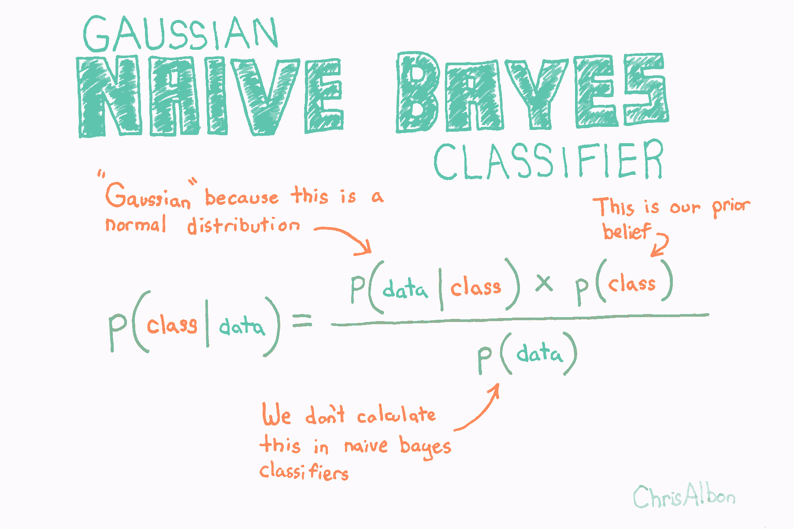

由于正态分布的假设，高斯朴素贝叶斯最适用于我们所有特征都是连续的情况。

```py
# 加载库
from sklearn import datasets
from sklearn.naive_bayes import GaussianNB

# 加载数据
iris = datasets.load_iris()
X = iris.data
y = iris.target

# 创建高斯朴素贝叶斯对象，带有每个类别的先验概率
clf = GaussianNB(priors=[0.25, 0.25, 0.5])

# 训练模型
model = clf.fit(X, y)

# 创建新的观测
new_observation = [[ 4,  4,  4,  0.4]]

# 预测类别
model.predict(new_observation)

# array([1]) 
```

注意：来自高斯朴素贝叶斯的原始预测概率（使用`predict_proba`输出）未校准。 也就是说，他们不应该是可信的。 如果我们想要创建有用的预测概率，我们将需要使用等渗回归或相关方法来校准它们。

## 多项式逻辑回归

在多项逻辑回归（MLR）中，我们在 Recipe 15.1 中看到的逻辑函数被 softmax 函数替换：

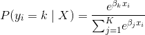

其中 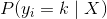 是第  个观测的目标值  是类  的概率， 是类的总数。MLR 的一个实际优点是使用`predict_proba`方法预测的概率更可靠（即校准更好）。

```py
# 加载库
from sklearn.linear_model import LogisticRegression
from sklearn import datasets
from sklearn.preprocessing import StandardScaler

# 加载数据
iris = datasets.load_iris()
X = iris.data
y = iris.target

# 标准化特征
scaler = StandardScaler()
X_std = scaler.fit_transform(X)

# 创建 OVR 逻辑回归对象
clf = LogisticRegression(random_state=0, multi_class='multinomial', solver='newton-cg')

# 训练模型
model = clf.fit(X_std, y)

# 创建新的观测
new_observation = [[.5, .5, .5, .5]]

# 预测类别
model.predict(new_observation)

# array([1]) 

# 查看预测概率
model.predict_proba(new_observation)

# array([[ 0.01944996,  0.74469584,  0.2358542 ]]) 
```

## 多项式朴素贝叶斯分类器

多项式朴素贝叶斯的工作方式类似于高斯朴素贝叶斯，但假设这些特征是多项式分布的。 在实践中，这意味着当我们具有离散数据（例如，电影评级范围为 1 到 5）时，通常使用该分类器。

```py
# 加载库
import numpy as np
from sklearn.naive_bayes import MultinomialNB
from sklearn.feature_extraction.text import CountVectorizer

# 创建文本
text_data = np.array(['I love Brazil. Brazil!',
                      'Brazil is best',
                      'Germany beats both'])

# 创建词袋
count = CountVectorizer()
bag_of_words = count.fit_transform(text_data)

# 创建特征矩阵
X = bag_of_words.toarray()

# 创建目标向量
y = np.array([0,0,1])

# 创建多项式朴素贝叶斯对象，带有每个类别的先验概率
clf = MultinomialNB(class_prior=[0.25, 0.5])

# 训练模型
model = clf.fit(X, y)

# 创建新的观测
new_observation = [[0, 0, 0, 1, 0, 1, 0]]

# 预测新观测的类别
model.predict(new_observation)

# array([0]) 
```

## 从零编写朴素贝叶斯分类器

朴素贝叶斯是一种简单的分类器，当只有少量观测可用时，这种分类器表现良好。 在本教程中，我们将从头开始创建一个高斯朴素贝叶斯分类器，并使用它来预测以前未见过的数据点的类别。本教程基于 Wikipedia 的[朴素贝叶斯分类器页面](https://en.wikipedia.org/wiki/Naive_Bayes_classifier)上的示例，我已经用 Python 实现了它并调整了一些符号来改进解释。

```py
import pandas as pd
import numpy as np
```

我们的数据集包含八个个体的数据。 我们将使用数据集构建一个分类器，该分类器接收个体的身高，体重和脚码，并输出其性别预测。

```py
# 创建空数据帧
data = pd.DataFrame()

# 创建我们的目标变量
data['Gender'] = ['male','male','male','male','female','female','female','female']

# 创建我们的特征变量
data['Height'] = [6,5.92,5.58,5.92,5,5.5,5.42,5.75]
data['Weight'] = [180,190,170,165,100,150,130,150]
data['Foot_Size'] = [12,11,12,10,6,8,7,9]

# 查看数据
data
```

|  | Gender | Height | Weight | Foot_Size |
| --- | --- | --- | --- | --- |
| 0 | male | 6.00 | 180 | 12 |
| 1 | male | 5.92 | 190 | 11 |
| 2 | male | 5.58 | 170 | 12 |
| 3 | male | 5.92 | 165 | 10 |
| 4 | female | 5.00 | 100 | 6 |
| 5 | female | 5.50 | 150 | 8 |
| 6 | female | 5.42 | 130 | 7 |
| 7 | female | 5.75 | 150 | 9 |

上面的数据集用于构造我们的分类器。 下面我们将创建一个新的个体，我们知道它的特征值，但不知道它的性别。我们的目标是预测它的性别。

```py
# 创建空数据帧
person = pd.DataFrame()

# 为这一行创建相同特征值
person['Height'] = [6]
person['Weight'] = [130]
person['Foot_Size'] = [8]

# 查看数据
person
```

|  | Height | Weight | Foot_Size |
| --- | --- | --- | --- |
| 0 | 6 | 130 | 8 |

贝叶斯定理是一个着名的方程，它允许我们根据数据进行预测。 这是贝叶斯定理的经典版本：

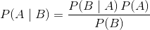

这可能过于抽象，所以让我们替换一些变量以使其更具体。 在贝叶斯分类器中，给定数据的情况下，我们有兴趣找出观测的类别（例如男性或女性，垃圾邮件或非垃圾邮件）：

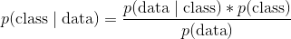

其中：

*   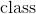 是特定类别（例如男性）
*    是观测的数据
*   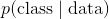 称为后验
*   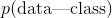 叫做似然
*   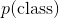 叫做先验
*   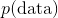 叫做边缘概率

在贝叶斯分类器中，我们计算每个观测的每个类的后验（严格来说，我们只计算后验的分子，但现在忽略它）。 然后，基于后验值最大的类别对观测分类。 在我们的例子中，我们为观测预测两个可能的类别（例如男性和女性），因此我们将计算两个后验：一个用于男性，一个用于女性。


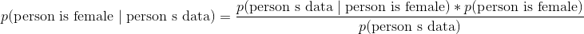

高斯朴素的贝叶斯可能是最受欢迎的贝叶斯分类器。 为了解释这个名称的含义，让我们看一下当我们应用两个类别（男性和女性）和三个特征变量（高度，重量和尺寸）时贝叶斯方程式的样子：

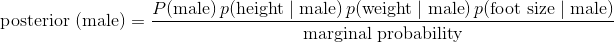

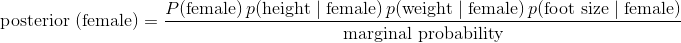

现在让我们解释一下上面的方程式：

*   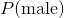 是先验概率。正如你所看到的，只是观测是男性的概率。 这只是数据集中的男性数量除以数据集中的总人数。
*   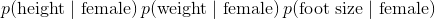 是似然。注意我们已经解释了  所以它现在是数据集中的每个特征。“高斯”和“朴素”来自似然中的两个假设：
    1.  如果你查看似然中的每项，你会注意到，我们假设每个特征彼此不相关。 也就是说，脚码与体重或身高等无关。这显然不是真的，而且是一个“朴素”的假设 - 因此称为“朴素贝叶斯”。
    2.  其次，我们假设特征的值（例如女性的身体，女性的体重）通常是高斯分布的。这意味着 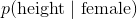 是通过将所需参数输入正态分布的概率密度函数来计算的：

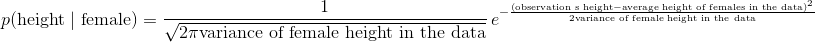

*   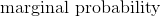 可能是贝叶斯方法中最令人困惑的部分之一。 在玩具示例（包括我们的）中，完全可以计算边际概率。 但是，在许多实际情况中，要找到边际概率的值极其困难或不可能（解释为什么超出了本教程的范围）。 对于我们的分类器来说，这并不像你想象的那么严重。 为什么？ 因为我们不关心真正的后验值是什么，我们只关心哪个类具有最高的后验值。 并且因为边际概率对于所有类别都是相同的，（1）我们可以忽略分母，（2）只计算每个类的后验分子，（3）选择最大的分子。 也就是说，我们可以忽略后验分母，并仅根据后验分子的相对值进行预测。

好的！ 理论结束。 现在让我们开始计算贝叶斯方程的所有不同部分。

先验可以是常数或概率分布。 在我们的例子中，这只是性别的概率。计算这很简单：

```py
# 男性数量
n_male = data['Gender'][data['Gender'] == 'male'].count()

# 女性数量
n_female = data['Gender'][data['Gender'] == 'female'].count()

# 总行数
total_ppl = data['Gender'].count()

# 男性比例
P_male = n_male/total_ppl

# 女性比例
P_female = n_female/total_ppl
```

请记住，我们的似然中的每一项（例如 ）都可以看做正态的 PDF。 例如：


这意味着对于每个类别（例如女性）和特征（例如身高）组合，我们需要从数据计算方差和均值。Pandas 让这很容易：

```py
# 按性别分组数据，并计算每个特征的均值
data_means = data.groupby('Gender').mean()

# 查看值
data_means
```

|  | Height | Weight | Foot_Size |
| --- | --- | --- | --- |
| Gender |  |  |  |
| female | 5.4175 | 132.50 | 7.50 |
| male | 5.8550 | 176.25 | 11.25 |

```py
# 按性别分组数据，并计算每个特征的方差
data_variance = data.groupby('Gender').var()

# 查看值
data_variance
```

|  | Height | Weight | Foot_Size |
| --- | --- | --- | --- |
| Gender |  |  |  |
| female | 0.097225 | 558.333333 | 1.666667 |
| male | 0.035033 | 122.916667 | 0.916667 |

现在我们可以创建我们需要的所有变量。 下面的代码可能看起来很复杂，但我们所做的，只是从上面两个表中的每个单元格中创建一个变量。

```py
# 男性的均值
male_height_mean = data_means['Height'][data_variance.index == 'male'].values[0]
male_weight_mean = data_means['Weight'][data_variance.index == 'male'].values[0]
male_footsize_mean = data_means['Foot_Size'][data_variance.index == 'male'].values[0]

# 男性的方差
male_height_variance = data_variance['Height'][data_variance.index == 'male'].values[0]
male_weight_variance = data_variance['Weight'][data_variance.index == 'male'].values[0]
male_footsize_variance = data_variance['Foot_Size'][data_variance.index == 'male'].values[0]

# Means for female
female_height_mean = data_means['Height'][data_variance.index == 'female'].values[0]
female_weight_mean = data_means['Weight'][data_variance.index == 'female'].values[0]
female_footsize_mean = data_means['Foot_Size'][data_variance.index == 'female'].values[0]

# Variance for female
female_height_variance = data_variance['Height'][data_variance.index == 'female'].values[0]
female_weight_variance = data_variance['Weight'][data_variance.index == 'female'].values[0]
female_footsize_variance = data_variance['Foot_Size'][data_variance.index == 'female'].values[0]
```

最后，我们需要创建一个函数来计算每个似然项的概率密度（例如 ）。

```py
# 创建计算 p(x | y) 的函数
def p_x_given_y(x, mean_y, variance_y):

    # 将参数输入到概率密度函数
    p = 1/(np.sqrt(2*np.pi*variance_y)) * np.exp((-(x-mean_y)**2)/(2*variance_y))

    # 返回 p
    return p
```

好的！ 我们的贝叶斯分类器准备就绪。 请记住，既然我们可以忽略边际概率（分母），我们实际计算的是：

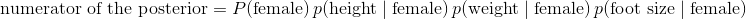

为此，我们只需要插入未分类个体（`height = 6`）的值，数据集的变量（例如女性身高的均值）和我们上面编写的函数（`p_x_given_y`）：

```py
# 如果未分类的观测是男性的后验分子
P_male * \
p_x_given_y(person['Height'][0], male_height_mean, male_height_variance) * \
p_x_given_y(person['Weight'][0], male_weight_mean, male_weight_variance) * \
p_x_given_y(person['Foot_Size'][0], male_footsize_mean, male_footsize_variance)

# 6.1970718438780782e-09 
```

```py
# 如果未分类的观测是女性的后验分子
P_female * \
p_x_given_y(person['Height'][0], female_height_mean, female_height_variance) * \
p_x_given_y(person['Weight'][0], female_weight_mean, female_weight_variance) * \
p_x_given_y(person['Foot_Size'][0], female_footsize_mean, female_footsize_variance)

# 0.00053779091836300176 
```

因为女性的后验分子大于男性，所以我们预测这个人是女性。
