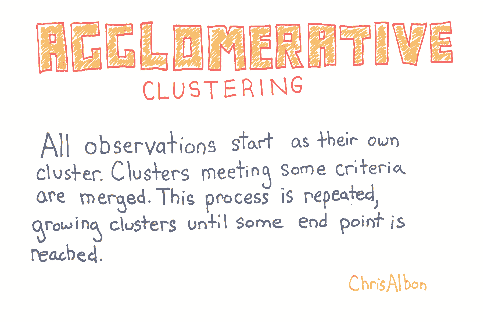
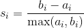
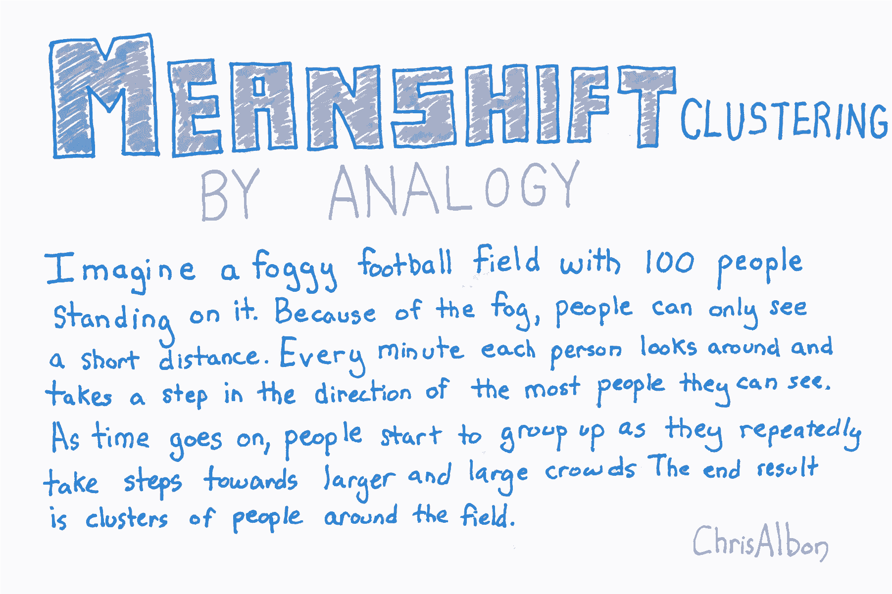
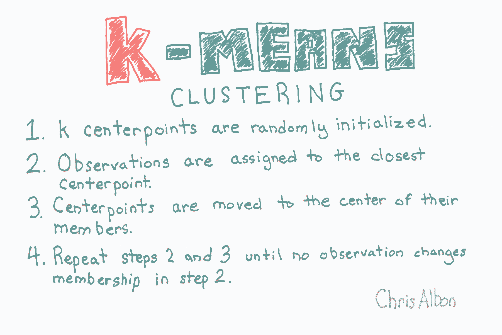

# 十七、聚类

> 作者：[Chris Albon](https://chrisalbon.com/)
> 
> 译者：[飞龙](https://github.com/wizardforcel)
> 
> 协议：[CC BY-NC-SA 4.0](http://creativecommons.org/licenses/by-nc-sa/4.0/)

## 凝聚聚类



```py
# 加载库
from sklearn import datasets
from sklearn.preprocessing import StandardScaler
from sklearn.cluster import AgglomerativeClustering

# 加载数据
iris = datasets.load_iris()
X = iris.data

# 标准化特征
scaler = StandardScaler()
X_std = scaler.fit_transform(X)
```

在 scikit-learn 中，`AgglomerativeClustering`使用`linkage`参数来确定合并策略，来最小化（1）合并簇的方差（`ward`），（2）来自簇对的观测点的距离均值（`average`） ，或（3）来自簇对的观测之间的最大距离（`complete`）。

其他两个参数很有用。 首先，`affinity`参数确定用于`linkage`的距离度量（`minkowski`，`euclidean`等）。 其次，`n_clusters`设置聚类算法将尝试查找的聚类数。 也就是说，簇被连续合并，直到只剩下`n_clusters`。

```py
# 创建聚类对象
clt = AgglomerativeClustering(linkage='complete', 
                              affinity='euclidean', 
                              n_clusters=3)

# 训练模型
model = clt.fit(X_std)

# 展示簇的成员
model.labels_

'''
array([1, 1, 1, 1, 1, 1, 1, 1, 1, 1, 1, 1, 1, 1, 1, 1, 1, 1, 1, 1, 1, 1, 1,
       1, 1, 1, 1, 1, 1, 1, 1, 1, 1, 1, 1, 1, 1, 1, 1, 1, 1, 2, 1, 1, 1, 1,
       1, 1, 1, 1, 0, 0, 0, 2, 0, 2, 0, 2, 0, 2, 2, 0, 2, 0, 0, 0, 0, 2, 2,
       2, 0, 0, 0, 0, 0, 0, 0, 0, 0, 2, 2, 2, 2, 0, 0, 0, 0, 2, 0, 2, 2, 0,
       2, 2, 2, 0, 0, 0, 2, 2, 0, 0, 0, 0, 0, 0, 2, 0, 0, 0, 0, 0, 0, 0, 0,
       0, 0, 0, 0, 2, 0, 0, 0, 0, 0, 0, 0, 0, 0, 0, 0, 0, 0, 0, 0, 0, 0, 0,
       0, 0, 0, 0, 0, 0, 0, 0, 0, 0, 0, 0]) 
'''
```

## DBSCAN 聚类


```py
# 加载库
from sklearn import datasets
from sklearn.preprocessing import StandardScaler
from sklearn.cluster import DBSCAN

# 加载数据
iris = datasets.load_iris()
X = iris.data

# 标准化特征
scaler = StandardScaler()
X_std = scaler.fit_transform(X)
```

`DBSCAN`有三个要设置的主要参数：

*   `eps`: 观测到被认为是邻居的另一个观测的最大距离
*   `min_samples`: 小于上面的`eps`距离的最小观测数量
*   `metric`: `eps`使用的距离度量。 例如，`minkowski`，`euclidean`等（请注意，如果使用 Minkowski 距离，参数`p`可用于设置 Minkowski 度量的指数）

如果我们在训练数据中查看簇，我们可以看到已经识别出两个簇，“0”和“1”，而异常观测被标记为“-1”。

```py
# 创建 DBSCAN 对象
clt = DBSCAN(n_jobs=-1)

# 训练模型
model = clt.fit(X_std)
```

## 评估聚类

```py
import numpy as np
from sklearn.metrics import silhouette_score
from sklearn import datasets
from sklearn.cluster import KMeans
from sklearn.datasets import make_blobs

# 生成特征矩阵
X, _ = make_blobs(n_samples = 1000,
                  n_features = 10,
                  centers = 2,
                  cluster_std = 0.5,
                  shuffle = True,
                  random_state = 1)

# 使用 k-means 来对数据聚类
model = KMeans(n_clusters=2, random_state=1).fit(X)

# 获取预测的类别
y_hat = model.labels_
```

正式地，第  个观测的轮廓系数是：



其中  是观测  的轮廓系数， 是  和同类的所有观测值之间的平均距离，而  是  和不同类的所有观测的平均距离的最小值。`silhouette_score`返回的值是所有观测值的平均轮廓系数。 轮廓系数介于 -1 和 1 之间，其中 1 表示密集，分离良好的聚类。

```py
# 评估模型
silhouette_score(X, y_hat)

# 0.89162655640721422 
```

## 均值移动聚类



```py
# 加载库
from sklearn import datasets
from sklearn.preprocessing import StandardScaler
from sklearn.cluster import MeanShift

# 加载数据
iris = datasets.load_iris()
X = iris.data

# 标准化特征
scaler = StandardScaler()
X_std = scaler.fit_transform(X)
```

`MeanShift`有两个我们应该注意的重要参数。 首先，`bandwidth`设置区域（即观测核）半径，用于确定移动方向。 在我们的比喻中，带宽是一个人可以在雾中看到的距离。 我们可以手动设置此参数，但默认情况下会自动估算合理的带宽（计算成本会显着增加）。 其次，有时在均值移动中，观测核中没有其他观测结果。 也就是说，我们足球上的一个人看不到任何其它人。 默认情况下，`MeanShift`将所有这些“孤例”观测值分配给最近观测核。 但是，如果我们想要留出这些孤例，我们可以设置`cluster_all = False`，其中孤例观测标签为 -1。

```py
# 创建 MeanShift 对象
clt = MeanShift(n_jobs=-1)

# 训练模型
model = clt.fit(X_std)
```

## 小批量 KMeans 聚类

小批量 k-means 的工作方式与上一个方案中讨论的 k-means 算法类似。 没有太多细节，不同之处在于，在小批量 k-means中，计算成本最高的步骤仅在随机的观测样本上进行，而不是所有观测。 这种方法可以显着减少算法发现收敛（即适合数据）所需的时间，而质量成本很低。

```py
# 加载库
from sklearn import datasets
from sklearn.preprocessing import StandardScaler
from sklearn.cluster import MiniBatchKMeans

# 加载数据
iris = datasets.load_iris()
X = iris.data

# 标准化特征
scaler = StandardScaler()
X_std = scaler.fit_transform(X)
```

`MiniBatchKMeans`与`KMeans`的工作方式类似，有一个显着性差异：`batch_size`参数。 `batch_size`控制每批中随机选择的观测数。 批量越大，训练过程的计算成本就越高。

```py
# 创建 KMeans 对象
clustering = MiniBatchKMeans(n_clusters=3, random_state=0, batch_size=100)

# 训练模型
model = clustering.fit(X_std)
```

## KMeans 聚类



```py
# 加载库
from sklearn import datasets
from sklearn.preprocessing import StandardScaler
from sklearn.cluster import KMeans

# 加载数据
iris = datasets.load_iris()
X = iris.data

# 标准化特征
scaler = StandardScaler()
X_std = scaler.fit_transform(X)

# 创建 KMeans 对象
clt = KMeans(n_clusters=3, random_state=0, n_jobs=-1)

# 训练模型
model = clt.fit(X_std)

# 查看预测类别
model.labels_

'''
array([1, 1, 1, 1, 1, 1, 1, 1, 1, 1, 1, 1, 1, 1, 1, 1, 1, 1, 1, 1, 1, 1, 1,
       1, 1, 1, 1, 1, 1, 1, 1, 1, 1, 1, 1, 1, 1, 1, 1, 1, 1, 1, 1, 1, 1, 1,
       1, 1, 1, 1, 0, 0, 0, 2, 2, 2, 0, 2, 2, 2, 2, 2, 2, 2, 2, 0, 2, 2, 2,
       2, 0, 2, 2, 2, 2, 0, 0, 0, 2, 2, 2, 2, 2, 2, 2, 0, 0, 2, 2, 2, 2, 2,
       2, 2, 2, 2, 2, 2, 2, 2, 0, 2, 0, 0, 0, 0, 2, 0, 0, 0, 0, 0, 0, 2, 2,
       0, 0, 0, 0, 2, 0, 2, 0, 2, 0, 0, 2, 0, 0, 0, 0, 0, 0, 2, 2, 0, 0, 0,
       2, 0, 0, 0, 2, 0, 0, 0, 2, 0, 0, 2], dtype=int32) 
'''

# 创建新的观测
new_observation = [[0.8, 0.8, 0.8, 0.8]]

# 预测观测的类别
model.predict(new_observation)

# array([0], dtype=int32) 

# 查看簇中心
model.cluster_centers_

'''
array([[ 1.13597027,  0.09659843,  0.996271  ,  1.01717187],
       [-1.01457897,  0.84230679, -1.30487835, -1.25512862],
       [-0.05021989, -0.88029181,  0.34753171,  0.28206327]]) 
'''
```