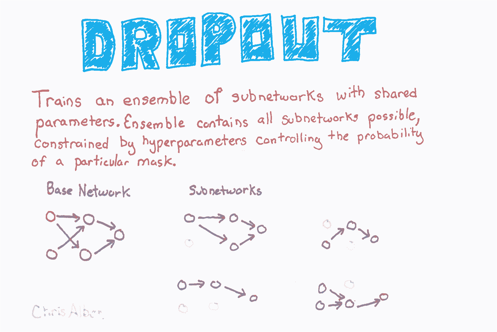
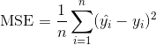
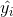

# 十八、Keras

> 作者：[Chris Albon](https://chrisalbon.com/)
> 
> 译者：[飞龙](https://github.com/wizardforcel)
> 
> 协议：[CC BY-NC-SA 4.0](http://creativecommons.org/licenses/by-nc-sa/4.0/)

## 添加丢弃



```py
# 加载库
import numpy as np
from keras.datasets import imdb
from keras.preprocessing.text import Tokenizer
from keras import models
from keras import layers

# 设置随机数种子
np.random.seed(0)

# 使用 TensorFlow 后端

# 设置我们想要的特征数量
number_of_features = 1000

# 从电影评论数据加载数据和目标向量
(train_data, train_target), (test_data, test_target) = imdb.load_data(num_words=number_of_features)

# 将电影评论数据转换为单热编码的特征矩阵
tokenizer = Tokenizer(num_words=number_of_features)
train_features = tokenizer.sequences_to_matrix(train_data, mode='binary')
test_features = tokenizer.sequences_to_matrix(test_data, mode='binary')
```

在 Keras 中，我们可以通过在我们的网络架构中添加`Dropout`层来实现丢弃。 每个`Dropout`层将丢弃每批中的一定数量的上一层单元，它是由用户定义的超参数。 请记住，在 Keras 中，输入层被假定为第一层，而不是使用`add`添加。 因此，如果我们想要将丢弃添加到输入层，我们在其中添加的图层是一个丢弃层。 该层包含输入层单元的比例，即`0.2`和`input_shape`，用于定义观测数据的形状。 接下来，在每个隐藏层之后添加一个带有`0.5`的丢弃层。

```py
# 创建神经网络
network = models.Sequential()

# 为输入层添加丢弃层
network.add(layers.Dropout(0.2, input_shape=(number_of_features,)))

# 添加带有 ReLU 激活函数的全连接层
network.add(layers.Dense(units=16, activation='relu'))

# 为先前的隐藏层添加丢弃层
network.add(layers.Dropout(0.5))

# 添加带有 ReLU 激活函数的全连接层
network.add(layers.Dense(units=16, activation='relu'))

# 为先前的隐藏层添加丢弃层
network.add(layers.Dropout(0.5))

# 添加带有 Sigmoid 激活函数的全连接层
network.add(layers.Dense(units=1, activation='sigmoid'))

# 编译神经网络
network.compile(loss='binary_crossentropy', # 交叉熵
                optimizer='rmsprop', # RMSProp
                metrics=['accuracy']) # 准确率表现度量

# 训练神经网络
history = network.fit(train_features, # 特征
                      train_target, # 目标向量
                      epochs=3, # 迭代数量
                      verbose=0, # 无输出
                      batch_size=100, # 每个批量的观测数量
                      validation_data=(test_features, test_target)) # 用于评估的数据
```

## 卷积神经网络

```py
import numpy as np
from keras.datasets import mnist
from keras.models import Sequential
from keras.layers import Dense, Dropout, Flatten
from keras.layers.convolutional import Conv2D, MaxPooling2D
from keras.utils import np_utils
from keras import backend as K 

# 设置颜色通道值优先
K.set_image_data_format('channels_first')

# 设置种子
np.random.seed(0)

# 使用 TensorFlow 后端

# 设置图像信息
channels = 1
height = 28
width = 28

# 从 MNIST 数据集加载数据和目标
(train_data, train_target), (test_data, test_target) = mnist.load_data()

# 将训练图像数据的形状变为特征
train_data = train_data.reshape(train_data.shape[0], channels, height, width)

# 将测试图像数据的形状变为特征
test_data = test_data.reshape(test_data.shape[0], channels, height, width)

# 将像素缩放到 0 和 1 之间
train_features = train_data / 255
test_features = test_data / 255

# 将目标单热编码
train_target = np_utils.to_categorical(train_target)
test_target = np_utils.to_categorical(test_target)
number_of_classes = test_target.shape[1]
```

卷积神经网络（也称为 ConvNets）是一种流行的网络类型，已被证明在计算机视觉上非常有效（例如识别猫狗，飞机甚至热狗）。前馈神经网络完全可以在图像上使用，其中每个像素都是一个特征。 但是，这样做时我们遇到了两个主要问题。

首先，前馈神经网络不考虑像素的空间结构。 例如，在 10x10 的像素图像中，我们可以将其转换为 100 个像素特征的矢量，并且在这种情况下，前馈将认为第一特征（例如像素值）与第十个和第十一个特征具有相同的关系。 然而，实际上，第 10 个特征表示第一个特征的远侧的像素，而第 11 个特征表示紧邻第一个特征的像素。

其次，与之相关，前馈神经网络学习特征中的全局关系而不是局部规律。 在更实际的术语中，这意味着前馈神经网络无法检测到对象，无论它出现在图像中哪个位置。 例如，假设我们正在训练神经网络识别面部，这些面部可能出现在图像的任何位置，从右上角到中间到左下角。 卷积神经网络的威力就是它们处理这两个问题（和其他问题）的能力。

```py
# 创建神经网络
network = Sequential()

# 添加卷积层，带有 64 个过滤器
# 5x5 窗口和 ReLU 激活函数
network.add(Conv2D(filters=64, kernel_size=(5, 5), input_shape=(channels, width, height), activation='relu'))

# 添加带有 2x2 窗口的最大池化层
network.add(MaxPooling2D(pool_size=(2, 2)))

# 添加丢弃层
network.add(Dropout(0.5))

# 添加展开输入的层
network.add(Flatten())

# 添加带有 ReLU 激活函数的 128 个单元的全连接层
network.add(Dense(128, activation='relu'))

# 添加丢弃层
network.add(Dropout(0.5))

# 添加带有 softmax 激活函数的全连接层
network.add(Dense(number_of_classes, activation='softmax'))

# 编译神经网络
network.compile(loss='categorical_crossentropy', # 交叉熵
                optimizer='rmsprop', # RMSProp
                metrics=['accuracy']) # 准确率表现度量

# 训练神经网络
network.fit(train_features, # 特征
            train_target, # 目标
            epochs=2, # 迭代数量
            verbose=0, # 不要在每个迭代之后打印描述
            batch_size=1000, # 每个批量的观测数
            validation_data=(test_features, test_target)) # 用于评估的数据

# <keras.callbacks.History at 0x103f9b8d0> 
```

## 用于二分类的前馈神经网络

```py
# 加载库
import numpy as np
from keras.datasets import imdb
from keras.preprocessing.text import Tokenizer
from keras import models
from keras import layers

# 设置随机数种子
np.random.seed(0)

# 使用 TensorFlow 后端

# 设置我们希望的特征数
number_of_features = 1000

# 从电影评论数据集加载数据和目标向量
(train_data, train_target), (test_data, test_target) = imdb.load_data(num_words=number_of_features)

# 将电影评论数据转换为单热编码的特征矩阵
tokenizer = Tokenizer(num_words=number_of_features)
train_features = tokenizer.sequences_to_matrix(train_data, mode='binary')
test_features = tokenizer.sequences_to_matrix(test_data, mode='binary')
```

因为这是二元分类问题，所以一种常见的选择是在单个单元的输出层中使用 sigmoid 激活函数。

```py
# 创建神经网络
network = models.Sequential()

# 添加带有 ReLU 激活函数的全连接层
network.add(layers.Dense(units=16, activation='relu', input_shape=(number_of_features,)))

# 添加带有 ReLU 激活函数的全连接层
network.add(layers.Dense(units=16, activation='relu'))

# 添加带有 Sigmoid 激活函数的全连接层
network.add(layers.Dense(units=1, activation='sigmoid'))

# 编译神经网络
network.compile(loss='binary_crossentropy', # 交叉熵
                optimizer='rmsprop', # RMSProp
                metrics=['accuracy']) # 准确率表现度量
```

在Keras，我们使用`fit`方法训练我们的神经网络。 需要定义六个重要参数。 前两个参数是训练数据的特征和目标向量。

`epochs`参数定义训练数据时要使用的迭代数。 `verbose`确定在训练过程中输出多少信息，`0`没有输出，`1`输出进度条，`2`在每个迭代输出一行日志。 `batch_size`设置在更新参数之前通过网络传播的观测数。

最后，我们提供了一组用于评估模型的测试数据。 这些测试特征和目标向量可以是`validation_data`的参数，它们将使用它们进行评估。 或者，我们可以使用`validation_split`来定义，我们想要进行评估训练数据的哪一部分。

在 scikit-learn 中`fit`方法返回一个训练好的模型，但是在 Keras 中，`fit`方法返回一个`History`对象，包含每个迭代的损失值和表现指标。

```py
# 训练神经网络
history = network.fit(train_features, # 特征
                      train_target, # 目标向量
                      epochs=3, # 迭代数量
                      verbose=1, # 每个迭代之后打印描述
                      batch_size=100, # 每个批量的观测数
                      validation_data=(test_features, test_target)) # 用于评估的数据

'''
Train on 25000 samples, validate on 25000 samples
Epoch 1/3
25000/25000 [==============================] - 2s - loss: 0.4215 - acc: 0.8102 - val_loss: 0.3385 - val_acc: 0.8558
Epoch 2/3
25000/25000 [==============================] - 1s - loss: 0.3241 - acc: 0.8646 - val_loss: 0.3261 - val_acc: 0.8626
Epoch 3/3
25000/25000 [==============================] - 2s - loss: 0.3120 - acc: 0.8700 - val_loss: 0.3268 - val_acc: 0.8593 
'''
```

## 用于多分类的前馈神经网络

```py
# 加载库
import numpy as np
from keras.datasets import reuters
from keras.utils.np_utils import to_categorical
from keras.preprocessing.text import Tokenizer
from keras import models
from keras import layers

# 设置随机数种子
np.random.seed(0)

# 使用 TensorFlow 后端

# 设置我们希望的特征数
number_of_features = 5000

# 加载特征和目标数据
(train_data, train_target_vector), (test_data, test_target_vector) = reuters.load_data(num_words=number_of_features)

# 将特征数据转换为单热编码的特征矩阵
tokenizer = Tokenizer(num_words=number_of_features)
train_features = tokenizer.sequences_to_matrix(train_data, mode='binary')
test_features = tokenizer.sequences_to_matrix(test_data, mode='binary')

# 单热编码目标向量来创建目标矩阵
train_target = to_categorical(train_target_vector)
test_target = to_categorical(test_target_vector)
```

在这个例子中，我们使用适合于多类分类的损失函数，分类交叉熵损失函数，`categorical_crossentropy`。

```py
# 创建神经网络
network = models.Sequential()

# 添加带有 ReLU 激活函数的全连接层
network.add(layers.Dense(units=100, activation='relu', input_shape=(number_of_features,)))

# 添加带有 ReLU 激活函数的全连接层
network.add(layers.Dense(units=100, activation='relu'))

# 添加带有 Softmax 激活函数的全连接层
network.add(layers.Dense(units=46, activation='softmax'))

# 编译神经网络
network.compile(loss='categorical_crossentropy', # 交叉熵
                optimizer='rmsprop', # RMSProp
                metrics=['accuracy']) # 准确率表现度量

# 训练神经网络
history = network.fit(train_features, # 特征
                      train_target, # 目标向量
                      epochs=3, # 三个迭代
                      verbose=0, # 没有输出
                      batch_size=100, # 每个批量的观测数
                      validation_data=(test_features, test_target)) # 用于评估的数据
```

## 用于回归的前馈神经网络

```py
# 加载库
import numpy as np
from keras.preprocessing.text import Tokenizer
from keras import models
from keras import layers
from sklearn.datasets import make_regression
from sklearn.model_selection import train_test_split
from sklearn import preprocessing

# 设置随机数种子
np.random.seed(0)

# 使用 TensorFlow 后端

# 生成特征矩阵和目标向量
features, target = make_regression(n_samples = 10000,
                                   n_features = 3,
                                   n_informative = 3,
                                   n_targets = 1,
                                   noise = 0.0,
                                   random_state = 0)

# 将我们的数据划分为训练和测试集
train_features, test_features, train_target, test_target = train_test_split(features, 
                                                                            target, 
                                                                            test_size=0.33, 
                                                                            random_state=0)

# 创建神经网络
network = models.Sequential()

# 添加带有 ReLU 激活函数的全连接层
network.add(layers.Dense(units=32, activation='relu', input_shape=(train_features.shape[1],)))

# 添加带有 ReLU 激活函数的全连接层
network.add(layers.Dense(units=32, activation='relu'))

# 添加没有激活函数的全连接层
network.add(layers.Dense(units=1))
```

因为我们正在训练回归，所以我们应该使用适当的损失函数和评估度量，在我们的例子中是均方误差：



其中  是观测数量， 是我们试图预测的目标  对于观测  的真实值，  是  的模型预测值。

```py
# 编译神经网络
network.compile(loss='mse', # MSE
                optimizer='RMSprop', # 优化算法
                metrics=['mse']) # MSE

# 训练神经网络
history = network.fit(train_features, # 特征
                      train_target, # 目标向量
                      epochs=10, # 迭代数量
                      verbose=0, # 无输出
                      batch_size=100, # 每个批量的观测数
                      validation_data=(test_features, test_target)) # 用于评估的数据
```

## LSTM 循环神经网络

通常我们拥有我们想要分类的文本数据。 虽然可以使用一种卷积网络，但我们将专注于一种更流行的选择：循环神经网络。循环神经网络的关键特征，是信息在网络中循环。 这为循环神经网络提供了一种存储器，可用于更好地理解序列数据。流行的循环神经网络类型是长期短期记忆（LSTM）网络，它允许信息在网络中向后循环。

```py
# 加载库
import numpy as np
from keras.datasets import imdb
from keras.preprocessing import sequence
from keras import models
from keras import layers

# 设置随机数种子
np.random.seed(0)

# 使用 TensorFlow 后端

# 设置我们希望的特征数
number_of_features = 1000

# 从电影评论数据集加载数据和目标向量
(train_data, train_target), (test_data, test_target) = imdb.load_data(num_words=number_of_features)

# 使用填充或者截断，使每个观测具有 400 个特征
train_features = sequence.pad_sequences(train_data, maxlen=400)
test_features = sequence.pad_sequences(test_data, maxlen=400)

# 查看第一个观测
print(train_data[0])

'''
[1, 14, 22, 16, 43, 530, 973, 2, 2, 65, 458, 2, 66, 2, 4, 173, 36, 256, 5, 25, 100, 43, 838, 112, 50, 670, 2, 9, 35, 480, 284, 5, 150, 4, 172, 112, 167, 2, 336, 385, 39, 4, 172, 2, 2, 17, 546, 38, 13, 447, 4, 192, 50, 16, 6, 147, 2, 19, 14, 22, 4, 2, 2, 469, 4, 22, 71, 87, 12, 16, 43, 530, 38, 76, 15, 13, 2, 4, 22, 17, 515, 17, 12, 16, 626, 18, 2, 5, 62, 386, 12, 8, 316, 8, 106, 5, 4, 2, 2, 16, 480, 66, 2, 33, 4, 130, 12, 16, 38, 619, 5, 25, 124, 51, 36, 135, 48, 25, 2, 33, 6, 22, 12, 215, 28, 77, 52, 5, 14, 407, 16, 82, 2, 8, 4, 107, 117, 2, 15, 256, 4, 2, 7, 2, 5, 723, 36, 71, 43, 530, 476, 26, 400, 317, 46, 7, 4, 2, 2, 13, 104, 88, 4, 381, 15, 297, 98, 32, 2, 56, 26, 141, 6, 194, 2, 18, 4, 226, 22, 21, 134, 476, 26, 480, 5, 144, 30, 2, 18, 51, 36, 28, 224, 92, 25, 104, 4, 226, 65, 16, 38, 2, 88, 12, 16, 283, 5, 16, 2, 113, 103, 32, 15, 16, 2, 19, 178, 32] 
'''

# 查看第一个观测
test_features[0]

'''
array([  0,   0,   0,   0,   0,   0,   0,   0,   0,   0,   0,   0,   0,
         0,   0,   0,   0,   0,   0,   0,   0,   0,   0,   0,   0,   0,
         0,   0,   0,   0,   0,   0,   0,   0,   0,   0,   0,   0,   0,
         0,   0,   0,   0,   0,   0,   0,   0,   0,   0,   0,   0,   0,
         0,   0,   0,   0,   0,   0,   0,   0,   0,   0,   0,   0,   0,
         0,   0,   0,   0,   0,   0,   0,   0,   0,   0,   0,   0,   0,
         0,   0,   0,   0,   0,   0,   0,   0,   0,   0,   0,   0,   0,
         0,   0,   0,   0,   0,   0,   0,   0,   0,   0,   0,   0,   0,
         0,   0,   0,   0,   0,   0,   0,   0,   0,   0,   0,   0,   0,
         0,   0,   0,   0,   0,   0,   0,   0,   0,   0,   0,   0,   0,
         0,   0,   0,   0,   0,   0,   0,   0,   0,   0,   0,   0,   0,
         0,   0,   0,   0,   0,   0,   0,   0,   0,   0,   0,   0,   0,
         0,   0,   0,   0,   0,   0,   0,   0,   0,   0,   0,   0,   0,
         0,   0,   0,   0,   0,   0,   0,   0,   0,   0,   0,   0,   0,
         0,   0,   0,   0,   0,   0,   0,   0,   0,   0,   0,   0,   0,
         0,   0,   0,   0,   0,   0,   0,   0,   0,   0,   0,   0,   0,
         0,   0,   0,   0,   0,   0,   0,   0,   0,   0,   0,   0,   0,
         0,   0,   0,   0,   0,   0,   0,   0,   0,   0,   0,   0,   0,
         0,   0,   0,   0,   0,   0,   0,   0,   0,   0,   0,   0,   0,
         0,   0,   0,   0,   0,   0,   0,   0,   0,   0,   0,   0,   0,
         0,   0,   0,   0,   0,   0,   0,   0,   0,   0,   0,   0,   0,
         0,   0,   0,   0,   0,   0,   0,   0,   0,   0,   0,   0,   0,
         0,   0,   0,   0,   0,   0,   0,   0,   0,   0,   0,   0,   0,
         0,   0,   0,   0,   0,   0,   0,   0,   0,   0,   0,   0,   0,
         0,   0,   0,   0,   0,   0,   0,   0,   0,   0,   0,   0,   0,
         0,   0,   0,   1,  89,  27,   2,   2,  17, 199, 132,   5,   2,
        16,   2,  24,   8, 760,   4,   2,   7,   4,  22,   2,   2,  16,
         2,  17,   2,   7,   2,   2,   9,   4,   2,   8,  14, 991,  13,
       877,  38,  19,  27, 239,  13, 100, 235,  61, 483,   2,   4,   7,
         4,  20, 131,   2,  72,   8,  14, 251,  27,   2,   7, 308,  16,
       735,   2,  17,  29, 144,  28,  77,   2,  18,  12], dtype=int32) 
'''

# 创建神经网络
network = models.Sequential()

# 添加嵌入层
network.add(layers.Embedding(input_dim=number_of_features, output_dim=128))

# 添加带有 128 个单元的 LSTM 层
network.add(layers.LSTM(units=128))

# 添加带有 Sigmoid 激活函数的全连接层
network.add(layers.Dense(units=1, activation='sigmoid'))

# 编译神经网络
network.compile(loss='binary_crossentropy', # 交叉熵
                optimizer='Adam', # Adam 优化
                metrics=['accuracy']) # 准确率表现度量

# 训练神经网络
history = network.fit(train_features, # 特征
                      train_target, # 目标
                      epochs=3, # 迭代数量
                      verbose=0, # 不在每个迭代之后打印描述
                      batch_size=1000, # 每个批量的观测数
                      validation_data=(test_features, test_target)) # 用于评估的数据
```

## 神经网络的提前停止

```py
# 加载库
import numpy as np
from keras.datasets import imdb
from keras.preprocessing.text import Tokenizer
from keras import models
from keras import layers
from keras.callbacks import EarlyStopping, ModelCheckpoint

# 设置随机数种子
np.random.seed(0)

# 使用 TensorFlow 后端

# 设置我们希望的特征数
number_of_features = 1000

# 从电影评论数据集加载数据和目标向量
(train_data, train_target), (test_data, test_target) = imdb.load_data(num_words=number_of_features)

# 将电影评论数据转换为单热编码的特征矩阵
tokenizer = Tokenizer(num_words=number_of_features)
train_features = tokenizer.sequences_to_matrix(train_data, mode='binary')
test_features = tokenizer.sequences_to_matrix(test_data, mode='binary')

# 创建神经网络
network = models.Sequential()

# 添加带有 ReLU 激活函数的全连接层
network.add(layers.Dense(units=16, activation='relu', input_shape=(number_of_features,)))

# 添加带有 ReLU 激活函数的全连接层
network.add(layers.Dense(units=16, activation='relu'))

# 添加带有 Sigmoid 激活函数的全连接层
network.add(layers.Dense(units=1, activation='sigmoid'))

# 编译神经网络
network.compile(loss='binary_crossentropy', # 交叉熵
                optimizer='rmsprop', # RMSProp
                metrics=['accuracy']) # 准确率表现度量
```

在 Keras 中，我们可以将提权停止实现为回调函数。 回调是可以在训练过程的某些阶段应用的函数，例如在每个迭代结束时。 具体来说，在我们的解决方案中，我们包含了`EarlyStopping(monitor='val_loss', patience=2)`，来定义我们想要监控每个迭代的测试（验证）损失，并且在两个迭代之后如果测试损失没有改善，训练就中断。 但是，由于我们设置了`patience=2`，我们不会得到最好的模型，而是最佳模型两个时代后的模型。 因此，可选地，我们可以包含第二个操作，`ModelCheckpoint`，它在每个检查点之后将模型保存到文件中（如果由于某种原因中断了多天的训练会话，这可能很有用。如果我们设置`save_best_only = True`，`ModelCheckpoint`将只保存最佳模型，这对我们有帮助。

```py
# 将回调函数设置为提前停止训练，并保存到目前为止最好的模型
callbacks = [EarlyStopping(monitor='val_loss', patience=2),
             ModelCheckpoint(filepath='best_model.h5', monitor='val_loss', save_best_only=True)]

# 训练神经网络
history = network.fit(train_features, # 特征
                      train_target, # 目标向量
                      epochs=20, # 迭代数量
                      callbacks=callbacks, # 提前停止
                      verbose=0, # 每个迭代之后打印描述
                      batch_size=100, # 每个批量的观测数
                      validation_data=(test_features, test_target)) # 用于评估的数据
```

## 神经网络的参数正则化

```py
# 加载库
import numpy as np
from keras.datasets import imdb
from keras.preprocessing.text import Tokenizer
from keras import models
from keras import layers
from keras import regularizers

# 设置随机数种子
np.random.seed(0)

# 使用 TensorFlow 后端

# 设置我们希望的特征数
number_of_features = 1000

# 从电影评论数据集加载数据和目标向量
(train_data, train_target), (test_data, test_target) = imdb.load_data(num_words=number_of_features)

# 将电影评论数据转换为单热编码的特征矩阵
tokenizer = Tokenizer(num_words=number_of_features)
train_features = tokenizer.sequences_to_matrix(train_data, mode='binary')
test_features = tokenizer.sequences_to_matrix(test_data, mode='binary')
```

在 Keras 中，我们可以通过添加带有`kernel_regularizer = regularizers.l2(0.01)`的层，来增加权重正则化。 在这个例子中，`0.01`确定我们如何惩罚更高的参数值。

```py
# 创建神经网络
network = models.Sequential()

# 添加带有 ReLU 激活函数和 L2 正则化的全连接层
network.add(layers.Dense(units=16, 
                         activation='relu', 
                         kernel_regularizer=regularizers.l2(0.01),
                         input_shape=(number_of_features,)))

# 添加带有 ReLU 激活函数和 L2 正则化的全连接层
network.add(layers.Dense(units=16, 
                         kernel_regularizer=regularizers.l2(0.01),
                         activation='relu'))

# 添加带有 Sigmoid 激活函数的全连接层
network.add(layers.Dense(units=1, activation='sigmoid'))# 编译神经网络
network.compile(loss='binary_crossentropy', # 交叉熵
                optimizer='rmsprop', # RMSProp
                metrics=['accuracy']) # 准确率表现度量

# 训练神经网络
history = network.fit(train_features, # 特征
                      train_target, # 目标向量
                      epochs=3, # 迭代数量
                      verbose=0, # 无输出
                      batch_size=100, # 每个批量的观测数
                      validation_data=(test_features, test_target)) # 用于评估的数据
```

## 为神经网络预处理数据

通常，神经网络的参数被初始化（即，创建）为小的随机数。 当特征值远大于参数值时，神经网络通常表现不佳。 此外，由于观测的特征值在通过单个单元时将被组合，因此所有特征具有相同的比例是很重要的。

由于这些原因，最佳实践（尽管并非总是必要的，例如当我们的特征都是二元时）是标准化每个特征，使得特征的值均值为 0 和标准差为 1。这可以使用 scikit-learn 的`StandardScaler`轻松完成。

```py
# 加载库
from sklearn import preprocessing
import numpy as np

# 创建特征
features = np.array([[-100.1, 3240.1], 
                     [-200.2, -234.1], 
                     [5000.5, 150.1], 
                     [6000.6, -125.1], 
                     [9000.9, -673.1]])

# 创建缩放器
scaler = preprocessing.StandardScaler()

# 转换特征
features_standardized = scaler.fit_transform(features)

# 展示特征
features_standardized

'''
array([[-1.12541308,  1.96429418],
       [-1.15329466, -0.50068741],
       [ 0.29529406, -0.22809346],
       [ 0.57385917, -0.42335076],
       [ 1.40955451, -0.81216255]]) 
'''

# 打印均值和标准差
print('Mean:', round(features_standardized[:,0].mean()))
print('Standard deviation:', features_standardized[:,0].std())

'''
Mean: 0.0
Standard deviation: 1.0 
'''
```

# 保存模型的训练过程

```py
# 加载库
import numpy as np
from keras.datasets import imdb
from keras.preprocessing.text import Tokenizer
from keras import models
from keras import layers
from keras.callbacks import ModelCheckpoint

# 设置随机数种子
np.random.seed(0)

# 设置我们希望的特征数
number_of_features = 1000

# 从电影评论数据集加载数据和目标向量
(train_data, train_target), (test_data, test_target) = imdb.load_data(num_words=number_of_features)

# 将电影评论数据转换为单热编码的特征矩阵
tokenizer = Tokenizer(num_words=number_of_features)
train_features = tokenizer.sequences_to_matrix(train_data, mode='binary')
test_features = tokenizer.sequences_to_matrix(test_data, mode='binary')

# 创建神经网络
network = models.Sequential()

# 添加带有 ReLU 激活函数的全连接层
network.add(layers.Dense(units=16, activation='relu', input_shape=(number_of_features,)))

# 添加带有 ReLU 激活函数的全连接层
network.add(layers.Dense(units=16, activation='relu'))

# 添加带有 Sigmoid 激活函数的全连接层
network.add(layers.Dense(units=1, activation='sigmoid'))

# 编译神经网络
network.compile(loss='binary_crossentropy', # 交叉熵
                optimizer='rmsprop', # RMSProp
                metrics=['accuracy']) # 准确率表现度量
```

在每个得带之后，`ModelCheckpoint`将模型保存到`filepath`参数指定的位置。 如果我们只包含一个文件名（例如`models.hdf5`），那么每个迭代都会用最新的模型覆盖该文件。 如果我们只想根据某些损失函数的表现保存最佳模型，我们可以设置`save_best_only = True`和`monitor ='val_loss'`，如果模型的测试损失比以前更差，则不覆盖文件 。 或者，我们可以将每个迭代的模型保存到自己的文件，方法是将迭代编号和测试损失得分包含在文件名本身中。 例如，如果我们将`filepath`设置为`model_{epoch:02d}_{val_loss:.2f}.hdf5`，那么模型的文件名称为 `model_10_0.35.hdf5`（注意迭代编号的索引从 0 开始），它包含第 11 个迭代之后的测试损失值 0.33。

```py
# 将回调函数设置为提前停止训练
# 并保存目前为止最好的模型
checkpoint = [ModelCheckpoint(filepath='models.hdf5')]

# 训练神经网络
history = network.fit(train_features, # 特征
                      train_target, # 目标向量
                      epochs=3, # 迭代数量
                      callbacks=checkpoint, # Checkpoint
                      verbose=0, # 无输出
                      batch_size=100, # 每个批量的观测数
                      validation_data=(test_features, test_target)) # 用于评估的数据
```

# 调优神经网络超参数

```py
# 加载库
import numpy as np
from keras import models
from keras import layers
from keras.wrappers.scikit_learn import KerasClassifier
from sklearn.model_selection import GridSearchCV
from sklearn.datasets import make_classification

# 设置随机数种子
np.random.seed(0)

# 使用 TensorFlow 后端

# 特征数
number_of_features = 100

# 生成特征矩阵和目标向量
features, target = make_classification(n_samples = 10000,
                                       n_features = number_of_features,
                                       n_informative = 3,
                                       n_redundant = 0,
                                       n_classes = 2,
                                       weights = [.5, .5],
                                       random_state = 0)

# 创建返回已编译网络的函数
def create_network(optimizer='rmsprop'):

    # 创建神经网络
    network = models.Sequential()

    # 添加带有 ReLU 激活函数的全连接层
    network.add(layers.Dense(units=16, activation='relu', input_shape=(number_of_features,)))

    # 添加带有 ReLU 激活函数的全连接层
    network.add(layers.Dense(units=16, activation='relu'))

    # 添加带有 Sigmoid 激活函数的全连接层
    network.add(layers.Dense(units=1, activation='sigmoid'))

    # 编译神经网络
    network.compile(loss='binary_crossentropy', # 交叉熵
                    optimizer=optimizer, # 优化器
                    metrics=['accuracy']) # 准确率表现度量

    # 返回编译的网络
    return network

# 包装 Keras 模型，使其能够用于 sklearn
neural_network = KerasClassifier(build_fn=create_network, verbose=0)

# 创建超参数空间
epochs = [5, 10]
batches = [5, 10, 100]
optimizers = ['rmsprop', 'adam']

# 创建超参数选项
hyperparameters = dict(optimizer=optimizers, epochs=epochs, batch_size=batches)

# 创建网格搜索
grid = GridSearchCV(estimator=neural_network, param_grid=hyperparameters)

# 拟合网格搜索
grid_result = grid.fit(features, target)

# 查看神经网络的最佳超参数
grid_result.best_params_

# {'batch_size': 5, 'epochs': 5, 'optimizer': 'rmsprop'} 
```

## 可视化损失历史

```py
# 加载库
import numpy as np
from keras.datasets import imdb
from keras.preprocessing.text import Tokenizer
from keras import models
from keras import layers
import matplotlib.pyplot as plt

# 设置随机数种子
np.random.seed(0)

# 使用 TensorFlow 后端

# 设置我们希望的特征数
number_of_features = 10000

# 从电影评论数据集加载数据和目标向量
(train_data, train_target), (test_data, test_target) = imdb.load_data(num_words=number_of_features)

# 将电影评论数据转换为单热编码的特征矩阵
tokenizer = Tokenizer(num_words=number_of_features)
train_features = tokenizer.sequences_to_matrix(train_data, mode='binary')
test_features = tokenizer.sequences_to_matrix(test_data, mode='binary')

# 创建神经网络
network = models.Sequential()

# 添加带有 ReLU 激活函数的全连接层
network.add(layers.Dense(units=16, activation='relu', input_shape=(number_of_features,)))

# 添加带有 ReLU 激活函数的全连接层
network.add(layers.Dense(units=16, activation='relu'))

# 添加带有 Sigmoid 激活函数的全连接层
network.add(layers.Dense(units=1, activation='sigmoid'))

# 编译神经网络
network.compile(loss='binary_crossentropy', # 交叉熵
                optimizer='rmsprop', # RMSProp
                metrics=['accuracy']) # 准确率表现度量

# 训练神经网络
history = network.fit(train_features, # 特征
                      train_target, # Target
                      epochs=15, # 迭代数量
                      verbose=0, # 无输出
                      batch_size=1000, # 每个批量的观测数
                      validation_data=(test_features, test_target)) # 用于评估的数据

# 得到训练和测试损失历史
training_loss = history.history['loss']
test_loss = history.history['val_loss']

# 创建迭代数量
epoch_count = range(1, len(training_loss) + 1)

# 可视化损失历史
plt.plot(epoch_count, training_loss, 'r--')
plt.plot(epoch_count, test_loss, 'b-')
plt.legend(['Training Loss', 'Test Loss'])
plt.xlabel('Epoch')
plt.ylabel('Loss')
plt.show();
```


## 可视化神经网络架构

```py
# 加载库
from keras import models
from keras import layers
from IPython.display import SVG
from keras.utils.vis_utils import model_to_dot
from keras.utils import plot_model

# 使用 TensorFlow 后端

# 创建神经网络
network = models.Sequential()

# 添加带有 ReLU 激活函数的全连接层
network.add(layers.Dense(units=16, activation='relu', input_shape=(10,)))

# 添加带有 ReLU 激活函数的全连接层
network.add(layers.Dense(units=16, activation='relu'))

# 添加带有 Sigmoid 激活函数的全连接层
network.add(layers.Dense(units=1, activation='sigmoid'))

# 可视化网络架构
SVG(model_to_dot(network, show_shapes=True).create(prog='dot', format='svg'))
```


```py
# 将绘图保存到文件
plot_model(network, show_shapes=True, to_file='network.png')
```

## 可视化表现历史

```py
# 加载库
import numpy as np
from keras.datasets import imdb
from keras.preprocessing.text import Tokenizer
from keras import models
from keras import layers
import matplotlib.pyplot as plt

# 设置随机数种子
np.random.seed(0)

# 使用 TensorFlow 后端

# 设置我们希望的特征数
number_of_features = 10000

# 从电影评论数据集加载数据和目标向量
(train_data, train_target), (test_data, test_target) = imdb.load_data(num_words=number_of_features)

# 将电影评论数据转换为单热编码的特征矩阵
tokenizer = Tokenizer(num_words=number_of_features)
train_features = tokenizer.sequences_to_matrix(train_data, mode='binary')
test_features = tokenizer.sequences_to_matrix(test_data, mode='binary')

# 创建神经网络
network = models.Sequential()

# 添加带有 ReLU 激活函数的全连接层
network.add(layers.Dense(units=16, activation='relu', input_shape=(number_of_features,)))

# 添加带有 ReLU 激活函数的全连接层
network.add(layers.Dense(units=16, activation='relu'))

# 添加带有 Sigmoid 激活函数的全连接层
network.add(layers.Dense(units=1, activation='sigmoid'))

# 编译神经网络
network.compile(loss='binary_crossentropy', # 交叉熵
                optimizer='rmsprop', # RMSProp
                metrics=['accuracy']) # 准确率表现度量

# 训练神经网络
history = network.fit(train_features, # 特征
                      train_target, # Target
                      epochs=15, # 迭代数量
                      verbose=0, # 无输出
                      batch_size=1000, # 每个批量的观测数
                      validation_data=(test_features, test_target)) # 用于评估的数据
```

具体来说，我们展示神经网络在训练和测试集上的每个迭代的准确率得分。

```py
# 获取训练和测试准确率历史
training_accuracy = history.history['acc']
test_accuracy = history.history['val_acc']

# 创建迭代数量
epoch_count = range(1, len(training_accuracy) + 1)

# 可视化准确率历史
plt.plot(epoch_count, training_accuracy, 'r--')
plt.plot(epoch_count, test_accuracy, 'b-')
plt.legend(['Training Accuracy', 'Test Accuracy'])
plt.xlabel('Epoch')
plt.ylabel('Accuracy Score')
plt.show();
```


## 神经网络的 K 折交叉验证

如果我们拥有较小的数据，那么利用 k 折叠交叉验证可以最大化我们评估神经网络表现的能力。 这在 Keras 中是可能的，因为我们可以“包装”任何神经网络，使其可以使用 scikit-learn 中可用的评估功能，包括 k-fold 交叉验证。 为此，我们首先要创建一个返回已编译神经网络的函数。 接下来我们使用`KerasClassifier`（这是分类器的情况，如果我们有一个回归器，我们可以使用`KerasRegressor`）来包装模型，以便 scikit-learn 可以使用它。 在此之后，我们可以像任何其他 scikit-learn 学习算法一样使用我们的神经网络（例如随机森林，逻辑回归）。 在我们的解决方案中，我们使用`cross_val_score`在我们的神经网络上运行三折交叉验证。

```py
# 加载库
import numpy as np
from keras import models
from keras import layers
from keras.wrappers.scikit_learn import KerasClassifier
from sklearn.model_selection import cross_val_score
from sklearn.datasets import make_classification

# 设置随机数种子
np.random.seed(0)

# 使用 TensorFlow 后端

# 特征数
number_of_features = 100

# 生成特征矩阵和目标向量
features, target = make_classification(n_samples = 10000,
                                       n_features = number_of_features,
                                       n_informative = 3,
                                       n_redundant = 0,
                                       n_classes = 2,
                                       weights = [.5, .5],
                                       random_state = 0)

# 创建返回已编译网络的函数
def create_network():

    # 创建神经网络
    network = models.Sequential()

    # 添加带有 ReLU 激活函数的全连接层
    network.add(layers.Dense(units=16, activation='relu', input_shape=(number_of_features,)))

    # 添加带有 ReLU 激活函数的全连接层
    network.add(layers.Dense(units=16, activation='relu'))

    # 添加带有 Sigmoid 激活函数的全连接层
    network.add(layers.Dense(units=1, activation='sigmoid'))

    # 编译神经网络
    network.compile(loss='binary_crossentropy', # 交叉熵
                    optimizer='rmsprop', # RMSProp
                    metrics=['accuracy']) # 准确率表现度量

    # 返回编译的网络
    return network

# 包装 Keras 模型，使其能够用于 scikit-learn
neural_network = KerasClassifier(build_fn=create_network, 
                                 epochs=10, 
                                 batch_size=100, 
                                 verbose=0)

# 使用三折交叉验证评估神经网络
cross_val_score(neural_network, features, target, cv=3)

# array([ 0.90491901,  0.77827782,  0.87038704]) 
```