# 二十一、统计学

> 作者：[Chris Albon](https://chrisalbon.com/)
> 
> 译者：[飞龙](https://github.com/wizardforcel)
> 
> 协议：[CC BY-NC-SA 4.0](http://creativecommons.org/licenses/by-nc-sa/4.0/)

## 贝塞尔校正

贝塞尔的校正是我们在样本方差和样本标准差的计算中使用 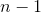 而不是  的原因。

样本方差：

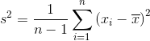

当我们计算样本方差时，我们试图估计总体方差，这是一个未知值。 为了进行这种估计，我们从样本与总体均值的平方差的平均值，来估计未知的总体方差。 这种估计技术的负面影响是，因为我们正在采样，我们更有可能观察到差较小的观测，因为它们更常见（例如它们是分布的中心）。 按照定义我们将低估总体方差。

弗里德里希贝塞尔发现，通过将有偏差（未校正）的样本方差 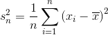 乘以 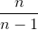，我们将能够减少这种偏差，从而能够准确估计总体方差和标准差。 乘法的最终结果是无偏样本方差。

## 演示中心极限定律

```py
# 导入包
import pandas as pd
import numpy as np

# 将 matplotlib 设为内联
%matplotlib inline 

# 创建空的数据帧
population = pd.DataFrame()

# 创建一列，它是来自均匀分布的 10000 个随机数 
population['numbers'] = np.random.uniform(0,10000,size=10000)

# 绘制得分数据的直方图
# 这确认了数据不是正态分布的
population['numbers'].hist(bins=100)

# <matplotlib.axes._subplots.AxesSubplot at 0x112c72710> 
```


```py
# 查看数值的均值
population['numbers'].mean()

# 4983.824612472138 

# 创建列表
sampled_means = []

# 执行 1000 次
for i in range(0,1000):
    # 从总体中随机抽取 100 行
    # 计算它们的均值，附加到 sampled_means
    sampled_means.append(population.sample(n=100).mean().values[0])

# 绘制 sampled_means 的直方图
# 它很明显是正态分布的，中心约为 5000
pd.Series(sampled_means).hist(bins=100)

# <matplotlib.axes._subplots.AxesSubplot at 0x11516e668> 
```


这是关键的图表，记住总体分布是均匀的，然而，这个分布接近正态。 这是中心极限理论的关键点，也是我们可以假设样本均值是无偏的原因。

```py
# 查看 sampled_means 的均值
pd.Series(sampled_means).mean()

# 4981.465310909289 

# 将样本均值的均值减去真实的总体均值
error = population['numbers'].mean() - pd.Series(sampled_means).mean()

# 打印
print('The Mean Sample Mean is only %f different the True Population mean!' % error)

# The Mean Sample Mean is only 2.359302 different the True Population mean! 
```

## 皮尔逊相关系数

基于 [cbare](http://stackoverflow.com/users/199166/cbare) 的[这个](http://stackoverflow.com/a/17389980/2935984) StackOverflow 答案。

```py
import statistics as stats

x = [1,2,3,4,5,6,7,8,9]
y = [2,1,2,4.5,7,6.5,6,9,9.5]
```
有许多等价的表达方式来计算皮尔逊相关系数（也称为皮尔逊的 r）。这是一个。

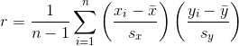

其中 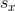 和 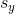 是  和  的标准差，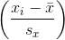 是  和  的[标准得分](https://en.wikipedia.org/wiki/Standard_score)。

```py
# 创建函数
def pearson(x,y):

    # 创建 n，数据中的观测数量
    n = len(x)

    # 创建列表来储存标准得分
    standard_score_x = []
    standard_score_y = []

    # 计算 x 的均值
    mean_x = stats.mean(x)

    # 计算 x 的标准差
    standard_deviation_x = stats.stdev(x)

    # 计算 y 的均值
    mean_y = stats.mean(y)

    # 计算 y 的标准差
    standard_deviation_y = stats.stdev(y)

    # 对于 x 中的每个观测
    for observation in x: 

        # 计算 x 的标准得分
        standard_score_x.append((observation - mean_x)/standard_deviation_x) 

    # 对于 y 中的每个观测
    for observation in y:

        # 计算 y 的标准得分
        standard_score_y.append((observation - mean_y)/standard_deviation_y)

    # 将标准得分加在一起，求和，然后除以 n-1，返回该值
    return (sum([i*j for i,j in zip(standard_score_x, standard_score_y)]))/(n-1)

# 展示皮尔逊相关系数
pearson(x,y)

# 0.9412443251336238 
```

## 概率质量函数（PMF）

```py
# 加载库
import matplotlib.pyplot as plt

# 创建一些随机整数
data = [3,2,3,4,2,3,5,2,2,3,3,5,2,2,5,6,2,2,2,3,6,6,2,4,3,2,3]

# 创建字典来储存计数
count = {}

# 对于数据中的每个值
for observation in data:
    # 键为观测，值递增
    count[observation] = count.get(observation, 0) + 1

# 计算观测数量 observations
n = len(data)

# 创建字典
probability_mass_function = {}

# 对于每个唯一值
for unique_value, count in count.items():
    # 将计数归一化，通过除以数据量，添加到 PMC 字典
    probability_mass_function[unique_value] = count / n

# 绘制概率质量函数
plt.bar(list(probability_mass_function.keys()), probability_mass_function.values(), color='g')
plt.show()
```


## Spearman 排名相关度

```py
import numpy as np
import pandas as pd
import scipy.stats

# 创建两列随机变量
x = [1,2,3,4,5,6,7,8,9]
y = [2,1,2,4.5,7,6.5,6,9,9.5]
```

Spearman 的排名相关度，是变量的排名版本的皮尔逊相关系数。

```py
# 创建接受 x 和 y 的函数
def spearmans_rank_correlation(xs, ys):

    # 计算 x 的排名
    #（也就是排序后元素的位置）
    xranks = pd.Series(xs).rank()

    # 计算 y 的排名
    yranks = pd.Series(ys).rank()

    # 在数据的排名版本上，计算皮尔逊相关系数
    return scipy.stats.pearsonr(xranks, yranks)

# 运行函数
spearmans_rank_correlation(x, y)[0]

# 0.90377360145618091 

# 仅仅检查我们的结果，使用 Scipy 的 Spearman
scipy.stats.spearmanr(x, y)[0]

# 0.90377360145618102 
```

## T 检验

```py
from scipy import stats
import numpy as np

# 创建 20 个观测的列表，从均值为 1，
# 标准差为 1.5 的正态分布中随机抽取
x = np.random.normal(1, 1.5, 20)

# 创建 20 个观测的列表，从均值为 0，
# 标准差为 1.5 的正态分布中随机抽取
y = np.random.normal(0, 1.5, 20)
```

### 单样本双边 T 检验

想象一下单样本 T 检验，并绘制一个“正态形状的”山丘，以`1`为中心，并以`1.5`为标准差而“展开”，然后在`0`处放置一个标志并查看标志在山丘上的位置。它靠近顶部吗？ 或者远离山丘？ 如果标志靠近山丘的底部或更远，则 t 检验的 p 值将低于`0.05`。

```py
# 运行 T 检验来检验 x 的均值和 0 相比，是否有统计学显著的差异
pvalue = stats.ttest_1samp(x, 0)[1]

# 查看 p 值
pvalue

# 0.00010976647757800537 
```

### 双样本非配对等方差双边 T 检验

想象一下单样本 T 检验，并根据标准差绘制两个（正态形状的）山丘，以它们的均值为中心，并根据他们的标准差绘制它们的“平坦度”（个体延展度）。 T 检验考察了两座山丘重叠的程度。 它们基本上是彼此覆盖的吗？ 山丘的底部几乎没有碰到吗？ 如果山丘的尾部刚刚重叠或根本不重叠，则 t 检验的 p 值将低于 0.05。

```py
stats.ttest_ind(x, y)[1]

# 0.00035082056802728071 

stats.ttest_ind(x, y, equal_var=False)[1]

# 0.00035089238660076095 
```

### 双样本配对双边 T 检验

当我们采集重复样本，并且想要考虑我们正在测试的两个分布是成对的这一事实时，使用配对 T 检验。

```py
stats.ttest_rel(x, y)[1]

# 0.00034222792790150386 
```

## 方差和标准差

```py
# 导入包
import math

# 创建值的列表
data = [3,2,3,4,2,3,5,2,2,33,3,5,2,2,5,6,62,2,2,3,6,6,2,23,3,2,3]
```

方差是衡量数据分布延展度的指标。 方差越大，数据点越“分散”。 方差，通常表示为 ，计算方式如下：

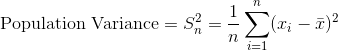

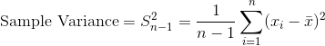

其中  是观测数，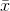 是观察值的平均值，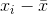 是单个观察值减去数据均值。 请注意，如果我们根据来自该总体的样本估计总体的方差，我们应该使用第二个等式，将  替换为 。

```py
# 计算 n
n = len(data)

# 计算均值
mean = sum(data)/len(data)

# 从均值创建所有观测的差
all_deviations_from_mean_squared = []

# 对于数据中的每个观测
for observation in data:

    # 计算到均值的差
    deviation_from_mean = (observation - mean)

    # 计算平方
    deviation_from_mean_squared = deviation_from_mean**2

    # 将结果添加到列表
    all_deviations_from_mean_squared.append(deviation_from_mean_squared)

# 对于列表中所有平方差求和 
sum_of_deviations_from_mean_squared = sum(all_deviations_from_mean_squared)

# 除以 n
population_variance = sum_of_deviations_from_mean_squared/n

# 展示方差
population_variance 

# 160.78463648834017 
```

标准差就是方差的平方根。

```py
# 计算总体方差的平方根
population_standard_deviation = math.sqrt(population_variance)

# 打印总体标准差
population_standard_deviation

# 12.68008818929664 
```