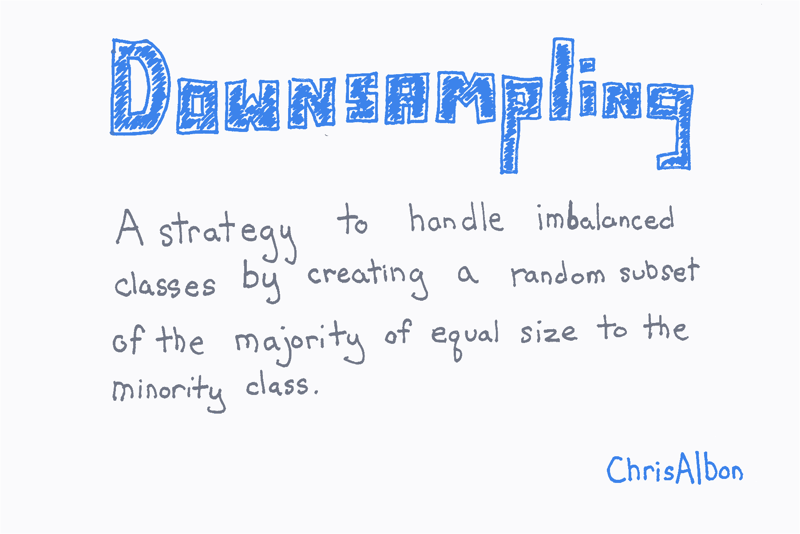
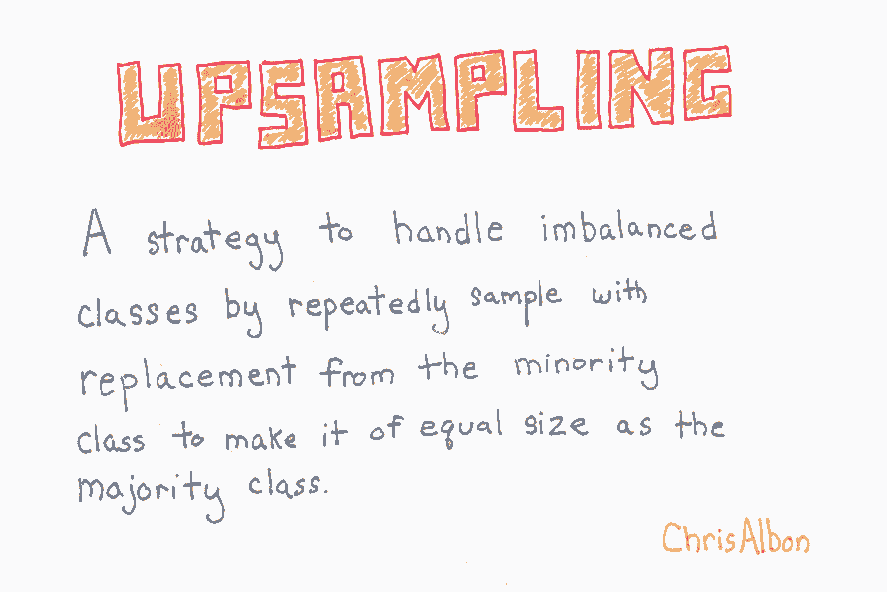
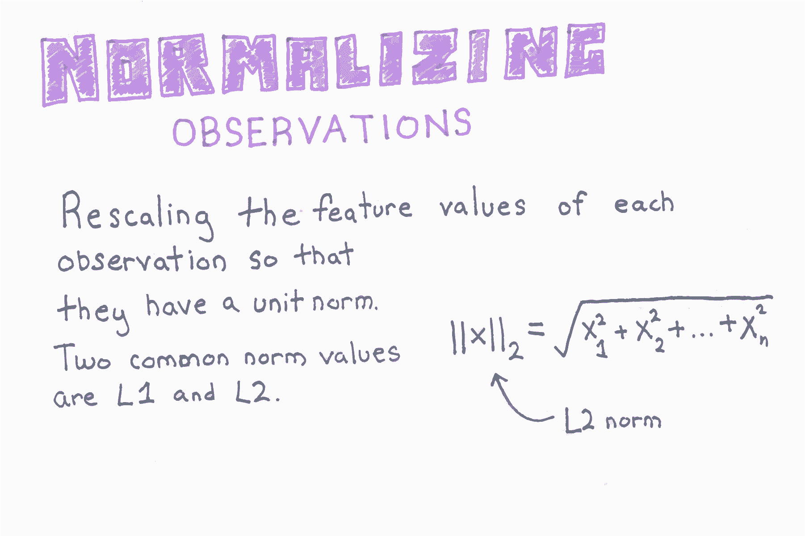
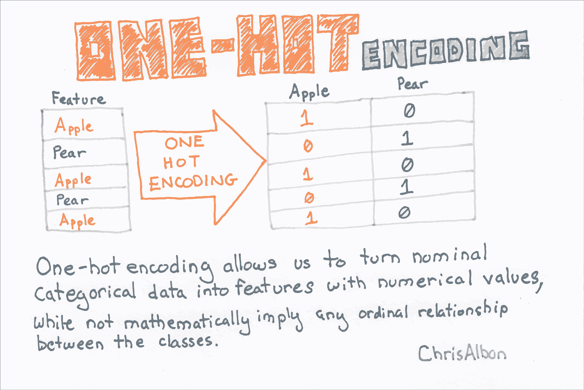
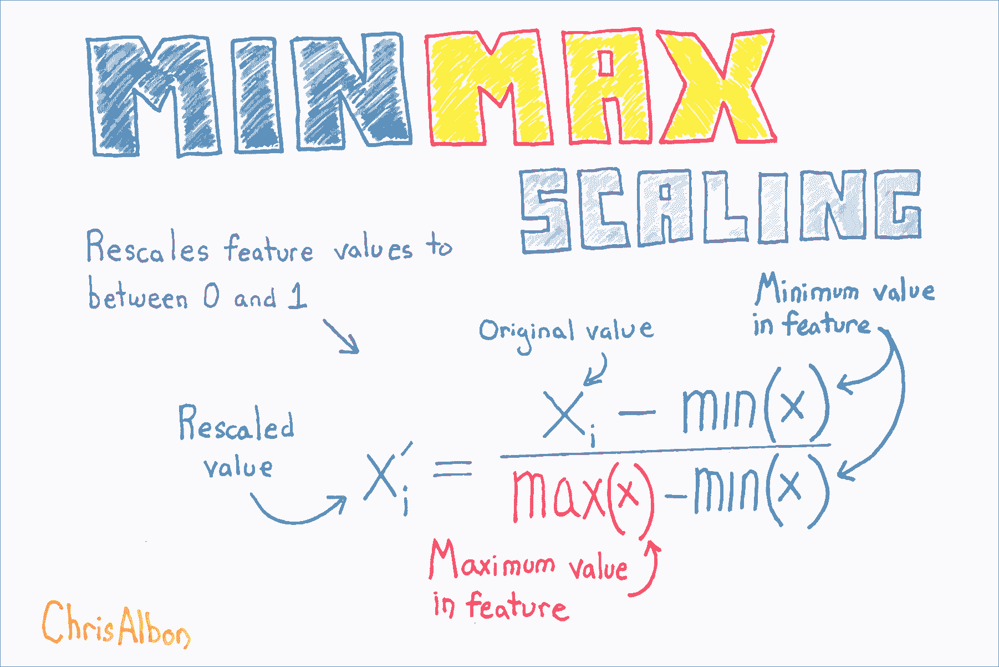
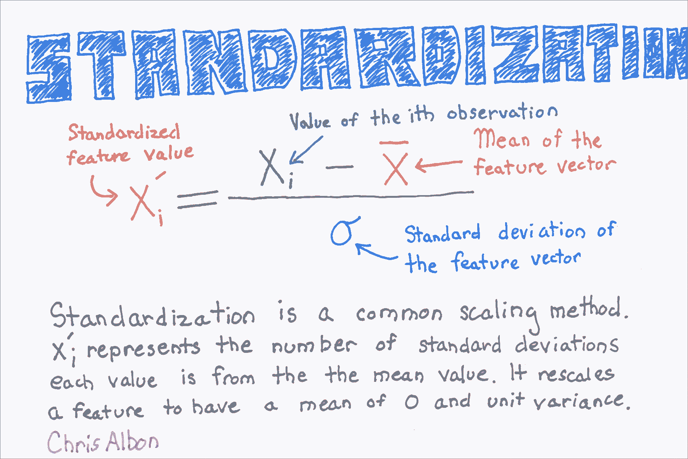

# 三、数据预处理

> 作者：[Chris Albon](https://chrisalbon.com/)
> 
> 译者：[飞龙](https://github.com/wizardforcel)
> 
> 协议：[CC BY-NC-SA 4.0](http://creativecommons.org/licenses/by-nc-sa/4.0/)

## 为 Scikit-Learn 转换 Pandas 类别数据

```py
# 导入所需的库
from sklearn import preprocessing
import pandas as pd

raw_data = {'patient': [1, 1, 1, 2, 2],
        'obs': [1, 2, 3, 1, 2],
        'treatment': [0, 1, 0, 1, 0],
        'score': ['strong', 'weak', 'normal', 'weak', 'strong']}
df = pd.DataFrame(raw_data, columns = ['patient', 'obs', 'treatment', 'score'])

# 创建标签（类别）编码对象
le = preprocessing.LabelEncoder()

# 使编码器拟合 pandas 列
le.fit(df['score'])

# LabelEncoder() 

# 查看标签（如果你希望）
list(le.classes_)

# ['normal', 'strong', 'weak'] 

# 将拟合的编码器应用于 pandas 列
le.transform(df['score']) 

# array([1, 2, 0, 2, 1]) 

# 将一些整数转换为它们的类别名称
list(le.inverse_transform([2, 2, 1]))

# ['weak', 'weak', 'strong'] 
```

## 删除带缺失值的观测

```py
# 加载库
import numpy as np
import pandas as pd

# 创建特征矩阵
X = np.array([[1.1, 11.1], 
              [2.2, 22.2], 
              [3.3, 33.3], 
              [4.4, 44.4], 
              [np.nan, 55]])

# 移除带缺失值的观测
X[~np.isnan(X).any(axis=1)]

'''
array([[  1.1,  11.1],
       [  2.2,  22.2],
       [  3.3,  33.3],
       [  4.4,  44.4]]) 
'''
```

## 删除缺失值

```py
# 加载库
import numpy as np
import pandas as pd

# 创建特征矩阵
X = np.array([[1, 2], 
              [6, 3], 
              [8, 4], 
              [9, 5], 
              [np.nan, 4]])

# 移除带缺失值的观测
X[~np.isnan(X).any(axis=1)]

array([[ 1.,  2.],
       [ 6.,  3.],
       [ 8.,  4.],
       [ 9.,  5.]]) 

# 将数据加载为数据帧
df = pd.DataFrame(X, columns=['feature_1', 'feature_2'])

# 移除带缺失值的观测
df.dropna()
```

|  | feature_1 | feature_2 |
| --- | --- | --- |
| 0 | 1.0 | 2.0 |
| 1 | 6.0 | 3.0 |
| 2 | 8.0 | 4.0 |
| 3 | 9.0 | 5.0 |

## 检测离群点

```py
# 加载库
import numpy as np
from sklearn.covariance import EllipticEnvelope
from sklearn.datasets import make_blobs

# 创建模拟数据
X, _ = make_blobs(n_samples = 10,
                  n_features = 2,
                  centers = 1,
                  random_state = 1)

# 将第一个观测值替换为异常值
X[0,0] = 10000
X[0,1] = 10000
```

`EllipticEnvelope`假设数据是正态分布的，并且基于该假设，在数据周围“绘制”椭圆，将椭圆内的任何观测分类为正常（标记为`1`），并将椭圆外的任何观测分类为异常值（标记为`-1`）。 这种方法的一个主要限制是，需要指定一个`contamination`参数，该参数是异常观测值的比例，这是我们不知道的值。

```py
# 创建检测器
outlier_detector = EllipticEnvelope(contamination=.1)

# 拟合检测器
outlier_detector.fit(X)

# 预测离群点
outlier_detector.predict(X)

# array([-1,  1,  1,  1,  1,  1,  1,  1,  1,  1]) 
```

## 离散化特征

```py
# 加载库
from sklearn.preprocessing import Binarizer
import numpy as np

# 创建特征
age = np.array([[6], 
                [12], 
                [20], 
                [36], 
                [65]])

# 创建二值化器
binarizer = Binarizer(18)

# 转换特征
binarizer.fit_transform(age)

'''
array([[0],
       [0],
       [1],
       [1],
       [1]]) 
'''

# 对特征分箱
np.digitize(age, bins=[20,30,64])

'''
array([[0],
       [0],
       [1],
       [2],
       [3]]) 
'''
```

## 编码序数类别特征

```py
# 加载库
import pandas as pd

# 创建特征
df = pd.DataFrame({'Score': ['Low', 
                             'Low', 
                             'Medium', 
                             'Medium', 
                             'High']})

# 查看数据帧
df
```

|  | Score |
| --- | --- |
| 0 | Low |
| 1 | Low |
| 2 | Medium |
| 3 | Medium |
| 4 | High |

### 创建比例映射

```py
# 创建映射器
scale_mapper = {'Low':1, 
                'Medium':2,
                'High':3}

# 将特征值映射为比例
df['Scale'] = df['Score'].replace(scale_mapper)

# 查看数据帧
df
```

|  | Score | Scale |
| --- | --- | --- |
| 0 | Low | 1 |
| 1 | Low | 1 |
| 2 | Medium | 2 |
| 3 | Medium | 2 |
| 4 | High | 3 |

## 使用下采样处理不平衡类



在下采样中，我们从多数类（即具有更多观测值的类）中不放回随机抽样，来创建与少数类相等的新观测子集。

```py
# 加载库
import numpy as np
from sklearn.datasets import load_iris

# 加载鸢尾花数据
iris = load_iris()

# 创建特征矩阵
X = iris.data

# 创建目标向量
y = iris.target

# 移除前 40 个观测
X = X[40:,:]
y = y[40:]

# 创建二元目标向量，表示是否是类 0
y = np.where((y == 0), 0, 1)

# 查看不平衡的目标向量
y

'''
array([0, 0, 0, 0, 0, 0, 0, 0, 0, 0, 1, 1, 1, 1, 1, 1, 1, 1, 1, 1, 1, 1, 1,
       1, 1, 1, 1, 1, 1, 1, 1, 1, 1, 1, 1, 1, 1, 1, 1, 1, 1, 1, 1, 1, 1, 1,
       1, 1, 1, 1, 1, 1, 1, 1, 1, 1, 1, 1, 1, 1, 1, 1, 1, 1, 1, 1, 1, 1, 1,
       1, 1, 1, 1, 1, 1, 1, 1, 1, 1, 1, 1, 1, 1, 1, 1, 1, 1, 1, 1, 1, 1, 1,
       1, 1, 1, 1, 1, 1, 1, 1, 1, 1, 1, 1, 1, 1, 1, 1, 1, 1]) 
'''

# 每个类别的观测的下标
i_class0 = np.where(y == 0)[0]
i_class1 = np.where(y == 1)[0]

# 每个类别的观测数量
n_class0 = len(i_class0)
n_class1 = len(i_class1)

# 对于类 0 的每个观测，随机从类 1 不放回采样
i_class1_downsampled = np.random.choice(i_class1, size=n_class0, replace=False)

# 将类 0 的目标向量，和下采样的类 1 的目标向量连接到一起
np.hstack((y[i_class0], y[i_class1_downsampled]))

# array([0, 0, 0, 0, 0, 0, 0, 0, 0, 0, 1, 1, 1, 1, 1, 1, 1, 1, 1, 1]) 
```

## 使用上采样处理不平衡类别



在上采样中，对于多数类中的每个观测，我们从少数类中带放回随机选择观测。 最终结果是来自少数类和多数类的观测数量相同。

```py
# 加载库
import numpy as np
from sklearn.datasets import load_iris

# 加载鸢尾花数据
iris = load_iris()

# 创建特征矩阵
X = iris.data

# 创建目标向量
y = iris.target

# 移除前 40 个观测
X = X[40:,:]
y = y[40:]

# 创建二元目标向量，表示是否是类 0
y = np.where((y == 0), 0, 1)

# 查看不平衡的目标向量
y

'''
array([0, 0, 0, 0, 0, 0, 0, 0, 0, 0, 1, 1, 1, 1, 1, 1, 1, 1, 1, 1, 1, 1, 1,
       1, 1, 1, 1, 1, 1, 1, 1, 1, 1, 1, 1, 1, 1, 1, 1, 1, 1, 1, 1, 1, 1, 1,
       1, 1, 1, 1, 1, 1, 1, 1, 1, 1, 1, 1, 1, 1, 1, 1, 1, 1, 1, 1, 1, 1, 1,
       1, 1, 1, 1, 1, 1, 1, 1, 1, 1, 1, 1, 1, 1, 1, 1, 1, 1, 1, 1, 1, 1, 1,
       1, 1, 1, 1, 1, 1, 1, 1, 1, 1, 1, 1, 1, 1, 1, 1, 1, 1]) 
'''

# 每个类别的观测的下标
i_class0 = np.where(y == 0)[0]
i_class1 = np.where(y == 1)[0]

# 每个类别的观测数量
n_class0 = len(i_class0)
n_class1 = len(i_class1)

# 对于类 1 中的每个观测，我们从类 0 中带放回随机选择观测。
i_class0_upsampled = np.random.choice(i_class0, size=n_class1, replace=True)

# 将类 0 的上采样的目标向量，和类 1 的目标向量连接到一起
np.concatenate((y[i_class0_upsampled], y[i_class1]))

'''
array([0, 0, 0, 0, 0, 0, 0, 0, 0, 0, 0, 0, 0, 0, 0, 0, 0, 0, 0, 0, 0, 0, 0,
       0, 0, 0, 0, 0, 0, 0, 0, 0, 0, 0, 0, 0, 0, 0, 0, 0, 0, 0, 0, 0, 0, 0,
       0, 0, 0, 0, 0, 0, 0, 0, 0, 0, 0, 0, 0, 0, 0, 0, 0, 0, 0, 0, 0, 0, 0,
       0, 0, 0, 0, 0, 0, 0, 0, 0, 0, 0, 0, 0, 0, 0, 0, 0, 0, 0, 0, 0, 0, 0,
       0, 0, 0, 0, 0, 0, 0, 0, 1, 1, 1, 1, 1, 1, 1, 1, 1, 1, 1, 1, 1, 1, 1,
       1, 1, 1, 1, 1, 1, 1, 1, 1, 1, 1, 1, 1, 1, 1, 1, 1, 1, 1, 1, 1, 1, 1,
       1, 1, 1, 1, 1, 1, 1, 1, 1, 1, 1, 1, 1, 1, 1, 1, 1, 1, 1, 1, 1, 1, 1,
       1, 1, 1, 1, 1, 1, 1, 1, 1, 1, 1, 1, 1, 1, 1, 1, 1, 1, 1, 1, 1, 1, 1,
       1, 1, 1, 1, 1, 1, 1, 1, 1, 1, 1, 1, 1, 1, 1, 1]) 
'''
```

## 处理离群点


```py
# 加载库
import pandas as pd

# 创建 DataFrame
houses = pd.DataFrame()
houses['Price'] = [534433, 392333, 293222, 4322032]
houses['Bathrooms'] = [2, 3.5, 2, 116]
houses['Square_Feet'] = [1500, 2500, 1500, 48000]

houses
```

|  | Price | Bathrooms | Square_Feet |
| --- | --- | --- | --- |
| 0 | 534433 | 2.0 | 1500 |
| 1 | 392333 | 3.5 | 2500 |
| 2 | 293222 | 2.0 | 1500 |
| 3 | 4322032 | 116.0 | 48000 |

### 选择 1：丢弃

```py
# 丢弃大于某个值的观测
houses[houses['Bathrooms'] < 20]
```

|  | Price | Bathrooms | Square_Feet |
| --- | --- | --- | --- |
| 0 | 534433 | 2.0 | 1500 |
| 1 | 392333 | 3.5 | 2500 |
| 2 | 293222 | 2.0 | 1500 |

### 选择 2：标记

```py
# 加载库
import numpy as np

# 基于布尔条件创建特征
houses['Outlier'] = np.where(houses['Bathrooms'] < 20, 0, 1)

# 展示数据
houses
```

|  | Price | Bathrooms | Square_Feet | Outlier |
| --- | --- | --- | --- | --- |
| 0 | 534433 | 2.0 | 1500 | 0 |
| 1 | 392333 | 3.5 | 2500 | 0 |
| 2 | 293222 | 2.0 | 1500 | 0 |
| 3 | 4322032 | 116.0 | 48000 | 1 |

### 选择 3：重缩放

```py
# 对数特征
houses['Log_Of_Square_Feet'] = [np.log(x) for x in houses['Square_Feet']]

# 展示数据
houses
```

|  | Price | Bathrooms | Square_Feet | Outlier | Log_Of_Square_Feet |
| --- | --- | --- | --- | --- | --- |
| 0 | 534433 | 2.0 | 1500 | 0 | 7.313220 |
| 1 | 392333 | 3.5 | 2500 | 0 | 7.824046 |
| 2 | 293222 | 2.0 | 1500 | 0 | 7.313220 |
| 3 | 4322032 | 116.0 | 48000 | 1 | 10.778956 |

# 使用均值填充缺失值

均值插补用该特征/变量的平均值替换缺失值。 平均插补是最“朴素”的插补方法之一，因为不像 k 最近邻居插补这样的更复杂的方法，它不会使用观测的信息来估计它的值。

```py
import pandas as pd
import numpy as np
from sklearn.preprocessing import Imputer

# 创建空数据集
df = pd.DataFrame()

# 创建两个变量，叫做 x0 和 x1
# 使 x1 的第一个值为缺失值
df['x0'] = [0.3051,0.4949,0.6974,0.3769,0.2231,0.341,0.4436,0.5897,0.6308,0.5]
df['x1'] = [np.nan,0.2654,0.2615,0.5846,0.4615,0.8308,0.4962,0.3269,0.5346,0.6731]

# 观察数据集
df
```

|  | x0 | x1 |
| --- | --- | --- |
| 0 | 0.3051 | NaN |
| 1 | 0.4949 | 0.2654 |
| 2 | 0.6974 | 0.2615 |
| 3 | 0.3769 | 0.5846 |
| 4 | 0.2231 | 0.4615 |
| 5 | 0.3410 | 0.8308 |
| 6 | 0.4436 | 0.4962 |
| 7 | 0.5897 | 0.3269 |
| 8 | 0.6308 | 0.5346 |
| 9 | 0.5000 | 0.6731 |

### 拟合填充器

```py
# 创建一个填充器对象，它寻找 NaN 值，之后将它们按列替换为特征的均值
mean_imputer = Imputer(missing_values='NaN', strategy='mean', axis=0)

# 在 df 数据及上训练填充器
mean_imputer = mean_imputer.fit(df)

# 将填充器应用于 df 数据集
imputed_df = mean_imputer.transform(df.values)

# 查看数据
imputed_df

'''
array([[ 0.3051    ,  0.49273333],
       [ 0.4949    ,  0.2654    ],
       [ 0.6974    ,  0.2615    ],
       [ 0.3769    ,  0.5846    ],
       [ 0.2231    ,  0.4615    ],
       [ 0.341     ,  0.8308    ],
       [ 0.4436    ,  0.4962    ],
       [ 0.5897    ,  0.3269    ],
       [ 0.6308    ,  0.5346    ],
       [ 0.5       ,  0.6731    ]]) 
'''
```

请注意，`0.49273333`是估算值，取代了`np.NaN`值。

## 填充缺失的类标签

```py
# 加载库
import numpy as np
from sklearn.preprocessing import Imputer

# 创建带有类别特征的特征矩阵
X = np.array([[0, 2.10, 1.45], 
              [1, 1.18, 1.33], 
              [0, 1.22, 1.27],
              [0, -0.21, -1.19],
              [np.nan, 0.87, 1.31],
              [np.nan, -0.67, -0.22]])

# 创建填充器对象
imputer = Imputer(strategy='most_frequent', axis=0)

# 使用最频繁的类别填充缺失值
imputer.fit_transform(X)

'''
array([[ 0.  ,  2.1 ,  1.45],
       [ 1.  ,  1.18,  1.33],
       [ 0.  ,  1.22,  1.27],
       [ 0.  , -0.21, -1.19],
       [ 0.  ,  0.87,  1.31],
       [ 0.  , -0.67, -0.22]]) 
'''
```

## 使用 KNN 填充缺失类别

```py
# 加载库
import numpy as np
from sklearn.neighbors import KNeighborsClassifier

# 创建带有类别特征的特征矩阵
X = np.array([[0, 2.10, 1.45], 
              [1, 1.18, 1.33], 
              [0, 1.22, 1.27],
              [1, -0.21, -1.19]])

# 创建类别特征有缺失的特征矩阵
X_with_nan = np.array([[np.nan, 0.87, 1.31], 
                       [np.nan, -0.67, -0.22]])

# 训练 KNN 学习器
clf = KNeighborsClassifier(3, weights='distance')
trained_model = clf.fit(X[:,1:], X[:,0])

# 预测缺失值的类别
imputed_values = trained_model.predict(X_with_nan[:,1:])

# 将预测分类的列和它们的其它特征连接
X_with_imputed = np.hstack((imputed_values.reshape(-1,1), X_with_nan[:,1:]))

# 连接两个特征矩阵
np.vstack((X_with_imputed, X))

'''
array([[ 0.  ,  0.87,  1.31],
       [ 1.  , -0.67, -0.22],
       [ 0.  ,  2.1 ,  1.45],
       [ 1.  ,  1.18,  1.33],
       [ 0.  ,  1.22,  1.27],
       [ 1.  , -0.21, -1.19]]) 
'''
```

## 观测正则化



```py
# 加载库
from sklearn.preprocessing import Normalizer
import numpy as np

# 创建特征矩阵
X = np.array([[0.5, 0.5], 
              [1.1, 3.4], 
              [1.5, 20.2], 
              [1.63, 34.4], 
              [10.9, 3.3]])
```

`Normalizer`重缩放各个观侧，使其具有单位范数（长度之和为 1）。

```py
# 创建正则化器
normalizer = Normalizer(norm='l2')

# 转换特征矩阵
normalizer.transform(X)

'''
array([[ 0.70710678,  0.70710678],
       [ 0.30782029,  0.95144452],
       [ 0.07405353,  0.99725427],
       [ 0.04733062,  0.99887928],
       [ 0.95709822,  0.28976368]]) 
'''
```

## 多个标签的独热编码特征

```py
# 加载库
from sklearn.preprocessing import MultiLabelBinarizer
import numpy as np

# 创建 NumPy 数组
y = [('Texas', 'Florida'), 
    ('California', 'Alabama'), 
    ('Texas', 'Florida'), 
    ('Delware', 'Florida'), 
    ('Texas', 'Alabama')]

# 创建 MultiLabelBinarizer 对象
one_hot = MultiLabelBinarizer()

# 独热编码数据
one_hot.fit_transform(y)

'''
array([[0, 0, 0, 1, 1],
       [1, 1, 0, 0, 0],
       [0, 0, 0, 1, 1],
       [0, 0, 1, 1, 0],
       [1, 0, 0, 0, 1]]) 
'''

# 查看类别
one_hot.classes_

# array(['Alabama', 'California', 'Delware', 'Florida', 'Texas'], dtype=object) 
```

## 独热编码标称类别特征



```py
# 加载库
import numpy as np
import pandas as pd
from sklearn.preprocessing import LabelBinarizer

# 创建 NumPy 数组
x = np.array([['Texas'], 
              ['California'], 
              ['Texas'], 
              ['Delaware'], 
              ['Texas']])

# 创建 LabelBinzarizer 对象
one_hot = LabelBinarizer()

# 独热编码数据
one_hot.fit_transform(x)

'''
array([[0, 0, 1],
       [1, 0, 0],
       [0, 0, 1],
       [0, 1, 0],
       [0, 0, 1]]) 
'''

# 查看类别
one_hot.classes_

'''
array(['California', 'Delaware', 'Texas'],
      dtype='<U10') 
'''

# 虚拟特征
pd.get_dummies(x[:,0])
```

|  | California | Delaware | Texas |
| --- | --- | --- | --- |
| 0 | 0 | 0 | 1 |
| 1 | 1 | 0 | 0 |
| 2 | 0 | 0 | 1 |
| 3 | 0 | 1 | 0 |
| 4 | 0 | 0 | 1 |

# 预处理类别特征

通常，机器学习方法（例如逻辑回归，具有线性核的 SVM 等）将要求将类别变量转换为虚拟变量（也称为独热编码）。 例如，单个特征`Fruit`将被转换为三个特征，`Apples`，`Oranges`和`Bananas`，类别特征中的每个类别一个。

有一些常用的方法可以预处理分类特征：使用 pandas 或 scikit-learn。

```py
from sklearn import preprocessing
from sklearn.pipeline import Pipeline
import pandas as pd

raw_data = {'first_name': ['Jason', 'Molly', 'Tina', 'Jake', 'Amy'], 
        'last_name': ['Miller', 'Jacobson', 'Ali', 'Milner', 'Cooze'], 
        'age': [42, 52, 36, 24, 73], 
        'city': ['San Francisco', 'Baltimore', 'Miami', 'Douglas', 'Boston']}
df = pd.DataFrame(raw_data, columns = ['first_name', 'last_name', 'age', 'city'])
df
```

|  | first_name | last_name | age | city |
| --- | --- | --- | --- | --- |
| 0 | Jason | Miller | 42 | San Francisco |
| 1 | Molly | Jacobson | 52 | Baltimore |
| 2 | Tina | Ali | 36 | Miami |
| 3 | Jake | Milner | 24 | Douglas |
| 4 | Amy | Cooze | 73 | Boston |

```py
# 为 df.city 中的每个独特的类别创建虚拟变量
pd.get_dummies(df["city"])
```

|  | Baltimore | Boston | Douglas | Miami | San Francisco |
| --- | --- | --- | --- | --- | --- |
| 0 | 0.0 | 0.0 | 0.0 | 0.0 | 1.0 |
| 1 | 1.0 | 0.0 | 0.0 | 0.0 | 0.0 |
| 2 | 0.0 | 0.0 | 0.0 | 1.0 | 0.0 |
| 3 | 0.0 | 0.0 | 1.0 | 0.0 | 0.0 |
| 4 | 0.0 | 1.0 | 0.0 | 0.0 | 0.0 |


```py
# 将字符串类别变量转换为整数
integerized_data = preprocessing.LabelEncoder().fit_transform(df["city"])

# 查看数据
integerized_data

# array([4, 0, 3, 2, 1]) 

# 将整数类别表示为独热编码
preprocessing.OneHotEncoder().fit_transform(integerized_data.reshape(-1,1)).toarray()

'''
array([[ 0.,  0.,  0.,  0.,  1.],
       [ 1.,  0.,  0.,  0.,  0.],
       [ 0.,  0.,  0.,  1.,  0.],
       [ 0.,  0.,  1.,  0.,  0.],
       [ 0.,  1.,  0.,  0.,  0.]]) 
'''
```

请注意，`pd.get_dummies()`和 scikit 方法的输出会生成相同的输出矩阵。

## 预处理鸢尾花数据

```py
from sklearn import datasets
import numpy as np
from sklearn.cross_validation import train_test_split
from sklearn.preprocessing import StandardScaler

# 加载鸢尾花数据
iris = datasets.load_iris()

# 为特征数据创建变量
X = iris.data

# 为目标数据创建标签
y = iris.target

# 随机将数据分成四个新数据集，训练特征，训练结果，测试特征，
# 和测试结果。 将测试数据的大小设置为完整数据集的 30％。
X_train, X_test, y_train, y_test = train_test_split(X, y, test_size=0.3, random_state=42)

# 加载标准化缩放器
sc = StandardScaler()

# 基于训练数据计算均值和标准差
sc.fit(X_train)

# 将训练数据缩放为均值 0 和单位标准差
X_train_std = sc.transform(X_train)

# 将测试数据缩放为均值 0 和单位标准差
X_test_std = sc.transform(X_test)

# 测试数据的特征，非标准化
X_test[0:5]

'''
array([[ 6.1,  2.8,  4.7,  1.2],
       [ 5.7,  3.8,  1.7,  0.3],
       [ 7.7,  2.6,  6.9,  2.3],
       [ 6. ,  2.9,  4.5,  1.5],
       [ 6.8,  2.8,  4.8,  1.4]]) 
'''

# 测试数据的特征，标准化
X_test_std[0:5]

'''
array([[ 0.3100623 , -0.49582097,  0.48403749, -0.05143998],
       [-0.17225683,  1.92563026, -1.26851205, -1.26670948],
       [ 2.23933883, -0.98011121,  1.76924049,  1.43388941],
       [ 0.18948252, -0.25367584,  0.36720086,  0.35364985],
       [ 1.15412078, -0.49582097,  0.54245581,  0.21861991]]) 
'''
```

## 特征重缩放



```py
# 加载库
from sklearn import preprocessing
import numpy as np

# 创建特征
x = np.array([[-500.5], 
              [-100.1], 
              [0], 
              [100.1], 
              [900.9]])

# 创建缩放器
minmax_scale = preprocessing.MinMaxScaler(feature_range=(0, 1))

# 缩放特征
x_scale = minmax_scale.fit_transform(x)

# 展示特征
x_scale

'''
array([[ 0.        ],
       [ 0.28571429],
       [ 0.35714286],
       [ 0.42857143],
       [ 1.        ]]) 
'''
```

## 标准化特征



```py
# 加载库
from sklearn import preprocessing
import numpy as np

# 创建特征
x = np.array([[-500.5], 
              [-100.1], 
              [0], 
              [100.1], 
              [900.9]])

# 创建缩放器
scaler = preprocessing.StandardScaler()

# 转换特征
standardized = scaler.fit_transform(x)

# 展示特征
standardized

'''
array([[ 0.        ],
       [ 0.28571429],
       [ 0.35714286],
       [ 0.42857143],
       [ 1.        ]]) 
'''
```
