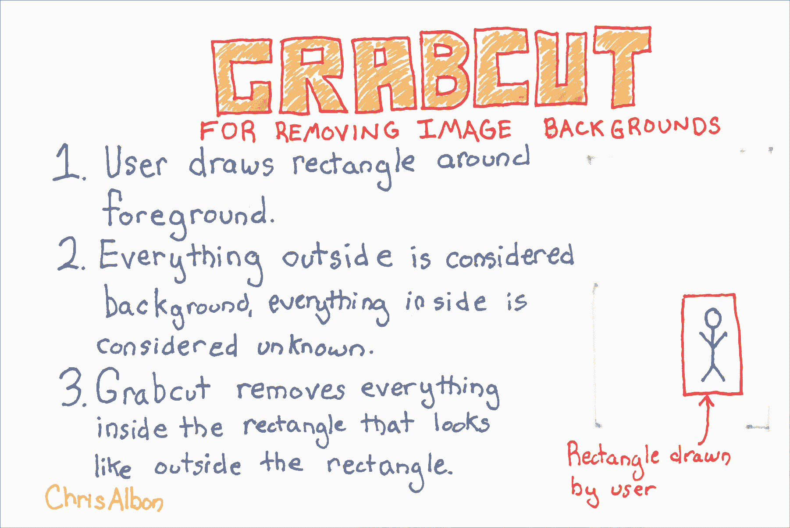

# 四、图像预处理

> 作者：[Chris Albon](https://chrisalbon.com/)
> 
> 译者：[飞龙](https://github.com/wizardforcel)
> 
> 协议：[CC BY-NC-SA 4.0](http://creativecommons.org/licenses/by-nc-sa/4.0/)

## 图像二值化

```py
# 加载库
import cv2
import numpy as np
from matplotlib import pyplot as plt

# 将图像加载为灰度
image_grey = cv2.imread('img/plane_256x256.jpg', cv2.IMREAD_GRAYSCALE)

# 应用自适应阈值
max_output_value = 255
neighorhood_size = 99
subtract_from_mean = 10
image_binarized = cv2.adaptiveThreshold(image_grey, 
                                        max_output_value, 
                                        cv2.ADAPTIVE_THRESH_GAUSSIAN_C, 
                                        cv2.THRESH_BINARY, 
                                        neighorhood_size, 
                                        subtract_from_mean)

# 展示图像
plt.imshow(image_binarized, cmap='gray'), plt.axis("off")
plt.show()
```


## 图像模糊

```py
# 加载库
import cv2
import numpy as np
from matplotlib import pyplot as plt

# 将图像加载为灰度
image = cv2.imread('img/plane_256x256.jpg', cv2.IMREAD_GRAYSCALE)

# 使图像模糊
image_blurry = cv2.blur(image, (5,5))

# 展示图像
plt.imshow(image_blurry, cmap='gray'), plt.xticks([]), plt.yticks([])
plt.show()
```


## 图像剪裁

```py
# 加载库
import cv2
import numpy as np
from matplotlib import pyplot as plt

# 将图像加载为灰度
image = cv2.imread('img/plane_256x256.jpg', cv2.IMREAD_GRAYSCALE)

# 选择所有行，和前一半的列
image_cropped = image[:,:126]

# 查看图像
plt.imshow(image_cropped, cmap='gray'), plt.axis("off")
plt.show()
```


## 边缘检测

```py
# 加载库
import cv2
import numpy as np
from matplotlib import pyplot as plt

# 将图像加载为灰度
image_gray = cv2.imread('img/plane_256x256.jpg', cv2.IMREAD_GRAYSCALE)

# 计算强度中值
median_intensity = np.median(image_gray)

# 将阈值设为强度中值上下一个标准差
lower_threshold = int(max(0, (1.0 - 0.33) * median_intensity))
upper_threshold = int(min(255, (1.0 + 0.33) * median_intensity))

# 应用 canny 边缘检测
image_canny = cv2.Canny(image_gray, lower_threshold, upper_threshold)

# 展示图像
plt.imshow(image_canny, cmap='gray'), plt.axis("off")
plt.show()
```


## 增强彩色图像的对比度

```py
# 加载库
import cv2
import numpy as np
from matplotlib import pyplot as plt

# 加载图像
image_bgr = cv2.imread('img/plane.jpg')

# 转换为 YUV
image_yuv = cv2.cvtColor(image_bgr, cv2.COLOR_BGR2YUV)

# 应用直方图均衡
image_yuv[:, :, 0] = cv2.equalizeHist(image_yuv[:, :, 0])

# 转换为 RGB
image_rgb = cv2.cvtColor(image_yuv, cv2.COLOR_YUV2RGB)

# 展示图像
plt.imshow(image_rgb), plt.axis("off")
plt.show()
```


## 增强灰度图像的对比度

```py
# 加载库
import cv2
import numpy as np
from matplotlib import pyplot as plt

# 将图像加载为灰度
image = cv2.imread('img/plane_256x256.jpg', cv2.IMREAD_GRAYSCALE)

# 增强图像
image_enhanced = cv2.equalizeHist(image)

# 展示图像
plt.imshow(image_enhanced, cmap='gray'), plt.axis("off")
plt.show()
```


# Harris 角点检测

Harris 角点检测器是检测两个边缘角点的常用方法。 它寻找窗口（也称为邻域或补丁），其中窗口的小移动（想象摇动窗口）使窗口内的像素内容产生大的变化。

```py
# 加载库
import cv2
import numpy as np
from matplotlib import pyplot as plt

# 将图像加载为灰度
image_bgr = cv2.imread('img/plane_256x256.jpg')
image_gray = cv2.cvtColor(image_bgr, cv2.COLOR_BGR2GRAY)
image_gray = np.float32(image_gray)

# 设置角点检测器的参数
block_size = 2
aperture = 29
free_parameter = 0.04

# 检测角点
detector_responses = cv2.cornerHarris(image_gray, block_size, aperture, free_parameter)

# 大型角点标记器
detector_responses = cv2.dilate(detector_responses, None)

# 只保留大于阈值的检测器结果，标记为白色
threshold = 0.02
image_bgr[detector_responses > threshold * detector_responses.max()] = [255,255,255]

# 转换为灰度
image_gray = cv2.cvtColor(image_bgr, cv2.COLOR_BGR2GRAY)

# 展示图像
plt.imshow(image_gray, cmap='gray'), plt.axis("off")
plt.show()
```


# 安装 OpenCV

虽然有许多好的库，OpenCV 是最受欢迎和文档最全的图像处理库。 使用 OpenCV 的最大障碍之一就是安装它。 但是，幸运的是，我们可以使用 Anaconda 的软件包管理器工具 conda，在我们的终端中用一行代码安装 OpenCV：

```
conda install --channel https://conda.anaconda.org/menpo opencv3
```

之后，我们可以通过打开笔记本，导入 OpenCV 并检查版本号（3.1.0）来检查安装：

```py
# 加载库
import cv2

# 查看版本号
cv2.__version__

# '3.2.0' 
```

## 颜色隔离

```py
# 加载库
import cv2
import numpy as np
from matplotlib import pyplot as plt

# 加载图像
image_bgr = cv2.imread('img/plane_256x256.jpg')

# 将 BGR 转换为 HSV
image_hsv = cv2.cvtColor(image_bgr, cv2.COLOR_BGR2HSV)

# 定义 HSV 中蓝色值的范围
lower_blue = np.array([50,100,50])
upper_blue = np.array([130,255,255])

# 创建遮罩
mask = cv2.inRange(image_hsv, lower_blue, upper_blue)

# 屏蔽图像
image_bgr_masked = cv2.bitwise_and(image_bgr, image_bgr, mask=mask)

# 将 BGR 转换为 RGB
image_rgb = cv2.cvtColor(image_bgr_masked, cv2.COLOR_BGR2RGB)

# 展示图像
plt.imshow(image_rgb), plt.axis("off")
plt.show()
```


## 加载图像

```py
# 加载库
import cv2
import numpy as np
from matplotlib import pyplot as plt

# 将图像加载为灰度
image = cv2.imread('img/plane.jpg', cv2.IMREAD_GRAYSCALE)

# 展示图像
plt.imshow(image, cmap='gray'), plt.axis("off")
plt.show()
```


```py
# 加载彩色图像
image_bgr = cv2.imread('img/plane.jpg', cv2.IMREAD_COLOR)

# 转换为 RGB
image_rgb = cv2.cvtColor(image_bgr, cv2.COLOR_BGR2RGB)

# 展示图像
plt.imshow(image_rgb), plt.axis("off")
plt.show()
```


```py
# 展示图像数据
image

'''
array([[140, 136, 146, ..., 132, 139, 134],
       [144, 136, 149, ..., 142, 124, 126],
       [152, 139, 144, ..., 121, 127, 134],
       ..., 
       [156, 146, 144, ..., 157, 154, 151],
       [146, 150, 147, ..., 156, 158, 157],
       [143, 138, 147, ..., 156, 157, 157]], dtype=uint8) 
'''

# 展示维度
image.shape

# (2270, 3600) 
```

# 背景移除

[](https://machinelearningflashcards.com)

```py
# 加载库
import cv2
import numpy as np
from matplotlib import pyplot as plt

# 加载图像
image_bgr = cv2.imread('img/plane_256x256.jpg')

# 转换为 RGB
image_rgb = cv2.cvtColor(image_bgr, cv2.COLOR_BGR2RGB)

# 矩形值：起点 x，起点 y，宽度，高度
rectangle = (0, 56, 256, 150)

# 创建初始遮罩
mask = np.zeros(image_rgb.shape[:2], np.uint8)

# 创建用于 grabCut 的临时数组
bgdModel = np.zeros((1, 65), np.float64)
fgdModel = np.zeros((1, 65), np.float64)

# 执行 grabCut
cv2.grabCut(image_rgb, # 我们的图像
            mask, # 遮罩
            rectangle, # 我们的矩形
            bgdModel, # 用于背景的临时数组
            fgdModel, # 用于前景的临时数组
            5, # 迭代数量
            cv2.GC_INIT_WITH_RECT) # 使用我们的矩形来初始化

# 创建遮罩，其中背景设置为 0，否则为 1
mask_2 = np.where((mask==2) | (mask==0), 0, 1).astype('uint8')

# 使用新的遮罩移除多个图像的背景
image_rgb_nobg = image_rgb * mask_2[:, :, np.newaxis]

# 展示图像
plt.imshow(image_rgb_nobg), plt.axis("off")
plt.show()
```


## 保存图像

```py
# 加载库
import cv2
import numpy as np
from matplotlib import pyplot as plt

# 将图像加载为灰度
image = cv2.imread('img/plane.jpg', cv2.IMREAD_GRAYSCALE)

# 展示图像
plt.imshow(image, cmap='gray'), plt.axis("off")
plt.show()
```


```py
# 保存图像
cv2.imwrite('img/plane_new.jpg', image)

# True 
```

## 图像锐化

```py
# 加载库
import cv2
import numpy as np
from matplotlib import pyplot as plt

# 将图像加载为灰度
image = cv2.imread('img/plane_256x256.jpg', cv2.IMREAD_GRAYSCALE)

# 创建核
kernel = np.array([[0, -1, 0], 
                   [-1, 5,-1], 
                   [0, -1, 0]])

# 锐化图像
image_sharp = cv2.filter2D(image, -1, kernel)

# 展示图像
plt.imshow(image_sharp, cmap='gray'), plt.axis("off")
plt.show()
```


## Shi-Tomasi 角点检测

```py
# 加载库
import cv2
import numpy as np
from matplotlib import pyplot as plt

# 加载图像
image_bgr = cv2.imread('img/plane_256x256.jpg')
image_gray = cv2.cvtColor(image_bgr, cv2.COLOR_BGR2GRAY)

# 要检测的角点数量
corners_to_detect = 10
minimum_quality_score = 0.05
minimum_distance = 25

# 检测角点
corners = cv2.goodFeaturesToTrack(image_gray, 
                                  corners_to_detect, 
                                  minimum_quality_score,
                                  minimum_distance)
corners = np.float32(corners)

# 在每个角点上绘制白色圆圈
for corner in corners:
    x, y = corner[0]
    cv2.circle(image_bgr, (x,y), 10, (255,255,255), -1)

# 转换为灰度
image_gray = cv2.cvtColor(image_bgr, cv2.COLOR_BGR2GRAY)

# 展示图像
plt.imshow(image_gray, cmap='gray'), plt.axis("off")
plt.show()
```


## 使用颜色均值作为特征

```py
# 加载库
import cv2
import numpy as np
from matplotlib import pyplot as plt

# 将图像加载为 BGR
image_bgr = cv2.imread('img/plane_256x256.jpg', cv2.IMREAD_COLOR)

# 计算每个通道的均值
channels = cv2.mean(image_bgr)

# 交换蓝色和红色值（使其变成 RGB 而不是 BGR）
observation = np.array([(channels[2], channels[1], channels[0])])

# 展示通道的均值
observation

# array([[  90.53204346,  133.11735535,  169.03074646]]) 

# 展示图像
plt.imshow(observation), plt.axis("off")
plt.show()
```


