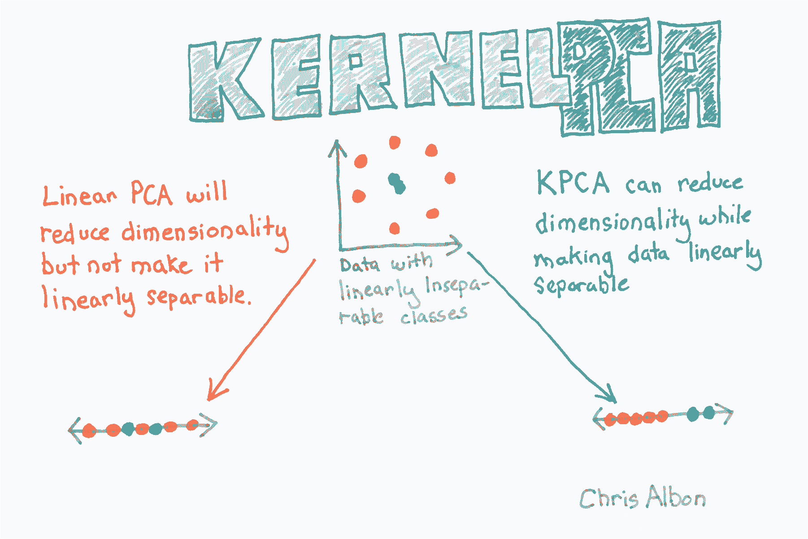
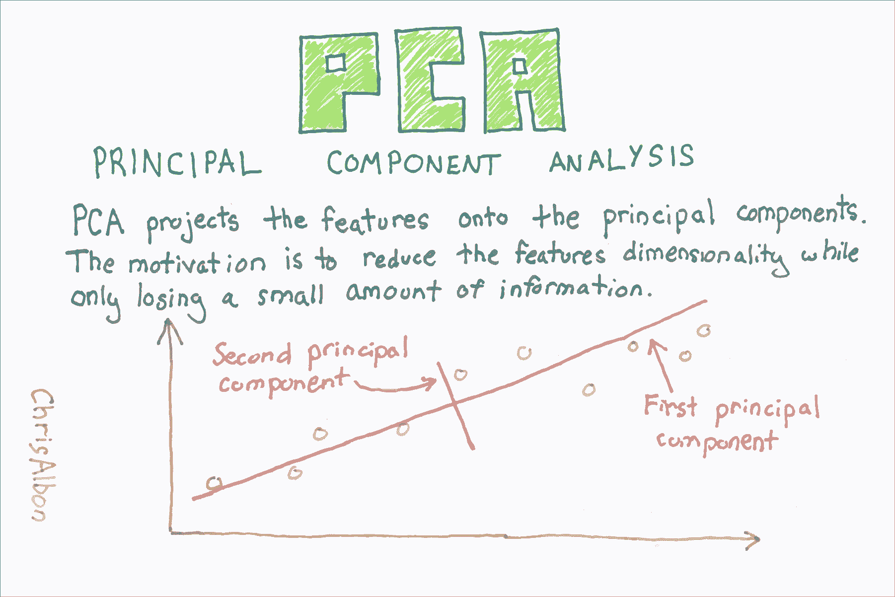

# 七、特征工程

> 作者：[Chris Albon](https://chrisalbon.com/)
> 
> 译者：[飞龙](https://github.com/wizardforcel)
> 
> 协议：[CC BY-NC-SA 4.0](http://creativecommons.org/licenses/by-nc-sa/4.0/)

## 稀疏特征矩阵上的降维

```py
# 加载库
from sklearn.preprocessing import StandardScaler
from sklearn.decomposition import TruncatedSVD
from scipy.sparse import csr_matrix
from sklearn import datasets
import numpy as np

# 加载数据
digits = datasets.load_digits()

# 标准化特征矩阵
X = StandardScaler().fit_transform(digits.data)

# 生成稀疏矩阵
X_sparse = csr_matrix(X)

# 创建 TSVD
tsvd = TruncatedSVD(n_components=10)

# 在稀疏矩阵上使用 TSVD
X_sparse_tsvd = tsvd.fit(X_sparse).transform(X_sparse)

# 展示结果
print('Original number of features:', X_sparse.shape[1])
print('Reduced number of features:', X_sparse_tsvd.shape[1])

'''
Original number of features: 64
Reduced number of features: 10 
'''

# 前三个主成分的解释方差比之和
tsvd.explained_variance_ratio_[0:3].sum()

# 0.30039385372588506 
```

## 核 PCA 降维



```py
# 加载库
from sklearn.decomposition import PCA, KernelPCA
from sklearn.datasets import make_circles

# 创建线性不可分的数据
X, _ = make_circles(n_samples=1000, random_state=1, noise=0.1, factor=0.1)

# 应用带有径向基函数（RBF）核的核 PCA
kpca = KernelPCA(kernel="rbf", gamma=15, n_components=1)
X_kpca = kpca.fit_transform(X)

print('Original number of features:', X.shape[1])
print('Reduced number of features:', X_kpca.shape[1])

'''
Original number of features: 2
Reduced number of features: 1 
'''
```

## 使用 PCA 的降维



```py
# 加载库
from sklearn.preprocessing import StandardScaler
from sklearn.decomposition import PCA
from sklearn import datasets

# 加载数据
digits = datasets.load_digits()

# 标准化特征矩阵
X = StandardScaler().fit_transform(digits.data)

# 创建保留 99% 方差的 PCA
pca = PCA(n_components=0.99, whiten=True)

# 使用 PCA
X_pca = pca.fit_transform(X)

# 展示结果
print('Original number of features:', X.shape[1])
print('Reduced number of features:', X_pca.shape[1])

'''
Original number of features: 64
Reduced number of features: 54 
'''
```

## PCA 特征提取

[主成分分析](https://en.wikipedia.org/wiki/Principal_component_analysis)（PCA）是数据科学中常见的特征提取方法。 从技术上讲，PCA 找到具有最高特征值的协方差矩阵的特征向量，然后使用这些特征向量将数据投影到相等或更小维度的新子空间。 实际上，PCA 将 n 个特征矩阵转换为（可能）小于 n 个特征的新数据集。 也就是说，它通过构造新的较少变量来减少特征的数量，这些变量捕获原始特征中找到的信息的重要部分。 但是，本教程的目的不是要解释 PCA 的概念，这在其他地方做得非常好，而是用于演示 PCA 的实际应用。

```py
# 导入库
import numpy as np
from sklearn import decomposition, datasets
from sklearn.preprocessing import StandardScaler

# 加载乳腺癌数据集
dataset = datasets.load_breast_cancer()

# 加载特征
X = dataset.data
```

请注意，原始数据包含 569 个观测和 30 个特征。

```py
# 查看数据集的形状
X.shape

# (569, 30) 
```

这里是数据的样子

```py
# 查看数据
X

'''
array([[  1.79900000e+01,   1.03800000e+01,   1.22800000e+02, ...,
          2.65400000e-01,   4.60100000e-01,   1.18900000e-01],
       [  2.05700000e+01,   1.77700000e+01,   1.32900000e+02, ...,
          1.86000000e-01,   2.75000000e-01,   8.90200000e-02],
       [  1.96900000e+01,   2.12500000e+01,   1.30000000e+02, ...,
          2.43000000e-01,   3.61300000e-01,   8.75800000e-02],
       ..., 
       [  1.66000000e+01,   2.80800000e+01,   1.08300000e+02, ...,
          1.41800000e-01,   2.21800000e-01,   7.82000000e-02],
       [  2.06000000e+01,   2.93300000e+01,   1.40100000e+02, ...,
          2.65000000e-01,   4.08700000e-01,   1.24000000e-01],
       [  7.76000000e+00,   2.45400000e+01,   4.79200000e+01, ...,
          0.00000000e+00,   2.87100000e-01,   7.03900000e-02]]) 
'''

# 创建缩放器对象
sc = StandardScaler()

# 使缩放器拟合特征并转换
X_std = sc.fit_transform(X)
```

请注意，PCA 包含一个参数，即成分数。 这是输出特征的数量，需要进行调整。

```py
# 创建 PCA 对象，使用两个成分作为参数
pca = decomposition.PCA(n_components=2)

# 拟合 PCA 并转换数据
X_std_pca = pca.fit_transform(X_std)
```

在 PCA 之后，新数据已降到了两个特征，其行数与原始特征相同。

```py
# 查看新特征数据的形状
X_std_pca.shape

# (569, 2) 

# 查看新特征数据
X_std_pca

'''
array([[  9.19283683,   1.94858307],
       [  2.3878018 ,  -3.76817174],
       [  5.73389628,  -1.0751738 ],
       ..., 
       [  1.25617928,  -1.90229671],
       [ 10.37479406,   1.67201011],
       [ -5.4752433 ,  -0.67063679]]) 
'''
```

## 使用 KMeans 聚类对观测分组

```py
# 加载库
from sklearn.datasets import make_blobs
from sklearn.cluster import KMeans
import pandas as pd

# 制作模拟特征矩阵
X, _ = make_blobs(n_samples = 50,
                  n_features = 2,
                  centers = 3,
                  random_state = 1)

# 创建 DataFrame
df = pd.DataFrame(X, columns=['feature_1','feature_2'])

# 创建 KMeans 聚类器
clusterer = KMeans(3, random_state=1)

# 拟合聚类器
clusterer.fit(X)

'''
KMeans(algorithm='auto', copy_x=True, init='k-means++', max_iter=300,
    n_clusters=3, n_init=10, n_jobs=1, precompute_distances='auto',
    random_state=1, tol=0.0001, verbose=0) 
'''

# 预测值
df['group'] = clusterer.predict(X)

# 前几个观测
df.head(5)
```

|  | feature_1 | feature_2 | group |
| --- | --- | --- | --- |
| 0 | -9.877554 | -3.336145 | 0 |
| 1 | -7.287210 | -8.353986 | 2 |
| 2 | -6.943061 | -7.023744 | 2 |
| 3 | -7.440167 | -8.791959 | 2 |
| 4 | -6.641388 | -8.075888 | 2 |

# 为 LDA 选择最佳数量的成分

在 scikit-learn 中，LDA 是使用`LinearDiscriminantAnalysis`实现的，包含一个参数`n_components`，表示我们想要返回的特征数。 为了找出用于`n_components`的参数值（例如，要保留多少参数），我们可以利用一个事实，`explain_variance_ratio_`告诉我们每个输出特征的解释方差并且是有序数组。

具体来说，我们可以运行`Linear_iscriminantAnalysis`，将`n_components`设置为`None`来返回由每个特征成分的解释方差比，然后计算需要多少成分才能超过解释方差的阈值（通常为 0.95 或 0.99）。

```py
# 加载库
from sklearn import datasets
from sklearn.discriminant_analysis import LinearDiscriminantAnalysis

# 加载鸢尾花数据集
iris = datasets.load_iris()
X = iris.data
y = iris.target

# 创建并运行 LDA
lda = LinearDiscriminantAnalysis(n_components=None)
X_lda = lda.fit(X, y)

# 创建解释方差比的数组
lda_var_ratios = lda.explained_variance_ratio_

# 创建函数
def select_n_components(var_ratio, goal_var: float) -> int:
    # 设置目前为止的初始解释方差
    total_variance = 0.0

    # 设置初始特征数
    n_components = 0

    # 对于每个特征的解释方差
    for explained_variance in var_ratio:

        # 将解释方差添加到总体
        total_variance += explained_variance

        # 成分数加一
        n_components += 1

        # 如果我们达到了我们的解释方差目标
        if total_variance >= goal_var:
            # 结束循环
            break

    # 返回成分数量
    return n_components

# 执行函数
select_n_components(lda_var_ratios, 0.95)

# 1 
```

## 为 TSVD 选择最佳数量的成分

```py
# 加载库
from sklearn.preprocessing import StandardScaler
from sklearn.decomposition import TruncatedSVD
from scipy.sparse import csr_matrix
from sklearn import datasets
import numpy as np

# 加载数据
digits = datasets.load_digits()

# Standardize the feature matrix
X = StandardScaler().fit_transform(digits.data)

# 制作系数矩阵
X_sparse = csr_matrix(X)

# 创建并使用特征数减一运行 TSVD
tsvd = TruncatedSVD(n_components=X_sparse.shape[1]-1)
X_tsvd = tsvd.fit(X)

# 解释方差的列表
tsvd_var_ratios = tsvd.explained_variance_ratio_

# 创建函数
def select_n_components(var_ratio, goal_var: float) -> int:
    # 设置目前为止的初始解释方差
    total_variance = 0.0

    # 设置初始特征数
    n_components = 0

    # 对于每个特征的解释方差
    for explained_variance in var_ratio:

        # 将解释方差添加到总体
        total_variance += explained_variance

        # 成分数加一
        n_components += 1

        # 如果我们达到了我们的解释方差目标
        if total_variance >= goal_var:
            # 结束循环
            break

    # 返回成分数量
    return n_components

# 执行函数
select_n_components(tsvd_var_ratios, 0.95)

# 40 
```

## 将 LDA 用于降维

```py
# 加载库
from sklearn import datasets
from sklearn.discriminant_analysis import LinearDiscriminantAnalysis

# 加载鸢尾花数据集
iris = datasets.load_iris()
X = iris.data
y = iris.target

# 创建 LDA，它将数据降维到 1 个特征
lda = LinearDiscriminantAnalysis(n_components=1)

# 运行 LDA 并使用它转换特征
X_lda = lda.fit(X, y).transform(X)

# 打印特征数
print('Original number of features:', X.shape[1])
print('Reduced number of features:', X_lda.shape[1])

'''
Original number of features: 4
Reduced number of features: 1 
'''

## 查看解释方差比
lda.explained_variance_ratio_

# array([ 0.99147248]) 
```
