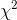
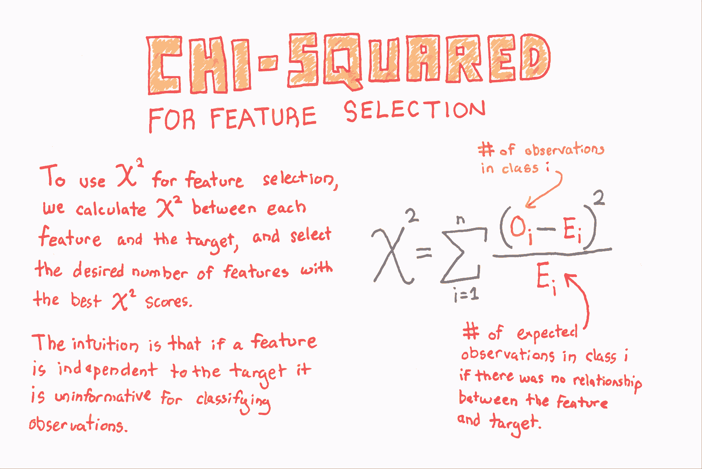
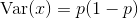
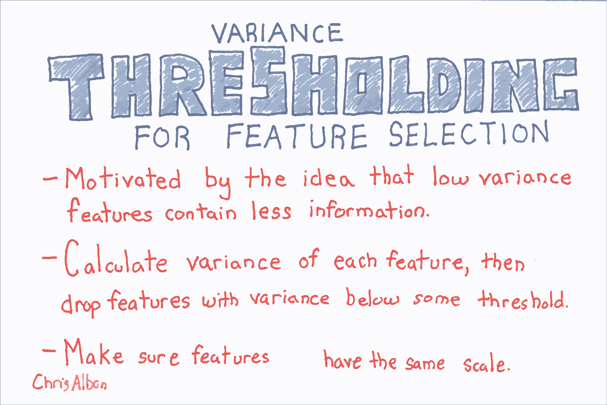

# 八、特征选择

> 作者：[Chris Albon](https://chrisalbon.com/)
> 
> 译者：[飞龙](https://github.com/wizardforcel)
> 
> 协议：[CC BY-NC-SA 4.0](http://creativecommons.org/licenses/by-nc-sa/4.0/)

## 用于特征选取的 ANOVA F 值

如果特征是类别的，计算每个特征与目标向量之间的卡方（）统计量。 但是，如果特征是定量的，则计算每个特征与目标向量之间的 ANOVA F 值。

F 值得分检查当我们按照目标向量对数字特征进行分组时，每个组的均值是否显着不同。

```py
# 加载库
from sklearn.datasets import load_iris
from sklearn.feature_selection import SelectKBest
from sklearn.feature_selection import f_classif

# 加载鸢尾花数据
iris = load_iris()

# 创建特征和标签
X = iris.data
y = iris.target

# 创建 SelectKBest 对象来选择两个带有最佳 ANOVA F 值的特征
fvalue_selector = SelectKBest(f_classif, k=2)

# 对 SelectKBest 对象应用特征和标签
X_kbest = fvalue_selector.fit_transform(X, y)

# 展示结果
print('Original number of features:', X.shape[1])
print('Reduced number of features:', X_kbest.shape[1])

'''
Original number of features: 4
Reduced number of features: 2 
'''
```

## 用于特征选择的卡方



```py
# 加载库
from sklearn.datasets import load_iris
from sklearn.feature_selection import SelectKBest
from sklearn.feature_selection import chi2

# 加载鸢尾花数据
iris = load_iris()

# 创建特征和目标
X = iris.data
y = iris.target

# 通过将数据转换为整数，转换为类别数据
X = X.astype(int)

# 选择两个卡方统计量最高的特征
chi2_selector = SelectKBest(chi2, k=2)
X_kbest = chi2_selector.fit_transform(X, y)

# 展示结果
print('Original number of features:', X.shape[1])
print('Reduced number of features:', X_kbest.shape[1])

'''
Original number of features: 4
Reduced number of features: 2 
'''
```

## 丢弃高度相关的特征

```py
# 加载库
import pandas as pd
import numpy as np

# 创建特征矩阵，具有两个高度相关特征
X = np.array([[1, 1, 1],
              [2, 2, 0],
              [3, 3, 1],
              [4, 4, 0],
              [5, 5, 1],
              [6, 6, 0],
              [7, 7, 1],
              [8, 7, 0],
              [9, 7, 1]])

# 将特征矩阵转换为 DataFrame
df = pd.DataFrame(X)

# 查看数据帧
df
```

|  | 0 | 1 | 2 |
| --- | --- | --- | --- |
| 0 | 1 | 1 | 1 |
| 1 | 2 | 2 | 0 |
| 2 | 3 | 3 | 1 |
| 3 | 4 | 4 | 0 |
| 4 | 5 | 5 | 1 |
| 5 | 6 | 6 | 0 |
| 6 | 7 | 7 | 1 |
| 7 | 8 | 7 | 0 |
| 8 | 9 | 7 | 1 |

```py
# 创建相关度矩阵
corr_matrix = df.corr().abs()

# 选择相关度矩阵的上三角
upper = corr_matrix.where(np.triu(np.ones(corr_matrix.shape), k=1).astype(np.bool))

# 寻找相关度大于 0.95 的特征列的索引
to_drop = [column for column in upper.columns if any(upper[column] > 0.95)]

# 丢弃特征
df.drop(df.columns[to_drop], axis=1)
```

|  | 0 | 2 |
| --- | --- | --- |
| 0 | 1 | 1 |
| 1 | 2 | 0 |
| 2 | 3 | 1 |
| 3 | 4 | 0 |
| 4 | 5 | 1 |
| 5 | 6 | 0 |
| 6 | 7 | 1 |
| 7 | 8 | 0 |
| 8 | 9 | 1 |

## 递归特征消除

```py
# 加载库
from sklearn.datasets import make_regression
from sklearn.feature_selection import RFECV
from sklearn import datasets, linear_model
import warnings

# 消除烦人但无害的警告
warnings.filterwarnings(action="ignore", module="scipy", message="^internal gelsd")

# 生成特征矩阵，目标向量和真实相关度
X, y = make_regression(n_samples = 10000,
                       n_features = 100,
                       n_informative = 2,
                       random_state = 1)

# 创建线性回归
ols = linear_model.LinearRegression()

# 创建递归特征消除器，按照 MSE 对特征评分
rfecv = RFECV(estimator=ols, step=1, scoring='neg_mean_squared_error')

# 拟合递归特征消除器
rfecv.fit(X, y)

# 递归特征消除
rfecv.transform(X)

'''
array([[ 0.00850799,  0.7031277 , -1.2416911 , -0.25651883, -0.10738769],
       [-1.07500204,  2.56148527,  0.5540926 , -0.72602474, -0.91773159],
       [ 1.37940721, -1.77039484, -0.59609275,  0.51485979, -1.17442094],
       ..., 
       [-0.80331656, -1.60648007,  0.37195763,  0.78006511, -0.20756972],
       [ 0.39508844, -1.34564911, -0.9639982 ,  1.7983361 , -0.61308782],
       [-0.55383035,  0.82880112,  0.24597833, -1.71411248,  0.3816852 ]]) 
'''

# 最佳特征数量
rfecv.n_features_

# 5 
```

## 方差阈值二元特征

```py
from sklearn.feature_selection import VarianceThreshold

# 创建特征矩阵：
# 特征 0：80% 的类 0
# 特征 1：80% 的类 1
# 特征 2：60% 的类 0，40% 的类 1
X = [[0, 1, 0],
     [0, 1, 1],
     [0, 1, 0],
     [0, 1, 1],
     [1, 0, 0]]
```

在二元特征（即伯努利随机变量）中，方差计算如下：

](../img/tex-6959801ea921957ed53ddaab936b9409.gif)

其中  是类 1 观测的比例。 因此，通过设置 ，我们可以删除绝大多数观察是类 1 的特征。

```py
# Run threshold by variance
thresholder = VarianceThreshold(threshold=(.75 * (1 - .75)))
thresholder.fit_transform(X)

'''
array([[0],
       [1],
       [0],
       [1],
       [0]]) 
'''
```

## 用于特征选择的方差阈值



```py
from sklearn import datasets
from sklearn.feature_selection import VarianceThreshold

# 加载鸢尾花数据
iris = datasets.load_iris()

# 创建特征和目标
X = iris.data
y = iris.target

# 使用方差阈值 0.5 创建 VarianceThreshold 对象
thresholder = VarianceThreshold(threshold=.5)

# 应用方差阈值
X_high_variance = thresholder.fit_transform(X)

# 查看方差大于阈值的前五行
X_high_variance[0:5]

'''
array([[ 5.1,  1.4,  0.2],
       [ 4.9,  1.4,  0.2],
       [ 4.7,  1.3,  0.2],
       [ 4.6,  1.5,  0.2],
       [ 5\. ,  1.4,  0.2]]) 
'''
```
