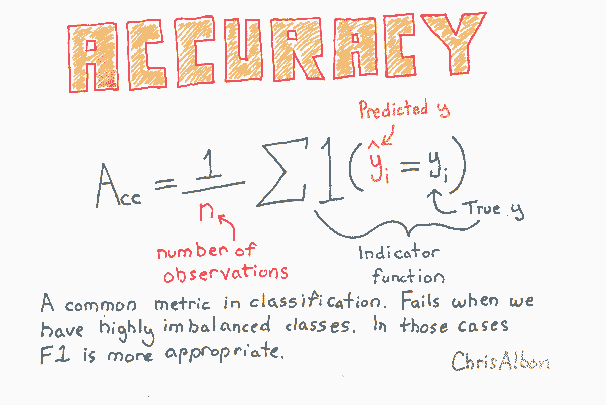
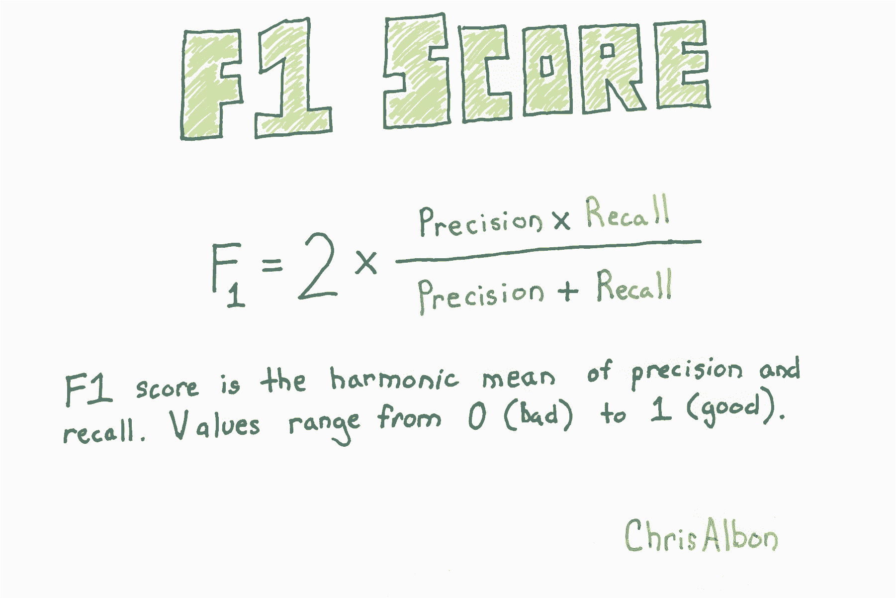
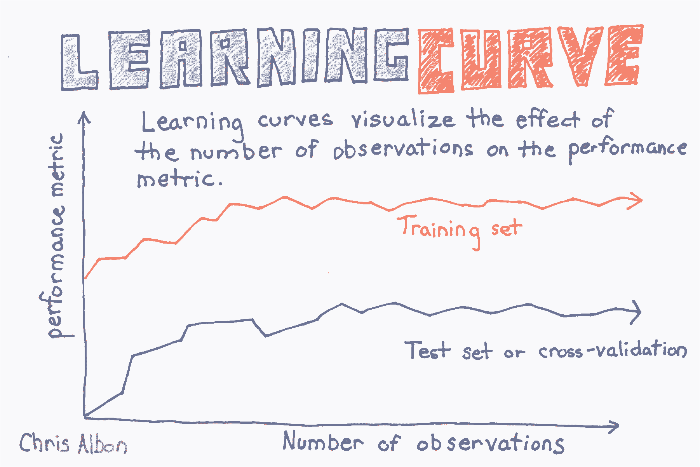
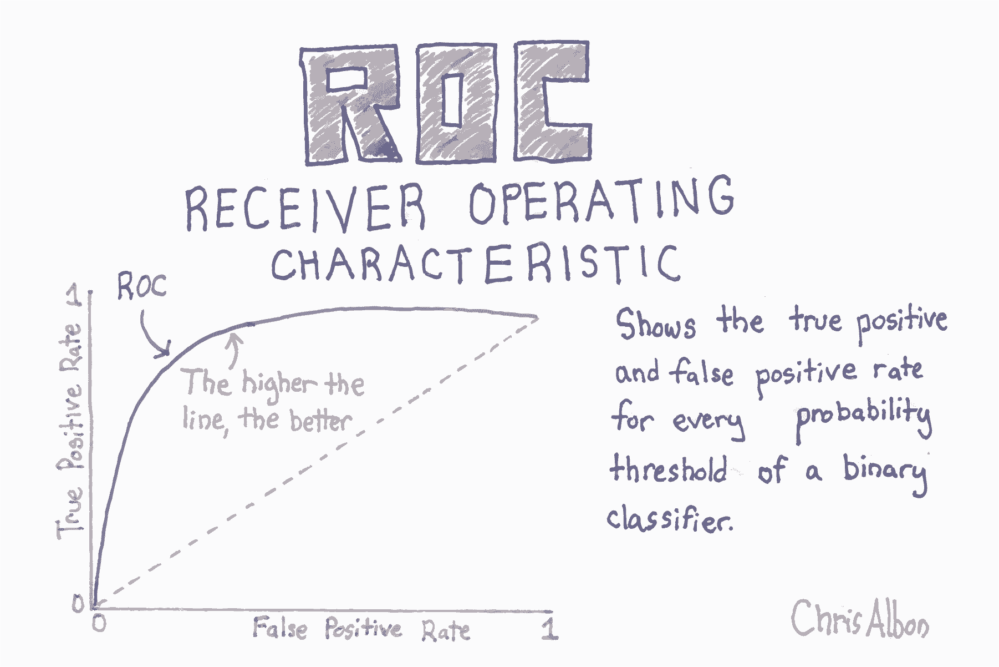
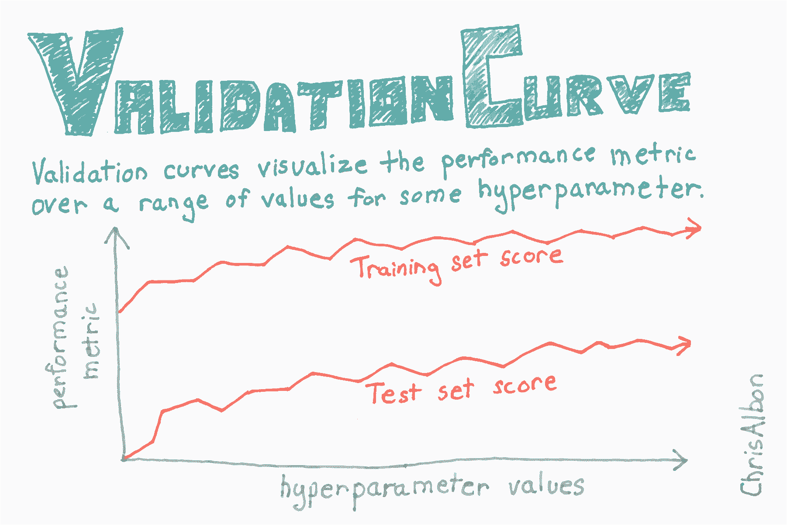
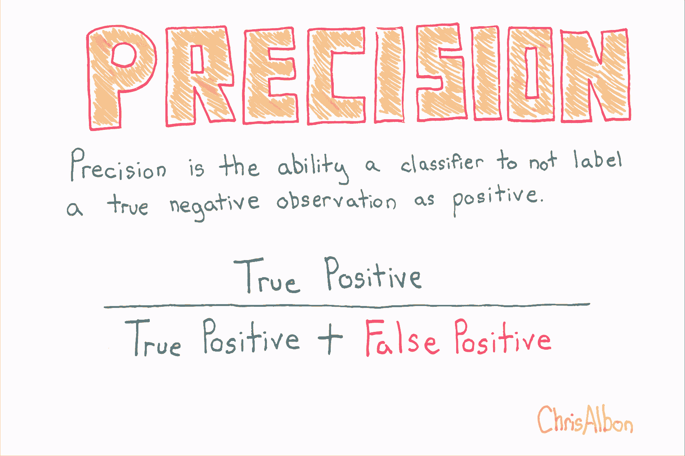
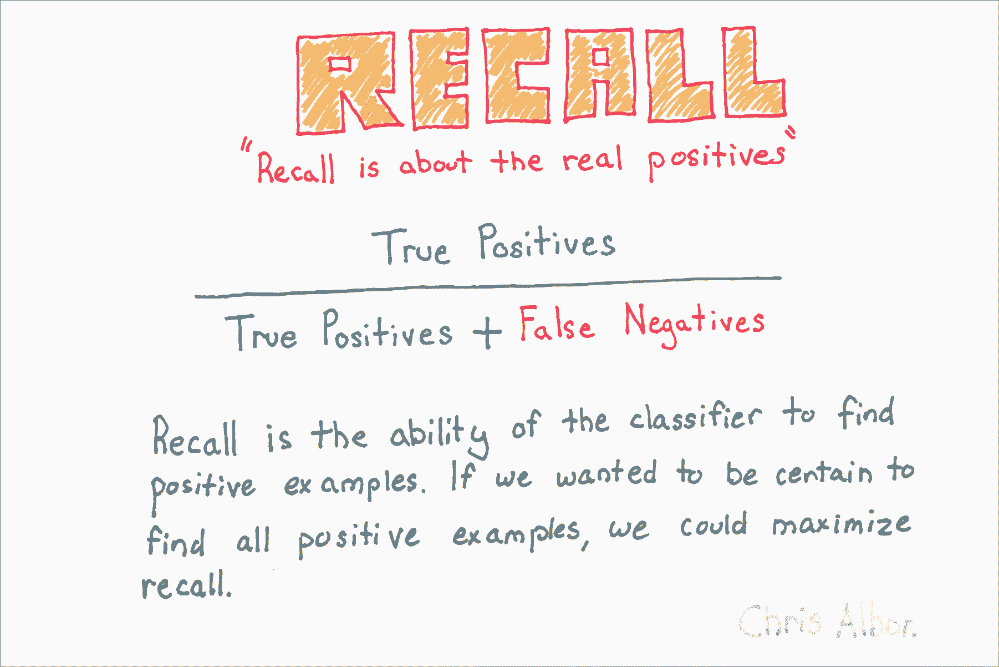

# 九、模型验证

> 作者：[Chris Albon](https://chrisalbon.com/)
> 
> 译者：[飞龙](https://github.com/wizardforcel)
> 
> 协议：[CC BY-NC-SA 4.0](http://creativecommons.org/licenses/by-nc-sa/4.0/)

# 准确率



```py
# 加载库
from sklearn.model_selection import cross_val_score
from sklearn.linear_model import LogisticRegression
from sklearn.datasets import make_classification

# 生成特征矩阵和目标向量
X, y = make_classification(n_samples = 10000,
                           n_features = 3,
                           n_informative = 3,
                           n_redundant = 0,
                           n_classes = 2,
                           random_state = 1)

# 创建逻辑回归
logit = LogisticRegression()

# 使用准确率交叉验证模型
cross_val_score(logit, X, y, scoring="accuracy")

# array([ 0.95170966,  0.9580084 ,  0.95558223]) 
```

# 创建基线分类模型

```py
# 加载库
from sklearn.datasets import load_iris
from sklearn.dummy import DummyClassifier
from sklearn.model_selection import train_test_split

# 加载数据
iris = load_iris()

# 创建特征矩阵和目标向量
X, y = iris.data, iris.target

# 分割为训练集和测试集
X_train, X_test, y_train, y_test = train_test_split(X, y, random_state=0)

# 创建虚拟分类器
dummy = DummyClassifier(strategy='uniform', random_state=1)

# “训练”模型
dummy.fit(X_train, y_train)

# DummyClassifier(constant=None, random_state=1, strategy='uniform') 

# 获取准确率得分
dummy.score(X_test, y_test) 

# 0.42105263157894735 
```

# 创建基线回归模型

```py
# 加载库
from sklearn.datasets import load_boston
from sklearn.dummy import DummyRegressor
from sklearn.model_selection import train_test_split
from sklearn.preprocessing import StandardScaler

# 加载数据
boston = load_boston()

# 创建特征
X, y = boston.data, boston.target

# 分割训练和测试集
X_train, X_test, y_train, y_test = train_test_split(X, y, random_state=0)

# 创建虚拟回归器
dummy_mean = DummyRegressor(strategy='mean')

# “训练”虚拟回归器
dummy_mean.fit(X_train, y_train)

# DummyRegressor(constant=None, quantile=None, strategy='mean') 

# 创建虚拟回归器
dummy_constant = DummyRegressor(strategy='constant', constant=20)

# “训练”虚拟回归器
dummy_constant.fit(X_train, y_train)

# DummyRegressor(constant=array(20), quantile=None, strategy='constant') 

# 获取 R 方得分
dummy_constant.score(X_test, y_test) 

# -0.065105020293257265 
```

# 交叉验证流水线

下面的代码只在几行中做了很多。 为了有助于解释，以下是代码正在执行的步骤：

1.  将原始数据拆分为三个部分。 选择一个用于测试，两个用于训练。
2.  通过缩放训练特征来预处理数据。
3.  在训练数据上训练支持向量分类器。
4.  将分类器应用于测试数据。
5.  记录准确率得分。
6.  重复步骤 1-5 两次，每次一个折。
7.  计算所有折的平均得分。

```py
from sklearn.datasets import load_iris
from sklearn.pipeline import make_pipeline
from sklearn import preprocessing
from sklearn import cross_validation
from sklearn import svm
```

在本教程中，我们将使用着名的[鸢尾花数据集](https://en.wikipedia.org/wiki/Iris_flower_data_set)。鸢尾花数据包含 150 种鸢尾花的四个测量值，以及它的品种。 我们将使用支持向量分类器来预测鸢尾花的品种。

```py
# 加载鸢尾花数据
iris = load_iris()

# 查看鸢尾花数据特征的前三行
iris.data[0:3]

array([[ 5.1,  3.5,  1.4,  0.2],
       [ 4.9,  3. ,  1.4,  0.2],
       [ 4.7,  3.2,  1.3,  0.2]]) 

# 查看鸢尾花数据目标的前三行。0 代表花是山鸢尾。
iris.target[0:3]

# array([0, 0, 0]) 
```

现在我们为数据创建一个流水线。 首先，流水线通过特征变量的值缩放为零均值和单位方差，来预处理数据。 其次，管道使用`C = 1`训练数据的支持分类器。 `C`是边距的成本函数。 `C`越高，模型对于在超平面的错误的一侧的观察的容忍度越低。

```py
# 创建缩放数据的流水线，之后训练支持向量分类器
classifier_pipeline = make_pipeline(preprocessing.StandardScaler(), svm.SVC(C=1))
```

Scikit 提供了一个很好的辅助函数，可以轻松进行交叉验证。 具体来说，下面的代码将数据分成三个部分，然后在鸢尾花数据上执行分类器流水线。

来自[ scikit 文档](http://scikit-learn.org/stable/modules/generated/sklearn.cross_validation.cross_val_score.html#sklearn.cross_validation.cross_val_score)的重要说明：对于整数或者`None`的输入，如果`y`是二元或多类，使用`StratifiedKFold`。如果估计器是分类器，或者如果`y既`不是二元也不是多类，则使用`KFold`。

```py
# KFold/StratifiedKFold 三折交叉验证（默认值）
# applying the classifier pipeline to the feature and target data
scores = cross_validation.cross_val_score(classifier_pipeline, iris.data, iris.target, cv=3)
```

这是我们的 3 `KFold`交叉验证的输出。 当留出一个不同的折时，每个值都是支持向量分类器的准确率得分。有三个值，因为有三个折。 准确度得分越高越好。

```py
scores

# array([ 0.98039216,  0.90196078,  0.97916667]) 
```

为了更好地衡量模型的准确率，我们计算了三个得分的平均值。这是我们衡量模型准确率的标准。

```py
scores.mean()

# 0.95383986928104569 
```

# 带有网格搜索参数调优的交叉验证

在机器学习中，通常在数据流水线中同时完成两项任务：交叉验证和（超）参数调整。 交叉验证是使用一组数据训练学习器并使用不同的集合对其进行测试的过程。 参数调整是选择模型参数值的过程，可最大限度地提高模型的准确性。

在本教程中，我们将编写示例，它使用 Scikit-learn 结合交叉验证和参数调整。

注意：本教程基于[ scikit-learn 文档中给出的示例](http://scikit-learn.org/stable/modules/grid_search.html#grid-search)。 我在文档中结合了一些示例，简化了代码，并添加了大量的解释/代码注释。

```py
import numpy as np
from sklearn.grid_search import GridSearchCV
from sklearn import datasets, svm
import matplotlib.pyplot as plt
```

在下面的代码中，我们加载[`digits`数据集](http://scikit-learn.org/stable/auto_examples/datasets/plot_digits_last_image.html)，其中包含 64 个特征变量。 每个特征表示手写数字的 8 乘 8 图像中的像素的暗度。 我们可以查看第一个观测的这些特征：

```py
# 加载数字数据
digits = datasets.load_digits()

# 查看第一个观测的特征
digits.data[0:1]

'''
array([[  0.,   0.,   5.,  13.,   9.,   1.,   0.,   0.,   0.,   0.,  13.,
         15.,  10.,  15.,   5.,   0.,   0.,   3.,  15.,   2.,   0.,  11.,
          8.,   0.,   0.,   4.,  12.,   0.,   0.,   8.,   8.,   0.,   0.,
          5.,   8.,   0.,   0.,   9.,   8.,   0.,   0.,   4.,  11.,   0.,
          1.,  12.,   7.,   0.,   0.,   2.,  14.,   5.,  10.,  12.,   0.,
          0.,   0.,   0.,   6.,  13.,  10.,   0.,   0.,   0.]]) 
'''
```

目标数据是包含图像真实数字的向量。 例如，第一个观测是手写数字 '0'。

```py
# 查看第一个观测的标签
digits.target[0:1]

# array([0]) 
```

为了演示交叉验证和参数调整，首先我们要将数字数据分成两个名为`data1`和`data2`的数据集。 `data1`包含数字数据的前 1000 行，而`data2`包含剩余的约 800 行。 请注意，这个拆分与我们将要进行的交叉验证是完全相同的，并且完全是为了在本教程的最后展示一些内容。 换句话说，现在不要担心`data2`，我们会回过头来看看它。

```py
# 创建数据集 1
data1_features = digits.data[:1000]
data1_target = digits.target[:1000]

# 创建数据集 2
data2_features = digits.data[1000:]
data2_target = digits.target[1000:]
```

在查找哪个参数值组合产生最准确的模型之前，我们必须指定我们想要尝试的不同候选值。 在下面的代码中，我们有许多候选参数值，包括`C`（`1,10,100,1000`）的四个不同值，`gamma`（`0.001,0.0001`）的两个值，以及两个核 （`linear, rbf`）。 网格搜索将尝试参数值的所有组合，并选择提供最准确模型的参数集。

```py
parameter_candidates = [
  {'C': [1, 10, 100, 1000], 'kernel': ['linear']},
  {'C': [1, 10, 100, 1000], 'gamma': [0.001, 0.0001], 'kernel': ['rbf']},
]
```

现在我们准备使用 scikit-learn 的`GridSearchCV`进行网格搜索，它代表网格搜索交叉验证。 默认情况下，`GridSearchCV`的交叉验证使用 3 折`KFold`或`StratifiedKFold`，取决于具体情况。

```py
# 使用分类器和参数候选创建分类器对象
clf = GridSearchCV(estimator=svm.SVC(), param_grid=parameter_candidates, n_jobs=-1)

# 在 data1 的特征和目标数据上训练分类器
clf.fit(data1_features, data1_target) 

'''
GridSearchCV(cv=None, error_score='raise',
       estimator=SVC(C=1.0, cache_size=200, class_weight=None, coef0=0.0,
  decision_function_shape=None, degree=3, gamma='auto', kernel='rbf',
  max_iter=-1, probability=False, random_state=None, shrinking=True,
  tol=0.001, verbose=False),
       fit_params={}, iid=True, n_jobs=-1,
       param_grid=[{'kernel': ['linear'], 'C': [1, 10, 100, 1000]}, {'kernel': ['rbf'], 'gamma': [0.001, 0.0001], 'C': [1, 10, 100, 1000]}],
       pre_dispatch='2*n_jobs', refit=True, scoring=None, verbose=0) 
'''
```

成功了！ 我们得到了结果！ 首先，让我们看一下将模型应用于`data1`的测试数据时的准确率得分。

```py
# 查看准确率得分
print('Best score for data1:', clf.best_score_) 

# Best score for data1: 0.942 
```

哪个参数最好？ 我们可以让 scikit-learn 显示它们：

```py
# 查看使用网格搜索发现的模型的最佳参数
print('Best C:',clf.best_estimator_.C) 
print('Best Kernel:',clf.best_estimator_.kernel)
print('Best Gamma:',clf.best_estimator_.gamma)

'''
Best C: 10
Best Kernel: rbf
Best Gamma: 0.001 
'''
```

这告诉我们最准确的模型使用`C = 10`，`rbf`内核和`gamma = 0.001`。

还记得我们创建的第二个数据集吗？ 现在我们将使用它来证明模型实际使用这些参数。 首先，我们将刚训练的分类器应用于第二个数据集。 然后我们将使用由网格搜索找到的参数，从头开始训练新的支持向量分类器。 对于这两个模型，我们应该得到相同的结果。

```py
# 将使用 data1 训练的分类器应用于 data2，并查看准确率得分
clf.score(data2_features, data2_target) 

# 0.96988707653701378 

# 使用网格搜索找到的最佳参数训练新的分类器
svm.SVC(C=10, kernel='rbf', gamma=0.001).fit(data1_features, data1_target).score(data2_features, data2_target)

# 0.96988707653701378 
```

成功了！

# 交叉验证

```py
# 加载库
import numpy as np
from sklearn import datasets
from sklearn import metrics
from sklearn.model_selection import KFold, cross_val_score
from sklearn.pipeline import make_pipeline
from sklearn.linear_model import LogisticRegression
from sklearn.preprocessing import StandardScaler

# 加载数字数据集
digits = datasets.load_digits()

# 创建特征矩阵
X = digits.data

# 创建目标向量
y = digits.target

# 创建标准化器
standardizer = StandardScaler()

# 创建逻辑回归
logit = LogisticRegression()

# 创建流水线，它标准化并且运行逻辑回归
pipeline = make_pipeline(standardizer, logit)

# 创建 K 折交叉验证
kf = KFold(n_splits=10, shuffle=True, random_state=1)

# 执行 K 折交叉验证
cv_results = cross_val_score(pipeline, # 流水线
                             X, # 特征矩阵
                             y, # 目标向量
                             cv=kf, # 交叉验证机制
                             scoring="accuracy", # 损失函数
                             n_jobs=-1) # 使用所有 CPU

# 计算均值
cv_results.mean()

# 0.96493171942892597 
```

# 自定义表现指标

```py
# 加载库
from sklearn.metrics import make_scorer, r2_score
from sklearn.model_selection import train_test_split
from sklearn.linear_model import Ridge
from sklearn.datasets import make_regression

# Generate features matrix and target vector
X, y = make_regression(n_samples = 100,
                          n_features = 3,
                          random_state = 1)

# 创建训练和测试集
X_train, X_test, y_train, y_test = train_test_split(X, y, test_size=0.10, random_state=1)

# 创建岭回归对象
classifier = Ridge()

# 训练岭回归模型
model = classifier.fit(X_train, y_train)
```

在这个例子中，我们只是计算 r 方得分，但我们可以看到可以使用任何计算。

```py
# 创建自定义指标
def custom_metric(y_test, y_pred):
    # 计算 r 方得分
    r2 = r2_score(y_test, y_pred)
    # 返回 r 方得分
    return r2

# 创建计分器，定义得分越高越好
score = make_scorer(custom_metric, greater_is_better=True)

# 对岭回归应用计分器
score(model, X_test, y_test)

# 0.99979061028820582 
```

# F1 得分



```py
# 加载库
from sklearn.model_selection import cross_val_score
from sklearn.linear_model import LogisticRegression
from sklearn.datasets import make_classification

# 生成特征矩阵和目标向量
X, y = make_classification(n_samples = 10000,
                           n_features = 3,
                           n_informative = 3,
                           n_redundant = 0,
                           n_classes = 2,
                           random_state = 1)

# 创建逻辑回归
logit = LogisticRegression()

# 使用精确率交叉验证
cross_val_score(logit, X, y, scoring="f1")

# array([ 0.95166617,  0.95765275,  0.95558223]) 
```

# 生成表现的文本报告

```py
# 加载库
from sklearn import datasets
from sklearn.linear_model import LogisticRegression
from sklearn.model_selection import train_test_split
from sklearn.metrics import classification_report

# 加载数据
iris = datasets.load_iris()

# 创建特征矩阵
X = iris.data

# 创建目标向量
y = iris.target

# 创建目标分类名称的列表
class_names = iris.target_names

# 创建训练和测试集
X_train, X_test, y_train, y_test = train_test_split(X, y, random_state=1)

# 创建逻辑回归
classifier = LogisticRegression()

# 训练模型并作出预测
y_hat = classifier.fit(X_train, y_train).predict(X_test)

# 创建分类报告
print(classification_report(y_test, y_hat, target_names=class_names))

'''
 precision    recall  f1-score   support

     setosa       1.00      1.00      1.00        13
 versicolor       1.00      0.62      0.77        16
  virginica       0.60      1.00      0.75         9

avg / total       0.91      0.84      0.84        38 
'''
```

注意：支持度是指每个类别中的观侧数量。

# 嵌套交叉验证

通常我们想调整模型的参数（例如，支持向量机中的`C`）。 也就是说，我们希望找到最小化损失函数的参数值。 最好的方法是交叉验证：

1.  将要调整的参数设置为某个值。
2.  将数据拆分为 K 折（部分）。
3.  使用参数值使用 K-1 折训练模型。
4.  在剩余一折上测试你的模型。
5.  重复步骤 3 和 4，使每一折都成为测试数据一次。
6.  对参数的每个可能值重复步骤 1 到 5。
7.  报告产生最佳结果的参数。

但是，正如[ Cawley 和 Talbot ](http://jmlr.org/papers/volume11/cawley10a/cawley10a.pdf)在 2010 年的论文中指出，因为我们使用测试集来选择参数的值，和验证模型，我们乐观地偏向于我们的模型评估。 因此，如果使用测试集来选择模型参数，那么我们需要一个不同的测试集，来获得对所选模型的无偏估计。

克服此问题的一种方法是使用嵌套交叉验证。 首先，内部交叉验证用于调整参数并选择最佳模型。 其次，外部交叉验证用于评估由内部交叉验证选择的模型。

```py
# 加载所需的库
from sklearn import datasets
from sklearn.model_selection import GridSearchCV, cross_val_score
from sklearn.preprocessing import StandardScaler
import numpy as np
from sklearn.svm import SVC
```

本教程的数据是具有 30 个特征和二元目标变量的[乳腺癌数据](http://scikit-learn.org/stable/modules/generated/sklearn.datasets.load_breast_cancer.html)。

```py
# 加载数据
dataset = datasets.load_breast_cancer()

# 从特征创建 X
X = dataset.data

# 从目标创建 y
y = dataset.target

# 创建缩放器对象
sc = StandardScaler()

# 使缩放器拟合特征数据，并转换
X_std = sc.fit_transform(X)
```

这是我们的内部交叉验证。 我们将使用它来寻找`C`的最佳参数，这是误分类数据点的惩罚。 `GridSearchCV`将执行本教程顶部列出的步骤 1-6。

```py
# 为 C 参数创建 10 个候选值的列表
C_candidates = dict(C=np.logspace(-4, 4, 10))

# 使用支持向量分类器，和 C 值候选，创建网格搜索对象
clf = GridSearchCV(estimator=SVC(), param_grid=C_candidates)
```

使用嵌套交叉验证进行参数调整时，下面的代码不是必需的，但为了证明我们的内部交叉验证网格搜索可以找到参数`C`的最佳值，我们将在此处运行一次：

```py
# 使交叉验证的网格搜索拟合数据
clf.fit(X_std, y)

# 展示 C 的最佳值
clf.best_estimator_.C

# 2.7825594022071258 
```

通过构造内部交叉验证，我们可以使用`cross_val_score`来评估模型，并进行第二次（外部）交叉验证。

下面的代码将数据分成三折，在两折上运行内部交叉验证（合并在一起），然后在第三折上评估模型。 这重复三次，以便每折用于测试一次。

```py
cross_val_score(clf, X_std, y)

# array([ 0.94736842,  0.97894737,  0.98412698]) 
```

上述每个值都是模型准确率的无偏估计，对于三个测试折中的每一折都有一个。 计算平均，它们将代表在内部交叉验证网格搜索中找到的模型的平均准确度。

# 绘制学习曲线



```py
# 加载库
import numpy as np
import matplotlib.pyplot as plt
from sklearn.ensemble import RandomForestClassifier
from sklearn.datasets import load_digits
from sklearn.model_selection import learning_curve

# 加载数据
digits = load_digits()

# 创建特征矩阵和目标向量
X, y = digits.data, digits.target

# 为不同训练集大小创建 CV 训练和测试得分
train_sizes, train_scores, test_scores = learning_curve(RandomForestClassifier(), 
                                                        X, 
                                                        y,
                                                        # 交叉验证的折数
                                                        cv=10,
                                                        # 评价指标
                                                        scoring='accuracy',
                                                        # 使用计算机所有核
                                                        n_jobs=-1, 
                                                        # 训练集的 50 个不同大小
                                                        train_sizes=np.linspace(0.01, 1.0, 50))

# 创建训练集得分的均值和标准差
train_mean = np.mean(train_scores, axis=1)
train_std = np.std(train_scores, axis=1)

# 创建测试集得分的均值和标准差
test_mean = np.mean(test_scores, axis=1)
test_std = np.std(test_scores, axis=1)

# 绘制直线
plt.plot(train_sizes, train_mean, '--', color="#111111",  label="Training score")
plt.plot(train_sizes, test_mean, color="#111111", label="Cross-validation score")

# 绘制条形
plt.fill_between(train_sizes, train_mean - train_std, train_mean + train_std, color="#DDDDDD")
plt.fill_between(train_sizes, test_mean - test_std, test_mean + test_std, color="#DDDDDD")

# 创建绘图
plt.title("Learning Curve")
plt.xlabel("Training Set Size"), plt.ylabel("Accuracy Score"), plt.legend(loc="best")
plt.tight_layout()
plt.show()
```


# 绘制 ROC 曲线



```py
# 加载库
from sklearn.datasets import make_classification
from sklearn.linear_model import LogisticRegression
from sklearn.metrics import roc_curve, roc_auc_score
from sklearn.model_selection import train_test_split
import matplotlib.pyplot as plt

# 创建特征矩阵和目标向量
X, y = make_classification(n_samples=10000, 
                           n_features=10, 
                           n_classes=2, 
                           n_informative=3,
                           random_state=3)

# 分割为训练集和测试集
X_train, X_test, y_train, y_test = train_test_split(X, y, test_size=0.1, random_state=1)

# 创建分类器
clf = LogisticRegression()

# 训练模型
clf.fit(X_train, y_train)

'''
LogisticRegression(C=1.0, class_weight=None, dual=False, fit_intercept=True,
          intercept_scaling=1, max_iter=100, multi_class='ovr', n_jobs=1,
          penalty='l2', random_state=None, solver='liblinear', tol=0.0001,
          verbose=0, warm_start=False) 
'''

# 获取预测概率
y_score = clf.predict_proba(X_test)[:,1]

# 创建真和假正率
false_positive_rate, true_positive_rate, threshold = roc_curve(y_test, y_score)

# 绘制 ROC 曲线
plt.title('Receiver Operating Characteristic')
plt.plot(false_positive_rate, true_positive_rate)
plt.plot([0, 1], ls="--")
plt.plot([0, 0], [1, 0] , c=".7"), plt.plot([1, 1] , c=".7")
plt.ylabel('True Positive Rate')
plt.xlabel('False Positive Rate')
plt.show()
```


# 绘制验证曲线



```py
# 加载库
import matplotlib.pyplot as plt
import numpy as np
from sklearn.datasets import load_digits
from sklearn.ensemble import RandomForestClassifier
from sklearn.model_selection import validation_curve

# 加载数据
digits = load_digits()

# 创建特征矩阵和目标向量
X, y = digits.data, digits.target

# 为参数创建值的范围
param_range = np.arange(1, 250, 2)

# 使用参数值的范围，在训练和测试集上计算准确率
train_scores, test_scores = validation_curve(RandomForestClassifier(), 
                                             X, 
                                             y, 
                                             param_name="n_estimators", 
                                             param_range=param_range,
                                             cv=3, 
                                             scoring="accuracy", 
                                             n_jobs=-1)

# 为训练集得分计算均值和标准差
train_mean = np.mean(train_scores, axis=1)
train_std = np.std(train_scores, axis=1)

# 为测试集得分计算均值和标准差
test_mean = np.mean(test_scores, axis=1)
test_std = np.std(test_scores, axis=1)

# 为训练和测试集绘制平均准确率得分
plt.plot(param_range, train_mean, label="Training score", color="black")
plt.plot(param_range, test_mean, label="Cross-validation score", color="dimgrey")

# 为训练和测试集绘制准确率条形
plt.fill_between(param_range, train_mean - train_std, train_mean + train_std, color="gray")
plt.fill_between(param_range, test_mean - test_std, test_mean + test_std, color="gainsboro")

# 创建绘图
plt.title("Validation Curve With Random Forest")
plt.xlabel("Number Of Trees")
plt.ylabel("Accuracy Score")
plt.tight_layout()
plt.legend(loc="best")
plt.show()
```


# 精确率



```py
# 加载库
from sklearn.model_selection import cross_val_score
from sklearn.linear_model import LogisticRegression
from sklearn.datasets import make_classification

# 生成特征矩阵和目标向量
X, y = make_classification(n_samples = 10000,
                           n_features = 3,
                           n_informative = 3,
                           n_redundant = 0,
                           n_classes = 2,
                           random_state = 1)

# 创建逻辑回归
logit = LogisticRegression()

# 使用精确率来交叉验证
cross_val_score(logit, X, y, scoring="precision")

# array([ 0.95252404,  0.96583282,  0.95558223]) 
```

# 召回率



```py
# 加载库
from sklearn.model_selection import cross_val_score
from sklearn.linear_model import LogisticRegression
from sklearn.datasets import make_classification

# Generate features matrix and target vector
X, y = make_classification(n_samples = 10000,
                           n_features = 3,
                           n_informative = 3,
                           n_redundant = 0,
                           n_classes = 2,
                           random_state = 1)

# 生成特征矩阵和目标向量
logit = LogisticRegression()

# 使用召回率来交叉验证
cross_val_score(logit, X, y, scoring="recall")

# array([ 0.95080984,  0.94961008,  0.95558223]) 
```

# 将数据分割为训练和测试集

```py
# 加载库
from sklearn import datasets
from sklearn.preprocessing import StandardScaler
from sklearn.model_selection import train_test_split

# 加载数字数据集
digits = datasets.load_digits()

# 创建特征矩阵
X = digits.data

# 创建目标向量
y = digits.target

# 创建训练和测试集
X_train, X_test, y_train, y_test = train_test_split(X, 
                                                    y, 
                                                    test_size=0.1, 
                                                    random_state=1)

# 创建标准化器
standardizer = StandardScaler()

# 使标准化器拟合训练集
standardizer.fit(X_train)

# StandardScaler(copy=True, with_mean=True, with_std=True) 

# 应用于训练和测试集
X_train_std = standardizer.transform(X_train)
X_test_std = standardizer.transform(X_test)
```
