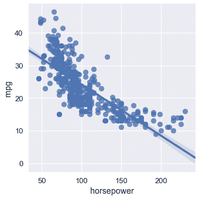
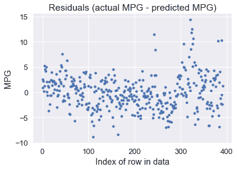
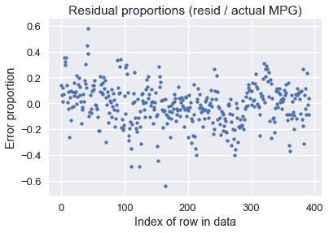
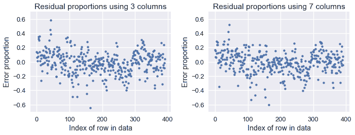
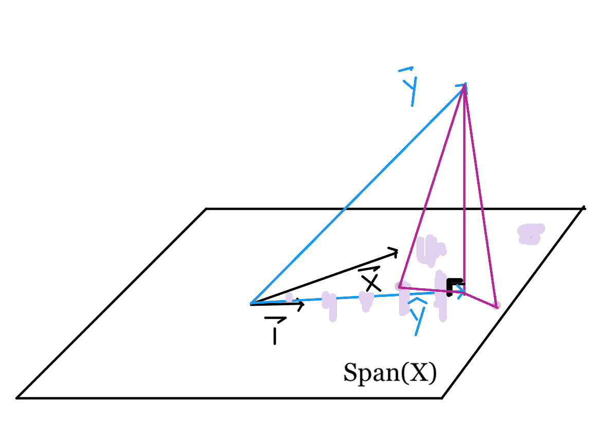
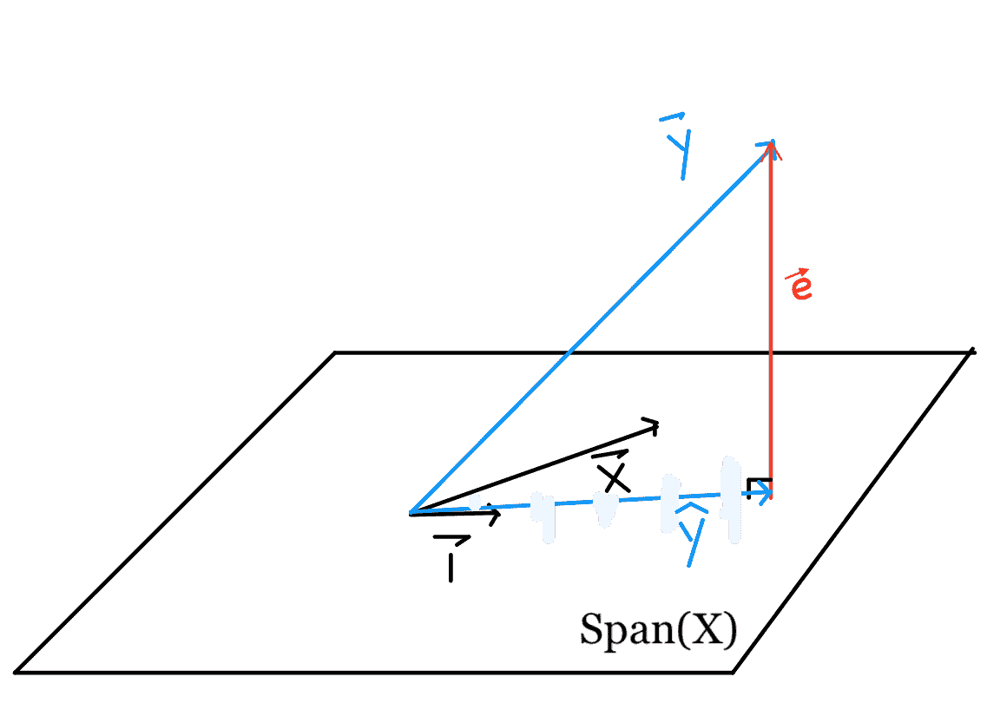
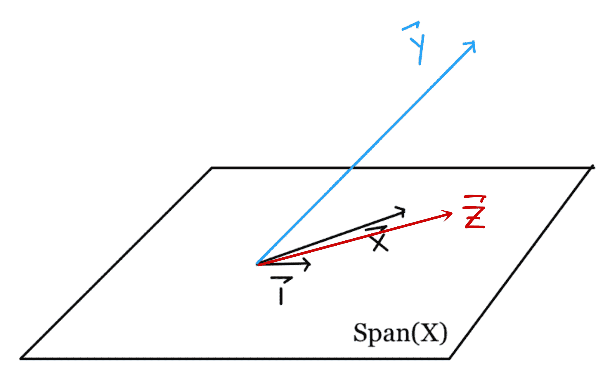
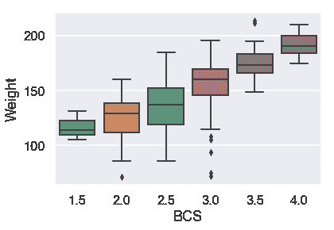
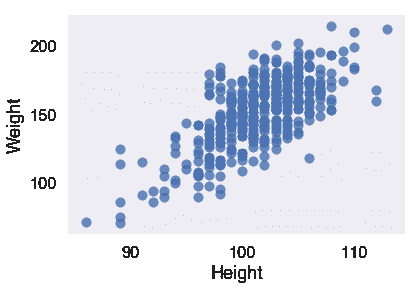
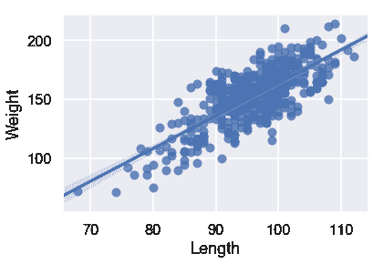

# 十三、线性模型

> 原文：[https://www.bookbookmark.ds100.org/ch/13/linear_models.html](https://www.bookbookmark.ds100.org/ch/13/linear_models.html)

```py
# HIDDEN
# Clear previously defined variables
%reset -f

# Set directory for data loading to work properly
import os
os.chdir(os.path.expanduser('~/notebooks/13'))
```

既然我们有了将模型拟合到成本函数的一般方法，那么我们就将注意力转向模型的改进。为了简单起见，我们以前把自己局限于一个常量模型：我们的模型只预测一个数字。

然而，给我们的服务生这样一个模特，他很难满足。他可能会指出，他收集了更多关于他的桌子的信息，而不仅仅是小费百分比。为什么我们不使用他的其他数据，例如表的大小或总帐单，以使我们的模型更有用？

在本章中，我们将介绍线性模型，它将允许我们利用整个数据集进行预测。线性模型不仅在实践中得到广泛应用，而且具有丰富的理论基础，使我们能够理解未来的建模工具。我们引入了一个简单的线性回归模型，它使用一个解释变量，解释了如何使用梯度下降来拟合模型，最后将模型扩展为包含多个解释变量。

## 13.1 预测小费金额

```py
# HIDDEN
# Clear previously defined variables
%reset -f

# Set directory for data loading to work properly
import os
os.chdir(os.path.expanduser('~/notebooks/13'))
```

```py
# HIDDEN
import warnings
# Ignore numpy dtype warnings. These warnings are caused by an interaction
# between numpy and Cython and can be safely ignored.
# Reference: https://stackoverflow.com/a/40846742
warnings.filterwarnings("ignore", message="numpy.dtype size changed")
warnings.filterwarnings("ignore", message="numpy.ufunc size changed")

import numpy as np
import matplotlib.pyplot as plt
import pandas as pd
import seaborn as sns
%matplotlib inline
import ipywidgets as widgets
from ipywidgets import interact, interactive, fixed, interact_manual
import nbinteract as nbi

sns.set()
sns.set_context('talk')
np.set_printoptions(threshold=20, precision=2, suppress=True)
pd.options.display.max_rows = 7
pd.options.display.max_columns = 8
pd.set_option('precision', 2)
# This option stops scientific notation for pandas
# pd.set_option('display.float_format', '{:.2f}'.format)
```

以前，我们使用一个数据集，该数据集包含一个服务生一周内提供的每个表的一行。我们的服务员收集了这些数据，以便预测他将来从一张桌子上能收到的小费金额。

```py
tips = sns.load_dataset('tips')
tips.head()
```

|  | 账单合计 | 提示 | 性别 | 吸烟者 | 白天 | 时间 | 大小 |
| --- | --- | --- | --- | --- | --- | --- | --- |
| 零 | 十六点九九 | 1.01 年 | 女性 | 不 | 太阳 | 晚餐 | 二 |
| --- | --- | --- | --- | --- | --- | --- | --- |
| 1 个 | 十点三四 | 一点六六 | 男性 | No | Sun | Dinner | 三 |
| --- | --- | --- | --- | --- | --- | --- | --- |
| 二 | 二十一点零一 | 3.50 美元 | Male | No | Sun | Dinner | 3 |
| --- | --- | --- | --- | --- | --- | --- | --- |
| 三 | 二十三点六八 | 三点三一 | Male | No | Sun | Dinner | 2 |
| --- | --- | --- | --- | --- | --- | --- | --- |
| 四 | 二十四点五九 | 三点六一 | Female | No | Sun | Dinner | 四 |
| --- | --- | --- | --- | --- | --- | --- | --- |

```py
sns.distplot(tips['tip'], bins=25);
```


如前所述，如果我们选择一个常数模型和均方误差成本，我们的模型将预测尖端数量的平均值：

```py
np.mean(tips['tip'])
```

```py
2.9982786885245902
```

这意味着，如果一个新的聚会点了一顿饭，服务员问我们他可能会收到多少小费，我们会说“大约 3 美元”，不管桌子有多大，或者他们的总帐单有多少。

然而，观察数据集中的其他变量，我们发现如果我们将它们合并到我们的模型中，我们可能能够做出更准确的预测。例如，下面的小费金额与总账单的图表显示了一个正关联。

```py
# HIDDEN
sns.lmplot(x='total_bill', y='tip', data=tips, fit_reg=False)
plt.title('Tip amount vs. Total Bill')
plt.xlabel('Total Bill')
plt.ylabel('Tip Amount');
```


虽然小费的平均金额是 3 美元，但如果一张桌子订购价值 40 美元的食物，我们肯定会期望服务员收到超过 3 美元的小费。因此，我们希望改变我们的模型，使其基于数据集中的变量进行预测，而不是盲目地预测平均尖端量。为此，我们使用线性模型而不是常量模型。

让我们简要回顾一下我们当前的建模和估计工具箱，并定义一些新的表示法，以便更好地表示线性模型所具有的额外复杂性。

## 定义简单线性模型

我们有兴趣根据一张表的总帐单来预测小费金额。让$Y$代表小费金额，这是我们试图预测的变量。让$x$代表总账单，我们将其合并用于预测的变量。

我们定义了一个线性模型$f_ \boldSymbol\theta^*$依赖于$x$：

$$ f_\boldsymbol\theta^* (x) = \theta_1^* x + \theta_0^* $$

我们将$f_u \boldsymbol\theta^*（x）$作为生成数据的基础函数。

$F_u \boldsymbol\theta^*（x）$假设实际上，$Y$与$X$具有完全线性关系。然而，由于一些随机噪声，我们的观测数据并没有完全沿着直线移动。在数学上，我们通过添加一个噪声项来解释这一点：

$$ y = f_\boldsymbol\theta^* (x) + \epsilon $$

如果假设$Y$与$X$的关系是完全线性的，并且我们能够以某种方式找到$\theta_1^*$和$\theta_0^*$的精确值，并且我们神奇地没有随机噪声，那么我们就能够完美地预测服务员为所有桌子得到的小费的数量，永远。当然，在实践中我们不能完全满足这些标准中的任何一个。相反，我们将使用我们的数据集来估计$\theta_1^*$和$\theta_0^*$以使我们的预测尽可能准确。

### 线性模型估计

由于我们找不到确切的$\Theta_1^*$和$\Theta_0^*$数据，因此我们假设数据集近似于我们的总体，并使用数据集来估计这些参数。我们用$\theta_$和$\theta_$表示我们的估计，用$\hat \theta_ 和$\hat \theta_ 表示我们的拟合估计，我们的模型为：

$$ f_\boldsymbol\theta (x) = \theta_1 x + \theta_0 $$

有时，您会看到$H（x）$而不是$F \BoldSymbol\Theta（x）$的书写，$H$代表假设，因为$F \BoldSymbol\Theta（x）$是我们对$F \BoldSymbol\Theta ^*（x）$的假设。

为了确定$\hat \theta 1 和$\hat \theta 0 美元，我们选择了一个成本函数，并使用梯度下降将其最小化。

## 13.2 用梯度下降拟合线性模型

```py
# HIDDEN
# Clear previously defined variables
%reset -f

# Set directory for data loading to work properly
import os
os.chdir(os.path.expanduser('~/notebooks/13'))
```

```py
# HIDDEN
import warnings
# Ignore numpy dtype warnings. These warnings are caused by an interaction
# between numpy and Cython and can be safely ignored.
# Reference: https://stackoverflow.com/a/40846742
warnings.filterwarnings("ignore", message="numpy.dtype size changed")
warnings.filterwarnings("ignore", message="numpy.ufunc size changed")

import numpy as np
import matplotlib.pyplot as plt
import pandas as pd
import seaborn as sns
%matplotlib inline
import ipywidgets as widgets
from ipywidgets import interact, interactive, fixed, interact_manual
import nbinteract as nbi

sns.set()
sns.set_context('talk')
np.set_printoptions(threshold=20, precision=2, suppress=True)
pd.options.display.max_rows = 7
pd.options.display.max_columns = 8
pd.set_option('precision', 2)
# This option stops scientific notation for pandas
# pd.set_option('display.float_format', '{:.2f}'.format)
```

```py
# HIDDEN
tips = sns.load_dataset('tips')
```

```py
# HIDDEN
def minimize(loss_fn, grad_loss_fn, x_vals, y_vals,
             alpha=0.0005, progress=True):
    '''
    Uses gradient descent to minimize loss_fn. Returns the minimizing value of
    theta once the loss changes less than 0.0001 between iterations.
    '''
    theta = np.array([0., 0.])
    loss = loss_fn(theta, x_vals, y_vals)
    while True:
        if progress:
            print(f'theta: {theta} | loss: {loss}')
        gradient = grad_loss_fn(theta, x_vals, y_vals)
        new_theta = theta - alpha * gradient
        new_loss = loss_fn(new_theta, x_vals, y_vals)

        if abs(new_loss - loss) < 0.0001:
            return new_theta

        theta = new_theta
        loss = new_loss
```

我们希望拟合一个线性模型，该模型根据表中的总账单预测小费金额：

$$ f_\boldsymbol\theta (x) = \theta_1 x + \theta_0 $$

为了优化$\Theta_1$和$\Theta_0$，我们需要首先选择一个损失函数。我们将选择均方误差损失函数：

$$ \begin{aligned} L(\boldsymbol\theta, \textbf{x}, \textbf{y}) &= \frac{1}{n} \sum_{i = 1}^{n}(y_i - f_\boldsymbol\theta (x_i))^2\\ \end{aligned} $$

请注意，我们已经修改了损失函数，以反映在新模型中添加的解释变量。现在，$\textbf x$是一个包含单个总账单的向量，$\textbf y$是一个包含单个小费金额的向量，$\boldsymbol\theta$是一个向量：$\boldsymbol\theta=[\theta\u 1，\theta\u 0]$。

使用带平方误差的线性模型也可以用最小二乘线性回归的名称。我们可以使用渐变下降来找到能将损失最小化的$\BoldSymbol\Theta$。

**关于使用相关性的旁白**

如果您以前见过最小二乘线性回归，您可能会认识到我们可以计算相关系数，并用它来确定$\theta_1$和$\theta_0$。对于这个特定的问题，这比使用梯度下降法计算更简单、更快，类似于计算平均值比使用梯度下降法拟合常量模型更简单。不管怎样，我们都会使用梯度下降，因为它是一种通用的损失最小化方法，当我们稍后引入没有解析解的模型时仍然有效。事实上，在许多现实场景中，即使存在分析解，我们也会使用梯度下降，因为计算分析解比梯度下降要花更长的时间，尤其是在大型数据集上。

## MSE 损失的导数[¶](#Derivative-of-the-MSE-Loss)

为了使用梯度下降，我们必须计算 MSE 损失相对于$\BoldSymbol\Theta$的导数。既然$\BoldSymbol\Theta$是长度为 2 的向量，而不是标量，$\nabla \BoldSymbol\Theta l（\BoldSymbol\Theta、\textbf x、\textbf y）$也将是长度为 2 的向量。

$$ \begin{aligned} \nabla_{\boldsymbol\theta} L(\boldsymbol\theta, \textbf{x}, \textbf{y}) &= \nabla_{\boldsymbol\theta} \left[ \frac{1}{n} \sum_{i = 1}^{n}(y_i - f_\boldsymbol\theta (x_i))^2 \right] \\ &= \frac{1}{n} \sum_{i = 1}^{n}2 (y_i - f_\boldsymbol\theta (x_i))(- \nabla_{\boldsymbol\theta} f_\boldsymbol\theta (x_i))\\ &= -\frac{2}{n} \sum_{i = 1}^{n}(y_i - f_\boldsymbol\theta (x_i))(\nabla_{\boldsymbol\theta} f_\boldsymbol\theta (x_i))\\ \end{aligned} $$

我们知道：

$$ f_\boldsymbol\theta (x) = \theta_1 x + \theta_0 $$

我们现在需要计算$\nabla_ \boldsymbol\theta_f UuBoldsymbol\theta（x_i）$这是一个长度为 2 的向量。

$$ \begin{aligned} \nabla_{\boldsymbol\theta} f_\boldsymbol\theta (x_i) &= \begin{bmatrix} \frac{\partial}{\partial \theta_0} f_\boldsymbol\theta (x_i)\\ \frac{\partial}{\partial \theta_1} f_\boldsymbol\theta (x_i) \end{bmatrix} \\ &= \begin{bmatrix} \frac{\partial}{\partial \theta_0} [\theta_1 x_i + \theta_0]\\ \frac{\partial}{\partial \theta_1} [\theta_1 x_i + \theta_0] \end{bmatrix} \\ &= \begin{bmatrix} 1 \\ x_i \end{bmatrix} \\ \end{aligned} $$

最后，我们再回到上面的公式中，得到

$$ \begin{aligned} \nabla_{\boldsymbol\theta} L(\theta, \textbf{x}, \textbf{y}) &= -\frac{2}{n} \sum_{i = 1}^{n}(y_i - f_\boldsymbol\theta (x_i))(\nabla_{\boldsymbol\theta} f_\boldsymbol\theta (x_i))\\ &= -\frac{2}{n} \sum_{i = 1}^{n} (y_i - f_\boldsymbol\theta (x_i)) \begin{bmatrix} 1 \\ x_i \end{bmatrix} \\ &= -\frac{2}{n} \sum_{i = 1}^{n} \begin{bmatrix} (y_i - f_\boldsymbol\theta (x_i)) \\ (y_i - f_\boldsymbol\theta (x_i)) x_i \end{bmatrix} \\ \end{aligned} $$

这是一个长度为 2 的向量，因为$（y_i-f_uuBoldSymbol\theta（x_i））$是标量。

## 运行梯度下降

现在，让我们在 tip s 数据集上拟合一个线性模型，从总表账单中预测 tip 金额。

首先，我们定义一个 python 函数来计算损失：

```py
def simple_linear_model(thetas, x_vals):
    '''Returns predictions by a linear model on x_vals.'''
    return thetas[0] + thetas[1] * x_vals

def mse_loss(thetas, x_vals, y_vals):
    return np.mean((y_vals - simple_linear_model(thetas, x_vals)) ** 2)
```

然后，我们定义一个函数来计算损失的梯度：

```py
def grad_mse_loss(thetas, x_vals, y_vals):
    n = len(x_vals)
    grad_0 = y_vals - simple_linear_model(thetas, x_vals)
    grad_1 = (y_vals - simple_linear_model(thetas, x_vals)) * x_vals
    return -2 / n * np.array([np.sum(grad_0), np.sum(grad_1)])
```

```py
# HIDDEN
thetas = np.array([1, 1])
x_vals = np.array([3, 4])
y_vals = np.array([4, 5])
assert np.allclose(grad_mse_loss(thetas, x_vals, y_vals), [0, 0])
```

我们将使用前面定义的`minimize`函数，它运行梯度下降，解释新的解释变量。它具有函数签名（省略正文）：

```py
minimize(loss_fn, grad_loss_fn, x_vals, y_vals)
```

最后，我们进行梯度下降！

```py
%%time

thetas = minimize(mse_loss, grad_mse_loss, tips['total_bill'], tips['tip'])
```

```py
theta: [0\. 0.] | cost: 10.896283606557377
theta: [0\.   0.07] | cost: 3.8937622006094705
theta: [0\.  0.1] | cost: 1.9359443267168215
theta: [0.01 0.12] | cost: 1.388538448286097
theta: [0.01 0.13] | cost: 1.235459416905535
theta: [0.01 0.14] | cost: 1.1926273731479433
theta: [0.01 0.14] | cost: 1.1806184944517062
theta: [0.01 0.14] | cost: 1.177227251696266
theta: [0.01 0.14] | cost: 1.1762453624313751
theta: [0.01 0.14] | cost: 1.1759370980989148
theta: [0.01 0.14] | cost: 1.175817178966766
CPU times: user 272 ms, sys: 67.3 ms, total: 339 ms
Wall time: 792 ms
```

我们可以看到梯度下降收敛到θ的值，即，θ0=0.01 美元，θ1=0.14 美元。我们的线性模型是：

$$y = 0.14x + 0.01$$

我们可以使用我们的估计θ，在原始数据点的旁边做出和绘制预测。

```py
# HIDDEN
x_vals = np.array([0, 55])
sns.lmplot(x='total_bill', y='tip', data=tips, fit_reg=False)
plt.plot(x_vals, simple_linear_model(thetas, x_vals), c='goldenrod')
plt.title('Tip amount vs. Total Bill')
plt.xlabel('Total Bill')
plt.ylabel('Tip Amount');
```


我们可以看到，如果一张桌子的帐单是 10 美元，我们的模型将预测服务员得到大约 1.50 美元的小费。同样，如果一张表的帐单是 40 美元，我们的模型将预测大约 6 美元的小费。

## 13.3 多元线性回归

```py
# HIDDEN
# Clear previously defined variables
%reset -f

# Set directory for data loading to work properly
import os
os.chdir(os.path.expanduser('~/notebooks/13'))
```

```py
# HIDDEN
import warnings
# Ignore numpy dtype warnings. These warnings are caused by an interaction
# between numpy and Cython and can be safely ignored.
# Reference: https://stackoverflow.com/a/40846742
warnings.filterwarnings("ignore", message="numpy.dtype size changed")
warnings.filterwarnings("ignore", message="numpy.ufunc size changed")

import numpy as np
import matplotlib.pyplot as plt
import pandas as pd
import seaborn as sns
%matplotlib inline
import ipywidgets as widgets
from ipywidgets import interact, interactive, fixed, interact_manual
import nbinteract as nbi

sns.set()
sns.set_context('talk')
np.set_printoptions(threshold=20, precision=2, suppress=True)
pd.options.display.max_rows = 7
pd.options.display.max_columns = 8
pd.set_option('precision', 2)
# This option stops scientific notation for pandas
# pd.set_option('display.float_format', '{:.2f}'.format)
```

```py
# HIDDEN
def df_interact(df, nrows=7, ncols=7):
    '''
    Outputs sliders that show rows and columns of df
    '''
    def peek(row=0, col=0):
        return df.iloc[row:row + nrows, col:col + ncols]
    if len(df.columns) <= ncols:
        interact(peek, row=(0, len(df) - nrows, nrows), col=fixed(0))
    else:
        interact(peek,
                 row=(0, len(df) - nrows, nrows),
                 col=(0, len(df.columns) - ncols))
    print('({} rows, {} columns) total'.format(df.shape[0], df.shape[1]))
```

```py
# HIDDEN
from scipy.optimize import minimize as sci_min
def minimize(loss_fn, grad_loss_fn, X, y, progress=True):
    '''
    Uses scipy.minimize to minimize loss_fn using a form of gradient descent.
    '''
    theta = np.zeros(X.shape[1])
    iters = 0

    def objective(theta):
        return loss_fn(theta, X, y)
    def gradient(theta):
        return grad_loss_fn(theta, X, y)
    def print_theta(theta):
        nonlocal iters
        if progress and iters % progress == 0:
            print(f'theta: {theta} | loss: {loss_fn(theta, X, y):.2f}')
        iters += 1

    print_theta(theta)
    return sci_min(
        objective, theta, method='BFGS', jac=gradient, callback=print_theta,
        tol=1e-7
    ).x
```

与常量模型相比，我们的简单线性模型有一个关键优势：它在进行预测时使用数据。然而，由于简单的线性模型在我们的数据集中只使用一个变量，所以它仍然相当有限。许多数据集都有许多潜在的有用变量，多元线性回归可以利用这一点。例如，考虑以下有关车型及其每加仑里程（mpg）的数据集：

```py
mpg = pd.read_csv('mpg.csv').dropna().reset_index(drop=True)
mpg
```

|  | MPG | 气缸 | 取代 | …… | 车型年份 | 起源 | 车名 |
| --- | --- | --- | --- | --- | --- | --- | --- |
| 零 | 18.0 条 | 8 个 | 三百零七 | …… | 70 个 | 1 个 | 雪佛兰 Chevelle Malibu |
| --- | --- | --- | --- | --- | --- | --- | --- |
| 1 个 | 15.0 条 | 8 | 三百五十 | ... | 70 | 1 | 别克云雀 320 |
| --- | --- | --- | --- | --- | --- | --- | --- |
| 二 | 18.0 | 8 | 三百一十八 | ... | 70 | 1 | 普利茅斯卫星 |
| --- | --- | --- | --- | --- | --- | --- | --- |
| ... | ... | ... | ... | ... | ... | ... | ... |
| --- | --- | --- | --- | --- | --- | --- | --- |
| 三百八十九 | 32.0 美元 | 四 | 一百三十五 | ... | 八十二 | 1 | 躲避暴行 |
| --- | --- | --- | --- | --- | --- | --- | --- |
| 三百九十 | 二十八 | 4 | 一百二十 | ... | 82 | 1 | 福特漫游者 |
| --- | --- | --- | --- | --- | --- | --- | --- |
| 391 个 | 三十一 | 4 | 一百一十九 | ... | 82 | 1 | 雪佛兰 S-10 |
| --- | --- | --- | --- | --- | --- | --- | --- |

392 行×9 列

汽车模型的多个属性似乎会影响其 MPG。例如，MPG 似乎随着马力的增加而降低：

```py
# HIDDEN
sns.lmplot(x='horsepower', y='mpg', data=mpg);
```



然而，稍后发布的汽车通常比旧款汽车具有更好的 MPG：

```py
sns.lmplot(x='model year', y='mpg', data=mpg);
```


如果我们能在预测 MPG 时同时考虑马力和车型年份，我们就有可能得到更精确的模型。事实上，最好的模型可能会考虑到数据集中的所有数值变量。我们可以扩展单变量线性回归，以允许基于任意数量的属性进行预测。

我们陈述了以下模型：

$$ f_\boldsymbol\theta (\textbf{x}) = \theta_0 + \theta_1 x_1 + \ldots + \theta_p x_p $$

其中，$\textbf x$现在表示包含单个汽车$p$属性的向量。上面的模型说，“取一辆车的多个属性，乘以一些权重，然后将它们相加，对 MPG 做出预测。”

例如，如果我们使用“马力”、“重量”和“车型年”列对数据集中的第一辆车进行预测，那么向量$\textbf x$

```py
# HIDDEN
mpg.loc[0:0, ['horsepower', 'weight', 'model year']]
```

|  | 马力 | 重量 | model year |
| --- | --- | --- | --- |
| 0 | 一百三十 | 三千五百零四 | 70 |
| --- | --- | --- | --- |

在这里的例子中，为了清晰起见，我们保留了列名，但要记住，$\textbf x$只包含上表的数值：$\textbf x=[130.0，3504.0，70]$。

现在，我们将执行一个符号技巧，它将大大简化后面的公式。我们将在向量$\textbf x 中预先设置$1$的值，这样我们就可以为$\textbf x 获得以下向量：

```py
# HIDDEN
mpg_mat = mpg.assign(bias=1)
mpg_mat.loc[0:0, ['bias', 'horsepower', 'weight', 'model year']]
```

|  | 偏倚 | horsepower | weight | model year |
| --- | --- | --- | --- | --- |
| 0 | 1 | 130.0 | 3504.0 | 70 |
| --- | --- | --- | --- | --- |

现在，观察我们模型的公式发生了什么：

$$ \begin{aligned} f_\boldsymbol\theta (\textbf{x}) &= \theta_0 + \theta_1 x_1 + \ldots + \theta_p x_p \\ &= \theta_0 (1) + \theta_1 x_1 + \ldots + \theta_p x_p \\ &= \theta_0 x_0 + \theta_1 x_1 + \ldots + \theta_p x_p \\ f_\boldsymbol\theta (\textbf{x}) &= \boldsymbol\theta \cdot \textbf{x} \end{aligned} $$

其中，$\boldSymbol\theta\cdot\textbf x$是$\boldSymbol\theta$和$\textbf x$的矢量点积。矢量和矩阵表示法被设计成简洁地写线性组合，因此非常适合我们的线性模型。但是，从现在开始你必须记住，$\BoldSymbol\Theta\CDOT\textBF x$是矢量点积。如果有疑问，可以将点积展开为简单的乘法和加法。

现在，我们将矩阵$\textbf x 定义为包含每个车型的矩阵，作为一行和第一列偏差。例如，下面是前五行$\textbf x$：

```py
# HIDDEN
mpg_mat = mpg.assign(bias=1)
mpg_mat.loc[0:4, ['bias', 'horsepower', 'weight', 'model year']]
```

|  | bias | horsepower | weight | model year |
| --- | --- | --- | --- | --- |
| 0 | 1 | 130.0 | 3504.0 | 70 |
| --- | --- | --- | --- | --- |
| 1 | 1 | 一百六十五 | 三千六百九十三 | 70 |
| --- | --- | --- | --- | --- |
| 2 | 1 | 一百五十 | 三千四百三十六 | 70 |
| --- | --- | --- | --- | --- |
| 三 | 1 | 150.0 | 三千四百三十三 | 70 |
| --- | --- | --- | --- | --- |
| 四 | 1 | 一百四十 | 三千四百四十九 | 70 |
| --- | --- | --- | --- | --- |

同样，请记住，实际矩阵$\textbf x$只包含上表的数值。

注意，$\textbf x$由多个叠加在一起的$\textbf x$向量组成。为了保持符号清晰，我们定义了$\textbf x i$以引用索引为$i$的行向量，索引为$i$of$\textbf x$。我们定义$x_i，j$以引用索引为$j$的元素，索引为$i$的行的索引为$textbf x$。因此，$\textbf x u i$是一个$p$维向量，$x i，j$是一个标量。$\textbf x$是一个$n \乘以 p$矩阵，其中$n$是我们拥有的汽车示例数量，$p$是我们拥有的单个汽车的属性数量。

例如，从上表中，我们有$\textbf x u 4=[1，140，3449，70]$和$x 4，1=140$。当我们定义损失函数时，这个符号变得很重要，因为我们需要输入值的矩阵$\textbf x$，以及 MPG 的向量$\textbf y$。

## MSE 损耗及其梯度

均方误差损失函数采用一个权重为$\BoldSymbol\Theta$的向量、一个输入矩阵$\textbf x 和一个观察到的 mpgs 的向量$\textbf y：

$$ \begin{aligned} L(\boldsymbol\theta, \textbf{X}, \textbf{y}) &= \frac{1}{n} \sum_{i}(y_i - f_\boldsymbol\theta (\textbf{X}_i))^2\\ \end{aligned} $$

我们之前已经推导了 mse 损失相对于$\BoldSymbol\Theta$的梯度：

$$ \begin{aligned} \nabla_{\boldsymbol\theta} L(\boldsymbol\theta, \textbf{X}, \textbf{y}) &= -\frac{2}{n} \sum_{i}(y_i - f_\boldsymbol\theta (\textbf{X}_i))(\nabla_{\boldsymbol\theta} f_\boldsymbol\theta (\textbf{X}_i))\\ \end{aligned} $$

我们知道：

$$ \begin{aligned} f_\boldsymbol\theta (\textbf{x}) &= \boldsymbol\theta \cdot \textbf{x} \\ \end{aligned} $$

现在让我们计算$\nabla_ \boldsymbol\theta_f_boldsymbol\theta（\textbf_x）$。结果是非常简单的，因为$\boldsymbol\theta\cdot\textbf x；=\theta x _0+\ldots+\theta p x _p$和因此\frac \ \部分 \ \部分\theta（\boldsy \\theta\cdot\textbf x）=x 美元，$\frac \ \ \ \部分部分\ \\theta（（\boldsy 符号 theta\cdot\textbf x）=x_1$等在。

$$ \begin{aligned} \nabla_{\boldsymbol\theta} f_\boldsymbol\theta (\textbf{x}) &= \nabla_{\boldsymbol\theta} [ \boldsymbol\theta \cdot \textbf{x} ] \\ &= \begin{bmatrix} \frac{\partial}{\partial \theta_0} (\boldsymbol\theta \cdot \textbf{x}) \\ \frac{\partial}{\partial \theta_1} (\boldsymbol\theta \cdot \textbf{x}) \\ \vdots \\ \frac{\partial}{\partial \theta_p} (\boldsymbol\theta \cdot \textbf{x}) \\ \end{bmatrix} \\ &= \begin{bmatrix} x_0 \\ x_1 \\ \vdots \\ x_p \end{bmatrix} \\ \nabla_{\boldsymbol\theta} f_\boldsymbol\theta (\textbf{x}) &= \textbf{x} \end{aligned} $$

最后，我们将此结果插入到我们的梯度计算中：

$$ \begin{aligned} \nabla_{\boldsymbol\theta} L(\boldsymbol\theta, \textbf{X}, \textbf{y}) &= -\frac{2}{n} \sum_{i}(y_i - f_\boldsymbol\theta (\textbf{X}_i))(\nabla_{\boldsymbol\theta} f_\boldsymbol\theta (\textbf{X}_i))\\ &= -\frac{2}{n} \sum_{i}(y_i - \boldsymbol\theta \cdot \textbf{X}_i)(\textbf{X}_i)\\ \end{aligned} $$

请记住，既然$y_i-\boldsymbol\theta\cdot\textbf x u i$是一个标量，而$textbf x u i$是一个$p$维向量，那么梯度$nabla \boldsymbol\theta l（\boldsymbol\theta、\textbf x、\textbf y）是一个$p$维向量。

当我们计算单变量线性回归的梯度时，我们看到了相同类型的结果，发现它是二维的，因为$\BoldSymbol\Theta$是二维的。

## 用梯度下降法拟合模型

我们现在可以把损失及其导数代入梯度下降。和往常一样，我们将在 python 中定义模型、损失和渐变损失。

```py
def linear_model(thetas, X):
    '''Returns predictions by a linear model on x_vals.'''
    return  \textbf{X} @ thetas

def mse_loss(thetas, X, y):
    return np.mean((y - linear_model(thetas, X)) ** 2)

def grad_mse_loss(thetas, X, y):
    n = len(X)
    return -2 / n * (X.T @ \textbf{y}  - X.T @  \textbf{X} @ thetas)
```

```py
# HIDDEN
thetas = np.array([1, 1, 1, 1])
 \textbf{X} = np.array([[2, 1, 0, 1], [1, 2, 3, 4]])
y = np.array([3, 9])
assert np.allclose(linear_model(thetas, X), [4, 10])
assert np.allclose(mse_loss(thetas, X, y), 1.0)
assert np.allclose(grad_mse_loss(thetas, X, y), [ 3.,  3.,  3.,  5.])
assert np.allclose(grad_mse_loss(thetas,  \textbf{X} + 1, y), [ 25.,  25.,  25.,  35.])
```

现在，我们可以简单地将函数插入梯度下降最小化器：

```py
# HIDDEN
 \textbf{X} = (mpg_mat
     .loc[:, ['bias', 'horsepower', 'weight', 'model year']]
     .as_matrix())
y = mpg_mat['mpg'].as_matrix()
```

```py
%%time 

thetas = minimize(mse_loss, grad_mse_loss, X, y)
print(f'theta: {thetas} | loss: {mse_loss(thetas, X, y):.2f}')
```

```py
theta: [ 0\.  0\.  0\.  0.] | cost: 610.47
theta: [ 0\.    0\.    0.01  0\.  ] | cost: 178.95
theta: [ 0.01 -0.11 -0\.    0.55] | cost: 15.78
theta: [ 0.01 -0.01 -0.01  0.58] | cost: 11.97
theta: [-4\.   -0.01 -0.01  0.63] | cost: 11.81
theta: [-13.72  -0\.    -0.01   0.75] | cost: 11.65
theta: [-13.72  -0\.    -0.01   0.75] | cost: 11.65
CPU times: user 8.81 ms, sys: 3.11 ms, total: 11.9 ms
Wall time: 9.22 ms
```

根据梯度下降，我们的线性模型是：

$Y=-13.72-0.01x_2+0.75x_3$

## 可视化我们的预测

我们的模型怎么样？我们可以看到损失大幅下降（从 610 下降到 11.6）。我们可以显示模型的预测值以及原始值：

```py
# HIDDEN
reordered = ['predicted_mpg', 'mpg', 'horsepower', 'weight', 'model year']
with_predictions = (
    mpg
    .assign(predicted_mpg=linear_model(thetas, X))
    .loc[:, reordered]
)
with_predictions
```

|  | 预测值 | mpg | horsepower | weight | model year |
| --- | --- | --- | --- | --- | --- |
| 0 | 15.447125 | 18.0 | 130.0 | 3504.0 | 70 |
| --- | --- | --- | --- | --- | --- |
| 1 | 14.053509 年 | 15.0 | 165.0 | 3693.0 | 70 |
| --- | --- | --- | --- | --- | --- |
| 2 | 15.785576 个 | 18.0 | 150.0 | 3436.0 | 70 |
| --- | --- | --- | --- | --- | --- |
| ... | ... | ... | ... | ... | ... |
| --- | --- | --- | --- | --- | --- |
| 389 | 32.456900 | 32.0 | 八十四 | 二千二百九十五 | 82 |
| --- | --- | --- | --- | --- | --- |
| 390 | 30.354143 号 | 28.0 | 79.0 美元 | 二千六百二十五 | 82 |
| --- | --- | --- | --- | --- | --- |
| 391 | 29.726608 | 31.0 | 八十二 | 二千七百二十 | 82 |
| --- | --- | --- | --- | --- | --- |

392 行×5 列

由于我们从梯度下降中找到了$\BoldSymbol\Theta$数据，因此我们可以验证第一行数据的$\BoldSymbol\Theta\CDOT\textbf x u 0$与我们上面的预测相匹配：

```py
print(f'Prediction for first row: '
      f'{thetas[0] + thetas[1] * 130 + thetas[2] * 3504 + thetas[3] * 70:.2f}')
```

```py
Prediction for first row: 15.45
```

我们在下面包含了一个小部件来浏览预测和用于进行预测的数据：

```py
# HIDDEN
df_interact(with_predictions)
```

<button class="js-nbinteract-widget">Loading widgets...</button>

```py
(392 rows, 5 columns) total
```

我们还可以绘制预测的残差（实际值-预测值）：

```py
resid = \textbf{y} - linear_model(thetas, X)
plt.scatter(np.arange(len(resid)), resid, s=15)
plt.title('Residuals (actual MPG - predicted MPG)')
plt.xlabel('Index of row in data')
plt.ylabel('MPG');
```



看起来我们的模型对许多车型做出了合理的预测，尽管有一些预测超过了每加仑 10 英里（有些车型低于每加仑 10 英里）。。也许我们对预测的 MPG 值和实际的 MPG 值之间的百分比误差更感兴趣：

```py
resid_prop = resid / with_predictions['mpg']
plt.scatter(np.arange(len(resid_prop)), resid_prop, s=15)
plt.title('Residual proportions (resid / actual MPG)')
plt.xlabel('Index of row in data')
plt.ylabel('Error proportion');
```



看起来我们模型的预测值通常与实际 MPG 值相差 20%以内。

## 使用所有数据[¶](#Using-All-the-Data)

请注意，到目前为止，我们的示例中，$\textbf x$矩阵有四列：一列是所有列中的一列，马力、重量和车型年份。但是，模型允许我们处理任意数量的列：

$$ \begin{aligned} f_\boldsymbol\theta (\textbf{x}) &= \boldsymbol\theta \cdot \textbf{x} \end{aligned} $$

当我们在数据矩阵中包含更多的列时，我们扩展了$\BoldSymbol\Theta$以便它在$\textbf x$中为每一列都有一个参数。与其只选择三个数值列进行预测，为什么不全部使用这七个数值列呢？

```py
# HIDDEN
cols = ['bias', 'cylinders', 'displacement', 'horsepower',
        'weight', 'acceleration', 'model year', 'origin']
 \textbf{X} = mpg_mat[cols].as_matrix()
mpg_mat[cols]
```

|  | bias | cylinders | displacement | ... | 加快 | model year | origin |
| --- | --- | --- | --- | --- | --- | --- | --- |
| 0 | 1 | 8 | 307.0 | ... | 十二 | 70 | 1 |
| --- | --- | --- | --- | --- | --- | --- | --- |
| 1 | 1 | 8 | 350.0 | ... | 十一点五 | 70 | 1 |
| --- | --- | --- | --- | --- | --- | --- | --- |
| 2 | 1 | 8 | 318.0 | ... | 11.0 条 | 70 | 1 |
| --- | --- | --- | --- | --- | --- | --- | --- |
| ... | ... | ... | ... | ... | ... | ... | ... |
| --- | --- | --- | --- | --- | --- | --- | --- |
| 389 | 1 | 4 | 135.0 | ... | 十一点六 | 82 | 1 |
| --- | --- | --- | --- | --- | --- | --- | --- |
| 390 | 1 | 4 | 120.0 | ... | 十八点六 | 82 | 1 |
| --- | --- | --- | --- | --- | --- | --- | --- |
| 391 | 1 | 4 | 119.0 | ... | 十九点四 | 82 | 1 |
| --- | --- | --- | --- | --- | --- | --- | --- |

392 行×8 列

```py
%%time 

thetas_all = minimize(mse_loss, grad_mse_loss, X, y, progress=10)
print(f'theta: {thetas_all} | loss: {mse_loss(thetas_all, X, y):.2f}')
```

```py
theta: [ 0\.  0\.  0\.  0\.  0\.  0\.  0\.  0.] | cost: 610.47
theta: [-0.5  -0.81  0.02 -0.04 -0.01 -0.07  0.59  1.3 ] | cost: 11.22
theta: [-17.23  -0.49   0.02  -0.02  -0.01   0.08   0.75   1.43] | cost: 10.85
theta: [-17.22  -0.49   0.02  -0.02  -0.01   0.08   0.75   1.43] | cost: 10.85
CPU times: user 10.9 ms, sys: 3.51 ms, total: 14.4 ms
Wall time: 11.7 ms
```

According to gradient descent, our linear model is:

$Y=-17.22-0.49x_1+0.02x_2-0.02x_3-0.01x_4+0.08X_5+0.75x_6+1.43x_7$

我们发现，当使用数据集的所有七个数值列时，我们的损失已经从数据集的三列 11.6 减少到了 10.85。我们在下面显示旧预测和新预测的比例误差图：

```py
# HIDDEN
resid_prop_all = (y - linear_model(thetas_all, X)) / with_predictions['mpg']
plt.figure(figsize=(10, 4))
plt.subplot(121)
plt.scatter(np.arange(len(resid_prop)), resid_prop, s=15)
plt.title('Residual proportions using 3 columns')
plt.xlabel('Index of row in data')
plt.ylabel('Error proportion')
plt.ylim(-0.7, 0.7)

plt.subplot(122)
plt.scatter(np.arange(len(resid_prop_all)), resid_prop_all, s=15)
plt.title('Residual proportions using 7 columns')
plt.xlabel('Index of row in data')
plt.ylabel('Error proportion')
plt.ylim(-0.7, 0.7)

plt.tight_layout();
```



虽然差异很小，但与使用三列相比，使用七列时的错误要低一些。两种模型都比使用常量模型要好得多，如下图所示：

```py
# HIDDEN
constant_resid_prop = (y - with_predictions['mpg'].mean()) / with_predictions['mpg']
plt.scatter(np.arange(len(constant_resid_prop)), constant_resid_prop, s=15)
plt.title('Residual proportions using constant model')
plt.xlabel('Index of row in data')
plt.ylabel('Error proportion')
plt.ylim(-1, 1);
```


使用一个恒定的模型会导致许多汽车 MPG 超过 75%的误差！

## 摘要[¶](#Summary)

我们引入了回归的线性模型。与常数模型不同，线性回归模型在进行预测时考虑了数据的特征，这使得当我们的数据变量之间存在相关性时，线性回归模型更加有用。

模型与数据的拟合过程现在应该非常熟悉了：

1.  选择一个模型。
2.  选择损失函数。
3.  使用梯度下降最小化损失函数。

知道我们通常可以在不更改其他组件的情况下调整其中一个组件是很有用的。在这一部分中，我们引入了线性模型，没有改变我们的损失函数或使用不同的最小化算法。虽然建模会变得复杂，但通常通过一次只关注一个组件，然后根据实际需要将不同的部分组合在一起，更容易学习。

## 13.4 最小二乘-几何透视

```py
# HIDDEN
# Clear previously defined variables
%reset -f

# Set directory for data loading to work properly
import os
os.chdir(os.path.expanduser('~/notebooks/13'))
```

```py
# HIDDEN
import warnings
# Ignore numpy dtype warnings. These warnings are caused by an interaction
# between numpy and Cython and can be safely ignored.
# Reference: https://stackoverflow.com/a/40846742
warnings.filterwarnings("ignore", message="numpy.dtype size changed")
warnings.filterwarnings("ignore", message="numpy.ufunc size changed")

import numpy as np
import matplotlib.pyplot as plt
import pandas as pd
import seaborn as sns
%matplotlib inline
import ipywidgets as widgets
from ipywidgets import interact, interactive, fixed, interact_manual
import nbinteract as nbi

sns.set()
sns.set_context('talk')
np.set_printoptions(threshold=20, precision=2, suppress=True)
pd.options.display.max_rows = 7
pd.options.display.max_columns = 8
pd.set_option('precision', 2)
# This option stops scientific notation for pandas
# pd.set_option('display.float_format', '{:.2f}'.format)
```

通过对线性模型的损失函数进行梯度下降优化，得到了线性模型的最优系数。我们还提到，最小二乘线性回归可以用解析法求解。虽然梯度下降是可行的，但这种几何视角将提供对线性回归的更深入的理解。

附录中包括矢量空间审查。我们假设熟悉向量算法、1 向量、向量集合的跨度和投影。

## 案例研究

我们的任务是为数据找到一个好的线性模型：

| X | 是 |
| --- | --- |
| 三 | 二 |
| 零 | 1 个 |
| - 1 | - 2 |

```py
# HIDDEN
data = pd.DataFrame(
    [
        [3,2],
        [0,1],
        [-1,-2]
    ],
    columns=['x', 'y']
)

sns.regplot(x='x', y='y', data=data, ci=None, fit_reg=False);
```


假设最佳模型是误差最小的模型，最小二乘误差是可接受的度量。

### 最小二乘法：常数模型[¶](#Least-Squares:-Constant-Model)

就像我们对 Tips 数据集所做的那样，让我们从常量模型开始：这个模型只预测一个数字。

$$ \theta = C$$

因此，我们只处理$Y$值。

| y |
| --- |
| 2 |
| 1 |
| -2 |

我们的目标是找到导致平方损失最小的那一行的$\theta$

$$ L(\theta, \textbf{y}) = \sum_{i = 1}^{n}(y_i - \theta)^2\\ $$

回想一下，对于常量模型，MSE 的最小化$\theta$是$\bar \textbf y$，是$\textbf y 值的平均值。微积分推导可在“建模和估计”一章的“损失函数”一课中找到。关于线性代数推导，请参阅附录中的向量空间回顾。

注意我们的损失函数是平方和。向量的 _l2_-范数也是平方和，但具有平方根：

$$\Vert \textbf{v} \Vert = \sqrt{v_1^2 + v_2^2 + \dots + v_n^2}$$

如果我们让$y_i-\theta=v_i$：

$$ \begin{aligned} L(\theta, \textbf{y}) &= v_1^2 + v_2^2 + \dots + v_n^2 \\ &= \Vert \textbf{v} \Vert^2 \end{aligned} $$

这意味着我们的损失可以表示为一些向量的 _l2_-范数$\textbf v，$的平方。我们可以用[1，n]$将所有 i 的$v_i$表示为$y_i-\theta\quad\，这样用笛卡尔符号表示，

$$ \begin{aligned} \textbf{v} \quad &= \quad \begin{bmatrix} y_1 - \theta \\ y_2 - \theta \\ \vdots \\ y_n - \theta \end{bmatrix} \\ &= \quad \begin{bmatrix} y_1 \\ y_2 \\ \vdots \\ y_n \end{bmatrix} \quad - \quad \begin{bmatrix} \theta \\ \theta \\ \vdots \\ \theta \end{bmatrix} \\ &= \quad \begin{bmatrix} y_1 \\ y_2 \\ \vdots \\ y_n \end{bmatrix} \quad - \quad \theta \begin{bmatrix} 1 \\ 1 \\ \vdots \\ 1 \end{bmatrix} \end{aligned} $$

因此，我们的损失函数可以写为：

$$ \begin{aligned} L(\theta, \textbf{y}) \quad &= \quad \left \Vert \qquad \begin{bmatrix} y_1 \\ y_2 \\ \vdots \\ y_n \end{bmatrix} \quad - \quad \theta \begin{bmatrix} 1 \\ 1 \\ \vdots \\ 1 \end{bmatrix} \qquad \right \Vert ^2 \\ \quad &= \quad \left \Vert \qquad \textbf{y} \quad - \quad \hat{\textbf{y}} \qquad \right \Vert ^2 \\ \end{aligned} $$

表达式$\theta\begin bmatrix 1\\1\\vdots\\1\end bmatrix$是$\textbf 1 矢量列的标量倍数，是我们预测的结果，表示为$\hat \textbf y。

这就为我们提供了一个新的视角来理解最小化最小二乘误差意味着什么。

$\textbf y 和$\textbf 1 是固定的，但$\theta$可以具有任何值，因此$\hat \textbf y 可以是$\textbf 1 的任何标量倍数。我们希望找到$\theta$以便$\theta\textbf 1$尽可能接近$\textbf y$。我们使用$\hat \theta$来表示这个最适合的$\theta$。


将$\textbf y$投影到$\textbf 1$上，保证是最接近的矢量（参见附录中的“矢量空间回顾”）。

### 最小二乘法：简单线性模型

现在，让我们看看简单的线性回归模型。这与常数模型推导非常相似，但是要注意这些差异，并考虑如何推广到多重线性回归。

简单的线性模型是：

$$ \begin{aligned} f_\boldsymbol\theta (x_i) &= \theta_0 + \theta_1 x_i \\ \end{aligned} $$

我们的目标是找到导致最小平方误差行的$\BoldSymbol\Theta$：

$$ \begin{aligned} L(\boldsymbol\theta, \textbf{x}, \textbf{y}) &= \sum_{i = 1}^{n}(y_i - f_\boldsymbol\theta (x_i))^2\\ &= \sum_{i = 1}^{n}(y_i - \theta_0 - \theta_1 x_i)^2\\ &= \sum_{i = 1}^{n}(y_i - \begin{bmatrix} 1 & x_i \end{bmatrix} \begin{bmatrix} \theta_0 \\ \theta_1 \end{bmatrix} ) ^2 \end{aligned} $$

为了帮助我们将损失求和转换为矩阵形式，让我们用$n=3$展开损失。

$$ \begin{aligned} L(\boldsymbol{\theta}, \textbf{x}, \textbf{y}) &= (y_1 - \begin{bmatrix} 1 & x_1 \end{bmatrix} \begin{bmatrix} \theta_0 \\ \theta_1 \end{bmatrix})^2 \\ &+ (y_2 - \begin{bmatrix} 1 & x_2 \end{bmatrix} \begin{bmatrix} \theta_0 \\ \theta_1 \end{bmatrix})^2 \\ &+ (y_3 - \begin{bmatrix} 1 & x_3 \end{bmatrix} \begin{bmatrix} \theta_0 \\ \theta_1 \end{bmatrix})^2 \\ \end{aligned} $$

同样，我们的损失函数是平方和，向量的 _l2_-范数是平方和的平方根：

$$\Vert \textbf{v} \Vert = \sqrt{v_1^2 + v_2^2 + \dots + v_n^2}$$

如果我们让$y_i-\ begin bmatrix 1&x_u i \ end bmatrix \ begin bmatrix \ theta 0 \ theta end bmatrix=v i$：

$$ \begin{aligned} L(\boldsymbol{\theta}, \textbf{x}, \textbf{y}) &= v_1^2 + v_2^2 + \dots + v_n^2 \\ &= \Vert \textbf{v} \Vert^2 \end{aligned} $$

和以前一样，我们的损失可以表示为一些向量的 _l2_-范数$\textbf v$，平方。对于[1,3]中所有 i 的组件$v_i=y_i-\ begin bmatrix 1&x_i \ end bmatrix begin bmatrix \ theta \ theta end bmatrix quad \

$$ \begin{aligned} L(\boldsymbol{\theta}, \textbf{x}, \textbf{y}) &= \left \Vert \qquad \begin{bmatrix} y_1 \\ y_2 \\ y_3 \end{bmatrix} \quad - \quad \begin{bmatrix} 1 & x_1 \\ 1 & x_2 \\ 1 & x_3 \end{bmatrix} \begin{bmatrix} \theta_0 \\ \theta_1 \end{bmatrix} \qquad \right \Vert ^2 \\ &= \left \Vert \qquad \textbf{y} \quad - \quad \textbf{X} \begin{bmatrix} \theta_0 \\ \theta_1 \end{bmatrix} \qquad \right \Vert ^2 \\ &= \left \Vert \qquad \textbf{y} \quad - \quad f_\boldsymbol\theta(\textbf{x}) \qquad \right \Vert ^2 \\ &= \left \Vert \qquad \textbf{y} \quad - \quad \hat{\textbf{y}} \qquad \right \Vert ^2 \\ \end{aligned} $$

矩阵乘法$\ Begin BMatrix 1&x U 1 \ \\1&x U 2 \ \\1&x U 3 \ \端；BMatrix BMatrix \ Theta \ \ \\Theta U 1 \ \ \ \ \端；BMatrix；$是$\textbf x；$列的线性组合：每一个\\theta _i$只有一次乘一列的$\textbf x 123; x；$X；$的一列的-这汗 CTIVE 向我们展示了$F_u \boldSymbol\theta$是我们数据特征的线性组合。

$\textbf x 和$\textbf y 是固定的，但是$\theta 0$和$\theta 1$可以接受任何值，因此$\that \textbf y 可以接受$\textbf x 列的任意无限线性组合。为了获得最小的损失，我们要选择$\BoldSymbol\Theta$使$\Hat \textbf y 美元尽可能接近$\textbf y 美元，表示为$\Hat \BoldSymbol\Theta 美元。

## 几何直觉

现在，让我们发展一种直觉，来解释为什么$\hat \textbf y$仅限于$\textbf x 列的线性组合。虽然任意向量集的跨度包含无限多的线性组合，但无穷并不意味着任何线性组合都受到基向量的限制。

作为提醒，这里是我们的损失函数和散点图：

$$L(\boldsymbol{\theta}, \textbf{x}, \textbf{y}) \quad = \quad \left \Vert \quad \textbf{y} \quad - \quad \textbf{X} \boldsymbol\theta \quad \right \Vert ^2$$

```py
# HIDDEN
sns.regplot(x='x', y='y', data=data, ci=None, fit_reg=False);
```


通过查看我们的散点图，我们发现没有一条线能够完美地匹配我们的点，因此我们无法实现 0 损失。因此，我们知道$\textbf y 不在由$\textbf x 和$\textbf 1 所跨越的平面内，下面用一个平行四边形表示。


因为我们的损失是基于距离的，所以我们可以看到，为了尽量减少$L（\boldsymbol\theta、\textbf x、\textbf y）=\left\vert\textbf-\textbf x \boldsymbol\theta\right\vert^2$，我们希望$\textbf x \boldsymbol\theta$接近$textbf y。

从数学上来说，我们正在寻找$\textbf y 到由$\textbf x 列所跨越的向量空间的投影，因为任何向量的投影都是$SPAN（\textbf x）$中最接近该向量的点。因此，选择$\BoldSymbol\Theta$使$\Hat \textbf y=\textbf x \BoldSymbol\Theta=$Proj$SPAN（\textbf x）$$\textbf y 是最佳解决方案。

要了解原因，请考虑向量空间上的其他点（紫色）。

根据毕达哥拉斯定理，平面上的任何其他点都离$\textbf y 远于$\hat \textbf y is。与$\hat \textbf y$对应的垂线长度表示最小平方误差。

## 线性代数

因为我们已经学习了很多线性代数概念，剩下的就是解出$\hat \boldSymbol\theta$得到我们想要的$\hat \textbf y$。

需要注意的几点：



*   $\hat \textbf y+\textbf e=\textbf y$
*   $\textbf e 与$\textbf x 和$\textbf 1 垂直$
*   $\hat \textbf y=\textbf x \hat \boldsymbol\theta$是最接近\textbf y$的向量空间，该向量空间由$\textbf x 和$\textbf 1 所跨越。$

因此，我们得出如下方程：

$$\textbf{X} \hat{\boldsymbol\theta} + \textbf{e} = \textbf{y}$$

左乘两边的$\textbf x ^t$：

$$\textbf{X}^T \textbf{X} \hat{\boldsymbol\theta} + \textbf{X}^T \textbf{e} = \textbf{X}^T \textbf{y}$$

因为$\textbf e$垂直于$\textbf x$，$\textbf x ^t\textbf e$的列向量。因此，我们得出了正态方程：

$$\textbf{X}^T \textbf{X} \hat{\boldsymbol\theta} = \textbf{X}^T \textbf{y}$$

从这里，我们可以很容易地解出$\Hat \BoldSymbol\Theta$乘以两边的$（\textbf x ^t\textbf x）^-1$：

$$\hat{\boldsymbol\theta} = (\textbf{X}^T \textbf{X})^{-1} \textbf{X}^T \textbf{y}$$

注：我们可以通过向量微积分的最小化得到同样的解，但是在最小二乘损失的情况下，向量微积分是不必要的。对于其他的损失函数，我们需要用向量演算得到解析解。

## 完成案例研究

让我们回到我们的案例研究，应用我们学到的知识，并解释为什么我们的解决方案是合理的。

$$ \textbf{y} = \begin{bmatrix} 2 \\ 1 \\ -2 \end{bmatrix} \qquad \textbf{X} = \begin{bmatrix} 1 & 3 \\ 1 & 0 \\ 1 & -1 \end{bmatrix} $$ $$ \begin{align} \hat{\boldsymbol\theta} &= \left( \begin{bmatrix} 1 & 1 & 1 \\ 3 & 0 & -1 \end{bmatrix} \begin{bmatrix} 1 & 3 \\ 1 & 0 \\ 1 & -1 \end{bmatrix} \right)^{-1} \begin{bmatrix} 1 & 1 & 1 \\ 3 & 0 & -1 \end{bmatrix} \begin{bmatrix} 2 \\ 1 \\ -2 \end{bmatrix} \\ &= \left( \begin{bmatrix} 3 & 2\\ 2 & 10 \end{bmatrix} \right)^{-1} \begin{bmatrix} 1 \\ 8 \end{bmatrix} \\ &= \frac{1}{30-4} \begin{bmatrix} 10 & -2\\ -2 & 3 \end{bmatrix} \begin{bmatrix} 1 \\ 8 \end{bmatrix} \\ &= \frac{1}{26} \begin{bmatrix} -6 \\ 22 \end{bmatrix}\\ &= \begin{bmatrix} - \frac{3}{13} \\ \frac{11}{13} \end{bmatrix} \end{align} $$

我们分析发现，最小二乘回归的最佳模型是$F_BoldSymbol \BoldSymbol\Theta（x_i）=-\frac 3 13+frac 11 13 x_i$。我们知道，我们对$\BoldSymbol\Theta$的选择是合理的，其数学性质是，将$\textbf y$投影到$\textbf x$列的跨度上，会生成矢量空间中最接近于$\textbf y 的点。在使用最小二乘损失的线性约束下，通过采用投影求解$\hat \boldsymbol\theta$可以确保我们获得最佳解。

## 当变量线性相关时[¶](#When-Variables-are-Linearly-Dependent)

对于每个附加变量，我们将向$\textbf x$添加一列。$\textbf x$列的跨度是列向量的线性组合，因此添加列仅在其与所有现有列线性无关时更改跨度。

当添加的列是线性相关的时，它可以表示为其他列的线性组合，因此不会向子空间引入新的任何向量。

回想一下，$\textbf x 的跨度很重要，因为它是我们要将$\textbf y 投影到的子空间。如果子空间不改变，投影就不会改变。

例如，当我们将$\textbf x 引入常量模型以得到简单的线性模型时，我们引入了一个自变量。$\textbf x=\ begin bmatrix 3\\0\-1 \ end bmatrix 不能表示为\ begin bmatrix 1\\1 \ end bmatrix 的标量。因此，我们从查找$\textbf y 的投影转移到一行：


要查找$\textbf y 到平面上的投影：


现在，让我们引入另一个变量，$\textbf z$，并显式地写出 bias 列：

| **Z** | **1** | **X** | **Y** |
| --- | --- | --- | --- |
| 四 | 1 | 3 | 2 |
| 1 | 1 | 0 | 1 |
| 0 | 1 | -1 | -2 |

请注意，$\textbf z=\textbf 1+\textbf x$。由于$\textbf z 是$\textbf 1 和$\textbf x 的线性组合，因此它位于原始的$span（\textbf x）中。从形式上讲，$\textbf z$与$\ \textbf 1$，$\textbf x$线性相关，并且不会更改$SPAN（\textbf x）$。因此，将$\textbf y$投影到由$\textbf 1$、$\textbf x$、和$\textbf z$所跨越的子空间上，与将$\textbf y$投影到由$\textbf 1 和$\textbf x 所跨越的子空间上相同。



我们也可以通过最小化损失函数来观察这一点：

$$ \begin{aligned} L(\boldsymbol\theta, \textbf{d}, \textbf{y}) &= \left \Vert \qquad \begin{bmatrix} y_1 \\ y_2 \\ y_3 \end{bmatrix} \quad - \quad \begin{bmatrix} 1 & x_1 & z_1 \\ 1 & x_2 & z_2\\ 1 & x_3 & z_3\end{bmatrix} \begin{bmatrix} \theta_0 \\ \theta_1 \\ \theta_2 \end{bmatrix} \qquad \right \Vert ^2 \end{aligned} $$

我们可能的解决方案如下表：$\Theta_0\textbf 1+\Theta_1\textbf x+Theta_2\textbf z$。

由于$\textbf z=\textbf 1+textbf x$，无论\theta 0$、$\theta 1$和\theta 2$如何，可能的值都可以重写为：

$$ \begin{aligned} \theta_0 \textbf{1} + \theta_1 \textbf{x} + \theta_2 (\textbf{1} + \textbf{x}) &= (\theta_0 + \theta_2) \textbf{1} + (\theta_1 + \theta_2) \textbf{x} \\ \end{aligned} $$

因此添加$\textbf z$根本不会改变问题。唯一的区别是，我们可以用多种方式表达这个投影。回想一下，我们发现$\textbf y 在由$\textbf 1 和$\textbf x 所横跨的平面上的投影为：

$$ \begin{bmatrix} \textbf{1} & \textbf{x} \end{bmatrix} \begin{bmatrix} - \frac{3}{13} \\ \frac{11}{13} \end{bmatrix} = - \frac{3}{13} \textbf{1} + \frac{11}{13} \textbf{x}$$

然而，随着$\textbf z 的引入，我们有更多的方法来表达这个相同的投影向量。

由于$\textbf 1=\textbf z-\textbf x，$\hat \textbf y$也可以表示为：

$$ - \frac{3}{13} (\textbf{z} - \textbf{x}) + \frac{11}{13} \textbf{x} = - \frac{3}{13} \textbf{z} + \frac{14}{13} \textbf{x} $$

由于$\textbf x=\textbf z+textbf 1，$\hat \textbf y$也可以表示为：

$$ - \frac{3}{13} \textbf{1} + \frac{11}{13} (\textbf{z} + \textbf{1}) = \frac{8}{13} \textbf{1} + \frac{11}{13} \textbf{z} $$

但这三个表达式都表示相同的投影。

总之，将线性相关列添加到$\textbf x$不会更改$SPAN（\textbf x）$，因此不会更改投影和最小二乘问题的解决方案。

## 两个学派

我们在这节课中把散点图包括了两次。第一条提醒我们，像以前一样，我们正在为数据寻找最合适的行。第二个结果显示，没有一条线可以适合所有的点。除了这两种情况外，我们还试图用散点图来破坏我们的矢量空间图。这是因为散点图符合最小二乘问题的行空间透视图：查看每个数据点，并尝试最小化预测与每个数据之间的距离。在本课中，我们研究了列空间透视图：每个特征都是一个向量，构建了一个可能的解空间（投影）。

这两种观点都是有效的，并且有助于理解，我们希望你看到最小二乘问题的两面都很有趣！

## 13.5 线性回归案例研究

```py
# HIDDEN
# Clear previously defined variables
%reset -f

# Set directory for data loading to work properly
import os
os.chdir(os.path.expanduser('~/notebooks/13'))
```

```py
# HIDDEN
import warnings
# Ignore numpy dtype warnings. These warnings are caused by an interaction
# between numpy and Cython and can be safely ignored.
# Reference: https://stackoverflow.com/a/40846742
warnings.filterwarnings("ignore", message="numpy.dtype size changed")
warnings.filterwarnings("ignore", message="numpy.ufunc size changed")

import numpy as np
import matplotlib.pyplot as plt
import pandas as pd
import seaborn as sns
%matplotlib inline
import ipywidgets as widgets
from ipywidgets import interact, interactive, fixed, interact_manual
import nbinteract as nbi

sns.set()
sns.set_context('talk')
np.set_printoptions(threshold=20, precision=2, suppress=True)
pd.options.display.max_rows = 7
pd.options.display.max_columns = 8
pd.set_option('precision', 2)
# This option stops scientific notation for pandas
# pd.set_option('display.float_format', '{:.2f}'.format)
```

```py
# HIDDEN
from scipy.optimize import minimize as sci_min

def minimize(cost_fn, grad_cost_fn, X, y, progress=True):
    '''
    Uses scipy.minimize to minimize cost_fn using a form of gradient descent.
    '''
    theta = np.zeros(X.shape[1])
    iters = 0

    def objective(theta):
        return cost_fn(theta, X, y)
    def gradient(theta):
        return grad_cost_fn(theta, X, y)
    def print_theta(theta):
        nonlocal iters
        if progress and iters % progress == 0:
            print(f'theta: {theta} | cost: {cost_fn(theta, X, y):.2f}')
        iters += 1

    print_theta(theta)
    return sci_min(
        objective, theta, method='BFGS', jac=gradient, callback=print_theta,
        tol=1e-7
    ).x
```

在本节中，我们将执行一个将线性回归模型应用到数据集的端到端案例研究。我们将使用的数据集具有各种属性，例如驴的长度和周长。

我们的任务是用线性回归预测一头驴的体重。

## 初步数据概述

我们将从读取数据集开始，并快速查看其内容。

```py
donkeys = pd.read_csv("donkeys.csv")
donkeys.head()
```

|  | 基站控制系统 | 年龄 | 性 | …… | 高度 | 重量 | 权重 alt |
| --- | --- | --- | --- | --- | --- | --- | --- |
| 零 | 三 | lt；2 | 种马 | …… | 九十 | 七十七 | 南 |
| --- | --- | --- | --- | --- | --- | --- | --- |
| 1 个 | 2.5 条 | &lt;2 | stallion | ... | 94 岁 | 100 个 | NaN |
| --- | --- | --- | --- | --- | --- | --- | --- |
| 二 | 1.5 条 | &lt;2 | stallion | ... | 九十五 | 七十四 | NaN |
| --- | --- | --- | --- | --- | --- | --- | --- |
| 三 | 3.0 | &lt;2 | 女性的 | ... | 九十六 | 一百一十六 | NaN |
| --- | --- | --- | --- | --- | --- | --- | --- |
| 四 | 2.5 | &lt;2 | female | ... | 91 岁 | 91 | NaN |
| --- | --- | --- | --- | --- | --- | --- | --- |

5 行×8 列

通过查看数据集的维度，查看 _ 我们有多少 _ 数据总是一个好主意。如果我们有大量的观察结果，打印出整个数据帧可能会使我们的笔记本崩溃。

```py
donkeys.shape
```

```py
(544, 8)
```

数据集相对较小，只有 544 行观察值和 8 列。让我们看看哪些列对我们可用。

```py
donkeys.columns.values
```

```py
array(['BCS', 'Age', 'Sex', 'Length', 'Girth', 'Height', 'Weight',
       'WeightAlt'], dtype=object)
```

对数据的良好理解可以指导我们的分析，因此我们应该理解这些列中的每一列代表什么。其中一些列是不言自明的，但其他的则需要更多的解释：

*   【HTG0】：身体状况评分（身体健康等级）
*   【HTG0】：驴中间的测量
*   【HTG0】：第二次称重（我们数据中 31 头驴称重两次，以检查天平的精度）

确定哪些变量是定量的，哪些是分类的也是一个好主意。

定量：【HTG0】、【HTG1】、【HTG2】、【HTG3】、【HTG4】

分类：【HTG0】、【HTG1】、【HTG2】

## 数据清理

在本节中，我们将检查数据中是否存在需要处理的异常情况。

通过更仔细地检查`WeightAlt`，我们可以通过测量两种不同称重之间的差异并绘制它们来确保磅秤的准确度。

```py
difference = donkeys['WeightAlt'] - donkeys['Weight']
sns.distplot(difference.dropna());
```


测量值都在 1 公斤以内，这似乎是合理的。

接下来，我们可以查找可能指示错误或其他问题的异常值。我们可以使用分位数函数来检测异常值。

```py
donkeys.quantile([0.005, 0.995])
```

|  | BCS | 长度 | 周长 | Height | Weight | WeightAlt |
| --- | --- | --- | --- | --- | --- | --- |
| 零点零零五 | 1.5 | 七十一点一四五 | 九十 | 八十九 | 七十一点七一五 | 九十八点七五 |
| --- | --- | --- | --- | --- | --- | --- |
| 零点九九五 | 四 | 111.000 个 | 131.285 美元 | 一百一十二 | 214.000 美元 | 一百九十二点八零 |
| --- | --- | --- | --- | --- | --- | --- |

对于这些数值列中的每一列，我们可以查看哪些行位于这些分位数之外，以及它们所具有的值。考虑到我们希望我们的模型只适用于健康和成熟的驴。

首先，让我们看看`BCS`列。

```py
donkeys[(donkeys['BCS'] < 1.5) | (donkeys['BCS'] > 4)]['BCS']
```

```py
291    4.5
445    1.0
Name: BCS, dtype: float64
```

还可以查看`BCS`的条形图：

```py
plt.hist(donkeys['BCS'], density=True)
plt.xlabel('BCS');
```


考虑到`BCS`是一头驴健康的标志，1 的`BCS`代表一头极度消瘦的驴，4.5 的`BCS`代表一头超重的驴。同样看一下条形码，似乎只有两头驴有这样的边远值（htg3）。这样，我们就把这两只驴移走了。

* * *

现在，让我们来看一下`Length`、`Girth`和`Height`。

```py
donkeys[(donkeys['Length'] < 71.145) | (donkeys['Length'] > 111)]['Length']
```

```py
8       46
22      68
26      69
216    112
Name: Length, dtype: int64
```

```py
donkeys[(donkeys['Girth'] < 90) | (donkeys['Girth'] > 131.285)]['Girth']
```

```py
8       66
239    132
283    134
523    134
Name: Girth, dtype: int64
```

```py
donkeys[(donkeys['Height'] < 89) | (donkeys['Height'] > 112)]['Height']
```

```py
8       71
22      86
244    113
523    116
Name: Height, dtype: int64
```

对于这三列，第 8 行中的驴的值似乎比截止值小得多，而其他异常驴则接近截止值，可能不需要移除。

* * *

最后，让我们来看一下`Weight`。

```py
donkeys[(donkeys['Weight'] < 71.715) | (donkeys['Weight'] > 214)]['Weight']
```

```py
8       27
26      65
50      71
291    227
523    230
Name: Weight, dtype: int64
```

列表中的前 2 头和最后 2 头驴与截止日期相差甚远，最有可能被移除。中间的驴可以包括在内。

* * *

由于`WeightAlt`与`Weight`密切对应，因此我们跳过检查此列是否有异常。总结我们所学到的，下面是我们如何过滤我们的驴：

*   保持驴子和`BCS`在 1.5 和 4 范围内
*   把驴子和`Weight`放在 71 到 214 之间

```py
donkeys_c = donkeys[(donkeys['BCS'] >= 1.5) & (donkeys['BCS'] <= 4) &
                         (donkeys['Weight'] >= 71) & (donkeys['Weight'] <= 214)]
```

## 列车试验段

在进行数据分析之前，我们将数据分成 80/20 个部分，使用 80%的数据来培训模型，并留出 20%用于评估模型。

```py
X_train, X_test, y_train, y_test = train_test_split(donkeys_c.drop(['Weight'], axis=1),
                                                    donkeys_c['Weight'],
                                                    test_size=0.2,
                                                   random_state=42)
X_train.shape, X_test.shape
```

```py
((431, 7), (108, 7))
```

让我们还创建一个函数来评估对测试集的预测。我们用均方误差。

```py
def mse_test_set(predictions):
    return float(np.sum((predictions - y_test) ** 2))
```

## 探索性数据分析与可视化

像往常一样，我们将在尝试将模型与之匹配之前探索我们的数据。

首先，我们将用箱线图检查分类变量。

```py
# HIDDEN
sns.boxplot(x=X_train['BCS'], y=y_train);
```



似乎体重中位数随 BCS 增加而增加，但不是线性增加。

```py
# HIDDEN
sns.boxplot(x=X_train['Sex'], y=y_train,
            order = ['female', 'stallion', 'gelding']);
```


看来驴的性别似乎并没有引起体重的很大差异。

```py
# HIDDEN
sns.boxplot(x=X_train['Age'], y=y_train, 
            order = ['<2', '2-5', '5-10', '10-15', '15-20', '>20']);
```


对于 5 岁以上的驴，体重分布没有太大差异。

现在，让我们来看看定量变量。我们可以根据目标变量绘制它们中的每一个。

```py
# HIDDEN
X_train['Weight'] = y_train
sns.regplot('Length', 'Weight', X_train, fit_reg=False);
```


```py
# HIDDEN
sns.regplot('Girth', 'Weight', X_train, fit_reg=False);
```


```py
# HIDDEN
sns.regplot('Height', 'Weight', X_train, fit_reg=False);
```



我们的三个定量特征都与目标变量`Weight`呈线性关系，因此我们不必对输入数据执行任何转换。

看看我们的特性是否是线性的也是一个好主意。我们在下面绘制两个图：

```py
# HIDDEN
sns.regplot('Height', 'Length', X_train, fit_reg=False);
```


```py
# HIDDEN
sns.regplot('Height', 'Girth', X_train, fit_reg=False);
```


从这些图中，我们可以看到预测变量之间也有很强的线性关系。这使得我们的模型更难解释，所以我们应该在创建模型之后记住这一点。

## 简单线性模型

我们不要一次使用所有数据，而是先尝试将线性模型拟合到一个或两个变量。

下面是仅使用一个定量变量的三个简单线性回归模型。哪一款似乎是最好的？

```py
# HIDDEN
sns.regplot('Length', 'Weight', X_train, fit_reg=True);
```



```py
# HIDDEN
model = LinearRegression()
model.fit(X_train[['Length']], X_train['Weight'])
predictions = model.predict(X_test[['Length']])
print("MSE:", mse_test_set(predictions))
```

```py
MSE: 26052.58007702549
```

```py
sns.regplot('Girth', 'Weight', X_train, fit_reg=True);
```


```py
# HIDDEN
model = LinearRegression()
model.fit(X_train[['Girth']], X_train['Weight'])
predictions = model.predict(X_test[['Girth']])
print("MSE:", mse_test_set(predictions))
```

```py
MSE: 13248.814105932383
```

```py
sns.regplot('Height', 'Weight', X_train, fit_reg=True);
```


```py
# HIDDEN
model = LinearRegression()
model.fit(X_train[['Height']], X_train['Weight'])
predictions = model.predict(X_test[['Height']])
print("MSE:", mse_test_set(predictions))
```

```py
MSE: 36343.308584306134
```

从散点图和均方误差来看，似乎`Girth`是`Weight`的最佳唯一预测因子，因为它与`Weight`具有最强的线性关系，最小的均方误差。

我们能用两个变量做得更好吗？让我们尝试使用`Girth`和`Length`来拟合线性模型。虽然这个模型不容易可视化，但是我们仍然可以看到这个模型的 MSE。

```py
# HIDDEN
model = LinearRegression()
model.fit(X_train[['Girth', 'Length']], X_train['Weight'])
predictions = model.predict(X_test[['Girth', 'Length']])
print("MSE:", mse_test_set(predictions))
```

```py
MSE: 9680.902423377258
```

真的！看来我们的 MSE 从 13000 年左右的单用`Girth`下降到 10000 年的单用`Girth`和`Length`。使用包含第二个变量改进了我们的模型。

我们也可以在模型中使用分类变量。现在我们来看一个使用分类变量`Age`的线性模型。这是`Age`与`Weight`的关系图：

```py
# HIDDEN
sns.stripplot(x='Age', y='Weight', data=X_train, order=['<2', '2-5', '5-10', '10-15', '15-20', '>20']);
```


考虑到`Age`是一个分类变量，我们需要引入虚拟变量以生成线性回归模型。

```py
# HIDDEN
just_age_and_weight = X_train[['Age', 'Weight']]
with_age_dummies = pd.get_dummies(just_age_and_weight, columns=['Age'])
model = LinearRegression()
model.fit(with_age_dummies.drop('Weight', axis=1), with_age_dummies['Weight'])

just_age_and_weight_test = X_test[['Age']]
with_age_dummies_test = pd.get_dummies(just_age_and_weight_test, columns=['Age'])
predictions = model.predict(with_age_dummies_test)
print("MSE:", mse_test_set(predictions))
```

```py
MSE: 41398.515625
```

大约 40000 毫秒比我们使用任何一个定量变量都要差，但是这个变量在我们的线性模型中仍然有用。

让我们来解释这个线性模型。请注意，每个属于年龄类别的驴，例如 2-5 岁，将收到相同的预测，因为它们共享输入值：1 在列中对应 2-5 岁，0 在所有其他列中。因此，我们可以将分类变量解释为简单地改变模型中的常数，因为分类变量将驴分为组，并对该组中的所有驴进行一次预测。

下一步是使用分类变量和多个定量变量创建最终模型。

## 转换变量[¶](#Transforming-Variables)

回想一下我们的箱线图`Sex`不是一个有用的变量，所以我们将删除它。我们还将删除`WeightAlt`列，因为我们只有 31 头驴的值。最后，我们使用`get_dummies`将分类变量`BCS`和`Age`转换为虚拟变量，以便将它们包含在模型中。

```py
# HIDDEN
X_train.drop('Weight', axis=1, inplace=True)
```

```py
# HIDDEN
pd.set_option('max_columns', 15)
```

```py
X_train.drop(['Sex', 'WeightAlt'], axis=1, inplace=True)
X_train = pd.get_dummies(X_train, columns=['BCS', 'Age'])
X_train.head()
```

|  | Length | Girth | Height | 密件抄送 1.5 | BCS_2.0 | 密件抄送 2.5 | 密件抄送 3.0 | 密件抄送 3.5 | BCS_4.0 | 年龄\10-15 | 年龄 15-20 | 年龄\2-5 | 年龄\5-10 | 年龄 2 | 年龄 20 岁 |
| --- | --- | --- | --- | --- | --- | --- | --- | --- | --- | --- | --- | --- | --- | --- | --- |
| 四百六十五 | 98 岁 | 一百一十三 | 九十九 | 零 | 0 | 0 | 1 个 | 0 | 0 | 0 | 0 | 1 | 0 | 0 | 0 |
| --- | --- | --- | --- | --- | --- | --- | --- | --- | --- | --- | --- | --- | --- | --- | --- |
| 233 个 | 101 个 | 一百一十九 | 101 | 0 | 0 | 0 | 1 | 0 | 0 | 1 | 0 | 0 | 0 | 0 | 0 |
| --- | --- | --- | --- | --- | --- | --- | --- | --- | --- | --- | --- | --- | --- | --- | --- |
| 450 个 | 106 个 | 一百二十五 | 103 个 | 0 | 0 | 1 | 0 | 0 | 0 | 1 | 0 | 0 | 0 | 0 | 0 |
| --- | --- | --- | --- | --- | --- | --- | --- | --- | --- | --- | --- | --- | --- | --- | --- |
| 四百五十三 | 九十三 | 一百二十 | 100 | 0 | 0 | 1 | 0 | 0 | 0 | 0 | 0 | 1 | 0 | 0 | 0 |
| --- | --- | --- | --- | --- | --- | --- | --- | --- | --- | --- | --- | --- | --- | --- | --- |
| 452 个 | 98 | 120 | 108 个 | 0 | 0 | 1 | 0 | 0 | 0 | 0 | 0 | 0 | 1 | 0 | 0 |
| --- | --- | --- | --- | --- | --- | --- | --- | --- | --- | --- | --- | --- | --- | --- | --- |

回想一下，我们注意到 5 岁以上的驴的体重分布并没有太大的不同。因此，让我们将列`Age_10-15`、`Age_15-20`和`Age_&gt;20`组合为一列。

```py
age_over_10 = X_train['Age_10-15'] | X_train['Age_15-20'] | X_train['Age_>20']
X_train['Age_>10'] = age_over_10
X_train.drop(['Age_10-15', 'Age_15-20', 'Age_>20'], axis=1, inplace=True)
```

因为我们不希望矩阵过度参数化，我们应该从`BCS`和`Age`假人中删除一个类别。

```py
X_train.drop(['BCS_3.0', 'Age_5-10'], axis=1, inplace=True)
X_train.head()
```

|  | Length | Girth | Height | BCS_1.5 | BCS_2.0 | BCS_2.5 | BCS_3.5 | BCS_4.0 | Age_2-5 | Age_&lt;2 | 年龄 10 岁 |
| --- | --- | --- | --- | --- | --- | --- | --- | --- | --- | --- | --- |
| 465 | 98 | 113 | 99 | 0 | 0 | 0 | 0 | 0 | 1 | 0 | 0 |
| --- | --- | --- | --- | --- | --- | --- | --- | --- | --- | --- | --- |
| 233 | 101 | 119 | 101 | 0 | 0 | 0 | 0 | 0 | 0 | 0 | 1 |
| --- | --- | --- | --- | --- | --- | --- | --- | --- | --- | --- | --- |
| 450 | 106 | 125 | 103 | 0 | 0 | 1 | 0 | 0 | 0 | 0 | 1 |
| --- | --- | --- | --- | --- | --- | --- | --- | --- | --- | --- | --- |
| 453 | 93 | 120 | 100 | 0 | 0 | 1 | 0 | 0 | 1 | 0 | 0 |
| --- | --- | --- | --- | --- | --- | --- | --- | --- | --- | --- | --- |
| 452 | 98 | 120 | 108 | 0 | 0 | 1 | 0 | 0 | 0 | 0 | 0 |
| --- | --- | --- | --- | --- | --- | --- | --- | --- | --- | --- | --- |

为了在我们的模型中有一个常数项，我们还应该添加一列偏差。

```py
X_train = X_train.assign(bias=1)
```

```py
# HIDDEN
X_train = X_train.reindex(columns=['bias'] + list(X_train.columns[:-1]))
```

```py
X_train.head()
```

|  | 偏倚 | Length | Girth | Height | BCS_1.5 | BCS_2.0 | BCS_2.5 | BCS_3.5 | BCS_4.0 | Age_2-5 | Age_&lt;2 | Age_&gt;10 |
| --- | --- | --- | --- | --- | --- | --- | --- | --- | --- | --- | --- | --- |
| 465 | 1 | 98 | 113 | 99 | 0 | 0 | 0 | 0 | 0 | 1 | 0 | 0 |
| --- | --- | --- | --- | --- | --- | --- | --- | --- | --- | --- | --- | --- |
| 233 | 1 | 101 | 119 | 101 | 0 | 0 | 0 | 0 | 0 | 0 | 0 | 1 |
| --- | --- | --- | --- | --- | --- | --- | --- | --- | --- | --- | --- | --- |
| 450 | 1 | 106 | 125 | 103 | 0 | 0 | 1 | 0 | 0 | 0 | 0 | 1 |
| --- | --- | --- | --- | --- | --- | --- | --- | --- | --- | --- | --- | --- |
| 453 | 1 | 93 | 120 | 100 | 0 | 0 | 1 | 0 | 0 | 1 | 0 | 0 |
| --- | --- | --- | --- | --- | --- | --- | --- | --- | --- | --- | --- | --- |
| 452 | 1 | 98 | 120 | 108 | 0 | 0 | 1 | 0 | 0 | 0 | 0 | 0 |
| --- | --- | --- | --- | --- | --- | --- | --- | --- | --- | --- | --- | --- |

## 多元线性回归模型

我们终于准备好将我们的模型与我们认为重要的所有变量相匹配，并转换成适当的形式。

我们的模型如下：

$$ f_\theta (\textbf{x}) = \theta_0 + \theta_1 (Length) + \theta_2 (Girth) + \theta_3 (Height) + ... + \theta_{11} (Age_>10) $$

下面是我们在多元线性回归课程中定义的函数，我们将再次使用这些函数：

```py
def linear_model(thetas, X):
    '''Returns predictions by a linear model on x_vals.'''
    return X @ thetas

def mse_cost(thetas, X, y):
    return np.mean((y - linear_model(thetas, X)) ** 2)

def grad_mse_cost(thetas, X, y):
    n = len(X)
    return -2 / n * (X.T @ y  - X.T @ X @ thetas)
```

为了使用上述函数，我们需要`X`和`y`。这些都可以从我们的数据帧中获得。记住`X`和`y`必须是 numpy 矩阵，才能用`@`符号将它们相乘。

```py
X_train = X_train.values
```

```py
y_train = y_train.values
```

现在我们只需要调用在前一节中定义的`minimize`函数。

```py
thetas = minimize(mse_cost, grad_mse_cost, X_train, y_train)
```

```py
theta: [0\. 0\. 0\. 0\. 0\. 0\. 0\. 0\. 0\. 0\. 0\. 0.] | cost: 23979.72
theta: [0.01 0.53 0.65 0.56 0\.   0\.   0\.   0\.   0\.   0\.   0\.   0\.  ] | cost: 1214.03
theta: [-0.07  1.84  2.55 -2.87 -0.02 -0.13 -0.34  0.19  0.07 -0.22 -0.3   0.43] | cost: 1002.46
theta: [-0.25 -0.76  4.81 -3.06 -0.08 -0.38 -1.11  0.61  0.24 -0.66 -0.93  1.27] | cost: 815.50
theta: [-0.44 -0.33  4.08 -2.7  -0.14 -0.61 -1.89  1.02  0.4  -1.06 -1.57  2.09] | cost: 491.91
theta: [-1.52  0.85  2\.   -1.58 -0.52 -2.22 -5.63  3.29  1.42 -2.59 -5.14  5.54] | cost: 140.86
theta: [-2.25  0.9   1.72 -1.3  -0.82 -3.52 -7.25  4.64  2.16 -2.95 -7.32  6.61] | cost: 130.33
theta: [ -4.16   0.84   1.32  -0.78  -1.65  -7.09 -10.4    7.82   4.18  -3.44
 -12.61   8.24] | cost: 116.92
theta: [ -5.89   0.75   1.17  -0.5   -2.45 -10.36 -11.81  10.04   6.08  -3.6
 -16.65   8.45] | cost: 110.37
theta: [ -7.75   0.67   1.13  -0.35  -3.38 -13.76 -11.84  11.55   8.2   -3.8
 -20\.     7.55] | cost: 105.74
theta: [ -9.41   0.64   1.15  -0.31  -4.26 -16.36 -10.81  11.97  10.12  -4.33
 -21.88   6.15] | cost: 102.82
theta: [-11.08   0.66   1.17  -0.32  -5.18 -18.28  -9.43  11.61  11.99  -5.37
 -22.77   4.69] | cost: 100.70
theta: [-12.59   0.69   1.16  -0.32  -6.02 -19.17  -8.53  10.86  13.54  -6.65
 -22.89   3.73] | cost: 99.34
theta: [-14.2    0.72   1.14  -0.3   -6.89 -19.35  -8.29  10.03  14.98  -7.99
 -22.74   3.14] | cost: 98.30
theta: [-16.14   0.73   1.11  -0.26  -7.94 -19.03  -8.65   9.3   16.47  -9.18
 -22.59   2.76] | cost: 97.35
theta: [-18.68   0.73   1.1   -0.21  -9.27 -18.29  -9.42   8.76  18.14 -10.04
 -22.55   2.39] | cost: 96.38
theta: [-21.93   0.72   1.1   -0.17 -10.94 -17.19 -10.25   8.5   19.92 -10.36
 -22.66   1.99] | cost: 95.35
theta: [-26.08   0.7    1.13  -0.14 -13.03 -15.78 -10.79   8.54  21.78 -10.05
 -22.83   1.59] | cost: 94.18
theta: [-31.35   0.69   1.17  -0.13 -15.59 -14.12 -10.69   8.9   23.61  -9.19
 -22.93   1.32] | cost: 92.84
theta: [-37.51   0.7    1.21  -0.13 -18.44 -12.47  -9.79   9.52  25.14  -8.06
 -22.78   1.38] | cost: 91.40
theta: [-43.57   0.72   1.23  -0.12 -21.06 -11.3   -8.4   10.2   25.98  -7.16
 -22.24   1.87] | cost: 90.06
theta: [-48.96   0.74   1.23  -0.1  -23.13 -10.82  -7.13  10.76  26.06  -6.79
 -21.34   2.6 ] | cost: 88.89
theta: [-54.87   0.76   1.22  -0.05 -25.11 -10.88  -6.25  11.22  25.55  -6.8
 -20.04   3.41] | cost: 87.62
theta: [-63.83   0.78   1.21   0.02 -27.82 -11.42  -5.83  11.68  24.36  -6.96
 -17.97   4.26] | cost: 85.79
theta: [-77.9    0.8    1.22   0.13 -31.81 -12.47  -6.17  12.03  22.29  -6.98
 -14.93   4.9 ] | cost: 83.19
theta: [-94.94   0.81   1.26   0.23 -36.3  -13.73  -7.37  11.98  19.65  -6.47
 -11.73   4.88] | cost: 80.40
theta: [-108.1     0.81    1.34    0.28  -39.34  -14.55   -8.72   11.32   17.48
   -5.47   -9.92    4.21] | cost: 78.34
theta: [-115.07    0.81    1.4     0.29  -40.38  -14.75   -9.46   10.3    16.16
   -4.47   -9.7     3.5 ] | cost: 77.07
theta: [-119.8     0.81    1.44    0.28  -40.43  -14.6    -9.61    9.02   15.09
   -3.67  -10.25    3.05] | cost: 76.03
theta: [-125.16    0.82    1.47    0.3   -40.01  -14.23   -9.3     7.48   13.79
   -3.14  -11.09    2.94] | cost: 74.96
theta: [-131.24    0.83    1.48    0.33  -39.39  -13.76   -8.71    6.21   12.41
   -3.16  -11.79    3.17] | cost: 74.03
theta: [-137.42    0.84    1.48    0.39  -38.62  -13.25   -8.11    5.57   11.18
   -3.67  -12.11    3.47] | cost: 73.23
theta: [-144.82    0.85    1.47    0.46  -37.36  -12.53   -7.56    5.47    9.93
   -4.57  -12.23    3.56] | cost: 72.28
theta: [-155.48    0.86    1.48    0.54  -34.88  -11.3    -6.98    5.95    8.38
   -5.92  -12.27    3.13] | cost: 70.91
theta: [-167.86    0.88    1.52    0.62  -31.01   -9.63   -6.53    7.03    6.9
   -7.3   -12.29    1.91] | cost: 69.33
theta: [-176.09    0.89    1.57    0.64  -27.32   -8.32   -6.41    8.07    6.31
   -7.84  -12.29    0.44] | cost: 68.19
theta: [-178.63    0.9     1.6     0.62  -25.15   -7.88   -6.5     8.52    6.6
   -7.51  -12.19   -0.39] | cost: 67.59
theta: [-179.83    0.91    1.63    0.6   -23.4    -7.84   -6.6     8.61    7.27
   -6.83  -11.89   -0.72] | cost: 67.08
theta: [-182.79    0.91    1.66    0.58  -20.55   -8.01   -6.68    8.49    8.44
   -5.7   -11.11   -0.69] | cost: 66.27
theta: [-190.23    0.93    1.68    0.6   -15.62   -8.38   -6.68    8.1    10.26
   -4.1    -9.46    0.01] | cost: 65.11
theta: [-199.13    0.93    1.69    0.67  -11.37   -8.7    -6.55    7.67   11.53
   -3.17   -7.81    1.13] | cost: 64.28
theta: [-203.85    0.93    1.68    0.72  -10.03   -8.78   -6.42    7.5    11.68
   -3.25   -7.13    1.86] | cost: 64.01
theta: [-204.24    0.93    1.67    0.74  -10.33   -8.74   -6.39    7.52   11.46
   -3.52   -7.17    1.97] | cost: 63.98
theta: [-204.06    0.93    1.67    0.74  -10.48   -8.72   -6.39    7.54   11.39
   -3.59   -7.22    1.95] | cost: 63.98
theta: [-204.03    0.93    1.67    0.74  -10.5    -8.72   -6.39    7.54   11.39
   -3.6    -7.22    1.95] | cost: 63.98
theta: [-204.03    0.93    1.67    0.74  -10.5    -8.72   -6.39    7.54   11.39
   -3.6    -7.22    1.95] | cost: 63.98
theta: [-204.03    0.93    1.67    0.74  -10.5    -8.72   -6.39    7.54   11.39
   -3.6    -7.22    1.95] | cost: 63.98
theta: [-204.03    0.93    1.67    0.74  -10.5    -8.72   -6.39    7.54   11.39
   -3.6    -7.22    1.95] | cost: 63.98
theta: [-204.03    0.93    1.67    0.74  -10.5    -8.72   -6.39    7.54   11.39
   -3.6    -7.22    1.95] | cost: 63.98
theta: [-204.03    0.93    1.67    0.74  -10.5    -8.72   -6.39    7.54   11.39
   -3.6    -7.22    1.95] | cost: 63.98
```

我们的线性模型是：

$Y=-204.03+0.93x_1+…-7.22 倍 9+1.95 倍 11$

让我们将我们得到的这个方程与我们使用`sklearn`的线性回归模型得到的方程进行比较。

```py
model = LinearRegression(fit_intercept=False) # We already accounted for it with the bias column
model.fit(X_train[:, :14], y_train)
print("Coefficients", model.coef_)
```

```py
Coefficients [-204.03    0.93    1.67    0.74  -10.5    -8.72   -6.39    7.54   11.39
   -3.6    -7.22    1.95]
```

系数看起来完全一样！我们自制的函数创建了与已建立的 python 包相同的模型！

我们成功地将线性模型与我们的驴子数据相匹配！尼斯！

## 评估我们的模型[¶](#Evaluating-our-Model)

我们的下一步是在测试集中评估模型的性能。我们需要对测试集执行与培训集相同的数据预处理步骤，然后才能将其传递到我们的模型中。

```py
X_test.drop(['Sex', 'WeightAlt'], axis=1, inplace=True)
X_test = pd.get_dummies(X_test, columns=['BCS', 'Age'])
age_over_10 = X_test['Age_10-15'] | X_test['Age_15-20'] | X_test['Age_>20']
X_test['Age_>10'] = age_over_10
X_test.drop(['Age_10-15', 'Age_15-20', 'Age_>20'], axis=1, inplace=True)
X_test.drop(['BCS_3.0', 'Age_5-10'], axis=1, inplace=True)
X_test = X_test.assign(bias=1)
```

```py
# HIDDEN
X_test = X_test.reindex(columns=['bias'] + list(X_test.columns[:-1]))
```

```py
X_test
```

|  | bias | Length | Girth | Height | BCS_1.5 | BCS_2.0 | BCS_2.5 | BCS_3.5 | BCS_4.0 | Age_2-5 | Age_&lt;2 | Age_&gt;10 |
| --- | --- | --- | --- | --- | --- | --- | --- | --- | --- | --- | --- | --- |
| 490 个 | 1 | 98 | 119 | 103 | 0 | 0 | 1 | 0 | 0 | 0 | 0 | 1 |
| --- | --- | --- | --- | --- | --- | --- | --- | --- | --- | --- | --- | --- |
| 75 岁 | 1 | 86 岁 | 一百一十四 | 一百零五 | 0 | 0 | 0 | 0 | 0 | 1 | 0 | 0 |
| --- | --- | --- | --- | --- | --- | --- | --- | --- | --- | --- | --- | --- |
| 三百五十二 | 1 | 94 | 114 | 101 | 0 | 0 | 0 | 0 | 0 | 0 | 0 | 1 |
| --- | --- | --- | --- | --- | --- | --- | --- | --- | --- | --- | --- | --- |
| ... | ... | ... | ... | ... | ... | ... | ... | ... | ... | ... | ... | ... |
| --- | --- | --- | --- | --- | --- | --- | --- | --- | --- | --- | --- | --- |
| 一百八十二 | 1 | 94 | 114 | 一百零二 | 0 | 0 | 0 | 0 | 0 | 1 | 0 | 0 |
| --- | --- | --- | --- | --- | --- | --- | --- | --- | --- | --- | --- | --- |
| 三百三十四 | 1 | 一百零四 | 113 | 105 | 0 | 0 | 1 | 0 | 0 | 0 | 0 | 0 |
| --- | --- | --- | --- | --- | --- | --- | --- | --- | --- | --- | --- | --- |
| 五百四十三 | 1 | 104 | 一百二十四 | 一百一十 | 0 | 0 | 0 | 0 | 0 | 0 | 0 | 0 |
| --- | --- | --- | --- | --- | --- | --- | --- | --- | --- | --- | --- | --- |

108 行×12 列

我们将`X_test`传递到我们的`LinearRegression`模型的`predict`中：

```py
X_test = X_test.values
predictions = model.predict(X_test)
```

让我们看看均方误差：

```py
mse_test_set(predictions)
```

```py
7261.974205350604
```

通过这些预测，我们还可以绘制一个残差图：

```py
# HIDDEN
y_test = y_test.values
resid = y_test - predictions
resid_prop = resid / y_test
plt.scatter(np.arange(len(resid_prop)), resid_prop, s=15)
plt.axhline(0)
plt.title('Residual proportions (resid / actual Weight)')
plt.xlabel('Index of row in data')
plt.ylabel('Error proportion');
```


看起来我们的模型做得很好！剩余比例表明，我们的预测大多在正确值的 15%以内。