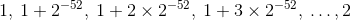
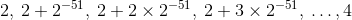
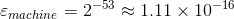
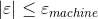
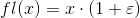
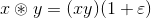

# 一、我们为什么在这里

你可以在[此博客文章](http://www.fast.ai/2017/07/17/num-lin-alg/)中阅读数值线性代数课程的概述。 该课程最初在[旧金山大学数据科学](https://www.usfca.edu/arts-sciences/graduate-programs/analytics)的研究生项目中讲授。[YouTube](https://www.youtube.com/playlist?list=PLtmWHNX-gukIc92m1K0P6bIOnZb-mg0hY) 上提供了课程视频（请注意，笔记本的编码和视频编号不对应，因为有些笔记本需要超过 1 个视频才能覆盖）。

你可以在我们的 [fast.ai 论坛](http://forums.fast.ai/c/lin-alg)上提出有关该课程的问题。

注意：未来的课程代码比这个更多。

## 为什么学习数值线性代数？

本课程的关键问题：我们如何以可接受的速度和可接受的准确度进行矩阵计算？

20 世纪的[十大科学与工程算法](http://www.cs.fsu.edu/~lacher/courses/COT4401/notes/cise_v2_i1/index.html)列表包括线性代数的矩阵分解方法。 它还包括 QR 算法，我们将介绍，以及 Krylov 迭代方法，我们将看到它的一个例子（[见这里](https://nickhigham.wordpress.com/2016/03/29/the-top-10-algorithms-in-applied-mathematics/)）。 


> 来源：[十大算法](http://www.cs.fsu.edu/~lacher/courses/COT4401/notes/cise_v2_i1/guest.pdf)

在选择或设计矩阵计算算法时，要记住以下四点：

+   内存使用
+   速度
+   准确度
+   可扩展性/并行

通常会在这些类别之间进行权衡。

### 动机

矩阵无处不在 - 任何可以放在 Excel 电子表格中的东西都是矩阵，语言和图片也可以表示为矩阵。了解矩阵算法的选项以及如何做出权衡，可能为你的解决方案带来巨大差异。例如，近似矩阵计算通常比精确矩阵计算快数千倍。

这不仅仅是了解现有库的内容，而是了解它们的工作原理。这是因为你通常可以制作算法的变体，库不支持它们，从而为你提供所需的性能或准确度。此外，此领域目前正在快速发展，特别是在与深度学习，推荐系统，近似算法和图形分析相关的领域，因此你经常会发现最近的结果可能会对你的项目产生重大影响，但是不在你的库中。

了解算法的真正工作原理。有助于调试和加速解决方案。

## 矩阵计算

矩阵计算有两种关键类型，它们以多种不同的方式组合在一起。 这些是：

+   矩阵和张量积
+   矩阵分解

所以基本上我们将组合矩阵，并将它们再次分开！

### 矩阵和张量积

### 矩阵和向量的积：

下面的矩阵给出了 1 年内从 1 个健康状态转移到另一个健康状态的概率。 如果一组的当前健康状况是：

+   85% 无症状
+   10% 有症状
+   5% 的艾滋病
+   0% 死亡

1 年内每个健康状况的百分比是多少？


> 来源：[马尔科夫链的概念](https://www.youtube.com/watch?v=0Il-y_WLTo4)

### 答案

```py
import numpy as np

# Exercise: Use Numpy to compute the answer to the above

# array([[ 0.765 ,  0.1525,  0.0645,  0.018 ]])
```

### 矩阵和矩阵的积


> 来源：[几种线性代数工具的简单的现实世界的应用](https://www.mff.cuni.cz/veda/konference/wds/proc/pdf06/WDS06_106_m8_Ulrychova.pdf)

### 答案

```py
# Exercise: Use Numpy to compute the answer to the above

'''
array([[ 50. ,  49. ],
       [ 58.5,  61. ],
       [ 43.5,  43.5]])
'''
```

### 图像数据

图像可以表示为矩阵。


> 来源：[Adam Geitgey](https://medium.com/@ageitgey/machine-learning-is-fun-part-3-deep-learning-and-convolutional-neural-networks-f40359318721)

### 卷积

卷积是卷积神经网络（CNN）的核心，它是一种深度学习，产生了过去几年图像识别的巨大进步。 它们现在也越来越多地用于语音，例如 Facebook AI 的语音翻译结果比 RNN 快 9 倍（目前最流行的语音翻译方法）。

现在，在图像分类方面，计算机比人更准确。


> 来源：[Andrej Karpathy](http://karpathy.github.io/2014/07/03/feature-learning-escapades/)


> 来源：[Nvidia](https://blogs.nvidia.com/blog/2014/09/07/imagenet/)

你可以将卷积视为一种特殊的矩阵积。

以下3张图片均来自优秀博客文章“[不同观点下的 CNN](https://medium.com/impactai/cnns-from-different-viewpoints-fab7f52d159c)”，由 fast.ai 学生撰写：

卷积将过滤器应用于图像的每个部分：


神经网络观点：


矩阵乘法观点：


让我们在[这个](https://nbviewer.jupyter.org/github/fastai/numerical-linear-algebra-v2/blob/master/nbs/convolution-intro.ipynb)笔记本中看看，如何使用卷积进行边缘检测（最初来自 [fast.ai 深度学习课程](http://course.fast.ai/)）。

### 矩阵分解

我们将在本课程的每一天讨论矩阵分解，并将在以后的课程中介绍以下示例：

主题建模（NMF 和 SVD，SVD 使用 QR）一组文档可以由术语 - 文档矩阵表示。


> 来源：[信息检索导论](http://player.slideplayer.com/15/4528582/#)


> 来源：[NMF 教程](http://perso.telecom-paristech.fr/~essid/teach/NMF_tutorial_ICME-2014.pdf)

背景移除（截断 SVD）：


噪声移除（鲁棒 PCA，使用 SVD）：


> 这个示例来自 [Jean Kossaifi 的博客](http://jeankossaifi.com/blog/rpca.html)。

谷歌的 PageRank 算法（特征值分解）：


> 来源：[什么是 PageRank？](http://computationalculture.net/article/what_is_in_pagerank)

[其它分解和应用的列表](https://sites.google.com/site/igorcarron2/matrixfactorizations)。

## 准确度

### 浮点数算术

为了理解准确性，我们首先需要了解计算机（有限和离散）如何存储数字（无限且连续）

### 练习

花点时间看看下面的函数`f`。 在尝试运行它之前，在纸上写下`x1 = f(110)`的输出。 现在，（仍在纸上）将其代入`f`并计算`x2 = f(x1)`。 继续进行 10 次迭代。

这个例子来自 Greenbaum 和 Chartier 的 Numerical Methods 的第 107 页。

```py
def f(x):
    if x <= 1/2:
        return 2 * x
    if x > 1/2:
        return 2*x - 1
```

仅仅在你写下你认为答案应该是什么之后，运行下面的代码：

```py
x = 1/10
for i in range(80):
    print(x)
    x = f(x)

'''
0.1
0.2
0.4
0.8
0.6000000000000001
0.20000000000000018
0.40000000000000036
0.8000000000000007
0.6000000000000014
0.20000000000000284
0.4000000000000057
0.8000000000000114
0.6000000000000227
0.20000000000004547
0.40000000000009095
0.8000000000001819
0.6000000000003638
0.2000000000007276
0.4000000000014552
0.8000000000029104
0.6000000000058208
0.20000000001164153
0.40000000002328306
0.8000000000465661
0.6000000000931323
0.20000000018626451
0.40000000037252903
0.8000000007450581
0.6000000014901161
0.20000000298023224
0.4000000059604645
0.800000011920929
0.6000000238418579
0.20000004768371582
0.40000009536743164
0.8000001907348633
0.6000003814697266
0.20000076293945312
0.40000152587890625
0.8000030517578125
0.600006103515625
0.20001220703125
0.4000244140625
0.800048828125
0.60009765625
0.2001953125
0.400390625
0.80078125
0.6015625
0.203125
0.40625
0.8125
0.625
0.25
0.5
1.0
1.0
1.0
1.0
1.0
1.0
1.0
1.0
1.0
1.0
1.0
1.0
1.0
1.0
1.0
1.0
1.0
1.0
1.0
1.0
1.0
1.0
1.0
1.0
1.0
'''
```

哪里不对？

### 问题：数学是连续的或无限的，但计算机是离散的和有限的

计算机的数字表示的两个局限：

+   它们不能是随意大小
+   它们之间肯定存在差距

我们需要关心准确性的原因是，计算机无法存储无限准确的数字。 可以创建给出非常错误答案的计算（特别是在多次重复操作时，因为每个操作可能会使错误成倍增加）。

计算机如何存储数字：


尾数也可以称为有效数。

IEEE双精度算术：

数字可以大到`1.79×10308`，小到`2.23×10-308`。

区间`[1,2]`由离散子集表示：



区间`[2,4]`表示为：



浮点并不是等间距的。


> 来源：[你从未想过要了解浮点数，但将被迫了解](http://www.volkerschatz.com/science/float.html)

### 机器`ε`

1 和下一个较大数字之间的距离的一半。 这可能因计算机而异。IEEE双精度标准规定：



### 浮点运算的两个重要属性

实数`x`与其最接近的浮点近似值`fl(x)`之间的差值，总是小于机器`ε`，相对而言。对于某些`ε`，其中 ：



`*`为任何操作（`+`，`-`，`×`，`÷`），`⊛`是它的浮点模拟，对于一些`ε`，其中 ：



也就是说，浮点运算的每个操作都精确到最大为机器`ε`的相对误差。

### 历史

事后看来，浮点运算似乎是一个明确的选择，但存在许多存储数字的方法：

+   定点算术
+   对数和半对数数系统
+   连续分数
+   有理数
+   有理数的可能无限字符串
+   级别索引数字系统
+   固定斜杠和浮动斜杠数字系统
+   2-adic 数字

对于参考，请参阅“[浮点运算手册](http://www.springer.com/gp/book/9780817647049)”的[第 1 章](https://perso.ens-lyon.fr/jean-michel.muller/chapitre1.pdf)（免费）。 是的，有一本关于浮点的完整的 16 章书！

### 浮点运算的时间线历史

+   公元前 1600：巴比伦基数 60 的系统是最早的浮点系统（Donald Knuth）。 使用基数 60 的浮点表示来表示尾数（如果两个数字的比率是 60 的幂，则表示相同）
+   1630：滑动规则。仅操纵有效数字（基数 10）
+   1914：Leonardo Torres 和 Quevedo 使用浮点运算描述了 Babbage 的分析引擎的的机电实现。
+   1941：第一个真正的现代实现。 Konrad Zuse 的Z3电脑。 使用基数 2，具有 14 位有效数字，7 位指数和 1 个符号位。
+   1985：IEEE 754-1985 二进制浮点运算标准发布。 提高了准确性，可靠性和便携性。 William Kahan 主导。

“已经引入了许多不同的方法来在计算机上近似实数。然而，浮点运算是迄今为止在现代计算机中最常用的表示实数的方法。使用有限集合（“机器数字”）模拟无限连续集（实数） 并不是一项简单的任务：必须在速度，准确性，动态范围，易用性和实现以及内存之间找到明智的妥协。如果选择得当的参数（基数，精度，极值指数等），浮点运算似乎对于大多数数值应用来说是一个非常好的折衷方案。”

尽管基数 2（二进制）似乎是计算机中非常明显的赢家，但在各个方面使用了各种其他基数值：

+   早期机器 PDP-10，Burroughs 570 和 6700 使用 基数 8
+   基数 16 的 IBM 360
+   基数 10 的财务计算，袖珍计算器，Maple
+   基数 3 的俄罗斯 SETUN 计算机（1958 年）。 优点：最小化`beta x p`（符号乘位数），对于固定的最大可表示数字`beta^p - 1`。舍入等于截断
+   基数 2 最常见。 理由：易于实现。 研究表明（带有隐式前导位），这比其他所有基数都具有更好的最坏情况或平均精度。

### 条件作用和稳定性

由于我们无法在计算机上准确表示数字（由于存储的有限性以及浮点结构中数字之间的间隔），因此了解输入中的小扰动如何影响输出变得非常重要。

“稳定的算法几乎可以为几乎正确的问题提供正确的答案。”--Trefethen

条件作用：数学问题的扰动行为（例如最小二乘）

稳定性：用于在计算机上解决该问题的算法的扰动行为（例如，最小二乘算法，householder，回代，高斯消除）

示例：矩阵的特征值：

```py
import scipy.linalg as la 

A = np.array([[1., 1000], [0, 1]])
B = np.array([[1, 1000], [0.001, 1]])

print(A)

print(B)

'''
[[    1.  1000.]
 [    0.     1.]]
[[  1.00000000e+00   1.00000000e+03]
 [  1.00000000e-03   1.00000000e+00]]
'''

np.set_printoptions(suppress=True, precision=4)

wA, vrA = la.eig(A)
wB, vrB = la.eig(B)

wA, wB
'''
(array([ 1.+0.j,  1.+0.j]), array([ 2.+0.j,  0.+0.j]))
'''
```

提醒：浮点运算的两个属性

实数`x`与其最接近的浮点近似值`fl(x)`之间的差值总是小于机器`ε`，相对而言。

浮点运算的每个运算`+`，`-`，`×`，`÷`都精确到最大为机器`ε`的相对误差。

我们将看到的例子：

+   经典与修正的 Gram-Schmidt 精度
+   Gram-Schmidt 与 Householder（计算 QR 分解的两种不同方式），答案的正交性如何
+   方程组的条件

### 近似的准确度

我们很少需要大规模地进行高精度的矩阵计算。 事实上，我们经常进行某种机器学习，而不太准确的方法可以防止过度拟合。

在许多情况下，输入数据可能不那么精确，因此使用输入数据和计算来寻求更高的准确度是没有意义的。

+   随机数据结构
+   布隆过滤器
+   HyperLogLog
+   局部敏感哈希
+   跳过列表
+   Count-min 草图
+   最小哈希

示例：布隆过滤器能够使用每个元素的`<10`位，搜索集合的成员性，具有 1% 的假阳性。 这通常表示数千次的内存使用减少。


通过对所有退回的项目进行第二阶段（确切）检查，可以轻松处理假阳性 - 对于稀有项目，这可能非常有效。 例如，许多网络浏览器使用布隆过滤器来创建一组被阻止的页面（例如，带有病毒的页面），因为被阻止的网页只是整个网络的一小部分。 可以通过获取布隆过滤器返回的任何内容并使用完整的精确列表检查 Web 服务来处理假阳性。 （详细信息请参阅[布隆过滤器教程](https://llimllib.github.io/bloomfilter-tutorial/)）。

### 随机算法

+   Karger 算法（图的最小切割）
+   随机回归
+   蒙特卡罗模拟
+   随机 LU 分解（高斯消元）
+   随机 SVD

如果我们接受一些精度降低，那么我们通常可以通过使用近似算法将速度提高几个数量级（和/或减少内存使用）。 这些算法通常以一定的概率给出正确的答案。 通过多次重新运行算法，你通常可以加倍增加该概率！

### 昂贵的错误

以下示例来自 Greenbaum 和 Chartier。

欧洲航天局在阿丽亚娜 5 火箭上 10 年花费了 70 亿美元。

当你尝试将 64 位数放入 16 位空间（整数溢出）时会发生什么：

```py
from IPython.display import YouTubeVideo
YouTubeVideo("PK_yguLapgA")
```

<https://www.youtube.com/embed/PK_yguLapgA>

这是一个浮点错误，耗资 4.75 亿英镑：

> [1994 纽约时报关于英特尔奔腾错误的文章](http://www.nytimes.com/1994/11/24/business/company-news-flaw-undermines-accuracy-of-pentium-chips.html)


资源：浮点运算的更多信息，请参阅 Trefethen & Bau 的第 13 讲和 Greenbaum & Chartier 的第 5 章。

## 内存使用

### 稀疏 VS 密集

上面我们介绍了如何存储数字，现在让我们来谈谈如何存储矩阵。 节省内存（和计算）的关键方法不是存储所有矩阵。 相反，只需存储非零元素。 这称为稀疏存储，它非常适合稀疏矩阵，即大多数元素为零的矩阵。


以下是有限元问题的矩阵示例，该问题出现在工程中（例如，在对平面周围的气流进行建模时）。 在此示例中，非零元素为黑色，零元素为白色：


> [来源](https://commons.wikimedia.org/w/index.php?curid=2245335)

还有特殊类型的结构化矩阵，例如对角线，三对角线，hessenberg 和三角，它们都表现稀疏性的特定模式，可以利用它们来减少内存和计算。

与稀疏矩阵相反的是密集矩阵，以及密集存储，其仅仅指代主要包含非零的矩阵，其中每个元素被显式存储。 由于稀疏矩阵是有用且常见的，因此数值线性代数侧重于通过尽可能多的操作来保持稀疏性。

## 速度

速度差异来自许多方面，特别是：

+   计算复杂性
+   向量化
+   扩展到多个核心和节点
+   局部性

### 计算复杂性

算法通常使用关于矩阵中的行数和列数的计算复杂度来表示。 例如。 你可能会发现一个描述为`O(n^2 m)`的算法。

计算复杂性和`O`符号经常出现在技术评论中，所以实践它们是个好主意。 你可以在这些网站中了解概念和实践：

*   [Interview Cake](https://www.interviewcake.com/article/java/big-o-notation-time-and-space-complexity)
*   [Codecademy](https://www.codecademy.com/courses/big-o/0/3)
*   [HackerRank](https://www.hackerrank.com/contests/30-days-of-code/challenges/day-25-running-time)

### 向量化

现代 CPU 和 GPU 可以在单个核心上同时对多个元素应用操作。 例如，在一个步骤中选取向量中的 4 个浮点数的指数。 这称为 SIMD。 你不会显式编写 SIMD 代码（它往往需要汇编语言或特殊的 C “内在函数”），而是在像 numpy 这样的库中使用向量化操作，而后者又依赖于专门调整的向量化底层线性代数 API（特别是 BLAS 和 LAPACK）。

### 矩阵计算包：BLAS 和 LAPACK

[BLAS（基本线性代数子程序）](http://www.netlib.org/blas/)：底层矩阵和向量算术运算的规范。这些是用于执行基本向量和矩阵运算的标准积木。 BLAS 起源于 1979 年的 Fortran 库。BLAS 库的示例包括：AMD 核心数学库（ACML），ATLAS，英特尔数学核心库（MKL）和 OpenBLAS。

[LAPACK](http://www.netlib.org/lapack/) 是用 Fortran 编写的，提供了解决线性方程组，特征值问题和奇异值问题的例程。矩阵因式分解（LU，Cholesky，QR，SVD，Schur）。处理密集和带状矩阵，但不处理一般稀疏矩阵。实数和复数，单精度和双精度。

20 世纪 70 年代和 80 年代：EISPACK（特征值例程）和 LINPACK（线性方程和线性最小二乘例程）库。

LAPACK 最初的目标：使 LINAPCK 和 EISPACK 在共享内存的向量和并行处理器上高效运行，并在现代基于缓存的体系结构上利用缓存（最初于 1992 年发布）。 EISPACK 和 LINPACK 忽略了多层内存架构，并且花费了太多时间来移动数据。

LAPACK 使用高度优化的块操作实现（在每台机器上大量实现），以便尽可能多的计算由 BLAS 执行。

### 局部性

使用较慢的方式来访问数据（例如，通过互联网）可以比快速方式（例如来自寄存器）慢十亿倍。 但慢速存储器远多于快速存储器。 因此，一旦我们在快速存储中拥有数据，我们就希望在那里进行所需的任何计算，而不是每次需要时都需要多次加载。 此外，对于大多数类型的存储，访问彼此相邻的数据项要快得多，因此我们应该尽量使用附近存储的任何数据，我们知道我们很快就需要它。 这两个问题被称为局部性。

### 不同类型内存的速度

以下是每个人都应该知道的一些数字（来自传奇人物 [Jeff Dean](http://static.googleusercontent.com/media/research.google.com/en/us/people/jeff/stanford-295-talk.pdf)）：

+   L1 高速缓存引用：0.5 ns
+   L2 缓存引用：7 ns
+   主存储器引用 / RAM：100 ns
+   通过 1 Gbps 网络发送 2K 字节：20,000 ns
+   从内存顺序读取 1 MB：250,000 ns
+   在同一数据中心内往返：500,000 ns
+   磁盘搜索：10,000,000 ns
+   从网络顺序读取 1 MB：10,000,000 ns 
+   从磁盘顺序读取 1 MB：30,000,000 ns 
+   发送数据包 CA-> Netherlands-> CA：150,000,000 ns

这是一个更新的交互式[版本](https://people.eecs.berkeley.edu/~rcs/research/interactive_latency.html)，其中包含这些数字如何变化的时间表。

关键结论：每个连续的存储器类型（至少）比之前的存储器类型差一个数量级。磁盘搜索非常慢。

这个视频有一个很好的例子，展示了几种计算照片模糊的方法，并进行了各种权衡。不要担心出现的 C 代码，只关注矩阵计算的红色和绿色运动图像。

虽然视频是关于一种名为 Halide 的新语言，但它很好地说明了它所引发的问题是普遍存在的。观看 1-13 分钟：

```py
from IPython.display import YouTubeVideo
YouTubeVideo("3uiEyEKji0M")
```

<https://www.youtube.com/embed/3uiEyEKji0M>

局部性很难。 潜在的权衡：

+   用于节省内存带宽的冗余计算
+   牺牲并行性来获得更好的复用

### 临时性

当计算结果存储在 RAM 中的临时变量中，然后加载该变量来对其进行另一次计算时，就会出现“临时性”问题。 这比将数据保存在缓存或寄存器中，并在将最终结果存储到 RAM 之前，进行所有必要的计算要慢很多个数量级。 这对我们来说尤其是一个问题，因为 numpy 通常为每一个操作或功能创造临时性。 例如。`a = b * c^2 + ln(d)`将创建四个临时值（因为有四个操作和函数）。

### 扩展到多个核心和节点

我们有一个单独的可扩展性章节，但值得注意的是，这对速度也很重要 - 如果我们无法扩展我们拥有的所有计算资源，我们将会遇到计算速度较慢的问题。

## 可扩展性/并行化

通常我们会发现我们拥有的数据比用于处理内存或计算时间要多。 在这种情况下，我们希望能够在多个核（在一个计算机内）或节点（即网络上的多个计算机）上扩展我们的算法。 虽然我们将研究跨[多个核](http://www.makeuseof.com/tag/processor-core-makeuseof-explains-2/)的扩展（称为并行化），但我们不会在本课程中处理多节点扩展。 通常，可扩展算法是指，输入可以分解成较小的部分，每个部分由不同的核心/计算机处理，然后在最后重新组合在一起。
