# 十、实现 QR 分解

我们在计算特征值时使用 QR 分解并计算最小二乘回归。 它是数值线性代数中的重要组成部分。

“数值线性代数中的一种算法比其他算法更重要：QR 分解。” --Trefethen，第 48 页

回想一下，对于任何矩阵`A`，`A = QR`，其中`Q`是正交的，`R`是上三角。

提醒：我们在上一课中看到的 QR 算法使用 QR 分解，但不要混淆二者。

### NumPy 中

```py
import numpy as np

np.set_printoptions(suppress=True, precision=4)

n = 5
A = np.random.rand(n,n)
npQ, npR = np.linalg.qr(A)
```

检查`Q`是正交的：

```py
np.allclose(np.eye(n), npQ @ npQ.T), np.allclose(np.eye(n), npQ.T @ npQ)

# (True, True)
```

检查`R`是三角。

```py
npR

'''
array([[-0.8524, -0.7872, -1.1163, -1.2248, -0.7587],
       [ 0.    , -0.9363, -0.2958, -0.7666, -0.632 ],
       [ 0.    ,  0.    ,  0.4645, -0.1744, -0.3542],
       [ 0.    ,  0.    ,  0.    ,  0.4328, -0.2567],
       [ 0.    ,  0.    ,  0.    ,  0.    ,  0.1111]])
'''
```

当向量`b`投影到直线`a`上时，其投影`p`是`b`沿着直线`a`的一部分。

让我们看看 [沉浸式线性代数在线版](http://immersivemath.com/ila/index.html)的[第 3.2.2 节：投影](http://immersivemath.com/ila/ch03_dotproduct/ch03.html)的交互图。


> 来源：[沉浸式数学](http://immersivemath.com/ila/ch03_dotproduct/ch03.html)

以下是将向量投影到平面上的样子：


> 来源：[最小二乘回归的线性代数视角](https://medium.com/@andrew.chamberlain/the-linear-algebra-view-of-least-squares-regression-f67044b7f39b)

当向量`b`投影到直线`a`上时，其投影`p`是`b`沿着直线`a`的一部分。 所以`p`是`a`的一些倍数。 设 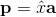 其中  是标量。

### 正交性

投影的关键是正交性：从`b`到`p`的直线（可以写成 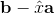）垂直于`a`。

这意味着：

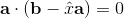

所以：

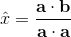

## Gram-Schmidt

### 经典的 Gram-Schmidt（不稳定）

对于每列`j`，计算单一投影：

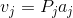

其中 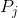 与 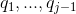 的跨度正交的空间。

```py
def cgs(A):
    m, n = A.shape
    Q = np.zeros([m,n], dtype=np.float64)
    R = np.zeros([n,n], dtype=np.float64)
    for j in range(n):
        v = A[:,j]
        for i in range(j):
            R[i,j] = np.dot(Q[:,i], A[:,j])
            v = v - (R[i,j] * Q[:,i])
        R[j,j] = np.linalg.norm(v)
        Q[:, j] = v / R[j,j]
    return Q, R

Q, R = cgs(A)

np.allclose(A, Q @ R)

# True
```

检查`Q`是酉矩阵。

```py
np.allclose(np.eye(len(Q)), Q.dot(Q.T))

# True

np.allclose(npQ, -Q)

# True

R

'''
array([[ 0.02771,  0.02006, -0.0164 , ...,  0.00351,  0.00198,  0.00639],
       [ 0.     ,  0.10006, -0.00501, ...,  0.07689, -0.0379 , -0.03095],
       [ 0.     ,  0.     ,  0.01229, ...,  0.01635,  0.02988,  0.01442],
       ..., 
       [ 0.     ,  0.     ,  0.     , ...,  0.     , -0.     , -0.     ],
       [ 0.     ,  0.     ,  0.     , ...,  0.     ,  0.     , -0.     ],
       [ 0.     ,  0.     ,  0.     , ...,  0.     ,  0.     ,  0.     ]])
'''
```

Gram-Schmidt 应该让你想起来一点 Arnoldi 迭代（用于将矩阵转换为海森堡形式），因为它也是一个结构化的正交化。

### 改进版 Gram-Schmidt

经典（不稳定的）Gram-Schmidt：对于每列`j`，计算单一投影：


其中  与  的跨度正交的空间。

改进版 Gram-Schmidt：对于每列`j`，计算`n - 1`个投影：

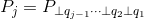

```py
import numpy as np
n = 3
A = np.random.rand(n,n).astype(np.float64)

def cgs(A):
    m, n = A.shape
    Q = np.zeros([m,n], dtype=np.float64)
    R = np.zeros([n,n], dtype=np.float64)
    for j in range(n):
        v = A[:,j]
        for i in range(j):
            R[i,j] = np.dot(Q[:,i], A[:,j])
            v = v - (R[i,j] * Q[:,i])
        R[j,j] = np.linalg.norm(v)
        Q[:, j] = v / R[j,j]
    return Q, R

def mgs(A):
    V = A.copy()
    m, n = A.shape
    Q = np.zeros([m,n], dtype=np.float64)
    R = np.zeros([n,n], dtype=np.float64)
    for i in range(n):
        R[i,i] = np.linalg.norm(V[:,i])
        Q[:,i] = V[:,i] / R[i,i]
        for j in range(i, n):
            R[i,j] = np.dot(Q[:,i],V[:,j])
            V[:,j] = V[:,j] - R[i,j]*Q[:,i]
    return Q, R

Q, R = mgs(A)

np.allclose(np.eye(len(Q)), Q.dot(Q.T.conj()))

# True

np.allclose(A, np.matmul(Q,R))

# True
```

## Householder

### 引言

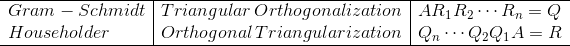

Householder 反射产生更接近正交的矩阵`Q`，具有舍入误差

Gram-Schmidt 可以部分停止，留下`A`的前`n`列的简化 QR。

### 初始化

```py
import numpy as np
n = 4
A = np.random.rand(n,n).astype(np.float64)

Q = np.zeros([n,n], dtype=np.float64)
R = np.zeros([n,n], dtype=np.float64)

A

'''
array([[ 0.5435,  0.6379,  0.4011,  0.5773],
       [ 0.0054,  0.8049,  0.6804,  0.0821],
       [ 0.2832,  0.2416,  0.8656,  0.8099],
       [ 0.1139,  0.9621,  0.7623,  0.5648]])
'''

from scipy.linalg import block_diag

np.set_printoptions(5)
```

### 算法

我添加了更多的计算和更多的信息，因为它说明了算法的工作原理。 此版本也返回 Householder 反射。

```py
def householder_lots(A):
    m, n = A.shape
    R = np.copy(A)
    V = []
    Fs = []
    for k in range(n):
        v = np.copy(R[k:,k])
        v = np.reshape(v, (n-k, 1))
        v[0] += np.sign(v[0]) * np.linalg.norm(v)
        v /= np.linalg.norm(v)
        R[k:,k:] = R[k:,k:] - 2*np.matmul(v, np.matmul(v.T, R[k:,k:]))
        V.append(v)
        F = np.eye(n-k) - 2 * np.matmul(v, v.T)/np.matmul(v.T, v)
        Fs.append(F)
    return R, V, Fs
```

检查`R`是上三角。

```py
R

'''
array([[-0.62337, -0.84873, -0.88817, -0.97516],
       [ 0.     , -1.14818, -0.86417, -0.30109],
       [ 0.     ,  0.     , -0.64691, -0.45234],
       [-0.     ,  0.     ,  0.     , -0.26191]])
'''
```

作为检查，我们将使用分块矩阵`F`计算 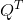 和`R`。矩阵`F`是 householder 反射。

请注意，这不是一种处理`Q`的有效计算方式。在大多数情况下，你实际上并不需要`Q`。例如，如果你使用 QR 来求解最小二乘，则只需要`Q * b`。

+   对于隐式计算乘积`Q * b`或`Qx`的技巧，请参阅 Trefethen 第 74 页。
+   请参阅[这些讲义](http://www.cs.cornell.edu/~bindel/class/cs6210-f09/lec18.pdf)，了解 Householder 的不同实现，它同时计算`Q`，作为`R`的一部分。

```py
QT = np.matmul(block_diag(np.eye(3), F[3]), 
               np.matmul(block_diag(np.eye(2), F[2]), 
                         np.matmul(block_diag(np.eye(1), F[1]), F[0])))

F[1]

'''
array([[-0.69502,  0.10379, -0.71146],
       [ 0.10379,  0.99364,  0.04356],
       [-0.71146,  0.04356,  0.70138]])
'''

block_diag(np.eye(1), F[1])

'''
array([[ 1.     ,  0.     ,  0.     ,  0.     ],
       [ 0.     , -0.69502,  0.10379, -0.71146],
       [ 0.     ,  0.10379,  0.99364,  0.04356],
       [ 0.     , -0.71146,  0.04356,  0.70138]])
'''

block_diag(np.eye(2), F[2])

'''
array([[ 1.     ,  0.     ,  0.     ,  0.     ],
       [ 0.     ,  1.     ,  0.     ,  0.     ],
       [ 0.     ,  0.     , -0.99989,  0.01452],
       [ 0.     ,  0.     ,  0.01452,  0.99989]])
'''

block_diag(np.eye(3), F[3])

'''
array([[ 1.,  0.,  0.,  0.],
       [ 0.,  1.,  0.,  0.],
       [ 0.,  0.,  1.,  0.],
       [ 0.,  0.,  0., -1.]])
'''

np.matmul(block_diag(np.eye(1), F[1]), F[0])

'''
array([[-0.87185, -0.00861, -0.45431, -0.18279],
       [ 0.08888, -0.69462,  0.12536, -0.70278],
       [-0.46028,  0.10167,  0.88193, -0.00138],
       [-0.14187, -0.71211,  0.00913,  0.68753]])
'''

QT

'''
array([[-0.87185, -0.00861, -0.45431, -0.18279],
       [ 0.08888, -0.69462,  0.12536, -0.70278],
       [ 0.45817, -0.112  , -0.88171,  0.01136],
       [ 0.14854,  0.71056, -0.02193, -0.68743]])
'''

R2 = np.matmul(block_diag(np.eye(3), F[3]), 
               np.matmul(block_diag(np.eye(2), F[2]),
                         np.matmul(block_diag(np.eye(1), F[1]), 
                                   np.matmul(F[0], A))))

np.allclose(A, np.matmul(np.transpose(QT), R2))

# True

np.allclose(R, R2)

# True
```

这是 Householder 的简洁版本（尽管我创建了一个新的`R`，而不是覆盖`A`，并原地计算它）。

```py
def householder(A):
    m, n = A.shape
    R = np.copy(A)
    Q = np.eye(m)
    V = []
    for k in range(n):
        v = np.copy(R[k:,k])
        v = np.reshape(v, (n-k, 1))
        v[0] += np.sign(v[0]) * np.linalg.norm(v)
        v /= np.linalg.norm(v)
        R[k:,k:] = R[k:,k:] - 2 * v @ v.T @ R[k:,k:]
        V.append(v)
    return R, V

RH, VH = householder(A)
```

检查`R`是对角的。

```py
RH

'''
array([[-0.62337, -0.84873, -0.88817, -0.97516],
       [-0.     , -1.14818, -0.86417, -0.30109],
       [-0.     , -0.     , -0.64691, -0.45234],
       [-0.     ,  0.     ,  0.     , -0.26191]])
'''

VH

'''
[array([[ 0.96743],
        [ 0.00445],
        [ 0.2348 ],
        [ 0.09447]]), array([[ 0.9206 ],
        [-0.05637],
        [ 0.38641]]), array([[ 0.99997],
        [-0.00726]]), array([[ 1.]])]
'''

np.allclose(R, RH)

# True

def implicit_Qx(V,x):
    n = len(x)
    for k in range(n-1,-1,-1):
        x[k:n] -= 2*np.matmul(v[-k], np.matmul(v[-k], x[k:n]))

A

'''
array([[ 0.54348,  0.63791,  0.40114,  0.57728],
       [ 0.00537,  0.80485,  0.68037,  0.0821 ],
       [ 0.2832 ,  0.24164,  0.86556,  0.80986],
       [ 0.11395,  0.96205,  0.76232,  0.56475]])
'''
```

经典和改良的 Gram-Schmidt 都需要`2mn^2`个浮点运算。

### 陷阱

有些事情需要注意：

+   当你复制值时 VS 当你有两个指向同一内存位置的变量时
+   长度为`n`的向量与`1 x n`矩阵之间的差异（`np.matmul`以不同方式处理它们）

## 类比


| | `A=QR` | `A=QHQ*` |
| --- | --- | --- |
| 正交结构化 | Householder | Householder |
| 结构化正交 | Gram-Schmidt | Arnoldi |

Gram-Schmidt 和 Arnoldi：连续的三角运算，可以部分停止，前`n`列是正确的。

Householder：连续的正交运算。 在存在舍入误差的情况下产生更接近正交的`A`。

请注意，要计算海森堡化简`A = QHQ *`，将 Householder 反射应用于`A`的两侧，而不是仅应用于一侧。

## 示例

以下示例来自 Trefethen 和 Bau 的第 9 讲，尽管从 MATLAB 翻译成 Python。

### 示例：经典与改进的 Gram-Schmidt

这个例子是 Trefethen 第 9 节的实验 2。 我们想要构造一个方阵`A`，它具有随机奇异向量和广泛变化的奇异值，间隔为 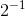 和 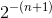 之间的 2 的倍数。

```py
import matplotlib.pyplot as plt
from matplotlib import rcParams
%matplotlib inline

n = 100
U, X = np.linalg.qr(np.random.randn(n,n))   # 将 U 设为随机正交矩阵
V, X = np.linalg.qr(np.random.randn(n,n))   # 将 V 设为随机正交矩阵
S = np.diag(np.power(2,np.arange(-1,-(n+1),-1), dtype=float))  # 将 S 设为对角矩阵 w/ exp 
                                                              # 值在 2^-1 和 2^-(n+1) 之间

A = np.matmul(U,np.matmul(S,V))

QC, RC = cgs(A)
QM, RM = mgs(A)

plt.figure(figsize=(10,10))
plt.semilogy(np.diag(S), 'r.', basey=2, label="True Singular Values")
plt.semilogy(np.diag(RM), 'go', basey=2, label="Modified Gram-Shmidt")
plt.semilogy(np.diag(RC), 'bx', basey=2, label="Classic Gram-Shmidt")
plt.legend()
rcParams.update({'font.size': 18})
```

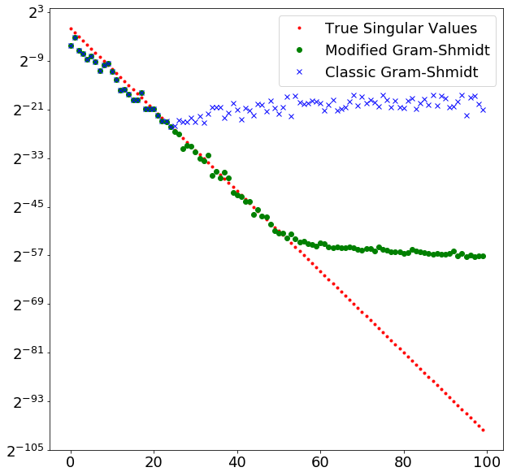

```py
type(A[0,0]), type(RC[0,0]), type(S[0,0])

# (numpy.float64, numpy.float64, numpy.float64)

eps = np.finfo(np.float64).eps; eps

# 2.2204460492503131e-16

np.log2(eps), np.log2(np.sqrt(eps))

# (-52.0, -26.0)
```

### 示例：正交性的数值损失

这个例子是 Trefethen 第 9 节的实验 3。

```py
A = np.array([[0.70000, 0.70711], [0.70001, 0.70711]])

A

'''
array([[ 0.7    ,  0.70711],
       [ 0.70001,  0.70711]])
'''
```

Gram-Schmidt：

```py
Q1, R1 = mgs(A)
```

Householder：

```py
R2, V, F = householder_lots(A)
Q2T = np.matmul(block_diag(np.eye(1), F[1]), F[0])
```

NumPy 的 Householder：

```py
Q3, R3 = np.linalg.qr(A)
```

检查 QR 分解是否能用：

```py
np.matmul(Q1, R1)

'''
array([[ 0.7   ,  0.7071],
       [ 0.7   ,  0.7071]])
'''

np.matmul(Q2T.T, R2)

'''
array([[ 0.7   ,  0.7071],
       [ 0.7   ,  0.7071]])
'''

np.matmul(Q3, R3)

'''
array([[ 0.7   ,  0.7071],
       [ 0.7   ,  0.7071]])
'''
```

检查`Q`多么接近完美正交。

```py
np.linalg.norm(np.matmul(Q1.T, Q1) - np.eye(2))  # 改进的 Gram-Schmidt

# 3.2547268868202263e-11

np.linalg.norm(np.matmul(Q2T.T, Q2T) - np.eye(2))  # 我们的 Householder 实现

# 1.1110522984689321e-16

np.linalg.norm(np.matmul(Q3.T, Q3) - np.eye(2))  # Numpy（它使用 Householder）

# 2.5020189909116529e-16
```

GS（Q1）不如 Householder（Q2T，Q3）稳定。
