# 二、SVD 背景消除

我们今天的目标：


## 加载和格式化数据

让我们使用 BMC 2012 背景建模挑战数据集中的[真实视频 003](http://bmc.iut-auvergne.com/?page_id=24)。

导入所需的库：

```py
import imageio
imageio.plugins.ffmpeg.download()

'''
Imageio: 'ffmpeg.linux64' was not found on your computer; downloading it now.
Try 1. Download from https://github.com/imageio/imageio-binaries/raw/master/ffmpeg/ffmpeg.linux64 (27.2 MB)
Downloading: 8192/28549024 bytes (0.02260992/28549024 bytes (7.9%5455872/28549024 bytes (19.18790016/28549024 bytes (30.812189696/28549024 bytes (42.7%15687680/28549024 bytes (54.9%18898944/28549024 bytes (66.2%22134784/28549024 bytes (77.5%25518080/28549024 bytes (89.4%28549024/28549024 bytes (100.0%)
  Done
File saved as /home/racheltho/.imageio/ffmpeg/ffmpeg.linux64.
'''

import moviepy.editor as mpe
import numpy as np
import scipy

%matplotlib inline
import matplotlib.pyplot as plt

np.set_printoptions(precision=4, suppress=True)

video = mpe.VideoFileClip("movie/Video_003.avi")

video.subclip(0,50).ipython_display(width=300)

'''
100%|█████████▉| 350/351 [00:00<00:00, 914.11it/s]
'''
```

<video src="img/v1.mp4"></video>

```py
video.duration

# 113.57
```

### 辅助方法

```py
def create_data_matrix_from_video(clip, fps=5, scale=50):
    return np.vstack([scipy.misc.imresize(rgb2gray(clip.get_frame(i/float(fps))).astype(int), 
                      scale).flatten() for i in range(fps * int(clip.duration))]).T

def rgb2gray(rgb):
    return np.dot(rgb[...,:3], [0.299, 0.587, 0.114])
```

### 格式化数据

一个时刻的图像是120像素乘160像素（缩放时）。 我们可以将该图片展开为一个很高的列。 因此，我们不是拥有`120×160`的 2D 图像，而是拥有`1×19,200`的一列。

这不是人类可读的，但它很方便，因为它可以让我们将来自不同时间的图像叠加在一起，将视频全部放入 1 个矩阵中。 如果我们拍摄视频 100 秒，每隔百分之一秒一张图像（所以有 10,000 个不同的图像，每个图像来自不同的时间点），我们将拥有`10,000×19,200`的矩阵，代表视频！

```py
scale = 0.50   # Adjust scale to change resolution of image
dims = (int(240 * scale), int(320 * scale))
fps = 60      # frames per second

M = create_data_matrix_from_video(video.subclip(0,100), fps, scale)
# M = np.load("movie/med_res_surveillance_matrix_60fps.npy")

print(dims, M.shape)

# (120, 160) (19200, 6000)

plt.imshow(np.reshape(M[:,140], dims), cmap='gray');
```


由于`create_data_from_matrix`有点慢，我们将保存矩阵。 通常，只要你的预处理步骤较慢，最好保存结果以备将来使用。

```py
np.save("movie/med_res_surveillance_matrix_60fps.npy", M)

plt.figure(figsize=(12, 12))
plt.imshow(M[::3,:], cmap='gray')

# <matplotlib.image.AxesImage at 0x7f92be09d710>
```

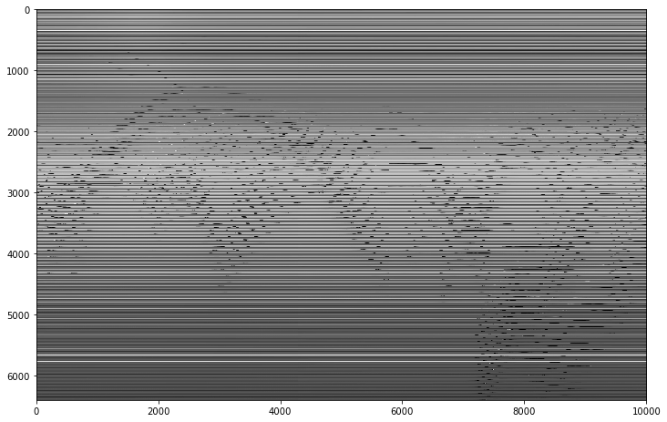

问题：那些黑波浪线是什么？ 水平线是什么？

## 奇异值分解

### SVD介绍

“将矩阵分解为我们关心的更简单，更有意义的片段的便捷方式” - 大卫奥斯汀

“我忘了学习的最重要的线性代数概念” - Daniel Lemire

SVD的应用：

+   主成分分析
+   数据压缩
+   伪逆
+   协同过滤
+   主题建模
+   背景消除
+   删除损坏的数据

```py
U, s, V = np.linalg.svd(M, full_matrices=False)
```

这非常慢，因此你可能希望保存结果以便将来使用。

```py
np.save("movie/U.npy", U)
np.save("movie/s.npy", s)
np.save("move/V.npy", V)
```

将来，你只需加载已保存的内容：

```py
U = np.load("movie/U.npy")
s = np.load("movie/s.npy")
V = np.load("movie/V.npy")
```

`U, s, V`是什么样子？

```py
U.shape, s.shape, V.shape

# ((19200, 6000), (6000,), (6000, 6000))
```

### 练习

检查它们是否是`M`的分解。

```py
# Exercise: 

# True
```

他们正是。

```py
np.allclose(M, reconstructed_matrix)

# True

np.set_printoptions(suppress=True, precision=0)
```

### `s`的属性

```py
np.diag(s[:6])
```

你看到`s`的顺序了吗？

```py
s[0:2000:50]

'''
array([ 1341720.,    10528.,     6162.,     4235.,     3174.,     2548.,
           2138.,     1813.,     1558.,     1346.,     1163.,     1001.,
            841.,      666.,        0.,        0.,        0.,        0.,
              0.,        0.,        0.,        0.,        0.,        0.,
              0.,        0.,        0.,        0.,        0.,        0.,
              0.,        0.,        0.,        0.,        0.,        0.,
              0.,        0.,        0.,        0.])
'''

len(s)

# 6000

s[700]

# 3.2309523518534773e-10

np.set_printoptions(suppress=True, precision=4)
```

`U`是个巨大的矩阵，所以仅仅查看一小部分：

```py
U[:5,:5]

'''
array([[-0.0083, -0.0009, -0.0007,  0.003 , -0.0002],
       [-0.0083, -0.0013, -0.0005,  0.0034, -0.0001],
       [-0.0084, -0.0012,  0.0002,  0.0045, -0.0003],
       [-0.0085, -0.0011,  0.0001,  0.0044, -0.    ],
       [-0.0086, -0.0013, -0.0002,  0.004 ,  0.0001]])
'''
```

### 寻找背景

```py
U.shape, s.shape, V.shape

# ((19200, 6000), (6000,), (6000, 6000))

low_rank = np.expand_dims(U[:,0], 1) * s[0] * np.expand_dims(V[0,:], 0)

plt.figure(figsize=(12, 12))
plt.imshow(low_rank, cmap='gray')

# <matplotlib.image.AxesImage at 0x7f1cc3e2c9e8>
```


```py
plt.imshow(np.reshape(low_rank[:,0], dims), cmap='gray');
```


如何得到里面的人？

```py
plt.imshow(np.reshape(M[:,0] - low_rank[:,0], dims), cmap='gray');
```

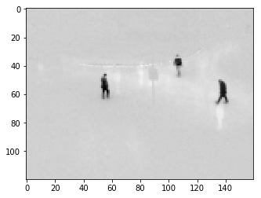

高分辨率版本。

```py
plt.imshow(np.reshape(M[:,140] - low_rank[:,140], dims), cmap='gray');
```

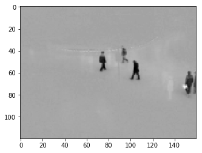

### 制作视频

我受到了 fast.ai 学生萨米尔·穆萨（Samir Moussa）的启发来制作人物视频。

```py
from moviepy.video.io.bindings import mplfig_to_npimage

def make_video(matrix, dims, filename):
    mat_reshaped = np.reshape(matrix, (dims[0], dims[1], -1))
    
    fig, ax = plt.subplots()
    def make_frame(t):
        ax.clear()
        ax.imshow(mat_reshaped[...,int(t*fps)])
        return mplfig_to_npimage(fig)
    
    animation = mpe.VideoClip(make_frame, duration=int(10))
    animation.write_videofile('videos/' + filename + '.mp4', fps=fps)

make_video(M - low_rank, dims, "figures2")

'''
[MoviePy] >>>> Building video videos/figures2.mp4
[MoviePy] Writing video videos/figures2.mp4

100%|█████████▉| 600/601 [00:39<00:00, 15.22it/s]

[MoviePy] Done.
[MoviePy] >>>> Video ready: videos/figures2.mp4 
'''
```

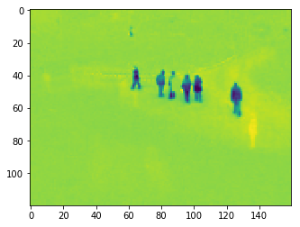

```py
mpe.VideoFileClip("videos/figures2.mp4").subclip(0,10).ipython_display(width=300)

# 100%|█████████▉| 600/601 [00:00<00:00, 858.48it/s]
```

<video src="img/v2.mp4"></video>

### SVD 分解不同尺寸矩阵的速度

```py
import timeit
import pandas as pd

m_array = np.array([100, int(1e3), int(1e4)])
n_array = np.array([100, int(1e3), int(1e4)])

index = 
pd.MultiIndex.from_product([m_array, n_array], names=['# rows', '# cols'])

pd.options.display.float_format = '{:,.3f}'.format
df = pd.DataFrame(index=m_array, columns=n_array)

# %%prun
for m in m_array:
    for n in n_array:      
        A = np.random.uniform(-40,40,[m,n])  
        t = timeit.timeit('np.linalg.svd(A, full_matrices=False)', number=3, globals=globals())
        df.set_value(m, n, t)

df/3
```

| | 100 | 1000 | 10000 |
| --- | --- | --- | --- |
| 100 | 0.006 | 0.009 | 0.043 |
| 1000 | 0.004 | 0.259 | 0.992 |
| 10000 | 0.019 | 0.984 | 218.726 |

### 一个视频中的两个背景

我们现在使用 BMC 2012 背景建模挑战数据集中的真实视频 008，以及上面使用的 003。

```py
from moviepy.editor import concatenate_videoclips

video2 = mpe.VideoFileClip("movie/Video_008.avi")

concat_video = concatenate_videoclips([video2.subclip(0,20), video.subclip(0,10)])
concat_video.write_videofile("movie/concatenated_video.mp4")

'''
[MoviePy] >>>> Building video movie/concatenated_video.mp4
[MoviePy] Writing video movie/concatenated_video.mp4

100%|█████████▉| 300/301 [00:00<00:00, 481.76it/s]

[MoviePy] Done.
[MoviePy] >>>> Video ready: movie/concatenated_video.mp4 
'''

concat_video = mpe.VideoFileClip("movie/concatenated_video.mp4")
```

### 现在回到我们的背景消除问题

```py
concat_video.ipython_display(width=300, maxduration=160)

# 100%|█████████▉| 300/301 [00:00<00:00, 533.88it/s]
```

<video src="img/v3.mp4"></video>

```py
scale = 0.5   # 调整比例来更改图像的分辨率
dims = (int(240 * scale), int(320 * scale))

N = create_data_matrix_from_video(concat_video, fps, scale)
# N = np.load("low_res_traffic_matrix.npy")
np.save("med_res_concat_video.npy", N)

N.shape

# (19200, 1800)

plt.imshow(np.reshape(N[:,200], dims), cmap='gray');
```

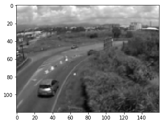

```py
U_concat, s_concat, V_concat = np.linalg.svd(N, full_matrices=False)
```

这很慢，因此你可能希望保存结果以便将来使用。

```py
np.save("movie/U_concat.npy", U_concat)
np.save("movie/s_concat.npy", s_concat)
np.save("movie/V_concat.npy", V_concat)
```

将来，你只需加载已保存的内容：

```py
U_concat = np.load("movie/U_concat.npy")
s_concat = np.load("movie/s_concat.npy")
V_concat = np.load("movie/V_concat.npy")

low_rank = U_concat[:,:10] @ np.diag(s_concat[:10]) @ V_concat[:10,:]
```

`U`的最小主成分：

```py
plt.imshow(np.reshape(U_concat[:, 1], dims), cmap='gray')

# <matplotlib.image.AxesImage at 0x7f92bcf47da0>
```

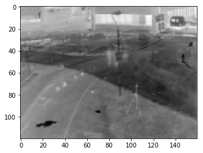

```py
plt.imshow(np.reshape(U_concat[:, 2], dims), cmap='gray')

# <matplotlib.image.AxesImage at 0x7f92bc691a90>
```

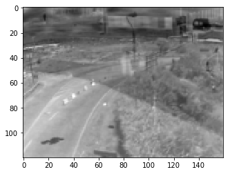

```py
plt.imshow(np.reshape(U_concat[:, 3], dims), cmap='gray')

# <matplotlib.image.AxesImage at 0x7f92bc5aa240>
```

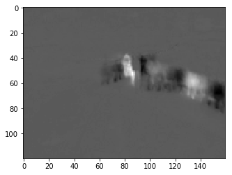


背景移除：

```py
plt.imshow(np.reshape((N - low_rank)[:, -40], dims), cmap='gray')

# <matplotlib.image.AxesImage at 0x7f92bc540908>
```

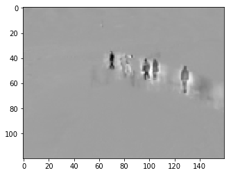

```py
plt.imshow(np.reshape((N - low_rank)[:, 240], dims), cmap='gray')

# <matplotlib.image.AxesImage at 0x7f92bc4d7f28>
```

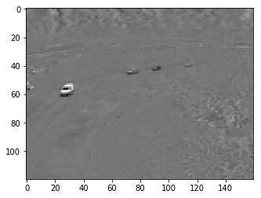

### 数据压缩旁注

假设我们采用 700 个奇异值（记住，总共有 10000 个奇异值）。

```py
s[0:1000:50]

'''
array([ 1341719.6552,    10527.5148,     6162.0638,     4234.9367,
           3174.0389,     2548.4273,     2138.1887,     1812.9873,
           1557.7163,     1345.805 ,     1163.2866,     1000.5186,
            841.4604,      665.7271,        0.    ,        0.    ,
              0.    ,        0.    ,        0.    ,        0.    ])
'''

k = 700
compressed_M = U[:,:k] @ np.diag(s[:k]) @ V[:k,:]

plt.figure(figsize=(12, 12))
plt.imshow(compressed_M, cmap='gray')

# <matplotlib.image.AxesImage at 0x7fefa0076ac8>
```


```py
plt.imshow(np.reshape(compressed_M[:,140], dims), cmap='gray');
```

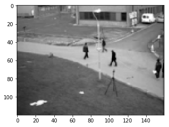

```py
np.allclose(compressed_M, M)

# True

np.linalg.norm(M - compressed_M)

# 2.864899899979104e-09

U[:,:k].shape, s[:k].shape, V[:k,:].shape

# ((19200, 700), (700,), (700, 6000))
```

节省的空间为对于 700 个奇异值的`U, s, V`中的数据比原始矩阵。

```py
((19200 + 1 + 6000) * 700) / (19200 * 6000)

# 0.1531310763888889
```

我们只需要存储 15.3% 的数据，并且可以将精度保持在`1e-5`！ 很棒！

很漂亮！！！但...
SVD 的运行时复杂度为`O(min(m^2 n, m n^2))`
缺点：这真的很慢（同样，我们摒弃了很多计算）。

```py
%time u, s, v = np.linalg.svd(M, full_matrices=False)

'''
CPU times: user 5min 38s, sys: 1.53 s, total: 5min 40s
Wall time: 57.1 s
'''

M.shape

# (19200, 6000)
```
