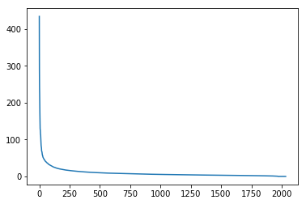
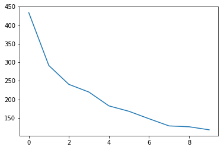
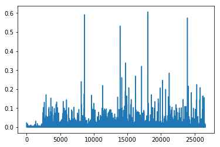
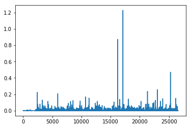
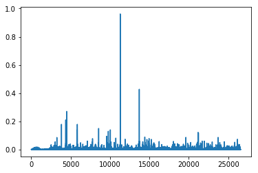

# 三、使用 NMF 和 SVD 的主题建模

主题建模是开始使用矩阵分解的好方法。 我们从术语 - 文档矩阵开始：


> 来源：[信息检索导论](http://player.slideplayer.com/15/4528582/#)

我们可以将其分解为一个高的窄矩阵乘以一个宽的扁矩阵（中间可能有对角矩阵）。

请注意，此表示不考虑单词顺序或句子结构。 这是一个词袋的例子。

### 动机

考虑最极端的情况 - 使用两个向量的外积重建矩阵。 显然，在大多数情况下，我们无法准确地重建矩阵。 但是，如果我们有一个向量，带有每个单词在所有单词中的相对频率，而另一个向量具有每个文档的平均单词数，那么外积将尽可能接近。

现在考虑将矩阵增加到两列和两行。 现在最佳分解是将文档聚类成两组，每组具有尽可能彼此不同的单词分布，但在簇中的文档中尽可能相似。 我们将这两个组称为“主题”。 我们会根据每个主题中最常出现的词汇将这些词汇分为两组。

### 今天的课程中

我们将采用几个不同类别的文档数据集，并为它们查找主题（由单词组组成）。 了解实际类别有助于我们评估我们发现的主题是否有意义。

我们将尝试使用两种不同的矩阵因式分解：奇异值分解（SVD）和非负矩阵分解（NMF）。

```py
import numpy as np
from sklearn.datasets import fetch_20newsgroups
from sklearn import decomposition
from scipy import linalg
import matplotlib.pyplot as plt

%matplotlib inline
np.set_printoptions(suppress=True)
```

## 附加资源

+   [数据源](http://scikit-learn.org/stable/datasets/twenty_newsgroups.html)：新闻组是 Usenet 上的讨论组，它在网络真正起飞之前的 80 年代和 90 年代很流行。 该数据集包括 18,000 个新闻组帖子，带有 20 个主题。
+   [Chris Manning 的矩阵分解和 LSI 的书](https://nlp.stanford.edu/IR-book/pdf/18lsi.pdf)
+   Sklearn 的[截断 SVD LSI 的细节](http://scikit-learn.org/stable/modules/decomposition.html#lsa)

### 其它教程

+   [Scikit-Learn：文本文档的核外分类](http://scikit-learn.org/stable/auto_examples/applications/plot_out_of_core_classification.html)：使用 [Reuters-21578](https://archive.ics.uci.edu/ml/datasets/reuters-21578+text+categorization+collection) 数据集（标有 ~100 个类别的路透社文章），`HashingVectorizer`
+   [使用人文和社会科学主题模型进行文本分析](https://de.dariah.eu/tatom/index.html)：使用 Jane Austen，Charlotte Bronte，Victor Hugo 等人的[英国和法国文学数据集](https://de.dariah.eu/tatom/datasets.html)

## 建立数据

Scikit Learn 附带了许多内置数据集，以及加载工具来加载多个标准外部数据集。 这是一个很好的资源，数据集包括波士顿房价，人脸图像，森林斑块，糖尿病，乳腺癌等。 我们将使用新闻组数据集。

新闻组是 Usenet 上的讨论组，它在网络真正起飞之前的 80 年代和 90 年代很流行。 该数据集包括 18,000 个新闻组帖子，带有 20 个主题。

```py
categories = ['alt.atheism', 'talk.religion.misc', 'comp.graphics', 'sci.space']
remove = ('headers', 'footers', 'quotes')
newsgroups_train = fetch_20newsgroups(subset='train', categories=categories, remove=remove)
newsgroups_test = fetch_20newsgroups(subset='test', categories=categories, remove=remove)

newsgroups_train.filenames.shape, newsgroups_train.target.shape

# ((2034,), (2034,))
```

我们来看看一些数据。 你能猜出这些消息属于哪个类别？

```py
print("\n".join(newsgroups_train.data[:3]))

'''
Hi,

I've noticed that if you only save a model (with all your mapping planes
positioned carefully) to a .3DS file that when you reload it after restarting
3DS, they are given a default position and orientation.  But if you save
to a .PRJ file their positions/orientation are preserved.  Does anyone
know why this information is not stored in the .3DS file?  Nothing is
explicitly said in the manual about saving texture rules in the .PRJ file. 
I'd like to be able to read the texture rule information, does anyone have 
the format for the .PRJ file?

Is the .CEL file format available from somewhere?

Rych


Seems to be, barring evidence to the contrary, that Koresh was simply
another deranged fanatic who thought it neccessary to take a whole bunch of
folks with him, children and all, to satisfy his delusional mania. Jim
Jones, circa 1993.


Nope - fruitcakes like Koresh have been demonstrating such evil corruption
for centuries.

 >In article <1993Apr19.020359.26996@sq.sq.com>, msb@sq.sq.com (Mark Brader) 

MB>                                                             So the
MB> 1970 figure seems unlikely to actually be anything but a perijove.

JG>Sorry, _perijoves_...I'm not used to talking this language.

Couldn't we just say periapsis or apoapsis?
'''
```

提示：perijove 的定义是离木星中心最近的木星卫星轨道上的点。

```py
np.array(newsgroups_train.target_names)[newsgroups_train.target[:3]]

'''
array(['comp.graphics', 'talk.religion.misc', 'sci.space'], 
      dtype='<U18')
'''
```

`target`属性是类别的整数索引。

```py
newsgroups_train.target[:10]

# array([1, 3, 2, 0, 2, 0, 2, 1, 2, 1])

num_topics, num_top_words = 6, 8
```

接下来，scikit learn 有一个方法可以为我们提取所有字数。

```py
from sklearn.feature_extraction.text import CountVectorizer, TfidfVectorizer

vectorizer = CountVectorizer(stop_words='english')
vectors = vectorizer.fit_transform(newsgroups_train.data).todense() # (documents, vocab)
vectors.shape #, vectors.nnz / vectors.shape[0], row_means.shape

# (2034, 26576)

print(len(newsgroups_train.data), vectors.shape)

# 2034 (2034, 26576)

vocab = np.array(vectorizer.get_feature_names())

vocab.shape

# (26576,)

vocab[7000:7020]

'''
array(['cosmonauts', 'cosmos', 'cosponsored', 'cost', 'costa', 'costar',
       'costing', 'costly', 'costruction', 'costs', 'cosy', 'cote',
       'couched', 'couldn', 'council', 'councils', 'counsel', 'counselees',
       'counselor', 'count'],
      dtype='<U80')
'''
```

## 奇异值分解（SVD）

“SVD并不像应该的那样出名。” - 吉尔伯特斯特朗

我们显然希望，在一个主题中最常出现的单词在另一个主题中出现的频率较低 - 否则该单词不会成为分离这两个主题的不错选择。 因此，我们希望主题是正交的。

SVD 算法将矩阵分解为具有正交列的和具有正交行的矩阵（以及包含每个因子的相对重要性的对角矩阵）。


> 来源：[Facebook 研究：快速随机 SVD](https://research.fb.com/fast-randomized-svd/)

SVD 是精确分解，因为它产生的矩阵足够大，完全覆盖原始矩阵。 SVD 在线性代数中的使用非常广泛，特别是在数据科学中，包括：

+   语义分析
+   协同过滤/推荐（获的 Netflix 奖项）
+   计算 Moore-Penrose 伪逆
+   数据压缩
+   主成分分析（将在后面介绍）

```py
%time U, s, Vh = linalg.svd(vectors, full_matrices=False)

'''
CPU times: user 1min 4s, sys: 8.82 s, total: 1min 13s
Wall time: 13.3 s
'''

print(U.shape, s.shape, Vh.shape)

# (2034, 2034) (2034,) (2034, 26576)
```

确认这是输入的分解。

### 答案

```py
# 练习：确认 U，s，Vh 是 var 向量的分解

# True
```

确认`U, V`正交。

### 答案

```py
# 练习：确认`U, V`正交

# True
```

### 主题

关于奇异值`s`我们能说什么？

```py
plt.plot(s);
```



```py
plt.plot(s[:10])

# [<matplotlib.lines.Line2D at 0x7fcada6c6828>]
```



```py
num_top_words=8

def show_topics(a):
    top_words = lambda t: [vocab[i] for i in np.argsort(t)[:-num_top_words-1:-1]]
    topic_words = ([top_words(t) for t in a])
    return [' '.join(t) for t in topic_words]

show_topics(Vh[:10])

'''
['critus ditto propagandist surname galacticentric kindergarten surreal imaginative',
 'jpeg gif file color quality image jfif format',
 'graphics edu pub mail 128 3d ray ftp',
 'jesus god matthew people atheists atheism does graphics',
 'image data processing analysis software available tools display',
 'god atheists atheism religious believe religion argument true',
 'space nasa lunar mars probe moon missions probes',
 'image probe surface lunar mars probes moon orbit',
 'argument fallacy conclusion example true ad argumentum premises',
 'space larson image theory universe physical nasa material']
'''
```

我们得到的主题匹配我们期望的簇的类型！ 尽管事实上这是一个无监督的算法 - 也就是说，我们从未真正告诉算法我们的文档是如何分组的。

稍后我们将更详细地回顾 SVD。 目前，重要的一点是我们有一个工具可以让我们将矩阵精确地分解为正交列和正交行。

## 非负矩阵分解（NMF）

### 动机


> 来源：[NMF 教程](http://perso.telecom-paristech.fr/~essid/teach/NMF_tutorial_ICME-2014.pdf)

更加可解释的方法：


> 来源：[NMF 教程](http://perso.telecom-paristech.fr/~essid/teach/NMF_tutorial_ICME-2014.pdf)


### 理念

不是将我们的因式限制为正交，而是另一种想法将它们限制为非负的。 NMF 是非负数据集`V`到非负矩阵`W`，`H`的因子分解：

```
V = WH
```

通常正因式会更容易解释（这也是 NMF 受欢迎的原因）。


> 来源：[NMF 教程](http://perso.telecom-paristech.fr/~essid/teach/NMF_tutorial_ICME-2014.pdf)


非负矩阵分解（NMF）是一种非精确因子分解，它将因子分解为一个窄的和一个短的正矩阵。 NMF 是 NP 难和不唯一的。 它有许多变体，通过添加不同的约束来创建。

### NMF 的应用

+   [人脸分解](http://scikit-learn.org/stable/auto_examples/decomposition/plot_faces_decomposition.html#sphx-glr-auto-examples-decomposition-plot-faces-decomposition-py)
+   [协同过滤，例如电影推荐](http://www.quuxlabs.com/blog/2010/09/matrix-factorization-a-simple-tutorial-and-implementation-in-python/)
+   [音频源分离](https://pdfs.semanticscholar.org/cc88/0b24791349df39c5d9b8c352911a0417df34.pdf)
+   [化学](http://ieeexplore.ieee.org/document/1532909/)
+   [生物信息学](https://bmcbioinformatics.biomedcentral.com/articles/10.1186/s12859-015-0485-4)和[基因表达](https://www.ncbi.nlm.nih.gov/pmc/articles/PMC2623306/)
+   主题建模（我们的问题！）


> 来源：[NMF 教程](http://perso.telecom-paristech.fr/~essid/teach/NMF_tutorial_ICME-2014.pdf)

### 阅读更多

+   [非负矩阵分解的原因和方法](https://arxiv.org/pdf/1401.5226.pdf)

### 来自 sklearn 的 NMF

首先我们使用 [sklearn 的 NMF 实现](http://scikit-learn.org/stable/modules/generated/sklearn.decomposition.NMF.html)：

```py
m,n=vectors.shape
d=5  # 主题数量

clf = decomposition.NMF(n_components=d, random_state=1)

W1 = clf.fit_transform(vectors)
H1 = clf.components_

show_topics(H1)

'''
['jpeg image gif file color images format quality',
 'edu graphics pub mail 128 ray ftp send',
 'space launch satellite nasa commercial satellites year market',
 'jesus matthew prophecy people said messiah david isaiah',
 'image data available software processing ftp edu analysis',
 'god atheists atheism religious believe people religion does']
'''
```

### TF-IDF

主题频率 - 逆文档频率（TF-IDF）是一种规范术语计数的方法，通过考虑它们在文档中出现的频率，文档的持续时间以及该术语的常见/稀有程度。

TF =（文档中术语`t`的出现次数）/（文档中的单词数）

IDF = log（文档数量/包含术语`t`的文档数）

```py
vectorizer_tfidf = TfidfVectorizer(stop_words='english')
vectors_tfidf = vectorizer_tfidf.fit_transform(newsgroups_train.data) # (documents, vocab)

W1 = clf.fit_transform(vectors_tfidf)
H1 = clf.components_

show_topics(H1)

'''
['don people just think like know say religion',
 'thanks graphics files image file program windows format',
 'space nasa launch shuttle orbit lunar moon earth',
 'ico bobbe tek beauchaine bronx manhattan sank queens',
 'god jesus bible believe atheism christian does belief',
 'objective morality values moral subjective science absolute claim']
'''

plt.plot(clf.components_[0])

# [<matplotlib.lines.Line2D at 0x7f0e1039a7b8>]
```



```py
clf.reconstruction_err_

# 43.71292605795277
```

### NMF 总结

优点：快速且易于使用！

缺点：需要多年的研究和专业知识才能创建

注意：

+   对于 NMF，矩阵高度需要至少与宽度一样，否则我们会遇到`fit_transform`的错误
+   可以在`CountVectorizer`中使用`df_min`来仅查看至少`k`个分割文本中的单词

### 使用 SGD 在 NumPy 中从零开始编写 NMF

### 梯度下降

标准梯度下降的关键思想：

+   随机选择一些权重来开始
+   循环：
    +   使用权重来计算预测
    +   计算损失的导数
    +   更新权重
+   多次重复步骤 2。最终我们得到了一些不错的权重。

关键：我们希望减少损失，导数告诉我们最陡的下降方向。

请注意，损失，误差和成本都是用于描述相同内容的术语。

让我们来看看[梯度下降导论笔记本](https://nbviewer.jupyter.org/github/fastai/numerical-linear-algebra-v2/blob/master/nbs/gradient-descent-intro.ipynb)（最初来自 [fast.ai 深度学习课程](https://github.com/fastai/courses)）。

### 随机梯度下降（SGD）

随机梯度下降是一种非常有用的优化方法（它也是深度学习的核心，它用于反向传播）。

对于标准梯度下降，我们使用所有数据来计算损失，可能非常慢。 在随机梯度下降中，我们仅根据我们的数据样本（有时称为小批量）来计算我们的损失函数。 我们会在不同的数据样本上得到不同的损失值，因此这就是随机的原因。 事实证明，这仍然是一种有效的优化方式，而且效率更高！

我们可以在这个[电子表格](https://nbviewer.jupyter.org/github/fastai/numerical-linear-algebra-v2/blob/master/nbs/graddesc.xlsm)中看到它是如何工作的（最初来自 [fast.ai 深度学习课程](https://github.com/fastai/courses)）。

资源：

+   [来自 Andrew Ng 的 Coursera ML 课程的 SGD 讲座](https://www.coursera.org/learn/machine-learning/lecture/DoRHJ/stochastic-gradient-descent)
+   [fast.ai wiki 页面上的 SGD](http://wiki.fast.ai/index.php/Stochastic_Gradient_Descent_(SGD))
+   [机器学习的梯度下降（Jason Brownlee - Machine Learning Mastery）](http://machinelearningmastery.com/gradient-descent-for-machine-learning/)
+   [梯度下降优化算法概述](http://sebastianruder.com/optimizing-gradient-descent/)

### 对 NMF 应用 SGD

目标：将`V(mxn)`分解为：

```
V ≈ WH
```

其中`W(mxd)`和`H(dxn)`，`W, H >= 0`，我们最小化`V − WH` 的 Frobenius 范式。

方法：我们将随机选择正的`W`和`H`，然后使用 SGD 进行优化。

要使用 SGD，我们需要知道损失函数的梯度。

资料来源：

+   [NMF 的优化性和梯度](http://users.wfu.edu/plemmons/papers/chu_ple.pdf)
+   [投影梯度](https://www.csie.ntu.edu.tw/~cjlin/papers/pgradnmf.pdf)

```py
lam=1e3
lr=1e-2
m, n = vectors_tfidf.shape

W1 = clf.fit_transform(vectors)
H1 = clf.components_

show_topics(H1)

'''
['jpeg image gif file color images format quality',
 'edu graphics pub mail 128 ray ftp send',
 'space launch satellite nasa commercial satellites year market',
 'jesus matthew prophecy people said messiah david isaiah',
 'image data available software processing ftp edu analysis',
 'god atheists atheism religious believe people religion does']
'''

mu = 1e-6
def grads(M, W, H):
    R = W@H-M
    return R@H.T + penalty(W, mu)*lam, W.T@R + penalty(H, mu)*lam # dW, dH

def penalty(M, mu):
    return np.where(M>=mu,0, np.min(M - mu, 0))

def upd(M, W, H, lr):
    dW,dH = grads(M,W,H)
    W -= lr*dW; H -= lr*dH

def report(M,W,H): 
    print(np.linalg.norm(M-W@H), W.min(), H.min(), (W<0).sum(), (H<0).sum())

W = np.abs(np.random.normal(scale=0.01, size=(m,d)))
H = np.abs(np.random.normal(scale=0.01, size=(d,n)))

report(vectors_tfidf, W, H)

# 44.4395133509 5.67503308167e-07 2.49717354504e-07 0 0

upd(vectors_tfidf,W,H,lr)

report(vectors_tfidf, W, H)

# 44.4194155587 -0.00186845669883 -0.000182969569359 509 788

for i in range(50): 
    upd(vectors_tfidf,W,H,lr)
    if i % 10 == 0: report(vectors_tfidf,W,H)

'''
44.4071645597 -0.00145791197281 -0.00012862260312 343 1174
44.352156176 -0.000549676823494 -9.16363641124e-05 218 4689
44.3020593384 -0.000284017335617 -0.000130903875061 165 9685
44.2468609535 -0.000279317810433 -0.000182173029912 169 16735
44.199218 -0.000290092649623 -0.000198140867356 222 25109
'''

show_topics(H)

'''
['cview file image edu files use directory temp',
 'moral like time does don software new years',
 'god jesus bible believe objective exist atheism belief',
 'thanks graphics program know help looking windows advance',
 'space nasa launch shuttle orbit station moon lunar',
 'people don said think ico tek bobbe bronx']
'''
```

这种训练非常缓慢！ 大量的参数要调整，但仍然很慢（或爆炸）。

### PyTorch

[PyTorch](http://pytorch.org/) 是一个用于张量和动态神经网络的 Python 框架，具有 GPU 加速功能。 许多核心贡献者都在 Facebook 的 AI 团队中工作。 在许多方面，它与 Numpy 类似，只是增加了使用 GPU 的并行化。

从 [PyTorch 文档](http://pytorch.org/tutorials/beginner/blitz/tensor_tutorial.html)来看：


进一步学习：如果你想了解动态神经网络是什么，你可能希望观看 Facebook AI 研究员和 PyTorch 核心贡献者 Soumith Chintala 的[演讲](https://www.youtube.com/watch?v=Z15cBAuY7Sc)。

如果你想更加了解 PyTorch，你可以尝试[本教程](http://pytorch.org/tutorials/beginner/deep_learning_60min_blitz.html)或[通过示例学习](http://pytorch.org/tutorials/beginner/pytorch_with_examples.html)。

GPU 的注意事项：如果你不使用GPU，则需要从以下方法中删除`.cuda()`。 本课程不需要使用 GPU，但我认为有些人会感兴趣。 要了解如何使用 GPU 创建 AWS 实例，你可以观看 [fast.ai 的配置课程](http://course.fast.ai/lessons/aws.html)。

```py
import torch
import torch.cuda as tc
from torch.autograd import Variable

def V(M): return Variable(M, requires_grad=True)

v=vectors_tfidf.todense()

t_vectors = 
torch.Tensor(v.astype(np.float32)).cuda()

mu = 1e-5

def grads_t(M, W, H):
    R = W.mm(H)-M
    return (R.mm(H.t()) + penalty_t(W, mu)*lam, 
        W.t().mm(R) + penalty_t(H, mu)*lam) # dW, dH

def penalty_t(M, mu):
    return (M<mu).type(tc.FloatTensor)*torch.clamp(M - mu, max=0.)

def upd_t(M, W, H, lr):
    dW,dH = grads_t(M,W,H)
    W.sub_(lr*dW); H.sub_(lr*dH)

def report_t(M,W,H): 
    print((M-W.mm(H)).norm(2), W.min(), H.min(), (W<0).sum(), (H<0).sum())

t_W = tc.FloatTensor(m,d)
t_H = tc.FloatTensor(d,n)
t_W.normal_(std=0.01).abs_(); 
t_H.normal_(std=0.01).abs_();

d=6; lam=100; lr=0.05

for i in range(1000): 
    upd_t(t_vectors,t_W,t_H,lr)
    if i % 100 == 0: 
        report_t(t_vectors,t_W,t_H)
        lr *= 0.9

'''
44.392791748046875 -0.0060190423391759396 -0.0004986411076970398 1505 2282
43.746803283691406 -0.009054708294570446 -0.011047963984310627 2085 23854
43.702056884765625 -0.008214150555431843 -0.014783496037125587 2295 24432
43.654273986816406 -0.006195350084453821 -0.006913348101079464 2625 22663
43.646759033203125 -0.004638500511646271 -0.003197424579411745 2684 23270
43.645320892333984 -0.005679543130099773 -0.00419645756483078 3242 24199
43.6449089050293 -0.0041352929547429085 -0.00843129213899374 3282 25030
43.64469528198242 -0.003943094052374363 -0.00745873199775815 3129 26220
43.64459991455078 -0.004347225651144981 -0.007400824688374996 3031 26323
43.64434051513672 -0.0039044099394232035 -0.0067480215802788734 3930 33718
'''

show_topics(t_H.cpu().numpy())

'''
['objective morality values moral subjective science absolute claim',
 'god jesus bible believe atheism christian does belief',
 'ico bobbe tek bronx beauchaine manhattan sank queens',
 'thanks graphics files image file program windows know',
 'space nasa launch shuttle orbit lunar moon earth',
 'don people just think like know say religion']
'''

plt.plot(t_H.cpu().numpy()[0])

# [<matplotlib.lines.Line2D at 0x7fe4173f1d68>]
```



```py
t_W.mm(t_H).max()

0.43389660120010376

t_vectors.max()

0.9188119769096375
```

### PyTorch：自动梯度

在上面，我们使用了我们的损失函数梯度的知识，在 PyTorch 中从零编写 SGD。 但是，PyTorch 有一个自动梯度包，我们可以使用它。 这非常有用，因为我们可以在我们不知道导数是什么的问题上使用自动梯度。

我们在下面使用的方法非常通用，几乎可以用于任何优化问题。

在 PyTorch 中，变量与张量具有相同的 API，但变量记住了用于创建它们的操作。 这让我们可以求导。

### PyTorch 自动梯度简介

示例从官方文档中的[本教程](http://pytorch.org/tutorials/beginner/former_torchies/autograd_tutorial.html)获取。

```py
x = Variable(torch.ones(2, 2), requires_grad=True)
print(x)

'''
Variable containing:
 1  1
 1  1
[torch.FloatTensor of size 2x2]
'''

print(x.data)

'''
 1  1
 1  1
[torch.FloatTensor of size 2x2]
'''

print(x.grad)

'''
Variable containing:
 0  0
 0  0
[torch.FloatTensor of size 2x2]
'''

y = x + 2
print(y)

'''
Variable containing:
 3  3
 3  3
[torch.FloatTensor of size 2x2]
'''

z = y * y * 3
out = z.sum()
print(z, out)

'''
Variable containing:
 27  27
 27  27
[torch.FloatTensor of size 2x2]
 Variable containing:
 108
[torch.FloatTensor of size 1]
'''

out.backward()
print(x.grad)

'''
Variable containing:
 18  18
 18  18
[torch.FloatTensor of size 2x2]
'''
```

### 对 NMF 使用自动梯度

```py
lam=1e6

pW = Variable(tc.FloatTensor(m,d), requires_grad=True)
pH = Variable(tc.FloatTensor(d,n), requires_grad=True)
pW.data.normal_(std=0.01).abs_()
pH.data.normal_(std=0.01).abs_();

def report():
    W,H = pW.data, pH.data
    print((M-pW.mm(pH)).norm(2).data[0], W.min(), H.min(), (W<0).sum(), (H<0).sum())

def penalty(A):
    return torch.pow((A<0).type(tc.FloatTensor)*torch.clamp(A, max=0.), 2)

def penalize(): return penalty(pW).mean() + penalty(pH).mean()

def loss(): return (M-pW.mm(pH)).norm(2) + penalize()*lam

M = Variable(t_vectors).cuda()

opt = torch.optim.Adam([pW,pH], lr=1e-3, betas=(0.9,0.9))
lr = 0.05
report()

# 43.66044616699219 -0.0002547535696066916 -0.00046720390673726797 319 8633
```

使用自动梯度，如何应用 SGD：

```py
for i in range(1000): 
    opt.zero_grad()
    l = loss()
    l.backward()
    opt.step()
    if i % 100 == 99: 
        report()
        lr *= 0.9     # 学习率衰减

'''
43.628597259521484 -0.022899555042386055 -0.26526615023612976 692 82579
43.62860107421875 -0.021287493407726288 -0.2440912425518036 617 77552
43.628597259521484 -0.020111067220568657 -0.22828206419944763 576 77726
43.628604888916016 -0.01912039890885353 -0.21654289960861206 553 84411
43.62861251831055 -0.018248897045850754 -0.20736189186573029 544 75546
43.62862014770508 -0.01753264293074608 -0.19999365508556366 491 78949
43.62862777709961 -0.016773322597146034 -0.194113627076149 513 83822
43.628639221191406 -0.01622121036052704 -0.18905577063560486 485 74101
43.62863540649414 -0.01574397087097168 -0.18498440086841583 478 85987
43.628639221191406 -0.015293922275304794 -0.18137598037719727 487 74023
'''

h = pH.data.cpu().numpy()
show_topics(h)

'''
['god jesus bible believe atheism christian belief does',
 'thanks graphics files image file windows program format',
 'just don think people like ve graphics religion',
 'objective morality values moral subjective science absolute claim',
 'ico bobbe tek beauchaine bronx manhattan sank queens',
 'space nasa shuttle launch orbit lunar moon data']
'''
plt.plot(h[0]);
```



### 比较方法

Scikit-Learn 的 NMF

+   快
+   没有参数调整
+   依靠几十年的学术研究，花了专家很长时间来实现


> 来源：[Python Numfa 文档](http://nimfa.biolab.si/)

使用 PyTorch 和 SGD

+   花了我们一个小时来实现，没有必要成为 NMF 的专家
+   参数很繁琐
+   没有那么快（在 numpy 中尝试过，我们不得不切换到 PyTorch）

## 截断 SVD

当我们计算 NMF 时，通过计算我们感兴趣的列的子集，我们节省了大量时间。有没有办法通过 SVD 获得这个好处？ 就在这里！ 它被称为截断 SVD。 我们只对与最大奇异值对应的向量感兴趣。


> 来源：[Facebook 研究：快速随机 SVD](https://research.fb.com/fast-randomized-svd/)

### 经典算法对于分解的缺陷

+   矩阵“非常大”
+   数据通常缺失或不准确。 当输入的不精确限制输出的精度时，为什么要花费额外的计算资源？
+   数据传输现在在算法时间中起主要作用。 即使需要更多的浮点运算（flop），需要更少数据传递的技术也可以极大加速。
+   重要的是利用 GPU。

> 来源：[Halko](https://arxiv.org/abs/0909.4061)

### 随机算法的优势

+   内在稳定
+   性能保证不依赖于细微的光谱特性
+   所需的矩阵向量积可以并行完成

> 来源：[Halko](https://arxiv.org/abs/0909.4061)
