# 六、使用鲁棒回归的 CT 扫描的压缩感知

## 广播

术语广播描述了在算术运算期间，如何处理不同形状的数组。 Numpy 首先使用广播一词，但现在用于其他库，如 Tensorflow 和 Matlab；规则因库而异。

来自 Numpy 文档：

> 广播提供了一种向量化数组操作的方法，使循环在 C 而不是 Python 中出现。 它可以不制作不必要的数据副本而实现，并且通常可以产生高效实现。最简单的广播示例在数组乘以标量时发生。

```py
a = np.array([1.0, 2.0, 3.0])
b = 2.0
a * b

# array([ 2.,  4.,  6.])

v=np.array([1,2,3])
print(v, v.shape)

# [1 2 3] (3,)

m=np.array([v,v*2,v*3]); m, m.shape

'''
(array([[1, 2, 3],
        [2, 4, 6],
        [3, 6, 9]]), (3, 3))
'''

n = np.array([m*1, m*5])

n

'''
array([[[ 1,  2,  3],
        [ 2,  4,  6],
        [ 3,  6,  9]],

       [[ 5, 10, 15],
        [10, 20, 30],
        [15, 30, 45]]])
'''

n.shape, m.shape

# ((2, 3, 3), (3, 3))
```

我们可以使用广播来将矩阵和数组相加：

```py
m+v

'''
array([[ 2,  4,  6],
       [ 3,  6,  9],
       [ 4,  8, 12]])
'''
```

注意如果我们转置数组会发生什么：

```py
v1=np.expand_dims(v,-1); v1, v1.shape

'''
(array([[1],
        [2],
        [3]]), (3, 1))
'''

m+v1

'''
array([[ 2,  3,  4],
       [ 4,  6,  8],
       [ 6,  9, 12]])
'''
```

### 通用的 NumPy 广播规则

操作两个数组时，NumPy 会逐元素地比较它们的形状。 它从最后的维度开始，并向前移动。 如果满足：

+   他们是相等的，或者
+   其中一个是 1

两个维度兼容。

数组不需要具有相同数量的维度。 例如，如果你有一个`256×256×3`的 RGB 值数组，并且你希望将图像中的每种颜色缩放不同的值，则可以将图像乘以具有 3 个值的一维数组。 根据广播规则排列这些数组的尾部轴的大小，表明它们是兼容的：

```
Image  (3d array): 256 x 256 x 3
Scale  (1d array):             3
Result (3d array): 256 x 256 x 3
```

### 回顾

```py
v = np.array([1,2,3,4])
m = np.array([v,v*2,v*3])
A = np.array([5*m, -1*m])

v.shape, m.shape, A.shape

# ((4,), (3, 4), (2, 3, 4))
```

下列操作有效嘛？

```py
A

A + v

A.T + v

A.T.shape
```

### （SciPy 中的）稀疏矩阵

具有大量零的矩阵称为稀疏（稀疏是密集的反义）。 对于稀疏矩阵，仅仅存储非零值，可以节省大量内存。


另一个大型稀疏矩阵的例子：


> [来源](https://commons.wikimedia.org/w/index.php?curid=2245335S)

这是最常见的稀疏存储格式：

+   逐坐标（scipy 称 COO）
+   压缩稀疏行（CSR）
+   压缩稀疏列（CSC）

让我们来看看[这些例子](http://www.mathcs.emory.edu/~cheung/Courses/561/Syllabus/3-C/sparse.html)。

实际上还有[更多格式](http://www.cs.colostate.edu/~mcrob/toolbox/c++/sparseMatrix/sparse_matrix_compression.html)。

如果非零元素的数量与行（或列）的数量成比例而不是与行列的乘积成比例，则通常将一类矩阵（例如，对角）称为稀疏。

### Scipy 实现

来自 [Scipy 稀疏矩阵文档](https://docs.scipy.org/doc/scipy-0.18.1/reference/sparse.html)

+   为了有效地构造矩阵，请使用`dok_matrix`或`lil_matrix`。 `lil_matrix`类支持基本切片和花式索引，其语法与 NumPy 数组类似。 如下所示，COO 格式也可用于有效地构造矩阵
+   要执行乘法或求逆等操作，首先要将矩阵转换为 CSC 或 CSR 格式。
+   CSR，CSC 和 COO 格式之间的所有转换都是高效的线性时间操作。

### 今天：CT 扫描

### 引言

“[数学真的可以拯救你的生命吗？当然可以！！](https://plus.maths.org/content/saving-lives-mathematics-tomography)” （可爱的文章）


（CAT 和 CT 扫描指代相同的过程。CT 扫描是更现代的术语）

本课程基于 Scikit-Learn 示例[压缩感知：使用 L1 先验的层析成像重建（Lasso）](http://scikit-learn.org/stable/auto_examples/applications/plot_tomography_l1_reconstruction.html)。

### 我们今天的目标

读取 CT 扫描的结果并构建原始图像。


对于（特定位置和特定角度的）每个 X 射线，我们进行单次测量。 我们需要从这些测量中构建原始图像。 此外，我们不希望患者经历大量辐射，因此我们收集的数据少于图片区域。


我们会看到：


> 来源：[压缩感知](https://people.csail.mit.edu/indyk/princeton.pdf)


> [来源](https://www.fields.utoronto.ca/programs/scientific/10-11/medimaging/presentations/Plenary_Sidky.pdf)

### 导入

```py
%matplotlib inline
import numpy as np, matplotlib.pyplot as plt, math
from scipy import ndimage, sparse

np.set_printoptions(suppress=True)
```

## 生成数据

### 引言

我们将使用生成的数据（不是真正的 CT 扫描）。 生成数据涉及一些有趣的 numpy 和线性代数，我们稍后会再回过头来看。

代码来自 Scikit-Learn 示例[压缩感知：使用 L1 先验的层析成像重建（Lasso）](http://scikit-learn.org/stable/auto_examples/applications/plot_tomography_l1_reconstruction.html)。

### 生成图像

```py
def generate_synthetic_data():
    rs = np.random.RandomState(0)
    n_pts = 36
    x, y = np.ogrid[0:l, 0:l]
    mask_outer = (x - l / 2) ** 2 + (y - l / 2) ** 2 < (l / 2) ** 2
    mx,my = rs.randint(0, l, (2,n_pts))
    mask = np.zeros((l, l))
    mask[mx,my] = 1
    mask = ndimage.gaussian_filter(mask, sigma=l / n_pts)
    res = (mask > mask.mean()) & mask_outer
    return res ^ ndimage.binary_erosion(res)

l = 128
data = generate_synthetic_data()

plt.figure(figsize=(5,5))
plt.imshow(data, cmap=plt.cm.gray);
```

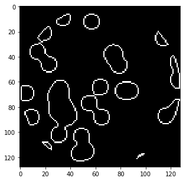

### `generate_synthetic_data`在做什么

```py
l=8; n_pts=5
rs = np.random.RandomState(0)

x, y = np.ogrid[0:l, 0:l]; x,y

'''
(array([[0],
        [1],
        [2],
        [3],
        [4],
        [5],
        [6],
        [7]]), array([[0, 1, 2, 3, 4, 5, 6, 7]]))
'''

x + y

'''
array([[ 0,  1,  2,  3,  4,  5,  6,  7],
       [ 1,  2,  3,  4,  5,  6,  7,  8],
       [ 2,  3,  4,  5,  6,  7,  8,  9],
       [ 3,  4,  5,  6,  7,  8,  9, 10],
       [ 4,  5,  6,  7,  8,  9, 10, 11],
       [ 5,  6,  7,  8,  9, 10, 11, 12],
       [ 6,  7,  8,  9, 10, 11, 12, 13],
       [ 7,  8,  9, 10, 11, 12, 13, 14]])
'''

(x - l/2) ** 2 

'''
array([[ 16.],
       [  9.],
       [  4.],
       [  1.],
       [  0.],
       [  1.],
       [  4.],
       [  9.]])
'''

(x - l/2) ** 2 + (y - l/2) ** 2

'''
array([[ 32.,  25.,  20.,  17.,  16.,  17.,  20.,  25.],
       [ 25.,  18.,  13.,  10.,   9.,  10.,  13.,  18.],
       [ 20.,  13.,   8.,   5.,   4.,   5.,   8.,  13.],
       [ 17.,  10.,   5.,   2.,   1.,   2.,   5.,  10.],
       [ 16.,   9.,   4.,   1.,   0.,   1.,   4.,   9.],
       [ 17.,  10.,   5.,   2.,   1.,   2.,   5.,  10.],
       [ 20.,  13.,   8.,   5.,   4.,   5.,   8.,  13.],
       [ 25.,  18.,  13.,  10.,   9.,  10.,  13.,  18.]])
'''

mask_outer = (x - l/2) ** 2 + (y - l/2) ** 2 < (l/2) ** 2; mask_outer

'''
array([[False, False, False, False, False, False, False, False],
       [False, False,  True,  True,  True,  True,  True, False],
       [False,  True,  True,  True,  True,  True,  True,  True],
       [False,  True,  True,  True,  True,  True,  True,  True],
       [False,  True,  True,  True,  True,  True,  True,  True],
       [False,  True,  True,  True,  True,  True,  True,  True],
       [False,  True,  True,  True,  True,  True,  True,  True],
       [False, False,  True,  True,  True,  True,  True, False]], dtype=bool)
'''

plt.imshow(mask_outer, cmap='gray')

# <matplotlib.image.AxesImage at 0x7efcd9303278>
```

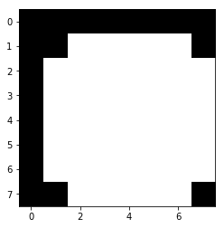

```py
mask = np.zeros((l, l))
mx,my = rs.randint(0, l, (2,n_pts))
mask[mx,my] = 1; mask

'''
array([[ 0.,  1.,  0.,  0.,  0.,  0.,  0.,  0.],
       [ 0.,  0.,  0.,  0.,  0.,  0.,  0.,  0.],
       [ 0.,  0.,  0.,  0.,  0.,  0.,  0.,  0.],
       [ 0.,  0.,  0.,  1.,  0.,  0.,  0.,  0.],
       [ 0.,  0.,  0.,  1.,  0.,  0.,  0.,  0.],
       [ 0.,  0.,  0.,  0.,  0.,  0.,  0.,  1.],
       [ 0.,  0.,  0.,  0.,  0.,  0.,  0.,  0.],
       [ 0.,  0.,  0.,  1.,  0.,  0.,  0.,  0.]])
'''

plt.imshow(mask, cmap='gray')

# <matplotlib.image.AxesImage at 0x7efcd9293940>
```

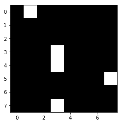

```py
mask = ndimage.gaussian_filter(mask, sigma=l / n_pts)

plt.imshow(mask, cmap='gray')

# <matplotlib.image.AxesImage at 0x7efcd922c0b8>
```

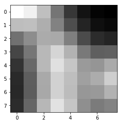

```py
res = np.logical_and(mask > mask.mean(), mask_outer)
plt.imshow(res, cmap='gray');
```


```py
plt.imshow(ndimage.binary_erosion(res), cmap='gray');
```

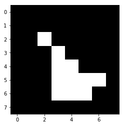

```py
plt.imshow(res ^ ndimage.binary_erosion(res), cmap='gray');
```

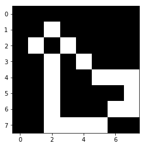

## 生成投影

### 代码

```py
def _weights(x, dx=1, orig=0):
    x = np.ravel(x)
    floor_x = np.floor((x - orig) / dx)
    alpha = (x - orig - floor_x * dx) / dx
    return np.hstack((floor_x, floor_x + 1)), np.hstack((1 - alpha, alpha))


def _generate_center_coordinates(l_x):
    X, Y = np.mgrid[:l_x, :l_x].astype(np.float64)
    center = l_x / 2.
    X += 0.5 - center
    Y += 0.5 - center
    return X, Y

def build_projection_operator(l_x, n_dir):
    X, Y = _generate_center_coordinates(l_x)
    angles = np.linspace(0, np.pi, n_dir, endpoint=False)
    data_inds, weights, camera_inds = [], [], []
    data_unravel_indices = np.arange(l_x ** 2)
    data_unravel_indices = np.hstack((data_unravel_indices,
                                      data_unravel_indices))
    for i, angle in enumerate(angles):
        Xrot = np.cos(angle) * X - np.sin(angle) * Y
        inds, w = _weights(Xrot, dx=1, orig=X.min())
        mask = (inds >= 0) & (inds < l_x)
        weights += list(w[mask])
        camera_inds += list(inds[mask] + i * l_x)
        data_inds += list(data_unravel_indices[mask])
    proj_operator = sparse.coo_matrix((weights, (camera_inds, data_inds)))
    return proj_operator
```

### 投影运算符

```py
l = 128

proj_operator = build_projection_operator(l, l // 7)

proj_operator

'''
<2304x16384 sparse matrix of type '<class 'numpy.float64'>'
    with 555378 stored elements in COOrdinate format>
'''
```

维度：角度（`l // 7`），位置（`l`），每个图像（`l x l`）

```py
proj_t = np.reshape(proj_operator.todense().A, (l//7,l,l,l))
```

第一个坐标指的是线的角度，第二个坐标指代线的位置。

索引为 3 的角度的直线：

```py
plt.imshow(proj_t[3,0], cmap='gray');
```

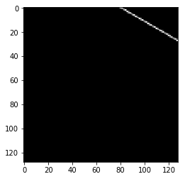

```py
plt.imshow(proj_t[3,1], cmap='gray');
```


```py
plt.imshow(proj_t[3,2], cmap='gray');
```


```py
plt.imshow(proj_t[3,40], cmap='gray');
```

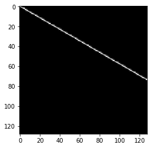

垂直位置 40 处的其他直线：

```py
plt.imshow(proj_t[4,40], cmap='gray');
```

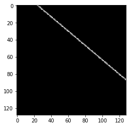

```py
plt.imshow(proj_t[15,40], cmap='gray');
```

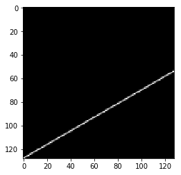

```py
plt.imshow(proj_t[17,40], cmap='gray');
```

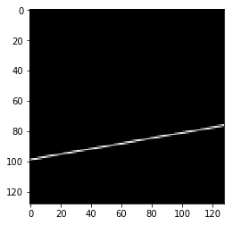

### X 射线和数据之间的交点

接下来，我们想看看直线如何与我们的数据相交。 请记住，这就是数据的样子：

```py
plt.figure(figsize=(5,5))
plt.imshow(data, cmap=plt.cm.gray)
plt.axis('off')
plt.savefig("images/data.png")
```

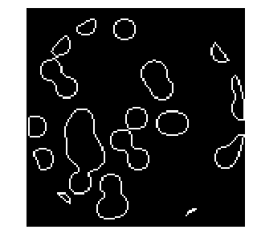

```py
proj = proj_operator @ data.ravel()[:, np.newaxis]
```

角度为 17，位置为 40 的穿过数据的 X 射线：

```py
plt.figure(figsize=(5,5))
plt.imshow(data + proj_t[17,40], cmap=plt.cm.gray)
plt.axis('off')
plt.savefig("images/data_xray.png")
```

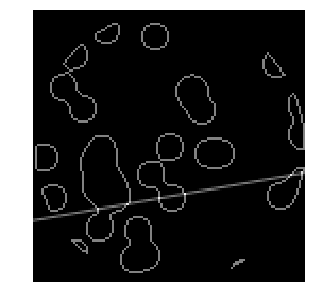

它们相交的地方。

```py
both = data + proj_t[17,40]
plt.imshow((both > 1.1).astype(int), cmap=plt.cm.gray);
```

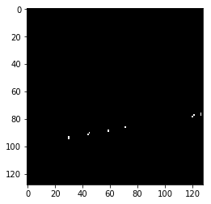

那条 X 射线的强度：

```py
np.resize(proj, (l//7,l))[17,40]

# 6.4384498372605989
```

角度为 3，位置为 14 的穿过数据的 X 射线：

```py
plt.imshow(data + proj_t[3,14], cmap=plt.cm.gray);
```

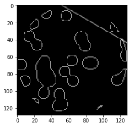

它们相交的地方。

```py
both = data + proj_t[3,14]
plt.imshow((both > 1.1).astype(int), cmap=plt.cm.gray);
```


CT 扫描的测量结果在这里是一个小数字：

```py
np.resize(proj, (l//7,l))[3,14]

# 2.1374953737965541

proj += 0.15 * np.random.randn(*proj.shape)
```

### 关于`*args`

```py
a = [1,2,3]
b = [4,5,6]

c = list(zip(a, b))

c

# [(1, 4), (2, 5), (3, 6)]

list(zip(*c))

# [(1, 2, 3), (4, 5, 6)]
```

### 投影（CT 读取）

```py
plt.figure(figsize=(7,7))
plt.imshow(np.resize(proj, (l//7,l)), cmap='gray')
plt.axis('off')
plt.savefig("images/proj.png")
```

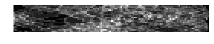

## 回归

现在我们将尝试仅从投影中恢复数据（CT 扫描的测量值）。

### 线性回归：`Xβ=y`

我们的矩阵`A`是投影算子。 这是我们不同 X 射线上方的 4d 矩阵（角度，位置，`x`，`y`）：

```py
plt.figure(figsize=(12,12))
plt.title("X: Projection Operator")
plt.imshow(proj_operator.todense().A, cmap='gray')

# <matplotlib.image.AxesImage at 0x7efcd414ed30>
```

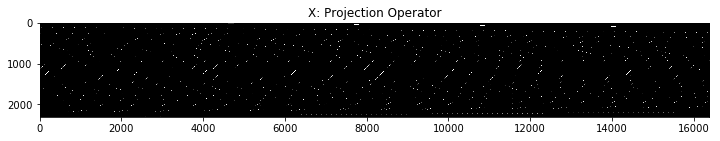

我们正在求解原始数据`x`。 我们将 2D 数据展开为单个列。

```py
plt.figure(figsize=(5,5))
plt.title("beta: Image")
plt.imshow(data, cmap='gray')

plt.figure(figsize=(4,12))
# 我正在平铺列，使其更容易看到
plt.imshow(np.tile(data.ravel(), (80,1)).T, cmap='gray')

# <matplotlib.image.AxesImage at 0x7efcd3b1e278>
```

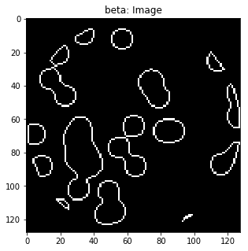


我们的向量`y`是展开的测量值矩阵：

```py
plt.figure(figsize=(8,8))
plt.imshow(np.resize(proj, (l//7,l)), cmap='gray')

plt.figure(figsize=(10,10))
plt.imshow(np.tile(proj.ravel(), (20,1)).T, cmap='gray')

# <matplotlib.image.AxesImage at 0x7efcd34f8710>
```

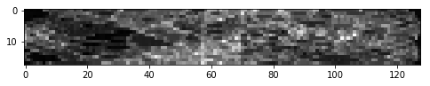

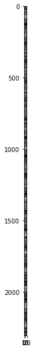

# 使用 Sklearn 线性回归重构图像

```py
from sklearn.linear_model import Lasso
from sklearn.linear_model import Ridge

# 用 L2（岭）惩罚重建
rgr_ridge = Ridge(alpha=0.2)
rgr_ridge.fit(proj_operator, proj.ravel())
rec_l2 = rgr_ridge.coef_.reshape(l, l)
plt.imshow(rec_l2, cmap='gray')

# <matplotlib.image.AxesImage at 0x7efcd453d5c0>
```

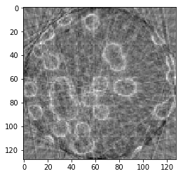

```py
18*128

# 2304

18 x 128 x 128 x 128
```

### L1 范数产生稀疏性

单位球 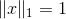 在 L1 范数中是菱形。 它的极值是角：


> [来源](https://www.quora.com/Why-is-L1-regularization-supposed-to-lead-to-sparsity-than-L2)

类似的视角是看损失函数的轮廓：


> [来源](https://www.quora.com/Why-is-L1-regularization-better-than-L2-regularization-provided-that-all-Norms-are-equivalent)

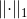 是 L1 范数。 最小化 L1 范数会产生稀疏值。 对于矩阵，L1 范数等于最大绝对列范数。

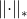 是核范数，它是奇异值的 L1 范数。 试图最小化它会产生稀疏的奇异值 -> 低秩。

```py
proj_operator.shape

# (2304, 16384)

# 使用 L1（Lasso）惩罚重建 α 的最佳值
# 使用 LassoCV 交叉验证来确定
rgr_lasso = Lasso(alpha=0.001)
rgr_lasso.fit(proj_operator, proj.ravel())
rec_l1 = rgr_lasso.coef_.reshape(l, l)
plt.imshow(rec_l1, cmap='gray')

# <matplotlib.image.AxesImage at 0x7efcd4919cf8>
```

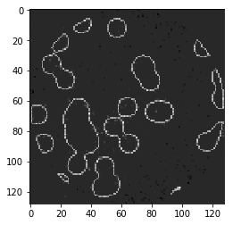

这里的 L1 惩罚明显优于 L2 惩罚！
