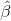
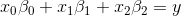
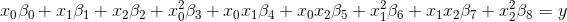
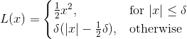

# 七、线性回归和健康结果

## 糖尿病数据集

我们将使用来自糖尿病患者的数据集。 数据由 442 个样本和 10 个变量（都是生理特征）组成，因此它很高而且很窄。 因变量是基线后一年疾病进展的定量测量。

这是一个经典的数据集，由 Efron，Hastie，Johnstone 和 Tibshirani 在他们的最小角度回归的论文中使用，也是 scikit-learn 中包含的众多数据集之一。

```py
data = datasets.load_diabetes()

feature_names=['age', 'sex', 'bmi', 'bp', 's1', 's2', 's3', 's4', 's5', 's6']

trn,test,y_trn,y_test = train_test_split(data.data, data.target, test_size=0.2)

trn.shape, test.shape

# ((353, 10), (89, 10))
```

## Sklearn 中的线性回归

考虑系统`Xβ=y`，其中`X`的行比列更多。 当你有比变量更多的数据样本时会发生这种情况。 我们想要找到  来最小化：


让我们从使用 sklearn 实现开始：

```py
regr = linear_model.LinearRegression()
%timeit regr.fit(trn, y_trn)

# 458 µs ± 62.4 µs per loop (mean ± std. dev. of 7 runs, 1000 loops each)

pred = regr.predict(test)
```

有一些指标来表示我们的预测有多好，会很有帮助。 我们将研究均方范数（L2）和平均绝对误差（L1）。


```py
def regr_metrics(act, pred):
    return (math.sqrt(metrics.mean_squared_error(act, pred)), 
    metrics.mean_absolute_error(act, pred))

regr_metrics(y_test, regr.predict(test))

# (75.36166834955054, 60.629082113104403)
```

## 多项式特征

线性回归找到最佳系数`βi`：



添加多项式特征仍然是线性回归问题，只需更多项：



我们需要使用原始数据`X`来计算其他多项式特征。

```py
trn.shape

# (353, 10)
```

现在，我们想通过添加更多功能，来尝试提高模型的表现。 目前，我们的模型在每个变量中都是线性的，但我们可以添加多项式特征来改变它。

```py
poly = PolynomialFeatures(include_bias=False)

trn_feat = poly.fit_transform(trn)

', '.join(poly.get_feature_names(feature_names))

# 'age, sex, bmi, bp, s1, s2, s3, s4, s5, s6, age^2, age sex, age bmi, age bp, age s1, age s2, age s3, age s4, age s5, age s6, sex^2, sex bmi, sex bp, sex s1, sex s2, sex s3, sex s4, sex s5, sex s6, bmi^2, bmi bp, bmi s1, bmi s2, bmi s3, bmi s4, bmi s5, bmi s6, bp^2, bp s1, bp s2, bp s3, bp s4, bp s5, bp s6, s1^2, s1 s2, s1 s3, s1 s4, s1 s5, s1 s6, s2^2, s2 s3, s2 s4, s2 s5, s2 s6, s3^2, s3 s4, s3 s5, s3 s6, s4^2, s4 s5, s4 s6, s5^2, s5 s6, s6^2'

trn_feat.shape

# (353, 65)

regr.fit(trn_feat, y_trn)

# LinearRegression(copy_X=True, fit_intercept=True, n_jobs=1, normalize=False)

regr_metrics(y_test, regr.predict(poly.fit_transform(test)))

# (55.747345922929185, 42.836164292252235)
```

时间对于特征数是平方的，对于样本数是线性的，所以这将变得非常慢！

```py
%timeit poly.fit_transform(trn)

# 635 µs ± 9.25 µs per loop (mean ± std. dev. of 7 runs, 1000 loops each)
```

## 加速特征生成

我们想加快速度。 我们将使用 Numba，一个直接将代码编译为 C 的 Python 库。

Numba 是一个编译器。

### 资源

Jake VanderPlas 的[这个教程](https://jakevdp.github.io/blog/2012/08/24/numba-vs-cython/)是一个很好的介绍。 在这里，Jake 使用 Numba 实现了一个[非平凡的算法](https://jakevdp.github.io/blog/2015/02/24/optimizing-python-with-numpy-and-numba/)（非均匀快速傅里叶变换）。

Cython 是另一种选择。 我发现 Cython 主要比 Numba 更多的知识（它更接近 C），但提供类似 Numba 的加速。


这里是预先编译（AOT）编译器，即时编译（JIT）编译器和解释器之间差异的[全面回答](https://softwareengineering.stackexchange.com/questions/246094/understanding-the-differences-traditional-interpreter-jit-compiler-jit-interp)。

### 使用向量化和原生代码进行实验


让我们先了解一下 Numba，然后我们将回到我们的糖尿病数据集回归的多项式特征问题。

```py
%matplotlib inline

import math, numpy as np, matplotlib.pyplot as plt
from pandas_summary import DataFrameSummary
from scipy import ndimage

from numba import jit, vectorize, guvectorize, cuda, float32, void, float64
```

我们将展示以下方面的影响：

+   避免内存分配和副本（比 CPU 计算慢）
+   更好的局部性
+   向量化

如果我们一次在整个数组上使用 numpy，它会创建大量的临时值，并且不能使用缓存。 如果我们一次使用 numba 循环遍历数组项，那么我们就不必分配大型临时数组，并且可以复用缓存数据，因为我们正在对每个数组项进行多次计算。

```py
# 无类型和没有向量化
def proc_python(xx,yy):
    zz = np.zeros(nobs, dtype='float32')
    for j in range(nobs):   
        x, y = xx[j], yy[j] 
        x = x*2 - ( y * 55 )
        y = x + y*2         
        z = x + y + 99      
        z = z * ( z - .88 ) 
        zz[j] = z           
    return zz

    nobs = 10000
x = np.random.randn(nobs).astype('float32')
y = np.random.randn(nobs).astype('float32')

%timeit proc_python(x,y) 

# 49.8 ms ± 1.19 ms per loop (mean ± std. dev. of 7 runs, 10 loops each)
```

### NumPy

Numpy 让我们对其向量化：

```py
# 有类型和向量化
def proc_numpy(x,y):
    z = np.zeros(nobs, dtype='float32')
    x = x*2 - ( y * 55 )
    y = x + y*2         
    z = x + y + 99      
    z = z * ( z - .88 ) 
    return z

np.allclose( proc_numpy(x,y), proc_python(x,y), atol=1e-4 )

# True

%timeit proc_numpy(x,y)    # Typed and vectorized

# 35.9 µs ± 166 ns per loop (mean ± std. dev. of 7 runs, 10000 loops each)
```

### Numba 

Numba 提供几种不同的装饰器。 我们将尝试两种不同的方法：

+   `@jit`：非常一般
+   `@vectorize`：不需要编写for循环。操作相同大小的向量时很有用

首先，我们将使用 Numba 的`jit`（即时）编译器装饰器，而无需显式向量化。 这避免了大量内存分配，因此我们有更好的局部性：

```py
@jit()
def proc_numba(xx,yy,zz):
    for j in range(nobs):   
        x, y = xx[j], yy[j] 
        x = x*2 - ( y * 55 )
        y = x + y*2         
        z = x + y + 99      
        z = z * ( z - .88 ) 
        zz[j] = z           
    return zz

z = np.zeros(nobs).astype('float32')
np.allclose( proc_numpy(x,y), proc_numba(x,y,z), atol=1e-4 )

# True

%timeit proc_numba(x,y,z)

# 6.4 µs ± 17.6 ns per loop (mean ± std. dev. of 7 runs, 100000 loops each)
```

现在我们将使用 Numba 的`vectorize`装饰器。 Numba 的编译器以比普通 Python 和 Numpy 更聪明的方式优化它。 它为你写了一个 Numpy `ufunc`，传统上它涉及编写 C 并且不那么简单。

```py
@vectorize
def vec_numba(x,y):
    x = x*2 - ( y * 55 )
    y = x + y*2         
    z = x + y + 99      
    return z * ( z - .88 ) 

np.allclose(vec_numba(x,y), proc_numba(x,y,z), atol=1e-4 )

# True

%timeit vec_numba(x,y)

# 5.82 µs ± 14.4 ns per loop (mean ± std. dev. of 7 runs, 100000 loops each)
```

Numba 很棒。 看看这有多快！

### Numba 多项式特征

```py
@jit(nopython=True)
def vec_poly(x, res):
    m,n=x.shape
    feat_idx=0
    for i in range(n):
        v1=x[:,i]
        for k in range(m): res[k,feat_idx] = v1[k]
        feat_idx+=1
        for j in range(i,n):
            for k in range(m): res[k,feat_idx] = v1[k]*x[k,j]
            feat_idx+=1
```

### 行序和列序存储

来自 [Eli Bendersky 的博客文章](http://eli.thegreenplace.net/2015/memory-layout-of-multi-dimensional-arrays/)：

“矩阵的行序布局将第一行放在连续的内存中，然后是第二行放在它后面，然后是第三行，依此类推。列序布局将第一列放在连续内存中，然后放入第二列，等等....虽然知道特定数据集使用哪种布局对于良好的性能至关重要，但对于哪种布局“更好”的问题，没有单一的答案。”

“事实证明，匹配算法与数据布局的工作方式，可以决定应用程序的性能。”

“简短的说法是：始终按照布局顺序遍历数据。”

列序布局：Fortran，Matlab，R 和 Julia

行序布局：C，C ++，Python，Pascal，Mathematica

```py
trn = np.asfortranarray(trn)
test = np.asfortranarray(test)

m,n=trn.shape
n_feat = n*(n+1)//2 + n
trn_feat = np.zeros((m,n_feat), order='F')
test_feat = np.zeros((len(y_test), n_feat), order='F')

vec_poly(trn, trn_feat)
vec_poly(test, test_feat)

regr.fit(trn_feat, y_trn)

# LinearRegression(copy_X=True, fit_intercept=True, n_jobs=1, normalize=False)

regr_metrics(y_test, regr.predict(test_feat))

# (55.74734592292935, 42.836164292252306)

%timeit vec_poly(trn, trn_feat)

# 7.33 µs ± 19.8 ns per loop (mean ± std. dev. of 7 runs, 100000 loops each)
```

回想一下，这是 sklearn `PolynomialFeatures`实现的时间，它是由专家创建的：

```py
%timeit poly.fit_transform(trn)

# 635 µs ± 9.25 µs per loop (mean ± std. dev. of 7 runs, 1000 loops each)

605/7.7

# 78.57142857142857
```

这是一个大问题！ Numba 太神奇了！ 只需一行代码，我们就可以获得比 scikit 学习快 78 倍的速度（由专家优化）。

### 正则化和噪声

正则化是一种减少过拟合，并创建更好地泛化到新数据的模型的方法。

### 正则化

Lasso 回归使用 L1 惩罚，产生稀疏系数。 参数`α`用于加权惩罚项。 Scikit Learn 的`LassoCV`使用许多不同的`α`值进行交叉验证。

观看 [Lasso 回归的 Coursera 视频](https://www.coursera.org/learn/machine-learning-data-analysis/lecture/0KIy7/what-is-lasso-regression)，了解更多信息。

```py
reg_regr = linear_model.LassoCV(n_alphas=10)

reg_regr.fit(trn_feat, y_trn)

'''
/home/jhoward/anaconda3/lib/python3.6/site-packages/sklearn/linear_model/coordinate_descent.py:484: ConvergenceWarning: Objective did not converge. You might want to increase the number of iterations. Fitting data with very small alpha may cause precision problems.
  ConvergenceWarning)

LassoCV(alphas=None, copy_X=True, cv=None, eps=0.001, fit_intercept=True,
    max_iter=1000, n_alphas=10, n_jobs=1, normalize=False, positive=False,
    precompute='auto', random_state=None, selection='cyclic', tol=0.0001,
    verbose=False)
'''

reg_regr.alpha_

# 0.0098199431661591518

regr_metrics(y_test, reg_regr.predict(test_feat))

# (50.0982471642817, 40.065199085003101)
```

### 噪声

现在我们将为数据添加一些噪音。

```py
idxs = np.random.randint(0, len(trn), 10)

y_trn2 = np.copy(y_trn)
y_trn2[idxs] *= 10 # label noise

regr = linear_model.LinearRegression()
regr.fit(trn, y_trn)
regr_metrics(y_test, regr.predict(test))

# (51.1766253181518, 41.415992803872754)

regr.fit(trn, y_trn2)
regr_metrics(y_test, regr.predict(test))

# (62.66110319520415, 53.21914420254862)
```

Huber 损失是一种损失函数，对异常值的敏感度低于平方误差损失。 对于小的误差值，它是二次的，对于大的值，它是线性的。



```py
hregr = linear_model.HuberRegressor()
hregr.fit(trn, y_trn2)
regr_metrics(y_test, hregr.predict(test))

# (51.24055602541746, 41.670840571376822)
```
