# 八、如何实现线性回归

在上一课中，我们使用 scikit learn 的实现计算了糖尿病数据集的最小二乘线性回归。 今天，我们将看看如何编写自己的实现。

## 起步

```py
from sklearn import datasets, linear_model, metrics
from sklearn.model_selection import train_test_split
from sklearn.preprocessing import PolynomialFeatures
import math, scipy, numpy as np
from scipy import linalg

np.set_printoptions(precision=6)

data = datasets.load_diabetes()

feature_names=['age', 'sex', 'bmi', 'bp', 's1', 's2', 's3', 's4', 's5', 's6']

trn,test,y_trn,y_test = train_test_split(data.data, data.target, test_size=0.2)

trn.shape, test.shape

# ((353, 10), (89, 10))

def regr_metrics(act, pred):
    return (math.sqrt(metrics.mean_squared_error(act, pred)), 
    metrics.mean_absolute_error(act, pred))
```

### sklearn 如何实现它

sklearn 是如何做到这一点的？ 通过检查[源代码](https://github.com/scikit-learn/scikit-learn/blob/14031f6/sklearn/linear_model/base.py#L417)，你可以看到在密集的情况下，它调用[`scipy.linalg.lstqr`](https://github.com/scipy/scipy/blob/v0.19.0/scipy/linalg/basic.py#L892-L1058)，它调用 LAPACK 方法：

> 选项是`'gelsd'`，`'gelsy'`，`'gelss'`。默认值`'gelsd'`是个好的选择，但是，`'gelsy'`在许多问题上更快一些。`'gelss'`由于历史原因而使用。它通常更慢但是使用更少内存。

+   [gelsd](https://software.intel.com/sites/products/documentation/doclib/mkl_sa/11/mkl_lapack_examples/_gelsd.htm)：使用 SVD 和分治方法
+   [gelsy](https://software.intel.com/en-us/node/521113)：使用 QR 分解
+   [gelss](https://software.intel.com/en-us/node/521114)：使用 SVD

### Scipy 稀疏最小二乘

我们不会详细介绍稀疏版本的最小二乘法。如果你有兴趣，请参考以下信息：

Scipy 稀疏最小二乘使用称为 [Golub 和 Kahan 双对角化](https://web.stanford.edu/class/cme324/paige-saunders2.pdf)的迭代方法。

Scipy 稀疏最小二乘源代码：预处理是减少迭代次数的另一种方法。如果有可能有效地求解相关系统`M*x = b`，其中`M`以某种有用的方式近似`A`（例如，`M-A`具有低秩或其元素相对于`A`的元素较小），则 LSQR 可以在系统`A*M(inverse)*z = b`更快地收敛。之后可以通过求解`M * x = z`来恢复`x`。

如果`A`是对称的，则不应使用 LSQR！替代方案是对称共轭梯度法（cg）和/或 SYMMLQ。 SYMMLQ 是对称 cg 的一种实现，适用于任何对称的`A`，并且比 LSQR 更快收敛。如果`A`是正定的，则​​存在对称 cg 的其他实现，每次迭代需要的工作量比 SYMMLQ 少一些（但需要相同的迭代次数）。

### `linalg.lstqr`

sklearn 实现为我们添加一个常数项（因为对于我们正在学习的直线，`y`截距可能不是 0）。 我们现在需要手工完成：

```py
trn_int = np.c_[trn, np.ones(trn.shape[0])]
test_int = np.c_[test, np.ones(test.shape[0])]
```

由于`linalg.lstsq`允许我们指定，我们想要使用哪个 LAPACK 例程，让我们尝试它们并进行一些时间比较：

```py
%timeit coef, _,_,_ = linalg.lstsq(trn_int, y_trn, lapack_driver="gelsd")

# 290 µs ± 9.24 µs per loop (mean ± std. dev. of 7 runs, 1000 loops each)

%timeit coef, _,_,_ = linalg.lstsq(trn_int, y_trn, lapack_driver="gelsy")

# 140 µs ± 91.7 ns per loop (mean ± std. dev. of 7 runs, 10000 loops each)

%timeit coef, _,_,_ = linalg.lstsq(trn_int, y_trn, lapack_driver="gelss")

# 199 µs ± 228 ns per loop (mean ± std. dev. of 7 runs, 1000 loops each)
```

## 朴素解法

回想一下，我们想找到 ，来最小化：

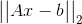

另一种思考方式是，我们对向量`b`最接近`A`的子空间（称为`A`的范围）的地方感兴趣。 这是`b`在`A`上的投影。由于  必须垂直于`A`的子空间，我们可以看到：

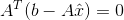

使用了 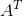 因为要相乘`A`和 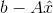 的每列。

这让我们得到正规方程：

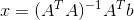

```py
def ls_naive(A, b):
     return np.linalg.inv(A.T @ A) @ A.T @ b

%timeit coeffs_naive = ls_naive(trn_int, y_trn)

# 45.8 µs ± 4.65 µs per loop (mean ± std. dev. of 7 runs, 10000 loops each)

coeffs_naive = ls_naive(trn_int, y_trn)
regr_metrics(y_test, test_int @ coeffs_naive)

# (57.94102134545707, 48.053565198516438)
```

## 正规方程（Cholesky）

正规方程：

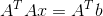

如果`A`具有满秩，则伪逆 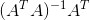 是正方形，埃尔米特正定矩阵。 解决这种系统的标准方法是 Cholesky 分解，它找到上三角形`R`，满足 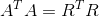。

以下步骤基于 Trefethen 的算法 11.1：

```py
A = trn_int

b = y_trn

AtA = A.T @ A
Atb = A.T @ b
```

警告：对于Cholesky，Numpy 和 Scipy 默认为不同的上/下三角。

```py
R = scipy.linalg.cholesky(AtA)

np.set_printoptions(suppress=True, precision=4)
R

'''
array([[  0.9124,   0.1438,   0.1511,   0.3002,   0.2228,   0.188 ,
         -0.051 ,   0.1746,   0.22  ,   0.2768,  -0.2583],
       [  0.    ,   0.8832,   0.0507,   0.1826,  -0.0251,   0.0928,
         -0.3842,   0.2999,   0.0911,   0.15  ,   0.4393],
       [  0.    ,   0.    ,   0.8672,   0.2845,   0.2096,   0.2153,
         -0.2695,   0.3181,   0.3387,   0.2894,  -0.005 ],
       [  0.    ,   0.    ,   0.    ,   0.7678,   0.0762,  -0.0077,
          0.0383,   0.0014,   0.165 ,   0.166 ,   0.0234],
       [  0.    ,   0.    ,   0.    ,   0.    ,   0.8288,   0.7381,
          0.1145,   0.4067,   0.3494,   0.158 ,  -0.2826],
       [  0.    ,   0.    ,   0.    ,   0.    ,   0.    ,   0.3735,
         -0.3891,   0.2492,  -0.3245,  -0.0323,  -0.1137],
       [  0.    ,   0.    ,   0.    ,   0.    ,   0.    ,   0.    ,
          0.6406,  -0.511 ,  -0.5234,  -0.172 ,  -0.9392],
       [  0.    ,   0.    ,   0.    ,   0.    ,   0.    ,   0.    ,
          0.    ,   0.2887,  -0.0267,  -0.0062,   0.0643],
       [  0.    ,   0.    ,   0.    ,   0.    ,   0.    ,   0.    ,
          0.    ,   0.    ,   0.2823,   0.0636,   0.9355],
       [  0.    ,   0.    ,   0.    ,   0.    ,   0.    ,   0.    ,
          0.    ,   0.    ,   0.    ,   0.7238,   0.0202],
       [  0.    ,   0.    ,   0.    ,   0.    ,   0.    ,   0.    ,
          0.    ,   0.    ,   0.    ,   0.    ,  18.7319]])
'''
```

检查我们的分解：

```py
np.linalg.norm(AtA - R.T @ R)

# 4.5140158187158533e-16
```

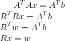

```py
w = scipy.linalg.solve_triangular(R, Atb, lower=False, trans='T')
```

检查我们的结果是否符合预期总是好的：（以防我们输入错误的参数，函数没有返回我们想要的东西，或者有时文档甚至过时）。

```py
np.linalg.norm(R.T @ w - Atb)

# 1.1368683772161603e-13

coeffs_chol = scipy.linalg.solve_triangular(R, w, lower=False)

np.linalg.norm(R @ coeffs_chol - w)

# 6.861429794408013e-14

def ls_chol(A, b):
    R = scipy.linalg.cholesky(A.T @ A)
    w = scipy.linalg.solve_triangular(R, A.T @ b, trans='T')
    return scipy.linalg.solve_triangular(R, w)

%timeit coeffs_chol = ls_chol(trn_int, y_trn)

# 111 µs ± 272 ns per loop (mean ± std. dev. of 7 runs, 10000 loops each)

coeffs_chol = ls_chol(trn_int, y_trn)
regr_metrics(y_test, test_int @ coeffs_chol)

# (57.9410213454571, 48.053565198516438)
```

## QR 分解

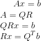

```py
def ls_qr(A,b):
    Q, R = scipy.linalg.qr(A, mode='economic')
    return scipy.linalg.solve_triangular(R, Q.T @ b)

%timeit coeffs_qr = ls_qr(trn_int, y_trn)

# 205 µs ± 264 ns per loop (mean ± std. dev. of 7 runs, 1000 loops each)

coeffs_qr = ls_qr(trn_int, y_trn)
regr_metrics(y_test, test_int @ coeffs_qr)

# (57.94102134545711, 48.053565198516452)
```

### SVD

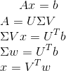

SVD 给出伪逆。

```py
def ls_svd(A,b):
    m, n = A.shape
    U, sigma, Vh = scipy.linalg.svd(A, full_matrices=False)
    w = (U.T @ b)/ sigma
    return Vh.T @ w

%timeit coeffs_svd = ls_svd(trn_int, y_trn)

# 1.11 ms ± 320 ns per loop (mean ± std. dev. of 7 runs, 1000 loops each)

%timeit coeffs_svd = ls_svd(trn_int, y_trn)

# 266 µs ± 8.49 µs per loop (mean ± std. dev. of 7 runs, 1000 loops each)

coeffs_svd = ls_svd(trn_int, y_trn)
regr_metrics(y_test, test_int @ coeffs_svd)

# (57.941021345457244, 48.053565198516687)
```

### 最小二乘回归的随机 Sketching 技巧

[线性 Sketching](http://researcher.watson.ibm.com/researcher/files/us-dpwoodru/journal.pdf)（Woodruff）

+   抽取`r×n`随机矩阵`S`，`r << n`
+   计算`S A`和`S b`
+   找到回归`SA x = Sb`的精确解`x`

### 时间比较

```py
import timeit
import pandas as pd

def scipylstq(A, b):
    return scipy.linalg.lstsq(A,b)[0]

row_names = ['Normal Eqns- Naive',
             'Normal Eqns- Cholesky', 
             'QR Factorization', 
             'SVD', 
             'Scipy lstsq']

name2func = {'Normal Eqns- Naive': 'ls_naive', 
             'Normal Eqns- Cholesky': 'ls_chol', 
             'QR Factorization': 'ls_qr',
             'SVD': 'ls_svd',
             'Scipy lstsq': 'scipylstq'}

m_array = np.array([100, 1000, 10000])
n_array = np.array([20, 100, 1000])

index = pd.MultiIndex.from_product([m_array, n_array], names=['# rows', '# cols'])

pd.options.display.float_format = '{:,.6f}'.format
df = pd.DataFrame(index=row_names, columns=index)
df_error = pd.DataFrame(index=row_names, columns=index)

# %%prun
for m in m_array:
    for n in n_array:
        if m >= n:        
            x = np.random.uniform(-10,10,n)
            A = np.random.uniform(-40,40,[m,n])   # removed np.asfortranarray
            b = np.matmul(A, x) + np.random.normal(0,2,m)
            for name in row_names:
                fcn = name2func[name]
                t = timeit.timeit(fcn + '(A,b)', number=5, globals=globals())
                df.set_value(name, (m,n), t)
                coeffs = locals()[fcn](A, b)
                reg_met = regr_metrics(b, A @ coeffs)
                df_error.set_value(name, (m,n), reg_met[0])

df
```

| # rows | 100 | | | 1000 | | | 10000 | | |
| --- | --- | --- | --- | --- | --- | --- | --- | --- | --- |
| # cols | 20 | 100 | 1000 | 20 | 100 | 1000 | 20 | 100 | 1000 |
| Normal Eqns- Naive | 0.001276 | 0.003634 | NaN | 0.000960 | 0.005172 | 0.293126 | 0.002226 | 0.021248 | 1.164655 |
| Normal Eqns- Cholesky | 0.001660 | 0.003958 | NaN | 0.001665 | 0.004007 | 0.093696 | 0.001928 | 0.010456 | 0.399464 |
| QR Factorization | 0.002174 | 0.006486 | NaN | 0.004235 | 0.017773 | 0.213232 | 0.019229 | 0.116122 | 2.208129 |
| SVD | 0.003880 | 0.021737 | NaN | 0.004672 | 0.026950 | 1.280490 | 0.018138 | 0.130652 | 3.433003 |
| Scipy lstsq | 0.004338 | 0.020198 | NaN | 0.004320 | 0.021199 | 1.083804 | 0.012200 | 0.088467 | 2.134780 |

```py
df_error
```


| # rows | 100 | | | 1000 | | | 10000 | | |
| --- | --- | --- | --- | --- | --- | --- | --- | --- | --- |
| # cols | 20 | 100 | 1000 | 20 | 100 | 1000 | 20 | 100 | 1000 |
| Normal Eqns- Naive | 1.702742 | 0.000000 | NaN | 1.970767 | 1.904873 | 0.000000 | 1.978383 | 1.980449 | 1.884440 |
| Normal Eqns- Cholesky | 1.702742 | 0.000000 | NaN | 1.970767 | 1.904873 | 0.000000 | 1.978383 | 1.980449 | 1.884440 |
| QR Factorization | 1.702742 | 0.000000 | NaN | 1.970767 | 1.904873 | 0.000000 | 1.978383 | 1.980449 | 1.884440 |
| SVD | 1.702742 | 0.000000 | NaN | 1.970767 | 1.904873 | 0.000000 | 1.978383 | 1.980449 | 1.884440 |
| Scipy lstsq | 1.702742 | 0.000000 | NaN | 1.970767 | 1.904873 | 0.000000 | 1.978383 | 1.980449 | 1.884440 |

```py
store = pd.HDFStore('least_squares_results.h5')
store['df'] = df

'''
C:\Users\rache\Anaconda3\lib\site-packages\IPython\core\interactiveshell.py:2881: PerformanceWarning: 
your performance may suffer as PyTables will pickle object types that it cannot
map directly to c-types [inferred_type->floating,key->block0_values] [items->[(100, 20), (100, 100), (100, 1000), (1000, 20), (1000, 100), (1000, 1000), (5000, 20), (5000, 100), (5000, 1000)]]

  exec(code_obj, self.user_global_ns, self.user_ns)
'''
```

### 注解

我用魔术指令`%prun`来测量我的代码。

替代方案：最小绝对偏差（L1 回归）

+   异常值的敏感度低于最小二乘法。
+   没有闭式解，但可以通过线性规划解决。

### 条件作用和稳定性

### 条件数

条件数是一个指标，衡量输入的小变化导致输出变化的程度。

问题：为什么我们在数值线性代数中，关心输入的小变化的相关行为？

相对条件数由下式定义：

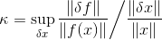

其中  是无穷小。

根据 Trefethen（第 91 页），如果`κ`很小（例如 `1, 10, 10^2`），问题是良态的，如果`κ`很大（例如`10^6, 10^16`），那么问题是病态的。

条件作用：数学问题的扰动行为（例如最小二乘）

稳定性：用于在计算机上解决该问题的算法的扰动行为（例如，最小二乘算法，householder，回代，高斯消除）

### 条件作用的例子

计算非对称矩阵的特征值的问题通常是病态的。

```py
A = [[1, 1000], [0, 1]]
B = [[1, 1000], [0.001, 1]]

wA, vrA = scipy.linalg.eig(A)
wB, vrB = scipy.linalg.eig(B)

wA, wB

'''
(array([ 1.+0.j,  1.+0.j]),
 array([  2.00000000e+00+0.j,  -2.22044605e-16+0.j]))
'''
```

### 矩阵的条件数

乘积 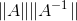 经常出现，它有自己的名字：`A`的条件数。注意，通常我们谈论问题的条件作用，而不是矩阵。

`A`的条件数涉及：

+   给定`Ax = b`中的`A`和`x`，计算`b`
+   给定`Ax = b`中的`A`和`b`，计算`x`

### 未交待清楚的事情

### 完整和简化分解

### SVD

来自 Trefethen 的图：


### 对于所有矩阵，QR 分解都存在

与 SVD 一样，有 QR 分解的完整版和简化版。


### 矩阵的逆是不稳定的

```py
from scipy.linalg import hilbert

n = 5
hilbert(n)

'''
array([[ 1.    ,  0.5   ,  0.3333,  0.25  ,  0.2   ],
       [ 0.5   ,  0.3333,  0.25  ,  0.2   ,  0.1667],
       [ 0.3333,  0.25  ,  0.2   ,  0.1667,  0.1429],
       [ 0.25  ,  0.2   ,  0.1667,  0.1429,  0.125 ],
       [ 0.2   ,  0.1667,  0.1429,  0.125 ,  0.1111]])
'''

n = 14
A = hilbert(n)
x = np.random.uniform(-10,10,n)
b = A @ x

A_inv = np.linalg.inv(A)

np.linalg.norm(np.eye(n) - A @ A_inv)

# 5.0516495470543212

np.linalg.cond(A)

# 2.2271635826494112e+17

A @ A_inv

'''
array([[ 1.    ,  0.    , -0.0001,  0.0005, -0.0006,  0.0105, -0.0243,
         0.1862, -0.6351,  2.2005, -0.8729,  0.8925, -0.0032, -0.0106],
       [ 0.    ,  1.    , -0.    ,  0.    ,  0.0035,  0.0097, -0.0408,
         0.0773, -0.0524,  1.6926, -0.7776, -0.111 , -0.0403, -0.0184],
       [ 0.    ,  0.    ,  1.    ,  0.0002,  0.0017,  0.0127, -0.0273,
         0.    ,  0.    ,  1.4688, -0.5312,  0.2812,  0.0117,  0.0264],
       [ 0.    ,  0.    , -0.    ,  1.0005,  0.0013,  0.0098, -0.0225,
         0.1555, -0.0168,  1.1571, -0.9656, -0.0391,  0.018 , -0.0259],
       [-0.    ,  0.    , -0.    ,  0.0007,  1.0001,  0.0154,  0.011 ,
        -0.2319,  0.5651, -0.2017,  0.2933, -0.6565,  0.2835, -0.0482],
       [ 0.    , -0.    ,  0.    , -0.0004,  0.0059,  0.9945, -0.0078,
        -0.0018, -0.0066,  1.1839, -0.9919,  0.2144, -0.1866,  0.0187],
       [-0.    ,  0.    , -0.    ,  0.0009, -0.002 ,  0.0266,  0.974 ,
        -0.146 ,  0.1883, -0.2966,  0.4267, -0.8857,  0.2265, -0.0453],
       [ 0.    ,  0.    , -0.    ,  0.0002,  0.0009,  0.0197, -0.0435,
         1.1372, -0.0692,  0.7691, -1.233 ,  0.1159, -0.1766, -0.0033],
       [ 0.    ,  0.    , -0.    ,  0.0002,  0.    , -0.0018, -0.0136,
         0.1332,  0.945 ,  0.3652, -0.2478, -0.1682,  0.0756, -0.0212],
       [ 0.    , -0.    , -0.    ,  0.0003,  0.0038, -0.0007,  0.0318,
        -0.0738,  0.2245,  1.2023, -0.2623, -0.2783,  0.0486, -0.0093],
       [-0.    ,  0.    , -0.    ,  0.0004, -0.0006,  0.013 , -0.0415,
         0.0292, -0.0371,  0.169 ,  1.0715, -0.09  ,  0.1668, -0.0197],
       [ 0.    , -0.    ,  0.    ,  0.    ,  0.0016,  0.0062, -0.0504,
         0.1476, -0.2341,  0.8454, -0.7907,  1.4812, -0.15  ,  0.0186],
       [ 0.    , -0.    ,  0.    , -0.0001,  0.0022,  0.0034, -0.0296,
         0.0944, -0.1833,  0.6901, -0.6526,  0.2556,  0.8563,  0.0128],
       [ 0.    ,  0.    ,  0.    , -0.0001,  0.0018, -0.0041, -0.0057,
        -0.0374, -0.165 ,  0.3968, -0.2264, -0.1538, -0.0076,  1.005 ]])
'''

row_names = ['Normal Eqns- Naive',
             'QR Factorization', 
             'SVD', 
             'Scipy lstsq']

name2func = {'Normal Eqns- Naive': 'ls_naive', 
             'QR Factorization': 'ls_qr',
             'SVD': 'ls_svd',
             'Scipy lstsq': 'scipylstq'}

pd.options.display.float_format = '{:,.9f}'.format
df = pd.DataFrame(index=row_names, columns=['Time', 'Error'])

for name in row_names:
    fcn = name2func[name]
    t = timeit.timeit(fcn + '(A,b)', number=5, globals=globals())
    coeffs = locals()[fcn](A, b)
    df.set_value(name, 'Time', t)
    df.set_value(name, 'Error', regr_metrics(b, A @ coeffs)[0])
```

### SVD 在这里最好

不要重新运行。

```py
df
```


| | Time | Error |
| --- | --- | --- |
| Normal Eqns- Naive | 0.001334339 | 3.598901966 |
| QR Factorization | 0.002166139 | 0.000000000 |
| SVD | 0.001556937 | 0.000000000 |
| Scipy lstsq | 0.001871590 | 0.000000000 |

即使`A`是稀疏的，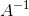 通常是密集的。对于大型矩阵， 放不进内存。

## 运行时间

+   矩阵求逆：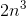
+   矩阵乘法：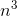
+   Cholesky：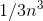
+   QR，Gram Schmidt：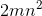，（Trefethen 第 8 章）
+   QR，Householder：2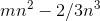（Trefethen 第 10 章）
+   求解三角形系统：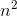

为什么 Cholesky 较快：


> 来源：[斯坦福凸优化：数值线性代数背景幻灯片](http://stanford.edu/class/ee364a/lectures/num-lin-alg.pdf)

### QR 最优的一个案例

```py
m=100
n=15
t=np.linspace(0, 1, m)

# 范德蒙矩阵
A=np.stack([t**i for i in range(n)], 1)
b=np.exp(np.sin(4*t))

# 这将使解决方案标准化为 1
b /= 2006.787453080206

from matplotlib import pyplot as plt
%matplotlib inline

plt.plot(t, b)

# [<matplotlib.lines.Line2D at 0x7fdfc1fa7eb8>]
```

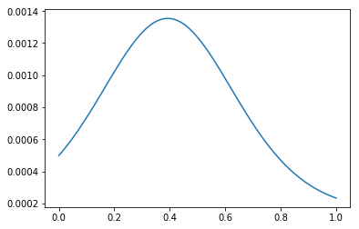

检查我们得到了 1：

```py
1 - ls_qr(A, b)[14]

# 1.4137685733217609e-07
```

不好的条件数：

```py
kappa = np.linalg.cond(A); kappa

# 5.827807196683593e+17

row_names = ['Normal Eqns- Naive',
             'QR Factorization', 
             'SVD', 
             'Scipy lstsq']

name2func = {'Normal Eqns- Naive': 'ls_naive', 
             'QR Factorization': 'ls_qr',
             'SVD': 'ls_svd',
             'Scipy lstsq': 'scipylstq'}

pd.options.display.float_format = '{:,.9f}'.format
df = pd.DataFrame(index=row_names, columns=['Time', 'Error'])

for name in row_names:
    fcn = name2func[name]
    t = timeit.timeit(fcn + '(A,b)', number=5, globals=globals())
    coeffs = locals()[fcn](A, b)
    df.set_value(name, 'Time', t)
    df.set_value(name, 'Error', np.abs(1 - coeffs[-1]))

df
```


| | Time | Error |
| --- | --- | --- |
| Normal Eqns- Naive | 0.001565099 | 1.357066025 |
| QR Factorization | 0.002632104 | 0.000000116 |
| SVD | 0.003503785 | 0.000000116 |
| Scipy lstsq | 0.002763502 | 0.000000116 |

通过正规方程求解最小二乘的解决方案通常是不稳定的，尽管对于小条件数的问题是稳定的。

### 低秩

```py
m = 100
n = 10
x = np.random.uniform(-10,10,n)
A2 = np.random.uniform(-40,40, [m, int(n/2)])   # removed np.asfortranarray
A = np.hstack([A2, A2])

A.shape, A2.shape

# ((100, 10), (100, 5))

b = A @ x + np.random.normal(0,1,m)

row_names = ['Normal Eqns- Naive',
             'QR Factorization', 
             'SVD', 
             'Scipy lstsq']

name2func = {'Normal Eqns- Naive': 'ls_naive', 
             'QR Factorization': 'ls_qr',
             'SVD': 'ls_svd',
             'Scipy lstsq': 'scipylstq'}

pd.options.display.float_format = '{:,.9f}'.format
df = pd.DataFrame(index=row_names, columns=['Time', 'Error'])

for name in row_names:
    fcn = name2func[name]
    t = timeit.timeit(fcn + '(A,b)', number=5, globals=globals())
    coeffs = locals()[fcn](A, b)
    df.set_value(name, 'Time', t)
    df.set_value(name, 'Error', regr_metrics(b, A @ coeffs)[0])

df
```

|  | Time | Error |
| --- | --- | --- |
| Normal Eqns- Naive | 0.001227640 | 300.658979382 |
| QR Factorization | 0.002315920 | 0.876019803 |
| SVD | 0.001745647 | 1.584746056 |
| Scipy lstsq | 0.002067989 | 0.804750398 |

## 比较

比较我们的结果和上面：

```py
df
```

| # rows | 100 | | | 1000 | | | 10000 | | |
| --- | --- | --- | --- | --- | --- | --- | --- | --- | --- |
| # cols | 20 | 100 | 1000 | 20 | 100 | 1000 | 20 | 100 | 1000 |
| Normal Eqns- Naive | 0.001276 | 0.003634 | NaN | 0.000960 | 0.005172 | 0.293126 | 0.002226 | 0.021248 | 1.164655 |
| Normal Eqns- Cholesky | 0.001660 | 0.003958 | NaN | 0.001665 | 0.004007 | 0.093696 | 0.001928 | 0.010456 | 0.399464 |
| QR Factorization | 0.002174 | 0.006486 | NaN | 0.004235 | 0.017773 | 0.213232 | 0.019229 | 0.116122 | 2.208129 |
| SVD | 0.003880 | 0.021737 | NaN | 0.004672 | 0.026950 | 1.280490 | 0.018138 | 0.130652 | 3.433003 |
| Scipy lstsq | 0.004338 | 0.020198 | NaN | 0.004320 | 0.021199 | 1.083804 | 0.012200 | 0.088467 | 2.134780 |

来自 Trefethen（第 84 页）：

正规方程式/ Cholesky 在生效时速度最快。 Cholesky 只能用于对称正定矩阵。 此外，对于具有高条件数或具有低秩的矩阵，正规方程/ Cholesky 是不稳定的。

数值分析师推荐通过 QR 进行线性回归，作为多年的标准方法。 它自然，优雅，适合“日常使用”。
