# 九、PageRank 和特征值分解

## 两个方便的技巧

以下是我们今天将使用的两个工具，它们通常很有用。

1）[Psutil](https://github.com/giampaolo/psutil) 是检查内存使用情况的好方法。 这在这里很有用，因为我们使用更大的数据集。

```py
import psutil

process = psutil.Process(os.getpid())
t = process.memory_info()

t.vms, t.rss

# (19475513344, 17856520192)

def mem_usage():
    process = psutil.Process(os.getpid())
    return process.memory_info().rss / psutil.virtual_memory().total

mem_usage()

# 0.13217061955758594
```

2）[TQDM](https://github.com/tqdm/tqdm) 提供了进度条。

```py
from time import sleep

# 不使用 TQDM
s = 0
for i in range(10):
    s += i
    sleep(0.2)
print(s)

# 45

# 使用 TQDM
from tqdm import tqdm

s = 0
for i in tqdm(range(10)):
    s += i
    sleep(0.2)
print(s)

'''
100%|██████████| 10/10 [00:02<00:00,  4.96it/s]
45
'''
```

## 动机

### 回顾

+   什么是S VD？
+   SVD 有哪些应用？

### 额外的 SVD 应用

我最近遇到的一个有趣的 SVD 用法是为 Word2Vec 词嵌入消除偏见，来自[词嵌入中的量化和减少刻板印象](https://arxiv.org/pdf/1606.06121.pdf)（Bolukbasi 等）。

Word2Vec 是 Google 发布的一个有用的库，它将单词表示为向量。 向量的相似性捕获了语义，并且可以找到类比，例如巴黎：法国::东京：日本。


> 来源：[词的向量表示](https://www.tensorflow.org/versions/r0.10/tutorials/word2vec/)

然而，这些嵌入可能隐式编码偏见，例如父亲：医生::母亲：护士，和男人：计算机程序员::女人：家庭主妇。

一种为空间消除偏见的方法涉及使用 SVD 来降低维数（[Bolukbasi 论文](https://arxiv.org/pdf/1606.06121.pdf)）。

你可以在词嵌入中阅读关于偏见的更多信息：

+   [向量空间数学如何揭示隐藏在语言中的性别歧视](https://www.technologyreview.com/s/602025/how-vector-space-mathematics-reveals-the-hidden-sexism-in-language/)（麻省理工学院技术评论）
+   ConceptNet：更好，更少刻板印象的词向量
+   [从语料库中自动导出的语义必然包含人类偏见](https://www.princeton.edu/~aylinc/papers/caliskan-islam_semantics.pdf)（优秀且非常有趣的论文！）

### 考虑 SVD 的方法

+   数据压缩
+   SVD 使用更小更好的特征替换大量特征
+   所有矩阵都是对角的（如果你使用基于域和范围的更改）

### SVD 的视角

我们通常从矩阵的角度谈论SVD，

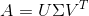

但我们也可以用向量来思考它。 SVD 为我们提供了一组正交向量 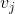 和 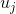。

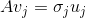

 是标量，称为奇异值。

问题：这个让你想起了什么？

### 答案

SVD 与特征分解之间的关系：`A`的左奇异向量是 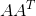 的特征向量。`A`的右奇异向量是 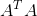 的特征向量。 `A`的非零奇异值是 （和 ）的特征值的平方根。

SVD 是特征值分解的推广。 并非所有矩阵都具有特征值，但所有矩阵都具有奇异值。

让我们忘记 SVD，并讨论如何找到对称正定矩阵的特征值......

### SVD 的扩展资源

+   [SVD：图像压缩和最小二乘法](http://andrew.gibiansky.com/blog/mathematics/cool-linear-algebra-singular-value-decomposition/)

+   [使用 SVD 的图像压缩](http://nbviewer.jupyter.org/gist/frankcleary/4d2bd178708503b556b0)

+   [非凡的 SVD](https://sites.math.washington.edu/~morrow/498_13/svd_applied.pdf)

+   [奇异值分解：矩阵的 SVD](https://sites.math.washington.edu/~morrow/498_13/svd.pdf)

## 特征值分解

用于计算 SVD 的最佳经典方法，是用于计算特征值的方法的变体。 除了它们与 SVD 的链接之外，特征值分解也是有用的。 以下是特征值分解的一些实际应用：

+   [快速矩阵求幂](http://www.onmyphd.com/?p=eigen.decomposition#h2_why)
+   [第 n 个斐波纳契数](http://mathproofs.blogspot.com/2005/04/nth-term-of-fibonacci-sequence.html)
+   ODE 的行为
+   马尔科夫链（医疗保健经济学，PageRank）
+   [Iris 数据集的线性判别分析](http://sebastianraschka.com/Articles/2014_python_lda.html)

查看 3 Blue 1 Brown 视频：[基变换](https://www.youtube.com/watch?v=P2LTAUO1TdA)和[特征值和特征向量](https://www.youtube.com/watch?v=PFDu9oVAE-g)。

“特征值是一种了解矩阵核心的方式......矩阵的所有困难都被扫除了”--Strang

术语：埃尔米特矩阵是共轭转置等于自己的矩阵。 在实值矩阵的情况下（这是我们在本课程中考虑的所有矩阵），埃尔米特的意思与对称相同。

相关定理：

+   如果`A`是对称的，则A的特征值是实数并且 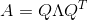
+   如果`A`是三角，则其特征值等于其对角线元素

## DBpedia 数据集

让我们从幂方法开始，它找到一个特征向量。只是一个特征向量有什么用？ 你可能想知道。 这实际上是 PageRank 的基础（阅读[价值 25,000,000,000 美元的Eigenvector：Google 背后的线性代数](http://www.rose-hulman.edu/~bryan/googleFinalVersionFixed.pdf)来了解更多信息）

我们将使用来自 [DBpedia](http://wiki.dbpedia.org/) 的维基百科链接数据集，而不是试图排名互联网上所有网站的重要性。 DBpedia 提供 125 种语言的结构化维基百科数据。

“完整的 DBpedia 数据集包含用于 125 种不同语言的 3800 万个标签和摘要，2520 万个图像链接和 2980 万个外部网页的链接；8090 万个维基百科类别的链接，4120 万个 [YAGO](http://www.mpi-inf.mpg.de/departments/databases-and-information-systems/research/yago-naga/yago/) 类别的链接” - [关于 DBpedia](http://wiki.dbpedia.org/about)

今天的课程灵感来自这个 [SciKit 学习示例](http://scikit-learn.org/stable/auto_examples/applications/wikipedia_principal_eigenvector.html#sphx-glr-auto-examples-applications-wikipedia-principal-eigenvector-py)。

### 导入

```py
import os, numpy as np, pickle
from bz2 import BZ2File
from datetime import datetime
from pprint import pprint
from time import time
from tqdm import tqdm_notebook
from scipy import sparse

from sklearn.decomposition import randomized_svd
from sklearn.externals.joblib import Memory
from urllib.request import urlopen
```

### 下载数据

我们拥有的数据是：

+   重定向：重定向到其他 URL 的 URL
+   链接：哪些页面链接到哪些其他页面

注意：这需要一段时间。

```py
PATH = 'data/dbpedia/'
URL_BASE = 'http://downloads.dbpedia.org/3.5.1/en/'
filenames = ["redirects_en.nt.bz2", "page_links_en.nt.bz2"]

for filename in filenames:
    if not os.path.exists(PATH+filename):
        print("Downloading '%s', please wait..." % filename)
        open(PATH+filename, 'wb').write(urlopen(URL_BASE+filename).read())

redirects_filename = PATH+filenames[0]
page_links_filename = PATH+filenames[1]
```

### 图的邻接矩阵

我们将构造一个图的邻接矩阵，表示哪个页面指向哪个页面。


> 来源：[PageRank 和 HyperLink 生成的主题搜索](https://www.slideshare.net/priyabrata232/page-rank-and-hyperlink)


幂 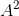 将为你提供，通过两步从一个页面到另一个页面有多少种方式。 你可以在[这些笔记](http://www.utdallas.edu/~jwz120030/Teaching/PastCoursesUMBC/M221HS06/ProjectFiles/Adjacency.pdf)中看到更详细的示例，如适用于航空旅行。

我们希望跟踪哪些页面指向哪些页面。 我们将它存储在一个方形矩阵中，位置`(r, c)`为 1，表示行`r`中的主题指向列`c`中的主题

你可以在[此处](http://www.geeksforgeeks.org/graph-and-its-representations/)更加了解图。

### 数据格式

文件中的一样看起来：

```
<http://dbpedia.org/resource/AfghanistanHistory> <http://dbpedia.org/property/redirect> <http://dbpedia.org/resource/History_of_Afghanistan> .
```

在下面的切片中，`+1, -1`来删除`<>`。

```py
DBPEDIA_RESOURCE_PREFIX_LEN = len("http://dbpedia.org/resource/")
SLICE = slice(DBPEDIA_RESOURCE_PREFIX_LEN + 1, -1)

def get_lines(filename): return (line.split() for line in BZ2File(filename))
```

遍历重定向并创建来源到目的地的字典。

```py
def get_redirect(targ, redirects):
    seen = set()
    while True:
        transitive_targ = targ
        targ = redirects.get(targ)
        if targ is None or targ in seen: break
        seen.add(targ)
    return transitive_targ

def get_redirects(redirects_filename):
    redirects={}
    lines = get_lines(redirects_filename)
    return {src[SLICE]:get_redirect(targ[SLICE], redirects) 
                for src,_,targ,_ in tqdm_notebook(lines, leave=False)}

redirects = get_redirects(redirects_filename)

mem_usage()

# 13.766303744

def add_item(lst, redirects, index_map, item):
    k = item[SLICE]
    lst.append(index_map.setdefault(redirects.get(k, k), len(index_map)))

limit=119077682 #5000000

# 计算整数索引映射
index_map = dict() # links->IDs
lines = get_lines(page_links_filename)
source, destination, data = [],[],[]
for l, split in tqdm_notebook(enumerate(lines), total=limit):
    if l >= limit: break
    add_item(source, redirects, index_map, split[0])
    add_item(destination, redirects, index_map, split[2])
    data.append(1)

n=len(data); n

# 119077682
```

### 查看我们的数据

以下步骤仅用于说明我们的数据中的信息及其结构。他们效率不高。

让我们看看`index_map`中的项目类型：


```py
index_map.popitem()

# (b'1940_Cincinnati_Reds_Team_Issue', 9991173)
```

让我们看一下索引映射中的一个项目：

`1940_Cincinnati_Reds_Team_Issue`具有索引`9991173.`，这仅在目标列表中显示一次：

```py
[i for i,x in enumerate(source) if x == 9991173]

# [119077649]

source[119077649], destination[119077649]

# (9991173, 9991050)
```

现在，我们要检查哪个页面是源（具有索引 9991050）。 注意：通常你不应通过搜索其值来访问字典。 这是低效的，不是使用字典的方式。


```py
for page_name, index in index_map.items():
    if index == 9991050:
        print(page_name)

# b'W711-2'
```

我们可以在维基百科上看到辛辛那提红队问题重定向到 W711-2：


```py
test_inds = [i for i,x in enumerate(source) if x == 9991050]

len(test_inds)

# 47

test_inds[:5]

# [119076756, 119076757, 119076758, 119076759, 119076760]

test_dests = [destination[i] for i in test_inds]
```

现在，我们要检查哪个页面是源（具有索引 9991174）：

```py
for page_name, index in index_map.items():
    if index in test_dests:
        print(page_name)

'''
b'Baseball'
b'Ohio'
b'Cincinnati'
b'Flash_Thompson'
b'1940'
b'1938'
b'Lonny_Frey'
b'Cincinnati_Reds'
b'Ernie_Lombardi'
b'Baseball_card'
b'James_Wilson'
b'Trading_card'
b'Detroit_Tigers'
b'Baseball_culture'
b'Frank_McCormick'
b'Bucky_Walters'
b'1940_World_Series'
b'Billy_Werber'
b'Ival_Goodman'
b'Harry_Craft'
b'Paul_Derringer'
b'Johnny_Vander_Meer'
b'Cigarette_card'
b'Eddie_Joost'
b'Myron_McCormick'
b'Beckett_Media'
b'Icarus_affair'
b'Ephemera'
b'Sports_card'
b'James_Turner'
b'Jimmy_Ripple'
b'Lewis_Riggs'
b'The_American_Card_Catalog'
b'Rookie_card'
b'Willard_Hershberger'
b'Elmer_Riddle'
b'Joseph_Beggs'
b'Witt_Guise'
b'Milburn_Shoffner'
'''
```

我们可以看到列表中的项目出现在维基百科页面中：


### 创建矩阵

下面我们使用 Scipy 的 COO 格式创建一个稀疏矩阵，并将其转换为 CSR。

问题：COO 和 CSR 是什么？ 为什么我们要用 COO 创建它然后马上转换它？

```py
X = sparse.coo_matrix((data, (destination,source)), shape=(n,n), dtype=np.float32)
X = X.tocsr()

del(data,destination, source)

X

'''
<119077682x119077682 sparse matrix of type '<class 'numpy.float32'>'
    with 93985520 stored elements in Compressed Sparse Row format>
'''

names = {i: name for name, i in index_map.items()}

mem_usage()

# 12.903882752
```

### 保存矩阵以便不会重复计算

```py
pickle.dump(X, open(PATH+'X.pkl', 'wb'))
pickle.dump(index_map, open(PATH+'index_map.pkl', 'wb'))

X = pickle.load(open(PATH+'X.pkl', 'rb'))
index_map = pickle.load(open(PATH+'index_map.pkl', 'rb'))

names = {i: name for name, i in index_map.items()}

X

'''
<119077682x119077682 sparse matrix of type '<class 'numpy.float32'>'
    with 93985520 stored elements in Compressed Sparse Row format>
'''
```

## 幂方法

### 动机

如果`n×n`矩阵`A`具有`n`个线性独立的特征向量 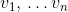，则它是可对角化的。

那么对于一些标量 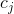，任何`w`都可以表示为 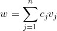。

练习：证明：

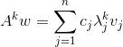

问题：对于较大的`k`，表现如何？

这是幂方法的灵感来源。

### 代码

```py
def show_ex(v):
    print(', '.join(names[i].decode() for i in np.abs(v.squeeze()).argsort()[-1:-10:-1]))

?np.squeeze
```

如何规范化稀疏矩阵：

```py
S = sparse.csr_matrix(np.array([[1,2],[3,4]]))
Sr = S.sum(axis=0).A1; Sr

# array([4, 6], dtype=int64)
```

[`numpy.matrix.A1`](https://docs.scipy.org/doc/numpy/reference/generated/numpy.matrix.A1.html#numpy.matrix.A1)。

```py
S.indices

# array([0, 1, 0, 1], dtype=int32)

S.data

# array([1, 2, 3, 4], dtype=int64)

S.data / np.take(Sr, S.indices)

# array([ 0.25   ,  0.33333,  0.75   ,  0.66667])

def power_method(A, max_iter=100):
    n = A.shape[1]
    A = np.copy(A)
    A.data /= np.take(A.sum(axis=0).A1, A.indices)

    scores = np.ones(n, dtype=np.float32) * np.sqrt(A.sum()/(n*n)) # initial guess
    for i in range(max_iter):
        scores = A @ scores
        nrm = np.linalg.norm(scores)
        scores /= nrm
        print(nrm)

    return scores
```

问题：为什么要对每次迭代的得分标准化？

```py
scores = power_method(X, max_iter=10)

'''
0.621209
0.856139
1.02793
1.02029
1.02645
1.02504
1.02364
1.02126
1.019
1.01679
'''

show_ex(scores)

'''
Living_people, Year_of_birth_missing_%28living_people%29, United_States, United_Kingdom, Race_and_ethnicity_in_the_United_States_Census, France, Year_of_birth_missing, World_War_II, Germany
'''

mem_usage()

# 11.692331008
```

### 评论

在实践中使用的许多高级特征值算法是幂方法的变体。

在第 3 课：背景消除中，我们使用了 Facebook 的[快速随机 pca/svd 库 fbpca](https://github.com/facebook/fbpca)。 查看我们使用的 pca 方法的[源代码](https://github.com/facebook/fbpca/blob/master/fbpca.py#L1549)。 它使用的是幂方法！

### 深入研究

查看 [Google 网页排名，幂迭代和 Google Matrix 的第二个特征值](http://rstudio-pubs-static.s3.amazonaws.com/239261_8a607707294341c4b7e26acf728c28bd.html)，观看它收敛过程中的分布的动画。

幂方法的收敛速度是最大特征值与第二大特征值的比率。 它可以通过添加移位来加速。 为了找到除最大值之外的特征值，可以使用称为 deflation 的方法。 详细信息，请参阅 Greenbaum 和 Chartier 的第 12.1 章。

Krylov 子空间：在幂迭代中，注意我们每次乘以矩阵`A`，有效地计算

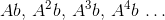

将这些向量作为列的矩阵称为 Krylov 矩阵，由这些向量跨越的空间是 Krylov 子空间。请记住这些内容以便之后使用。

### 与 SVD 比较

```py
%time U, s, V = randomized_svd(X, 3, n_iter=3)

'''
CPU times: user 8min 40s, sys: 1min 20s, total: 10min 1s
Wall time: 5min 56s
'''

mem_usage()

# 28.353073152

# 根据主要奇异向量的顶级维基百科页面
show_ex(U.T[0])

# List_of_World_War_II_air_aces, List_of_animated_feature-length_films, List_of_animated_feature_films:2000s, International_Swimming_Hall_of_Fame, List_of_museum_ships, List_of_linguists, List_of_television_programs_by_episode_count, List_of_game_show_hosts, List_of_astronomers

show_ex(U.T[1])

# List_of_former_United_States_senators, List_of_United_States_Representatives_from_New_York, List_of_United_States_Representatives_from_Pennsylvania, Members_of_the_110th_United_States_Congress, List_of_Justices_of_the_Ohio_Supreme_Court, Congressional_endorsements_for_the_2008_United_States_presidential_election, List_of_United_States_Representatives_in_the_110th_Congress_by_seniority, List_of_Members_of_the_United_States_House_of_Representatives_in_the_103rd_Congress_by_seniority, List_of_United_States_Representatives_in_the_111th_Congress_by_seniority

show_ex(V[0])

# United_States, Japan, United_Kingdom, Germany, Race_and_ethnicity_in_the_United_States_Census, France, United_States_Army_Air_Forces, Australia, Canada

show_ex(V[1])

# Democratic_Party_%28United_States%29, Republican_Party_%28United_States%29, Democratic-Republican_Party, United_States, Whig_Party_%28United_States%29, Federalist_Party, National_Republican_Party, Catholic_Church, Jacksonian_democracy
```

练习：以各种方式规范化数据。 不要覆盖邻接矩阵，而是创建一个新矩阵。 了解你的结果有何不同。

特征值分解与 SVD：

+   SVD 涉及 2 个基，特征分解涉及 1 个基
+   SVD 基是正交的，特征基通常不是正交的
+   所有矩阵都有 SVD，并非所有矩阵（甚至不是所有的矩阵）都有一个特征值分解。

## QR 算法

我们使用幂方法，找到对应维基百科链接矩阵的最大特征值的特征向量。 这个特征向量给了我们每个维基百科页面的相对重要性（就像简化的 PageRank）。

接下来，让我们看一个方法，查找对称正定矩阵的所有特征值。 该方法包括数值线性代数中的 2 种基本算法，并且是许多更复杂方法的基础。

[Google Matrix 的第二个特征值](https://nlp.stanford.edu/pubs/secondeigenvalue.pdf)：具有“implications for the convergence rate of the standard PageRank algorithm as the web scales, for the stability of PageRank to perturbations to the link structure of the web, for the detection of Google spammers, and for the design of algorithms to speed up PageRank”。

### 避免混淆：QR 算法和 QR 分解

QR 算法使用称为 QR 分解的东西。 两者都很重要，所以不要混淆他们。 QR 分解将矩阵`A = QR`分解为一组正交列`Q`和三角矩阵`R`。我们将在未来的课程中查看几种计算 QR 分解的方法。 现在，只要知道它给了我们一个正交矩阵和一个三角矩阵。

### 线性代数

如果存在非奇异矩阵`X`：

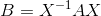

则两个矩阵`A`和`B`是相似的。

观看这个：[基变换](https://www.youtube.com/watch?v=P2LTAUO1TdA&index=13&list=PLZHQObOWTQDPD3MizzM2xVFitgF8hE_ab)

定理：如果`X`是非奇异的，那么`A`和 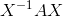 具有相同的特征值。

### 更多线性代数

矩阵`A`的 Schur 分解是一个分解：

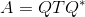

其中`Q`是酉矩阵，`T`是上三角。

问题：你对`A`的特征值有什么看法？

定理：每个方阵具有 Schur 分解。

### 其他资源

回顾：[线性组合，跨度和基向量](https://www.youtube.com/watch?v=k7RM-ot2NWY&index=3&list=PLZHQObOWTQDPD3MizzM2xVFitgF8hE_ab)。

上述定理的证明（以及更多！）请参阅第 24 讲。

### 算法

QR 算法的最基本版本：

```
for k=1,2,...
    Q, R = A
    A = R @ Q
```

在适当的假设下，该算法收敛于`A`的 Schur 形式！

### 工作原理

再写一次，只有下标：


对于 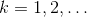

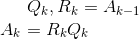

我们可以将其视为构建 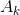，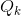 和 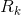 的序列。

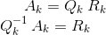

所以：

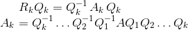

Trefethen 在第 216-217 页证明了以下内容：

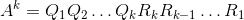

要点：QR 算法为连续的幂构造  的正交基。 记住`A`的幂与特征值分解之间的密切关系。

要了解更多信息，请阅读瑞利熵。

### 纯 QR

```py
n = 6
A = np.random.rand(n,n)
AT = A @ A.T

def pure_qr(A, max_iter=1000):
    Ak = np.copy(A)
    n = A.shape[0]
    QQ = np.eye(n)
    for k in range(max_iter):
        Q, R = np.linalg.qr(Ak)
        Ak = R @ Q
        QQ = QQ @ Q
        if k % 100 == 0:
            print(Ak)
            print("\n")
    return Ak, QQ

A

'''
array([[ 0.62878,  0.23258,  0.63909,  0.90223,  0.94772,  0.80247],
       [ 0.64361,  0.52469,  0.92231,  0.32869,  0.58532,  0.75104],
       [ 0.44363,  0.00427,  0.62418,  0.47093,  0.6762 ,  0.28078],
       [ 0.14629,  0.76324,  0.23316,  0.55208,  0.21712,  0.20255],
       [ 0.56122,  0.08282,  0.12788,  0.10419,  0.40358,  0.69272],
       [ 0.41172,  0.06411,  0.92162,  0.53139,  0.27901,  0.61592]])
'''

Ak, Q = pure_qr(A)

'''
[[ 2.65646  0.21386  0.16765  0.75256  0.61251  0.93518]
 [ 0.52744  0.47579  0.17052 -0.41086 -0.21182 -0.01876]
 [ 0.29923  0.06964  0.11173  0.1879  -0.29101  0.60032]
 [ 0.2274   0.46162 -0.26654  0.08899  0.24631  0.26447]
 [-0.06093  0.02892  0.34162  0.07533  0.02393 -0.05456]
 [-0.06025  0.02694 -0.11675 -0.00927 -0.11939 -0.00767]]


[[ 2.78023  0.52642  0.0395  -0.11135  0.1569   1.15184]
 [ 0.       0.18624 -0.297   -0.07256 -0.04537  0.27907]
 [ 0.       0.69328  0.34105 -0.12198  0.11029  0.0992 ]
 [-0.      -0.0494  -0.02057  0.09461  0.59466  0.09115]
 [-0.       0.00008 -0.02659 -0.40372  0.06542  0.38612]
 [-0.       0.       0.       0.      -0.      -0.11832]]


[[ 2.78023 -0.12185 -0.51401  0.17625 -0.07467  1.15184]
 [ 0.       0.2117  -0.70351  0.09974 -0.02986  0.00172]
 [ 0.       0.28284  0.32635 -0.0847  -0.08488 -0.29104]
 [-0.      -0.00068 -0.00088 -0.01282  0.54836  0.13447]
 [-0.       0.      -0.00102 -0.45718  0.16208 -0.37726]
 [-0.       0.       0.       0.      -0.      -0.11832]]


[[ 2.78023 -0.33997  0.4049   0.17949  0.06291  1.15184]
 [ 0.       0.48719 -0.48788 -0.05831 -0.12286 -0.23486]
 [ 0.       0.49874  0.05104 -0.07191  0.03638  0.17261]
 [ 0.       0.00002  0.       0.02128  0.41958  0.3531 ]
 [ 0.      -0.       0.00002 -0.58571  0.1278  -0.18838]
 [ 0.       0.       0.      -0.       0.      -0.11832]]


[[ 2.78023  0.35761  0.38941  0.07462  0.17493  1.15184]
 [ 0.       0.0597  -0.55441 -0.0681  -0.04456  0.14084]
 [ 0.       0.43221  0.47853 -0.06068  0.12117  0.25519]
 [-0.      -0.      -0.       0.16206  0.45708  0.37724]
 [-0.       0.      -0.      -0.54821 -0.01298  0.1336 ]
 [ 0.       0.       0.       0.      -0.      -0.11832]]


[[ 2.78023  0.06853 -0.52424  0.05224 -0.18287  1.15184]
 [ 0.       0.36572 -0.6889   0.07864 -0.09263  0.105  ]
 [ 0.       0.29772  0.17251 -0.09836 -0.02347 -0.27191]
 [ 0.      -0.      -0.       0.13719  0.57888 -0.20884]
 [ 0.       0.      -0.      -0.42642  0.01189 -0.34139]
 [ 0.       0.       0.       0.      -0.      -0.11832]]


[[ 2.78023 -0.52782  0.03045 -0.14389 -0.12436  1.15184]
 [ 0.       0.25091 -0.27593  0.08994 -0.06581 -0.28672]
 [ 0.       0.7107   0.28732  0.10154  0.04751 -0.05245]
 [ 0.      -0.      -0.       0.0297  -0.59054 -0.01234]
 [ 0.      -0.       0.       0.41475  0.11938 -0.40001]
 [ 0.       0.       0.       0.       0.      -0.11832]]


[[ 2.78023  0.1533   0.50599  0.18983  0.01158  1.15184]
 [ 0.       0.18627 -0.69511 -0.0991  -0.00189  0.01621]
 [ 0.       0.29151  0.35196  0.05638 -0.10949  0.29102]
 [ 0.      -0.      -0.      -0.02207 -0.48261  0.25246]
 [ 0.      -0.       0.       0.52268  0.17116  0.31053]
 [ 0.       0.       0.       0.       0.      -0.11832]]


[[ 2.78023  0.29683 -0.43751 -0.13852  0.13032  1.15184]
 [ 0.       0.48375 -0.53231 -0.01164  0.13482  0.216  ]
 [ 0.       0.45431  0.05448 -0.07972 -0.01795 -0.19571]
 [ 0.      -0.       0.       0.10042 -0.40743 -0.39915]
 [ 0.      -0.       0.       0.59786  0.04867 -0.02893]
 [ 0.       0.       0.       0.       0.      -0.11832]]


[[ 2.78023 -0.39373 -0.35284  0.00838 -0.19     1.15184]
 [ 0.       0.05184 -0.51278  0.05752 -0.0564  -0.16496]
 [ 0.       0.47384  0.48639  0.09426  0.09806 -0.24031]
 [ 0.      -0.      -0.       0.17043 -0.52593  0.30622]
 [ 0.      -0.       0.       0.47936 -0.02134 -0.25766]
 [ 0.       0.       0.       0.       0.      -0.11832]]
'''
```

让我们和特征值比较。

```py
np.linalg.eigvals(A)

'''
array([ 2.78023+0.j     , -0.11832+0.j     ,  0.26911+0.44246j,
        0.26911-0.44246j,  0.07454+0.49287j,  0.07454-0.49287j])
'''
```

检查`Q`是正交的。

```py
np.allclose(np.eye(n), Q @ Q.T), np.allclose(np.eye(n), Q.T @ Q)

# (True, True)
```

非常非常慢。

### 实际的 QR（带移位的 QR）

不是将  分解为 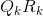，

1）获取 QR 分解：

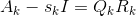

2）设置：

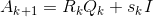

选择 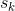 来近似`A`的特征值。我们将使用 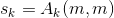。

在数值线性代数（包括幂方法，逆迭代和瑞利商迭代）中的许多算法中都出现了添加移位以加速收敛的想法。

作业：向 QR 算法添加移位。

```py
# 练习：向 QR 算法添加移位
# 练习：def practical_qr(A, iters=10):
# 练习：    return Ak, Q

Ak, Q = practical_qr(A, 10)

'''
[ 5.16264  2.53603  0.31923  0.35315  0.97569  0.43615]
[ 7.99381  0.05922  0.34478  0.29482  0.79026  0.29999]
[ 8.00491  0.04358  0.89735  0.26386  0.26182  0.31135]
[ 8.00493  0.13648  0.91881  0.14839  0.24313  0.33115]
[ 8.00493  0.43377  0.62809  0.13429  0.24592  0.33589]
[ 8.00493  0.81058  0.25128  0.13297  0.24722  0.3359 ]
[ 8.00493  0.98945  0.07221  0.13292  0.24747  0.3359 ]
[ 8.00493  1.0366   0.02497  0.13296  0.24751  0.3359 ]
[ 8.00493  1.04688  0.01465  0.13299  0.24752  0.3359 ]
[ 8.00493  1.04902  0.0125   0.13301  0.24753  0.3359 ]
'''
```

检查`Q`是正交的。

```py
np.allclose(np.eye(n), Q @ Q.T), np.allclose(np.eye(n), Q.T @ Q)

# (True, True)
```

让我们和特征值比较。

```py
np.linalg.eigvals(A)

'''
array([ 2.68500+0.j     ,  0.19274+0.41647j,  0.19274-0.41647j,
       -0.35988+0.43753j, -0.35988-0.43753j, -0.18346+0.j     ])
'''
```

问题：这比未移位的版本更好（它甚至不能保证收敛），但仍然很慢！ 事实上，它是`O(n^4)`，这是非常糟糕的。

在对称矩阵的情况下，它是`O(n^3)`

但是，如果从海森堡矩阵（第一个子对角线下面是零）开始，它会更快：`O(n^3)`，如果是对称的则是`O(n^2)`。

## 两阶段方法

在实践中，使用两阶段方法来找到特征值：

+   将化简缩减为海森堡形式（第一个子对角线下方是零）
+   让海森堡矩阵收敛到三角矩阵的迭代过程。 三角矩阵的特征值是对角线上的值，所以我们完成了！


> 来源：Trefethen，第 25 讲

在埃尔米特矩阵的情况下，这种方法甚至更快，因为中间步骤也是埃尔米特（并且埃尔米特海森堡矩阵是三对角的）。


> 来源：Trefethen，第 25 讲

阶段 1 在有限步骤中达到精确解，而阶段 2 理论上从不会达到精确解。

我们已经完成了第 2 步：QR 算法。 请记住，只使用 QR 算法是可能的，但极其慢。

## Arnoldi 迭代

我们可以将 Arnoldi 迭代用于阶段 1（以及 QR 算法用于阶段 2）。

### 初始化

```py
import numpy as np
n = 5
A0 = np.random.rand(n,n)  #.astype(np.float64)
A = A0 @ A0.T

np.set_printoptions(precision=5, suppress=True)
```

### 线性代数回顾：投影

当向量`b`投影到直线`a`上时，其投影`p`是`b`沿着直线`a`的一部分。

让我们看看 [沉浸式线性代数在线版](http://immersivemath.com/ila/index.html)的[第 3.2.2 节：投影](http://immersivemath.com/ila/ch03_dotproduct/ch03.html)的交互图。


> 来源：[沉浸式数学](http://immersivemath.com/ila/ch03_dotproduct/ch03.html)

以下是将向量投影到平面上的样子：


> 来源：[最小二乘回归的线性代数视角](https://medium.com/@andrew.chamberlain/the-linear-algebra-view-of-least-squares-regression-f67044b7f39b)

当向量`b`投影到直线`a`上时，其投影`p`是`b`沿着直线`a`的一部分。 所以`p`是`a`的一些倍数。 设  其中  是标量。

### 正交性

投影的关键是正交性：从`b`到`p`的直线（可以写成 ）垂直于`a`。

这意味着：


所以：


### 算法

### 动机

我们想要`Q`中的正交列和海森堡矩阵`H`，使得`AQ = QH`。

迭代式思考它：

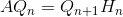

其中 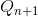 为 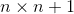， 为 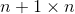。 这会创建一个可解决的递归关系。


> 来源：Trefethen 第 30 讲

### Arnoldi 算法的伪代码

```
对于 Q 的第一列，以任意向量开始（标准化以便范数为 1）
for n=1,2,3...
    v = A @ nth col of Q
    for j=1,...n
        将 v 投影到 q_j，从 v 减去投影
        打算捕获 v 的一部分，它没有由 Q 的前一列跨越
        将系数储存在 H 中
    标准化 v, 之后使它为 Q 的第 (n+1) 列
```

请注意，我们将`A`乘以`Q`中的前一个向量，并删除与`Q`的现有列不正交的分量。

问题：`A`的重复乘法会让你想起什么吗？

答案：幂方法也包括`A`的迭代乘法！

### Arnoldi 迭代如何工作

通过 Arnoldi 迭代，我们找到了 Krylov 子空间的标准正交基。 Krylov 矩阵：

![K = \left[b \; Ab \; A^2b \; \dots \; A^{n-1}b \right]](img/tex-85089c6af5bd4da24c6ef9006b891700.gif)

具有 QR 分解：

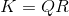

这与在 Arnoldi 迭代中发现的`Q`相同。 请注意，Arnoldi 迭代不会明确计算`K`或`R`。

直觉：`K`包含关于`A`的最大特征值的良好信息，并且 QR 分解通过一次剥离一个近似特征向量，来揭示该信息。

Arnoldi 迭代是两件事：

+   许多数值线性代数迭代算法的基础
+   一种寻找非厄米矩阵特征值的技术（Trefethen，第 257 页）

### Arnoldi 如何定位特征值

+   执行 Arnoldi 迭代
+   使用 QR 算法定期计算海森堡矩阵`H`的特征值（称为 Arnoldi 估计值或 Ritz 值）
+   检查这些值是否收敛。 如果是，它们可能是`A`的特征值。

### 实现

```py
# 分解方阵 A @ Q ~= Q @ H
def arnoldi(A):
    m, n = A.shape
    assert(n <= m)
    
    # 海森堡矩阵
    H = np.zeros([n+1,n]) #, dtype=np.float64)
    # 正交列
    Q = np.zeros([m,n+1]) #, dtype=np.float64)
    # Q 的第 1 列是具有单位范数的随机列
    b = np.random.rand(m)
    Q[:,0] = b / np.linalg.norm(b)
    for j in range(n):
        v = A @ Q[:,j]
        for i in range(j+1):
            # 这来自 v 投影到 q 的公式。
            # 由于列 q 是正交的，q dot q = 1
            H[i,j] = np.dot(Q[:,i], v)
            v = v - (H[i,j] * Q[:,i])
        H[j+1,j] = np.linalg.norm(v)
        Q[:,j+1] = v / H[j+1,j]
        
        # 打印这个看到收敛，在实践中使用会很慢
        print(np.linalg.norm(A @ Q[:,:-1] - Q @ H))
    return Q[:,:-1], H[:-1,:]

Q, H = arnoldi(A)

'''
8.59112969133
4.45398729097
0.935693639985
3.36613943339
0.817740180293
'''
```

检查`H`是三对角的。

```py
H

'''
array([[ 5.62746,  4.05085, -0.     ,  0.     , -0.     ],
       [ 4.05085,  3.07109,  0.33036,  0.     , -0.     ],
       [ 0.     ,  0.33036,  0.98297,  0.11172, -0.     ],
       [ 0.     ,  0.     ,  0.11172,  0.29777,  0.07923],
       [ 0.     ,  0.     ,  0.     ,  0.07923,  0.06034]])
'''
```

### 练习

编写代码来验证：

+   `AQ = QH`
+   `Q`是正交的

### 答案

```py
# 练习：

# True

# 练习：

# True
```

### 一般案例：

一般矩阵：现在我们可以在我们的一般矩阵`A`（非对称）上执行此操作。 在这种情况下，我们得到的是海森堡而不三对角。

```py
Q0, H0 = arnoldi(A0)

'''
1.44287067354
1.06234006889
0.689291414367
0.918098818651
4.7124490411e-16
'''
```

检查`H`是海森堡的。

```py
H0

'''
array([[ 1.67416,  0.83233, -0.39284,  0.10833,  0.63853],
       [ 1.64571,  1.16678, -0.54779,  0.50529,  0.28515],
       [ 0.     ,  0.16654, -0.22314,  0.08577, -0.02334],
       [ 0.     ,  0.     ,  0.79017,  0.11732,  0.58978],
       [ 0.     ,  0.     ,  0.     ,  0.43238, -0.07413]])
'''

np.allclose(A0 @ Q0, Q0 @ H0)

# True

np.allclose(np.eye(len(Q0)), Q0.T @ Q0), np.allclose(np.eye(len(Q0)), Q0 @ Q0.T)

# (True, True)
```

## 放到一起

```py
def eigen(A, max_iter=20):
    Q, H = arnoldi(A)
    Ak, QQ = practical_qr(H, max_iter)
    U = Q @ QQ
    D = np.diag(Ak)
    return U, D

n = 10
A0 = np.random.rand(n,n)
A = A0 @ A0.T

U, D = eigen(A, 40)

'''
14.897422908
1.57451192745
1.4820012435
0.668164424736
0.438450319682
0.674050723258
1.19470880942
0.217103444634
0.105443975462
3.8162597576e-15
[ 27.34799   1.22613   1.29671   0.70253   0.49651   0.56779   0.60974
   0.70123   0.19209   0.04905]
[ 27.34981   1.85544   1.04793   0.49607   0.44505   0.7106    1.00724
   0.07293   0.16058   0.04411]
[ 27.34981   2.01074   0.96045   0.54926   0.61117   0.8972    0.53424
   0.19564   0.03712   0.04414]
[ 27.34981   2.04342   0.94444   0.61517   0.89717   0.80888   0.25402
   0.19737   0.03535   0.04414]
[ 27.34981   2.04998   0.94362   0.72142   1.04674   0.58643   0.21495
   0.19735   0.03534   0.04414]
[ 27.34981   2.05129   0.94496   0.90506   0.95536   0.49632   0.21015
   0.19732   0.03534   0.04414]
[ 27.34981   2.05156   0.94657   1.09452   0.79382   0.46723   0.20948
   0.1973    0.03534   0.04414]
[ 27.34981   2.05161   0.94863   1.1919    0.70539   0.45628   0.20939
   0.19728   0.03534   0.04414]
[ 27.34981   2.05162   0.95178   1.22253   0.67616   0.45174   0.20939
   0.19727   0.03534   0.04414]
[ 27.34981   2.05162   0.95697   1.22715   0.66828   0.44981   0.2094
   0.19725   0.03534   0.04414]
[ 27.34981   2.05162   0.96563   1.22124   0.66635   0.44899   0.20941
   0.19724   0.03534   0.04414]
[ 27.34981   2.05162   0.97969   1.20796   0.66592   0.44864   0.20942
   0.19723   0.03534   0.04414]
[ 27.34981   2.05162   1.00135   1.18652   0.66585   0.44849   0.20943
   0.19722   0.03534   0.04414]
[ 27.34981   2.05162   1.03207   1.15586   0.66584   0.44843   0.20943
   0.19722   0.03534   0.04414]
[ 27.34981   2.05162   1.07082   1.11714   0.66584   0.4484    0.20944
   0.19721   0.03534   0.04414]
[ 27.34981   2.05162   1.11307   1.07489   0.66585   0.44839   0.20944
   0.1972    0.03534   0.04414]
[ 27.34981   2.05162   1.15241   1.03556   0.66585   0.44839   0.20945
   0.1972    0.03534   0.04414]
[ 27.34981   2.05162   1.18401   1.00396   0.66585   0.44839   0.20945
   0.1972    0.03534   0.04414]
[ 27.34981   2.05162   1.20652   0.98145   0.66585   0.44839   0.20946
   0.19719   0.03534   0.04414]
[ 27.34981   2.05162   1.22121   0.96676   0.66585   0.44839   0.20946
   0.19719   0.03534   0.04414]
[ 27.34981   2.05162   1.23026   0.95771   0.66585   0.44839   0.20946
   0.19719   0.03534   0.04414]
[ 27.34981   2.05162   1.23563   0.95234   0.66585   0.44839   0.20946
   0.19718   0.03534   0.04414]
[ 27.34981   2.05162   1.23876   0.94921   0.66585   0.44839   0.20947
   0.19718   0.03534   0.04414]
[ 27.34981   2.05162   1.24056   0.94741   0.66585   0.44839   0.20947
   0.19718   0.03534   0.04414]
[ 27.34981   2.05162   1.24158   0.94639   0.66585   0.44839   0.20947
   0.19718   0.03534   0.04414]
[ 27.34981   2.05162   1.24216   0.94581   0.66585   0.44839   0.20947
   0.19718   0.03534   0.04414]
[ 27.34981   2.05162   1.24249   0.94548   0.66585   0.44839   0.20947
   0.19718   0.03534   0.04414]
[ 27.34981   2.05162   1.24268   0.94529   0.66585   0.44839   0.20947
   0.19718   0.03534   0.04414]
[ 27.34981   2.05162   1.24278   0.94519   0.66585   0.44839   0.20947
   0.19718   0.03534   0.04414]
[ 27.34981   2.05162   1.24284   0.94513   0.66585   0.44839   0.20947
   0.19718   0.03534   0.04414]
[ 27.34981   2.05162   1.24288   0.94509   0.66585   0.44839   0.20947
   0.19718   0.03534   0.04414]
[ 27.34981   2.05162   1.2429    0.94507   0.66585   0.44839   0.20947
   0.19717   0.03534   0.04414]
[ 27.34981   2.05162   1.24291   0.94506   0.66585   0.44839   0.20947
   0.19717   0.03534   0.04414]
[ 27.34981   2.05162   1.24291   0.94506   0.66585   0.44839   0.20947
   0.19717   0.03534   0.04414]
[ 27.34981   2.05162   1.24292   0.94505   0.66585   0.44839   0.20947
   0.19717   0.03534   0.04414]
[ 27.34981   2.05162   1.24292   0.94505   0.66585   0.44839   0.20947
   0.19717   0.03534   0.04414]
[ 27.34981   2.05162   1.24292   0.94505   0.66585   0.44839   0.20948
   0.19717   0.03534   0.04414]
[ 27.34981   2.05162   1.24292   0.94505   0.66585   0.44839   0.20948
   0.19717   0.03534   0.04414]
[ 27.34981   2.05162   1.24292   0.94505   0.66585   0.44839   0.20948
   0.19717   0.03534   0.04414]
[ 27.34981   2.05162   1.24292   0.94505   0.66585   0.44839   0.20948
   0.19717   0.03534   0.04414]
'''

D

'''
array([ 5.10503,  0.58805,  0.49071, -0.65174, -0.60231, -0.37664,
       -0.13165,  0.0778 , -0.10469, -0.29771])
np.linalg.eigvals(A)
array([ 27.34981,   2.05162,   1.24292,   0.94505,   0.66585,   0.44839,
         0.20948,   0.19717,   0.04414,   0.03534])
'''

np.linalg.norm(U @ np.diag(D) @ U.T - A)

# 0.0008321887107978883

np.allclose(U @ np.diag(D) @ U.T, A, atol=1e-3)

# True
```

### 扩展阅读

让我们找一些特征值！

来自[非对称特征值问题](https://sites.math.washington.edu/~morrow/498_13/eigenvalues.pdf)章节：

注意，“直接”方法仍然必须迭代，因为找到特征值在数学上等同于找到多项式的零，因此不存在非迭代方法。 如果经验表明它（几乎）永远不会在固定数量的迭代中收敛，我们就直接调用一个方法。

迭代方法通常仅对特征值和特征向量的子集提供近似，并且通常仅运行足够长的时间，来获得一些足够精确的特征值而不是大量的特征值。

我们的最终算法：带移位的海森堡 QR 算法。

阅读更多：

+   [对称特征问题和 SVD](https://sites.math.washington.edu/~morrow/498_13/eigenvalues2.pdf)
+   [特征值问题的迭代方法](https://sites.math.washington.edu/~morrow/498_13/eigenvalues3.pdf)：Rayleigh-Ritz 方法，Lanczos 算法

### 接下来

我们将来会编写自己的 QR 分解（两种不同的方式！），但首先我们将看到另一种可以使用 QR 分解的方法：计算线性回归。

## 最后

### 其它笔记

对称矩阵自然会带来：

距离矩阵
关系矩阵（Facebook 或 LinkedIn）
常微分方程
我们将研究正定矩阵，因为这可以保证所有特征值都是实的。

注意：在 NLA 令人困惑的语言中，QR 算法是直接的，因为你一次处理所有列。 在其他数学/ CS 语言中，QR 算法是迭代的，因为它迭代地收敛并且永远不会达到精确的解。

结构正交化。 在 NLA 语言中，Arnoldi 迭代被认为是一种迭代算法，因为你可以在某种程度上停止并完成一些列。

用于将矩阵转换为海森堡形式的 Gram-Schmidt 式迭代。
