# 潜入 NumPY

到目前为止，您应该已经安装了使用 Python 进行数据分析所需的一切。 现在让我们开始讨论 NumPy，这是用于管理数据和执行计算的重要软件包。 没有 NumPy，就不会使用 Python 进行任何数据分析，因此了解 NumPy 至关重要。 本章的主要目标是学习使用 NumPy 中提供的工具。

本章将讨论以下主题：

*   NumPy 数据类型
*   创建数组
*   切片数组
*   数学
*   方法和功能

我们从讨论数据类型开始，这在处理 NumPy 数组时在概念上很重要。 在本章中，我们将讨论由`dtype`对象控制的 NumPy 数据类型，这是 NumPy 存储和管理数据的方式。 我们还将简要介绍称为`ndarray`的 NumPy 数组，并讨论它们的作用。

# NumPy 数组

现在让我们讨论称为`ndarray`的 NumPy 数组。 这些不是您在 C 或 C ++中可能遇到的数组。 更好的模拟是 MATLAB 或 R 中的矩阵。 也就是说，它们的行为类似于数学对象，类似于数学矢量，矩阵或张量。 尽管它们可以存储诸如字符串之类的非数学信息，但它们的存在主要是为了管理和简化对数字数据的操作。 `ndarray`在创建时被分配了特定的数据类型或`dtype`，并且数组中所有当前和将来的数据必须属于该`dtype`。 它们还具有多个维度，称为**轴**。

一维 `ndarray` 是一行数据； 这将是一个向量。 二维`ndarray`将是数据的平方，实际上是一个矩阵。 三维`ndarray`将是关键数据，就像张量一样。 允许任意数量的尺寸，但大多数`ndarray`都是一维或二维的。

`dtype`与基本 Python 语言中的类型相似，但 NumPy `dtype`与其他语言（例如 C，C ++或 Fortran）中看到的数据类型也很相似，因为它们的长度是固定的。 `dtype`具有层次结构； `dtype`通常具有字符串描述符，后跟 2 的幂以决定`dtype`的大小。

以下是常见的`dtype`列表：

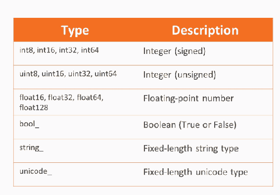

让我们看一下我们刚刚讨论过的一些内容。 我们要做的第一件事是在 NumPy 库中加载。 接下来，我们将创建一个 1 的数组，它们将是整数。

这是数组的样子：

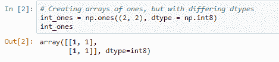

如果我们查看`dtype`，就会看到它是`int8`，即 8 位整数。 我们还可以创建一个由 16 位浮点数填充的数组。 该数组看起来类似于整数数组。 1s 的末尾有一个圆点； 这有点表明包含的数据是浮点而不是整数。

让我们创建一个填充无符号整数的数组：

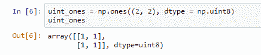

同样，它们为 1，看起来与我们以前的相似，但现在让我们尝试更改一些数据。 例如，我们可以将数组`int_ones`中的数字更改为-1，就可以了。 但是，如果我尝试将其以无符号整数更改为-1，则最终会得到 255。

让我们创建一个填充字符串的数组：

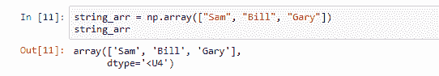

我们此处未指定`dtype`参数，因为通常会猜测`dtype`。 通常会做出一个很好的猜测，但是并不能保证。 例如，在这里我想为该数组的内容分配一个新值`Waldo`。 现在，此`dtype`表示您的字符串长度不能超过四个。 虽然`Waldo`有五个字符，所以当我们更改数组并更改其内容时，我们以 Wald 而不是`Waldo`结尾。 这是因为它不能超过五个字符。 只需要前四个：

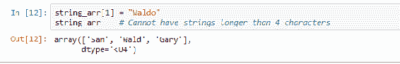

我可以手动指定`dtype`并说允许使用 16 个字符； 在这种情况下，`Waldo`可以正常工作。

# 特殊数值

除了`dtype`对象之外，NumPy 还引入了特殊的数值：`nan`和`inf`。 这些可以在数学计算中出现。 **不是数字**（`NaN`）。 它表明应为数字的值实际上不是数学定义的。 例如，`0/0`产生`nan`。 有时`nan`也用于表示缺少的信息； 例如，Pandas 就用这个。 `inf`表示任意大的数量，因此在实践中，它表示比计算机可以想象的任何数量大的数量。 还定义了`-inf`，它的意思是任意小。 如果数字运算爆炸，即迅速增长而没有边界，则可能会发生这种情况。

从未等于`nan`； 没有定义的事物等于其他事物是没有意义的。 您需要使用 NumPy 函数`isnan`来识别`nan`。 尽管`==`符号不适用于`nan`，但适用于`inf`。 就是说，最好还是使用函数有限或`inf`来区分有限值和无限值。 定义了涉及`nan`和`inf`的算法，但请注意，它可能无法满足您的需求。 定义了一些特殊功能，以帮助避免出现`nan`或`inf`时出现的问题。 例如，`nan` sum 在忽略`nan`的同时计算可迭代对象的总和。 您可以在 NumPy 文档中找到此类功能的完整列表。 使用它们时，我只会提及它们。

现在让我们来看一个例子：

1.  首先，我们将创建一个数组，并将其填充为`1`，`-1`和`0`。 然后，将其除以`0`，然后看看得到了什么。 所以，当我们这样做时，它会抱怨，因为显然我们不应该除以`0`。 我们在小学学习了！

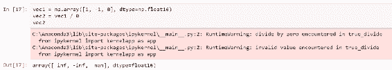

也就是说，它确实带有数字：`1/0`是`inf`，`-1/0`是`-inf`和`0/0`不是数字。 那么我们如何检测特殊值呢？

2.  让我们首先运行一个错误的循环：

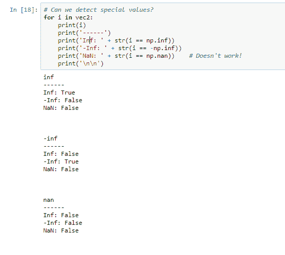

我们将遍历`vec2`的每个可能值，并打印`i == np.inf`，`i == -np.inf`的结果以及 I 是否等于`nan`，`i == np.nan`的结果。 我们得到的是一张清单； `inf`和`-inf`的前两个块很好，但是这个 `nan`不好。 我们希望它检测到`nan`，但它没有这样做。 因此，让我们尝试使用是`nan` 函数：

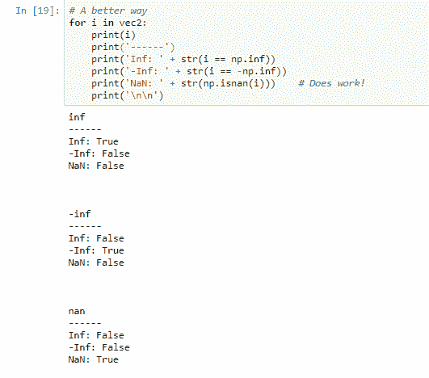

实际上，这确实有效； 我们能够检测到`nan`。

3.  现在，让我们检测有限与无限：

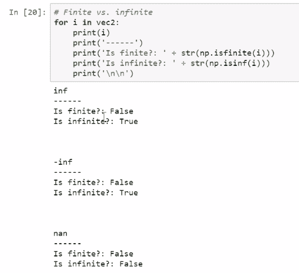

毫不奇怪，`inf`不是有限的。 `-inf`都不是。 但是`nan`既不是 也不是 有限或无穷大； 它是未定义的。 让我们看看执行`inf + 1`，`inf * -1`和`nan + 1`时会发生什么。 我们总是得到`nan`。

如果我们将 2 增大到负无穷大的幂，则得到的是 0。但是，如果将其提高到无穷大，我们将得到无穷大。 `inf - inf`等于而不是 等于任何特定数字：

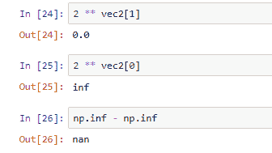

4.  现在，让我们创建一个数组并用数字`999`填充它。 如果我们将这个数组提升为自身，换言之，将`999`提升为`999`的力量，那么最终得到的就是`inf`：

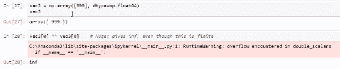

对于这些程序来说，这个数字太大了。 也就是说，我们知道这个数字实际上不是无限的。 它是有限的，但是对于计算机而言，它是如此之大，以至于它也可能是无限的。

5.  现在，让我们创建一个数组，并将该数组的第一个元素指定为`nan`。 如果我们对这个数组的元素求和，我们得到的是`nan`，因为`nan +`都是`nan`：

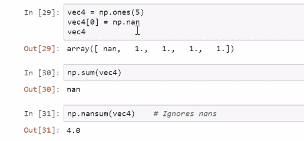

但是，如果我们使用函数`nansum`，则 nans 将被忽略，我们将获得合理的值 4。

# 创建 NumPy 数组

现在，我们已经讨论了 NumPy 数据类型，并简要介绍了 NumPy 数组，下面让我们讨论如何创建 NumPy 数组。 在本节中，我们将使用各种函数创建 NumPy 数组。 有一些函数可以创建所谓的空`ndarray`； 用于创建`ndarray`的函数，其中填充了 0、1 或随机数； 以及使用数据创建`ndarray`的功能。 我们将讨论所有这些，以及从磁盘保存和加载 NumPy 数组。 有几种创建数组的方法。 一种方法是使用数组函数，在此我们提供一个可迭代的对象或一个可迭代的对象列表，从中将生成一个数组。

我们将使用列表列表来执行此操作，但是这些列表可以是元组，元组的元组甚至其他数组的列表。 还有一些方法可以自动创建充满数据的数组。 例如，我们可以使用诸如`ones`，`zeros`或`randn`之类的功能； 后者填充了随机生成的数据。 这些数组需要传递一个元组，该元组确定数组的形状，即数组具有多少维以及每个维的长度。 每个创建的数组都被认为是空的，不包含任何感兴趣的数据。 这通常是垃圾数据，由创建阵列的内存位置中的任何位组成。

我们可以根据需要指定`dtype`参数，但如果不指定，则可以猜测`dtype`或浮点数。 请注意下表中的最后一行：

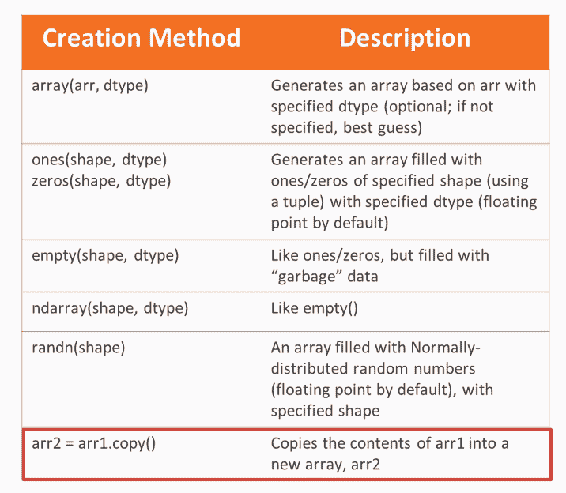

认为可以通过将`arr1`分配给新变量来复制它是错误的。 相反，您实际上得到的是指向相同数据的新指针。 如果您想要一个具有完全独立于其父代的相同数据的新数组，则将需要使用`copy`方法，我们将看到。

# 创建 ndarray

在下面的笔记本中，我们创建一个`ndarray`。 我们要做的第一件事是创建一个 1s 的向量。 注意正在传递的元组； 它仅包含一个数字`5`。 因此，它将是具有五个元素的一维`ndarray`：

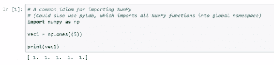

系统自动为其分配了`dtype`浮点 64：

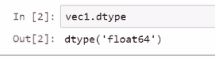

如果我们想将其转换为整数，我们可以首先尝试通过以下方式进行操作，但结果将是垃圾：

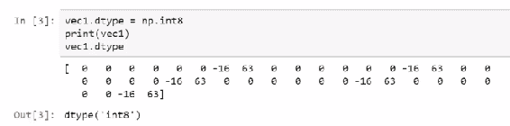

转换`dtype`时需要非常小心。

正确的方法是首先创建一个由五个 1 组成的原始向量，然后使用这些元素作为输入来创建一个全新的数组。 结果如下：

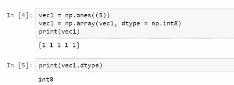

注意`vec1`实际上具有正确的数据类型。 当然，我们可以通过指定我们最初想要的`dtype`来规避此问题。 在这种情况下，我们需要 8 位整数。 结果如下：

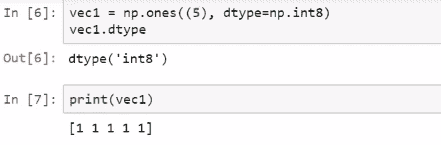

现在，让我们创建一个 0 的多维数据集。 在这里，我们将创建一个三维数组。 也就是说，我们有行，我们有列，还有楼板。

因此，我们按此顺序有两行，两列和两个平板，我们将把它做成 64 位浮点数。 结果如下：

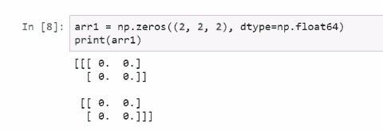

结果的顶部将被视为一个平板，而底部将被视为另一平板。

现在，让我们创建一个填充有随机数据的矩阵。 在这种情况下，我们将使用`randn`函数创建一个具有三行三列的方阵，该函数是 NumPy 随机模块的一部分：

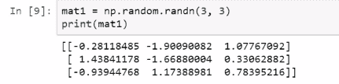

The first number that we pass is the number of rows, and the second number is the number of columns. You could have passed a third number that will determine the number of slabs, and a fourth, a fifth, and so on to specify the number of dimensions you want, and how long you want each dimension to be.

现在，我们将创建 2 x 2 个具有所选名称的矩阵，以及 2 x 2 x 2 个包含数字的数组。 因此，这是一个仅包含名称的矩阵：

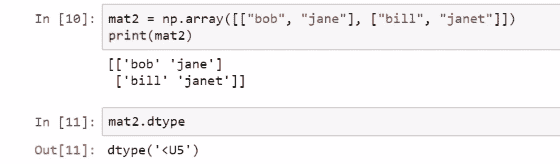

我们可以看到`dtype`是`U5`，即五个字母长的 Unicode 字符串。

我们还可以使用元组来创建数组：

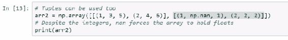

在这种情况下，我们有一个具有多个级别的数组，因此最终将是三维数组。 `(1, 3, 5)`将是此数组的第一个平板的第一行，`(2, 4, 6)`将是第一个平板的第二行。 `[(1, 3, 5), (2, 4, 6)]`确定第一个平板。 `[(1, np.nan, 1), (2, 2, 2)]`确定第二个平板。 总而言之，我们得到了一个多维数据集：

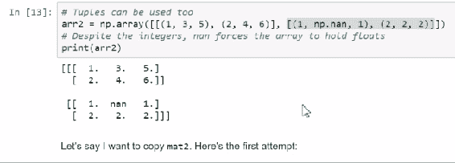

如前所述，如果我们希望复制数组的内容，则需要小心。

考虑以下示例：

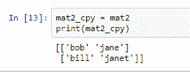

例如，我们可能天真地认为这将创建`mat2`的新副本，并将其存储在`mat2_copy`中。 但是请注意如果我们要更改此数组的假定副本中的条目，或者更改原始父数组的条目会发生什么。 在`mat2`中，如果我们将第一行和第一列中的元素（即元素`(0, 0)`）更改为`liam`，则结果如下：

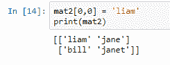

如果查看副本，则会发现更改也影响了副本：

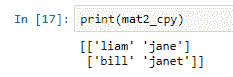

因此，如果要独立副本，则需要使用`copy`方法。 然后，当我们更改`mat2`的 0,0 元素时，它不会影响`copy`，方法：

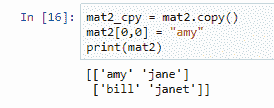

我们还可以对副本进行更改，并且不会影响父级。

以下是保存`ndarray`对象的常用方法的列表：

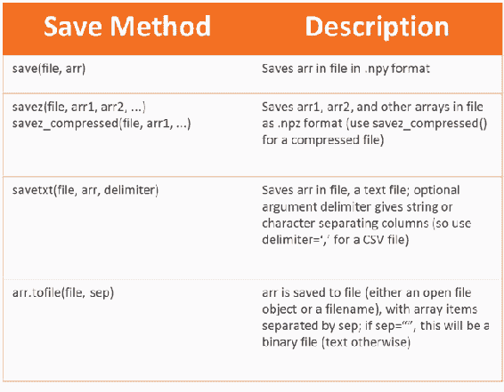

建议您使用`save`，`savez`或`savetxt`功能。 我已经在上表中显示了这些函数的通用语法。 在`savetxt`的情况下，如果要用逗号分隔的文件，只需将定界符参数设置为逗号字符。 另外，如果文件名以`.gz`结尾，则`savetxt`可以保存压缩的文本文件，从而节省了步骤，因为您以后无需自己压缩文本文件。 请注意，除非您编写完整的文件路径，否则指定的文件将保存在工作目录中。

让我们看看我们如何能够保存一些数组。 我们可能应该做的第一件事是检查工作目录是什么：

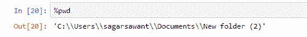

现在，在这种情况下，我将自动进入所需的工作目录中。 但是，如果我愿意，我可以使用`cd`命令更改工作目录，然后，实际上我会将那个目录作为我的工作目录：

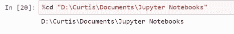

就是说，让我们创建一个`npy`文件，它是 NumPy 的本机文件格式。 我们可以使用 NumPy 的`save`函数以此文件格式保存数组：

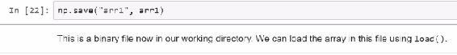

我们将拥有一个名为`arr1`的`npy`文件。 实际上，这是我们工作目录中的一个二进制文件。

如果我们希望加载保存在该文件中的数组，可以使用`load`函数：

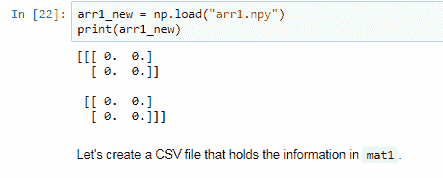

我们还可以创建一个在`mat1`中包含相同信息的 CSV 文件。 例如，我们可以使用以下功能保存它：

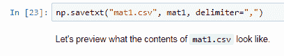

我们可以使用以下代码查看`mat1.csv`的内容：

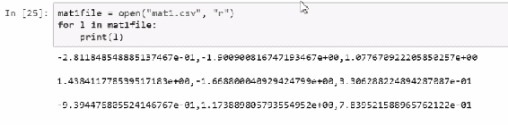

列用逗号分隔，行在换行符上。 然后，我们关闭此文件：

现在，很明显，如果我们可以保存`ndarray`，那么我们也应该能够加载它们。 以下是一些用于加载`ndarray`的常用功能：

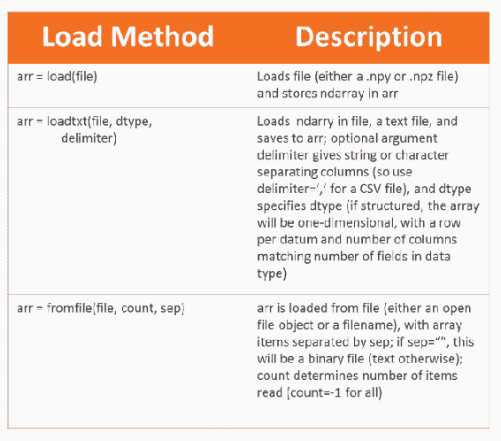

这些功能与用于保存`ndarray`的功能紧密一致。 您将需要在 Python 中保存生成的`ndarray`。 如果要从文本文件加载，请注意，不必为创建`ndarray`而由 NumPy 创建数组。 如果您保存到 CSV，则可以使用文本编辑器或 Excel 创建 NumPy `ndarray`。 然后，您可以将它们加载到 Python 中。 我假设您正在加载的文件中的数据适合`ndarray`； 也就是说，它具有正方形格式，并且仅由一种类型的数据组成，因此不包含字符串和数字。

可以通过`ndarray`处理多类型的数据，但是此时您应该使用 pandas DataFrame，我们将在后面的部分中进行讨论。 因此，如果我想加载刚刚创建的文件的内容，可以使用`loadtxt`函数进行加载，结果如下：

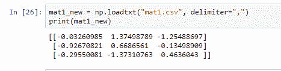

# 摘要

在本章中，我们首先介绍 NumPy 数据类型。 然后我们迅速讨论了称为`ndarray` 对象，的 NumPy 数组，它们是 NumPy 感兴趣的主要对象。 我们讨论了如何根据程序员的输入，其他 Python 对象，文件甚至函数创建这些数组。 我们继续讨论了如何从基本算术到成熟的线性代数对`ndarray` 对象进行数学运算。

在下一章中，我们将讨论一些重要主题：使用数组对`ndarray`对象算术和线性代数进行切片，以及采用数组方法和函数。