# NumPy 数组上的运算

现在，我们知道如何创建 NumPy 数组，我们可以讨论切片 NumPy 数组的重要主题，以便访问和操作数组数据的子集。 在本章中，我们将介绍每个 NumPy 用户应了解的有关数组切片，算术，带有数组的线性代数以及采用数组方法和函数的知识。

# 明确选择元素

如果您知道如何选择 Python 列表的子集，那么您将了解有关`ndarray`切片的大部分知识。 与索引对象的元素相对应的被索引数组元素在新数组中返回。 索引编制的最重要方面是要记住存在多个维度，并且索引编制方法应能够处理这些其他维度。

明确选择元素时，请记住以下几点：

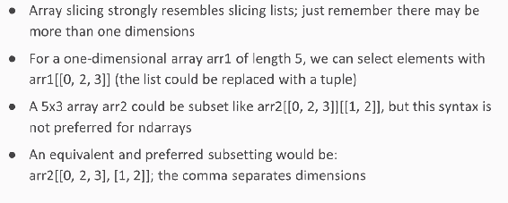

用逗号分隔不同维度的索引对象； 第一个逗号之前的对象显示了如何索引第一维。 在第一个逗号之后是第二个维度的索引，在第二个逗号之后是第三个维度的索引，依此类推。

# 用冒号切片数组

使用冒号索引`ndarray`对象的工作类似于使用冒号索引列表。 只要记住，现在有多个维度。 请记住，当冒号之前或之后的点留为空白时，Python 会将索引视为扩展到维的开始或结束。 可以指定第二个冒号，以指示 Python 跳过每隔一行或反转行的顺序，具体取决于第二个冒号下的数目。

使用冒号对数组进行切片时，需要记住以下几点：

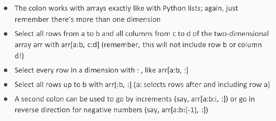

让我们来看一个例子。 首先，我们加载 NumPy 并创建一个数组：

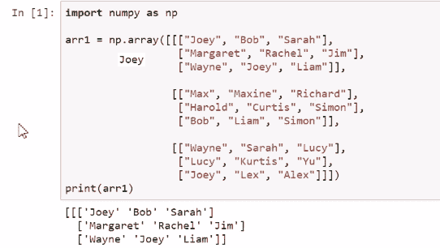

注意，我们创建的是三维数组。 现在，这个数组有点复杂，所以让我们使用二维 3 x 3 数组代替 ：

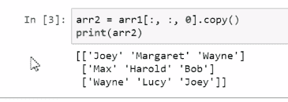

我们在这里使用了复制方法。 返回了一个新对象，但是该对象不是数组的新副本； 它是数组内容的视图。 因此，如果我们希望创建一个独立的副本，则在切片时也需要使用`copy`方法，如我们之前所见。

如果要更改此新数组中的条目，将第二行和第二列的内容设置为`Atilla`，则可以更改此新数组：

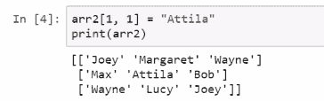

但是我们没有更改原始内容：

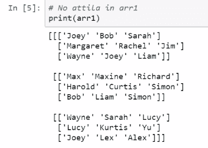

因此，这些是第一个数组中数据的两个独立副本。 现在让我们探索其他切片方案。

在这里，我们看到使用列表建立索引。 我们要做的是创建一个列表，该列表与我们要捕获的对象中每个元素的第一个坐标相对应，然后为第二个坐标提供一个列表。 因此 1 和 0 对应于我们希望选择的一个元素； 如果这是三维对象，我们将需要第三个列表作为第三个坐标：

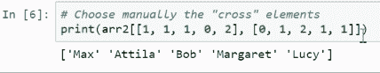

我们使用切片器从左上角选择元素：

现在，让我们从中间一栏中选择元素：

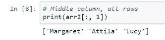

并且，让我们从中间列中选择元素，但我们不会展平矩阵，而是保持其形状：

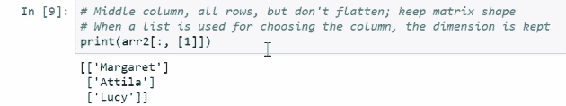

这是一维对象，但是在这里我们需要一个二维对象。 尽管只有一列，但只有一列和一行，而不是只有一行和一列是没有意义的。 现在让我们选择中间列的最后两行：

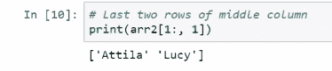

我们反转行顺序：

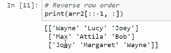

如果查看原始对象，则会发现这些规则以相反的顺序发生（与最初的排序方式相比），这意味着选择奇数列：

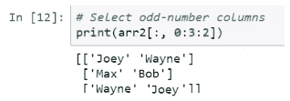

我们可以转到更复杂的三维数组，并查看类似的切片方案。 例如，这是一个 2 x 2 x 2 的角落立方体：

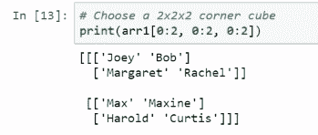

这是中间部分：

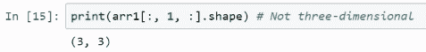

我们可以看到该中间切片是二维数组。 因此，如果我们希望保留维数，那么另一种方法是使用 NumPy 中的新轴对象插入一个额外的维数：

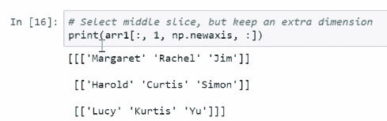

我们看到这个对象实际上是三维的：

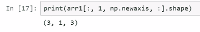

尽管事实上其中一个维度的长度为 1。

# 高级索引

现在让我们讨论更高级的索引技术。 我们可以使用其他`ndarray`为`ndarray`对象建立索引。 我们可以使用包含与我们希望选择的`ndarray`的索引对应的整数的`ndarray`对象或布尔值的`ndarray` 对象来切片`ndarray`对象，其中值`true`表示切片中应包含一个单元格。

选择不是`Wayne`的`arr2`元素，这是结果：

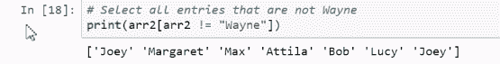

Wayne 不包括在选择中，这是为执行该索引而生成的数组：

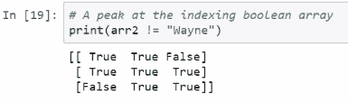

除了内容为`Wayne`的地方，到处都是`True`。

另一种更高级的技术是使用整数数组进行选择，以标识所需的元素。 因此，在这里，我们将创建两个用于切片的数组：

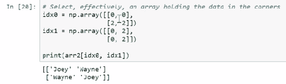

第一个数组中的第一个 0 表示第一个坐标为零，第二个数组中的第一个 0 表示第二个坐标为零，这由这两个数组列出的顺序指定。因此，在第一行和第一列 所得数组的元素为`[0, 0]`。 在第一行和第二列中，我们有原始数组中的元素`[0, 2]`。 然后，在第二行和第一列中，我们具有原始数组的第三行和第一列中的元素。 注意，这是`Wayne`。

然后，我们有了原始数组的第三行和第三列中的元素，该元素对应于`Joey`。

让我们来看一下更复杂的数组。 例如，我们可以看到`arr1`以外的所有条目`Curtis`：

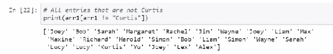

这是索引数组的样子：

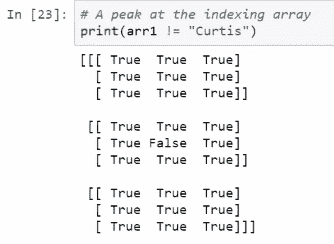

在这里，我们看到了一个更为复杂的切片方案：

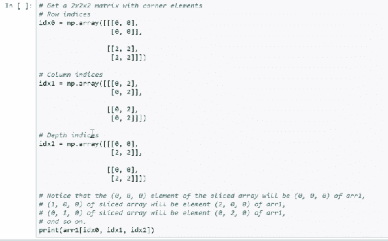

`idx0`指示如何选择第一个坐标，`idx1`指示如何选择第二个坐标，`idx2`指示如何选择第三个坐标。 在这种情况下，我们在原始数组的每个四分之一元素中选择对象。

因此，我实际上已经编写了一些代码，可以实际演示哪些元素将显示在新数组中，即，原始数组中的坐标对新数组中的元素而言是什么。

例如，我们得到的是一个二维矩阵 2 x 2 x2。如果我们想知道切片对象的第二行，第二列和第一个平板中的内容，则可以使用如下代码 ：

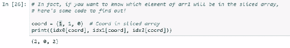

那是原始数组的元素 2、0、2。

# 扩展数组

连接功能允许使用屏幕上显示的语法沿公共轴将数组绑定在一起。 该方法要求阵列沿未用于绑定的轴具有相似的形状。 结果就是全新的`ndarray`，这是将阵列粘合在一起的产物。 为此，还存在其他类似功能，例如堆栈。 我们不会涵盖所有内容。

假设我们想向`arr2`添加更多行。 使用以下代码执行此操作：

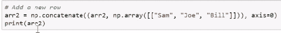

我们创建一个全新的阵列。 在这种情况下，我们不需要使用`copy`方法。 结果如下：

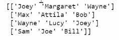

我们在此数组中添加了第四行，将新数组与数据（数组中的名称）绑定在一起。 它仍然是一个二维数组。 例如，请参见以下示例中的数组。 您可以清楚地看到这是二维的，但只有一列，而前一个只有一列，这是我们在此新列中添加后的结果：

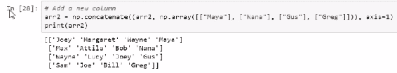

我们将继续对数组进行数学运算。

# 带数组的算术和线性代数

现在，我们已经了解了如何使用 NumPy 数组创建和访问信息，让我们介绍一下可以对数组执行的一些数值运算。 在本节中，我们将讨论使用 NumPy 数组的算法。 我们还将讨论将 NumPy 数组用于线性代数。

# 具有两个相等形状数组的算术

NumPy 数组的算术总是按组件进行的。 这意味着，如果我们有两个形状相同的矩阵，则通过匹配两个矩阵中的相应分量并将它们相加来完成诸如加法之类的操作。 对于任何算术运算都是如此，无论是加法，减法，乘法，除法，幂，甚至是逻辑运算符。

让我们来看一个例子。 首先，我们创建两个随机数据数组：

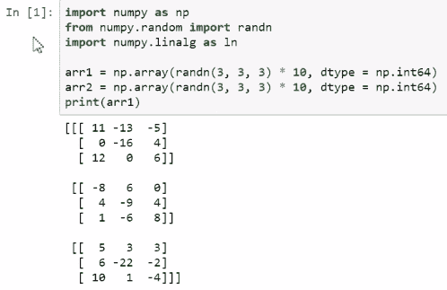

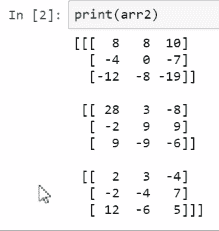

虽然我用涉及两个数组的算术方式解释了这些想法，但正如我们在此处看到的那样，它可能涉及数组和标量，我们将`100`添加到`arr1`中的每个元素中：

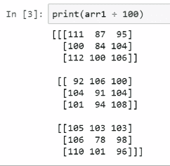

接下来，我们将`arr1`中的每个元素除以`2`：

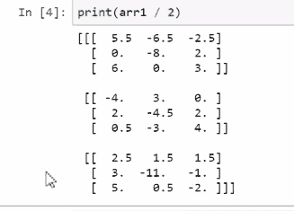

接下来，将`arr1`中的每个元素提升为`2`的幂：

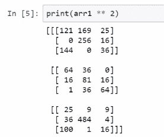

接下来，我们将`arr1`和`arr2`的内容相乘：

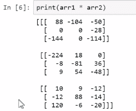

请注意，`arr1`和`arr2`的形状相似。 在这里，我们进行了涉及这两个数组的更复杂的计算：

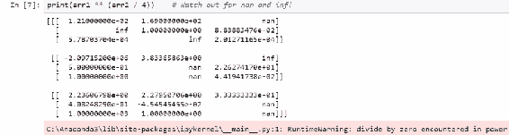

注意，此计算最终产生了`inf`和`nan`。

# 广播

到目前为止，我们已经处理了两个形状相同的数组。 实际上，这不是必需的。 尽管我们不一定要添加两个任意形状的数组，但是在某些情况下，我们可以合理地对不同形状的数组执行算术运算。 从某种意义上说，较小数组中的信息被视为属于相同形状但具有重复值的数组。 让我们看看实际的广播行为。

现在，回想一下数组`arr1`为 3 x 3 x 3； 也就是说，它具有三行，三列和三个平板。 在这里，我们创建一个对象`arr3`：

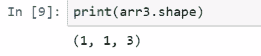

该对象的形状为`(1, 1, 3)`。 因此，此对象的平板数与`arr1`相同，但只有一行和一列。 这是可以应用广播的情况； 实际上，这是结果：

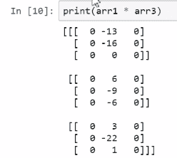

我将第 0 列和第 2 列设为 0，将中间列设为 1.因此，结果是我有效地选择了中间列并将其他两列设置为  0。有效地复制了该对象，因此好像我将`arr1`乘以一个对象一样，其中第一列为 0，第三列为 0，第二列为 1。

现在，让我们看看如果切换此对象的尺寸会发生什么？ 因此，现在它具有一列，一个平板和三行：

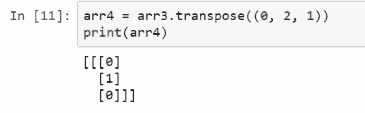

结果如下：

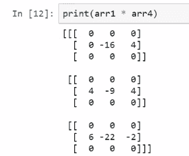

现在，让我们进行另一个换位。 我们将最终将一个具有三个平板的对象相乘，中间的平板由 1 填充。 因此，当我进行乘法运算时，会发生以下情况：

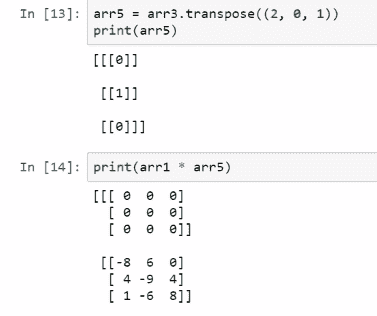

# 线性代数

请注意，NumPy 是为支持线性代数而构建的。 一维 NumPy 数组可以对应于线性代数向量； 矩阵的二维数组； 和 3D，4D 或所有`ndarray`到张量。 因此，在适当的时候，NumPy 支持线性代数运算，例如数组的矩阵乘积，转置，矩阵求逆等。 `linalg`模块支持大多数 NumPy 线性代数功能。 以下是常用的 NumPy 线性代数函数的列表：

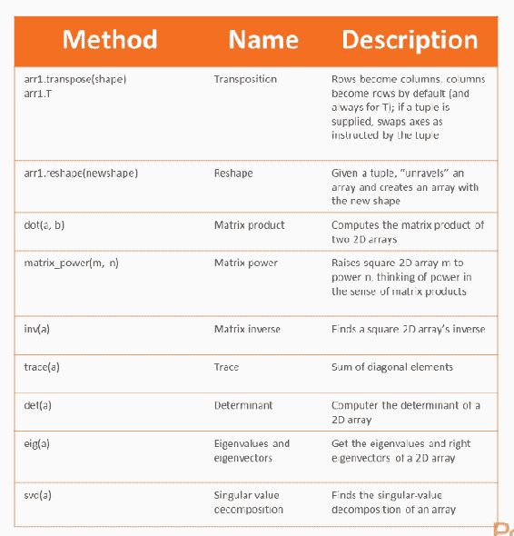

其中一些是`ndarray`方法，其他则在您需要导入的`linalg`模块中。 因此，我们实际上已经在较早的示例中演示了转置。 注意，我们在这里使用转置来在行和列之间交换。

这是`arr4`中的 换位：

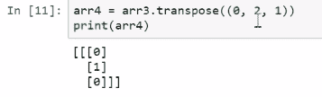

我说`arr4`是`arr3`，我们绕着轴切换。 因此，轴 0 仍将是轴 0，但轴 1 将是旧阵列的轴 2，而轴 2 将是旧阵列的轴 1。

现在，让我们看看其他示例。 让我们看一下重塑的演示。 因此，我们要做的第一件事是创建一个由八个元素组成的数组：

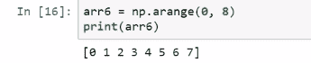

我们可以重新排列此数组的内容，使其适合其他形状的数组。 现在，需要的是新数组具有与原始数组相同数量的元素。 因此，创建一个 2 x 4 数组，如下所示：

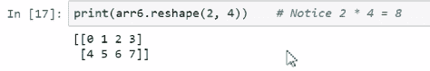

与原始数组一样，它具有八个元素。 此外，它还创建了一个数组，其中第一行包含原始数组的前四个元素，第二行包含其余元素。 我可以用`arr6`做类似的操作：

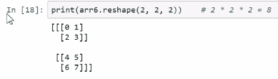

您可以通过查看此数组的逻辑方式来猜测。

现在让我们看一些更复杂的线性代数功能。 让我们从 Scikit-Learn 库的数据集模块中加载一个名为`load_iris`的函数，以便我们可以查看经典的 Iris 数据集：

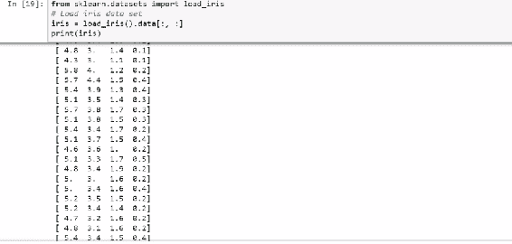

所以以下是`iris`的转置：

复制此数组，如下所示：

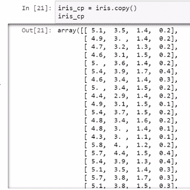

我还想创建一个仅包含  虹膜副本最后一列的新数组，并创建另一个包含其余列和一列的数组 的 1 秒。

现在，我们将创建一个与矩阵乘积相对应的新数组。 所以我说 X 平方是 X 转置并乘以 X，这就是结果数组：

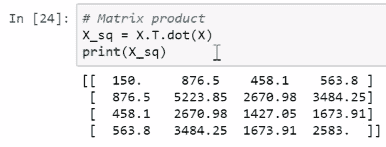

它是 4 x4。现在让我们得到一个逆矩阵 X 的平方。

这将是矩阵逆：

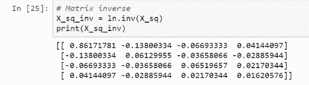

然后，我取这个逆，然​​后将其乘以 X 的转置乘积与矩阵 Y 的乘积，矩阵 Y 是我之前创建的那个单列矩阵。 结果如下：

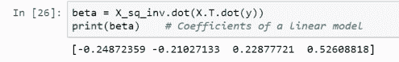

这不是任意的计算顺序； 它实际上对应于我们求解线性模型系数的方式。 原始矩阵`y = iris_cp[:, 3]`对应于我们要使用 X 的内容预测的变量的值； 但是现在，我只想演示一些线性代数。 当遇到的函数时，您现在就知道自己编写此函数所需的所有代码。

我们在数据分析中经常要做的另一件事是找到矩阵的 SVD 分解，并且在此线性代数函数中提供了 SVD 分解：

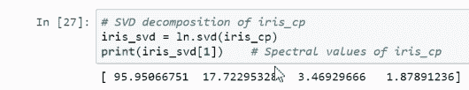

因此，最后一行对应于光谱值。 **光谱值分解**（ **SVD** ），输出中的值是矩阵的光谱值。 以下是左奇异向量：

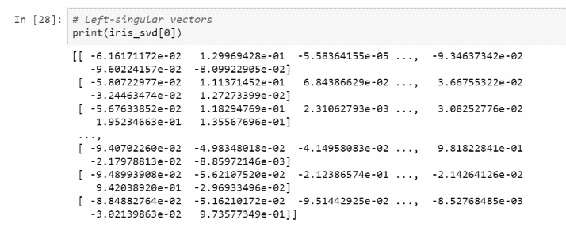

这些是正确的奇异向量：

# 使用数组方法和函数

现在，我们将讨论 NumPy 数组方法和函数的使用。 在本节中，我们将研究常见的`ndarray`函数和方法。 这些功能使您可以使用简洁，直观的语法执行常规任务，而不仅仅是 Python 代码的概念。

# 数组方法

NumPy `ndarray`函数包含一些有助于完成常见任务的方法，例如查找数据集的均值或多个数据集的多个均值。 我们可以对数组的行和列进行排序，找到数学和统计量，等等。 有很多功能可以完成很多事情！ 我不会全部列出。 在下面，我们看到了常见管理任务所需的功能，例如将数组解释为列表或对数组内容进行排序：

接下来，我们将看到常见的统计和数学方法，例如查找数组内容的均值或总和：

我们还有一些用于布尔值数组的方法：

让我们在笔记本中查看其中一些。 导入 NumPy 并创建一个随机值数组：

让我们看看我们可以在此数组上执行的一些操作。 我们可以做的一件事是将数组强制为列表：

我们可以将阵列展平，使其从 4 x 4 阵列变为一维阵列，如下所示：

我们还可以使用 fill 方法填充一个空数组。 在这里，我创建了一个用于字符串的空数组，并用字符串`Carlos`填充了它：

我们可以取一个数组的内容并将它们加在一起：

它们也可以沿轴求和。 接下来，我们沿行求和：

在下面的内容中，我们沿列进行求和：

累积总和允许您执行以下操作，而不是对行的全部内容求和：

*   对第一行求和
*   然后将第一行和第二行相加
*   然后第一，第二和第三行
*   然后是第一第二，第三和第四行，依此类推

接下来可以看到：

# 用 ufuncs 进行矢量化

ufunc 是专门用于数组的 NumPy 函数； 特别地，它们支持向量化。 向量化函数按组件方式应用于数组的元素。 这些通常是高度优化的功能，可以在较快的语言（例如 C）的后台运行。

在下面，我们看到一些常见的`ufuncs`，其中许多是数学上的：

让我们来探讨`ufuncs`的一些应用。 我们要做的第一件事是找到`arr1`中每个元素的符号，即它是正，负还是零：

然后用这个符号，将该数组乘以`arr1`。 结果就好像我们取了`arr1`的绝对值：

现在，我们找到产品内容的平方根。 由于每个元素都是非负的，因此平方根是明确定义的：

# 自定义功能

如前所述，我们可以创建自己的`ufuncs`。 创建`ufuncs`的一种方法是使用现有的`ufuncs`，矢量化操作，数组方法等（即 Numpy 的所有现有基础结构）来创建一个函数，该函数逐个组件地生成我们想要的结果。 假设由于某些原因我们不想这样做。 如果我们有一个现有的 Python 函数，而只想对该函数进行矢量化处理，以便将其应用于`ndarray`组件，则可以使用 NumPy 的 vectorize 函数创建该函数的新矢量化版本。 Vectorize 将功能作为输入，并将功能的矢量化版本作为输出。

如果您不关心速度，可以使用 Vectorize，但是 Vectorize 创建的功能不一定很快。 实际上，前一种方法（使用 NumPy 的现有功能和基础结构来创建您的矢量化功能）可将`ufuncs`的生成速度提高许多倍。

我们要做的第一件事是定义一个适用于单个标量值的函数。 它的作用是截断，因此如果一个数字小于零，则该数字将替换为零：

此功能未向量化； 让我们尝试将此函数应用于矩阵`arr1`：

然后，我们希望该矩阵中每个错误的数量都改为零。 但是，当我们尝试应用此功能时，它根本不起作用：

我们需要做的是创建一个`ufunc`，其功能与原始功能相同。 因此，我们使用 vectorize 并可以创建可以按预期工作的 vectorized 版本，但效率不高：

我们可以通过创建一个使用 NumPy 的现有基础架构的更快版本来看到这一点，例如基于布尔值的索引，并将值分配为零。 这是结果`ufunc`：

让我们比较这两个函数的速度。 以下是使用 vectorize 创建的矢量化版本：

接下来是手动创建的一个：

请注意，第一个功能比手动创建的第二个功能要慢得多。 实际上，它慢了将近 10 倍。

# 摘要

在本章中，我们从显式选择数组中的元素开始。 我们研究了高级索引编制和扩展数组。 我们还用数组介绍了一些算术和线性代数。 我们讨论了使用数组方法和函数以及`ufuncs`的矢量化。 在下一章中，我们将开始学习另一个有影响力的软件包，称为 **pandas** 。