# Pandas 很有趣！ 什么是 Pandas？

在之前的章节中，我们已经讨论过 NumPy。 现在让我们继续学习 pandas，这是一个经过精心设计的软件包，用于在 Python 中存储，管理和处理数据。 我们将从讨论什么是 Pandas 以及人们为什么使用 Pandas 开始本章。 接下来，我们将讨论 Pandas 提供的两个最重要的对象：序列和数据帧。 然后，我们将介绍如何子集您的数据。 在本章中，我们将简要概述什么是 Pandas 以及其受欢迎的原因。

## Pandas 做什么？

pandas 向 Python 引入了两个关键对象，序列和数据帧，后者可能是最有用的，但是 pandas DataFrames 可以认为是绑定在一起的系列。 系列是一系列数据，例如基本 Python 中的列表或一维 NumPy 数组。 而且，与 NumPy 数组一样，序列具有单个数据类型，但是用序列进行索引是不同的。 使用 NumPy 时，对行和列索引的控制不多； 但是对于一个系列，该系列中的每个元素都必须具有唯一的索引，名称，键，但是您需要考虑一下。 该索引可以由字符串组成，例如一个国家中的城市，而序列中的相应元素表示一些统计值，例如城市人口； 或日期，例如股票系列的交易日。

可以将数据帧视为具有公共索引的多个系列的公共长度，它们在单个表格对象中绑定在一起。 该对象类似于 NumPy 2D `ndarray`，但不是同一件事。 并非所有列都必须具有相同的数据类型。 回到城市示例，我们可以有一个包含人口的列，另一个包含该城市所在州或省的信息，还有一个包含布尔值的列，用于标识城市是州还是省的首都，仅使用 NumPy 来完成是一个棘手的壮举。 这些列中的每一个可能都有一个唯一的名称，一个字符串来标识它们包含的信息。 也许可以将其视为变量。 有了这个对象，我们可以轻松，有效地存储，访问和操纵我们的数据。

在下面的笔记本中，我们将预览可以使用序列和数据帧进行的操作：

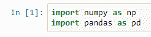

我们将同时加载 NumPy 和 pandas，我们将研究读取 NumPy 和 pandas 的 CSV 文件。 实际上，我们可以在 NumPy 中加载 CSV 文件，并且它们可以具有不同类型的数据，但是为了管理此类文件，您需要创建自定义`dtype`以类似于此类数据。 因此，这里有一个 CSV 文件`iris.csv`，其中包含鸢尾花数据集。

现在，如果我们希望加载该数据，则需要考虑以下事实：每一行的数据不一定都是同一类型的。 特别是最后一列是针对物种的，它不是数字，而是字符串。 因此，我们需要创建一个自定义`dtype`，在此处执行此操作，以调用此新的`dtype`模式：

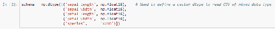

我们可以使用 NumPy 函数`loadtxt`加载此数据集，将`dtype`设置为`schema`对象，并将定界符设置为逗号以指示它是 CSV 文件。 实际上，我们可以在以下位置读取此数据集：

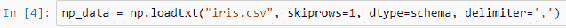

请注意，此数据集必须在您的工作目录中。 如果我们看一下这个数据集，这将是我们注意到的：

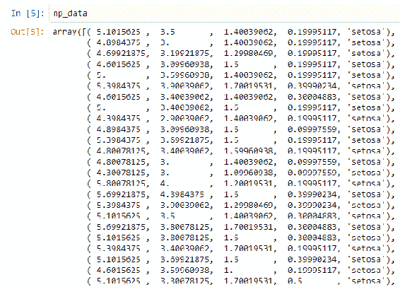

此输出屏幕截图为，仅表示，实际输出包含更多行。 此数据集的每一行都是此一维 NumPy 数组中的新条目。 实际上，这是一个 NumPy 数组：

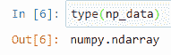

我们使用以下命令选择前五行：

我们可以选择前五行，并指定我们只希望使用隔片长度，它们是每行的第一元素：

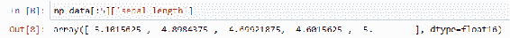

我们甚至可以选择花瓣的长度和种类：

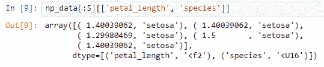

但是有一种更好的方法可以对付 Pandas。 在 Pandas 中，我们将使用`read_csv`函数，该函数将自动正确解析 CSV 文件：

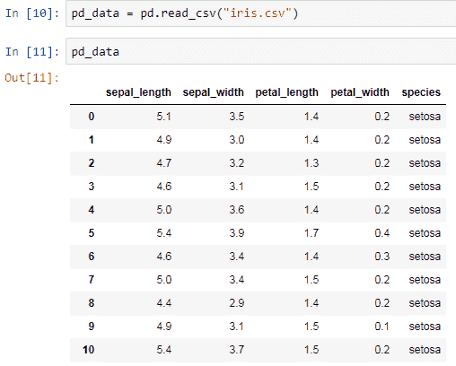

查看此数据集，请注意，使用 Jupyter 笔记本电脑，它的显示方式更加可读。 实际上，这是一个 pandas 数据帧：

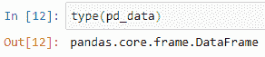

使用`head`函数可以看到前五行：

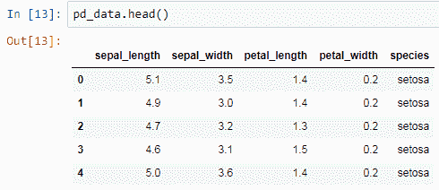

通过将其指定为好像是此数据帧的一个属性，我们还可以看到其间隔长度：

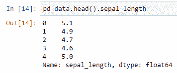

我们得到的实际上是一个系列。 我们可以选择此数据帧的一个子集，再次返回前五行，然后选择`petal_length`和`species`列：

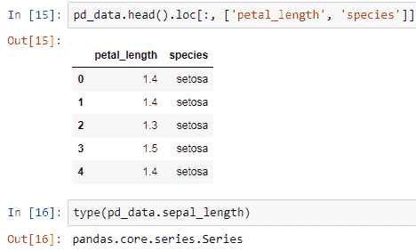

话虽如此，Pandas 的核心是建立在 NumPy 之上。 实际上，我们可以看到 pandas 用于描述其内容的 NumPy 对象：

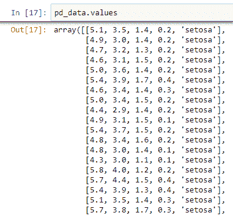

实际上，我们之前创建的 NumPy 对象可用于构造 Pandas 数据帧：

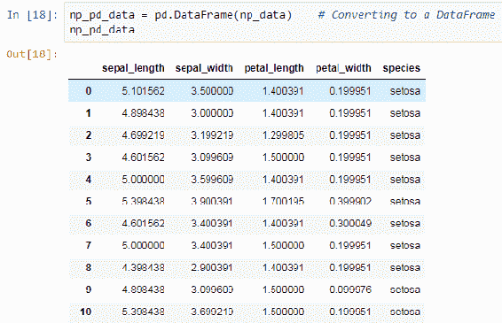

现在是时候仔细看一下 pandas 系列和数据帧了。

## 探索序列和数据帧对象

我们将开始研究 pandas 系列和数据帧对象。 在本节中，我们将通过研究 Pandas 系列和数据帧的创建方式来开始熟悉它们。 我们将从系列开始，因为它们是数据帧的构建块。 系列是包含单一类型数据的一维数组状对象。 仅凭这一事实，您就可以正确地得出结论，它们与一维 NumPy 数组非常相似，但是与 NumPy 数组相比，序列具有不同的方法，这使它们更适合管理数据。 可以使用索引创建索引，该索引是标识系列内容的元数据。 系列可以处理丢失的数据； 他们通过用 NumPy 的 NaN 表示丢失的数据来做到这一点。

## 创建序列

我们可以从类似数组的对象创建序列； 其中包括列表，元组和 NumPy `ndarray`对象。 我们还可以根据 Python 字典创建系列。 向系列添加索引的另一种方法是通过将唯一哈希值的索引或类似数组的对象传递给系列的创建方法的`index`参数来创建索引。

我们也可以单独创建索引。 创建索引与创建序列很像，但是我们要求所有值都必须唯一。 每个系列都有一个索引。 如果我们不分配索引，则将从 0 开始的简单数字序列用作索引。 我们可以通过将字符串传递给该系列的创建方法的`name`参数来为该系列命名。 我们这样做是为了，如果我们要使用该系列创建一个数据帧，我们可以自动为该系列分配列名或行名，这样我们就可以知道该系列描述的日期。

换句话说，该名称提供了有用的元数据，我建议在合理范围内尽可能设置此参数。 让我们看一个可行的例子。 请注意，我们直接将序列和数据帧对象导入名称空间：

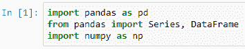

我们经常这样做，因为这些对象已被详尽地使用。 在这里，我们创建两个系列，一个由数字`1`，`2`，`3`，`4`组成，另一个由字母`a`，`b`和`c`组成：

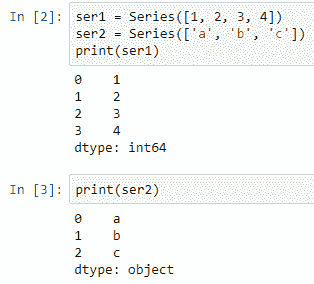

请注意，索引已自动分配给这两个系列。

让我们创建一个索引； 该索引包含美国城市的名称：

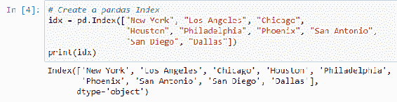

我们将创建一个由`pops`组成的新系列，并将该索引分配给我们创建的系列。 这些城市的人口成千上万。 我从维基百科获得了这些数据。 我们还为该系列分配了名称`Population`。 结果如下：

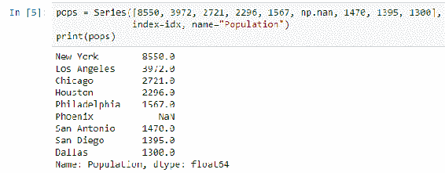

注意，我插入了一个缺失值； 这是`Phoenix`的人口，我们确实知道，但是我想添加一些额外的内容来进行演示。 我们也可以使用字典创建系列。 在这种情况下，字典的键将成为结果序列的索引，而值将是结果序列的值。 因此，在这里，我们添加`state`名称：

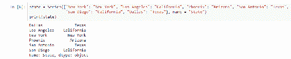

我还使用字典创建了一个系列，并在这些城市中填充了相应的区域：

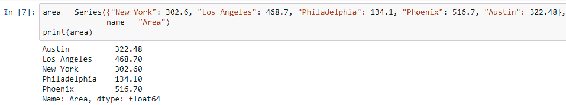

现在，我想提请您注意以下事实：这些系列的长度不相等，而且它们也不都包含相同的键。 它们并非全部或都包含相同的索引。 我们稍后将使用这些系列，因此请记住这一点。

## 创建数据帧

系列很有趣，主要是因为它们用于构建 pandas 数据帧。 我们可以将 pandas 数据帧视为将系列组合在一起以形成表格对象，其中行和列为系列。 我们可以通过多种方式创建数据帧，我们将在此处进行演示。 我们可以给数据帧一个索引。 我们还可以通过设置`columns`参数来手动指定列名。 选择列名遵循与选择索引名相同的规则。

让我们看看一些创建数据帧的方法。 我们要做的第一件事是创建数据帧，我们不会太在意它们的索引。 我们可以从 NumPy 数组创建一个数据帧：

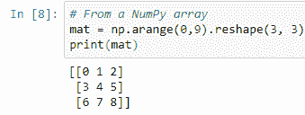

在这里，我们有一个三维 NumPy 数组，其中填充了数字。 我们可以简单地通过将该对象作为第一个参数传递给数据帧创建函数从该对象创建一个数据帧：

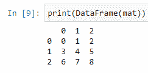

如果需要，可以向此`DataFrame`添加索引和列名：

我们从元组列表创建数据帧：

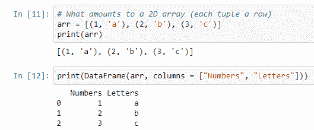

我们也可以从`dict`创建数据帧：

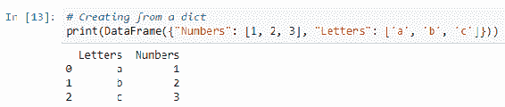

现在，假设我们要创建一个数据帧并将一个字典传递给它，但是该字典不由长度相同的列表组成。 这将产生一个错误：

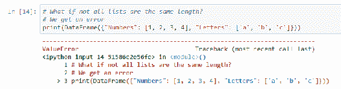

原因是需要将索引分配给这些值，但是函数不知道如何分配丢失的信息。 它不知道如何对齐这些列表中的数据。

但是，如果我们要传递一个字典（并且字典的值是不等长的序列，但是这些序列具有索引），则不会产生错误：

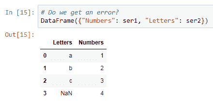

取而代之的是，由于它知道如何排列不同系列中的元素，因此它将这样做，并用 NaN 填充任何缺少信息的位置。

现在，让我们创建一个包含有关系列信息的数据帧，您可能还记得这些系列的长度不同。 此外，它们并非都包含相同的索引值，但是我们仍然能够从它们创建一个数据帧：

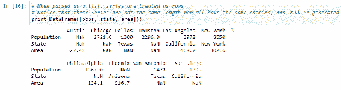

但是，在这种情况下，这不是我们想要的数据帧。 这是错误的方向； 行是我们将解释为变量的内容，列是我们将解释为键的内容。 因此，我们可以在实际需要的方法中使用字典创建数据帧：

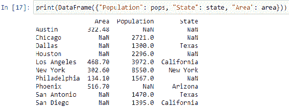

或者我们可以像 NumPy 数组一样使用转置方法`T`方法来使数据帧处于正确的方向：

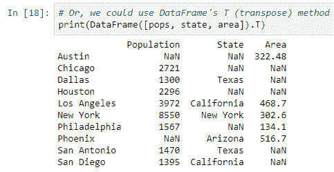

## 新增数据

创建系列或数据帧之后，我们可以使用`concat`函数或`append`方法向其中添加更多数据。 我们将一个对象传递给包含将添加到现有对象中的数据的方法。 如果我们正在使用数据帧，则可以附加新行或新列。 我们可以使用`concat`函数添加新列，并使用`dict`，系列或数据帧进行串联。

让我们看看如何将新信息添加到系列或数据帧中。 例如，让我们在`pops`系列中添加两个新城市，分别是`Seattle`和`Denver`。 结果如下：

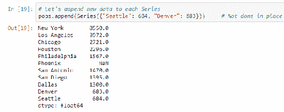

请注意，这尚未完成。 也就是说，返回了一个新系列，而不是更改现有系列。 我将通过使用所需数据创建一个数据帧来向该数据帧添加新行：

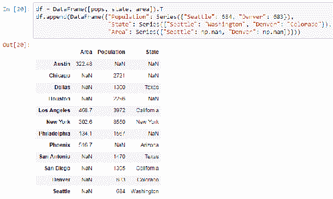

我还可以通过有效地创建多个数据帧将新列添加到此数据帧。

我有一个列表，在此列表中，我有两个数据帧。 我有`df`，并且我有新的数据帧包含要添加的列。 这不会更改现有的数据帧，而是创建一个全新的数据帧，然后我们需要将其分配给变量：

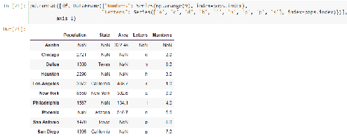

## 保存数据帧

假设我们有一个数据帧； 称它为`df`。 我们可以轻松保存数据帧的数据。 我们可以使用`to_pickle`方法对数据帧进行腌制（将其保存为 Python 常用的格式），并将文件名作为第一个参数传递。

我们可以使用`to_csv`保存 CSV 文件，使用`to_json`保存 JSON 文件或使用`to_html`保存 HTML 表。 还有许多其他格式可用； 例如，我们可以将数据保存在 Excel 电子表格，Stata，DAT 文件，HDF5 格式和 SQL 命令中，以将其插入数据库，甚至复制到剪贴板中。

稍后我们可能会讨论其他方法以及如何加载不同格式的数据。

在此示例中，我将数据帧中的数据保存到 CSV 文件中：

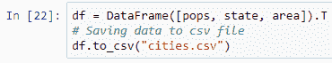

希望到目前为止，您对什么系列和数据帧更加熟悉。 接下来，我们将讨论在数据帧中设置数据子集，以便您可以快速轻松地获取所需的信息。

## 选取数据子集

现在我们可以制作 pandas 系列和数据帧，让我们处理它们包含的数据。 在本节中，我们将看到如何获取和处理我们存储在 Pandas 系列或数据帧中的数据。 自然，这是一个重要的话题。 这些对象否则将毫无用处。

您不应该惊讶于如何对数据帧进行子集化有很多变体。 我们不会在这里涵盖所有特质； 请参考文档进行详尽的讨论。 但是，我们将讨论每个 Pandas 用户应该意识到的最重要的功能。

## 创建子序列

让我们首先看一下系列。 由于它们与数据帧相似，因此有一些适用的关键课程。 子集序列的最简单方法是用方括号括起来，我们可以这样做，就像我们将列表或 NumPy 数组子集化一样。 冒号运算符确实在这里工作，但我们还有更多工作要做。 我们可以根据序列的索引选择元素，而不是仅根据序列中元素的位置，遵循许多相同的规则，就好像我们使用指示序列中元素位置的整数一样。

冒号运算符也可以正常工作，并且在很大程度上符合预期。 选择两个索引之间的所有元素：

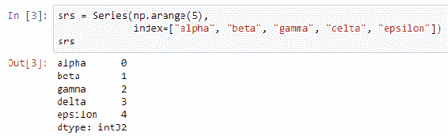

但是与整数位置不同，冒号运算符确实包含端点。 一个特别有趣的情况是使用布尔值建立索引时。 我将展示这种用法可能看起来像什么。 这样可以方便地获取特定范围内的数据。 如果我们可以得到类似数组的对象（例如列表，NumPy 数组或其他序列）来生成布尔值，则可以将该对象用于索引。 这是一些示例代码，展示了对一系列索引的索引：

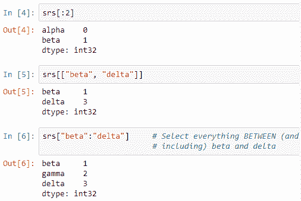

到目前为止，整数索引以及布尔值索引的行为均符合预期：

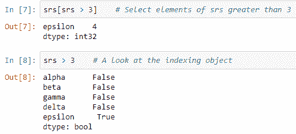

唯一真正有趣的示例是当我们将冒号运算符与索引一起使用时； 请注意，所有起点和终点都包括在内，尤其是终点。 这与我们通常与冒号运算符关联的行为不同。 这是一个有趣的示例：

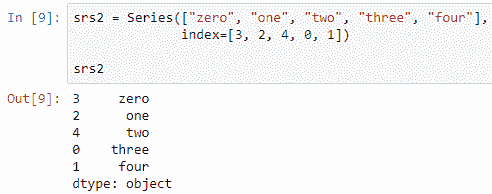

我们有一个序列，并且该序列具有`index`的整数，该整数的顺序不为 0 到 4。 现在，订单混合了。 考虑我们要求的索引。 会发生什么？ 一方面，我们可以说最后一个命令将基于索引进行选择。 因此它将选择元素 2 和 4； 他们之间什么都没有。 但另一方面，它可能会使用整数位置来选择系列的第三和第四元素。 换句话说，当我们从 0 开始计数时，它是位置 2 和位置 3，就像您希望将`srs2`视为列表一样。 哪种行为会占上风？ 还不是很清楚。

## 索引方法

Pandas 提供的方法可以使我们清楚地说明我们要如何编制索引。 我们还可以区分基于系列索引值的索引和基于对象在系列中的位置的索引，就像处理列表一样。 我们将关注的两种方法是`loc`和`iloc`。`loc`专注于根据序列的索引进行选择，如果我们尝试选择不存在的关键元素，则会出现错误。`iloc`就像我们在处理 Python 列表一样建立索引； 也就是说，它基于整数位置进行索引。 因此，如果我们尝试在`iloc`中使用非整数进行索引，或者尝试选择有效整数范围之外的元素，则会产生错误。 有一种`hybrid`方法`ix`，其作用类似于`loc`，但是如果传递的输入无法针对索引进行解释，则它的作用将类似于`iloc`。 由于`ix`的行为模棱两可，因此我建议大多数时候坚持使用`loc`或`iloc`。

让我们回到我们的例子。 事实证明，在这种情况下，方括号的索引类似于`iloc`； 也就是说，它们基于整数位置进行索引，就好像`srs2`是一个列表一样。 如果我们想基于`srs2`的索引进行索引，则可以使用`loc`进行索引，以获得其他可能的结果。 再次注意，在这种情况下，两个端点都包括在内。 这与我们通常与冒号运算符关联的行为不同：

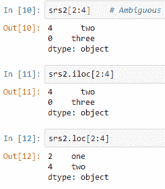

## 切片数据帧

在讨论切片系列之后，让我们谈谈切片数据帧。 好消息是，在谈论系列切片时，许多艰苦的工作已经完成。 我们介绍了`loc`和`iloc`作为串联方法，但它们也是数据帧方法。 毕竟，您应该考虑将数据帧视为多个列粘合在一起的系列。

现在，我们需要考虑从系列中学到的知识如何转换为二维设置。 如果我们使用括号表示法，它将仅适用于数据帧的列。 我们将需要使用`loc`和`iloc`来对数据帧的行进行子集化。 实际上，这些方法可以接受两个位置参数。 根据我们前面描述的规则，第一个位置参数确定要选择的行，第二个位置参数确定要选择的列。 可以发出第二个参数来选择所有列，并将选择规则仅应用于行。 这意味着我们应该将第一个参数作为冒号，以便在我们选择的列中更加挑剔。

`loc`和`iloc`将在它们的两个参数上加上基于索引的索引或基于整数位置的索引，而`ix`可能允许混合使用此行为。 我不建议这样做。 对于后来的读者来说，结果太含糊了。 如果要混合`loc`和`iloc`的行为，建议使用方法链接。 也就是说，如果要基于索引选择行，而要基于整数位置选择列，请首先使用`loc`方法选择行，然后使用`iloc`方法选择列。 执行此操作时，如何选择数据帧的元素没有任何歧义。

如果您只想选择一列怎么办？ 结果如下：

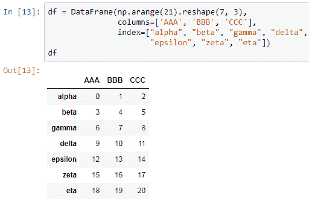

这样做很简捷； 只需将特定的列视为数据帧的属性，作为对象，使用点表示法有效地选择它即可。 这可以很方便：

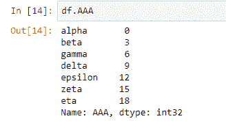

请记住，Pandas 是从 NumPy 构建的，在数据帧的后面是 NumPy 数组。

因此，知道了您现在对 NumPy 数组所了解的知识后，以下事实对您来说就不足为奇了。 将数据帧的切片操作的结果分配给变量时，变量承载的不是数据的副本，而是原始数据帧中数据的视图：

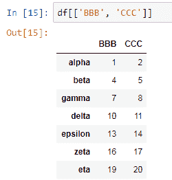

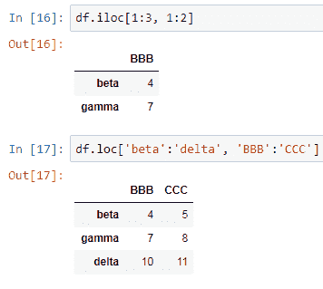

如果要制作此数据的独立副本，则需要使用数据帧的`copy`方法。 系列也是如此。

现在来看一个例子。 我们创建一个数据帧`df`，它具有有趣的索引和列名：

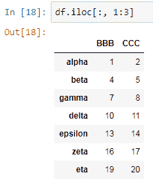

通过将第一列的名称视为`df`的属性，我可以轻松地获得一个表示第一列中数据的系列。 接下来，我们看到`loc`和`iloc`的行为。`loc`根据它们的索引选择行和列，但是`iloc`像选择列表一样选择它们。 也就是说，它使用整数位置：

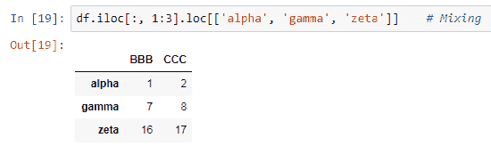

在这里，我们看到了方法链接。 对于输入 10，您可能会注意到它的开始类似于上一张幻灯片中的输入 9，但随后我在结果视图上调用了`loc`，以进一步细分数据。 我将此方法链接的结果保存在`df2`中。 我还用`df2`更改了第二列的内容，并用一系列新的自定义数据替换了它们：

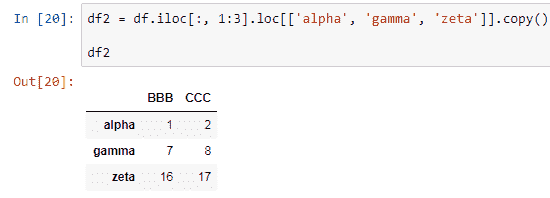

由于`df2`是`df`的独立副本，因此请注意，在创建`df2`时必须使用复制方法； 原始数据不受影响。 这使我们到达了重要的地步。序列和数据帧不是不可变的对象。 您可以更改其内容。 这类似于更改 NumPy 数组中的内容。 但是，在跨列进行更改时要小心； 它们可能不是同一数据类型，从而导致不可预测的结果。有时 ：

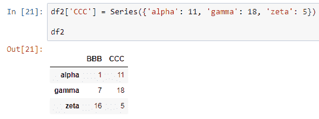

我们在这里看到什么分配：

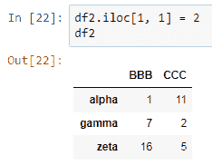

这种行为与您在 NumPy 中看到的行为非常相似，因此我将不做过多讨论。 关于子集，还有很多要说的，特别是当索引实际上是`MultiIndex`时，但这是以后使用的。

## 总结

在本章中，我们介绍了 Pandas 并研究了它的作用。 我们探索了 Pandas 系列数据帧并创建了它们。 我们还研究了如何将数据添加到序列和数据帧中。 最后，我们介绍了保存数据帧。 在下一章中，我们将讨论算术，函数应用和函数映射。