# 五、Pandas 的算术，函数应用以及映射

我们已经看到了使用 pandas 序列和数据帧完成的一些基本任务。 让我们继续进行更有趣的应用。 在本章中，我们将重新讨论先前讨论的一些主题，这些主题涉及将算术函数应用于多元对象并处理 Pandas 中的缺失数据。

## 算术

让我们来看一个例子。 我们要做的第一件事是启动 pandas 和 NumPy。

在以下屏幕截图中，我们有两个序列，`srs1`和`srs2`：

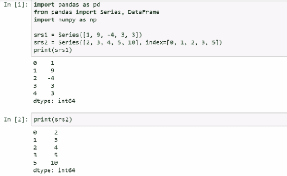

`srs1`的索引从 0 到 4，而`srs2`的索引从 0 到 3，先跳过 4，然后再到 5。从技术上讲，这两个序列的长度是相同的，但是并不意味着这些元素将按照您的预期进行匹配。 例如，让我们考虑以下代码。 当我们添加`srs1`和`srs2`时会发生什么？

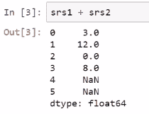

产生了两个 NaN。 这是因为，对于元素 0 到 3，两个序列中都有可以匹配的元素，但是对于 4 和 5，两个序列中每个索引都有不等价的元素。 当我们相乘时也是如此，如下所示：

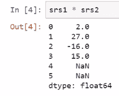

或者，如果我们要求幂，如下所示：

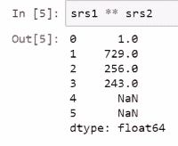

话虽这么说，布尔运算是不同的。 在这种情况下，就像您通常期望的那样，逐个元素进行比较。 实际上，布尔比较似乎根本不关心索引，如下所示：

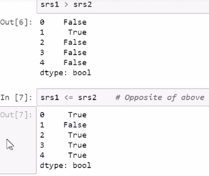

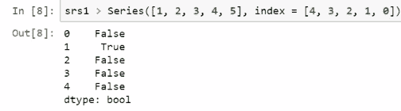

取`srs2`的平方根，如下所示：

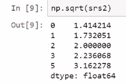

注意，该序列的索引已保留，但我们采用了该序列元​​素的平方根。 让我们以`srs1`的绝对值-再次为预期结果-并注意，我们可以确认这实际上仍然是一个序列，如下所示：

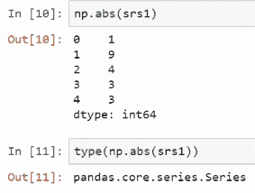

现在，让我们应用自定义`ufunc`。 在这里，我们使用装饰器符号。 在下一个屏幕截图中，让我们看看使用此截断函数的向量化版本，数组然后将其应用于`srs1`时会发生什么，如下所示：

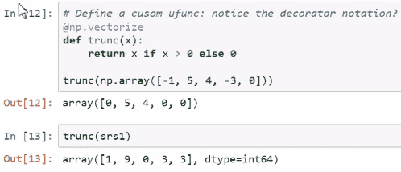

注意`srs1`（以前是 Pandas 序列）已不再是序列； 现在是 NumPy `ndarray`。 因此，该序列的索引丢失了。

计算`srs1`的平均值：

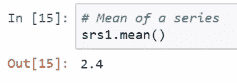

或标准偏差，如下所示：

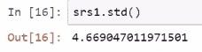

最大元素，如下所示：

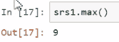

或最大元素所在的位置，如下所示：

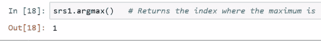

或累加和，连续创建序列的元素：

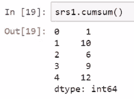

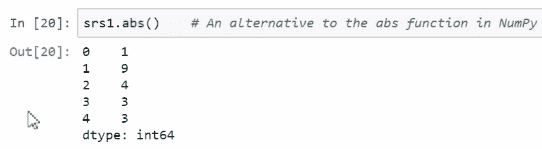

现在，让我们谈谈函数应用和映射。 这类似于我们之前定义的截断函数。 我正在使用`lambda`表达式创建一个临时函数，然后将该临时函数应用于`srs1`的每个元素，如下所示：

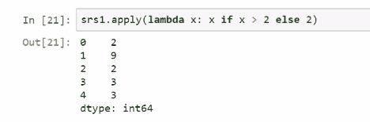

我们可以定义一个向量化函数来执行此操作，但是请注意，通过使用`apply`，我们设法保留了序列结构。 让我们创建一个新序列`srs3`，如下所示：

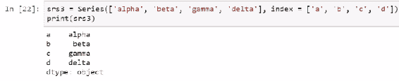

让我们看看当我们有了字典并将`srs3`映射到字典时会发生什么。 请注意，`srs3`的元素对应于字典的键。 因此，当我们映射时，我最终得到的是另一个序列，并且对应于由序列映射查找的键的字典对象的值如下所示：

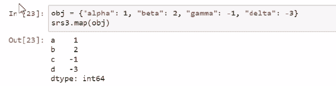

这也适用于函数，例如应用方式。

## 数据帧的算术

数据帧之间的算术与序列或 NumPy 数组算术具有某些相似之处。 如您所料，两个数据帧或一个数据帧与一个缩放器之间的算术工作； 但是数据帧和序列之间的算术运算需要谨慎。 必须牢记的是，涉及数据帧的算法首先应用于数据帧的列，然后再应用于数据帧的行。 因此，数据帧中的列将与单个标量，具有与该列同名的索引的序列元素或其他涉及的数据帧中的列匹配。 如果有序列或数据帧的元素找不到匹配项，则会生成新列，对应于不匹配的元素或列，并填充 Nan。

## 数据帧和向量化

向量化可以应用于数据帧。 给定一个数据帧时，许多 NumPy `ufuncs`（例如平方根或`sqrt`）将按预期工作； 实际上，当给定数据帧时，它们仍可能返回数据帧。 也就是说，这不能保证，尤其是在使用通过`vectorize`创建的自定义`ufunc`时。 在这种情况下，他们可能会返回`ndarray`。 虽然这些方法适用于具有通用数据类型的数据帧，但是不能保证它们将适用于所有数据帧。

## 数据帧的函数应用

毫不奇怪，数据帧提供了函数应用的方法。 您应注意两种方法：`apply`和`applymap`。`apply`带有一个函数，默认情况下，将该函数应用于与数据帧的每一列相对应的序列。 产生的内容取决于函数的功能。 我们可以更改`apply`的`axis`参数，以便将其应用于行（即跨列），而不是应用于列（即跨行）。`applymap`具有与应用不同的目的。 鉴于`apply`将在每一列上求值提供的函数，因此应准备接收序列，而`applymap`将分别在数据帧的每个元素上求值`pass`函数。

我们可以使用`apply`函数来获取所需的数量，但是使用数据帧提供的现有方法通常更有用，并且也许更快。

让我们看一些使用数据帧的演示。 与该序列一起使用的许多技巧也可以与数据帧一起使用，但有些复杂。 因此，让我们首先创建一个数据帧，如下所示：

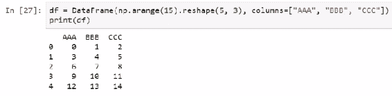

这里我们从另一个数据帧中减去一个数据帧：

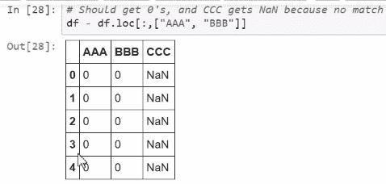

还有一些使用数据帧的有用方法。 例如，我们可以取每列的平均值，如下所示：

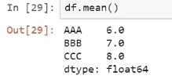

或者我们可以找到每列的标准偏差，如下所示：

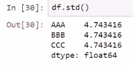

另一个有用的技巧是标准化每列中的数字。 现在，`df.mean`和`df.std`返回一个序列，所以我们实际上要做的是减去一个序列，然后除以一个序列，如下所示：

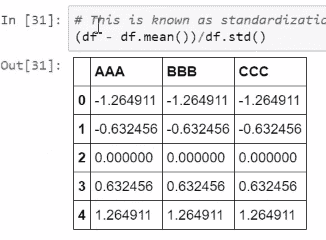

现在让我们看一下向量化。 平方根函数是 NumPy 的向量化函数，可在数据帧上按预期工作：

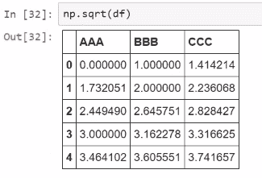

还记得自定义`ufunc` `trunk`吗？ 它不会给我们一个数据帧，但是它将求值并返回类似于数据帧的内容，如下所示：

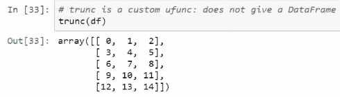

但是，在混合数据类型的数据帧上运行时，这将产生错误：

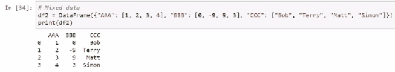

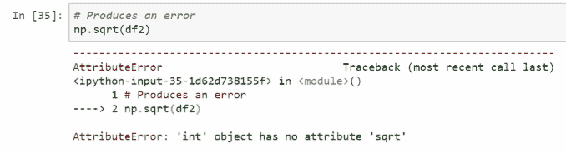

这就是为什么您需要小心的原因。 现在，在这里，我将向您展示避免混合数据类型问题的技巧。 注意，我使用的是我以前未介绍过的方法`select_dtypes`。 这将是选择具有特定`dtype`的列。 在这种情况下，我需要数字`dtype`的列：

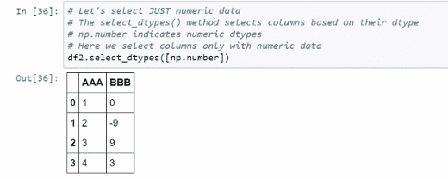

请注意，排除了由字符串数据组成的第三列。 因此，当我取平方根时，除了负数外，它都可以正常工作：

现在，让我们看一下函数的应用。 在这里，我将定义一个函数，该函数计算所谓的[​​HTG1]几何平均值。 因此，我要做的第一件事是定义一个几何`mean`函数：

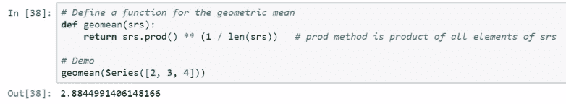

我们将此函数应用于数据帧的每一列：

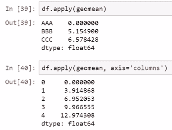

我展示的最后一个技巧是`applymap`，在该示例中，我演示了此函数如何与用于截断函数的新 lambda 一起工作，这次是在`3`处截断：

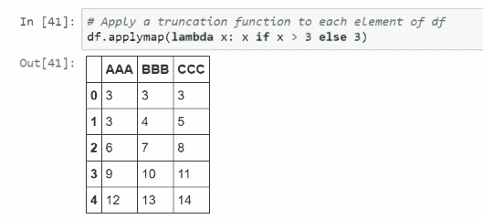

接下来，我们将讨论解决数据帧中丢失数据的方法。

## 处理 Pandas 数据帧中的丢失数据

在本节中，我们将研究如何处理 Pandas 数据帧中的丢失数据。 我们有几种方法可以检测对序列和数据帧都有效的缺失数据。 我们可以使用 NumPy 的`isnan`函数； 我们还可以使用序列和数据帧提供的`isnull`或`notnull`方法进行检测。 NaN 检测对于处理丢失信息的自定义方法可能很有用。

在本笔记本中，我们将研究管理丢失信息的方法。 首先，我们生成一个包含缺失数据的数据帧，如以下屏幕截图所示：

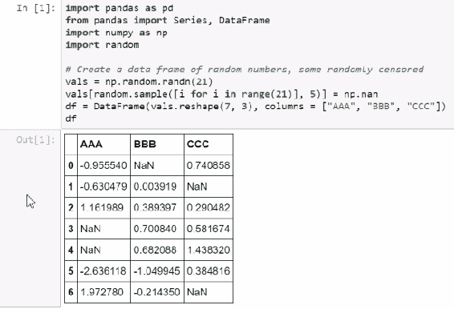

如之前在 Pandas 中提到的，缺失的信息由 NumPy 的 NaN 编码。 显然，这不一定是到处编码丢失的信息的方式。 例如，在某些调查中，丢失的数据由不可能的数值编码。 假设母亲的孩子人数为 999； 这显然是不正确的。 这是使用标记值指示缺少信息的示例。

但是在这里，我们仅使用使用 NaN 表示缺失数据的 Pandas 约定。 我们还可以创建一个缺少数据的序列。 下一个屏幕截图显示了该序列：

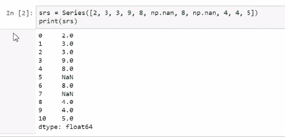

让我们看一些检测丢失数据的方法。 这些方法将产生相同的结果或完全矛盾的结果。 例如，我们可以使用 NumPy 的`isnan`函数返回一个数据帧，如果数据为 NaN 或丢失，则返回`true`，否则返回`false`：

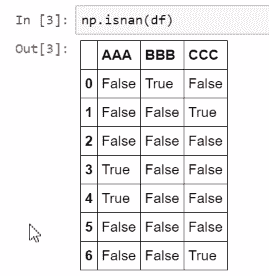

`isnull`方法做类似的事情； 只是它使用了数据帧方法而不是 NumPy 函数，如下所示：

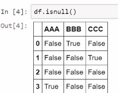

`notnull`函数基本上与`isnull`函数完全相反； 缺少数据时返回`false`，不丢失数据时返回`true`，如下所示：

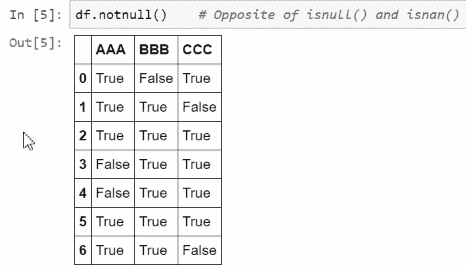

## 删除缺失的信息

序列和数据帧的`dropna`可用于创建对象的副本，其中删除了丢失的信息行。 默认情况下，它将删除缺少任何数据的行，并且与序列一起使用时，它将使用 NaN 消除元素。 如果要适当完成此操作，请将`inplace`参数设置为`true`。

如果我们只想删除仅包含缺少信息的行，因此不删除任何使用信息，则可以将`how`参数设置为全部。 默认情况下，此方法适用于行，但如果要更改其适用于列，则可以将`access`参数设置为 1。

这是我们刚才讨论的示例。 让我们使用此数据帧`df`，并删除存在缺失数据的所有行：

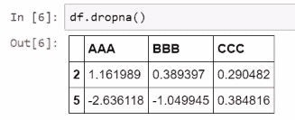

注意，我们大大缩小了数据帧的大小； 只有两行仅包含完整信息。 我们可以对该序列做类似的事情，如下所示：

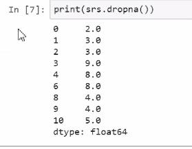

有时，在计算某些指标时会忽略掉丢失的信息。 例如，在计算特定指标（例如均值，总和，标准差等）时，简单地排除丢失的信息根本没有问题。 尽管可以更改参数来控制此行为（可能由`skipna`之类的参数指定），但是默认情况下，这是由许多 pandas 方法完成的。 当我们尝试填充丢失的数据时，此方法可能是一个很好的中间步骤。 例如，我们可以尝试用非缺失数据的平均值填充一列中的缺失数据。

## 填充缺失的信息

我们可以使用`fillna`方法来替换序列或数据帧中丢失的信息。 我们给`fillna`一个对象，该对象指示该方法应如何替换此信息。 默认情况下，该方法创建一个新的数据帧或序列。 我们可以给`fillna`一个值，一个`dict`，一个序列或一个数据帧。 如果给定单个值，那么所有指示缺少信息的条目将被该值替换。`dict`可用于更高级的替换方案。`dict`的值可以对应于数据帧的列；例如， 可以将其视为告诉如何填充每一列中的缺失信息。 如果使用序列来填充序列中的缺失信息，那么过去的序列将告诉您如何用缺失的数据填充序列中的特定条目。 类似地，当使用数据帧填充数据帧中的丢失信息时，也是如此。

如果使用序列来填充数据帧中的缺失信息，则序列索引应对应于数据帧的列，并且它提供用于填充该数据帧中特定列的值。

让我们看一些填补缺失信息的方法。 例如，我们可以尝试通过计算其余数据集的均值来填充缺失的信息，然后用均值填充该数据集中的缺失数据。 在下一个屏幕截图中，我们可以看到用零填充缺失的信息，这是一种非常粗糙的方法：

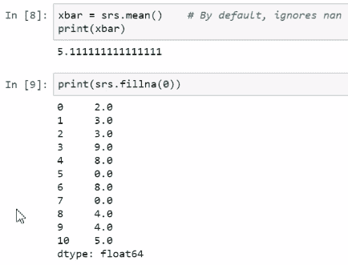

更好的方法是用均值填充丢失的数据，如下所示：

但是请注意，有些事情可能并不相同。 例如，尽管新数据集的均值与丢失的信息的均值与原始数据集的均值相同，但将原始数据集的标准差与新数据集的标准差进行比较，如下所示：

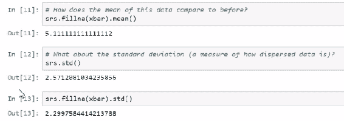

标准偏差下降； 这方面没有保留。 因此，我们可能要使用其他方法来填写丢失的信息。 也许，尝试这种方法的方法是通过随机生成均值和标准差与原始数据相同的数据。 在这里，我们看到了一种类似于自举统计技术的技术，在该技术中，您从现有数据集中重新采样以在模拟数据集中模拟其属性。 我们首先生成一个全新的数据集，一个从原始序列中随机选择数字的序列，并作为缺失数据的索引，如下所示：

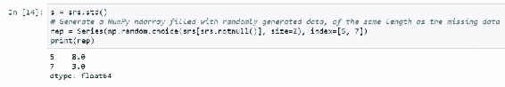

然后，该序列用于填写原始序列的缺失数据：

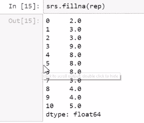

条目 5 和 7 对应于用于填写缺失数据的序列。 现在让我们计算均值，如下所示：

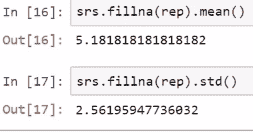

均值和标准差都不相同，但是至少与标准差相比，这些均值与原始均值和标准差之间的差异并不像以前那么严重。 现在，很明显有了随机数，只有大样本量才能保证。

让我们看一下在数据帧中填充缺少的信息。 例如，这是以前使用的数据帧，在这里我们用 0 填写丢失的数据：

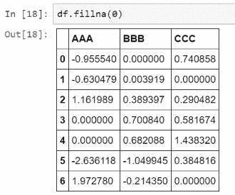

现在，您当然会认为数字 0 有问题，所以让我们看一下也许用列均值填充丢失的数据。 这样做的命令可能类似于以下内容：

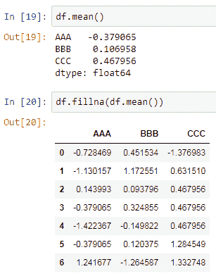

但是要注意一些事情； 当我们使用这种方法来填写缺失的数据时，标准偏差都比以前降低了！

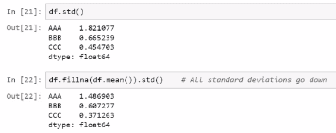

我们将尝试之前尝试过的引导技巧。 我们将使用字典或`dict`填充缺少的信息。 我们将创建一个`dict`，其中每个列均包含一个序列，而该序列在数据帧中缺少信息，这些序列将类似于我们先前生成的序列：

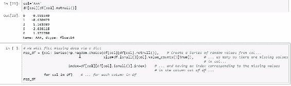

然后，使用此字典中包含的数据填充缺少的信息：

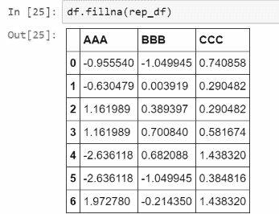

注意均值和标准偏差之间的关系：

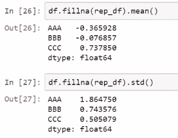

## 总结

在本章中，我们介绍了 Pandas 数据帧，向量化和数据帧函数应用的算术运算。 我们还学习了如何通过删除或填写缺失的信息来处理 pandas 数据帧中的缺失数据。 在下一章中，我们将研究数据分析项目中的常见任务，排序和绘图。