# 五、Python 机器学习

在本章中，我们将学习机器学习以及如何在 Python 中实际实现机器学习模型。

我们将研究有监督和无监督学习的含义，以及它们之间的区别。 我们将看到防止过拟合的技术，然后看一个有趣的示例，其中实现了垃圾邮件分类器。 我们将分析一个长期的 K 均值聚类方法，并通过一个工作示例使用 Scikit-learn 根据人们的收入和年龄对其聚类！

我们还将介绍称为**决策树**的机器学习一个非常有趣的应用，并且将在 Python 中构建一个工作示例来预测公司中的重要决策。 最后，我们将讲解集成学习和 SVM 的迷人概念，这是我最喜欢的机器学习领域！

更具体地说，我们将介绍以下主题：

*   监督和无监督学习
*   通过训练/测试避免过拟合
*   贝叶斯方法
*   使用朴素贝叶斯实现电子邮件垃圾邮件分类器
*   K 均值聚类的概念
*   Python 聚类范例
*   熵及其度量
*   决策树的概念及其 Python 示例
*   什么是集成学习
*   **支持向量机**（**SVM**）及其使用 Scikit-learn 的示例

# 机器学习和训练/测试

那么什么是机器学习？ 好吧，如果您在维基百科上或其他任何内容上查找它，就会说这是一种可以从观测数据中学习并可以基于其进行预测的算法。 听起来真的很花哨，对不对？ 就像人工智能一样，您的计算机内部也有动荡的大脑。 但实际上，这些技术通常非常简单。

我们已经研究了回归，在回归中我们获取了一组观测数据，为其拟合了一条线，并使用该线进行了预测。 因此，根据我们的新定义，那就是机器学习！ 您的大脑也是如此。

机器学习的另一个基本概念是称为**训练/测试**的东西，它使我们能够非常聪明地评估我们制作的机器学习模型的质量。 当我们现在研究无监督和有监督的学习时，您将明白为什么训练对机器学习如此重要。

# 无监督学习

现在让我们详细讨论两种不同类型的机器学习：有监督的学习和无监督的学习。 有时两者之间可能会有些模糊的界限，但是无监督学习的基本定义是您没有给模型提供任何可借鉴的答案。 您只是将其与一组数据一起呈现，并且您的机器学习算法会在没有其他信息的情况下尝试从中获取意义：


假设我给它提供了许多不同的对象，例如这些球，立方体和骰子集，而没有。 然后，让我们说说某种算法，该算法将基于某种相似性度量将这些对象聚类为彼此相似的事物。

现在，我还没有提前告诉机器学习算法某些对象属于什么类别。 我没有备忘单，可以从我拥有一组现有对象的地方以及对它的正确分类中了解到。 机器学习算法必须自己推断那些类别。 这是无监督学习的一个例子，我没有从中学习的答案。 我只是想让算法根据单独提供给它的数据收集自己的答案。

这样做的问题是我们不一定知道算法会得出什么！ 如果我给它上一幅图中显示的一堆对象，它将不知道是将东西分为圆形的东西，大的还是小的东西，红色还是蓝色的东西。 主要取决于项目之间相似性的度量标准。 但是有时您会发现令人惊讶的集群，这些集群出乎您的意料之外。

因此，这确实是无监督学习的重点：如果您不知道要查找的内容，它可能是发现甚至不存在的分类的强大工具。 我们称其为**潜在变量**。 您甚至不知道原来存在的某些数据属性可以通过无监督学习来解决。

让我们再举一个无监督学习的例子。 假设我是将人们聚集在一起，而不是将球和骰子聚集在一起。 我正在写一个约会网站，我想看看什么样的人倾向于聚集在一起。 人们倾向于聚集一些属性，这些属性决定了他们是否倾向于彼此喜欢和彼此约会。 现在，您可能会发现出现的集群不符合您的易变型刻板印象。 也许这与大学生与中年人，离婚的人或宗教信仰无关。 也许，如果您查看从该分析中实际得出的集群，您将学到一些有关您的用户的新知识，并实际上发现，还有什么比您的员工真正拥有的现有特征更重要，可以决定他们是否互相喜欢。 因此，这是提供有用结果的监督学习的示例。

另一个示例是根据电影的属性对电影进行聚类。 如果要对 IMDb 之类的一组电影进行聚类，结果可能会让您感到惊讶。 也许不仅仅是电影的类型。 也许还有其他属性，例如电影的年龄，放映时间或放映所在的国家/地区更重要。 你只是永远不知道。 或者，我们可以分析产品说明的文字，并尝试找到对某个类别最有意义的术语。 再有，我们可能未必事先知道什么术语或什么词最能表明产品属于某个类别。 但是通过无监督学习，我们可以挑出潜在信息。

# 监督学习

现在，相比之下，监督学习是我们可以从模型中学到一组答案的情况。 我们为模型提供了一组训练数据。 然后，它可以推断出所需的特征和类别之间的关系，并将其应用于看不见的新值-并预测有关它们的信息。

回到前面的例子，我们试图根据这些汽车的属性来预测汽车价格。 这是我们使用实际答案训练模型的示例。 因此，我有一组已知的汽车及其出售的实际价格。 我根据一组完整的答案对模型进行训练，然后可以创建一个模型，用于预测以前从未见过的新车的价格。 这是监督学习的一个例子，您可以在其中提供一些要学习的答案。 您已经为数据集分配了类别或一些组织标准，然后您的算法使用该标准构建了一个模型，可以根据该模型预测新值。

# 评估监督学习

那么，您如何评价监督学习？ 好吧，关于监督学习的美丽之处在于我们可以使用一种称为训练/测试的技巧。 这里的想法是将我们希望我的模型从中学习的观测数据分为两组，即训练集和测试集。 因此，当我根据已有的数据来训练/构建模型时，我只会使用部分数据（称为训练集）来进行此操作，而我会保留另一部分数据以用于测试目的。

我可以使用一部分数据作为训练数据来构建模型，然后我可以评估由此产生的模型，并查看它是否可以成功预测出我的测试数据的正确答案。

所以你知道我在那做什么？ 我有一组数据，已经有了可以训练模型的答案，但是我将保留其中的一部分数据，并实际使用它来测试使用训练集生成的模型！ 这为我提供了一种非常具体的方法来测试我的模型在看不见的数据上的表现，因为实际上我保留了一些可以用来测试它的数据。

然后，您可以使用 R 平方或其他度量标准（例如，均方根误差）来定量评估其效果如何。 您可以使用它来测试一个模型与另一个模型，并查看针对给定问题的最佳模型。 您可以调整该模型的参数，并使用训练/测试来最大化该模型在测试数据上的准确率。 因此，这是防止过拟合的好方法。

需要指导学习的一些注意事项。 需要确保您的训练和测试数据集都足够大以实际代表您的数据。 您还需要确保在训练和测试中都捕获到了您关注的所有不同类别和异常值，以便很好地衡量其成功并建立良好的模型。

您必须确保您是从那些数据集中随机选择的，并且您不仅要将数据集一分为二，并说这里剩下的一切都是训练，而这里是测试。 您想随机取样，因为您的数据中可能会顺序出现一些未知的模式。

现在，如果您的模型过拟合，并且只是竭尽全力地接受训练数据中的离群值，那么当您将其与未设定的测试数据场景相对应时，这将被揭示出来。 这是因为异常值的所有旋转都无法解决之前从未出现过的异常值。

在这里让我们清楚一点，训练/测试不是完美的，并且有可能从中获得误导性的结果。 就像我们已经讨论过的那样，也许您的样本量太小，或者仅仅是由于随机的机会，您的训练数据和测试数据看起来非常相似，但它们实际上有一组相似的离群值-您仍然可能过拟合。 如下面的示例所示，它确实可以发生：


# K 折交叉验证

现在有一个解决这个问题的方法，称为 K 折交叉验证，我们将在本书的后面看到一个示例，但是基本概念是您需要多次训练/测试。 因此，您实际上将数据不仅分为一个训练集和一个测试集，还分为多个随机分配的段，即`k`个段。 那就是 k 的来源。 然后将其中一个细分保留为测试数据，然后开始在其余细分上训练模型，并根据测试数据集衡量其表现。 然后，您可以从这些训练集模型的每个结果中获得平均表现，并获得其 R 平方平均得分。

这样一来，您实际上是在对数据的不同部分进行训练，并使用相同的测试集对其进行测量，如果您的模型过度适合您的训练数据的特定部分，则其他模型会将其平均化，这归功于 K 折交叉验证。

这是 K 折交叉验证步骤：

1.  将您的数据分成 K 个随机分配的段
2.  保留一个细分作为测试数据
3.  在其余的`K-1`段上进行训练，并根据测试集衡量其表现
4.  取`K-1`个 R 平方分数的平均值

在本书的后面，这将更有意义，现在，我想让您知道，该工具的存在实际上是在使训练/测试变得比以前更加强大。 因此，让我们去实际处理一些数据，然后使用训练/测试来实际评估它。

# 使用训练/测试来防止多项式回归的过拟合

让我们将训练/测试付诸实践。 因此，您可能还记得，可以将回归视为监督型机器学习的一种形式。 让我们来看一下我们前面介绍的多项式回归，并使用训练/测试尝试找到适合给定数据集的正确次数的多项式。

就像在前面的示例中一样，我们将建立一个随机生成的页面速度和购买量的假数据集，并且我将在它们之间创建一个古怪的小关系，这种关系本质上是指数的。

```py
%matplotlib inline 
import numpy as np 
from pylab import * 

np.random.seed(2) 

pageSpeeds = np.random.normal(3.0, 1.0, 100) 
purchaseAmount = np.random.normal(50.0, 30.0, 100) / pageSpeeds 

scatter(pageSpeeds, purchaseAmount) 

```

让我们继续生成这些数据。 我们将使用如下关系所示的关系，针对页面速度和购买金额使用随机数据的正态分布：

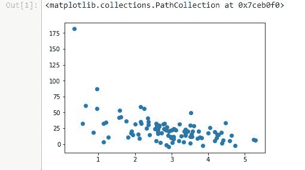

接下来，我们将拆分数据。 我们将使用 80% 的数据，并将保留这些数据作为训练数据。 因此，这些点中只有 80% 将用于训练模型，然后我们将保留另外 20% 的点，以针对看不见的数据测试该模型。

我们将在此处使用 Python 的语法拆分列表。 前 80 分将进入训练集，而后 20 分（80 之后的所有事物）将进入测试集。 您可能在前面的《Python 基础知识》一章中记起了这一点，在该章中，我们介绍了执行此操作的语法，并且我们将在此处针对购买金额执行相同的操作：

```py
trainX = pageSpeeds[:80] 
testX = pageSpeeds[80:] 

trainY = purchaseAmount[:80] 
testY = purchaseAmount[80:] 

```

现在，在前面的部分中，我已经说过，您不应该像这样将数据集一分为二，而是应该随机抽样以进行训练和测试。 但是在这种情况下，由于我的原始数据无论如何都是随机生成的，因此可以解决问题，所以实际上并没有韵律或原因。 但是在实际数据中，您需要在拆分数据之前先对其进行混洗。

现在，我们将介绍一种方便的方法，您可以将其用于整理数据的目的。 另外，如果您使用的是 Pandas 包，则其中有一些方便的功能可以自动为您制作训练和测试数据集。 但是，我们将在这里使用 Python 列表进行操作。 因此，让我们可视化最终得到的训练数据集。 我们将散布我们的训练页面速度和购买金额的图表。

```py
scatter(trainX, trainY) 

```

这就是您的输出现在应如下所示：


基本上，已经绘制了从原始完整数据集中随机选择的 80 个点。 它的形状基本相同，所以这是一件好事。 它代表了我们的数据。 那很重要！

现在，让我们绘制保留为测试数据的其余 20 点。

```py
scatter(testX, testY) 

```


在这里，我们看到剩下的 20 个测试数据也具有与原始数据相同的总体形状。 因此，我认为这也是一个代表性的测试集。 当然，它比您在现实世界中看到的要小一些。 例如，如果您有 1,000 点而不是 100 点，您可能会得到更好的结果，例如，从中选择并保留 200 点而不是 20 点。

现在，我们将尝试将 8 次多项式拟合到此数据，并且我们将随机选择数字`8`，因为我知道这是一个非常高的阶数，并且可能过拟合。

让我们继续使用`np.poly1d(np.polyfit(x, y, 8))`拟合我们的 8 阶多项式，其中`x`仅是训练数据的数组，而`y`仅是训练数据的数组。 我们仅使用预留给训练的 80 个点来查找模型。 现在，我们有了此`p4`函数，可以将其用于预测新值：

```py
x = np.array(trainX) 
y = np.array(trainY) 

p4 = np.poly1d(np.polyfit(x, y, 8)) 

```

现在我们将针对训练数据绘制出多项式。 我们可以将原始数据分散到训练数据集中，然后再针对它们绘制预测值：

```py
import matplotlib.pyplot as plt 

xp = np.linspace(0, 7, 100) 
axes = plt.axes() 
axes.set_xlim([0,7]) 
axes.set_ylim([0, 200]) 
plt.scatter(x, y) 
plt.plot(xp, p4(xp), c='r') 
plt.show() 

```

您可以在下图中看到它看起来非常合适，但您显然知道它做了一些过拟合：


右边的这种疯狂是什么？ 我很确定我们的真实数据（如果有的话）不会令人发指，因为此函数会暗示这一点。 因此，这是过拟合数据的一个很好的例子。 它非常适合您提供的数据，但是在超出图表右侧的疯狂点之前，预测新值会做得很糟糕。 因此，让我们尝试进行梳理。 让我们给它测试数据集：

```py
testx = np.array(testX) 
testy = np.array(testY) 

axes = plt.axes() 
axes.set_xlim([0,7]) 
axes.set_ylim([0, 200]) 
plt.scatter(testx, testy) 
plt.plot(xp, p4(xp), c='r') 
plt.show() 

```

的确，如果我们针对相同的函数绘制测试数据，那么看起来实际上并不那么糟糕。


我们很幸运，实际上没有一个测试可以从这里开始，但是您可以看到这是一个合理的选择，但还远远不够完美。 实际上，如果您实际测量的是 R 平方得分，那将比您想象的要糟糕。 我们可以使用`sklearn.metrics`中的`r2_score()`函数进行测量。 我们只给它原始数据和我们的预测值，它就通过并测量预测的所有方差，并为您求平方：

```py
from sklearn.metrics import r2_score  
r2 = r2_score(testy, p4(testx))  
print r2 

```

我们最终得到的 R 平方得分仅为`0.3`。 所以那不是那么热！ 您会发现它更适合训练数据：

```py
from sklearn.metrics import r2_score  
r2 = r2_score(np.array(trainY), p4(np.array(trainX))) 
print r2 

```

R 平方值原来是`0.6`，这并不奇怪，因为我们在训练数据上对其进行了训练。 坦率地说，测试数据有点未知，也无法测试。 30%，那是 F！

因此，这是一个示例，其中我们使用了训练/测试来评估监督学习算法，就像我之前说的那样，Pandas 提供了一些使这一过程变得更加容易的方法。 我们稍后再讨论，还将在本书的稍后部分中查看更多训练/测试示例，包括 K 折交叉验证。

# 活动

您可能会猜到您的作业是什么。 因此，我们知道 8 阶多项式不是很有用。 你能做得更好吗？ 因此，我希望您回顾一下我们的示例，并对要用于拟合的次数多项式使用不同的值。 将该 8 更改为不同的值，然后查看是否可以找出使用训练/测试作为度量标准的多项式最有效的分数。 您在哪里可以得到最佳的 R 平方分数作为测试数据？ 这里适合什么程度？ 去玩吧。 这应该是一个非常容易的练习，同时对您也非常有启发性。

因此，这实际上是训练/测试，这是掌握的一项非常重要的技术，并且您将一遍又一遍地使用它，以确保您的结果很好地适合您所拥有的模型，并且您的结果可以很好地预测看不见的值。 这是在进行建模时防止过拟合的好方法。

# 贝叶斯方法-概念

您是否想过电子邮件中的垃圾邮件分类器如何工作？ 它怎么知道电子邮件可能是垃圾邮件？ 好吧，一种流行的技术是朴素贝叶斯，这就是贝叶斯方法的一个例子。 让我们进一步了解它是如何工作的。 让我们讨论贝叶斯方法。

在本书的前面，我们确实是在谈论诸如药物测试之类的东西如何在其结果中产生误导性的情况下谈论贝叶斯定理的。 但是您实际上可以将相同的贝叶斯定理应用于垃圾邮件分类器等较大的问题。 因此，让我们深入研究它是如何工作的，这称为贝叶斯方法。

因此，只要回顾一下贝叶斯定理，就可以知道 A 给定 B 的概率等于 A 的总概率乘以 B 给 A 的 B 概率与 B 的总概率之和：

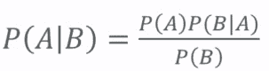

我们如何在机器学习中使用它？ 实际上，我可以为此构建垃圾邮件分类器：一种算法可以分析一组已知的垃圾邮件电子邮件和一组已知的非垃圾邮件电子邮件，并训练模型以实际预测新电子邮件是垃圾邮件还是垃圾邮件。 不是。 这是在现实世界中的实际垃圾邮件分类器中使用的一项实际技术。

例如，假设电子邮件中包含“免费”一词，那么我们就可以判断出该电子邮件为垃圾邮件的可能性。 如果人们向您承诺免费提供东西，那可能是垃圾邮件！ 因此，让我们解决这个问题。 假设您的电子邮件中包含“免费”一词，则该电子邮件为垃圾邮件的概率，等于一个邮件为垃圾邮件的总概率，乘以垃圾邮件包含“免费”一词的概率，除以一个邮件包含“免费”一词的总概率：


分子可以认为是消息为`Spam`并包含单词`Free`的概率。 但这与我们要寻找的有所不同，因为这是完整数据集中的几率，而不仅仅是包含`Free`的事物中的几率。 分母只是包含单词`Free`的整体概率。 有时，您将无法从所拥有的数据中立即访问该数据。 如果不是，则可以将其扩展为以下表达式（如果需要派生）：

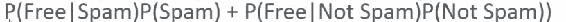

这为您提供了包含“免费”一词的垃圾邮件的百分比，当您试图弄清是否为垃圾邮件时，这将是一件很有用的事情。

但是，英语中的所有其他单词呢？ 因此，我们的垃圾邮件分类程序不仅仅应了解“免费”一词，还应了解更多。 理想情况下，它应该自动选择邮件中的每个单词，并弄清楚这对特定电子邮件是垃圾邮件的可能性有多大贡献。 因此，我们可以做的是在训练过程中遇到的每个单词上训练模型，抛出诸如`a`，`the`和`and`之类的东西以及诸如此类的无意义的单词。 然后，当我们浏览新电子邮件中的所有单词时，我们可以将每个单词被视为垃圾邮件的概率相乘，从而获得该电子邮件为垃圾邮件的总体概率。

现在有一个原因叫朴素贝叶斯。 朴素是因为我们假设单词本身之间没有任何关系。 我们只是在消息中单独查看每个单词，然后基本上将每个单词对垃圾邮件的贡献的所有概率结合起来。 我们不是在看单词之间的关系。 因此，更好的垃圾邮件分类器可以做到这一点，但显然要困难得多。

因此，这听起来很麻烦。 但是总体想法并不难，Python 中的 Scikit-learn 使它实际上很容易实现。 它提供了一个称为`CountVectorizer`的函数，使将电子邮件实际拆分到其所有组成词并分别处理这些词变得非常简单。 然后它具有`MultinomialNB`函数，其中 NB 代表朴素贝叶斯，它将为我们完成朴素贝叶斯的所有繁重工作。

# 使用朴素贝叶斯实现垃圾邮件分类器

让我们使用朴素贝叶斯编写一个垃圾邮件分类器。 您会惊讶地发现这是如此容易。 实际上，大多数工作最终只是读取我们将要训练的所有输入数据并实际解析这些数据。实际的垃圾邮件分类位（机器学习位）本身仅是几行代码 。 所以通常就是这样：在进行数据科学时，读入，按摩和清理数据通常是大部分工作，因此请习惯一下！

```py
import os 
import io 
import numpy 
from pandas import DataFrame 
from sklearn.feature_extraction.text import CountVectorizer 
from sklearn.naive_bayes import MultinomialNB 

def readFiles(path): 
    for root, dirnames, filenames in os.walk(path): 
        for filename in filenames: 
            path = os.path.join(root, filename) 

            inBody = False 
            lines = [] 
            f = io.open(path, 'r', encoding='latin1') 
            for line in f: 
                if inBody: 
                    lines.append(line) 
                elif line == '\n': 
                    inBody = True 
            f.close() 
            message = '\n'.join(lines) 
            yield path, message 

def dataFrameFromDirectory(path, classification): 
    rows = [] 
    index = [] 
    for filename, message in readFiles(path): 
        rows.append({'message': message, 'class': classification}) 
        index.append(filename) 

    return DataFrame(rows, index=index) 

data = DataFrame({'message': [], 'class': []}) 

data = data.append(dataFrameFromDirectory(
                   'e:/sundog-consult/Udemy/DataScience/emails/spam',
                   'spam')) 
data = data.append(dataFrameFromDirectory(
                   'e:/sundog-consult/Udemy/DataScience/emails/ham',
                   'ham')) 

```

因此，我们需要做的第一件事是以某种方式阅读所有这些电子邮件，并且我们将再次使用 Pandas 来简化此操作。 同样，Pandas 是用于处理表格数据的有用工具。 我们在这里的示例中导入将要使用的所有不同包，其中包括`os`库，`io`库，NumPy，Pandas，以及来自 Scikit-learn 的`CountVectorizer`和`MultinomialNB`。

现在让我们详细研究这段代码。 现在，我们可以跳过`readFiles()`和`dataFrameFromDirectory()`的函数定义，然后转到我们的代码实际要做的第一件事，即创建一个 Pandas `DataFrame`对象。

我们将从字典中构造它，该字典最初包含一些空列表，用于在类的空列表中显示消息。 因此，这种语法是这样说的：“我想要一个包含两列的`DataFrame`：一列包含消息，每封电子邮件的实际文本；一列包含每封电子邮件的类别，即垃圾邮件还是垃圾邮件。 火腿”。 就是说我想创建一个小的电子邮件数据库，该数据库有两列：电子邮件的实际文本以及是否为垃圾邮件。

现在，我们需要使用 Python 语法将某些东西放入该数据库中，即放入该`DataFrame`中。 因此，我们将两种方法称为`append()`和`dataFrameFromDirectory()`，将来自我的`spam`文件夹的所有垃圾邮件和来自`ham`文件夹的所有垃圾邮件实际放入`DataFrame`中。

如果您在这里玩耍，请确保修改传递给`dataFrameFromDirectory()`函数的路径以匹配您在系统中安装书籍资料的位置！ 同样，如果您使用的是 Mac 或 Linux，请注意反斜杠和正斜杠以及所有其他内容。 在这种情况下，这没关系，但是如果您不在 Windows 上，则不会有驱动器号。 因此，只需确保这些路径实际上指向此示例的`spam`和`ham`文件夹所在的位置即可。

接下来，`dataFrameFromDirectory()`是我编写的函数，基本上说我有一个目录的路径，并且我知道给它指定了分类，垃圾邮件或火腿，然后它使用了我也编写的`readFiles()`函数，该函数将迭代目录中的每个文件。 因此，`readFiles()`使用`os.walk()`函数来查找目录中的所有文件。 然后，它为该目录中的每个文件建立完整的路径名，然后将其读入。在读入时，它实际上跳过了每封电子邮件的标题，并通过查找第一个空白行直接转到文本。

它知道在第一个空行之后的所有内容实际上都是邮件正文，而在第一个空行之前的所有内容只是一堆标题信息，我实际上并不想在上面训练垃圾邮件分类器。 因此，它既给我返回了每个文件的完整路径，又给了邮件正文。 这就是我们读取所有数据的方式，这就是大部分代码！

因此，到最后，我有了一个`DataFrame`对象，它基本上是一个具有两列的数据库，其中包含消息正文以及是否为垃圾邮件。 我们可以继续运行它，然后可以使用`DataFrame`中的`head`命令实际预览其外观：

```py
data.head() 

```

`DataFrame`中的前几个条目如下所示：对于包含电子邮件的给定文件的每个路径，我们都有一个分类，并且我们有消息正文：

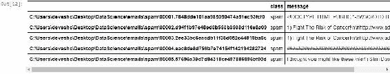

好了，现在有趣的是，我们将使用 Scikit-learn 的`MultinomialNB()`函数对所拥有的数据实际执行朴素贝叶斯。

```py
vectorizer = CountVectorizer() 
counts = vectorizer.fit_transform(data['message'].values) 

classifier = MultinomialNB() 
targets = data['class'].values 
classifier.fit(counts, targets) 

```

这就是您的输出现在应如下所示：


构建`MultinomialNB`分类器后，它需要两个输入。 它需要我们正在训练的实际数据（`counts`）和每个事物的目标（`targets`）。 因此，`counts`基本上是每封电子邮件中所有单词的列表以及该单词出现的次数。

因此，这就是`CountVectorizer()`的作用：它从`DataFrame`中获取`message`列，并从中获取所有值。 我将调用`vectorizer.fit_transform`，它基本上将数据中看到的所有单个单词分词或转换为数字和值。 然后，它计算每个单词出现的次数。

这是表示每个单词在电子邮件中出现多少次的更紧凑的方式。 我不是真正地保留单词本身，而是在稀疏矩阵中将这些单词表示为不同的值，这基本上是在说我将每个单词视为一个数字，作为一个数字索引，放入一个数组中。 这样做的意思是，仅用简单的英语，它将每个消息分成一个单词列表，并计算每个单词出现的次数。 因此，我们称其为`counts`。 基本上，每个单词在每个消息中出现多少次的信息。 而`targets`是我遇到的每封电子邮件的实际分类数据。 因此，我可以使用`MultinomialNB()`函数调用`classifier.fit()`来使用朴素贝叶斯（Naive Bayes）实际创建一个模型，该模型将根据我们提供的信息来预测新电子邮件是否为垃圾邮件。

让我们继续运行它。 它运行很快！ 我将在这里使用几个示例。 让我们尝试一个仅显示`Free Money now!!!`的邮件正文，这显然是垃圾邮件，再发送一个更纯真的邮件，仅显示`"Hi Bob, how about a game of golf tomorrow?"`，因此我们将其传递给我们。

```py
examples = ['Free Money now!!!', "Hi Bob, how about a game of golf tomorrow?"] 
example_counts = vectorizer.transform(examples) 
predictions = classifier.predict(example_counts) 
predictions 

```

我们要做的第一件事是将消息转换为我训练模型时所用的格式。 因此，我使用在创建模型时创建的相同向量化器，将每个消息转换为单词及其频率列表，其中单词由数组中的位置表示。 然后，一旦完成了转换，我就可以在分类器上使用`predict()`函数，将其转换为已转换为单词列表的示例数组，然后看看我们会想到什么：

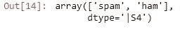

```py
array(['spam', 'ham'], dtype='|S4') 

```

果然，它行得通！ 因此，考虑到这两个输入消息数组`Free Money now!!!`和`Hi Bob`，它告诉我第一个结果以垃圾邮件的形式返回，第二个结果以火腿的形式返回，这是我所期望的。 太酷了。 所以你有它。

# 活动

我们这里有一个非常小的数据集，因此您可以根据需要尝试通过它运行一些不同的电子邮件，看看是否得到不同的结果。 如果您真的想挑战自己，请尝试对本示例进行训练/测试。 因此，判断我的垃圾邮件分类器是否良好的真正衡量标准不仅仅是直观地判断`Free Money now!!!`是垃圾邮件。 您想定量地进行测量。

因此，如果您想挑战一点，请继续尝试将这些数据分为训练集和测试数据集。 实际上，您可以在线查询 Pandas 如何将数据轻松地分为训练和测试集，或者您可以手工完成。 一切为您工作。 查看是否可以将`MultinomialNB`分类器实际应用于测试数据集并衡量其表现。 因此，如果您想做一点运动，一点挑战，那就继续尝试一下。

多么酷啊？ 我们只是使用 Python 中的几行代码编写了自己的垃圾邮件分类器。 使用 Scikit-learn 和 Python 相当容易。 这就是朴素贝叶斯（Naive Bayes）的作用，实际上，您已经可以将垃圾邮件或火腿邮件分类，然后进行分类。 很酷的东西。 接下来让我们讨论集群。

# K 均值聚类

接下来，我们将讨论 K 均值聚类，这是一种无监督的学习技术，您可以将一组要组合成各种聚类的东西收集起来。 也许是电影类型或人口统计，谁知道呢？ 但这实际上是一个非常简单的想法，所以让我们看看它是如何工作的。

K 均值聚类是机器学习中一种非常普遍的技术，您仅尝试获取一堆数据并仅根据数据本身的属性来找到有趣的事物群集。 听起来很花哨，但实际上很简单。 我们在 K 均值聚类中所做的就是尝试将我们的数据分为 K 个组-这就是 K 的来源，这就是您要将数据分为几个不同的组-通过找到 K 个质心来做到这一点。

因此，基本上，给定数据点所属的组由散点图中最接近的质心点定义。 您可以在下图中直观地看到它：


这显示了一个用 K 为 3 的 K 均值聚类的示例，并且正方形表示散点图中的数据点。 圆圈表示 K 均值聚类算法得出的质心，并且根据每个点最接近的质心为其分配了一个聚类。 真的，这就是全部。 这是无监督学习的一个例子。 在这种情况下，我们不会拥有大量数据，而对于给定的一组训练数据，我们已经知道正确的群集； 相反，您只是获得了数据本身，并且仅基于数据的属性就尝试自然地在这些群集上收敛。 这也是一个示例，其中您尝试查找甚至都不知道的集群或分类。 与大多数无监督学习技术一样，关键是要找到潜值，直到算法向您展示它们之前，您才真正意识到它们。

例如，百万富翁住在哪里？ 我不知道，也许有一些富人倾向于居住的有趣的地理集群，而 K 均值聚类可以帮助您弄清楚这一点。 也许我真的不知道今天的音乐类型是否有意义。 这些天替代是什么意思？ 不多吧？ 但是通过对歌曲属性使用 K 均值聚类，也许我可以找到彼此相关的有趣的歌曲聚类，并为这些聚类表示的名称命名。 或者，也许我可以查看人口统计数据，也许现有的刻板印象不再有用。 也许西班牙裔失去了意义，实际上还有其他一些属性可以定义人群，例如，我可以通过聚类来发现。 听起来不错，不是吗？ 真的很复杂的东西。 用 K 集群进行无监督的机器学习，听起来很花哨，但是和大多数数据科学技术一样，这实际上是一个非常简单的想法。

这是简单的英语算法：

1.  **随机选择 K 个质心（K 均值）**：我们从一组随机选择的质心开始。 因此，如果我们的 K 为 3，我们将在组中寻找三个聚类，然后在散点图中分配三个随机定位的质心。
2.  **将每个数据点分配给最接近的质心**：然后，我们将每个数据点分配给最接近其的随机分配质心。
3.  **根据每个质心点的平均位置重新计算质心**：然后为我们得出的每个聚类重新计算质心。 也就是说，对于最终得到的给定群集，我们将质心移动为所有这些点的实际中心。
4.  **迭代直到点停止更改对质心的分配**：我们将再次执行所有操作，直到这些质心停止移动，达到一个确定的阈值，确定，我们在这里进行了收敛。
5.  **预测新点的群集**：要预测我以前从未见过的新点的聚类，我们可以遍历质心位置并找出最接近哪个质心来预测其聚类。

让我们看一个图形示例，使它更有意义。 我们在下图中将第一个数字称为 A，第二个称为 B，第三个称为 C，第四个称为 D。

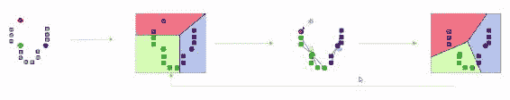

图像 A 中的灰色方块代表我们的散点图中的数据点。 轴代表事物的某些不同特征。 也许是年龄和收入； 这是我一直使用的示例，但可以是任何示例。 灰色方块可能代表个人或个人歌曲或个人，我想在两者之间找到关系。

因此，我首先从散点图中随机选择三个点开始。 可以在任何地方。 要从某个地方开始吧？ 我选择的三个点（质心）已在图像 A 中显示为圆圈。因此，我要做的下一件事是为每个质心计算出最接近的灰度点之一。 这样，以蓝色阴影表示的点与此蓝色质心相关联。 绿点最接近绿色质心，而该单个红点最接近我选择的那个红色随机点。

当然，您可以看到这并不能真正反映出实际群集的位置。 因此，我要做的是获取每个群集中的点，并计算这些点的实际中心。 例如，在绿色集群中，所有数据的实际中心都降低了一点。 我们将质心向下移动一点。 红色群集只有一个点，因此其中心向下移动到该单个点所在的位置。 蓝点实际上非常靠近中心，因此仅移动了一点。 在下一个迭代中，我们最终得到类似于图像 D 的图像。现在您可以看到我们的红色事物集群已经增长了一点，事物已经移动了一点，即从绿色集群中获取的事物。

如果我们再次这样做，您可能可以预测接下来会发生什么。 绿色质心会稍微移动一点，而蓝色质心仍会在它的位置附近。 但是到最后，您将获得您可能希望看到的群集。 这就是 K 均值的工作方式。 因此，它只是不断迭代，试图找到合适的质心，直到事情开始四处移动，然后我们收敛于一个解决方案。

# K 均值聚类的局限性

因此，K 均值聚类存在一些限制。 他们来了：

1.  **选择 K**：首先，我们需要选择正确的 K 值，这根本不是一件容易的事情。 选择 K 的主要方法是从低开始，并根据想要的组数不断增加 K 的值，直到不再大幅度减少平方误差为止。 如果查看每个点到其质心的距离，可以将其视为误差度量。 在停止减少该错误指标的那一刻，您知道您可能有太多的群集。 因此，此时您无法通过添加其他集群真正获得任何更多信息。
2.  **避免局部最小值**：此外，存在局部最小值的问题。 您可能会对最初选择的质心感到非常不走运，而且它们最终可能只收敛于局部现象，而不是更多的全局群集，因此通常，您需要运行几次并可能求平均结果。 我们称这种集成学习。 我们稍后再讨论，但是使用一组不同的随机初始值多次运行 K 均值总是一个好主意，只是看看您是否最终得到相同的总体结果。
3.  **标记群集**：最后，K 均值聚类的主要问题是没有针对您获得的集群的标签。 它只会告诉您这组数据点在某种程度上是相关的，但是您不能在上面加上名称。 它无法告诉您该群集的实际含义。 假设我正在看一堆电影，并且 K 均值聚类告诉我这堆科幻电影就在这里，但我不会将它们称为“科幻”电影。 我要真正去研究数据并弄清楚，这些东西到底有什么共同点？ 我怎么用英语来描述？ 那是最困难的部分，而 K 均值并不能帮助您。 再次说明，Scikit-learn 使执行此操作变得非常容易。

现在让我们来看一个例子，将 K 均值聚类付诸实践。

# 根据收入和年龄将人员聚类

让我们看看使用 Scikit-learn 和 Python 进行 K 均值聚类有多么容易。

我们要做的第一件事是创建一些我们想要尝试聚类的随机数据。 为了简化操作，我们实际上将一些集群构建到伪造的测试数据中。 因此，让我们假设这些数据之间存在一些真实的基本关系，并且其中存在一些真实的自然群集。

为此，我们可以使用 Python 中的这个`createClusteredData()`小函数：

```py
from numpy import random, array 

#Create fake income/age clusters for N people in k clusters 
def createClusteredData(N, k): 
    random.seed(10) 
    pointsPerCluster = float(N)/k 
    X = [] 
    for i in range (k): 
        incomeCentroid = random.uniform(20000.0, 200000.0) 
        ageCentroid = random.uniform(20.0, 70.0) 
        for j in range(int(pointsPerCluster)): 
            X.append([random.normal(incomeCentroid, 10000.0), 
            random.normal(ageCentroid, 2.0)]) 
    X = array(X) 
    return X 

```

该函数以一致的随机种子开始，因此您每次都会获得相同的结果。 我们想要在`k`个集群中创建`N`个人的集群。 因此，我们将`N`和`k`传递给`createClusteredData().`

我们的代码计算出每个群集首先计算出多少个点并将其存储在`pointsPerCluster`中。 然后，它建立了从空开始的列表`X`。 对于每个聚类，我们将创建一个介于 20,000 和 200,000 美元之间的收入随机质心（`incomeCentroid`），以及一个介于 20 和 70 岁之间的年龄随机质心（`ageCentroid`）。

我们在这里所做的是创建一个虚假的散点图，该图将显示`N`人和`k`集群的收入与年龄。 因此，对于我们创建的每个随机质心，我将创建一个正态分布的随机数据集，其收入的标准差为 10,000，年龄的标准差为 2。 这将带给我们一堆年龄收入数据，这些数据被聚集成一些我们可以随机选择的既有聚类。 好的，让我们继续运行它。

现在，实际执行 K 均值，您将看到它很容易。

```py
from sklearn.cluster import KMeans 
import matplotlib.pyplot as plt 
from sklearn.preprocessing import scale 
from numpy import random, float 

data = createClusteredData(100, 5) 

model = KMeans(n_clusters=5) 

# Note I'm scaling the data to normalize it! Important for good results. 
model = model.fit(scale(data)) 

# We can look at the clusters each data point was assigned to 
print model.labels_  

# And we'll visualize it: 
plt.figure(figsize=(8, 6)) 
plt.scatter(data[:,0], data[:,1], c=model.labels_.astype(float)) 
plt.show() 

```

您需要做的就是从 Scikit-learn 的`cluster`包中导入`KMeans`。 我们还将导入`matplotlib`，以便我们可以可视化事物，还可以导入`scale`，以便我们了解其工作原理。

因此，我们使用`createClusteredData()`函数说出 5 个群集附近的 100 个随机人。 因此，对于我正在创建的数据，有 5 个自然群集。 然后，我们创建一个模型，即 K 均值模型，其 k 为 5，因此我们选择了 5 个聚类，因为我们知道这是正确的答案。 但是同样，在无监督学习中，您不一定知道`k`的真正值是什么。 您需要自己迭代并收敛。 然后，我们使用已有的数据，使用我的 K 均值`model`调用`model.fit`。

现在我提到的规模是对数据进行标准化。 使用 K 均值的重要一件事是，如果所有数据均被标准化，则其效果最佳。 这意味着一切都在相同的规模上。 所以我这里的问题是我的年龄从 20 岁到 70 岁不等，但是我的收入一直到 20 万。 因此，这些值并不是真正可比的。 收入远大于年龄值。 `Scale`将获取所有数据并将其按比例缩放到一致的比例，这样我就可以将这些东西像苹果与苹果进行实际比较，这将对您的 K 均值结果大有帮助。

因此，一旦在模型上实际调用了`fit`，我们就可以实际查看得到的结果标签。 然后，我们实际上可以使用一点`matplotlib`魔法将其可视化。 您可以在代码中看到一个小技巧，将颜色分配给最终转换为浮点数的标签。 这只是一个小技巧，可用于将任意颜色分配给给定值。 因此，让我们看看最终的结果：

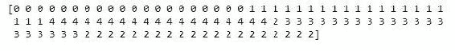

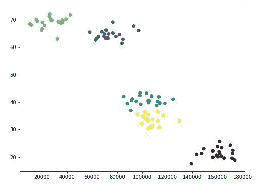

没多久。 您会看到结果基本上就是我将所有内容分配到的集群。 我们知道我们的假数据已经被预先聚类了，因此看起来它很容易识别出第一和第二个集群。 但是，在那之后，它有点混乱了，因为中间的集群实际上被融合在一起了。 它们并不是真的那么不同，所以对于 K 均值来说是一个挑战。 但是无论如何，它确实对集群提出了一些合理的猜测。 这可能是四个群集更自然地适合数据的示例。

# 活动

因此，我希望您为某项活动做的是尝试使用不同的 k 值，然后查看最终结果。 只是盯着前面的图，看起来四个就可以了。 真的吗？如果我增加 k 太大会怎样？ 我的结果如何？ 它试图将事物分解成什么，甚至有意义？ 因此，尝试一下，尝试使用`k`的不同值。 因此，在`n_clusters()`函数中，将 5 更改为其他值。 再次运行所有内容，看看最终结果如何。

这就是 K 均值聚类的全部内容。 就这么简单。 您可以只使用 Scikit-learn 的`cluster`中的`KMeans`东西。 唯一的难题：请确保您缩放数据，对其进行规范化。 您要确保使用 K 均值的事物彼此可比，并且`scale()`函数将为您做到这一点。 因此，这些是 K 均值聚类的主要内容。 非常简单的概念，甚至更简单地使用 Scikit-learn 进行操作。

这里的所有都是它的。 这就是 K 均值聚类。 因此，如果您有一堆未分类的数据，并且事先没有真正的正确答案，那么这是一种尝试自然地找到有趣的数据分组的好方法，也许可以让您深入了解该数据是什么。 这是一个很好的工具。 我以前在现实世界中使用过它，而且使用起来并不难，因此请将其保存在您的工具箱中。

# 测量熵

很快我们将进入机器学习中最酷的部分之一，至少我认为是决策树。 但是在我们谈论这件事之前，有必要了解数据科学中的熵概念。

因此，就像物理学和热力学一样，熵是对数据集无序性（即数据集相同或不同）的一种度量。 因此，假设我们有一个不同类别的数据集，例如动物。 假设我有一堆按物种分类的动物。 现在，如果我数据集中的所有动物都是鬣蜥，那么它们的熵就非常低，因为它们都是一样的。 但是，如果我的数据集中的每只动物都是不同的动物，那么我就有鬣蜥，猪和树懒，并且知道其他什么，那么我的熵就更高了，因为我的数据集中存在更多的混乱。 事情比相同多得多。

熵只是量化我整个数据中相同性或差异性的一种方式。 因此，熵为 0 意味着数据中的所有类都是相同的，而如果一切都不相同，则我的熵将很高，介于两者之间的是介于两者之间的数字。 熵只是描述数据集中事物的相同或不同之处。

现在从数学上讲，它涉及的更多，所以当我实际计算熵的数字时，它是使用以下表达式计算的：

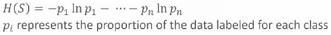

因此，对于我在数据中拥有的每个不同的类，我将拥有以下`p`个项之一，`p[1], p[2]`，依此类推，直到`p[n]`，适用于我可能拥有的`n`个不同的类。 `p`仅代表该类数据的比例。 而且，如果您实际上绘制了每个项`pi* ln * pi`的外观，则外观将如下图所示：


您为每个单独的类加起来。 例如，如果数据的比例（即，对于给定的类别）为 0，则对总熵的贡献为 0。如果所有内容都是该类别，则对总熵的贡献也为 0，因为在任一情况下，如果什么都是此类，或者什么都不是此类，则对整体熵没有任何贡献。

中间的东西是类的熵，这种分类和其他东西混合在一起。 将所有这些项加在一起时，最终得到整个数据集的整体熵。 因此，从数学上讲，这就是它的工作原理，但是概念又非常简单。 它只是衡量数据集混乱程度，数据中事物的相同或不同程度的一种度量。

# 决策树-概念

信不信由你，给定一组训练数据，您实际上可以使 Python 生成流程图供您做出决策。 因此，如果您要对某种分类进行预测，则可以使用决策树实际查看可以在流程图的每个级别上确定的多个属性。 您可以根据实际的机器学习打印出实际的流程图，以用于做出决策。 多么酷啊？ 让我们看看它是如何工作的。

我个人发现决策树是机器学习中最有趣的应用之一。 决策树基本上为您提供了做出决策的流程图。您有一些因变量，例如我是否应该根据天气去外面玩。 当您做出取决于多个属性或多个变量的决策时，决策树可能是一个不错的选择。

天气的许多不同方面可能会影响我是否应该出去玩的决定。 例如，它可能与湿度，温度有关，而无论晴天与否。 决策树可以查看天气的所有这些不同属性或其他任何属性，并确定阈值是多少？ 在决定是否应该在户外玩耍之前，我需要针对这些属性中的每一个做出哪些决定？ 这就是一个决策树。 因此，这是一种监督学习的形式。

在此示例中，它的工作方式如下。 我将拥有某种历史天气数据集，以及有关人们是否在特定的日子玩耍的数据。 我将每天是否晴朗，湿度如何以及是否有风的数据提供给模型。 以及是否是在户外玩的好日子。 给定训练数据，决策树算法可以到达一棵树，该树为我们提供了可以打印的流程图。 看起来就像下面的流程图。 您可以根据当前属性，逐步弄清楚是否是在户外玩的好日子。 您可以使用它来预测一组新值的决策：

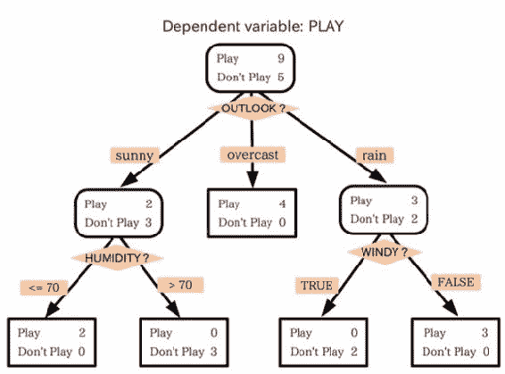

多么酷啊？ 我们有一种算法，可以根据观测数据自动为您制作流程图。 更酷的是，一旦您了解了它的工作原理，一切都变得多么简单。

# 决策树示例

假设我要构建一个系统，该系统将根据简历中的信息自动过滤掉简历。 科技公司面临的一个大问题是，我们要获得大量的履历。 我们必须决定真正邀请谁参加面试，因为将某人赶出去并实际上抽出时间进行面试可能会很昂贵。 那么，如果有一种方法可以真正获取有关实际录用人员的历史数据并将其映射到简历中找到的信息呢？

我们可以构建一个决策树，让我们浏览一份个人简历，然后说：“好，这个人实际上很有可能被录用或不被录用”。 我们可以根据该历史数据训练决策树，并为将来的候选人逐步进行决策。 那不是一件很棒的事吗？

因此，让我们制作一些在本示例中将要使用的完全捏造的招聘数据：

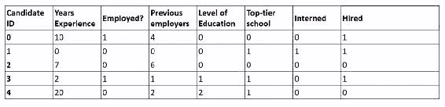

在上表中，我们有仅由数字标识符标识的候选项。 我将选择一些我认为可能有趣或有助于预测它们是否是高薪的属性。 他们有多少年的经验？ 他们目前有工作吗？ 在此之前有多少位雇主？ 他们的教育水平是多少？ 他们有什么学位？ 他们去了我们分类为一流学校的学校吗？ 他们在大学期间有实习吗？ 我们可以看一下历史数据，这里的因变量是`Hired`。 根据此信息，此人实际上是否获得了工作机会？

现在，显然有很多信息可能不在此模型中非常重要，但是我们从这些数据中训练出的决策树实际上可能在进行初步筛选以剔除某些候选人时很有用。 我们最终得到的可能是一棵看起来像下面的树：


*   因此，事实证明，在我完全捏造的数据中，任何在大学实习过的人实际上都得到了工作机会。 所以我的第一个决定点是“这个人有没有实习？” 如果是的话，请继续进行。根据我的经验，实习实际上可以很好地预测一个人的好坏。 如果他们有主动去做实习，并在那个实习中实际学到一些东西，那是一个好兆头。
*   他们目前有工作吗？ 好吧，如果他们目前被雇用，在我的一个很小的假数据集中，事实证明他们值得雇用，只是因为其他人认为他们也值得雇用。 显然，这将是现实世界中微妙的决定。
*   如果他们当前没有工作，那么他们以前的雇主少于一个吗？ 如果是，则此人从未从事过工作，也从未实习过。 可能不是一个好的招聘决定。 不要雇用那个人。
*   但是，如果他们确实有以前的雇主，他们是否至少上过一流学校？ 如果不是这样，那就太不稳定了。 如果是这样，那么是的，我们应该根据我们训练的数据聘请此人。

# 浏览决策树

这就是您浏览决策树结果的方式。 就像遍历流程图一样，算法可以为您产生这种效果真是太棒了。 该算法本身实际上非常简单。 让我解释一下该算法的工作原理。

在决策树流程图的每个步骤中，我们都可以找到可以对数据进行分区的属性，从而使下一步的数据熵最小。 因此，我们得出了一组分类结果：在这种情况下，雇用或不雇用，我们希望在该步骤中选择属性决策，以最大程度地减少下一步的熵。

在每个步骤中，我们都希望做出所有剩余的选择，从而导致尽可能多的不聘用或尽可能多的聘用决策。 我们希望使数据越来越统一，以便按照流程图进行操作，最终最终得到一组候选人，这些候选人要么全部录用，要么全部录用，因此我们可以根据决策树分类是/否决策。 因此，我们只是沿着树走下去，通过选择正确的属性来决定每一步的熵，然后继续进行直到耗尽。

这个算法有个花哨的名字。 它称为 **ID3**（**迭代二分器 3**）。 这就是所谓的贪婪算法。 因此，当它沿着树下来时，它只选择了将此时的熵最小化的属性。 现在，这实际上可能不会产生使您必须做出的选择数量最少的最佳树，但是在给定您提供的数据的情况下，它会导致树起作用。

# 随机森林技术

现在，决策树的一个问题是它们很容易过拟合，因此您最终可能会得到一个决策树，该树对于您训练过的数据非常有效，但是对以前从未见过的新朋友实际预测正确的分类可能不是那么好。 决策树都是为了为您提供的训练数据做出正确的决策，但是也许您没有真正考虑正确的属性，也许您没有给予足够的代表性样本以供学习 。 这可能会导致实际问题。

因此，为了解决这个问题，我们使用了一种称为随机森林的技术，该技术的思想是针对多个不同的决策树，以不同的方式对训练的数据进行采样。 每个决策树都从我们的训练数据集中获取不同的随机样本，并从中构造出一棵树。 然后，每个结果树都可以对正确的结果进行投票。

现在，使用同一模型对数据进行随机重采样的技术称为引导聚合或装袋。 这是我们称为集成学习的一种形式，稍后我们将详细介绍。 但是基本的想法是，我们有多棵树，如果有的话，是一棵树，每棵树都使用我们必须训练的数据的随机子样本。 然后，每棵树都可以对最终结果进行投票，这将有助于我们针对给定的一组训练数据来对抗过拟合。

随机森林可以做的另一件事是，实际上，它在每个阶段都限制了它可以选择的属性数量，同时它试图将熵降到最低。 我们可以随机选择每个级别可以选择的属性。 因此，这也使我们从树到树的变化更多，因此，我们获得了更多可以相互竞争的算法。 他们都可以使用略有不同的方法对最终结果进行投票以获得相同的答案。

这就是随机森林的工作方式。 基本上，它是决策树的森林，在决策树中，它们从不同的样本以及每个阶段可以选择的不同属性集中提取。

因此，让我们开始做一些决策树。 完成后，我们还将使用随机森林，因为 Scikit-learn 确实非常容易实现，您很快就会看到。

# 决策树-使用 Python 预测招聘决策

事实证明，决策树很容易。 实际上，仅需几行 Python 代码，它是如此的容易就很疯狂。 因此，让我们尝试一下。

我在您的书本材料中包含一个`PastHires.csv`文件，其中仅包含一些我捏造的虚假数据，这些数据是关于那些无法找到工作的人的信息。

```py
import numpy as np 
import pandas as pd 
from sklearn import tree 

input_file = "c:/spark/DataScience/PastHires.csv" 
df = pd.read_csv(input_file, header = 0) 

```

您将希望立即将我在此处用于我自己的系统（`c:/spark/DataScience/PastHires.csv`）的路径更改为您安装本书材料的任何位置。 我不确定您将其放在哪里，但是几乎可以肯定不存在。

我们将使用`pandas`读取 CSV，并从中创建一个`DataFrame`对象。 让我们继续运行代码，我们可以在`DataFrame`上使用`head()`函数来打印出前几行，并确保它看起来像是有意义的。

```py
df.head() 

```

果然我们在输出中有一些有效的数据：

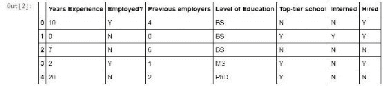

因此，对于每个候选人 ID，我们都有他们过去的工作经验，是否受雇，以前的雇主数量，他们的最高学历，是否上过一流学校以及是否进行过实习。 ; 最后，在“雇用”列中，答案是-我们知道我们是否向该人员提供了工作机会。

像往常一样，大部分工作只是在实际运行算法之前，对数据进行处理，准备数据，这就是我们在这里需要做的。 现在 Scikit-learn 要求所有内容都是数字，因此我们不能包含 Y 和 N，BS 和 MS 和 PhD。 为了使决策树模型正常工作，我们必须将所有这些东西转换为数字。 这样做的方法是在 Pandas 中使用一些简写形式，这使这些事情变得容易。 例如：

```py
d = {'Y': 1, 'N': 0} 
df['Hired'] = df['Hired'].map(d) 
df['Employed?'] = df['Employed?'].map(d) 
df['Top-tier school'] = df['Top-tier school'].map(d) 
df['Interned'] = df['Interned'].map(d) 
d = {'BS': 0, 'MS': 1, 'PhD': 2} 
df['Level of Education'] = df['Level of Education'].map(d) 
df.head() 

```

基本上，我们用 Python 制作了一个字典，将字母 Y 映射为数字 1，并将字母 N 映射为值 0。因此，我们希望将所有 Y 都转换为 1，而 Ns 转换为 0。 所以 1 表示是，0 表示否。 我们要做的只是从`DataFrame`中获取`Hired`列，然后使用字典在其上调用`map()`。 这将遍历整个`DataFrame`中的整个`Hired`列，并使用该字典查找来转换该列中的所有条目。 它返回一个新的`DataFrame`列，我将其放回`Hired`列。 这会将`Hired`列替换为已映射到 1 和 0 的列。

我们对“就业”，“顶级学校”和“实习生”做同样的事情，因此所有这些人都使用“是/否”字典进行映射。 因此，Y 和 N 分别变为 1 和 0。 对于“教育水平”，我们执行相同的技巧，我们只创建了一个字典，将 BS 分配为 0，MS 分配为 1，PhD 分配为 2，然后使用该字典将这些学位名称重新映射为实际数值。 因此，如果我继续运行并再次执行`head()`，则可以看到它起作用：

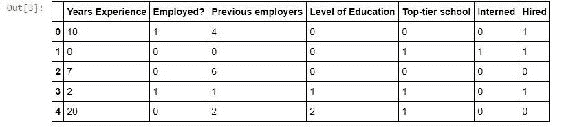

我所有的肯定是 1，我的否定是 0，并且我的教育水平现在由一个具有实际意义的数值表示。

接下来，我们需要准备一切以便实际进入决策树分类器，这并不难。 为此，我们需要将特征信息和目标列分开，这些信息是我们要根据其预测的属性，而目标列则包含了我们要预测的事物。要提取特征名称列的列表 ，我们将创建最多 6 个列的列表。我们继续进行打印。

```py
features = list(df.columns[:6]) 
features 

```

我们得到以下输出：


上面是包含我们的特征信息的列名称：多年经验，受雇？，前任雇主，受教育程度，顶级学校和实习生。 这些是我们希望预测招聘的候选人的属性。

接下来，我们构造我们的*和*向量，该向量被分配了我们要预测的内容，即`Hired`列：

```py
y = df["Hired"] 
X = df[features] 
clf = tree.DecisionTreeClassifier() 
clf = clf.fit(X,y) 

```

此代码提取整个`Hired`列，并将其命名为`y`。 然后，它将所有列用于特征数据，并将其放入`X`中。 这是所有数据和所有特征列的集合，`X`和`y`是我们的决策树分类器需要的两件事。

要实际创建分类器本身，需要执行两行代码：调用`tree.DecisionTreeClassifier()`创建分类器，然后将其拟合到特征数据（`X`）和答案（`y`）中-无论人们是否被雇用。 因此，让我们继续进行操作。

显示图形数据有些棘手，我不想在这里过多分散我们的细节，因此请考虑以下样板代码。 您无需了解 GraphViz 在这里的工作方式-点文件以及所有其他内容：对于我们现在的旅程而言，这并不重要。 实际显示决策树的最终结果所需的代码很简单：

```py
from IPython.display import Image   
from sklearn.externals.six import StringIO   
import pydot  

dot_data = StringIO()   
tree.export_graphviz(clf, out_file=dot_data,   
                         feature_names=features)   
graph = pydot.graph_from_dot_data(dot_data.getvalue())   
Image(graph.create_png()) 

```

因此，让我们继续运行它。

这就是您的输出现在应如下所示：

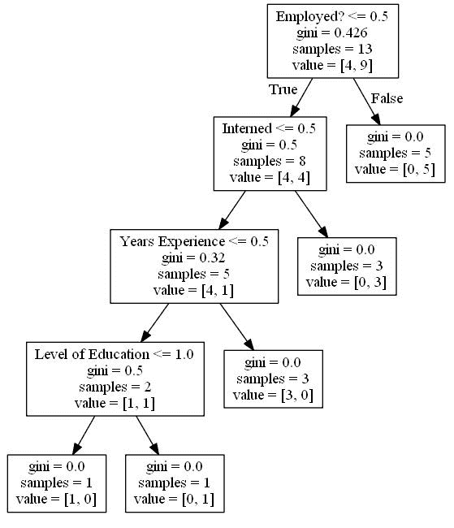

到了！ 多么酷啊？！ 我们在这里有一个实际的流程图。

现在，让我告诉您如何阅读它。 在每个阶段，我们都有一个决定。 记住我们大多数的数据是`0`或`1`。 因此，第一个决策点变为：是否就业？ 小于`0.5`？ 这意味着如果我们的就业值为 0，则为否，我们将向左移动;如果就业为 1，则为是，我们将向右移动。

那么，他们以前有工作吗？ 如果不是，请左，如果是，请右。 事实证明，在我的样本数据中，当前受雇的每个人实际上都有工作机会，所以我可以很快地说出如果您目前在受雇，是的，您值得引进，我们这里将紧跟第二层。

那么，您如何解释呢？ 基尼分数基本上是在每个步骤中使用的熵的量度。 请记住，当我们崩溃时，算法正在尝试使熵量最小化。 样本是先前决策未划分的剩余样本数。

可以说这个人被雇用了。 读取右侧叶子节点的方法是值列，该列告诉您此时我们有 0 个非聘用的候选人和 5 个非聘用的候选人。 再次，解释第一个决策点的方法是是否雇用？ 是 1，我要走到右边，这意味着他们目前正在工作，这使我进入了一个每个人都有工作机会的世界。 所以，这意味着我应该雇用这个人。

现在，让我们说这个人目前没有工作。 接下来要看的是，他们有实习吗？ 如果是的话，那么我们就是在每个人的训练数据中找到工作的机会。 因此，在那一点上，我们可以说我们的熵现在为 0（`gini=0.0000`），因为每个人都是相同的，并且他们都在这一点上得到了报价。 但是，您知道如果我们继续下去（那个人没有做过实习），我们将处于熵值为 0.32 的地步。 它越来越低，这是一件好事。

接下来，我们将看看他们有多少经验，他们是否拥有不到一年的经验？ 而且，如果情况是他们确实有一定的经验，并且到目前为止，他们是一个很好的不聘用决定。 我们最终到达熵为零的点，但是我们的训练集中剩下的所有三个样本都没有雇用。 我们有 3 个无雇用和 0 个雇用。 但是，如果他们确实经验不足，那么他们可能刚大学毕业，他们仍然值得一看。

我们要看的最后一件事是他们是否去了一所一流的学校，如果是这样，他们最终将成为一个很好的被录用的预测。 如果没有，他们最终将被录用。 我们最终得到一个属于该类别的应聘者，即不聘用和 0 录用。 鉴于候选人确实上了一所顶级学校，我们有 0 名无雇用人员和 1 名雇用人员。

因此，您可以看到，对于每种情况，只要有可能，我们就一直保持熵达到 0。

# 集成学习–使用随机森林

现在，假设我们要使用随机森林，您知道，我们担心我们可能过拟合训练数据。 创建包含多个决策树的随机森林分类器实际上非常容易。

因此，为此，我们可以使用之前创建的相同数据。 您只需要``X``和``y``向量，这就是要在其上进行预测的特征集和列：

```py
from sklearn.ensemble import RandomForestClassifier 

clf = RandomForestClassifier(n_estimators=10) 
clf = clf.fit(X, y) 

#Predict employment of an employed 10-year veteran 
print clf.predict([[10, 1, 4, 0, 0, 0]]) 
#...and an unemployed 10-year veteran 
print clf.predict([[10, 0, 4, 0, 0, 0]]) 

```

我们创建了一个随机森林分类器（也可以从 Scikit-learn 中获得），并将我们想要的森林数量传递给它。 因此，在上面的代码中，我们在随机森林中制作了十棵树。 然后，我们将其拟合到模型中。

您不必手动穿过树木，而在处理随机森林时，您无论如何也无法做到这一点。 因此，我们改为在模型上使用`predict()`函数，即在我们制作的分类器上。 我们为要预测其就业的给定候选人传递所有不同特征的列表。

如果您还记得，这些映射到以下列：多年经验，受雇？，以前的雇主，受教育程度，一流学校和实习生； 解释为数值。 我们预计将雇用 10 年的经验丰富的资深人士。 我们还预测了一名失业 10 年的老兵的就业情况。 而且，果然，我们得到了一个结果：

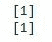

因此，在这种情况下，我们最终决定了两者的聘用决定。 但是，有趣的是有一个随机成分。 实际上，您每次都不会得到相同的结果！ 通常，失业者不会获得工作机会，如果您继续经营下去，通常会发现这种情况。 但是，装袋的随机性，自举聚合这些树的每一棵树，意味着您不会每次都得到相同的结果。 因此，也许十棵树还不够。 因此，无论如何，这是在这里学习的经验！

# 活动

对于一项活动，如果您想回去玩，请把我的输入数据弄乱。 继续编辑我们一直在探索的代码，并创建一个另类的宇宙，那里是一个混乱的世界。 例如，我现在提供工作的每个人都没有，反之亦然。 看看对您的决策树有什么影响。 只是把它弄乱，看看您能做什么并尝试解释结果。

因此，我认为决策树和随机森林是机器学习中更有趣的部分之一。 我一直认为，凭空生成这样的流程图非常酷。 因此，希望您会发现它有用。

# 集成学习

当我们谈论随机森林时，这就是集成学习的一个例子，实际上我们是将多个模型组合在一起以得出比任何单个模型都可以得出的更好的结果。 因此，让我们更深入地了解这一点。 让我们来谈谈集成学习。

那么，还记得随机森林吗？ 我们有一堆决策树，它们使用输入数据的不同子样本以及将要分支的不同属性集，当您尝试对某些事物进行最后的分类时，它们都会对最终结果进行投票。 那是集成学习的一个例子。 另一个例子：当我们讨论 K 均值聚类时，我们想到了可能使用具有不同初始随机质心的不同 K 均值模型，并让它们都对最终结果进行投票。 这也是集成学习的一个例子。

基本上，您的想法是拥有多个模型，它们可能是同一类型的模型，也可能是不同类型的模型，但是您可以在一组训练数据上运行所有模型，并且无论您要预测什么，它们都对模型最终结果投票。 通常，您会发现，不同模型的组合所产生的结果要比任何单个模型单独产生的结果都要好。

几年前的一个很好的例子是 Netflix 奖。 Netflix 举办了一场竞赛，他们向可以超越现有电影推荐算法的任何研究人员提供一百万美元。 获胜的方法是整体方法，实际上他们可以一次运行多个推荐算法，然后让他们都对最终结果进行投票。 因此，集成学习可以是一种非常强大但简单的工具，可以提高机器学习中最终结果的质量。 现在让我们尝试探索各种类型的集成学习：

*   **自举集成或装袋**：现在，随机森林使用一种称为袋装的技术，是自举集成的简称。 这意味着我们将从训练数据中随机抽取一些子样本，并将其输入相同模型的不同版本中，然后让它们全部对最终结果进行投票。 如果您还记得的话，随机森林采用了许多不同的决策树，它们使用训练数据的不同随机样本进行训练，然后它们最终聚集在一起，对最终结果进行投票。 装袋。
*   **提升**： 提升是一个替代模型，这里的想法是从一个模型开始，但是每个后续模型都会增强处理那些被先前模型错误分类的区域的属性。 因此，您在模型上进行训练/测试，找出根本上出错的属性，然后在后续模型中增强这些属性-希望那些后续模型会更多地关注它们并正确得到它们。 因此，这就是推动发展的总体思路。 您可以运行一个模型，找出其薄弱环节，并在不断发展时将重点放在这些薄弱环节上，并基于前一个薄弱环节，继续构建越来越多的模型以不断完善该模型。
*   **模型桶**： Netflix 获奖者所做的另一项技术称为模型桶，您可能会使用完全不同的模型来预测某些事物。 也许我正在使用 K 均值，决策树和回归。 我可以在一组训练数据上同时运行所有这三个模型，并在我试图预测某些结果时让它们全部对最终分类结果进行投票。 也许这比孤立使用其中任何一个模型要好。
*   **堆叠**：堆叠具有相同的想法。 因此，您可以对数据运行多个模型，并以某种方式将结果组合在一起。 在存储桶和堆叠模型之间的细微区别是，您选择了获胜的模型。 因此，您将进行训练/测试，找到最适合您的数据的模型，然后使用该模型。 相比之下，堆叠会将所有这些模型的结果组合在一起，以得出最终结果。

现在，有一个关于集成学习的整个研究领域，试图找到进行集成学习的最佳方法，如果您想听起来很聪明，通常需要大量使用贝叶斯一词。 因此，有一些非常高级的集成学习方法，但是它们都有缺点，我认为这是又一课，因为我们应该始终使用最适合自己的简单技术。

现在，所有这些都是非常复杂的技术，我在本书的范围内无法真正涉及到，但是总而言之，很难仅胜过我们已经讨论过的简单技术。 这里列出了一些复杂的技术：

*   **贝叶斯光学分类器**：从理论上讲，有一种称为贝叶斯最佳分类器的东西总是最好的，但是这是不切实际的，因为这样做在计算上是令人望而却步的。
*   **贝叶斯参数平均**：许多人试图对贝叶斯最佳分类器进行变型以使其更实用，例如贝叶斯参数平均变型。 但是它仍然容易过拟合，并且经常由于装袋而表现不佳，这与随机森林的想法相同。 您只需多次对数据进行重新采样，运行不同的模型，然后让它们全部对最终结果进行投票。 事实证明，该方法同样有效，而且简单得多！
*   **贝叶斯模型组合**：最后，有一种称为贝叶斯模型组合的东西试图解决贝叶斯最佳分类器和贝叶斯参数平均的所有缺点。 但是，归根结底，它并没有比对模型组合进行交叉验证做得更好。

同样，这些都是非常复杂的技术，很难使用。 在实践中，最好使用我们已详细讨论过的简单方法。 但是，如果您想听起来很聪明，并且经常使用贝叶斯一词，那么至少要熟悉这些技术并知道它们是什么是很好的。

因此，这就是集成学习。 再次强调，简单的技术通常是正确的选择，例如引导聚合，装袋，增强，堆叠或模型桶。 那里有许多更先进的技术，但它们在很大程度上是理论上的。 但是，至少您现在了解它们。

尝试集成学习总是一个好主意。 一次又一次地证明，它会比任何单个模型产生更好的结果，因此请务必考虑一下！

# 支持向量机概述

最后，我们将讨论**支持向量机**（**SVM**），这是对高维数据进行聚类或分类的一种非常先进的方法。

那么，如果您要预测多种特征怎么办？ SVM 可以是执行此操作的非常强大的工具，其结果可能非常好！ 它的内幕非常复杂，但是重要的是要了解何时使用它以及它在更高层次上如何工作。 因此，让我们现在介绍 SVM。

支持向量机是一个花哨的名字，实际上是一个花哨的概念。 但幸运的是，它非常易于使用。 重要的是要知道它的作用以及它的优点。 因此，支持向量机很好地用于对高维数据进行分类，这意味着很多不同的特征。 因此，使用 K 均值聚类之类的数据来对具有二维的数据进行聚类很容易，例如，一个轴上的年龄，而另一个轴上的收入。 但是，如果我要尝试预测许多不同的特征，该怎么办？ 好吧，支持向量机可能是这样做的好方法。

支持向量机找到可以在其上划分数据的高维支持向量（从数学上讲，这些支持向量定义了超平面）。 也就是说，在数学上，支持向量机可以做的是找到更高维的支持向量（这就是它的名字），它定义了将数据分成不同群集的更高维平面。

显然，这一切使数学很快变得很奇怪。 幸运的是，`scikit-learn`包将为您完成所有操作，而无需您真正参与其中。 在幕后，您需要了解，尽管它使用了一种称为核技巧的东西来实际上找到那些在较低维度上可能不明显的支持向量或超平面。 您可以使用不同的核，以不同的方式执行此操作。 要点是，如果您拥有具有许多不同特征的高维数据，并且可以使用具有不同计算成本并且可以更好地解决当前问题的不同核，则 SVM 是一个不错的选择。

重要的一点是，SVM 使用一些先进的数学技巧对数据进行聚类，并且可以处理具有许多特征的数据集。 它也相当昂贵-“核技巧”是唯一使之成为可能的事情。

我想指出的是，SVM 是一种监督学习技术。 因此，我们实际上将在一组训练数据上对其进行训练，并且我们可以使用它来对未来看不见的数据或测试数据进行预测。 它与 K 均值聚类有点不同，并且 K 均值完全不受监督。 相比之下，使用支持向量机，它是根据实际训练数据进行训练的，其中您可以对可以学习的某些数据集进行正确分类的答案。 因此，如果您愿意，SVM 对于分类和群集很有用-但这是一种监督技术！

您经常在 SVM 中看到的一个示例是使用一种称为支持向量分类的方法。 典型示例使用鸢尾花数据集，该数据集是 Scikit-learn 附带的示例数据集之一。 这组是对不同花朵的分类，对不同鸢尾花及其物种的不同观察。 想法是使用有关每朵花的花瓣的长度和宽度以及每朵花的萼片的长度和宽度的信息对这些信息进行分类。 （显然，萼片是花瓣下面的一个支撑结构。到目前为止，我也不知道。）那里有四个维度的属性；每个维度都有一个维度。 你有花瓣的长度和宽度，以及萼片的长度和宽度。 给定该信息，您可以使用它来预测鸢尾花的种类。

以下是使用 SVC 进行此操作的示例：基本上，我们将萼片宽度和萼片长度投影到了二维，因此我们可以对其进行可视化显示：

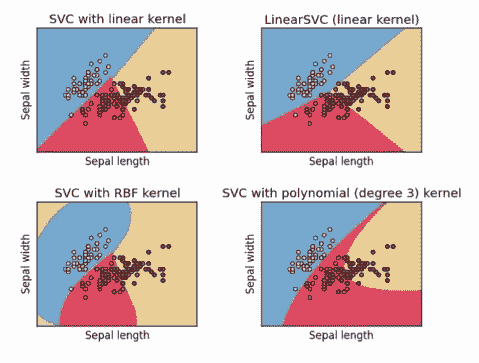

使用不同的核，您可能会得到不同的结果。 如上图所示，带有线性核的 SVC 会产生很多东西。 您可以使用多项式核或更高级的核，它们可能会向下投影到二维曲线，如图所示。 您可以通过这种方式进行一些漂亮的分类。

这些具有增加的计算成本，并且它们可以产生更复杂的关系。 但同样，在这种情况下，过多的复杂性可能会产生误导性的结果，因此您需要小心并在适当的时候实际使用训练/测试。 由于我们正在进行监督学习，因此您实际上可以进行训练/测试并找到合适的模型，或者使用整体方法。

您需要为手头的任务找到合适的核。 对于多项式 SVC 之类的东西，使用什么度数多项式是正确的？ 甚至线性 SVC 之类的东西也会具有与之相关的不同参数，您可能需要对其进行优化。 对于一个真实的示例，这将更有意义，所以让我们深入研究一些实际的 Python 代码，并查看其工作原理！

# 通过 Scikit-learn 使用 SVM 将人员聚类

让我们在这里尝试一些支持向量机。 幸运的是，使用起来比理解起来容易得多。 我们将回到用于 K 均值聚类的同一示例，在该示例中，我将创建一些有关一百个随机人的年龄和收入的虚构聚类数据。

如果您想回到 K 均值聚类部分，您可以了解更多有关生成伪造数据的代码背后的想法。 如果您准备好了，请考虑以下代码：

```py
import numpy as np 

#Create fake income/age clusters for N people in k clusters 
def createClusteredData(N, k): 
    pointsPerCluster = float(N)/k 
    X = [] 
    y = [] 
    for i in range (k): 
        incomeCentroid = np.random.uniform(20000.0, 200000.0) 
        ageCentroid = np.random.uniform(20.0, 70.0) 
        for j in range(int(pointsPerCluster)): 
            X.append([np.random.normal(incomeCentroid, 10000.0),  
            np.random.normal(ageCentroid, 2.0)]) 
            y.append(i) 
    X = np.array(X) 
    y = np.array(y) 
    return X, y 

```

请注意，由于我们在这里使用监督学习，因此我们不仅再次需要特征数据，而且还需要训练数据集的实际答案。

`createClusteredData()`函数在这里的作用是根据年龄和收入为一群聚集在`k`点附近的人们创建随机数据，并返回两个数组。 第一个数组是特征数组，我们将其称为`X`，然后将要预测的事物数组称为`y`。 在 Scikit-learn 中，很多时候创建可以预测的模型时，这是它需要的两个输入，特征向量列表以及您要预测的事物。 可以学习。 因此，我们将继续进行操作。

因此，现在我们将使用`createClusteredData()`函数创建具有 5 个不同群集的 100 个随机人员。 我们将创建一个散点图来说明它们，并查看它们的降落位置：

```py
%matplotlib inline 
from pylab import * 

(X, y) = createClusteredData(100, 5) 

plt.figure(figsize=(8, 6)) 
plt.scatter(X[:,0], X[:,1], c=y.astype(np.float)) 
plt.show() 

```

下图显示了我们正在使用的数据。 每次运行此命令，您都会得到一组不同的集群。 因此，您知道，我实际上并没有使用随机种子...使生活变得有趣。

这里有一些新变化-我正在使用`plt.figure()`上的`figsize`参数来绘制更大的图。 因此，如果您需要在`matplotlib`中调整大小，就可以这样做。 我正在使用将颜色用作最终分类号的相同技巧。 因此，将我开始使用的群集的数量绘制为这些数据点的颜色。 您可以看到，这是一个非常具有挑战性的问题，这里肯定存在一些群集混合：


现在，我们可以使用线性 SVC（SVC 是 SVM 的一种形式）将其实际划分为群集。 我们将使用线性核且 C 值为`1.0`的 SVM。 C 只是一个错误惩罚项，您可以调整； 默认为`1`。 通常，您不会对此感到困惑，但是如果您正在使用集成学习或训练/测试在正确的模型上进行某种程度的融合，那么这就是您可以使用的方法之一。 然后，我们会将模型拟合到特征数据以及训练数据集的实际分类中。

```py
from sklearn import svm, datasets 

C = 1.0 
svc = svm.SVC(kernel='linear', C=C).fit(X, y) 

```

因此，让我们继续进行操作。 我不想过多地了解如何在这里实际显示结果，只需相信`plotPredictions()`是可以绘制分类范围和 SVC 的函数即可。

它可以帮助我们可视化显示不同分类的出处。 基本上，它会在整个网格上创建一个网格，它将在网格上以不同的颜色绘制来自 SVC 模型的不同分类，然后在此之上绘制原始数据：

```py
def plotPredictions(clf): 
    xx, yy = np.meshgrid(np.arange(0, 250000, 10), 
                     np.arange(10, 70, 0.5)) 
    Z = clf.predict(np.c_[xx.ravel(), yy.ravel()]) 

    plt.figure(figsize=(8, 6)) 
    Z = Z.reshape(xx.shape) 
    plt.contourf(xx, yy, Z, cmap=plt.cm.Paired, alpha=0.8) 
    plt.scatter(X[:,0], X[:,1], c=y.astype(np.float)) 
    plt.show() 

plotPredictions(svc) 

```

因此，让我们看看如何实现。 SVC 在计算上很昂贵，因此需要很长时间才能运行：

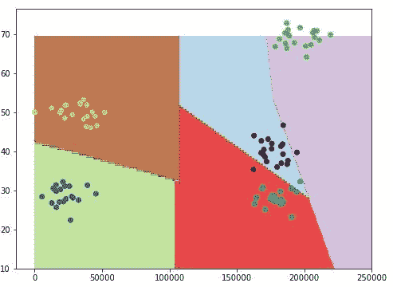

您可以在这里看到它已尽力而为。 鉴于它必须绘制直线和多边形，因此在拟合我们拥有的数据方面做得不错。 所以，您知道，它确实错过了一些-但总的来说，结果还不错。

SVC 实际上是一种非常强大的技术。 它的真正优势在于高维特征数据。 继续玩吧。 顺便说一句，如果您不仅要可视化结果，还可以在 SVC 模型上使用`predict()`函数，就像在 Scikit-learn 中的几乎所有模型上一样，可以传入您感兴趣的特征数组。 如果我要预测 40 岁的年收入 200,000 美元的人的分类，我将使用以下代码：

```py
svc.predict([[200000, 40]])

```

在我们的例子中，这将使该人进入集群 1：

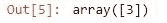

如果我有一个 65 岁的人赚了 50,000 美元，我将使用以下代码：

```py
svc.predict([[50000, 65]])

```

这就是您的输出现在应如下所示：

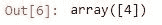

该人最终将出现在集群编号 2 中，无论在此示例中代表什么。 所以，继续玩吧。

# 活动

现在，线性只是您可以使用的许多核之一，就像我说的那样，您可以使用许多不同的核。 其中之一是多项式模型，因此您可能想尝试一下。 请继续并查找文档。 查看文档是对您的好习惯。 如果您打算以任何深度使用 Scikit-learn，则可以使用许多不同的功能和选项。 因此，请在线查找 Scikit-learn，找出 SVC 方法的其他核，然后尝试一下，看看您是否获得了更好的结果。

这是一个小练习，不仅是与 SVM 和各种 SVC 一起玩，还在于使您熟悉如何自己学习有关 SVC 的更多信息。 老实说，对于任何数据科学家或工程师来说，一个非常重要的特征就是能够在不知道答案的情况下自行查找信息。

所以，您知道，我不会偷懒不告诉您其他核是什么，我希望您习惯于必须自己查找这些内容的想法，因为如果您必须总是询问其他人这些事情，您在工作场所会非常快变得非常烦人。 因此，去查找它，玩转它，看看你会想到什么。

因此，这就是 SVM/SVC，这是一种非常强大的技术，可用于监督学习中的数据分类。 现在您知道了它的工作原理和使用方法，因此请把它保存在技巧包中！

# 总结

在本章中，我们看到了一些有趣的机器学习技术。 我们介绍了机器学习背后的基本概念之一，即训练/测试。 我们看到了如何使用训练/测试来尝试找到适合给定数据集的正确次数的多项式。 然后，我们分析了有监督和无监督机器学习之间的区别。

我们看到了如何实现垃圾邮件分类器，以及如何使用朴素贝叶斯技术使它能够确定电子邮件是否为垃圾邮件。 我们讨论了 K 均值聚类，这是一种无监督的学习技术，可帮助将数据分组到聚类中。 我们还看了一个使用 Scikit-learn 的示例，该示例根据收入和年龄对人们进行聚类。

然后，我们继续研究熵的概念以及如何对其进行度量。 我们介绍了决策树的概念，并给出了一组训练数据，如何实际使用 Python 生成流程图以供您实际决策。 我们还建立了一个系统，该系统可根据简历中的信息自动过滤掉简历，并预测人员的聘用决定。

我们沿途学习了集成学习的概念，最后以支持向量机为例进行了总结，这是对高维数据进行聚类或分类的一种非常先进的方法。 然后，我们继续使用 SVM 通过 Scikit-learn 将人们聚集在一起。 在下一章中，我们将讨论推荐系统。