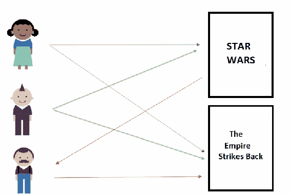
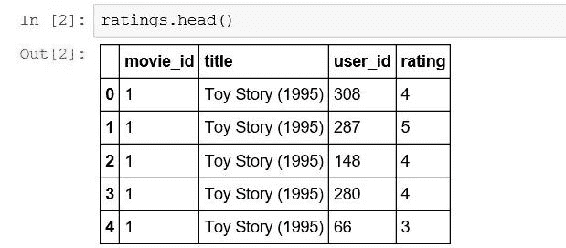
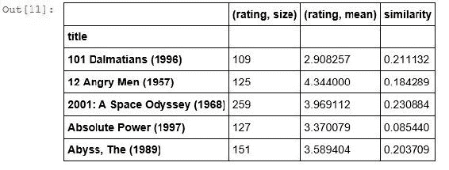
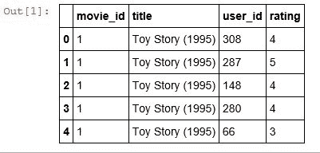
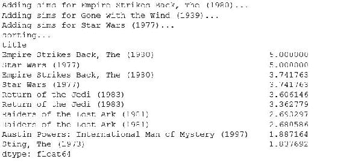
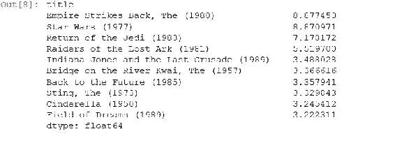

# 六、推荐系统

让我们谈谈我个人的专业领域-推荐系统，这样的系统可以根据其他人的建议向人们推荐东西。 我们将看一些这样的示例以及几种实现方法。 具体来说，两种技术称为基于用户的协同过滤和基于项目的协同过滤。 所以，让我们深入。

我的职业生涯大部分时间都在[这个页面](http://amazon.com)和 [imdb.com](http://imdb.com)度过，在那儿我做的很多事情都是开发推荐系统。 像*购买此商品的人也买了*或*为您推荐的东西*，以及为人们推荐电影的东西。 因此，这是我个人非常了解的一些事情，希望与您分享一些知识。 我们将逐步介绍以下主题：

*   什么是推荐系统？
*   基于用户的协同过滤
*   基于项目的协同过滤
*   寻找电影的相似性
*   向人们推荐电影
*   改善推荐结果

# 什么是推荐系统？

好吧，就像我说的那样，亚马逊就是一个很好的例子，我非常熟悉。 因此，如果您转到他们的推荐部分，如下图所示，您将看到它会根据您过去在网站上的行为推荐您可能有兴趣购买的东西。


推荐系统可能包括您已评分或购买的内容以及其他数据。 我无法透露细节，因为它们会追捕我，而且您知道，对我做坏事。 但是，这很酷。 您还可以想到*购买了该商品的人，同时也在亚马逊上购买了*功能作为推荐系统。

所不同的是，您在亚马逊推荐页面上看到的推荐是基于您过去的所有行为，而*购买此商品的人也购买了*或*也查看了*，诸如此类的事情，只是基于您当前正在查看的内容，并向您显示您可能也感兴趣的类似内容。事实证明，您现在正在做的事情，无论如何，可能是您的兴趣的信号。

另一个示例来自 Netflix，如下图所示（下图是 Netflix 的屏幕截图）：


它们具有多种功能，可以根据您过去喜欢或观看的电影来推荐新电影或其他您尚未看过的电影，并且按类型将其分解。 他们对事物有不同的看法，他们尝试确定自己认为您最喜欢的类型或电影类型，然后向您展示这些类型的更多结果。 因此，这是推荐系统正在运行的另一个示例。

这样做的全部目的是帮助您发现以前可能不知道的事情，因此非常酷。 您知道，它使单个电影，书籍，音乐或其他东西有机会被以前从未听说过的人发现。 因此，您知道，这不仅是一项很酷的技术，而且还可以有点公平地竞争环境，并帮助大众发现新产品。 因此，它在当今社会中起着非常重要的作用，至少我想这样！ 这样做的方法很少，我们将在本章中介绍主要方法。

# 基于用户的协同过滤

首先，让我们谈谈根据您过去的行为推荐事物。 一种技术称为基于用户的协同过滤，其工作方式如下：

顺便说一句，协同过滤只是一个奇特的名字，用于根据您所做的事情和其他所有人所做的事情对推荐内容进行推荐，好吗？ 因此，它正在查看您的行为并将其与其他人的行为进行比较，以得出您尚未听说过的可能对您来说有趣的事情。

1.  这里的想法是，我们建立一个矩阵，该矩阵包含每个用户曾经购买，查看，评价的所有事物，或者您希望基于该系统的任何感兴趣的信号。 因此，基本上，我们为系统中的每个用户最后一行，该行包含他们所做的所有操作，这些操作可能表明对特定产品有某种兴趣。 所以，想象一个表格，我有行的用户，每一列都是一个项目，好吗？ 那可能是电影，产品，网页等等。 您可以将其用于许多不同的事物。
2.  然后，我使用该矩阵来计算不同用户之间的相似度。 因此，我基本上将其每一行都视为一个向量，并且可以基于用户的行为来计算用户的每个向量之间的相似度。
3.  两个最喜欢相同事物的用户会彼此非常相似，然后我可以根据这些相似性得分对它们进行排序。 如果我可以根据他们过去的行为找到所有与您相似的用户，则可以找到与我最相似的用户，并推荐他们喜欢我从未看过的东西。

让我们看一个真实的例子，它会更有意义：


假设上图中的这位漂亮女士看过《星球大战》和《帝国反击战》，她爱他们俩。 因此，我们有一位这位女士的用户向量，将《星球大战》和《帝国反击战》评为 5 星。

我们也说 Edgy Mohawk Man 先生来了，他只看了《星球大战》。 那是他唯一见过的东西，他不知道《帝国反击战》，但不知何故，他生活在一个陌生的宇宙中，他不知道实际上有很多很多《星球大战》电影，实际上每年都在增长。

我们当然可以说，这家伙实际上和另一位女士很相似，因为他们俩都非常喜欢《星球大战》，所以他们的相似度得分可能还不错，我们可以说，好吧，什么东西是这位女士喜欢但是没看过的？ 而且，《帝国反击战》是一部，因此我们可以根据他们对《星际大战》的喜爱程度，得出这两个用户相似的信息，发现这位女士也喜欢《帝国反击战》，然后提出该建议作为对 Edgy Mohawk Man 先生。

然后，我们可以继续向他推荐《帝国反击战》，他可能会喜欢它，因为在我看来，这实际上是一部更好的电影！ 但我不会在这里与您展开极客战争。

# 基于用户的协同过滤的局限性

现在，不幸的是，基于用户的协同过滤具有一些局限性。 当我们考虑人际关系并根据项目与人之间的关系以及诸如此类的东西推荐事物时，我们的想法倾向于与人之间的关系发展。 因此，我们希望找到与您相似的人，并推荐他们喜欢的东西。 这是一种直觉的事情，但这不是最好的事情！ 以下是基于用户的协作筛选的一些限制列表：

*   一个问题是人们善变。 他们的口味总是在变化。 因此，也许上一个例子中的那个好女人经历了一段简短的科幻动作片阶段，然后她克服了这个阶段，也许在她生命的后期，她开始更多地涉足戏剧，浪漫电影或 romcoms。 那么，如果我的 Edgy Mohawk 小伙子根据她早期的科幻小说而最终与她具有高度相似性，并且最终向他推荐浪漫喜剧片，那该怎么办？ 那将是不好的。 我的意思是，在计算相似度分数时有一定的针对性，但这仍然会污染我们的数据，人们的口味会随着时间变化。 因此，将人与人进行比较并不总是一件容易的事，因为人会改变。
*   另一个问题是，系统中的人数通常比系统中的人数要多。因此，全世界有 70 亿，而且还在继续增长，全世界可能没有 70 亿部电影，或者菜单中的 70 亿个商品，你可能要推荐它们。 查找系统中所有用户之间的所有相似性的计算问题可能比查找系统中项目之间的相似性的问题要大得多。 因此，通过将系统聚焦于用户，您将使计算问题变得比原本要困难得多，因为您有很多用户，至少希望您为一家成功的公司工作。
*   最终的问题是人们做坏事。 有一种非常真实的经济动机来确保您的产品或电影或任何推荐的产品被推荐给人们，并且有些人试图通过游戏系统来实现他们的新电影，新产品或新产品的实现。 新书或其他内容。

通过创建新用户并让他们进行一系列喜欢很多受欢迎的物品然后又喜欢您的物品的事件，在系统中制造假角色很容易。 这就是所谓的**先验攻击**，我们理想情况下希望拥有一个可以应对这种情况的系统。

关于如何在基于用户的协同过滤中检测和避免这些先发攻击的研究很多，但是一个更好的方法是使用完全不同的方法，这种方法不太容易受到系统游戏的影响。

那是基于用户的协同过滤。 再次，这是一个简单的概念-您根据用户的行为查看他们之间的相似性，并推荐用户喜欢的东西，这些东西与您相似，而您尚未看到。 现在，确实有我们所讨论的局限性。 因此，让我们谈谈使用基于项目的协同过滤技术将整个事情颠倒过来的事情。

# 基于项目的协同过滤

现在，让我们尝试使用一种基于项目的协同过滤技术来解决基于用户的协同过滤中的一些缺点，我们将看到这种方法如何更强大。 它实际上是亚马逊内部使用的技术之一，他们已经公开讨论过这一点，所以我可以告诉你很多，但是让我们看看为什么这是一个好主意。 通过基于用户的协同过滤，我们的建议基于人与人之间的关系，但是如果我们将其翻转并基于项目之间的关系又会如何呢？ 这就是基于项目的协同过滤。

# 了解基于项目的协同过滤

这将借鉴一些见解。 一方面，我们谈到了人们善变，他们的品味会随着时间而变化，因此根据他们过去的行为将一个人与另一个人进行比较变得非常复杂。 人们具有不同的阶段，他们具有不同的兴趣，您可能没有将处于同一阶段的人们彼此进行比较。 但是，一个项目将永远是任何东西。 电影永远是电影，永远不会改变。 《星球大战》将永远是《星球大战》，直到乔治·卢卡斯（George Lucas）稍加修改，但在大多数情况下，物品的变化不会像人们那样大。 因此，我们知道这些关系是更永久的，并且在计算项目之间的相似性时可以进行更多直接比较，因为它们不会随时间变化。

另一个优点是，您要推荐的东西通常比推荐的人少。 再说一遍，世界上有 70 亿人，您可能没有在网站上提供 70 亿东西推荐给他们，因此您可以通过评估项目之间的关系而不是用户来节省大量计算资源，因为您可能拥有的商品数量少于系统中用户的数量。 这意味着您可以更频繁地运行您的建议，使它们更加最新，更新和更好！ 您可以使用更复杂的算法，因为您需要计算的关系较少，这是一件好事！

游戏系统也比较困难。 因此，我们讨论了通过创建一些假用户（这些用户喜欢一堆受欢迎的东西，然后创建您要推广的东西）来玩基于用户的协同过滤方法有多么容易。 使用基于项目的协同过滤将变得更加困难。 您必须通过游戏系统来考虑物品之间是否存在关联，并且由于您可能没有能力基于许多其他用户来创建与其他物品具有虚假联系的假物品，因此，游戏一个基于物品的协作的过滤系统要困难得多，这是一件好事。

当我谈论游戏系统时，另一重要的事情是确保人们用他们的钱投票。 避免先令攻击或试图玩推荐系统的人的通用技术是确保信号行为基于实际花钱的人。 因此，当您根据人们实际购买的商品（而不是他们所观看的内容或点击的内容）提出建议时，您总是会获得更好，更可靠的结果，好吗？

# 基于项目的协同过滤如何工作？

好了，让我们谈谈基于项目的协同过滤是如何工作的。 这与基于用户的协同过滤非常相似，但是我们正在查看项目而不是用户。

因此，让我们回到电影推荐的示例。 我们要做的第一件事是找到同一个人观看的每对电影。 因此，我们遍历并找到了同一个人观看过的每部电影，然后我们衡量了观看该电影的所有其他人之间的相似性。 因此，通过这种方式，我们可以根据观看这两部电影的观众的收视率来计算两部电影之间的相似度。

所以，假设我有一对电影，好吗？ 也许是《星球大战》和《帝国反击》。 我找到了所有看过这两部电影的人的名单，然后将它们的收视率进行了比较，如果它们相似，那么我可以说这两部电影是相似的，因为看过这两部电影的人对它们的评分相似 。 这是这里的总体思路。 那是做到这一点的一种方式，而不仅仅是做到这一点的方式！

然后，我可以按影片对所有内容进行排序，然后按与所有相似影片的相似度进行排序，结果是*喜欢该影片的人也喜欢*或*高度评价*等等，依此类推。 就像我说的那样，这只是其中一种方式。

这是基于项目的协作筛选的第一步，首先，我根据观看每对给定电影对的人的关系来确定电影之间的关系。 当我们看下面的例子时，它将更有意义：


例如，假设上图中的一位漂亮的年轻女士看了《星球大战》和《帝国反击战》，并且都喜欢它们，因此将它们评为五颗星或类似星光。 现在，出现了 Edgy Mohawk Man 先生，他还观看了《星球大战》和《帝国反击战》，也都喜欢了它们。 因此，在这一点上，我们可以说存在某种关系，根据这两个都喜欢这部电影的用户，《星球大战》和《帝国反击战》之间存在相似之处。

我们要做的是看每对电影。 我们有一对《星球大战》和《帝国反击战》，然后我们看了看过这两个家伙的所有用户，这两个家伙，如果他们俩都喜欢，那么我们可以说他们与每个其他的人都相似。 或者，如果他们俩都不喜欢他们，我们也可以说他们彼此相似，对吗？ 因此，我们仅查看这对电影中这两个电影相关的两个用户行为的相似性得分。

因此，随之而来的是 Moustachy Lumberjack Hipster Man 先生，他观看《帝国反击战》，他生活在一个陌生的世界里，在那里他观看了《帝国反击战》，但不知道《星球大战》的第一部电影存在。


很好，我们根据这两个人的行为来计算《帝国反击战》和《星球大战》之间的关系，因此我们知道这两部电影彼此相似。 因此，考虑到 Hipster Man 先生喜欢《帝国反击战》，我们可以很有信心地说他也喜欢《星球大战》，然后我们可以推荐给他作为他的顶级电影推荐。 如下图所示：



您可以看到最终得到的结果非常相似，但是我们已经将整个事情抛在脑后了。 因此，我们将系统重点放在项目之间的关系上，而不是将系统重点放在人与人之间的关系上，这些关系仍然基于所有监视它们的人员的汇总行为。 但从根本上讲，我们正在研究项目之间的关系，而不是人与人之间的关系。 知道了？

# 使用 Python 的协同过滤

好吧，让我们开始吧！ 我们有一些将使用 Pandas 的 Python 代码以及我们可以使用的所有其他工具来创建电影推荐，而这些代码的数量却很少。

我们要做的第一件事是向您展示基于项目的协同过滤。 因此，我们将建立*观看者同时基本上也观看*，您知道，*对它评价很高的人对它评价也很高*，因此建立了电影与电影的关系。 因此，我们将基于从 MovieLens 项目获得的真实数据。 因此，如果您访问 MovieLens.org，实际上那里有一个开放的电影推荐系统，人们可以在其中对电影进行评分并获得有关新电影的推荐。

而且，它们将所有基础数​​据公开提供给像我们这样的研究人员。 因此，我们将使用一些真实的电影收视率数据-有点过时了，大约有 10 年的历史了，因此请记住这一点，但最终要在这里使用的是真实的行为数据 。 并且，我们将使用它来计算电影之间的相似度。 而且，这些数据本身很有用。 您可以使用该数据说*喜欢它的人也喜欢*。 因此，假设我正在看电影的网页。 然后，系统会说：*如果您喜欢这部电影，并且考虑到正在观看它，则可能对它感兴趣，那么您可能也喜欢这些电影*。 这就是推荐系统的一种形式，尽管我们甚至都不知道您是谁。

现在，它是真实数据，因此我们将遇到一些真实问题。 我们最初的结果看起来不会很好，所以我们将花费一些额外的时间来找出原因，这是您花费大量时间作为数据科学家纠正问题的原因，然后返回并再次运行它，直到获得有意义的结果。

最后，我们实际上将整体上进行基于项目的协同过滤，实际上，我们会根据个人的行为向他们推荐电影。 所以，让我们开始吧！

# 寻找电影相似之处

让我们应用基于项目的协同过滤的概念。 首先，电影相似性-找出哪些电影与其他电影相似。 特别是，我们将根据用户评分数据来尝试找出与《星球大战》相似的电影，然后我们会从中得到什么。 让我们潜入吧！

好的，让我们继续计算基于项目的协同过滤的前半部分，这将发现项目之间的相似性。 下载并打开`SimilarMovies.ipynb`文件。


在这种情况下，我们将基于用户行为来研究电影之间的相似性。 并且，我们将使用 GroupLens 项目中的一些真实电影收视率数据。 GroupLens.org 由使用 [MovieLens.org](http://MovieLens.org) 网站对电影进行评分的真实人提供真实的电影收视率数据，并向他们推荐要观看的新电影。

我们已经将您需要的 GroupLens 数据集中的数据文件包含在课程资料中，我们要做的第一件事是将它们导入 Pandas `DataFrame`，在此示例中，我们将真正看到 Pandas 的全部功能 。 这是很酷的东西！

# 了解代码

我们要做的第一件事是将`u.data`文件作为 MovieLens 数据集的一部分导入，这是一个制表符分隔的文件，其中包含数据集中的每个评分。

```py
import pandas as pd 

r_cols = ['user_id', 'movie_id', 'rating'] 
ratings = pd.read_csv('e:/sundog-consult/packt/datascience/ml-100k/u.data',  
                      sep='\\t', names=r_cols, usecols=range(3)) 

```

请注意，您需要在此处添加路径，以将下载的 MovieLens 文件存储在计算机上。 因此，即使我们在 Pandas 上调用了`read_csv`，它的工作方式也可以指定一个不同于逗号的分隔符。 在这种情况下，它是一个标签。

基本上，我们说的是`u.data`文件中的前三列，并将其导入到新的`DataFrame`中，其中包含三列：`user_id`，`movie_id`和`rating`。

我们最终得到的是一个`DataFrame`，每个`user_id`都有一行，它标识一个人，然后，对于他们评级的每部电影，我们都有`movie_id`，这是给定电影的数字简写， 因此《星球大战》可能是第 53 部电影或类似电影，而它们的评级是 1 到 5 颗星。 因此，我们这里有一个数据库，一个`DataFrame`，每个用户和他们评分的每部电影，好吗？

现在，我们希望能够处理电影标题，因此我们可以更直观地解释这些结果，因此我们将改用它们易于理解的名称。

如果您使用的是真正的海量数据集，则可以将其保存到最后，因为您希望使用数字，因此它们会尽可能紧凑，并且更加紧凑。 不过，出于示例和教学的目的，我们会保留标题，以便您了解发生了什么。

```py
m_cols = ['movie_id', 'title'] 
movies = pd.read_csv('e:/sundog-consult/packt/datascience/ml-100k/u.item', 
                     sep='|', names=m_cols, usecols=range(2)) 

```

MovieLens 数据集还有一个单独的数据文件，名为`u.item`，它是用管道分隔的，我们导入的前两列将是该电影的`movie_id`和`title`。 因此，现在我们有两个数据帧：`r_cols`具有所有用户评分，`m_cols`具有每个`movie_id`的所有标题。 然后，我们可以在 Pandas 中使用神奇的`merge`函数将其融合在一起。

```py
ratings = pd.merge(movies, ratings) 

```

让我们添加一个`ratings.head()`命令，然后运行那些单元格。 我们最终得到的是类似下表的内容。 那太快了！



我们最终得到一个新的`DataFrame`，其中包含用户评分的每部电影的`user_id`和评分，并且我们可以读取`movie_id`和`title`并查看其真实含义。 因此，读取方式为`user_id`编号为`Toy Story (1995)`电影`4`星级的`user_id`编号`user_id`编号为`Toy Story (1995)`电影`5`星级的`287`等，依此类推 。 而且，如果我们要继续关注这个`DataFrame`的更多内容，那么我们在浏览不同电影时会看到不同的评分。

现在，Pandas 的真正魔力进来了。因此，我们真正想要的是根据观看每对电影的所有用户来查看电影之间的关系，因此，我们最终需要每部电影的矩阵，以及每部电影的矩阵。 用户，以及每个用户对每部电影的所有评分。 Pandas 中的`pivot_table`命令可以为我们做到这一点。 它基本上可以从给定的`DataFrame`构造一个新表，几乎可以用您想要的任何方式。 为此，我们可以使用以下代码：

```py
movieRatings = ratings.pivot_table(index=['user_id'],
                                   columns=['title'],values='rating') 
movieRatings.head() 

```

因此，我们用这段代码说的是-获得我们的评级`DataFrame`并创建一个名为`movieRatings`的新`DataFrame`，我们希望它的索引为用户 ID，因此，每个`user_id`都会有一行 ，我们将每一列作为电影标题。 因此，我们将在该`DataFrame`中遇到的每个标题都有一列，并且每个单元格都将包含`rating`值（如果存在）。 因此，让我们继续运行它。

并且，我们最终得到了一个新的`DataFrame`，如下表所示：


怎么能将所有这些整合在一起对我们来说真是太神奇了。 现在，您将看到一些`NaN`值，它们代表**非数字**，以及 Pandas 如何指示缺失值。 因此，这种解释的方式是，例如`user_id`数字`1`没看电影`1-900 (1994)`，但是`user_id`数字`1`却看了`101 Dalmatians (1996)`并将它评为`2`星。 `user_id`数字`1`也观看了`12 Angry Men (1957)`并将其评为`5`星，但没有观看电影`2 Days in the Valley (1996)`，例如，好吗？ 因此，我们最终得到的基本上是一个稀疏矩阵，其中包含每个用户和每个电影，并且在用户对电影进行评分的每个路口处都有一个评分值。

因此，现在您可以看到，我们可以很容易地提取用户观看的每部电影的向量，我们还可以提取对给定电影评分的每个用户的向量，这正是我们想要的。 因此，这对于基于用户和基于项目的协同过滤都很有用，对吗？ 如果要查找用户之间的关系，可以查看这些用户行之间的相关性，但是如果要查找电影之间的相关性，则对于基于项目的协同过滤，可以根据用户行为查看列之间的相关性。 因此，这就是真正的*反转用户与项目之间的相似性*的地方。

现在，我们要进行基于项目的协同过滤，因此我们想提取列，为此，我们运行以下代码：

```py
starWarsRatings = movieRatings['Star Wars (1977)'] 
starWarsRatings.head() 

```

现在，借助于此，让我们继续提取所有对`Star Wars (1977)`评分的用户：


而且，至少在我们从`DataFrame`负责人那里获得的这个小样本中，我们可以看到实际上大多数人都在观看和评级`Star Wars (1977)`，并且每个人都喜欢它。 因此，我们最终得到了一组用户 ID 及其`Star Wars (1977)`的等级。 用户 ID `3`未对`Star Wars (1977)`进行评分，因此我们有一个`NaN`值，表示此处缺少一个值，但这没关系。 我们要确保保留那些丢失的值，以便我们可以直接比较不同电影中的列。 那么，我们该怎么做呢？

# `corrwith`函数

好吧，Pandas 一直在简化我们的工作，并且具有`corrwith`函数，您可以在以下我们可以使用的代码中看到该函数：

```py
similarMovies = movieRatings.corrwith(starWarsRatings) 
similarMovies = similarMovies.dropna() 
df = pd.DataFrame(similarMovies) 
df.head(10) 

```

该代码将继续进行操作，并将给定的列与`DataFrame`中的所有其他列相关联，并计算相关性得分并将其返回给我们。 因此，我们在这里所做的是在整个`movieRatings`数据帧上使用`corrwith`，即用户电影评分的整个矩阵，仅将其与`starWarsRatings`列相关联，然后将所有缺失的结果删除为`dropna`。 因此，剩下的就是具有相关性的项目，有多个人查看了该项目，然后根据这些结果创建一个新的`DataFrame`，然后显示前 10 个结果。 再次重申一下：

1.  我们将建立《星球大战》与其他每部电影之间的相关性得分。
2.  删除所有`NaN`值，以便我们仅拥有实际存在的电影相似之处，并且有多个人对此进行评分。
3.  并且，我们将根据结果构建一个新的`DataFrame`，并查看前 10 个结果。

结果如下图所示：


我们最终得出了《星球大战》每部电影之间的相关性得分结果，例如，我们发现与电影`'Til There Was You (1997)`与`101 Dalmatians (1996)`的相关性高得令人惊讶，与电影`1-900 (1994)`的负相关性却非常弱。

现在，我们所要做的就是按照相似性得分对它进行排序，并且我们应该拥有《星球大战》中电影的顶级相似性，对吗？ 让我们继续做。

```py
similarMovies.sort_values(ascending=False) 

```

只需在生成的`DataFrame`上调用`sort_values`，Pandas 再次使它变得非常容易，并且我们可以说`ascending=False`，实际上是按相关度得分将其反向排序。 因此，让我们这样做：


好的，所以`Star Wars (1977)`的排名非常接近顶部，因为它与自身相似，但是这些其他东西又是什么呢？ 有没有搞错？ 我们可以在前面的输出中看到一些电影，例如：`Full Speed (1996)`，`Man of the Year (1995)`和`The Outlaw (1943)`。 您所知道的这些都是相当晦涩的电影，其中大多数我从未听说过，但它们与《星球大战》有着完美的关联。 有点奇怪！ 因此，显然我们在这里做错了。 会是什么呢？

好吧，事实证明，这里有一个非常合理的解释，这是一个很好的课程，它说明了为什么在完成任何种类的数据科学任务后，您总是需要检查结果，对结果提出质疑，因为经常会遗漏一些东西， 您可能需要清除数据中的某些内容，或者您​​做错了某些事情。 但是，您也应该始终对您的结果持怀疑态度，不要仅仅相信它们，好吗？ 如果这样做，您将遇到麻烦，因为如果我实际上将这些建议作为推荐给喜欢《星球大战》的人，我将被解雇。 不要被解雇！ 注意您的结果！ 因此，让我们在下一节中深入研究出了什么问题。

# 改善电影相似度的结果

让我们找出那里的电影相似之处出了什么问题。 我们经历了所有这些激动人心的工作，根据电影的用户评级向量计算电影之间的相关性得分，结果令人有些吃惊。 因此，提醒您，我们使用该技术寻找了与《星球大战》相似的电影，最后我们在顶部提出了一堆奇怪的建议，它们之间有着完美的关联。

而且，其中大多数都是非常晦涩的电影。 那么，您认为那里可能会发生什么？ 好吧，也许有意义的一件事是，我们有很多人在看《星球大战》和其他一些不起眼的电影。 由于这两部电影是由《星球大战》捆绑在一起的，所以我们最终会获得很好的相关性，但是到最后，我们是否真的要根据一个或两个观看某些电影的人的行为提出建议？ 晦涩的电影？

可能不是！ 我的意思是，世界上两个人，或者说是什么人，都在看电影《 Full Speed》，除了《星球大战》之外，他们俩都喜欢它，也许这对他们来说是一个不错的建议，但是对于剩下的世界来说，这可能不是一个好的建议。 我们需要通过限制观看某部电影的人数的最低界限来对我们的相似性具有某种置信度。 我们不能仅仅根据一个或两个人的行为来判断一部给定的电影是好的。

因此，让我们尝试使用以下代码将该见解付诸实践：

```py
import numpy as np 
movieStats = ratings.groupby('title').agg({'rating': [np.size, np.mean]}) 
movieStats.head() 

```

我们要做的是尝试找出实际上没有被很多人评价的电影，然后我们将它们扔出去看看我们能得到什么。 因此，要做到这一点，我们将采用原始评分`DataFrame`，并说`groupby('title')`，Pandas 再次具有各种魔力。 并且，这基本上将构造一个新的`DataFrame`，它将给定标题的所有行汇总在一起。

可以说，我们要专门对收视率进行汇总，并且要显示每部电影的大小，收视率数量，以及平均平均得分，该电影的平均收视率。 因此，当我们这样做时，最终会得到以下内容：


例如，这告诉我们，对于电影`101 Dalmatians (1996)`来说，`109`人们对该电影进行了评分，他们的平均评分为 2.9 星，因此得分并不是很高！ 因此，如果我们只看一下这些数据，就可以很好地说，我认为晦涩难懂的电影，例如`187 (1997)`，具有`41`等级，但是`101 Dalmatians (1996)`，我听说过，你知道`12 Angry Men (1957)`， 我听说似乎在 100 个等级附近有一个自然的截止值，这也许是使事情开始有意义的神奇值。

让我们继续前进，摆脱额定少于 100 人的电影，是的，您知道我目前在直觉上做到这一点。 正如我们稍后将讨论的那样，还有更多的原则性方法可以在其中进行实际实验，并在不同的阈值上进行训练/测试实验，以找到实际表现最佳的方法。 但首先，让我们仅使用常识并筛选出少于 100 人评分的电影。 再说一次，Pandas 真的很容易做到。 让我们用下面的例子弄清楚：

```py
popularMovies = movieStats['rating']['size'] >= 100 
movieStats[popularMovies].sort_values([('rating', 'mean')], ascending=False)[:15] 

```

我们可以说`popularMovies`（一个新的`DataFrame`）将通过查看`movieStats`来构建，并且我们将仅采用评级大小大于或等于`100`的行， 然后以`mean`分级来排序，只是为了好玩，才能观看收视率最高，观看次数最多的电影。


我们这里提供的是超过 100 人评分的电影列表，按其平均评分得分排序，这本身就是一个推荐系统。 这些是好评率很高的流行电影。 显然`A Close Shave (1995)`是一部非常不错的电影，很多人都观看了，他们真的很喜欢它。

再说一次，这是一个非常古老的数据集，始于 90 年代后期，因此即使您可能不熟悉影片`A Close Shave (1995)`，也值得回顾一下并重新发现它； 将其添加到您的 Netflix！ `Schindler's List (1993)`并不是什么大惊喜，它出现在大多数顶级电影列表的顶部。 `The Wrong Trousers (1993)`，这是一部晦涩影片的另一个例子，它显然非常好，也很受欢迎。 这样一来，已经有一些有趣的发现。

现在情况看起来好了一些，所以让我们继续进行，基本提出我们新的《星球大战》`DataFrame`建议，类似于《星球大战》的电影，在这里我们仅基于出现在这个新`DataFrame`中的电影。 因此，我们将使用`join`操作，将原始的`similarMovies``DataFrame`加入仅包含大于 100 个评分的电影的新`DataFrame`中，好吗？

```py
df = movieStats[popularMovies].join(pd.DataFrame(similarMovies, columns=['similarity'])) 
df.head() 

```

在此代码中，我们基于`similarMovies`创建一个新的`DataFrame`，在其中提取`similarity`列，并将其与我们的`movieStats DataFrame`（即我们的`popularMovies DataFrame`）结合起来，然后查看合并后的结果。 而且，我们可以得到该输出！



现在，我们只限于评分超过 100 人的电影，其得分与《星球大战》相似。 因此，现在我们需要做的就是使用以下代码对它进行排序：

```py
df.sort_values(['similarity'], ascending=False)[:15] 

```

在这里，我们对它进行反向排序，我们只看一下前 15 个结果。 如果现在运行该程序，应该看到以下内容：


这看起来开始好一点了！ 因此，`Star Wars (1977)`排在首位，因为它与自身相似，`The Empire Strikes Back (1980)`是 2 号，`Return of the Jedi (1983)`是 3 号，`Raiders of the Lost Ark (1981)`也是 4 号。您知道，它仍然不完美，但是它更有意义，对吧？ 因此，您可以期待原始三部曲中的三部《星球大战》电影彼此相似，这些数据可以追溯到下三部电影之前，而且`Raiders of the Lost Ark (1981)`在风格上也与《星球大战》非常相似，而且排在第 4 位。因此，我开始对这些结果感到好一些。 仍有改进的空间，但是，嘿！ 我们得到了一些有意义的结果，哇！

现在，理想情况下，我们还将筛选出《星球大战》，您不想看到与您开始的电影本身的相似之处，但我们稍后会担心！ 因此，如果您想更多地玩这个游戏，就像我说的 100 就是最低评分数的任意截止值。 如果您确实想尝试不同的临界值，建议您回去做。 看看对结果有什么影响。 您知道，您可以在上表中看到我们真正喜欢的结果实际上有 100 多个共同点。 因此，最终`Austin Powers: International Man of Mystery (1997)`仅以`130`评分进入了很高的排名，因此 100 可能还不够高！ `Pinocchio (1940)`位于`101`，与《星球大战》不太相似，因此，您可能要考虑一个更高的阈值并查看其作用。

也请记住，这是一个很小的，有限的数据集，我们用于实验目的，它基于非常古老的数据，因此您只会看较老的电影。 因此，直观地解释这些结果可能会带来一些挑战，但结果并不差。

现在，让我们继续进行实际的基于项目的协作式过滤，在此我们向使用更完整系统的人推荐电影，接下来我们将进行介绍。

# 向人们推荐电影

好的，让我们实际构建一个成熟的推荐器系统，该系统可以查看系统中每个人的所有行为信息以及他们评价的电影，并使用它们为我们数据集中的任何给定用户实际生成最佳推荐电影。 有点神奇，它会变得如此简单，您会感到惊讶。 我们走吧！

让我们开始使用`ItemBasedCF.ipynb`文件，并开始导入已有的 MovieLens 数据集。 再说一次，我们现在使用的子集仅包含 100,000 个评分。 但是，您可以从 GroupLens.org 中获取更大的数据集，直至数百万个评分。 如果你这么倾向。 但是请记住，当您开始处理那些非常大的数据时，您将限制在一台计算机上可以做的事情以及 Pandas 可以处理的事情。 事不宜迟，这是第一段代码：

```py
import pandas as pd 

r_cols = ['user_id', 'movie_id', 'rating'] 
ratings = pd.read_csv('e:/sundog-consult/packt/datascience/ml-100k/u.data',      
                      sep='\t', names=r_cols, usecols=range(3)) 

m_cols = ['movie_id', 'title'] 
movies = pd.read_csv('e:/sundog-consult/packt/datascience/ml-100k/u.item', 
                     sep='|', names=m_cols, usecols=range(2)) 

ratings = pd.merge(movies, ratings) 

ratings.head() 

```

就像之前一样，我们将导入`u.data`文件，其中包含每个用户的所有个人分级以及他们分级的电影，然后将其与电影标题绑定在一起，因此我们不需要只使用数字电影 ID。 继续并单击“运行单元格”按钮，最后得到以下`DataFrame`。



读取方法是，例如，`user_id`编号`308`为`Toy Story (1995)`和`4`星，以及`user_id`编号`66`为`Toy Story (1995)`和`3`星。 并且，它将包含每个用户，每个电影的每个评分。

再次，就像前面一样，我们在 Pandas 中使用了出色的`pivot_table`命令，基于以下信息构造了一个新的`DataFrame`：

```py
userRatings = ratings.pivot_table(index=['user_id'],
                                  columns=['title'],values='rating') 
userRatings.head() 

```

在这里，每一行都是`user_id`，各列由我的数据集中的所有唯一电影标题组成，并且每个单元格都包含一个评分：


我们最终得到的是上面输出中显示的极其有用的矩阵，其中包含每一行的用户和每一列的电影。 而且，对于该矩阵中的每部电影，我们基本上都有每个用户的评分。 因此，例如`user_id`数字`1`给`101 Dalmatians (1996)` 2 星级。 而且，所有这些`NaN`值仍然代表丢失的数据。 因此，这仅表示，例如`user_id`编号`1`没有对影片`1-900 (1994)`进行评分。

同样，这是一个非常有用的矩阵。 如果我们正在执行基于用户的协同过滤，则可以计算每个单独的用户评分向量之间的相关性，以找到相似的用户。 由于我们正在执行基于项目的协同过滤，因此我们对列之间的关系更感兴趣。 因此，例如，在任意两列之间进行相关性评分，这将为我们提供给定电影对的相关性评分。 那么，我们该怎么做呢？ 事实证明，Pandas 也使这件事变得非常容易。

它具有内置的`corr`函数，该函数实际上将计算整个矩阵中找到的每个列对的相关性得分-就像他们在想我们一样。

```py
corrMatrix = userRatings.corr() 
corrMatrix.head() 

```

让我们继续运行前面的代码。 这是一项在计算上相当昂贵的事情，因此花一点时间才能真正返回结果。 但是，我们有它！


那么，我们在前面的输出中有什么？ 我们这里有一个新的`DataFrame`，其中每个电影都在行和列中。 因此，我们可以查看任意两部给定电影的交集，并根据我们最初在此处获得的`userRatings`数据找到彼此之间的相关性得分。 多么酷啊？ 例如，电影`101 Dalmatians (1996)`当然与自身完美相关，因为它具有相同的用户评级向量。 但是，如果您查看`101 Dalmatians (1996)`电影与电影`12 Angry Men (1957)`的关系，则其相关得分要低得多，因为这些电影不太相似，这有意义吗？

我现在有了这个奇妙的矩阵，它将为我提供任何两部电影之间的相似度得分。 这有点令人惊奇，对于我们将要做的事情非常有用。 现在，就像前面一样，我们必须处理虚假的结果。 因此，我不想查看基于少量行为信息的关系。

事实证明，Pandas `corr`函数实际上具有一些您可以给它的参数。 一种是您要使用的实际相关性评分方法，所以我要说使用`pearson`相关性。

```py
corrMatrix = userRatings.corr(method='pearson', min_periods=100) 
corrMatrix.head() 

```

您会注意到，它也有一个`min_periods`参数，您可以给它一个参数，这基本上是说我只希望您考虑至少由 100 个人对两部电影进行评级的备份的相关性得分。 运行它将摆脱仅基于少数几个人的虚假关系。 以下是运行代码后得到的矩阵：


这与我们在项目相似度练习中所做的稍有不同，在该项相似度练习中，我们只淘汰了评分少于 100 人的电影。 我们在这里所做的是，将电影的相似性排除在外，而不到 100 人对这两部电影都评分，好吗？ 因此，您可以在前面的矩阵中看到我们有更多的`NaN`值。

实际上，即使是与自己相似的电影也被扔掉了，例如，电影`1-900 (1994)`大概只能由不到 100 人观看，因此完全被抛弃了。 但是，电影`101 Dalmatians (1996)`的相关分数为`1`，并且该数据集的这个小样本中实际上没有电影，彼此之间有 100 位共同观看者。 但是，有足够多的电影幸存下来以获得有意义的结果。

# 通过示例了解电影推荐

那么，我们如何处理这些数据？ 好吧，我们要做的是向人们推荐电影。 我们这样做的方法是查看给定人员的所有收视率，查找与他们所收视的东西相似的电影，这些电影是向该人推荐的候选对象。

让我们从创建一个假人开始为其创建建议。 我实际上已经在我们正在处理的 MovieLens 数据集中手动添加了一个伪造的用户 ID 号`0`。 您可以使用以下代码查看该用户：

```py
myRatings = userRatings.loc[0].dropna() 
myRatings 

```

这给出以下输出：


这种代表像我这样的人，他们喜欢《星球大战》和《帝国反击战》，但讨厌电影《乱世佳人》。 那么，这代表一个真正热爱星球大战但不喜欢旧风格，浪漫戏剧的人，好吗？ 因此，我将`5`星的评分定为`The Empire Strikes Back (1980)`和`Star Wars (1977)`，将`1`星的评分定为`Gone with the Wind (1939)`。 因此，我将尝试为该虚拟用户找到建议。

那么，我该怎么做呢？ 好吧，让我们开始创建一个名为`simCandidates`的序列，然后我将介绍我所评价的每部电影。

```py
simCandidates = pd.Series() 
for i in range(0, len(myRatings.index)): 
    print "Adding sims for " + myRatings.index[i] + "..." 
    # Retrieve similar movies to this one that I rated 
    sims = corrMatrix[myRatings.index[i]].dropna() 
    # Now scale its similarity by how well I rated this movie 
    sims = sims.map(lambda x: x * myRatings[i]) 
    # Add the score to the list of similarity candidates 
    simCandidates = simCandidates.append(sims) 

#Glance at our results so far: 
print "sorting..." 
simCandidates.sort_values(inplace = True, ascending = False) 
print simCandidates.head(10) 

```

对于`0`范围内的`i`到我在`myRatings`中的评分数量，我将添加与我评分的电影相似的电影。 因此，我将采用`corrMatrix` `DataFrame`，它是具有所有电影相似性的神奇数据库，并且我将使用`myRatings`创建一个相关矩阵，删除所有缺失的值，然后我将根据我对这部电影的评价程度来衡量相关得分。

因此，这里的想法是，例如，我将经历《帝国反击战》的所有相似之处，并且我会将其全部缩放 5，因为我真的很喜欢《帝国反击战》。 但是，当我经历并获得《乱世佳人》的相似性时，我只会将其缩放 1，因为我不喜欢《乱世佳人》。 因此，这将使类似于我喜欢的电影的电影具有更多的力量，而类似于我不喜欢的电影的电影具有较少的力量，好吗？

因此，我只是仔细研究并建立了相似性候选者列表，如果可以的话，推荐候选者，对结果进行排序并打印出来。 让我们看看我们得到了什么：



嘿，看起来还不错吧？ 因此，显然`The Empire Strikes Back (1980)`和`Star Wars (1977)`排名第一，因为我明确喜欢那些电影，因此我已经看过它们并对其进行评分。 但是，冒充到榜首的是`Return of the Jedi (1983)`，我们期望它和`Raiders of the Lost Ark (1981)`。

让我们开始进一步完善这些结果。 我们看到我们正在获得重复的值。 如果我们所拍的电影与我所评价的不止一部电影相似，那么它将在结果中返回不只一次，因此我们希望将它们组合在一起。 如果我确实有同一部电影，也许应该将它们加在一起，形成一个综合的，更强的推荐评分。 例如，《绝地武士》的回归与《星球大战》和《帝国反击战》都很相似。 我们该怎么做？

# 使用`groupby`命令合并行

我们将继续进行探索。 我们将再次使用`groupby`命令将同一电影的所有行组合在一起。 接下来，我们将总结它们的相关性得分并查看结果：

```py
simCandidates = simCandidates.groupby(simCandidates.index).sum() 
simCandidates.sort_values(inplace = True, ascending = False) 
simCandidates.head(10) 

```

结果如下：



嘿，看起来真不错！

因此`Return of the Jedi (1983)`的得分最高，为 7，`Raiders of the Lost Ark (1981)`以 5 分紧随其后，然后我们开始进入`Indiana Jones and the Last Crusade (1989)`，还有更多电影`The Bridge on the River Kwai (1957)`，`Back to the Future (1985),` `The Sting (1973`）。 这些都是我真正喜欢看的电影！ 您知道，我实际上也确实喜欢老式的迪斯尼电影，因此`Cinderella (1950)`并不像看起来那样疯狂。

我们需要做的最后一件事是过滤掉我已经评分过的电影，因为推荐你已经看过的电影没有意义。

# 使用`drop`命令删除条目

因此，我可以使用以下代码迅速删除原始评分序列中的所有行：

```py
filteredSims = simCandidates.drop(myRatings.index) 
filteredSims.head(10) 

```

运行该命令，将使我看到最终的前 10 个结果：


我们终于得到它了！ `Return of the Jedi (1983)`，`Raiders of the Lost Ark (1981)`，`Indiana Jones and the Last Crusade (1989)`，对于我的虚拟用户来说，都是最重要的结果，并且它们都是有意义的。 我正在看几部适合家庭观看的电影，`Cinderella (1950)`，`The Wizard of Oz (1939)`，`Dumbo (1941)`可能会悄悄潜入，这可能是由于《飘》的存在，即使它被向下加权也仍然在在那儿。 而且，我们得到了结果，所以。 你有它！ 太酷了！

实际上，我们已经为给定用户生成了建议，并且可以为整个`DataFrame`中的任何用户提供建议。 因此，如果需要，请继续尝试。 我还想谈一谈如何实际使您的手变脏一点，并发挥这些结果。 尝试改善他们。

您知道这有点艺术，您需要不断迭代并尝试不同的想法和技术，直到获得越来越好的结果，并且您可以永远做到这一点。 我的意思是说，我整个职业生涯都是如此。 因此，我不希望您再花 10 年的时间像我一样尝试完善此方法，但是您可以做一些简单的事情，所以让我们来谈谈。

# 改善推荐结果

作为练习，我想挑战您，使这些建议变得更好。 因此，让我们谈谈我的一些想法，也许您也会有一些自己的想法，您可以实际尝试一下； 让您的手变脏，并尝试提出更好的电影推荐。

好的，这些推荐结果还有很多改进的余地。 关于如何根据您对该项目的评价，或者您希望为对两部给定电影的评价的最低人数选择一个阈值，我们做出了很多决定。 因此，您可以调整很多事情，可以尝试许多不同的算法，并且尝试从系统中提出更好的电影推荐可以带来很多乐趣。 因此，如果您感到满意，我正在挑战您去做！

以下是一些有关如何实际尝试改善本章结果的想法。 首先，您可以继续播放`ItembasedCF.ipynb`文件并进行修改。 因此，例如，我们看到相关方法实际上具有一些用于相关性计算的参数，我们在示例中使用了 Pearson，但是您还可以查找并尝试其他参数，看看它对结果有什么作用。 我们使用了最小周期值 100，也许这太高了，也许它太低了； 我们只是随意选择了它。 如果您使用该值怎么办？ 例如，如果您降低该值，我希望您会看一些也许您从未听说过的新电影，但对于该人可能仍然是一个不错的推荐。 或者，如果您将其提高，您将看到，除了大片之外，您一无所知。

有时，您必须考虑要从推荐系统中得到的结果。 在向人们展示他们听过的电影和他们从未听过的电影之间有一个很好的平衡吗？ 对于发现这些新电影而言，与通过观看很多他们听说过的电影对推荐系统产生信心相比，对他们来说有多重要？ 再说一遍，这是一种艺术。

我们还可以改善以下事实：即使我不喜欢《乱世佳人》，我们在结果中也看到了很多与《乱世佳人》相似的电影。 您知道我们对这些结果的加权程度低于与我喜欢的电影的相似度，但是也许这些电影实际上应该受到惩罚。 如果我非常讨厌《乱世佳人》，那么也许应该惩罚《绿野仙踪》等与《乱世佳人》的相似之处，而且，你知道他们的得分降低了而不是提高了。

这是您可以进行的另一个简单修改。 我们的用户评分数据集中可能存在一些离群值，如果我要抛弃对一些荒谬电影评分的人怎么办？ 也许他们歪曲了一切。 实际上，您可以尝试识别这些用户并将其丢弃，这是另一个想法。 而且，如果您真的想要一个大型项目，如果您真的想尽全力投入其中，则可以使用训练/测试技术来实际评估此推荐引擎的结果。 因此，如果不是用一个任意的推荐分数来求和各个电影的相关性分数，而是实际将其缩小到每个给定电影的预测等级，该怎么办？

如果我的推荐系统的输出是一部电影，并且是该电影的预测收视率，那么在训练/测试系统中，我实际上可以尝试找出我对用户实际上已经看过并收视过的电影的预测程度如何？ 好的？ 因此，我可以搁置一些收视率数据，看看我的推荐器系统能够如何预测用户对这些电影的收视率。 并且，这将是一种量化和原则性的方法来衡量此推荐引擎的错误。 但是，与此同时，还有一门艺术而不是一门科学。 即使 Netflix 奖品实际上使用了这种误差度量，即所谓的均方根误差，也是他们特别使用的误差度量，这是否真的可以衡量一个好的推荐系统？

基本上，您正在衡量推荐系统预测一个人已经看过的电影的收视率的能力。 但是，推荐器引擎的目的不是推荐一个人没有看过的，可能会喜欢的电影吗？ 那是两件事。 因此，不幸的是，要真正测量要测量的东西并不容易。 因此有时候，您确实需要遵循直觉。 而且，衡量推荐器引擎结果的正确方法是衡量您试图通过该引擎推广的结果。

也许我是想让人们看更多的电影，或者对新电影给予更高的评价，或者购买更多的东西。 与使用训练/测试相反，在真实的网站上运行实际的受控实验将是为此进行优化的正确方法。 因此，您知道的是，我在那儿进了一些细节，比我可能应该做的要多，但是教训是，您不能总是以黑白方式考虑这些问题。 有时，您不能真正地直接，定量地测量事物，而您必须使用一些常识，这就是一个例子。

无论如何，这些都是关于如何回溯并改进我们编写的此推荐器引擎的结果的一些想法。 因此，请随时调整它，看看是否可以根据自己的意愿进行改进，并从中获得乐趣。 这实际上是本书中非常有趣的一部分，所以希望您喜欢！

# 总结

因此，请尝试一下！ 看看您是否可以改善我们的初步结果。 那里有一些简单的想法可以使这些建议变得更好，也有一些更复杂的想法。 现在，没有正确或错误的答案。 我不会要你上交工作，也不会去审查你的工作。 您知道，您决定使用它并对其有所了解，然后进行实验并查看获得的结果。 这就是重点-只是为了使您更加熟悉使用 Python 处理这类事情，并更加熟悉基于项目的协同过滤背后的概念。

在本章中，我们研究了不同的推荐系统-我们排除了基于用户的协同过滤系统，并直接涉足基于项目的系统。 然后，我们使用了 Pandas 的各种功能来生成和完善我们的结果，希望您在这里已经看到了 Pandas 的力量。

在下一章中，我们将介绍更高级的数据挖掘和机器学习技术，包括 K 近邻。 我期待着向您解释这些内容，并看看它们将如何有用。