# 七、更多数据挖掘和机器学习技术

在本章中，我们将讨论更多的数据挖掘和机器学习技术。 我们将讨论一种非常简单的技术，称为 **K 最近邻**（**KNN**）。 然后，我们将使用 KNN 来预测电影的收视率。 之后，我们将继续讨论降维和主成分分析。 我们还将看一下 PCA 的示例，在该示例中，我们将 4D 数据缩小为二维，同时仍保留其方差。

然后，我们将遍历数据仓库的概念，并查看较新的 ELT 流程相对于 ETL 流程的优势。 我们将学习强化学习的有趣概念，并了解 PacMan 游戏中智能 PacMan 智能体背后使用的技术。 最后，我们将看到一些用于强化学习的奇特术语。

我们将涵盖以下主题：

*   K 最近邻的概念
*   实现 KNN 来预测电影的收视率
*   降维和主成分分析
*   具有鸢尾花数据集的 PCA 示例
*   数据仓库和 ETL 与 ELT
*   什么是强化学习
*   智能吃豆人游戏背后的工作
*   一些用于强化学习的奇特词汇

# K 近邻-概念

让我们谈谈雇主希望您了解的一些数据挖掘和机器学习技术。 我们将从一个非常简单的简称 KNN 开始。 您会惊讶于良好的监督式机器学习技术多么简单。 让我们来看看！

KNN 听起来很花哨，但实际上它是其中最简单的技术之一！ 假设您有一个散点图，并且可以计算该散点图上任意两点之间的距离。 假设您已经分类了一堆数据，可以从中训练系统。 如果我有一个新的数据点，我所要做的就是基于该距离度量查看 KNN，并让他们都对该新点的分类进行投票。

假设以下散点图正在绘制电影。 正方形代表科幻电影，三角形代表戏剧电影。 我们会说这是在评估收视率与受欢迎程度，或您可以梦寐以求的任何其他内容：


在这里，我们可以根据散点图中任意两点之间的等级和受欢迎程度来计算某种距离。 假设有一个新观点出现，一部我们不知道其类型的新电影。 我们可以做的是将`K`设置为`3`，然后将`3`最近的邻居设为散点图上的该点； 然后他们都可以对新的点/电影的分类进行投票。

您可以看到是否带了三个最近的邻居（`K = 3`），我有 2 部戏剧电影和 1 部科幻电影。 然后，我让他们全部投票，然后我们将基于最近的 3 个邻居为该新点选择戏剧的分类。 现在，如果我将这个圈子扩大到包括 5 个最近的邻居，即`K = 5`，我得到一个不同的答案。 因此，在这种情况下，我选择了 3 部科幻小说和 2 部戏剧电影。 如果让他们全部投票，我最终将得到一部关于新电影的科幻小说分类。

我们对 K 的选择可能非常重要。 您想确保它足够小，以至于您不会走得太远并开始拾取不相关的邻居，但是它必须足够大以包含足够的数据点以获得有意义的样本。 因此，通常必须使用训练/测试或类似技术来实际确定给定数据集的`K`正确值。 但是，归根结底，您必须从直觉开始，然后从那里开始工作。

这就是全部，就这么简单。 因此，这是一种非常简单的技术。 您要做的只是从散点图上选出`k`个最近的邻居，然后让他们全部对分类投票。 它确实属于监督学习，因为它使用一组已知点（即已知分类）的训练数据来告知新点的分类。

但是，让我们对其进行一些复杂的操作，并根据它们的元数据实际播放电影。 让我们看看是否可以仅根据这些电影的内在值，例如该电影的等级，其流派信息，来真正找出该电影的最近邻居：

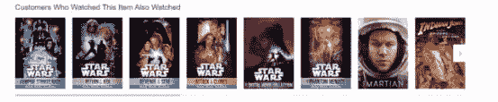

从理论上讲，我们可以仅使用 k 近邻来重新创建类似于*观看了的用户，同时也观看了*（上图是亚马逊的屏幕截图）。 而且，我可以采取进一步的措施：一旦我根据 K 最近邻算法确定了与给定电影相似的电影，就可以让他们全部对该电影的预测收视率进行投票。

这就是我们在下一个示例中要做的。 因此，您现在有了 KNN（K 最近邻）的概念。 让我们继续将其应用于实际查找彼此相似的电影，并使用最近的邻近电影来预测我们之前从未看过的另一部电影的评级的示例。

# 使用 KNN 预测电影的收视率

好吧，我们实际上将采用 KNN 的简单概念，并将其应用于更复杂的问题，并且仅根据其类型和等级信息来预测电影的等级。 因此，让我们深入研究并实际尝试仅基于 KNN 算法预测电影收视率，然后看看我们能从中得到什么。 因此，如果您想继续，请继续打开`KNN.ipynb`，即可与我一起玩。

我们要做的是仅根据电影的元数据定义电影之间的距离度量。 元数据仅指电影固有的信息，即与电影关联的信息。 具体来说，我们将看电影的流派分类。

`MovieLens`数据集中的每部电影都具有有关其流派的其他信息。 电影可以属于一种以上的流派，一种流派是诸如科幻小说，戏剧，喜剧或动画之类的东西。 我们还将根据评价该电影的人数来查看该电影的整体受欢迎程度，我们还将了解每部电影的平均评价。 我可以将所有这些信息组合在一起，从而仅基于收视率信息和体裁信息就可以基本创建两部电影之间的距离度量。 让我们看看我们得到了什么。

我们将再次使用 Pandas 来简化生活，如果您继续遵循，请再次确保将`MovieLens`数据集的路径更改为安装它的位置，几乎可以肯定这不是 Python 笔记本中的内容。

如果要继续，请继续进行更改。 和以前一样，我们只是要导入实际收视率数据文件，它是使用 Pandas 中的`read_csv()`函数输入的`u.data`。 我们要说的是它实际上有一个制表符分隔符，而不是逗号。 我们将导入数据集中每个电影评分的前三列，分别代表`user_id`，`movie_id`和评分：

```py
import pandas as pd 

r_cols = ['user_id', 'movie_id', 'rating'] 
ratings = pd.read_csv('C:\DataScience\ml-100k\u.data', sep='\t', names=r_cols, usecols=range(3)) 
ratings.head()ratings.head() 

```

如果我们继续运行并查看它的顶部，我们可以看到它正在工作，这就是输出的样子：

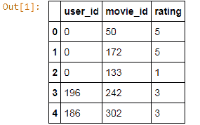

我们以带有`user_id`，`movie_id`和`rating`的`DataFrame`结尾。 例如，`user_id 0`评级为`movie_id 50`，我认为它是《星球大战》，5 星等，依此类推。

接下来我们要弄清楚的是有关每部电影的收视率的汇总信息。 我们在 Pandas 中使用`groupby()`函数将所有内容按`movie_id`进行分组。 我们将把每部电影的所有收视率合并在一起，并输出每部电影的收视率数量和平均收视率得分：

```py
movieProperties = ratings.groupby('movie_id').agg({'rating': 
 [np.size, np.mean]}) 
movieProperties.head() 

```

让我们继续做吧-很快回来，这是输出的样子：

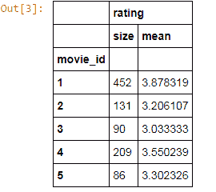

这给了我们另一个`DataFrame`，它告诉我们，例如`movie_id 1`的评分为`452`（这是其受欢迎程度的衡量标准，即实际上有多少人观看并对其进行了评级）， 平均评价得分 3.8。 因此，`452`人观看了`movie_id 1`，他们给它的平均评价为 3.87，这是相当不错的。

现在，原始评分等级对我们没有太大用处。 我的意思是我不知道`452`是否受欢迎。 因此，为了标准化，我们要做的基本上是根据每部电影的最大和最小收视率来衡量。 我们可以使用`lambda`函数来做到这一点。 因此，我们可以通过这种方式将函数应用于整个`DataFrame`。

我们要做的是使用`np.min()`和`np.max()`函数查找在整个数据集中找到的最大评分数和最小评分数。 因此，我们将拍摄最流行的电影和最不流行的电影，然后在此处找到范围，并针对该范围对所有内容进行归一化：

```py
movieNumRatings = pd.DataFrame(movieProperties['rating']['size']) 
movieNormalizedNumRatings = movieNumRatings.apply(lambda x: (x - np.min(x)) / (np.max(x) - np.min(x))) 
movieNormalizedNumRatings.head() 

```

当我们运行它时，这为我们提供了以下内容：

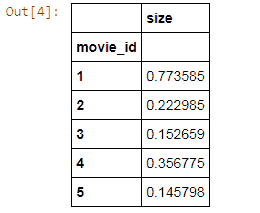

基本上，这是衡量每部电影的受欢迎程度的标准，范围是 0 到 1。因此，这里的 0 分意味着没有人观看，这是最受欢迎的电影，而`1`分意味着每个人观看的电影是最受欢迎的电影，或更具体地说，是大多数人观看的电影。 因此，我们现在可以衡量电影的受欢迎程度，并将其用于距离指标。

接下来，让我们提取一些常规信息。 因此，事实证明，存在一个`u.item`文件，该文件不仅包含影片名称，而且还包含每个影片所属的所有流派：

```py
movieDict = {} 
with open(r'c:/DataScience/ml-100k/u.item') as f: 
    temp = '' 
    for line in f: 
        fields = line.rstrip('\n').split('|') 
        movieID = int(fields[0]) 
        name = fields[1] 
        genres = fields[5:25] 
        genres = map(int, genres) 
        movieDict[movieID] = (name, genres,      
        movieNormalizedNumRatings.loc[movieID].get('size'),movieProperties.loc[movieID].rating.get('mean')) 

```

上面的代码实际上将通过`u.item`的每一行。 我们正在努力地做到这一点； 我们没有使用任何 Pandas 函数； 这次我们将使用直接 Python。 同样，请确保将路径更改为安装此信息的位置。

接下来，我们打开`u.item`文件，然后一次遍历文件中的每一行。 我们在末尾去除新行，并根据该文件中的竖线分隔符对其进行分割。 然后，我们提取`movieID`，电影名称和所有单个类型字段。 因此，基本上，在此源数据的 19 个不同字段中有一堆 0 和 1，其中每个字段代表一个给定的体裁。 然后，我们最后构建一个 Python 字典，将电影 ID 映射到它们的名称，流派，然后还折回我们的收视率信息。 因此，我们将使用 0 到 1 的比例来命名，类型，受欢迎程度以及平均评分。 因此，这就是这小段代码。 让我们运行它！ 而且，仅查看最终结果，我们可以提取`movie_id 1`的值：

```py
movieDict[1] 

```

以下是前面代码的输出：


我们字典中`movie_id 1`的条目 1 恰好是《玩具总动员》，您可能听说过 1995 年的皮克斯老电影。 接下来是所有类型的列表，其中 0 表示它不属于该类型，1 表示它不属于该类型。 `MovieLens`数据集中有一个数据文件，该文件将告诉您这些流派字段实际上对应于什么。

就我们的目的而言，这实际上并不重要，对吧？ 我们只是试图根据电影的类型来衡量电影之间的距离。 那么，在数学上所有重要的事情是，这个流派向量与另一部电影有多相似，好吗？ 实际类型本身并不重要！ 我们只想看看两部电影的流派分类相同或不同。 因此，我们具有该类型列表，具有计算出的受欢迎程度得分，并且具有“玩具总动员”的平均或平均评分。 好的，让我们继续前进，弄清楚如何将所有这些信息组合在一起成为距离度量，以便例如可以找到“玩具总动员”中`k`个最接近的邻居。

我相当随意地计算了此`ComputeDistance()`函数，该函数需要两个电影 ID 并计算两者之间的距离得分。 首先，我们将基于两个流派向量之间的余弦相似性度量，基于相似度。 就像我说的那样，我们将仅获取每部电影的流派列表，看看它们之间的相似程度。 同样，`0`指示它不是该类型的一部分，`1`指示它是该类型的一部分。

然后，我们将比较受欢迎程度得分，并仅采用原始差异，这两个受欢迎程度得分之间的差异的绝对值，并将其用于距离度量。 然后，我们将仅使用该信息来定义两部电影之间的距离。 因此，例如，如果我们计算电影 ID 2 和 4 之间的距离，则此函数将仅基于该电影的受欢迎程度以及这些电影的类型返回一些距离函数。

现在，想象一下一个散点图，就像我们在前面各节的示例中所看到的那样，其中一个轴可能是基于相似度度量的类型相似性的度量，另一个轴可能是受欢迎程度，好吗？ 我们只是在发现这两件事之间的距离：

```py
from scipy import spatial 

def ComputeDistance(a, b): 
    genresA = a[1] 
    genresB = b[1] 
    genreDistance = spatial.distance.cosine(genresA, genresB) 
    popularityA = a[2] 
    popularityB = b[2] 
    popularityDistance = abs(popularityA - popularityB) 
    return genreDistance + popularityDistance 

ComputeDistance(movieDict[2], movieDict[4]) 

```

在此示例中，我们尝试使用电影 2 和 4 之间的距离度量来计算距离，最终得到 0.8 分：

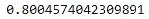

记住，相距遥远意味着它不相似，对吧？ 我们想要距离最近的邻居。 因此，0.8 的分数在 0 到 1 的范围内是一个非常高的数字。这告诉我，这些电影实际上并不相似。 让我们进行快速的理智检查，看看这些电影到底是什么：

```py
print movieDict[2] 
print movieDict[4] 

```

原来是 GoldenEye 和 Get Shorty 这两个电影，与其他电影截然不同：

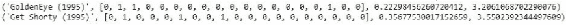

您知道，您有 James Bond 动作冒险片和一部喜剧电影-一点都不相似！ 它们在人气上实际上是可比的，但是在风格上却有所不同。 所以，让我们把它们放在一起！

接下来，我们将编写一些代码以实际获取一些给定的 movieID 并找到 KNN。 因此，我们要做的就是计算玩具总动员和电影词典中所有其他电影之间的距离，并根据它们的距离得分对结果进行排序。 这就是下面的几段代码。 如果您想花点时间围绕它，那很简单。

我们有一个`getNeighbors()`小函数，可以拍摄我们感兴趣的电影以及我们要查找的 K 个邻居。 它将遍历我们拥有的每部电影； 如果实际上是与我们正在看的电影不同的电影，它将计算之前的距离得分，并将其添加到我们拥有的结果列表中，并对结果进行排序。 然后，我们将得出 K 个最佳结果。

在此示例中，我们将`K`设置为 10，找到 10 个最近的邻居。 我们将使用`getNeighbors()`找到 10 个最近的邻居，然后迭代所有这 10 个最近的邻居并计算每个邻居的平均评分。 该平均收视率将使我们了解到有关电影的收视率预测。

副作用是，我们还基于距离函数获得了 10 个最近的邻居，我们可以称其为相似的电影。 因此，该信息本身很有用。 回到“观看过的顾客也观看过”的示例，如果您想做一个仅基于此距离度量而非实际行为数据的类似函数，那么这可能是一个合理的起点，对吧？

```py
import operator 

def getNeighbors(movieID, K): 
    distances = [] 
    for movie in movieDict: 
        if (movie != movieID): 
            dist = ComputeDistance(movieDict[movieID], 
 movieDict[movie]) 
            distances.append((movie, dist)) 
    distances.sort(key=operator.itemgetter(1)) 
    neighbors = [] 
    for x in range(K): 
        neighbors.append(distances[x][0]) 
    return neighbors 

K = 10 
avgRating = 0 
neighbors = getNeighbors(1, K) 
for neighbor in neighbors: 
    avgRating += movieDict[neighbor][3] 
    print movieDict[neighbor][0] + " " + 
 str(movieDict[neighbor][3]) 
    avgRating /= float(K) 

```

因此，让我们继续进行此操作，看看最终会得到什么。 以下代码的输出如下：

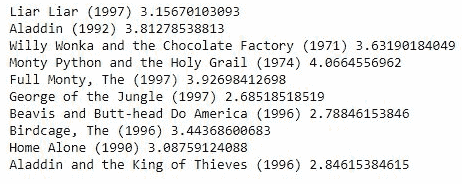

结果并非没有道理。 因此，我们以电影《玩具总动员》（玩具总动员）为例，该电影名为 movieID 1，对于最近的前 10 位邻居，我们从中得到的都是喜剧和儿童电影的不错选择。 因此，鉴于《玩具总动员》是一部受欢迎的喜剧和儿童电影，我们还得到了许多其他的喜剧和儿童电影。 因此，它似乎有效！ 我们不必使用一堆花哨的协同过滤算法，这些结果还不错。

接下来，让我们使用 KNN 来预测等级，在此示例中，我们将等级视为分类：

```py
avgRating 

```

以下是前面代码的输出：

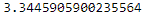

我们最终得出的预期评分为 3.34，与该电影的实际评分为 3.87 并没有什么不同。 所以不是很好，但是也还不错！ 考虑到该算法多么简单，我的意思是它实际上出奇地好！

# 活动

此示例中的大多数复杂性仅在于确定距离度量，并且您知道我们有意在那里花了一点时间只是为了保持它的趣味性，但您可以做任何您想做的事情。 因此，如果您想摆弄这个，我绝对鼓励您这样做。 我们为 K 选择 10 的原因完全是凭空产生的，我只是弥补了这一点。 这对不同的 K 值有何反应？ 较高的 K 值会得到更好的结果吗？ 还是 K 值较低？ 有关系吗？

如果您确实想进行更多的练习，则可以尝试将其应用于训练/测试，以实际找到最能根据 KNN 预测给定电影收视率的 K 值。 而且，您可以使用不同的距离度量标准，我也可以做到这一点！ 因此，以距离度量为基准，也许您可​​以使用不同的信息来源，或者以不同的方式衡量事物。 这可能是一件有趣的事情。 也许流行程度并不像流派信息那么重要，或者反之亦然。 看看对您的结果有什么影响。 因此，继续使用这些算法，使用代码并运行它，看看能得到什么！ 而且，如果您确实找到了改善此问题的重要方法，请与同学分享。

那就是 KNN 在行动！ 因此，这是一个非常简单的概念，但实际上可能非常强大。 因此，您已经拥有了：类似电影，仅基于类型和受欢迎程度而已，仅此而已。 出奇的好！ 而且，我们使用 KNN 的概念实际使用那些最近的邻居来预测新电影的收视率，而且效果也很好。 因此，这就是 KNN 的作用，非常简单的技术，但通常效果很好！

# 降维和主成分分析

好了，是时候让所有迷幻！ 我们将要讨论更高的尺寸和降维。 听起来吓人！ 其中涉及一些复杂的数学运算，但是从概念上讲，它并不像您想象的那么难掌握。 因此，接下来让我们讨论降维和主成分分析。 听起来很戏剧性！ 通常，当人们谈论这一点时，他们所谈论的是一种称为主成分分析或 PCA 的技术，以及一种称为奇异值分解或 SVD 的特定技术。 因此，PCA 和 SVD 是本节的主题。 让我们开始吧！

# 降维

那么，维数的诅咒是什么？ 好吧，很多问题可以认为是具有许多不同的维度。 因此，例如，当我们进行电影推荐时，我们拥有各种电影的属性，每个单独的电影都可以认为是该数据空间中自己的维度。

如果您有很多电影，那就是很多方面，而您的头真的不能超过 3 个，因为这就是我们成长所需要的。 您可能拥有一些您关心的具有多种不同特征的数据。 您知道，稍后我们将看一个要分类的花朵示例，该分类基于花朵的 4 种不同测量值。 这 4 个不同的特征，这 4 个不同的度量可以表示 4 个维度，这又很难可视化。

由于这个原因，存在降维技术以找到一种将高维信息还原为低维信息的方法。 这不仅可以使查看和分类变得更加容易，而且对于诸如压缩数据之类的事情也很有用。 因此，通过保留最大的方差量，同时减少维度的数量，我们可以更紧凑地表示数据集。 降维的一个非常普遍的应用不仅是可视化，而且还用于压缩和特征提取。 我们稍后再讨论。

降维的一个非常简单的例子可以认为是 K 均值聚类：


因此，您知道，例如，我们可能从代表数据集中许多不同维度的许多点开始。 但是，最终，我们可以将其归结为 K 个不同的质心，以及到这些质心的距离。 这是将数据精简为低维表示的一种方法。

# 主成分分析

通常，当人们谈论降维时，他们在谈论一种称为主成分分析的技术。 这是一种花哨的技术，它涉及到一些相当复杂的数学。 但是，从高层次上讲，您需要知道的是它需要一个较高维的数据空间，并且可以在该数据空间中找到较高维的平面。

这些较高维的平面称为超平面，它们由称为特征向量的事物定义。 最终，您可以选择任意数量的平面，将数据投影到那些超平面上，这些平面将成为您较低维度数据空间中的新轴：

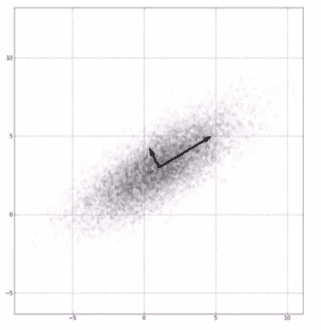

您知道的，除非您熟悉高维数学并且您之前已经考虑过，否则很难动手！ 但是，归根结底，这意味着我们要在高维空间中选择仍保留数据差异最大的平面，然后将数据投影到这些高维平面上，然后将其带入较低维空间， 好的？

您并不需要真正理解所有数学知识就可以使用它。 重要的一点是，这是将数据集缩减到较低维度空间，同时仍保留其中差异的一种非常原则性的方法。 我们讨论了将图像压缩作为此方法的一种应用。 因此，您知道，如果我想减少图像的尺寸，可以使用 PCA 将其精简为本质。

面部识别是另一个例子。 因此，如果我有一个人脸数据集，也许每个人脸都代表 2D 图像的第三维，并且我想将其归结为 SVD 和主成分分析可以成为一种识别在人脸中真正起作用的特征的方法。 因此，最终可能会更多地关注眼睛和嘴巴，例如，保留该数据集中的差异所必需的那些重要特征。 因此，它可以产生一些非常有趣且非常有用的结果，这些结果会自然地从数据中浮现出来，这很酷！

为了使其真实，我们将使用一个更简单的示例，即所谓的鸢尾花数据集。 这是 Scikit-learn 附带的数据集。 它在示例中非常常用，这是它的背后思想：因此，鸢尾花实际上在其花上有 2 种不同的花瓣。 有人称它为花瓣，它是您熟悉的花瓣，并且也有称为萼片的东西，它是花朵上这种支撑性较低的花瓣。

我们可以取一堆不同种类的鸢尾花，测量花瓣的长度和宽度，以及萼片的长度和宽度。 因此，花瓣的长度和宽度以及萼片的长度和宽度一起是 4 个不同的度量，它们对应于我们数据集中的 4 个不同维度。 我想用它来对鸢尾花可能属于哪个物种进行分类。 现在，PCA 将让我们在 2 维而不是 4 维上可视化该维，同时仍保留该数据集中的方差。 因此，让我们看看它的工作原理，并实际编写一些 Python 代码来使 PCA 发生在鸢尾花数据集上。

因此，这些就是降维，主成分分析和奇异值分解的概念。 是的，所有花哨的大话都是，这是一件花哨的事情。 您知道，我们正在设法以保留维数差异的方式将维空间缩小为维空间减少。 幸运的是，Scikit-learn 使此操作非常容易，就像实际应用 PCA 所需的仅 3 行代码一样。 因此，让我们实现这一目标吧！

# 使用鸢尾花数据集的 PCA 示例

让我们将主成分分析应用于鸢尾花数据集。 这是一个 4D 数据集，我们将缩小为 2 维。 我们将看到，即使丢弃一半的维度，我们实际上仍然可以保留该数据集中的大多数信息。 这是很酷的东西，也很简单。 让我们深入研究并做一些主成分分析，并治愈维数的诅咒。 继续并打开`PCA.ipynb`文件。

和往常一样，使用 Scikit-learn 实际上非常容易！ 同样，PCA 是降维技术。 这听起来像是科幻小说，所有这些都是关于更高维度的。 但是，只是为了使其更加具体和真实，一种常见的应用是图像压缩。 您可以将一张黑白图片的图像想象成 3 个维度，其中宽度，x 轴和 y 轴的高度分别为高，每个单元格的亮度值范围为 0 至 1，即为黑色或白色，或介于两者之间的某个值。 因此，那将是 3D 数据； 您有 2 个空间维度，然后是亮度和强度维度。

如果仅将其提炼成 2 维，那将是一个压缩图像，并且如果要使用一种尽可能保留该图像方差的技术来进行压缩，则仍然可以重建图像，而无需理论上的大量损失。 因此，这就是降维，精简为一个实际示例。

现在，我们将在此处使用使用鸢尾花数据集的另一个示例，而 Scikit-learn 将包含此示例。 它是一个各种鸢尾花测量数据集，以及该数据集中每个鸢尾花的种类分类。 就像我之前说的，它还测量了每个鸢尾花标本的花瓣和萼片的长度和宽度。 因此，在花瓣的长度和宽度以及萼片的长度和宽度之间，我们的数据集中有 4 维特征数据。

我们想将其提炼为我们可以实际查看和理解的内容，因为您的思维不能很好地处理 4 维，但是您可以很容易地在一张纸上查看 2 维。 让我们继续加载它：

```py
from sklearn.datasets import load_iris 
from sklearn.decomposition import PCA 
import pylab as pl 
from itertools import cycle 

iris = load_iris() 

numSamples, numFeatures = iris.data.shape 
print numSamples 
print numFeatures 
print list(iris.target_names) 

```

Scikit-learn 中内置了一个方便的`load_iris()`函数，无需进行其他工作即可直接为您加载该函数。 这样您就可以专注于有趣的部分。 让我们看一下数据集的样子，前面代码的输出如下：

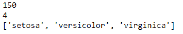

您可以看到我们正在提取该数据集的形状，这意味着我们其中有多少个数据点，即`150`，该数据集有多少个特征，或有多少维，即`4`。 因此，我们的数据集中有`150`个鸢尾花标本，其中包含 4 个维度的信息。 同样，这是总共`4`个特征的萼片的长度和宽度，以及花瓣的长度和宽度，我们可以将其视为`4`尺寸。

我们还可以打印出此数据集中的目标名称列表（即分类），并且可以看到每个鸢尾花属于以下三个不同物种之一：山，杂色或维吉尼亚。 这就是我们正在使用的数据：150 个鸢尾花标本，分为 3 个物种之一，每个鸢尾花都有 4 个特征。

让我们看一下 PCA 有多容易。 尽管这是一项非常复杂的技术，但仅需几行代码。 我们将分配整个鸢尾花数据集，并将其命名为`X`。然后，我们将创建 PCA 模型，并保留`n_components=2`，因为我们需要 2 维，即， 从 4 变到 2

我们将使用`whiten=True`，这意味着我们将标准化所有数据，并确保所有数据都很好且具有可比性。 通常，您会希望这样做以获得良好的效果。 然后，我们将 PCA 模型拟合到鸢尾花数据集`X`中。 然后，我们可以使用该模型将数据集向下转换为 2 维。 让我们继续运行它。 它发生得很快！

```py
X = iris.data 
pca = PCA(n_components=2, whiten=True).fit(X) 
X_pca = pca.transform(X) 

```

请考虑一下那里发生了什么。 实际上，我们创建了一个 PCA 模型以将 4 维降到`2`，它通过选择 2 个 4D 向量，在周围创建超平面并将 4D 数据投影到 2 维来做到这一点。 通过打印出 PCA 的实际分量，您实际上可以看到那些 4D 向量，那些特征向量。 因此，**PCA** 代表**主成分分析**，这些主成分是我们选择用来定义平面的特征向量：

```py
print pca.components_ 

```

输出到前面的代码如下：


您实际上可以查看这些值，它们对您没有多大意义，因为您无论如何都无法真正描绘出 4 个维度，但是我们这样做只是为了您可以看到它实际上是在对主要组件进行某些操作。 因此，让我们评估一下结果：

```py
print pca.explained_variance_ratio_ 
print sum(pca.explained_variance_ratio_) 

```

PCA 模型带给我们的东西`explained_variance_ratio`。 基本上，这告诉您当我将其缩小为 2 维时保留了原始 4D 数据中的多少差异。 因此，让我们继续看一下：

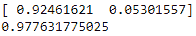

它所带给您的实际上是我们保留的 2 个维度的 2 个项目的列表。 这告诉我，在第一个维度中，我实际上可以保留数据中 92% 的方差，而第二个维度仅给了我 5% 的方差。 如果将它们放在一起，这就是我将数据投影到的这两个维度，我仍然保留了源数据中 97% 以上的方差。 我们可以看到，实际上并不需要 4 个维度来捕获此数据集中的所有信息，这很有趣。 这是很酷的东西！

如果您考虑一下，为什么会这样呢？ 好吧，也许花的整体大小与其中心的物种有一定关系。 也许是花瓣和萼片的长宽比。 您知道，对于给定的物种或给定的花朵总大小，其中某些事物可能会彼此协同移动。 因此，PCA 自己提取的这四个维度之间可能存在关系。 这很酷，功能也很强大。 让我们继续进行可视化。

将其减少到 2 维的全部目的是使我们可以对其进行漂亮的 2D 散点图绘制，至少这是我们在此小示例中的目标。 因此，我们将在此处做一些 Matplotlib 魔术。 我至少应该提到一些花哨的东西。 因此，我们要做的是创建颜色列表：红色，绿色和蓝色。 我们将创建一个目标 ID 列表，以便值 0、1 和 2 映射到我们拥有的不同鸢尾花种类。

我们要做的是将所有物种的实际名称压缩在一起。`for`循环将遍历 3 个不同的鸢尾花种类，这样做，我们将获得该种类的索引，与之关联的颜色以及该种类的实际可读名称。 我们将一次采集一个物种，并将其绘制在散点图中，仅针对具有给定颜色和给定标签的那个物种。 然后，我们将添加图例并显示结果：

```py
colors = cycle('rgb') 
target_ids = range(len(iris.target_names)) 
pl.figure() 
for i, c, label in zip(target_ids, colors, iris.target_names): 
    pl.scatter(X_pca[iris.target == i, 0], X_pca[iris.target == i, 1], 
        c=c, label=label) 
pl.legend() 
pl.show() 

```

以下是我们得出的结论：

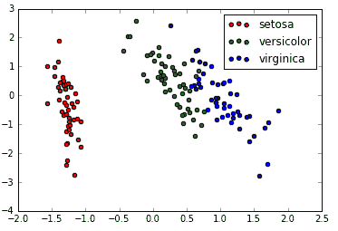

那就是我们的 4D 鸢尾数据投影到 2 维。 很有趣的东西！ 您可以看到它仍然很好地聚集在一起。 您知道，所有的维珍妮卡人坐在一起，所有的杂色都坐在中间，而山鸢尾则在左侧离开。 很难想象这些实际值代表什么。 但是，重要的是，我们已经将 4D 数据投影到 2D，并且仍然保留了方差。 我们仍然可以看到这 3 个物种之间的清晰界限。 那里混杂着一点点，这并不完美。 但总的来说，它是非常有效的。

# 活动

正如您从`explained_variance_ratio`回忆起的那样，我们实际上捕获了一个维度中的大部分差异。 花的总大小也许是对花的分类真正重要的部分。 您可以使用一项特征进行指定。 因此，如果可以，请继续修改结果。 看看您是否可以摆脱 2 维，或者 1 维而不是 2 维！ 因此，将`n_components`更改为`1`，看看您得到什么样的方差比。

怎么了？ 有道理吗？ 试一试，熟悉一下。 即降维，主成分分析和奇异值分解都在起作用。 非常非常喜欢的术语，而且您知道，公平地说，这是一些非常有趣的数学知识。 但是，正如您所看到的，这是一项非常强大的技术，并且使用 Scikit-learn 并不难应用。 因此，请将其放在工具箱中。

在那里，您拥有了！ 花卉信息的 4D 数据集归结为 2 个维度，我们既可以轻松地对其进行可视化，又可以清晰地看到我们感兴趣的分类之间的轮廓。因此，PCA 在此示例中的确非常有效。 同样，它还是用于压缩，特征提取或面部识别之类的有用工具。 因此，请将其保留在工具箱中。

# 数据仓库概述

接下来，我们将讨论一些有关数据仓库的知识。 Hadoop 的出现，一些大数据技术和云计算的出现，最近确实改变了这一领域。 因此，那里有很多流行语，但对您来说很重要的概念也要理解。

让我们深入探讨这些概念！ 让我们讨论一下 ELT 和 ETL，以及一般的数据仓库。 与特定的实际技术相反，这更多是一个概念，因此我们将在概念上进行讨论。 但是，这可能是在求职面试中出现的。 因此，请确保您了解这些概念。

我们将从总体上讨论数据仓库开始。 什么是数据仓库？ 嗯，这基本上是一个巨大的数据库，其中包含来自许多不同来源的信息，并将它们捆绑在一起。 例如，也许您在一家大型电子商务公司工作，他们可能有一个订购系统，可以提供有关人们购买到您的数据仓库中的东西的信息。

您可能还具有从 Web 服务器日志中提取到数据仓库中的信息。 这样，您就可以将网站上的浏览信息与人们最终订购的内容联系在一起。 也许您还可以结合来自客户服务系统的信息，并衡量浏览行为与一天结束时客户的满意度之间是否存在联系。

数据仓库面临的挑战是从许多不同的来源获取数据，将它们转换为某种模式，该模式使我们能够同时查询这些不同的数据源，并且它使我们能够通过数据分析获得见解。 因此，大型公司和组织通常会遇到这种情况。 在这里，我们将讨论大数据的概念。 例如，您可以拥有一个庞大的 Oracle 数据库，其中包含所有这些内容，并且可能以某种方式对其进行了分区，复制以及具有各种复杂性。 您可以通过 SQL，结构化查询语言，或通过图形工具（例如 Tableau）查询该查询，Tableau 在当今非常流行。 这就是数据分析师的工作，他们使用 Tableau 之类的工具查询大型数据集。

这就是数据分析师和数据科学家之间的区别。 您可能实际上是在编写代码，以对 AI 边界的数据执行更高级的技术，而不是仅仅使用工具从数据仓库中提取图形和关系。 这是一个非常复杂的问题。 在亚马逊，我们有一个负责数据仓库的整个部门，全职负责这方面的工作，而他们却没有足够的人，我可以告诉你； 这是一项艰巨的工作！

您知道，进行数据仓库有很多挑战。 一种是数据规范化：因此，您必须弄清楚这些不同数据源中的所有字段实际上如何相互关联？ 我如何实际上确保一个数据源中的一列与另一数据源中的一列具有可比性，并且使用相同的术语，并且以相同的比例具有相同的数据集？ 如何处理丢失的数据？ 我该如何处理损坏的数据或来自异常值或机器人等之类的数据？ 这些都是很大的挑战。 维护这些数据提要也是一个很大的问题。

当您将所有这些信息导入数据仓库时，很多事情都会出错，尤其是当您需要进行非常大的转换时，需要将从 Web 日志中保存的原始数据导入到实际的结构化数据库表中， 导入到您的数据仓库中。 当您处理整体数据仓库时，扩展规模也可能会变得棘手。 最终，您的数据将变得如此庞大，以至于这些转换本身开始成为问题。 这开始涉及 ELT 与 ETL 的整个主题。

# ETL 与 ELT

让我们首先谈谈 ETL。 那代表什么呢？ 它代表提取，转换和加载-这是进行数据仓库的传统方式。

基本上，首先要从所需的操作系统中提取所需的数据。 因此，例如，我每天可能会从我们的 Web 服务器中提取所有 Web 日志。 然后，我需要将所有这些信息转换为实际的结构化数据库表，然后将其导入我的数据仓库。

这个转换阶段可能会遍历这些 Web 服务器日志的每一行，然后将其转换成一个实际的表，在该表中，我从每个 Web 日志行中提取诸如会话 ID，它们查看的页面，时间， 引用来源以及类似的内容，我可以将其组织成表格结构，然后可以将其加载到数据仓库本身中，作为数据库中的实际表。 因此，随着数据变得越来越大，该转换步骤可能成为一个实际问题。 考虑一下要处理 Google，Amazon 或任何大型网站上的所有 Web 日志并将其转换为数据库可以吸收的内容需要多少处理工作。 这本身就成为可伸缩性的挑战，并且可能在整个数据仓库管道中引入稳定性问题。

这就是 ELT 概念出现的地方，它使所有事情都发生了变化。 它说：“好吧，如果我们不使用庞大的 Oracle 实例该怎么办？相反，如果我们使用其中的一些较新的技术，这些技术可以使我们在 Hadoop 集群上拥有更加分布式的数据库，例如 Hive，Spark 或 MapReduce 这样的数据库，从而使我们能够利用这些分布式的功能，并在加载后使用它进行转换”

这里的想法是，我们将像以前一样从一组 Web 服务器日志中提取我们想要的信息。 但是，然后，我们将直接将其加载到我们的数据存储库中，并且将使用存储库本身的功能来实际进行转换。 因此，这里的想法是，与其做一个脱机过程来将我的 Web 日志转换为结构化格式，例如，我只是将它们作为原始文本文件并一次一行地通过它们， ，借助 Hadoop 之类的强大功能，将其实际转换为结构化的格式，然后我就可以在整个数据仓库解决方案中进行查询。

像 Hive 这样的事情使您可以在 Hadoop 群集上托管大型数据库。 诸如 Spark SQL 之类的东西还使您还可以在实际上分布在 Hadoop 集群上的数据仓库上，以类似于 SQL 的数据仓库的方式进行查询。 还存在可以使用 Spark 和 MapReduce 查询的分布式 NoSQL 数据存储。 这个想法是，您不是在数据仓库中使用整体数据库，而是在 Hadoop 或某种集群之上构建的东西，实际上不仅可以扩展数据的处理和查询，而且还可以扩展该数据的转换。

再次，您首先提取原始数据，但是接下来我们将其直接加载到数据仓库系统本身中。 然后，使用可能建立在 Hadoop 上的数据仓库的功能作为第三步进行此转换。 然后，我可以一起查询事物。 因此，这是一个非常大的项目，非常重要的话题。 您知道，数据仓库本身就是一门完整的学科。 我们很快将在本书中进一步讨论 Spark，这是处理此问题的一种方式-特别是有一个称为 Spark SQL 的东西。

这里的总体概念是，如果您从基于 Oracle 或 MySQL 构建的单片数据库迁移到基于 Hadoop 构建的这些较现代的分布式数据库之一，则可以进入转换阶段，并在加载原始数据后执行它，和以前不同。 最终可能会变得更简单，更具可伸缩性，并利用当今可用的大型计算集群的强大功能。

这就是 ETL 与 ELT，这是在基于云的计算中遍历许多群集的传统方式，而今天，当我们确实拥有可用于转换大型数据集的大型计算云时，这种方式才有意义。 这就是概念。

ETL 是一种古老的做法，您需要先脱机转换一堆数据，然后再将其导入并将其加载到巨型数据仓库，整体数据库中。 但是，利用当今的技术，基于云的数据库，Hadoop，Hive，Spark 和 MapReduce，您实际上可以更高效地完成此任务，并利用集群的力量在将原始数据加载到数据仓库中之后，真正地执行该转换步骤。

这确实在改变着这个领域，了解这一点很重要。 同样，在这个主题上还有很多要学习的东西，因此我鼓励您在这个主题上进行更多的探索。 但是，这是基本概念，现在您知道人们在谈论 ETL 与 ELT 时在谈论什么。

# 强化学习

下一个主题是一个有趣的主题：强化学习。 我们可以通过吃豆人的例子来实际使用这个想法。 实际上，我们可以创建一个小小的智能 PacMan 智能体，该智能体可以很好地玩 PacMan 游戏。 您会惊讶于在这种智能吃豆人背后建立智能的技术多么简单。 让我们来看看！

因此，强化学习背后的想法是，您有某种媒介，在本例中为“吃豆人”，它探索某种空间，而在我们的示例中，空间将是“吃豆人”所在的迷宫。 ，它将了解不同条件下不同状态变化的值。


例如，在上图中，“吃豆人”的状态可能是由于它对南方有一个幽灵，对西方有一个墙以及对北方和东方具有空的空间而定义的， 吃豆人的当前状态。 可以采取的状态更改是沿给定方向移动。 然后，我可以学习朝某个方向前进的值。 因此，例如，如果我要向北迁移，则什么都不会发生，因此没有任何实际的回报。 但是，如果我向南移动，我会被幽灵摧毁，那将是一个负值。

在探索整个空间的过程中，我可以建立一套吃豆人可能处于的所有可能状态，以及在每个状态中沿给定方向移动所关联的值，这就是强化学习。 在探索整个空间时，它会针对给定状态优化这些奖励值，然后可以使用这些存储的奖励值来选择最佳决策，以在给定当前条件的情况下做出决定。 除《吃豆人》外，还有一个名为《猫与老鼠》的游戏，该游戏是一个常用的示例，稍后我们将进行介绍。

这种技术的好处是，一旦您探究了智能体可能处于的所有可能状态集，那么当您运行此智能体的不同迭代时，您很快就会获得非常好的表现。 因此，您知道，您可以基本地做出智能的吃豆人，通过运行强化学习，并让其探索可以在不同状态下做出的不同决策的值，然后存储该信息，从而给定它在未知条件下看到的未来状态时，快速做出正确的决策。

# Q 学习

因此，强化学习的一个非常具体的实现称为 Q 学习，这使我们刚才讨论的内容正式化了：

*   同样，从智能体的一组环境状态开始（我旁边有鬼吗？在我面前有药丸吗？类似的事情。），我们将其称为`s`。
*   在这些状态下，我可以执行一组可能的操作，我们将其称为`a`。 对于吃豆人，这些可能的动作是向上，向下，向左或向右移动。
*   然后我们为每个状态/动作对都有一个值，我们将其称为`Q`； 这就是为什么我们将其称为 Q 学习。 因此，对于每个状态，围绕吃豆人的一组给定条件，给定动作将具有值`Q`。 因此，例如，向上移动可能具有给定的值`Q`，而向下移动可能具有负的`Q`值，例如，这意味着遇到重影。

因此，对于吃豆人可能处于的每种可能状态，我们从`Q`值开始为 0。而且，当吃豆人探索迷宫时，随着吃豆人的坏事发生，我们减少了 “吃豆人”当时所处状态的`Q`值。 因此，如果吃豆人最终被鬼魂吞噬，我们将惩罚他在当前状态下所做的一切。 吃豆人吃东西或吃鬼东西时，吃豆人都会遇到好事，我们会为该动作增加`Q`值，以了解他所处的状态。然后， 可以做的就是使用这些`Q`值来告知 PacMan 未来的选择，并建立一种表现最佳的智能智能体，从而制作出完美的 PacMan。 从上面看到的相同的 PacMan 图像，我们可以进一步定义 PacMan 的当前状态，方法是定义他在西边有一堵墙，在北边和东边有空白空间，在南边有个幽灵。

我们可以看看他可以采取的行动：他实际上根本不能向左移动，但是他可以向上，向下或向右移动，我们可以为所有这些动作分配一个值。 向上或向右走，实际上什么也没有发生，没有药丸或点药可消耗。 但是，如果他走了，那绝对是一个负值。 可以说，对于吃豆人所处的当前状况所给出的状态，下移将是一个非常糟糕的选择。 为此，应该有一个负的`Q`值。 根本无法向左移动。 向上或向右移动或保持中性，对于给定状态的那些动作选择，`Q`值将保持为 0。

现在，您还可以稍作展望，以打造一个更加智能的智能体。 所以，我实际上距离这里获得药丸只有两步之遥。 因此，当吃豆人探索这个状态时，如果我想在下一个状态下吃该药的情况，我实际上可以将其计入上一个状态的`Q`值中。 如果您只是某种折扣因素，则根据您的时间间隔，距离的步数，您可以将所有因素综合考虑在内。 因此，这实际上是在系统中构建一点内存的一种方式。 您可以在计算`Q`时使用折扣因子“向前看”多个步骤（此处`s`是先前状态， `s'`是当前状态）：

```py
Q(s,a) += discount * (reward(s,a) + max(Q(s')) - Q(s,a))
```

因此，我在服用该药丸时遇到的`Q`值实际上可能会提高我在此过程中遇到的先前`Q`值。 因此，这是使 Q 学习更好的一种方法。

# 探索问题

我们在强化学习中遇到的一个问题是探索问题。 如何确保在探索阶段有效地涵盖了所有不同的状态以及这些状态中的动作？

# 简单的方法

一种简单的方法是始终为我到目前为止计算出的最高`Q`值的给定状态选择动作，如果有平局，则随机选择。 因此，最初我所有的`Q`值都可能为 0，而我一开始只是随机选择动作。

当我开始获得有关给定动作和给定状态的更好的`Q`值的信息时，我将开始使用它们。 但是，这最终会导致效率低下，如果我将自己束缚于始终选择迄今为止计算出的最佳`Q`值的严格算法中，那么我实际上可能会错过很多路径。

# 更好的方法

因此，一种更好的方法是在我探索时在我的动作中引入一些随机变化。 因此，我们称其为`ε`项。 因此，假设我们有一些值，我掷骰子，我有一个随机数。 如果最终小于该`ε`值，则我实际上不遵循最高的`Q`值； 我没有做有意义的事情，我只是随意走一条路尝试一下，看看会发生什么。 实际上，这使我能够在探索阶段更有效地探索更广泛的可能性，更广泛的行动，从而更有效地应对更广泛的国家。

因此，我们所做的工作可以用非常花哨的数学术语来描述，但是从概念上讲，这很简单。

# 花哨的词

我探索了针对给定状态集可以采取的某些动作，用它来告知与给定状态集给定动作相关的奖励，在完成探索之后，我可以使用该信息，`Q`值，例如，可以智能地浏览全新的迷宫。

这也可以称为马尔可夫决策过程。 同样，很多数据科学只是给一些简单的概念分配花哨的，令人生畏的名字，而在强化学习中有很多这样的名字。

# 马尔可夫决策过程

因此，如果您查找马尔可夫决策过程的定义，它就是“在结果部分随机且部分受决策者控制的情况下，对决策建模的数学框架”。

*   **决策**：在给定状态下，如果给定一组可能性，我们将采取什么行动？
*   **在结果部分为随机的情况下**：嗯，有点像我们在那里的随机探索。
*   **部分受决策者的控制**：决策者是我们计算出的`Q`值。

因此，MDP，马尔可夫决策过程是描述我们刚刚为强化学习而描述的探索算法的一种理想方式。 表示法甚至相似，状态仍然描述为`s`，而`s'`是我们遇到的下一个状态。 对于给定的`s`和`s'`状态，我们具有定义为`P[a]`的状态转换函数。 我们有`Q`值，它们基本上表示为奖励函数，对于给定的`s`和`s'`， `R[a]`值。 因此，从一种状态转移到另一种状态具有与之相关的给定奖励，并且从一种状态转移到另一种状态由状态转换函数定义：

*   状态仍然描述为`s`和`s'`
*   状态转换函数描述为`P[a](s, s')`
*   我们的`Q`值描述为奖励函数`R[a](s, s')`

因此，再次描述马尔科夫决策过程，只是描述我们所做的事情，只有一种数学符号和一个听起来更奇特的单词。 而且，如果您想听起来更聪明，也可以使用另一个名称来调用马尔可夫决策过程：离散时间随机控制过程。 听起来很聪明！ 但是概念本身就是我们刚刚描述的东西。

# 动态规划

因此，甚至可以说是花哨的话：动态规划可以用来描述我们刚刚所做的事情。 哇！ 听起来像人工智能，计算机自己编程，《终结者 2》，天网之类的东西。 但是，不，这就是我们所做的。 如果您查看动态规划的定义，则它是一种解决复杂问题的方法，可以将其分解为更简单的子问题的集合，一次解决每个子问题，并使用基于内存的数据结构理想地存储其解决方案。

下一次出现相同的子问题时，无需重新计算其解决方案，只需查找先前计算出的解决方案，从而节省了计算时间，但以（希望的）适度的存储空间开销为代价：

*   **解决复杂问题的方法**：与创建智能吃豆人相同，最终结果非常复杂。
*   **通过将其分解为更简单的子问题的集合**：例如，对于 PacMan 可能处于的给定状态，采取的最佳措施是什么。PacMan 可以陷入许多不同的状态，但这些状态中的每个状态都代表着一个更简单的子问题，我只能做出有限的选择，并且有一个正确的答案可以做出最好的举动。
*   **存储其解**：这些解是与每个状态下每个可能动作相关的`Q`值。
*   **理想情况下，使用基于内存的数据结构**：嗯，当然，我需要存储这些`Q`值并将它们与状态关联，对吗？
*   **下次再次出现相同的子问题**：下次吃豆人处于给定状态时，我具有一组`Q`值。
*   **无需重新计算其解，而是简单地查找先前计算的解**：我已经从探索阶段获得了`Q`值。
*   **从而节省了计算时间，但以适度的存储空间开销为代价**：这正是我们刚刚进行的强化学习。

我们有一个复杂的探索阶段，该阶段寻找给定状态下与每个动作相关的最佳奖励。 一旦有了针对给定状态要采取的正确行动的表格，我们就可以非常快速地使用它来使“吃豆人”以最佳方式移动，这是他之前从未见过的全新迷宫。 因此，强化学习也是动态规划的一种形式。 哇！

概括地说，您可以通过半随机地探索给定不同条件的运动的不同选择来制作智能的 PacMan 智能体，其中，这些选择是动作，而这些条件是状态。 我们会随时跟踪与每个动作或状态相关的奖励或惩罚，实际上，我们可以打折，如果您想使其更好的话，可以分多个步骤进行。

然后，我们存储最终与每个状态相关联的`Q`值，并可以使用它来告知其将来的选择。 因此，我们可以进入一个全新的迷宫，并拥有一个真正聪明的吃豆人，可以独自避开鬼魂并有效地将它们吃掉。 这是一个非常简单的概念，但是功能非常强大。 您也可以说您了解很多花哨的术语，因为它们全称为同一件事。 Q 学习，强化学习，马尔可夫决策过程，动态规划：所有这些都捆绑在同一个概念中。

我不知道，我认为通过这样一种简单的方法实际上可以制造出一种人工智能的吃豆人真是太酷了，它确实有效！ 如果您想更详细地研究它，请参考以下示例，这些示例具有一个实际的源代码，您可以查看并可以使用 [**Python 马尔可夫决策过程工具箱**](http://pymdptoolbox.readthedocs.org/en/latest/api/mdp.html)。

有一个 Python Markov 决策过程工具箱，将其包装在我们所讨论的所有术语中。 您可以查看一个示例，一个类似于猫和老鼠游戏的示例。 而且，实际上还有一个“吃豆人”示例，您也可以在网上查看，该示例与我们所讨论的内容更直接相关。 随意探索这些链接，并进一步了解它。

因此，这就是强化学习。 更一般而言，这是一种用于构建智能体的有用技术，该智能体可以通过可能的不同状态集进行导航，该状态集可能具有与每个状态相关联的一组动作。 因此，我们主要是在迷宫游戏中谈论它。 但是，您可以进行更广泛的思考，并且知道在遇到某种情况时，需要根据给定的一组当前条件和可以采取的行动来预测某项行为。 强化学习和 Q 学习可能是一种方法。 所以记住这一点！

# 总结

在本章中，我们看到了一种最简单的机器学习技术，称为 k 近邻。 我们还看了一个 KNN 实例，该实例可以预测电影的收视率。 我们分析了降维和主成分分析的概念，并看到了 PCA 的示例，该示例将 4D 数据缩小为二维，同时仍保留其方差。

接下来，我们了解了数据仓库的概念，并了解了今天如何使用 ELT 流程而不是 ETL 更有意义。 我们介绍了强化学习的概念，并了解了如何在《吃豆人》游戏中使用它。 最后，我们看到了一些用于强化学习的奇特词汇（Q 学习，Markov 决策过程和动态学习）。 在下一章中，我们将看到如何处理现实世界的数据。