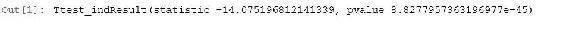

# 十、测试与实验设计

在本章中，我们将看到 A/B 测试的概念。 我们将通过 T 检验，T 统计量和 p 值，使用所有有用的工具来确定结果是真实的还是随机变化的结果。 我们将深入研究一些真实的示例，并使用一些 Python 代码来处理问题，并计算 T 统计量和 p 值。

接下来，我们将研究您得出结论之前应该进行多长时间的实验。 最后，我们将讨论可能损害实验结果并可能导致您得出错误结论的潜在问题。

我们将涵盖以下主题：

*   A/B 测试概念
*   T 检验和 p 值
*   使用 Python 测量 T 统计量和 p 值
*   确定进行实验的时间
*   A/B 测试陷阱

# A/B 测试概念

如果您是网络公司的数据科学家，则可能会要求您花一些时间分析 A/B 测试的结果。 这些基本上是网站上的受控实验，用于衡量给定更改的影响。 因此，让我们谈谈 A/B 测试是什么以及它们如何工作。

# A/B 测试

如果您要成为一家大型科技网站公司的数据科学家，那么您肯定会参与其中，因为人们需要进行实验以尝试在网站上进行其他操作并衡量其结果， 实际上，这并不像大多数人想象的那么简单。

什么是 A/B 测试？ 好吧，这是一个通常在网站上运行的受控实验，它也可以应用于其他环境，但是通常我们谈论的是网站，并且我们将测试该网站的某些更改的效果， 与以前相比。

基本上，您有一个*对照*组查看旧网站的人，以及一个*测试*组查看该网站更改的人，其目的是在这两组之间进行比较来衡量行为差异，并使用该数据来实际确定此更改是否有益。

例如，我拥有一家拥有网站的公司，我们向人们授权软件，现在我有一个漂亮，友好的橙色按钮，人们在想购买许可证时可以单击该按钮，如下图左图所示 。 但是，如果将按钮的颜色更改为蓝色（如右图所示），会发生什么？


因此，在此示例中，如果我想确定蓝色是否会更好。 我怎么知道？

我的意思是，从直觉上讲，也许可以更吸引人们的注意力，或者从直觉上讲，也许人们更习惯于看到橙色的购买按钮，并且更有可能点击该按钮，我可以任意选择旋转，对吗？ 因此，我自己的内部偏见或成见并不重要。 重要的是人们如何对我实际网站上的更改做出反应，这就是 A/B 测试的目的。

A/B 测试会将人们分成看到橙色按钮的人们和看到蓝色按钮的人们，然后我可以衡量这两组之间的行为以及它们之间的差异，并应该基于该数据决定按钮的颜色。

您可以使用 A/B 测试来测试各种事物。 这些包括：

*   **设计更改**：这些可以是按钮颜色，按钮位置或页面布局的更改。
*   **UI 流程**：因此，也许您实际上是在改变购买渠道的工作方式以及人们在您的网站上结帐的方式，并且您实际上可以衡量其效果。
*   **算法更改**：让我们考虑在第 6 章，“推荐系统”中讨论过的电影推荐示例。 也许我想测试一种算法与另一种算法。 我真正关心的不是去依靠错误指标和我进行训练测试的能力，而是要去驱动购买或租赁，或者本网站上的任何内容。
    *   A/B 测试可以让我直接测量该算法对我真正关心的最终结果的影响，而不仅仅是我预测别人已经看过的电影的能力。
    *   您还可以梦想得到的任何其他东西，实际上，影响用户与您的网站交互方式的任何更改都值得测试。 也许甚至可以使网站更快，或者可以是任何东西。

*   **定价更改**：这有点争议。 您知道，从理论上讲，您可以使用 A/B 测试对不同的价格点进行试验，看看它是否确实增加了交易量以抵消价格差或其他原因，但请谨慎使用。
    *   如果客户因别人无缘无故地获得比别人更好的价格而发狂，那么他们对您不会很满意。 请记住，进行定价实验可能会带来负面影响，而您不想处于这种情况。

# 测量 A/B 测试的转换

在网站上设计实验时，需要弄清楚的第一件事是您要针对什么进行优化？ 您真正希望通过此更改实现什么？ 这并不总是很明显的事情。 也许这是人们花费的金额，收入的金额。 好吧，我们讨论了使用支出量方面存在差异的问题，但是如果您有足够的数据，仍然可以多次在该指标上达成共识。

但是，也许这不是您实际要优化的。 也许您实际上是在故意亏本出售某些物品，只是为了夺取市场份额。 您的定价策略所涉及的复杂性不仅仅是收入。

也许您真正想衡量的是利润，而这可能是一件非常棘手的事情，因为很多事情都会削减给定产品可能赚到的钱，而这些事情可能并不总是显而易见的。 再说一次，如果您有损失负责人，则此实验将抵消那些应有的损失。 也许您只是关心增加网站上的广告点击量，或订购数量以减少差异，也许人们对此表示满意。

最重要的是，您必须与正在测试的区域的企业所有者交谈，并弄清他们正在针对哪些领域进行优化。 他们在衡量什么？ 他们的成功基于什么？ 他们的关键表现指标是什么？或者 NBA 想称其为什么？ 并确保我们正在衡量对他们而言至关重要的事物。

您也可以一次测量多个事物，而不必选择一个事物，实际上可以报告许多不同事物的影响：

*   收入
*   利润
*   点击次数
*   广告观看次数

如果这些事情都一起朝着正确的方向发展，那么这是一个非常有力的信号，表明这一变化产生的积极影响远不止一种。 那么，为什么要限制自己使用一个指标呢？ 只要确保您知道哪个最重要，这将是您提前成功完成此实验的标准。

# 如何归因转化

要注意的另一件事是将转化归因于下游的更改。 如果您尝试执行的操作没有在用户体验到您正在测试的东西时立即发生，那么事情就会变得有些模糊。

假设我更改了页面 A 上按钮的颜色，然后用户转到页面 B 并执行其他操作，最终从页面 C 购买了东西。

那么，谁能从这次购买中获得信贷？ 是 A 页，还是 B 页，或介于两者之间？ 我是否会根据该人为获得该转化操作而获得的点击次数来折算该转化的功劳？ 看到更改后，我是否只是立即放弃未执行的任何转换操作？ 这些都是复杂的事情，很容易通过弄清楚您如何解释转换和要测量的更改之间的这些不同距离而产生误导性结果。

# 方差是你的敌人

您真正需要内部化的另一件事是，在运行 A/B 测试时，差异就是您的敌人。

人们常犯的一个不知道自己正在使用数据科学做什么的错误是，他们将在网页上进行测试，无论是蓝色按钮还是橙色按钮，无论运行什么，并运行一周， 每个组的平均支出。 然后他们说：“哦，看！用蓝色按钮的人比用橙色按钮的人平均要花一美元；蓝色很棒，我喜欢蓝色，现在我要在整个网站上放蓝色！”

但是，实际上，他们可能只看到购买时的随机变化。 他们的样本量不足，因为人们购买的物品不多。 您获得了很多意见，但相比之下，您的网站上可能没有很多购买，而且这些购买金额可能会有很多差异，因为不同的产品价格不同。

因此，您很容易最终做出错误的决定，从长远来看最终会花费公司金钱，如果您不了解差异对这些结果的影响，那么您就可以赚取公司金钱。 在本章的后面，我们将讨论一些用于度量和核算的主要方法。

您需要确保您的企业主了解这是一个重要的影响，您需要在进行 A/B 测试或您在网络上进行的任何实验之后做出业务决策之前，先进行量化和了解。

现在，有时您需要选择方差较小的转化指标。 网站上的数字可能只是意味着您必须进行数年的实验才能获得基于收入或支出金额等方面的显著结果。

有时，如果您查看的是多个指标（例如订单金额或订单数量），而与之相关的差异较小，则可能会先看到订单数量上的信号，然后再看到收入上的信号。 归根结底，这最终是一个判断电话。 如果您看到订单数量显着增加，而收入却没有那么显着，那么您必须说：“好吧，我认为这里可能会有一些真实而有益的事情。”

但是，统计数据和数据大小唯一可以告诉您的是效果是真实的概率。 在一天结束时，由您决定是否真实。 因此，让我们详细讨论如何执行此操作。

这里的重点是，仅仅看一下手段上的差异是不够的。 当您尝试评估实验结果时，还需要考虑方差。

# T 检验和 p 值

您如何知道 A/B 测试产生的更改实际上是更改内容的真实结果，还是仅仅是随机变化？ 嗯，我们可以使用两种统计工具，称为 T 检验或 T 统计量，以及 p 值。 让我们进一步了解它们是什么，以及它们如何帮助您确定实验是否良好。

目的是找出结果是否真实。 这仅仅是数据本身固有的随机差异的结果，还是我们看到对照组和测试组之间的行为发生了统计学上显着的实际变化？ T 检验和 p 值是一种计算方法。

请记住，*具有统计意义*确实没有特定含义。 归根结底，这必须是一个判断电话。 您必须选择要接受的结果是否为实数的概率值。 但是总是有机会仍然是随机变化的结果，并且您必须确保利益相关者理解这一点。

# T 统计量或 T 检验

让我们从 **T 统计量**开始，也称为 T 检验。 基本上，它是衡量对照组和治疗组两组之间行为差异的一种量度，以标准误差为单位表示。 它基于标准误差，该标准误差说明了数据本身固有的差异，因此，通过使用该标准误差对所有数据进行归一化，我们可以考虑到这两组差异，从而对这两组之间的行为变化进行某种程度的度量。

解释 T 统计量的方法是，高 T 值意味着这两组之间可能存在真正的差异，而低 T 值意味着相差不大。 您必须决定什么是您愿意接受的阈值？ T 统计量的符号会告诉您它是正的还是负的变化。

如果将对照组与治疗组进行比较，结果 T 统计量为负，则表明这是一个不好的变化。 您最终希望该 T 统计量的绝对值较大。 T 统计量的值被认为有多大？ 好吧，这值得商.。 我们将很快看一些示例。

现在，这确实假设您的行为是正常分布的，并且当我们谈论诸如人们在网站上花费的金额之类的事情时，通常这是一个不错的假设。 确实有多少人支出呈正态分布。

但是，对于其他特定情况，您可能需要查看 T 统计的更多精炼版本。 例如，当您谈论点击率时，有一个名为 **Fisher 的精确测试**，当您在谈论每个用户的交易时，有 **E 测试**，例如他们看到了多少页面，以及**卡方**测试，这通常与您查看订单数量有关。 有时，您会希望查看给定实验的所有这些统计信息，然后选择最适合您要尽力而为的实验。

# p 值

现在，谈论 p 值要比 T 统计量容易得多，因为您不必考虑，我们在谈论多少个标准差？ 实际值是什么意思？ 人们容易理解 p 值，这使它成为更好的工具，可以将实验结果传达给企业中的利益相关者。

p 值基本上是该实验满足原假设的概率，即对照和治疗行为之间没有真正差异的概率。 p 值低表示没有效果的可能性很低，有点双重负数，因此有点直觉，但是到最后，您只需要了解低 p 值意味着您的更改很有可能产生真正的效果。

您想要看到的是高 T 统计量和低 p 值，这将意味着显着的结果。 现在，在开始实验之前，您需要确定成功的门槛，这意味着与业务负责人一起确定门槛。

那么，您愿意接受什么 p 值来衡量成功？ 是百分之一吗？ 是 5% 吗？ 同样，这基本上是没有实际影响的可能性，这仅仅是随机方差的结果。 这只是一天结束时的判断电话。 很多时候人们使用 1%，有时如果感觉有点风险则使用 5%，但总有机会将您的结果只是虚假的随机数据输入。

但是，您可以选择愿意接受的可能性，使其具有足够的效果，这是真实的效果，值得将其推广到生产中。

当实验结束时，我们将讨论当您宣布实验结束时，您要测量 p 值。 如果它小于您确定的阈值，那么您可以拒绝原假设，并且可以说：“嗯，这种变化很有可能产生真正的积极或消极结果。”

如果结果是肯定的，那么您可以将更改推广到整个网站，而不再是实验，它是您网站的一部分，随着时间的流逝，它有望为您带来越来越多的收益，如果结果是负面结果，您希望在花费更多钱之前摆脱它。

请记住，当实验结果为负数时，运行 A/B 测试会产生实际成本。 因此，您不想将其运行太久，因为您可能会亏钱。

这就是为什么您要每天监控实验结果的原因，因此，如果有早期迹象表明更改对网站造成了可怕的影响，也许其中存在错误或可怕的东西，如有必要你可以过早拔插头，并限制损坏。

我们来看一个实际示例，看看如何使用 Python 测量 T 统计量和 p 值。

# 使用 Python 测量 T 统计量和 p 值

让我们构造一些实验数据，并使用 T 统计量和 p 值确定给定的实验结果是否是真实的效果。 我们将实际构造一些虚假的实验数据，并对它们运行 T 统计量和 p 值，并查看其工作原理以及如何在 Python 中进行计算。

# 对一些实验数据进行 A/B 测试

假设我们正在网站上进行 A/B 测试，并且已将用户随机分为两组，即组`A`和组`B`。 `A`组将成为我们的测试对象，我们的治疗组，而`B`组将成为我们的对照组，基本上就是网站过去的样子。 我们将使用以下代码进行设置：

```py
import numpy as np 
from scipy import stats 

A = np.random.normal(25.0, 5.0, 10000) 
B = np.random.normal(26.0, 5.0, 10000) 

stats.ttest_ind(A, B) 

```

在此代码示例中，我们的治疗组（`A`）将具有随机分布的购买行为，即他们平均每笔交易花费 25 美元，标准差为 5 万和 1 万个样本，而过去在相同的标准差和样本量的情况下，以前的网站每笔交易的平均值为 26 美元。 我们基本上是在寻找一个结果为阴性的实验。 确定 T 统计和 p 值所需要做的只是使用`scipy`中的这种方便的`stats.ttest_ind`方法。 您要做的是，将其传递给治疗组和对照组，然后得出 T 统计量，如以下输出所示：



在这种情况下，我们的 T 统计量为-14。 否定表示这是消极的变化，这是一件坏事。 而且 p 值非常非常小。 因此，这意味着这种变化仅仅是随机机会的结果的可能性极低。

请记住，为了声明重要性，我们需要看到较高的 T 值 T 统计量和较低的 p 值。

这就是我们在这里看到的，我们看到的是 -14，它是 T 统计的绝对值非常高，为负则表明这是一件坏事，而 p 值却非常低，告诉我们实际上这不可能是随机变化的结果。

如果您在现实世界中看到了这些结果，则将尽快拔出该实验的插头。

# 当两组之间没有真正的区别时

就像进行健全性检查一样，让我们​​继续进行更改，以使这两组之间没有真正的区别。 因此，我将更打乱`B`（在这种情况下为对照组），使其与治疗相同，其中均值为 25，标准差不变，样本大小不变，如下所示：

```py
B = np.random.normal(25.0, 5.0, 10000) 

stats.ttest_ind(A, B) 

```

如果继续进行下去，您可以看到我们的 T 检验现在低于 1 了：


请记住，这是根据标准差得出的。 因此，这意味着除非我们还有更高的 p 值（超过 30%），否则那里可能没有真正的变化。

现在，这些数字仍然相对较高。 您会看到随机变化可能是一种阴险的事情。 这就是为什么您需要提前决定 p 值可接受的限制的原因。

您知道之后，可以看看事实，然后说：“30% 的几率，这还不错，我们可以接受，”但是，没有。 我的意思是，在现实和实践中，您希望看到 p 值低于 5%，理想情况下低于 1%，而 30% 的值实际上意味着结果不那么强。 因此，不要在事后证明其合理性，而要进行实验以了解阈值是多少。

# 样本量是否有所不同？

让我们对样本大小进行一些更改。 我们将在相同条件下创建这些集合。 让我们看看是否通过增加样本量实际上在行为上有所不同。

# 样本数量增加到六位数

因此，我们将从`10000`样本转换为`100000`样本，如下所示：

```py
A = np.random.normal(25.0, 5.0, 100000) 
B = np.random.normal(25.0, 5.0, 100000) 

stats.ttest_ind(A, B) 

```

您可以在下面的输出中看到，p 值实际上降低了一点，而 T 检验却稍微增大了一点，但是仍然不足以声明真正的差异。 它实际上正朝着您不希望它走向的方向发展？ 有点有趣！


但是这些仍然是很高的值。 同样，这只是随机方差的影响，它可能会带来比您想象的更多的影响。 特别是在谈论订单金额的网站上。

# 样本数量增加了七位数

让我们实际上将样本大小增加到`1000000,`，如下所示：

```py
A = np.random.normal(25.0, 5.0, 1000000) 
B = np.random.normal(25.0, 5.0, 1000000) 

stats.ttest_ind(A, B) 

```

结果如下：


那是做什么的？ 好吧，现在，我们的 T 统计量回到了 1 以下，我们的值约为 35%。

随着样本数量的增加，我们会在任一方向上看到这种波动。 这意味着从 10,000 个样本增加到 100,000 个至 1,000,000 个样本并不会改变您的结果。 进行这样的实验是一种良好的直觉，可以使您感觉需要进行多长时间。 实际需要多少个样本才能得出明显的结果？ 而且，如果您提前知道有关数据分布的信息，则可以实际运行这些模型。

# A/A 测试

如果我们将集合与自身进行比较，这称为 A/A 测试，如以下代码示例所示：

```py
stats.ttest_ind(A, A) 

```

在下面的输出中，我们可以看到`0`的 T 统计量和`1.0`的 p 值，因为实际上这两个集合之间没有任何区别。


现在，如果您使用真实的网站数据来运行这些数据，而您正在看的是完全相同的人，却看到了一个不同的值，则表明运行测试的系统本身存在问题。 就像我说的那样，归根结底，这全都是判断。

继续进行下去，看看不同标准差对初始数据集，均值差异和不同样本量的影响。 我只想让您深入研究这些不同的数据集并进行实际运行，并查看它们对 T 统计量和 p 值的影响。 希望这会使您对如何解释这些结果有更多的了解。

同样，要了解的重要一点是，您正在寻找较大的 T 统计量和较小的 p 值。 P 值很可能就是您要与企业沟通的内容。 记住，p 值越低越好，您希望看到单位数，最好在宣布胜利之前低于 1%。

在本章的其余部分中，我们将更多地讨论 A/B 测试。 SciPy 可以非常轻松地为给定的数据集计算 T 统计量和 p 值，因此您可以非常轻松地比较对照组和治疗组之间的行为，并衡量该效应是真实的还是只是概率随机变化的结果。 确保您专注于这些指标，并且正在衡量进行这些比较时关心的转化指标。

# 确定要进行多长时间的实验

您需要进行多长时间的实验？ 实际需要多长时间？ 你什么时候放弃？ 让我们更详细地讨论。

如果您公司中的某人开发了一个新的实验，他们想要测试的新变更，那么他们就对成功有浓厚的兴趣。 他们投入了大量的工作和时间，并且希望它取得成功。 也许您已经进行了数周的测试，但您仍未在该实验中获得正面或负面的重大成果。 您知道他们将无限期地继续运行它，以期最终显示出积极的结果。 由您决定您愿意运行此实验的时间。

如何知道完成 A/B 测试的时间？ 我的意思是，预测获得显着结果所需的时间并不总是那么简单，但是很明显，如果您获得了显着结果，p 值低于 1% 或 5% 或任何阈值， 选择，您就完成了。

届时，您可以拔掉实验的插头，将更改更广泛地推出或删除，因为它实际上具有负面影响。 您总是可以告诉人们回去再试一次，利用他们从实验中学到的知识，也许可以进行一些更改后再试一次，并减轻一点打击。

可能发生的另一件事是根本没有收敛。 如果您没有看到 p 值随时间的变化趋势，则可能是一个很好的信号，表明您不会很快看到这一趋势。 不管运行多长时间，它都不会对行为产生足够的影响甚至无法衡量。

在这种情况下，您每天想做的是在给定实验的图形上绘制 p 值，T 统计量，以及用来衡量该实验成功与否的任何信息，以及是否某些东西看起来很有希望，您会看到 p 值随时间开始下降。 因此，获得的数据越多，您的结果应获得的意义就越大。

现在，如果您看到一条平坦的线或到处都是一条线，则表明您的 p 值不会随处可见，并且不管实验进行多长时间都没有事情发生。 您需要事先达成共识，如果您看不到 p 值的任何趋势，那么您愿意为该实验进行的最长时间是什么？ 是两个星期吗？ 是一个月吗？

要记住的另一件事是，一次在站点上运行多个实验可以混淆您的结果。

花在实验上的时间是很有价值的商品，您无法在世界上花费更多的时间。 在给定的一年中，您实际上只能运行尽可能多的实验。 因此，如果您花费太多时间来进行一项实际上没有机会融合结果的实验​​，那么您将有机会错过在此期间进行另一项可能更有价值的实验的机会，而这是您浪费在另一项实验上的机会。

在实验链接上划清界限非常重要，因为在网站上进行 A/B 测试时，时间是非常宝贵的商品，至少只要您的想法多于时间（希望如此）。 确保在测试给定实验所花费的时间上达成一致的上限，并且如果您没有看到 p 值的趋势看起来令人鼓舞，那么该是时候采取行动了。

# A/B 测试陷阱

我要说明的一个重要问题是，即使您使用 p 值以原则方式测量 A/B 测试的结果，也不是福音。 实际上，有许多影响因素可能会扭曲实验结果，并导致您做出错误的决定。 让我们仔细研究其中的一些，让您知道如何注意它们。 让我们谈谈 A/B 测试的一些陷阱。

说 p 值为 1% 听起来很正式，这意味着给定实验只有 1% 的机会是由于虚假结果或随机变化引起的，但做一个实验并不是衡量成功与否的全部。 有许多事情可能会歪曲或混淆您需要注意的结果。 因此，即使您看到一个看起来很令人鼓舞的 p 值，您的实验仍然可能对您不利，并且您需要了解可以实现该目标的事情，以免做出错误的决定。

请记住，关联并不意味着因果关系。

即使进行了精心设计的实验，您所能说的还是很有可能是这种影响是由您所做的更改引起的。

归根结底，总会有没有真正效果的机会，或者您甚至可能会测量错误的效果。 仍然可能是随机的机会，可能还会有其他事情发生，您有责任确保企业所有者了解需要解释这些实验结果，并将其作为决策的一部分。

它们不能成为决策所依据的一切，因为结果中存在错误的余地，并且有些事情可能会使结果产生偏差。 而且，如果此变化有更大的业务目标，而不仅仅是增加短期收入，则还必须考虑到这一点。

# 新颖性效应

一个问题是新颖性效应。 A/B 测试的一个主要致命弱点是它们倾向于在很短的时间内运行，这会带来很多问题。 首先，更改可能会产生较长期的影响，您将不会进行衡量，但是，网站上的某些内容也会有所不同。

例如，也许您的客户习惯于一直浏览网站上的橙色按钮，如果蓝色按钮出现并且引起了他们的注意，只是因为它与众不同。 但是，随着新客户的到来，他们从未见过您的网站，因此他们不会注意到这与众不同，而且随着时间的流逝，即使您的老客户也习惯了新的蓝色按钮。 很有可能，如果您在一年后进行相同的测试，那没有什么区别。 也许他们会反过来。

我可以很容易地看到您测试橙色按钮与蓝色按钮的情况，并且在头两周中蓝色按钮获胜。 人们购买更多商品是因为他们对它更具吸引力，因为它与众不同。 但是一年过去了，我可能会运行另一个网络实验室，将蓝色按钮与橙色按钮放在一起，橙色按钮将再次获胜，这仅仅是因为橙色按钮是不同的，并且它是新的并因此单独引起了人们的注意。

因此，如果您所做的更改有些争议，那么最好稍后再运行该实验，看看您是否可以真正复制其结果。 这确实是我了解新颖性影响的唯一方法。 实际上，当它不再新颖时，或者不再仅仅是因为它与众不同而引起人们关注的变化，才再次对其进行衡量。

而且，我确实不能低估了解这一点的重要性。 这确实会使很多结果产生偏差，使您偏向将不应该得到的积极变化归因于某些事情。 本身不同并不是一种美德。 至少不是在这种情况下。

# 季节性影响

如果您在圣诞节期间进行实验，那么人们在圣诞节期间的行为往往不会与一年中的其他时间一样。 在那个季节里，他们的花钱肯定不同，他们在家里与家人在一起的时间更多，他们可能会有点没工作，所以人们会有不同的心态。

甚至可能与天气有关，夏季人们的行为有所不同，因为天气炎热，他们感到有些懒惰，他们度假的频率更高。 也许您碰巧在人口稠密地区的暴风雨期间进行实验，这也会使您的结果产生偏差。

同样，只是意识到潜在的季节性影响，假期是一个值得注意的大假期，并且如果假期在已知的季节性期间内运行，请一定要多花些盐。

您可以通过实际查看要衡量的指标作为成功指标来定量地确定这一指标，无论它叫什么转换指标，并查看其去年同期的行为。 您每年都会看到季节性波动吗？ 如果是这样，您希望避免在这些高峰或低谷之一中进行实验。

# 选择偏见

另一个可能导致结果偏差的潜在问题是选择偏见。 将客户随机分配到您的对照组或治疗组，A 组或 B 组非常重要。

但是，有一些微妙的方法可以使随机分配毕竟不是随机的。 例如，假设您要对客户 ID 进行哈希处理，以将其放入一个存储桶或另一个存储桶中。 散列函数如何影响具有较低客户 ID 的人与具有较高客户 ID 的人之间可能存在一些细微的偏差。 这可能会使所有长期的，更忠诚的客户进入对照组，而对您不太了解的新客户也将进入治疗组。

结果，您最终所衡量的只是新客户与旧客户之间行为上的差异。 审核系统以确保在实际分配给对照组或治疗组的人员中没有选择偏见非常重要。

您还需要确保分配是粘性的。 如果要衡量更改在整个会话中的影响，则要衡量他们是否在 A 页上看到了更改，但是，在 C 页上他们实际上进行了转换，因此必须确保他们在这些点击之间没有切换组。 因此，您需要确保在给定的会话中，人们保持在同一组中，并且如何定义会话也可能变得晦涩难懂。

现在，所有这些问题都可以使用已建立的现成框架（例如 Google Experiments 或 Optimizely）或其中的一个来解决，因此您不必为解决所有这些问题而费力。 如果您的公司确实有内部开发的内部解决方案，因为他们不愿意与外部公司共享数据，那么值得检查是否存在选择偏见。

# 审核选择偏见问题

审核选择偏见问题的一种方法是运行所谓的 A/A 测试，如我们先前所见。 因此，如果您实际进行的实验在处理和对照之间没有差异，那么最终结果就不会有差异。 比较这两件事时，行为不应有任何形式的变化。

A/A 测试可以很好地测试 A/B 框架本身，并确保没有固有的偏差或其他问题（例如，会话泄漏等），您需要解决。

# 数据污染

另一个大问题是数据污染。 我们详细讨论了清理输入数据的重要性，这在 A/B 测试的情况下尤其重要。 如果您有一个机器人，这是一个恶意爬取程序，该蠕虫始终不停地在您的网站中爬行，进行不自然的交易，该怎么办？ 如果那个机器人最终被分配治疗或控制该怎么办？

那个机器人可能会使您的实验结果产生偏差。 研究实验中的输入并寻找异常值，然后分析这些异常值以及是否应将其排除在外非常重要。 您实际上是在让某些机器人泄漏到您的测量中，并且它们使实验结果发生偏差吗？ 这是一个非常非常普遍的问题，您需要认识到这一点。

那里有恶意的机器人，有人试图入侵您的网站，有一些良性的抓取工具只是试图对您的网站进行爬取以获取搜索引擎之类的东西。 网站上发生了各种各样的怪异行为，您需要过滤掉这些行为并吸引真正是您客户的人，而不是这些自动化脚本。 这实际上可能是一个非常具有挑战性的问题。 如果可以的话，请使用 Google Analytics（分析）等现成的框架的另一个原因。

# 归因错误

前面我们简要讨论了归因错误。 这是如果您实际上正在使用更改的下游行为，并且该行为变成灰色区域。

您需要了解如何根据与您所做的更改之间的距离来实际计算这些转换，并与您的业务利益相关者事先商定如何衡量这些影响。 您还需要知道是否一次运行多个实验。 他们会互相冲突吗？ 是否存在页面流，某人可能在同一会话中实际遇到两个不同的实验？

如果是这样，那将是一个问题，您必须对这些更改是否实际上可以某种有意义的方式相互干扰并以某种有意义的方式影响客户的行为做出判断。 同样，您需要一粒盐来获得这些结果。 有很多事情可能会使结果产生偏差，您需要意识到这些问题。 只需了解它们，并确保您的企业主也意识到 A/B 测试的局限性，一切都会好起来的。

同样，如果您实际上无法花大量时间进行实验，则需要花些盐来获得这些结果，理想情况下稍后在不同的时间段对其进行重新测试。

# 总结

在本章中，我们讨论了什么是 A/B 测试以及围绕它们的挑战。 我们介绍了一些示例，这些示例说明了如何使用 T 统计量和 p 值指标实际测量方差的影响，并使用 Python 进行 T 检验的编码和测量。 然后，我们继续讨论 A/B 测试的短期性质及其局限性，例如新颖性影响或季节性影响。

这也结束了我们在本书中的时间。 祝贺您取得了如此长的成就，这是一项重大成就，您应该为自己感到自豪。 我们在这里讨论了很多材料，我希望您至少了解这些概念，并且对当今数据科学中使用的大多数技术有一点动手经验。 这是一个非常广阔的领域，因此我们已经涉及了那里的所有内容。 因此，再次恭喜您。

如果您想在这一领域进一步发展，我真正鼓励您做的是与您的老板交谈。 如果您在一家可以访问自己的一些有趣数据集的公司工作，请查看是否可以使用它们。 显然，在使用公司拥有的任何数据之前，您首先要与老板交谈，因为围绕它可能会有一些隐私限制。 您想确保自己没有侵犯公司客户的隐私，这可能意味着您只能在工作场所的受控环境中使用或查看这些数据。 因此，在执行此操作时要小心。

如果您获得了每周几天才真正上班的许可，并且知道其中一些数据集并弄清楚了可以做什么，不仅表明您有主动让自己成为一个更好的员工，您实际上可能会发现一些对您的公司有价值的东西，这可能会让您看起来更好，并且实际上可能导致内部转移，进入与您的职业生涯更直接相关的领域。

因此，如果您想从我这里获得一些职业建议，我会得到一个普遍的问题：“嘿，我是一名工程师，我想更多地进入数据科学领域，我该怎么做？” 做到这一点的最佳方法就是做到这一点，实际上，您要做一些辅助项目并表明您可以做到，并从中证明了一些有意义的结果。 告诉老板，看看它带领你。 祝你好运。