# 二、理解随机性和随机数

在许多现实生活中，抛硬币决定做什么是很有用的。许多计算机也将此过程作为其决策过程的一部分。事实上，许多问题可以通过使用概率算法以非常有效且相对简单的方式解决。在这种类型的算法中，决策是基于随机贡献做出的，在随机选择的值的帮助下记住掷骰子。

随机数的产生有着悠久的历史渊源，但直到最近这一过程才得以加快，使其也能在科学研究中大规模使用。这些生成器主要用于计算机仿真、统计采样技术或密码学领域。

在本章中，我们将介绍以下主题：

*   随机过程
*   随机数仿真
*   伪随机数发生器
*   均匀分布检验
*   探索随机分布的一般方法
*   使用 Python 生成随机数

# 技术要求

在本章中，我们将介绍随机数生成技术。为了理解这些主题，需要掌握代数和数学建模的基本知识。

要使用本章中的 Python 代码，您需要以下文件（可在 GitHub 的[上获得）https://github.com/PacktPublishing/Hands-On-Simulation-Modeling-with-Python](https://github.com/PacktPublishing/Hands-On-Simulation-Modeling-with-Python) ：

*   `LinearCongruentialGenerator.py`
*   `LearmouthLewisGenerator.py`
*   `LaggedFibonacciAlgorithm.py`
*   `UniformityTest.py`
*   `Random.Generation.py`

# 随机过程

**随机过程**是一组依赖于参数*t*的随机变量。使用以下符号指定随机过程：


这里，*t*是一个参数，*t*是*t*的一组可能值。

通常，时间由*t*表示，因此随机过程是一系列与时间相关的随机变量。*t*的变化范围，即集合*t*可以是一组实数，可能与整个时间轴重合。但它也可以是一组离散的值。

随机变量*X*t 在集合*X*上定义，称为状态空间。这可以是一个连续集，在这种情况下它被定义为一个连续的随机过程，或者是一个离散集，在这种情况下它被定义为一个离散的随机过程。

考虑以下因素：

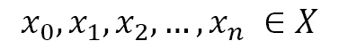

这意味着随机变量*X*t 可以取的值被称为系统状态，并表示实验的可能结果。*X*t 变量通过依赖关系连接在一起。我们可以知道一个随机变量，如果我们知道它可以假设的值和概率分布。因此，要理解一个随机过程，不仅需要知道*X*t 可以取的值，还需要知道变量的概率分布和值之间的联合分布。也可以考虑更简单的随机过程，其中*t*的变化范围是一组离散的时间值。

重要提示

在实践中，有许多现象是通过随机过程理论来研究的。物理学中的一个经典应用是研究粒子在每种介质中的运动，即所谓的**布朗运动**。本研究采用随机过程进行统计。有些过程即使知道过去和现在，也无法确定未来；然而，在其他过程中，未来由现在决定，而不考虑过去。

## 随机过程的类型

随机过程可根据以下特征进行分类：

*   国家空间
*   时间索引
*   随机变量之间的随机依赖类型

状态空间可以是**离散**或**连续**。在第一种情况下，具有离散空间的随机过程也称为**链**，空间通常被称为非负整数集。在第二种情况下，随机变量假设的值集不是有限的或可数的，并且随机过程是在连续空间中。

时间索引也可以是离散的或连续的。离散时间随机过程也称为**随机序列**，其表示如下：

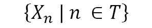

这里，集合*T*是有限的或可数的。

在这种情况下，状态的变化只能在某些情况下观察到：有限或可数。如果在有限或无限的实区间内的任何时刻发生状态变化，则存在一个连续时间过程，其表示如下：

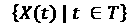

随机变量*X（t）*对于*t*的不同值之间的随机相关性表征了一个随机过程，有时简化了其描述。在严格意义上，随机过程是平稳的，即分布函数相对于时间轴上的位移*T*是不变的。广义上，随机过程是平稳的，即分布的前两个矩独立于*T*轴上的位置。

## 随机过程示例

随机过程的数学处理似乎很复杂，但我们每天都会发现随机过程的例子。例如，每天中午观察到的作为时间函数的住院患者人数是一个随机过程，其中状态空间是离散的，是自然数的有限子集，时间是离散的。随机过程的另一个例子是，在一个房间中测量的温度随时间的变化，在每一时刻都观察到，具有连续的状态空间和连续的时间。现在让我们来看一些基于随机过程的结构化示例。

## 伯努利过程

随机变量的概念允许我们建立模型，该模型对许多随机现象的研究非常有用。概率模型的一个重要早期例子是**伯努利分布**，该分布是为纪念瑞士数学家詹姆斯·伯努利（James Bernoulli，1654-1705）而命名的，他在概率领域做出了重要贡献。

其中一些实验包括重复执行给定的测试。例如，我们想知道当掷硬币 1000 次时，得到头部的概率。

在每一个例子中，我们寻找在*n*试验中获得*x*成功的概率。如果*x*表示成功，则*n*-*x*为失败。

伯努利试验序列包括以下假设下的伯努利试验：

*   每个试验只有两个可能相互排斥的结果，任意称为**成功**和**失败**。
*   每个试验的成功概率*p*相同。
*   所有测试都是独立的。

独立性意味着测试结果不受任何其他测试结果的影响。例如，事件*第三次测试成功*，独立于事件*第一次测试成功*。

掷硬币是伯努利试验：*正面*事件可以被认为是成功的，而*反面*事件可以被认为是失败的。在这种情况下，成功概率为*p*=1/2。掷两个骰子时，事件*点数之和为七*，互补事件均不成功。本例为伯努利试验，成功概率为*p*=1/6。

重要提示

当第一个事件的发生排除了第二个事件的发生时，两个事件被称为是互补的，但两个事件中的一个肯定会发生。

让*p*表示伯努利试验的成功概率。统计*n*试验中成功次数的随机变量*X*称为*n*和*p*参数的二项随机变量。*X*可以取 0 到*n*之间的整数值。

## 随机游走

**随机游动**是一个离散的参数随机过程，其中*X*t，其中*X*表示一个随机变量，描述了一个移动点在*t*时刻所处的位置。术语“随机行走”是指描述随机移动物体位移的统计数据的数学形式化。这种仿真对于物理学家来说非常重要，在统计力学、流体动力学和量子力学中都有应用。

随机游动是一种数学模型，普遍用于仿真由一系列随机步骤形式化的路径。这个模型可以假设一个可变的自由度，这取决于我们想要描述的系统。从物理角度来看，随时间跟踪的路径不一定会仿真真实运动，但它将代表系统随时间变化的特性趋势。随机游动在化学、生物学和物理学中都有应用，但在经济学、社会学和信息技术等其他领域也有应用。

随机一维行走是一种用于仿真粒子沿直线运动的模型。在允许的路径上只有两个潜在的移动：要么向右（概率等于**p**），要么向左（概率等于**q**）。每一步都有一个恒定的长度，并且独立于其他步骤，如下图所示：


图 2.1–一维步行

每个时刻点的位置由其横坐标*X（n）*确定。在*n*步之后，该位置将以随机项为特征。我们的目的是计算*n*动作后从起点通过的概率。显然，没有什么能保证点会回到起始位置。变量*X（n）*返回*n*步数后粒子的横坐标。它是一个二项分布的离散随机变量。

在每个瞬间，粒子根据随机变量*Z（n）*返回的值向右或向左移动。此变量只能取两个值：+1 和-1。假设+1 值的概率为*p*>0，而-1 值的概率等于*q*。两种概率之和为*p*+*q*=1。瞬间*n*的粒子位置由下式给出：

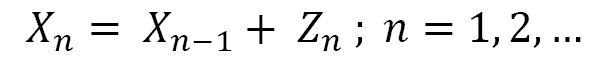

这显示返回粒子原点的平均次数，命名为*p*。单一收益的概率由以下几何级数给出：

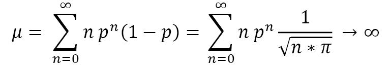

我们假设粒子返回原点的概率趋于 1。这意味着，尽管收益的频率随着所采取的步骤数量的增加而减少，但它们始终处于所采取步骤的无限值中。因此，我们可以得出这样的结论：一个左右运动概率相等的粒子，以极大的概率随意地向左自由移动到无穷远，返回无限次到它开始的点。

## 泊松过程

在某些现象中，某些事件相对于某个时间或空间间隔很少发生。在该时间间隔内发生的事件数量从 0 到*n*不等，并且*n*无法预先确定。例如，在随机选择的 5 分钟时间范围内，通过无拥挤街道的车辆数量可以被视为罕见事件。类似地，一家公司一周内发生的工作事故数量，或一本书的一页印刷错误数量，也是罕见的。

在对罕见事件的研究中，参考特定的时间或空间间隔是最基本的。为了研究罕见事件，使用了泊松概率分布，以纪念法国数学家 Simeon Denis Poisson（1781-1840）的名字命名，他首先获得了该分布。泊松分布被用作一个模型，在这种情况下，随机分布在空间或时间上的过程的事件或实现是计数，即离散变量。

二项分布基于一组定义伯努利试验的假设，泊松分布也是如此。以下条件描述了所谓的泊松过程：

*   事件的实现是独立的，这意味着事件在时间或空间间隔内的发生不会影响事件在同一时间或另一时间间隔内发生秒的概率。
*   事件在每个时间间隔内的单个实现概率与时间间隔的长度成正比。
*   在任意小的时间间隔内，事件发生一次以上的概率可以忽略不计。

泊松分布和二项式分布之间的一个重要区别是试验和成功的次数。在二项分布中，试验的数量*n*是有限的，成功的数量*x*不能超过*n*；在泊松分布中，测试的数量本质上是无限的，并且成功的数量可以是无限大的，即使随着*x*的增加*x*成功的概率变得非常小。

# 随机数仿真

在许多应用中，随机数的可用性是一项必要的要求。在某些情况下，最终应用程序的质量严格取决于生成高质量随机数的可能性。例如，想想视频游戏、加密、生成视觉或声音效果、电信、信号处理、优化和仿真等应用。在这种类型的算法中，决策是基于虚拟货币的拉动而做出的，虚拟货币基于随机选择的值。

随机数没有单一或一般的定义，因为它通常取决于上下文。随机数的概念本身并不是绝对的，因为任何数字或数字序列在观察者看来都可能是随机的，但在另一个知道它们产生的规律的人看来则不然。简单地说，随机数定义为在随机过程中从有限的一组数字中选择的数字。有了这个定义，我们将重点放在选择数字序列过程中的随机性概念上。

在许多情况下，生成随机数的问题涉及随机生成 0 和 1 的序列，从中可以获得任何格式的数字：整数、定点、浮点或任意长度的字符串。有了正确的功能，就有可能获得质量良好的序列，这些序列也可以用于科学应用，例如**蒙特卡罗**仿真。这些技术应该易于实现，并可供任何计算机使用。此外，与所有软件解决方案一样，它们应该非常通用，并且能够快速改进。

重要提示

这些技术有一个很大的问题，这是过程的算法本质所固有的：最终的字符串可以从开始的种子预测。这就是为什么我们称这个过程为**伪随机**。

尽管如此，许多算法性质的问题仍然可以非常有效地解决，并且使用概率算法相对简单。概率算法最简单的例子可能是随机快速排序。这是同名排序算法的一种概率变体，通过选择枢轴元素，该算法能够在平均情况下随机保证最佳复杂性，而不管输入的分布如何。密码学是一个随机性起着基础作用的领域，值得特别提及。在这种情况下，随机性不会带来计算优势，但必须保证认证协议和加密算法的安全性。

## 概率分布

从不同的角度描述随机过程是可能的。最重要的特征之一是**概率分布**。概率分布是一种将概率与随机变量的每个可观察模态相关联的模型。

概率分布可以是离散的，也可以是连续的，这取决于变量是随机的、离散的还是连续的。如果用整数个模式可以观察到该现象，则它是离散的。掷骰子是一种离散的统计现象，因为可观察模式的数量等于 6。随机变量只能取六个值（1、2、3、4、5 和 6）。因此，这种现象的概率分布是离散的。当随机变量假设一组连续的值时，概率分布是连续的；在这种情况下，可以用无限或非常多的模态观察统计现象。体温的概率分布是连续的，因为它是一种连续的统计现象，即随机变量的值是连续变化的。

现在让我们看看不同的概率分布。

### 均匀分布

在许多情况下，考虑并使用具有**均匀分布**特征的过程。这意味着，如果执行无限次提取，则每个元素与其他任何元素一样有可能被选择。如果在图上表示元素及其各自被提取的概率，则会得到一个矩形图，如下所示：

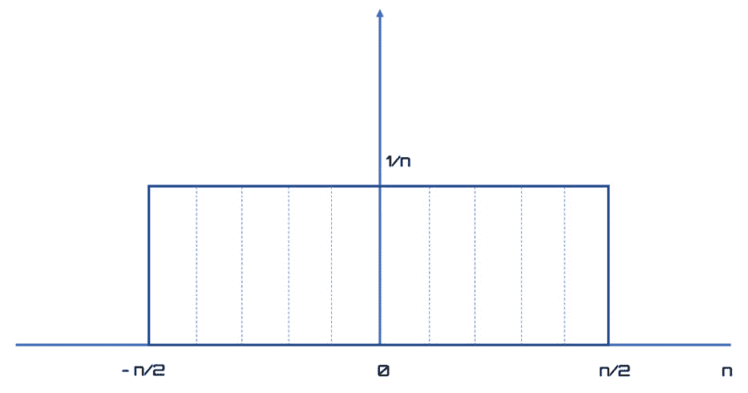

图 2.2–要素的概率

由于概率表示为 0 到 1 之间的实数，其中 0 表示不可能事件，1 表示特定事件，因此在均匀分布中，每个元素将具有 1/*n*被选择的概率，其中*n*是项目数。在这种情况下，所有概率之和必须给出统一的结果，因为在提取中，至少有一个元素是确定的。均匀分布是掷骰子、彩票和轮盘赌等人工随机过程的典型特征，也是几种应用中最常用的。

### 高斯分布

另一个非常常见的概率分布是**高斯分布**或**正态分布**，具有典型的钟形。在这种情况下，较小的值或更靠近曲线中心的值比远离中心的较大值更有可能被提取。下图显示了典型的高斯分布：

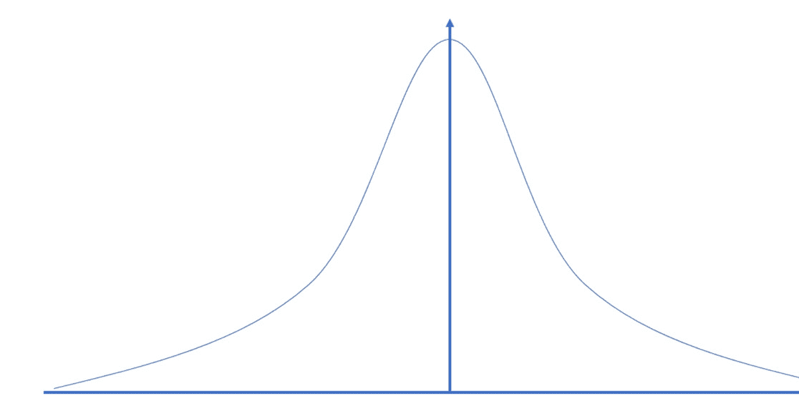

图 2.3–高斯分布

高斯分布很重要，因为它是自然过程的典型。例如，它可以表示许多电子元件中噪声的分布，也可以表示测量误差的分布。因此，它被用来仿真电信或信号处理领域的统计分布。

## 随机数的性质

随机数是指在 0 和 1 之间均匀分布的随机变量。随机数序列必须具备的统计特性如下：

*   一致性
*   独立

假设你把一个区间[0.1]分成振幅相等的*n*个子区间。均匀性属性的结果是，如果对随机数进行了*N*次观测，则每个子区间中的观测数等于*N/N*。独立性属性的结果是，在特定范围内获得值的概率与先前获得的值无关。

# 伪随机数发生器

使用确定性算法生成真实随机序列是不可能的：最多可以生成伪随机序列。显然，这些是随机序列，实际上是完全可预测的，经过一定次数的提取后可以重复。PRNG 是一种算法，用于输出看似随机生成的值序列。

## 随机数发生器的优缺点

随机数生成例程必须如下所示：

*   可复制
*   快速的
*   两个生成的数字之间没有大的差距
*   有足够长的运行周期
*   生成具有尽可能接近理想统计特性的数字

随机数生成器最常见的缺点如下：

*   数量分布不均匀
*   生成数的离散化
*   不正确的均值或方差
*   周期性变化的存在

## 随机数生成算法

第一个处理随机数生成问题的是 1949 年的约翰·冯·诺依曼。他提出了一种称为**中方**的方法。这种方法使我们能够理解随机数生成过程的一些重要特征。首先，我们需要提供一个作为种子的输入或一个启动序列的值。这对于每次生成不同的序列是必要的。但是，重要的是确保生成器的良好性能不取决于使用的种子。从这里开始，中间平方法的第一个缺陷出现了，即当使用零值作为种子时，只会获得一系列的零。

这种方法的另一个缺点是序列的重复性。与将要讨论的所有其他 PRNG 一样，每个值取决于前一个值，最多取决于发电机的内部状态变量。由于这是有限的位数，因此只能从某一点开始重复序列。序列开始重复之前的长度称为周期。长时间是很重要的，因为许多实际应用需要大量的随机数据，而重复序列可能效率较低。在这种情况下，选择种子对潜在结果没有影响是很重要的。

另一个重要方面是算法的效率。输出数据值和内部状态的大小，因此，生成器输入（seed）通常是算法的固有特征，并保持不变。因此，PRNG 的效率不应以计算复杂性来评估，而应以可用计算架构的快速高效实现的可能性来评估。事实上，根据您正在使用的体系结构，选择不同的 PRNG，或某个 PRNG 的不同设计参数，可以使实现速度提高许多数量级。

## 线性同余发生器

生成随机数最常用的方法之一是**线性同余生成器（LCG）**。它所依据的理论很容易理解和实施。它还具有计算量小的优点。此技术的递归关系由以下等式提供：

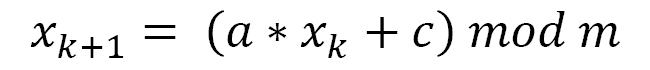

在这里，我们可以观察到以下情况：

*   *a*为乘法器（非负整数）
*   *c*为增量（非负整数）
*   *m*为模式（非负整数）
*   *x*0 为初始值（种子或非负整数）

由*模*表示的**模函数**导致第一个数字被第二个数字欧氏除法的剩余部分。例如，18 mod 4 给出 2，因为它是两个数字之间欧几里得除法的剩余部分。

线性同余技术具有以下特点：

*   它是周期性的，周期大约等于*m*
*   生成的数字被离散化

为了有效地使用该技术，有必要选择非常大的*m*值。例如，设置该方法的参数并生成前 16 个伪随机值。下面是允许我们生成该数字序列的 Python 代码：

```py
import numpy as np
a = 2
c = 4
m = 5
x = 3
for i in range (1,17):
    x= np.mod((a*x+c), m)
    print(x)
```

返回以下结果：

```py
0
4
2
3
0
4
2
3
0
4
2
3
0
4
2
3
```

在这种情况下，周期等于`4`。很容易验证，在区间[0，*m*-1]中最多可以生成*m*个不同的整数*X*n。如果*c*=0，则生成器被称为**乘法**。让我们逐行分析 Python 代码。第一行用于导入库：

```py
import numpy as np
```

`numpy`是 Python 语言的附加科学函数库，旨在对向量和维度矩阵执行操作。`numpy`与列表和列表（矩阵）相比，可以更高效、更快地处理向量和矩阵。此外，它还包含一个广泛的高级数学函数库，可以对这些数组进行操作。

导入`numpy`库后，我们设置参数，允许我们使用 LCG 生成随机数：

```py
a = 2
c = 4
m = 5
x = 3
```

此时，我们可以使用 LCG 公式生成随机数。我们只生成前 16 个数字，但我们将从结果中看到，这些数字足以理解算法。为此，我们使用一个`for`循环：

```py
for i in range (1,17):
    x= np.mod((a*x+c), m)
    print(x)
```

为了根据 LCG 公式生成随机数，我们使用了`np.mod()`函数。当给定除数和除数时，此函数返回除法的余数。

## 均匀分布的随机数

可使用以下公式获得均匀分布在[0，1]之间的数字序列：


获得的序列是周期性的，周期小于等于*m*。如果周期为*m*，则它有一个完整的周期。当以下条件为真时，会发生这种情况：

*   如果*m*和*c*有素数
*   若*m*可被素数整除，则*b*必须也是可整除的
*   If *m* is divisible by 4, then *a* - 1 must also be divisible by 4

    重要提示

    通过选择较大的值*m*，可以减少周期性现象和生成有理数的问题。

此外，出于仿真目的，不必生成[0，1]之间的所有数字，因为这些数字是无限的。然而，有必要使范围内尽可能多的数字具有相同的生成概率。

通常，*m*的值为*m*≥ 109 使得生成的数字构成了区间[0,1]的稠密子集。

在 32 位计算机中广泛使用的乘法生成器的一个例子是**Lewis 生成器**。这是一个生成器，其中参数采用以下值：

*   `a = 75`
*   `c = 0`
*   `m = 2`31 `– 1`

让我们分析根据此方法生成前 100 个随机数的代码：

```py
import numpy as np
a = 75
c = 0
m = 2**(31) -1
x = 0.1
for i in range(1,100):
    x= np.mod((a*x+c),m)
    u = x/m
    print(u)
```

我们刚才看到的代码是在本章的*线性同余生成器*部分逐行分析的。除了参数值之外，差异还在于通过以下命令在[0,1]范围内生成均匀分布：

```py
u = x/m
```

返回以下结果：

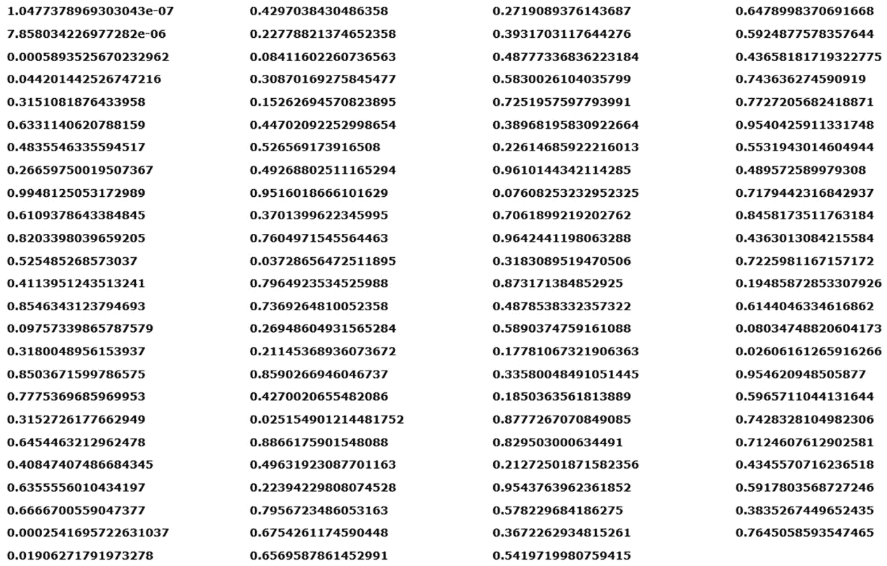

图 2.4–LCG 输出

由于我们处理的是随机数，因此输出将与前一个不同。

不同发生器之间的比较必须基于对周期性的分析、所产生数的均匀性的优点以及计算的简单性。这是因为生成非常大的数字会导致使用昂贵的计算机资源。此外，如果*X*n 数字太大，它们会被截断，这可能会导致丢失所需的一致性统计信息。

## 滞后斐波那契发生器

生成伪随机数的**滞后斐波那契算法**源于对线性同余方法的推广。导致寻找新生成器的原因之一是需要延长生成器周期，这对于许多应用程序特别是并行计算非常有用。当*m*约为 109 时，线性发电机的周期足以满足许多应用，但并非所有应用。

开发的技术之一是使*X*n+1 依赖于前面的两个值*X*n 和*X*n− 1，而不是像 LCG 方法那样仅在*X*n 上。在这种情况下，周期可能接近值*m*2，因为在获得以下等式之前，序列不会重复自身：

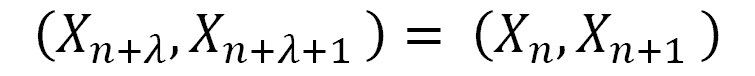

这种类型的最简单生成器是斐波那契序列，由以下等式表示：

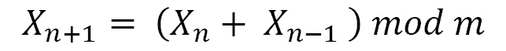

该生成器在 20 世纪 50 年代首次被分析，并提供了一个周期*m*，但序列没有通过最简单的统计测试。然后，我们尝试使用以下等式改进序列：


这个序列虽然比斐波那契序列好，但不能得到令人满意的结果。我们不得不等到 1958 年，当时米切尔和摩尔提出了以下顺序：

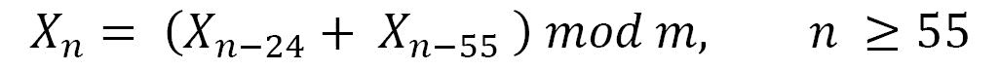

这里，*m*是偶数，X0。。。X54 是并非全部为偶数的任意整数。常数 24 和 55 不是随机选择的，而是定义其最低有效位（*X*n mod 2）的周期长度为 255-1 的序列的数字。因此，序列（*X*n）的周期长度必须至少为 255-1。演替周期为*2*M-1（255-1），其中*M*M=2M。

数字 24 和 55 为通常称为滞后，序列（*X*n）称为**滞后斐波那契发生器**（**LFG**。LFG 序列可通过以下等式进行推广：


这里，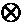指的是以下任何一种操作：+，−, ×，或（不含或）。

只有一些对（*k*、*l*给出足够长的周期。在这些情况下，周期为 2M-1（2l-1）。必须正确选择对（*k*、*l*）。第一个*l*值的唯一条件是其中至少有一个必须是奇数；否则，序列将由偶数组成。

让我们看看如何使用以下参数在 Python 中实现加法 LFG 的简单示例：*x*0=*x*1=1 和*m*232。以下是生成前 100 个随机数的代码：

```py
import numpy as np
x0=1
x1=1
m=2**32
for i in range (1,101):
    x= np.mod((x0+x1), m)
    x0=x1
    x1=x
    print(x)
```

让我们逐行分析 Python 代码。第一行用于导入库：

```py
import numpy as np
```

导入`numpy`库后，我们设置参数，允许我们使用 LFG 生成随机数：

```py
x0=1
x1=1
m=2**32
```

此时，我们可以使用 LFG 公式生成随机数。我们只生成前 100 个数字。为此，我们使用一个`for`循环：

```py
for i in range (1,101):
    x= np.mod((x0+x1), m)
    x0=x1
    x1=x
    print(x)
```

为了根据 LFG 公式生成随机数，我们使用了`np.mod()`函数。当给定除数和除数时，此函数返回除法的余数。生成随机数后，前两个值更新如下：

```py
x0=x1
x1=x
```

打印以下随机数：


图 2.5–使用 LFG 的随机数表

LFG 的初始化特别复杂，该方法的结果对初始条件非常敏感。如果在选择初始值时没有特别小心，输出序列中可能会出现统计上的缺陷。这些缺陷可能会硬化初始值以及具有仔细周期性的后续值。LFG 的另一个潜在问题是，该方法背后的数学理论不完整，因此有必要依赖统计测试而非理论性能。

# 测试均匀分布

测试适应性（即拟合优度）通常用于验证检查下的变量是否具有一定的假设分布，通常基于实验数据。它用于比较样本中观察到的一组频率，以及假设总体具有类似的理论数量。通过测试，可以定量测量两组值之间的偏差程度。

在样本中获得的结果并不总是与根据概率规则预期的理论结果完全一致。事实上，这种情况很少发生。例如，尽管理论上的考虑使我们预计一枚硬币的 200 次翻转会产生 100 个正面和 100 个反面，但这些结果很少能准确获得。然而，尽管如此，我们不能不必要地推断硬币是被操纵的。

## 卡方检验

**卡方检验**是对假设的检验，它让我们回到了两个变量之间关系的显著性。这是一种基于卡方统计量及其概率分布的统计推断技术。它可以与标称和/或序数变量一起使用，通常以列联表的形式排列。

该统计数据的主要目的是验证观测值和理论值（称为*预期*值）之间的差异，并推断两者之间的偏差程度。该技术用于三个不同的目标，它们都基于相同的基本原则：

*   分类变量分布的随机性
*   两个定性变量（标称或序数）的独立性
*   与理论模型的差异

现在，我们将考虑第一个方面。该方法包括观察到的经验频率和理论频率之间的比较程序。让我们考虑下面的定义：

*   **H**0：无效假设或两个变量之间缺乏统计关系
*   **H**1：支持关系存在的研究假设，如*H*0 为假，则*H*1 为真
*   **F**o：观察频率，即检测到的一个小区的数据数
*   **F**e：预期频率，即如果考虑的两个变量之间没有关联，则应根据边际总和获得的频率

卡方检验基于观察到的频率和预期频率之间的差异。如果观察到的频率与预期频率非常不同，则两个变量之间存在关联。

随着观测频率和预期频率之间的差异增加，卡方值也随之增加。卡方值使用以下公式计算：

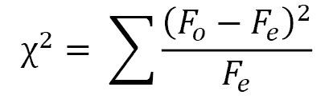

让我们看一个例子来了解如何计算这个值。我们建立了一个列联表，显示学生对特定课程的选择除以类型。这些是观察值：


图 2.6——按类型划分的学生选择表

此外，我们计算每个值在列总数（观察频率）中的百分比表示：


图 2.7–列总数百分比选择表

现在我们计算期望值，如下所示：


让我们计算第一个细胞的值（生物技术-男性）：


预期值的权变矩阵如下所示：


图 2.8–应急矩阵表

让我们计算偶然性差异（*Fo*–*Fe*），如下所示：


图 2.9–接触差异表

最后，我们可以计算卡方值，如下所示：

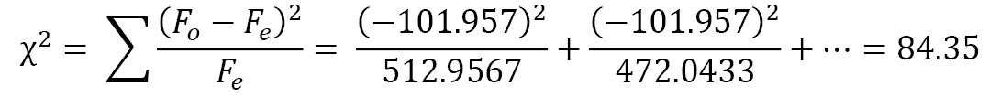

如果这两个字符是独立的，我们将期望卡方值为零。另一方面，随机波动总是可能的。因此，即使在完全独立的情况下，我们也永远不会有零。因此，即使是远离零的卡方值也可以使结果与零假设 H0 兼容，即变量之间的独立性。

重要提示

出现的一个问题是，获得的值是波动的结果，还是数据之间的依赖性导致的？

统计理论告诉我们，如果变量是独立的，卡方频率的分布遵循不对称曲线。在我们的例子中，我们有一个包含两个特征的频率分布表：课程和性别。即三种模式的课程特征和两种模式的体裁特征。在独立的情况下，右边保留 5%概率的平方值是多少？

为了回答这个问题，我们必须首先计算所谓的自由度*n*，其定义如下：


在我们的情况下，从列联表中，我们获得以下信息：


现在我们需要以下卡方分布表：


图 2.10–卡方分布表

在上一个表中，我们在第一列中查找值*n*=2，然后滚动行，直到到达等于 0.05 的列。在这里，我们发现以下内容：

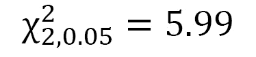

这意味着如果数据是独立的，我们只有 5%的机会从计算中得到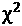>5.99。在获得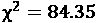之后，我们可以放弃独立于数据的无效假设*H*0，置信度为 5%。这意味着*H*0 为真的可能性只有 5%。因此，研究假设*H*1 将是正确的，置信度为 95%。

## 均匀性试验

生成伪随机数字序列后，有必要验证所获得序列的优度。这是一个问题，检查获得的序列（构成实验的随机样本）是否遵循均匀分布。为了进行这项检查，我们可以使用χ2 检验（卡方检验）。让我们演示如何执行此操作。

第一个操作是将间隔[0，1]划分为相同长度的*s*子间隔。然后，我们计算生成的序列在第*i*个间隔中包含的数量，如下所示：

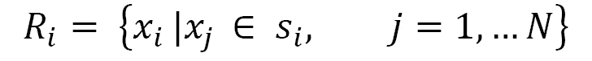

*R*i 值应尽可能接近*N/s*值。如果序列是完全一致的，那么每个子区间在序列中都有相同数量的样本。

我们用*V*表示执行测试的变量。该变量使用以下公式计算：

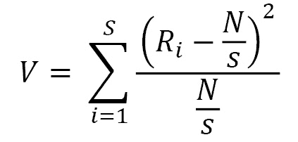

在介绍了允许我们执行一致性测试的工具之后，让我们分析一个实际示例，它将帮助我们理解如何执行此过程。我们通过全等线性生成器，通过如下固定参数，生成 100 个值的伪随机数字序列：

*   `a = 75`
*   `c = 0`
*   `m = 2`31 `– 1`

这是已经在*滞后斐波那契发生器*部分中看到的随机数发生器。我们已经引入了允许我们生成序列的代码，因此让我们通过将序列存储在数组中来修改它以满足我们的新需求：

```py
import numpy as np
a = 75
c = 0
m = 2**(31) -1
x = 0.1
u=np.array([])
for i in range(0,100):
    x= np.mod((a*x+c),m)
    u= np.append(u,x/m)
    print(u[i])
```

返回以下结果：


图 2.11–LFG 随机数输出表

为了更好地理解数字在所考虑的范围内是如何分布的，我们将区间[0，1]划分为 20 个部分`(s = 20)`，然后计算每个振幅区间`0.05`中的序列值。

最后，我们计算`V`变量：

```py
N=100
s=20
Ns =N/s
S = np.arange(0, 1, 0.05)
counts = np.empty(S.shape, dtype=int)
V=0
for i in range(0,20):
    counts[i] = len(np.where((u >= S[i]) & (u < S[i]+0.05))[0])
    V=V+(counts[i]-Ns)**2 / Ns
print("R = ",counts)
print("V = ", V)
```

让我们逐行分析代码：

```py
N=100
s=20
Ns =N/s
```

前三行设置变量`N`（随机数的数量）和`s`（PAT 的数量），然后我们计算比率。

然后，我们将区间[0,1]划分为 20 个子区间：

```py
S = np.arange(0, 1, 0.05)
```

现在我们初始化`counts`数组，该数组包含每个间隔中序列的值的数量，以及*V*变量，如下所示：

```py
counts = np.empty(S.shape, dtype=int)
V=0
```

为了计算每个间隔内序列的值的数量，我们将使用一个`for`循环：

```py
for i in range(0,20):
    counts[i] = len(np.where((u >= S[i]) & (u < S[i]+0.05))[0])
    V=V+(counts[i]-Ns)**2 / Ns
```

首先，我们使用`np.where()`函数来计算有多少值满足以下条件（`(u >= S[i]) & (u < S[i]+0.05)`）；这些是每个子区间的极值。然后，我们使用以下等式计算*V*变量：


最后，我们将打印结果：

```py
print("R = ",counts)
print("V = ", V)
```

返回以下结果：

```py
R =  [8 3 4 7 4 5 2 3 7 7 5 4 5 2 7 5 5 5 3 9]
V =  14.8
```

在分析计算结果的意义之前，让我们考虑得到的计数序列。为了了解获得的频率分布，我们绘制了一个条形图：

```py
import matplotlib.pyplot as plt
Ypos = np.arange(len(counts))
plt.bar(Ypos,counts)
```

打印以下绘图：


图 2.12–频率分布

如您所见，所有范围都包含从最小值 2 到最大值 9 的值。

但是现在我们来分析一下得到的`V`的值。正如我们所预料的，`V = 14.8`，那么我们如何处理这个值呢？首先，我们来计算所谓的自由度，*n*：


现在，我们必须将得到的`V`值与超过临界值的概率进行比较。要获得该值，我们必须可视化卡方分布表：

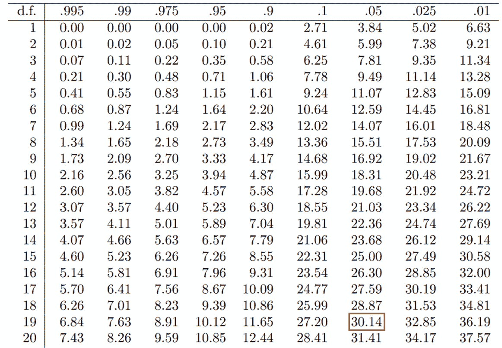

图 2.13–卡方分布表

在上一个表中，我们在第一列中查找值*n*=19，然后滚动行，直到到达等于 0.05 的列。在这里，我们发现以下内容：


如果`V`检验的统计量较小（14.8<30.14），则我们可以接受生成序列的一致性假设。

# 探索随机分布的通用方法

大多数编程语言为用户提供了生成[0,1]范围内均匀分布的伪随机数的函数。这些发电机通常被认为是连续的。然而，在现实中，它们是离散的，即使它们有一个非常小的离散化步骤。任何伪随机数序列都可以由随机数的均匀分布生成。在下面的章节中，我们将研究一些方法，这些方法允许我们从随机数的均匀分布开始推导通用分布。

## 逆变换采样法

通过在[0,1]范围内具有连续且均匀分布的PRNG，可以使用逆变换采样技术生成具有任何概率分布的连续序列。考虑一个连续的随机变量，Po.T2×x，Po.t3}，具有概率 T4（f）（x）Po.T5 的概率密度函数。为该功能确定相应的分布函数*F（x）*，如下所示：


随机变量的分布函数*F（x）*表示该变量取值小于或等于*x*的概率。然后确定逆函数的解析表达式（如果有），例如*x*=*F*-1。变量*x*样本的确定是通过生成一个介于 0 和 1 之间的值并将其替换为逆分布函数的表达式来实现的。

该方法可用于从许多类型的分布函数（如指数分布函数、均匀分布函数或三角形分布函数）中获取样本。事实证明，这是最直观的方法，但不是最有效的计算方法。

让我们从递减指数分布开始：

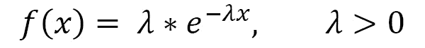

为该函数确定相应的分布函数*F（x）*，如下所示：


递减指数分布函数的趋势如下图所示：


图 2.14–递减指数函数的表示

通过求解积分得到分布函数：

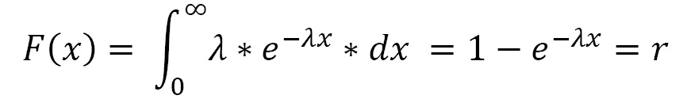

通过对分布函数进行逆变换，我们得到以下结果：


这里，*r*在[0÷1]的范围内。*r*通过均匀生成器从均匀分布中提取。如果*x*表示时间，则*λ*表示平均到达间隔频率，1/*λ*表示平均到达间隔时间。

离散情况下的逆变换方法具有非常直观的合理性。区间[0,1]被划分为振幅*p*（*x*1）、p（*x*2）、。根据这些区间是否包含正在生成的*U*，分配*X*。

## 验收-拒收方法

逆变换方法基于逆变换*F*–1 的计算，该逆变换无法始终计算（或至少不能有效计算）。在有限区间[*a*、*b*上定义的法律分布情况下，使用拒绝-接受方法。

假设我们知道随机变量*X*的概率密度，我们打算生成：*f*X（X）。这是在有限间隔上定义的，[*a*、*b*，并且图像是在[0、*c*的范围内定义的。实际上，*f*X（X）函数完全包含在矩形中，*a*、*b*]X[0、*c*，如下图所示：

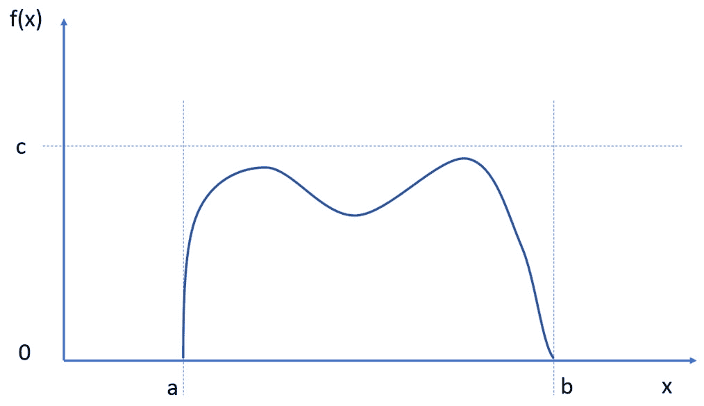

图 2.15–f（x）函数的表示

我们在[0,1]之间生成两个统一的伪随机序列：*U*1 和*U*2。接下来，我们根据以下规则推导出另外两个统一的数值序列：


每对值（*U*1、*U*2）将对应于属于矩形的一对（*x，y）*、*a*、*b*x【*0*、*c*。如果该对（*x，y*在函数*f*x（x）的区域内，则接受该对，随后将用于创建所需的伪随机序列；否则，它将被丢弃。在后一种情况下，重复该过程，直到在 fX（x）区域找到新的对为止。获得的*X*值序列是一个伪随机序列，遵循分布规律 fX（X），因为我们只选择了该区域的值。

# 使用 Python 生成随机数

到目前为止，我们已经看到了可以用来生成随机数的方法。我们也已经在 Python 代码中提出了一些解决方案，通过一些通用的方法生成随机数。这些应用有助于理解随机数生成器的基础。在 Python 中，有一个用于生成随机数的特定模块：**随机模块**。让我们看看是什么。

## 引入随机模块

随机模块实现各种分布的 PRNG。随机模块基于 Mersenne Twister 算法，该算法最初用于生成蒙特卡罗仿真的输入。Mersenne Twister 算法是一种 PRNG 算法，可产生适用于广泛应用的几乎一致的数字。

需要注意的是，随机数是使用可重复和可预测的确定性算法生成的。它们从一个特定的种子值开始，每次我们请求一个新的数字时，我们都会根据当前的种子得到一个。种子是生成器的一个属性。如果我们使用同一种子调用生成器两次，则从该种子开始生成的数字序列将始终相同。然而，这些数字将均匀分布。

让我们通过一系列实际示例详细分析模块中包含的函数。

## random.random（）函数

`random.random()`函数从生成的序列返回下一个最接近的浮点值。所有返回值都包含在`0`和`1.0`之间。让我们探讨一个使用此函数的实际示例：

```py
import random
for i in range(20):
    print('%05.4f' % random.random(), end=' ')
print()
```

我们首先导入随机模块，然后使用`for`循环生成 20 个伪随机数。每个数字的打印格式包括 5 位数字，包括 4 位小数。

返回以下结果：

```py
0.7916 0.2058 0.0654 0.6160 0.1003 0.3985 0.3573 0.9567 0.0193 0.4709 0.8573 0.2533 0.8461 0.1394 0.4332 0.7084 0.7994 0.3361 0.1639 0.4528
```

如您所见，数字在[0,1]范围内均匀分布。

通过反复运行代码，可以得到不同数字的序列。让我们尝试以下方法：

```py
0.6918 0.8197 0.4329 0.2674 0.4118 0.1937 0.2267 0.8259 0.9081 0.4583 0.7300 0.7148 0.9814 0.2237 0.7419 0.7766 0.2626 0.1886 0.1328 0.0037
```

我们已经确认，每次调用`random()`函数时，生成的序列与前一个不同。

## random.seed（）函数

正如我们已经验证的，`random()`函数每次被调用时都会产生不同的值，并且在重复任何数字之前有一个非常长的周期。这对于生成唯一的值或变量很有用，但有时，以不同的方式处理相同的数据集也很有用。为此，我们可以使用`random.seed()`函数。此函数用于初始化基本随机数生成器。让我们看一个例子：

```py
import random
random.seed(1)
for i in range(20):
    print('%05.4f' % random.random(), end=' ')
print()
```

我们使用了与上一个示例相同的代码。然而，这一次，我们设定了种子（`random.seed(1)`。括号中的数字是可选参数，可以是任何可以计算哈希的对象。如果省略此参数，则使用当前系统时间。第一次导入模块时，当前系统时间也用于初始化生成器。

返回以下结果：

```py
0.1344 0.8474 0.7638 0.2551 0.4954 0.4495 0.6516 0.7887 0.0939 0.0283 0.8358 0.4328 0.7623 0.0021 0.4454 0.7215 0.2288 0.9453 0.9014 0.0306
```

让我们看看如果我们再次启动这段代码会发生什么：

```py
0.1344 0.8474 0.7638 0.2551 0.4954 0.4495 0.6516 0.7887 0.0939 0.0283 0.8358 0.4328 0.7623 0.0021 0.4454 0.7215 0.2288 0.9453 0.9014 0.0306
```

结果是相似的。当您希望使仿真可重复时，种子设置特别有用。

## random.uniform（）函数

`random.uniform()`函数生成定义数值范围内的数字。让我们看一个例子：

```py
import random
for i in range(20):
    print('%6.4f' % random.uniform(1, 100), end=' ')
print()
```

我们要求它生成[1100]范围内的 20 个随机数。返回以下结果：

```py
26.2741 84.3327 67.6382 9.2402 2.6524 2.4414 75.8031 25.7064 11.8394 62.8554 35.0979 7.8820 16.8029 53.2107 17.6463 28.0185 71.4474 46.0155 32.8782 47.9033
```

当以明确定义的间隔请求随机数时，可以使用此函数。

## random.randint（）函数

此函数生成随机整数。`randint()`的参数是范围值，包括极端值。数字可以是负数或正数，但第一个值应小于第二个值。让我们看一个例子：

```py
import random
for i in range(20):
    print(random.randint(-100, 100), end=' ')
print()
```

返回以下结果：

```py
9 -85 88 -24 -68 -46 -88 -22 -82 -81 -21 -24 90 -60 6 44 -36 -67 -98 43
```

整个范围以随机生成的数字序列表示。

通过使用`random.range()`函数，可获得从范围中选择值的更通用形式。在这种情况下，除了开始值和结束值之外，还提供了步骤参数。让我们看一个例子：

```py
import random 
for i in range(20):
    print(random.randrange(0, 100,5), end=' ')
print()
```

返回以下结果：

```py
5 90 30 90 70 25 95 80 5 60 30 55 15 30 90 65 90 30 75 15
```

返回的序列是传递的参数所期望值的随机分布。

## 随机选择（）函数

随机数生成器的一个常见用途是从枚举值序列中选择一个随机元素，即使这些值不是数字。`choice()`函数返回作为参数传递的非空序列的随机元素：

```py
import random
CitiesList = ['Rome','New York','London','Berlin','Moskov', 'Los Angeles','Paris','Madrid','Tokio','Toronto']
for i in range(10):
    CitiesItem = random.choice(CitiesList)
    print ("Randomly selected item from Cities list is - ", CitiesItem)
```

返回以下结果：

```py
Randomly selected item from Cities list is -  Paris
Randomly selected item from Cities list is -  Moskov
Randomly selected item from Cities list is -  Tokio
Randomly selected item from Cities list is -  Madrid
Randomly selected item from Cities list is -  Rome
Randomly selected item from Cities list is -  Los Angeles
Randomly selected item from Cities list is -  Toronto
Randomly selected item from Cities list is -  Paris
Randomly selected item from Cities list is -  Moskov
Randomly selected item from Cities list is -  Rome
```

在循环的每次迭代中，从包含城市名称的列表中提取一个新元素。此功能适用于从预定列表中提取值。

## random.sample（）函数

许多仿真需要从总体输入值中随机抽取样本。`random.sample()`函数在不重复数值和不改变输入顺序的情况下生成样本。让我们看一个例子：

```py
import random
DataList = range(10,100,10)
print("Initial Data List = ",DataList)
DataSample = random.sample(DataList,k=5)
print("Sample Data List = ",DataSample)
```

返回以下结果：

```py
Initial Data List =  range(10, 100, 10)
Sample Data List =  [30, 60, 40, 20, 90]
```

最初的列表中只有五个元素被选中，而这个选择完全是随机的。

## 生成实值分布

以下函数生成实数的特定分布：

*   `betavariate`（α，β）：这是β分布。参数的条件为`alpha`>-1 和`beta`>-1。返回值的范围为 0 到 1。
*   `expovariate`（`Lambd`）：这是指数分布。`lambd`是 1.0 除以期望的平均值。（该参数应该称为“lambda”，但在 Python 中这是一个保留字。）返回值介于 0 和正无穷大之间。
*   `gammavariate`（`alpha`、`beta`：这是伽马分布。参数上的条件为`alpha`>0 和`beta`>0。
*   `gauss`（`mu, sigma`）：这是高斯分布。mu 是平均值，sigma 是标准差。这比下一步定义的`normalvariate()`函数稍快。
*   `lognormvariate`（`mu`、`sigma`：这是正态对数分布。如果取该分布的自然对数，将得到平均值为`mu`和`sigma`标准差的正态分布。mu 可以有任何值，`sigma`必须大于零。
*   `normalvariate``mu,``sigma`：这是正态分布。`mu`为平均值，`sigma`为标准差。
*   `vonmisesvariate`（`mu,kappa`）：mu 为平均角度，以弧度表示，取值范围为 0~2*pi，`kappa`为浓度参数，必须大于等于零。如果`kappa`等于零，则该分布将缩小到 0 到 2*pi 范围内的恒定随机角。
*   `paretovariate`（`alpha`）：这是帕累托分布。alpha 是表单参数。
*   `weibullvariate`（`alpha,beta`）：这是威布尔分布。这里，`alpha`是比例参数，而`beta`是形式参数。

# 总结

在本章中，我们学习了如何定义随机过程，并理解使用它们来解决许多现实问题的重要性。例如，老虎机的操作是基于随机数的生成，许多复杂的数据加密程序也是如此。接下来，我们介绍了随机数生成技术背后的概念。我们使用 Python 代码中的实际示例探索了生成随机数的主要方法。讨论了均匀分布和一般分布的产生。我们还学习了如何使用卡方法进行均匀性测试。最后，我们查看了 Python 中用于生成随机数的主要函数：`random,``seed,``uniform,``randint,``choice,`和`sample`。

在下一章中，我们将学习概率论的基本概念。此外，我们将学习如何计算事件发生后发生的概率，然后学习如何处理离散和连续分布。