# 三、概率和数据生成过程

**概率计算**领域诞生于赌博的背景下。它随后得到进一步发展，在分析集体现象方面发挥了相关作用，并成为统计学和统计决策理论的一个基本特征。概率计算是一门抽象且高度形式化的数学学科，同时保持其与原始和相关经验背景的相关性。概率的概念与不确定性的概念密切相关。事实上，事件的概率可以定义为该事件随机性水平的量化。不知道或无法绝对确定地预测的东西称为**随机**。在本章中，我们将学习如何区分概率的不同定义，以及如何将这些定义结合起来，以获得真实现象仿真中的有用信息。

在本章中，我们将介绍以下主要主题：

*   解释概率概念
*   理解贝叶斯定理
*   概率分布

# 技术要求

本章将介绍概率论。要处理这些主题，您必须具备代数和数学建模的基本知识。

要安装 Python 环境中不包含的库，请使用`pip install`命令。要使用本章中的 Python 代码，您需要以下文件（可在 GitHub 上通过以下 URL 获得：[https://github.com/PacktPublishing/Hands-On-Simulation-Modeling-with-Python](https://github.com/PacktPublishing/Hands-On-Simulation-Modeling-with-Python) ：

*   `UniformDistribution.py`
*   `BinomialDistribution.py`
*   `NormalDistribution.py`

# 解释概率概念

如果我们花点时间思考一下，我们会注意到我们的日常生活充满了**概率**考虑，尽管不一定是这样的形式化。概率评估的例子包括在获胜机会有限的情况下选择参加比赛、团队对冠军的预测、告知我们在发生交通事故时吸烟或未使用安全带导致死亡的概率的统计数据、，以及在游戏和彩票中获胜的机会。

在所有不确定性的情况下，基本上都有一种倾向，即给出一个不确定性度量，尽管用不同的术语表示，但它表达了概率的直观含义。概率具有直觉意义这一事实也意味着，在一定范围内，建立其规则可以由直觉引导。然而，完全依赖直觉可能会导致错误的结论。为了避免得出错误的结论，有必要通过以逻辑和严格的方式建立概率的规则和概念，将概率的计算形式化。

## 事件类型

我们将**事件**定义为任何结果，在实验或观察之后，可以唯一地指定明确的真实程度。在日常生活中，有些事情肯定会发生，而有些事情则永远不会发生。例如，如果一个盒子只包含黄色的弹珠，通过随机抽取一个，我们确定它将是黄色的，而不可能抽取红色的弹珠。我们称第一类事件为提取黄色大理石的事件为**特定事件**，而第二类事件为提取红色大理石的事件为**不可能事件**。

对于这两种类型的事件——确定的和不可能的——来说，是可以发生但不确定的事件。如果框中同时包含黄色和红色球，则提取黄色球是可能的，但不是确定的事件，提取红色球也是可能的。换句话说，我们无法预测提取的球的颜色，因为提取是随机的。

随机发生或不随机发生的事件称为**随机事件**。在[*第 2 章*](02.html#_idTextAnchor040)**理解随机性和随机数*中，我们引入了随机事件。这种随机事件的一个例子是被选在化学课上检查一周的作业。*

 *同一事件可以是确定的、随机的或不可能的，这取决于所考虑的环境。让我们分析一个例子：赢得百万大奖赛。如果我们购买了比赛的所有门票，这一事件可以被认为是确定的；如果我们连一个都不买，那是不可能的；如果我们买一个或多个，但不是全部，这是随机的。

## 计算概率

随机事件的接二连三导致人们对事件的发生下赌注。概率的概念正是因为赌博而诞生的。3000 年前，埃及人玩骰子游戏的祖先。骰子游戏在古罗马也很普遍，以至于一些研究发现这种游戏可以追溯到西塞罗时代。但是，对概率计算的系统研究的诞生可以追溯到 1654 年，由数学家和哲学家布莱斯·帕斯卡（Blaise Pascal）提出。

## 概率定义及实例

在我们分析一些计算事件发生概率的简单例子之前，最好先定义概率的概念。首先，我们必须区分概率定义的经典方法和**频密者**的观点。

### 先验概率

随机事件*E*的**先验概率***P（E）*定义为有利案例的*s*个数与*n*个可能案例的*n*个数之间的比率，它们都被认为具有同等的概率：


在一个盒子里，有 14 个黄色弹珠和 6 个红色弹珠。这些大理石除了颜色外，在各方面都很相似；它们是由相同的材料、相同的尺寸、完美的球形等制成的。我们会把手伸进盒子里，不看里面，随便拿出一块大理石。拉出的大理石是红色的概率是多少？

总共有 14+6=20 个弹珠。通过拉出一个弹珠，我们有 20 个可能的案例。我们没有理由认为某些大理石比其他大理石更具特权；也就是说，它们更有可能被撤出。因此，这 20 种可能的情况同样可能发生。

在这 20 个可能的案例中，只有 6 个案例中被拉出的大理石是红色的。这些都是对预期事件有利的情况。

因此，被拔出的红色大理石在 20 种可能出现的情况中有 6 种。将其概率定义为有利和可能情况之间的比率，我们将得到以下结果：


根据概率的定义，我们可以说：

*   发生不可能事件的概率为 0
*   某一事件发生的概率为 1
*   随机事件的概率介于 0 和 1 之间

在此之前，我们引入了等概率事件的概念。给定一组事件，如果没有理由认为某些事件比其他事件发生得更频繁，那么所有的组事件都应该被视为具有同等的可能性。

### 补充活动

**互补事件**是两个相互排斥的事件，通常称为*E*和*Ē*。

例如，当 Po.t0 滚动一些骰子时，我们认为事件为 AutoT1，即 Ty2 T2＝＝5 号。

补充事件将是*Ē*=第 5 个未出现。

*E*和*Ē*是相互排斥的，因为这两个事件不能同时发生；它们是穷举的，因为它们的概率之和是 1。

事件*E*有 1（5）个有利案例，事件*Ē*有 5 个有利案例；也就是说，所有剩余的案例（1、2、3、4、6）。因此，先验概率如下所示：


因此，我们可以观察到以下情况：


### 相对频率和概率

然而，概率的经典定义并不适用于所有情况。要确认所有情况的可能性相等，就要对其发生的可能性做出先验假设，从而在定义中使用您想要定义的相同概念。

在相同条件下进行的*n*实验中，事件的相对频率*f（E）*是事件发生次数*v*与进行的*n*实验次数之比：


如果我们考虑硬币的投掷，而事件发生时，古典概率给了我们以下的值：


如果我们进行多次投掷，我们会发现硬币正面朝上落下的次数几乎等于十字架出现的次数。即事件*E*的相对频率接近理论值：


给定一个随机事件*E*，在相同条件下进行*n*测试，随着测试次数的增加，相对频率的值趋于概率值。

重要提示

当进行的试验数量足够高时，可重复事件的概率与其发生的相对频率一致。

请注意，在经典定义中，概率是先验计算的，而频率是后验计算的值。

例如，在保险领域，基于频率的方法被用于评估个人的平均寿命、盗窃概率和事故概率。它也可以应用于医学领域，以评估感染某种疾病的概率，或药物有效的概率。在所有这些事件中，计算都是基于过去发生的事情；也就是说，通过计算相对频率来评估概率。

现在让我们来看另一种方法，我们可以使用它来计算概率，从而估计给定事件发生时的置信水平。

# 理解贝叶斯定理

从贝叶斯观点来看，概率度量事件发生的可能性程度。这是一个逆概率，从这个意义上说，我们从观测到的频率中获得概率。在进行实验之前，贝叶斯统计预测某一事件的概率计算；此计算是基于之前的考虑进行的。利用贝叶斯定理，通过观测频率，我们可以计算出先验概率，并由此确定后验概率。通过采用这种方法，在观察数据之前使用对给定假设可信度的预测，然后在观察数据之后使用该预测来计算概率。

重要提示

在频率分析法中，我们确定观测值在某一区间内的频率，而在贝叶斯分析法中，真实概率直接归因于该区间。

如果在一个非常大的样本范围内存在一个频数分析结果，那么贝叶斯和频数分析结果是一致的。也有一些情况下，频繁的方法是不适用的。

## 复合概率

现在，考虑两个事件，分别为 1、2 和 2。可能出现两种情况：

*   *E*1 和*E*2 是随机独立的
*   *E*1 和*E*2 具有随机依赖性

如果两个事件*E*1 和*E*2 不相互影响，也就是说，如果其中一个事件的发生不会改变第二个事件发生的概率，那么这两个事件*E*1 和*E*2 是随机独立的。相反，如果两个事件中的一个发生改变了第二个发生的概率，则两个事件*E*1 和*E*2】是随机相关的。

让我们来看一个例子：你从一副 40 人的牌中抽出一张牌，其中包含数字 1-7，再加上每套西装的三张脸牌。这是一张脸牌和红心牌的概率是多少？

首先，我们必须扪心自问这两个事件是相互依存的还是相互独立的。

有 12 个面，每个符号三个，因此第一个事件的概率等于 12/40，即 3/10。卡片来自红心套装的概率不受卡片是人脸事件发生的影响；因此，它值 10/40，即 1/4。因此，复合概率为 3/40。

因此，这是一个独立事件的情况。**复合概率**由单个事件概率的乘积给出，如下所示：


让我们看第二个例子：我们从一副 40 人的牌中抽出一张牌，然后在不把它放回牌组的情况下，再抽出一张。他们是两个皇后的概率是多少？

第一个事件的概率为 4/40，即 1/10。但是当抽到第二张牌时，只剩下 39 张了，只有三个皇后。因此，第二张牌仍然是女王的概率将变为 3/39，即 1/13。因此，复合概率将由第一张牌是女王的概率与第二张牌仍然是女王的概率的乘积给出，即 1/130。

因此，这是一个依赖事件的情况；也就是说，第二个事件的概率取决于第一个事件的发生。类似地，如果两张牌同时抽牌，则这两个事件被视为相关事件，而没有重新融入。

当*E*2 事件的概率取决于*E*1 事件的发生时，我们说的是**条件概率**，用*P（E*2*E*1*表示*E*的概率 2 以*E*1 为条件。*

 *当两个事件随机相关时，复合概率由以下等式给出：

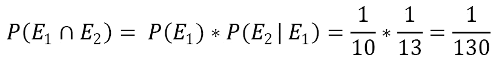

从前面的方程中，我们可以推导出给出条件概率的方程：


在定义了条件概率的概念之后，我们可以继续分析贝叶斯统计的核心。

## 贝叶斯定理

假设*E*1 和*E*2 是两个依赖事件。在*复合概率*一节中，我们了解到两个事件之间的复合概率使用以下公式计算：

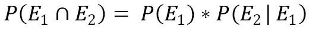

通过交换两个事件的顺序，我们可以写出以下等式：

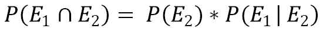

前面两个方程式的左边部分包含相同的量，右边部分也必须如此。基于这一考虑，我们可以写出以下方程式：


通过交换事件顺序也是如此：

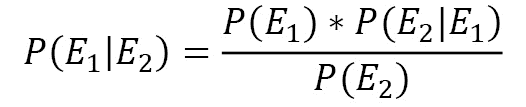

前面的方程表示贝叶斯定理的数学公式。使用其中一种取决于我们工作的目的。贝叶斯定理由两个基本概率定理导出：复合概率定理和全概率定理。它用于计算触发已验证事件的原因的概率。

在 Bayes 定理中，我们知道实验的结果，我们想计算它是由某种原因引起的概率。让我们详细分析形式化 Bayes 定理的方程中出现的元素：


在这里，我们有以下几点：

*   是称为**后验概率**（我们要计算的）
*   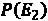是称为**先验概率**
*   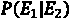称为**似然**（表示在正确假设为 E2 时观察 E1 事件的概率）
*   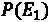被称为**边际似然**

贝叶斯定理适用于许多实际情况，例如在医学领域，在一次分析中发现假阳性，或者验证药物的有效性。

现在，让我们学习如何在实验中表示可能结果的概率。

# 探索概率分布

**概率分布**是一个数学模型，将变量的值与可观察到这些值的概率联系起来。概率分布用于仿真与参考人群或研究者观察给定样本的所有案例相关的感兴趣现象的行为。

根据感兴趣的变量*X*的测量尺度，我们可以区分两种类型的概率分布：

*   **连续分布**：变量以连续标度表示
*   **离散分布**：变量采用整数值测量

在这种情况下，感兴趣的变量被视为一个随机变量，其概率定律表示可以观察到其值的不确定性程度。概率分布分别由称为**概率密度函数**（*f（x）*）或**概率函数**（*p（x）*的数学定律表示，用于连续或离散分布。下图显示了连续分布（左侧）和离散分布（右侧）：


图 3.1–连续分布和离散分布

为了分析一系列数据是如何分布的，我们假设这些数据可以取任何实际值，有必要从概率密度函数的定义开始。让我们看看它是如何工作的。

## 概率密度函数

**概率密度函数（PDF）***P（x）*表示连续变量的给定*x*值包含在区间（*x*、*x+Δx*中的概率*P（x）*，除以区间*的宽度Δx*，当趋于零时：


在区间*a*、*b*中找到给定*x*值的概率由下式给出：

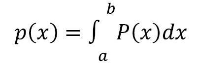

由于*x*取实值，因此以下属性成立：


实际上，我们没有一个无限的实数集，而是一个离散的实数集*x*i。然后，我们继续将区间[*x*min、*x*max]划分为振幅为*Δx*的子区间（BIN）的一定数量*N*c，考虑概率的定义为有利案例数量与可能案例数量之间的比率。

PDF 的计算是指将区间[*x*min、*x*max]划分为*N*c 子区间，并在将每个数值除以*Δx*N*之前，计算每个子区间中有多少*x*i 值落入其中，如下式所示：

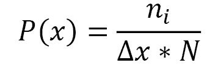

在这里，我们可以看到以下内容：

*   *P（x）*是 PDF 格式
*   *n*i 是属于*i-th*子区间的*x*值的数量
*   为各子区间的振幅
*   为*x*的观测次数

现在，让我们学习如何在 Python 环境中确定变量的概率分布。

## 均值和方差

期望值也称为随机变量分布的平均值，是位置指数。随机变量的期望值表示通过足够多的测试可以获得的期望值，以便能够通过概率预测各种事件的相对频率。

如果分布是有限的，则离散随机变量的期望值是一个实数，由各概率下随机变量各值的乘积之和给出：

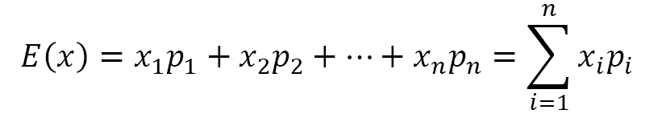

因此，期望值是随机变量在与相关概率加权时假设的值的加权和。因此，它可以是负的，也可以是正的。

在期望值之后，描述随机变量概率分布的最常用参数是方差，它表示随机变量的值相对于其平均值的分散程度。

给定一个随机变量*X*，无论什么*E（X）*都是它的期望值。考虑随机变量 Po.T4，X -E（X），ORT T5，其值是 AutoT6，x，x，T7，t 的值与期望值之间的距离。用变量*X*代替变量*X–E（X）*相当于平移将期望值带到轴原点的参考系。

如果分布是有限的，离散随机变量*X*的方差通过以下公式计算：


当变量的所有值相等时，方差等于零，因此分布中没有可变性；在任何情况下，它都是正的，并测量分布的可变性程度。方差越大，值越分散。方差越小，*X*的值越集中在平均值周围。

## 均匀分布

连续变量概率分布函数中最简单的是指在一定范围内定义的变量的所有可能值都具有相同的置信度。由于概率密度函数是常数，分布函数是线性的。当测量误差确定某个变量包含在某个范围内时，均匀分布用于处理测量误差，但没有理由相信某些值比其他值更合理。使用合适的技术，从均匀分布的变量开始，可以构建任意分布的其他变量。

现在，让我们开始练习使用它。我们将从生成包含在特定范围内的随机数的均匀分布开始。为此，我们将使用`numpy``random.uniform()`函数。此函数生成均匀分布在半开放区间*【a，b】*上的随机值；即，它包括第一个，但不包括第二个。给定区间内的任何值都同样可能通过均匀分布得出：

1.  To start, we import the necessary libraries:

    ```py
    import numpy as np
    import matplotlib.pyplot as plt
    ```

    `numpy`是一个 Python 库，其中包含许多函数，可帮助我们管理多维矩阵。此外，它还包含大量高级数学函数，我们可以对这些矩阵执行这些函数。

    `matplotlib`是用于打印高质量图形的 Python 库。使用`matplotlib`可以通过几个命令生成图形、直方图、条形图、功率谱、误差图、散点图等。这是一组命令行函数，类似于 MATLAB 软件提供的那些函数。

2.  After this, we define the extremes of the range and the number of values we want to generate:

    ```py
    a=1
    b=100
    N=100  
    ```

    现在我们可以使用`random.uniform()`函数生成均匀分布，如下所示：

    ```py
    X1=np.random.uniform(a,b,N)
    ```

    有了它，我们可以查看我们生成的数字。首先，绘制一张图表，报告我们生成的 100 个随机数的值：

    ```py
    plt.plot(X1)
    plt.show()
    ```

    将输出以下图形：

    

    图 3.2–绘制 100 个数字的示意图

3.  At this point, to analyze how the generated values are distributed in the interval considered, we draw a graph of the probability density function:

    ```py
    plt.figure()
    plt.hist(X1, density=True, histtype='stepfilled', alpha=0.2)
    plt.show()
    ```

    `matplotlib.hist()`函数绘制直方图，即类中显示的连续字符的图表。在许多情况下，当自变量定义的区间划分为子区间时，它通常用于显示统计数据。这些子间隔可以是固有的或人为的，可以是等幅或不等幅的，并且是或可以被认为是恒定的。这些变量可以是自变量，也可以是因变量。每个矩形的非随机长度等于它所表示的类的宽度。每个矩形的高度等于与该类别相关联的绝对频率与该类别的振幅之比，可定义为**频率密度**。通过以下四个参数：

    *   `X1`：输入值。
    *   `density=True`：这是一个布尔值，如果`True`，则使函数返回归一化的计数以形成概率密度。
    *   `histtype='stepfilled'`：此参数定义要绘制的直方图类型。`stepfilled`值生成默认填充的线形图。
    *   `alpha=0.2`: This is a float value that defines the characteristics of the content (0.0 is transparent and 1.0 is opaque).

        将输出以下图形：


图 3.3–绘制生成值的图表

在这里，我们可以看到生成的值几乎均匀地分布在整个范围内。如果我们增加生成值的数量会发生什么？

1.  Then, we repeat the commands we just analyzed to modify only the number of samples to be managed. We change this from `100` to `10000`:

    ```py
    a=1
    b=100
    N=10000  
    X2=np.random.uniform(a,b,N)
    plt.figure()
    plt.plot(X2)
    plt.show()
    plt.figure()
    plt.hist(X2, density=True, histtype='stepfilled', alpha=0.2)
    plt.show()
    ```

    因为我们使用的是相同的命令，所以没有必要逐行重新分析代码片段。让我们从生成的值开始查看结果：


图 3.4–绘制样本数量的图表

现在，生成的样本数量显著增加。让我们看看它们在所考虑的范围内是如何分布的：


图 3.5–显示样本分布的图表

分析之前的直方图，并将其与我们在`N=100`案例中获得的进行比较，我们可以看到，这一次，分布似乎更平坦。随着`N`的增加，分布变得越来越平坦，从而增加了每个箱子中的统计数据。

## 二项分布

在许多情况下，我们感兴趣的是检查某个特征是否发生。这对应于一个只有两种可能结果的实验，也称为二分法，可以用随机变量*X*建模，该随机变量假设值 1（成功）的概率为*p*，值 0（失败）的概率为*1-p*，概率为*0<p<1*，具体如下：


*X*的预期值和方差计算如下：


二项分布是在*n*独立试验中获得*x*成功的概率。二项分布的概率密度可通过以下等式获得：


在这里，我们有以下几点：

*   *P*x 为概率密度
*   *n*为独立实验数
*   *x*是成功的次数
*   *p*是成功的概率
*   *q*为失败概率

现在，让我们看一个实际的例子。我们掷骰子`n = 10`次。在这种情况下，我们想研究二项变量`x`=数字乘以数字<=3 的次数。我们将问题的参数定义如下：


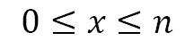


然后，我们使用 Python 代码评估概率密度函数，如下所示：

1.  Let's start as always by importing the necessary libraries:

    ```py
    import numpy as np
    import matplotlib.pyplot as plt
    ```

    现在，我们设置问题的参数：

    ```py
    N = 1000
    n = 10
    p = 0.5
    ```

    这里，`N`是试验次数，`n`是每个试验中独立试验的次数，`p`是每个试验成功的概率。

2.  Now, we can generate the probability distribution:

    ```py
    P1 = np.random.binomial(n,p,N)
    ```

    `numpy``random.binomial()`函数根据二项分布生成值。这些值是从具有指定的参数的二项分布中提取的。结果是一个参数化的二项分布，其中每个值等于在`n`独立实验中获得的成功次数。让我们来看一下返回值：

    ```py
    plt.plot(P1)
    plt.show()
    ```

    将输出以下图形：

    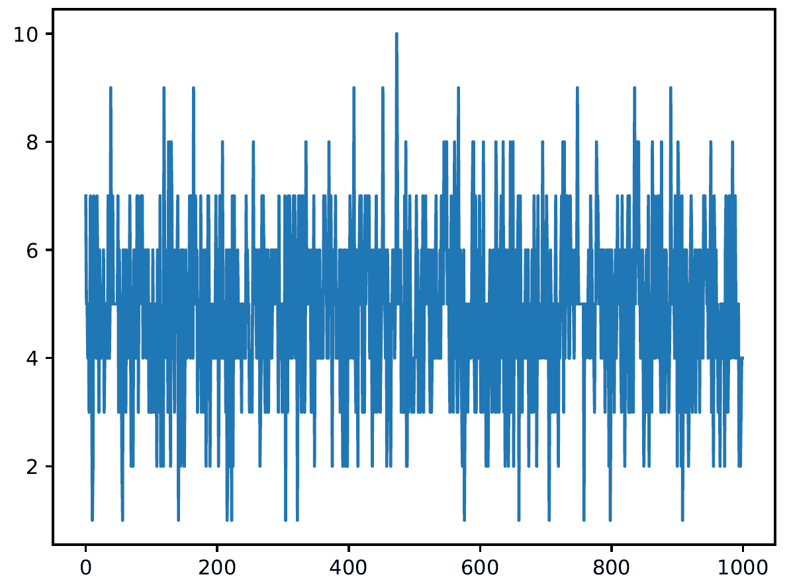

    图 3.6–绘制二项分布返回值的图表

    让我们看看这些样本在考虑的范围内是如何分布的：

    ```py
    plt.figure()
    plt.hist(P1, density=True, alpha=0.8, histtype='bar', color = 'green', ec='black')
    plt.show()
    ```

    这一次，我们使用了更高的 alpha 值使颜色更亮，我们使用了传统的条形图类型，并设置了条形图的颜色。

3.  最后，我们使用参数`ec`参数来设置每个条的边缘颜色。获得了以下结果：

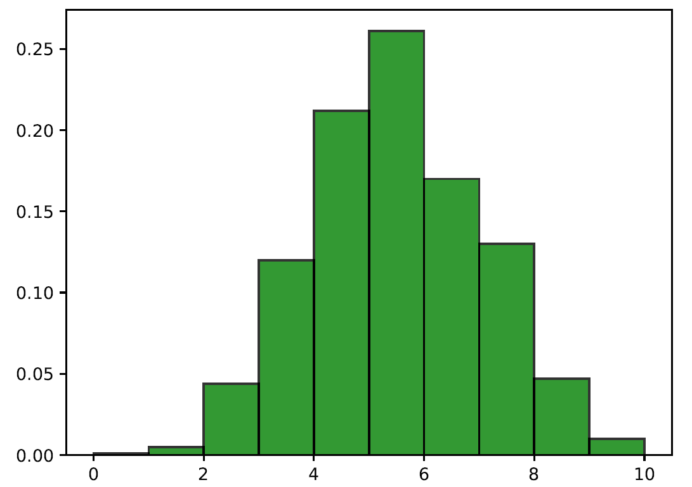

图 3.7–绘制返回值的直方图

二项分布的所有面积，即矩形的和，即概率的和，都值 1。

## 正态分布

随着独立实验数量的增加，二项分布接近一条曲线，称为**钟形曲线**或**高斯曲线**。**正态分布**，也称为高斯分布**高斯分布**，是统计学中最常用的连续分布。正态分布在统计学中很重要，原因如下：

*   几个连续的现象似乎遵循，至少是近似的，正态分布。
*   正态分布可用于近似许多离散概率分布。
*   正态分布是借助中心极限定理进行经典统计推断的基础。

正态分布有一些重要特征：

*   正态分布是对称的钟形分布。
*   它的中心位置指标——预期值和中位数——是一致的。
*   它的四分位范围是均方差的 1.33 倍。
*   正态分布中的随机变量取值范围为-∞ 及+∞.

在正态分布的情况下，正态概率密度函数由以下等式给出：


在这里，我们有以下几点：

*   为期望值。
*   为标准偏差。

注意，由于*e*和*π*是数学常数，正态分布的概率仅取决于参数*µ*和*σ*假设的值。

现在，让我们学习如何在 Python 中生成正态分布。让我们一如既往地从导入必要的库开始：

```py
Import numpy as np
import matplotlib.pyplot as plt
import seaborn as sns
```

在这里，我们导入了一个新的 seaborn 库。它是一个 Python 库，增强了`matplotlib`模块的数据可视化工具。在 seaborn 模块中，我们可以使用几个功能以图形方式表示数据。有一些方法可以方便地使用`matplotlib`构建统计图。

现在，我们设置问题的参数。正如我们已经提到的，生成正态分布只需要两个参数：期望值和标准偏差。`μ`值也表示为分布中心，表示曲线相对于纵轴的位置。σ参数表征了曲线的形状，因为它代表了曲线最大值周围值的分散。

为了了解这两个参数的功能，我们将通过更改这些参数的值来生成正态分布，如下所示：

```py
mu = 10
sigma =2
P1 = np.random.normal(mu, sigma, 1000)
mu = 5
sigma =2
P2 = np.random.normal(mu, sigma, 1000)
mu = 15
sigma =2
P3 = np.random.normal(mu, sigma, 1000)
mu = 10
sigma =2
P4 = np.random.normal(mu, sigma, 1000)
mu = 10
sigma =1
P5 = np.random.normal(mu, sigma, 1000)
mu = 10
sigma =0.5
P6 = np.random.normal(mu, sigma, 1000)
```

对于每个分布，我们设置了两个参数（`µ`和`σ`，然后使用`numpy``random.normal()`函数生成正态分布。传递三个参数：`µ`、`σ`和要生成的样本数。此时，有必要查看生成的分布。为此，我们将使用`seaborn`库的`distplot()`功能，如下所示：

```py
Plot1 = sns.distplot(P1)
Plot2 = sns.distplot(P2)
Plot3 = sns.distplot(P3)
plt.figure()
Plot4 = sns.distplot(P4)
Plot5 = sns.distplot(P5)
Plot6 = sns.distplot(P6)
plt.show()
```

`distplot()`函数允许我们灵活地绘制观察值的单变量分布。为此，请使用`matplotlib`的 hist 函数以及 seaborn 的`kdeplot()`和`rugplot()`函数。让我们首先分析在第一张图中获得的结果：

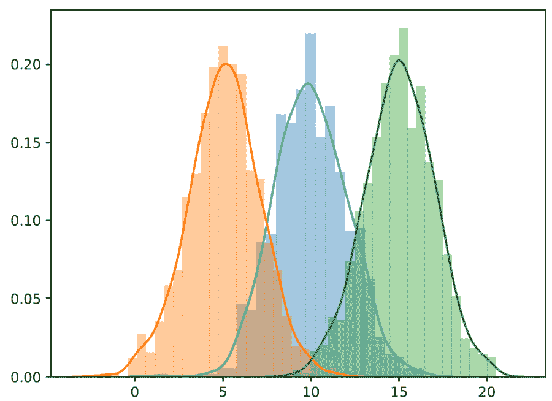

图 3.8–样本的 Seaborn 图

已生成三条曲线，代表我们命名的三种分布：*P*1、*P*2、*P*3。我们可以注意到的唯一区别在于*μ*的值，它假设值为 5、10、15。由于*μ*的变化，曲线沿*x*轴移动，但其形状保持不变。现在让我们看一下表示其余分布的图：


图 3.9——合并图

在这种情况下，通过保持*µ*的值不变，我们改变了*σ*的值，该值假设为以下值：2,1,0.5。当*σ*增大时，曲线变平变宽；当*σ*减小时，曲线变窄变宽。

特定的正态分布是通过*µ=0*和*σ=1*获得的正态分布。这种分布称为标准化正态分布。

既然我们已经看到了概率分布的所有相关类型，让我们回顾一下本章所涵盖的内容。

# 总结

深入了解概率论的基础知识有助于我们理解随机现象是如何工作的。我们发现了先验概率、复合概率和条件概率之间的差异。我们还看到了贝叶斯定理如何允许我们从先验概率和条件概率的知识出发，计算事件起因的条件概率。接下来，我们分析了一些概率分布，以及如何在 Python 中生成这些分布。

在下一章中，我们将学习蒙特卡罗仿真的基本概念，并探讨其一些应用。然后，我们将发现如何生成按照高斯分布随机分布的数字序列。最后，我们将看一看蒙特卡罗方法在计算定积分中的实际应用。**