# 七、利用仿真改进和优化系统

仿真模型允许我们使用很少的资源获得大量的信息。正如生活中经常发生的那样，仿真模型也需要进行改进，以提高其性能。通过优化技术，我们试图修改模型的性能，以在结果方面和尝试利用资源时获得改进。优化问题通常非常复杂，无法通过解析方法确定解。复杂性首先由定义问题大小的变量和约束的数量决定，然后由非线性函数的可能存在决定。为了解决优化问题，有必要使用迭代算法，在给定当前近似解的情况下，通过适当的操作序列确定对该近似的更新。从初始近似开始，确定逐步改进解决方案的近似序列。

在本章中，我们将学习如何使用主要的优化技术来提高仿真模型的性能。我们将学习如何使用梯度下降技术、牛顿-拉斐逊方法和随机梯度下降。我们还将通过实际例子学习如何应用这些技术。

在本章中，我们将介绍以下主要主题：

*   介绍数值优化技术
*   探索梯度下降技术
*   面对 Newton-Raphson 方法
*   加深对随机梯度下降的认识
*   在 Python 中发现多元优化应用程序

# 技术要求

在本章中，我们将学习如何使用仿真模型来改进和优化系统。要处理本章中的主题，您必须具备代数和数学建模的基本知识。要使用本章中的 Python 代码，您需要以下文件（可在 GitHub 上通过以下 URL 获得：[https://github.com/PacktPublishing/Hands-On-Simulation-Modeling-with-Python](https://github.com/PacktPublishing/Hands-On-Simulation-Modeling-with-Python) ：

*   `gradient_descent.py`
*   `newton_raphson.py`
*   `scipy_optimize.py`

# 引入数值优化技术

在现实生活中，优化意味着在多个可用选项中选择最佳选项。我们每个人都会优化行程以到达目的地，安排我们的一天，如何使用储蓄，等等。在数学中，优化是指确定函数变量的值，使其假定为最小值或最大值。优化是一门处理应用中有用模型的公式化的学科，因此使用有效的方法来确定最佳解决方案。

优化模型对于提供的许多应用具有极大的实际意义。事实上，有许多决策过程需要您确定最小化成本或最大化收益的选择，因此可归因于优化模型。在最优化理论中，数学最优化模型占据着一个相关的位置，对于数学最优化模型，评价函数和描述允许方案的约束通过方程和不等式表示。数学优化模型有不同的形式：

*   线性优化
*   整数优化
*   非线性优化

## 定义一个优化问题

优化问题包括尝试确定属于集合*F*的点，其中函数*F*取尽可能低的值。此问题以以下形式表示：


在这里，我们有以下几点：

*   *f*称为目标函数
*   *F* is called the feasible set and contains all the admissible choices for x

    重要提示

    如果你有一个最大化问题，也就是说，如果你必须找到一个函数*f*具有最高可能值的点，你总是可以回到最小问题，从而改变目标函数的符号。

通过满足上述关系使函数*f*最小化的元素称为全局最优解，也称为**最优解**或**最小解**。目标函数*f*的对应值称为**全局最优值**，也称为**最优**或**最小值**。

优化问题的复杂性，即其求解的难度，显然取决于目标函数的特性和柔性集的结构。通常，优化问题的特征是向量*x*的选择是否完全自由。因此，我们可以说有两类问题，如下所示：

*   无约束极小化问题，若*F=R*n；即柔性组*F*与整组*R*n 重合
*   约束极小化问题，若*FR*n；也就是说，如果柔性集合*F*只是集合*R*n 的一部分

在解决优化问题时，我们面临的第一个困难是理解值是否正确放置，在这个意义上，函数 F（x）可能不存在一个点 F，其中函数 F（x）取具有最小十进制值的 pi 值。事实上，可能发生以下情况之一：

*   柔性套件*F*可能为空。
*   柔性集合*F*可能不为空，但目标函数的下限可以等于−∞.
*   柔性集合*F*不能为空，目标函数的下限可以等于−∞ 但是，同样在这种情况下，在*f*上不可能有*f*的全局最低点。

优化问题中存在全局最小点的一个充分但非必要的条件是 Weierstrass 定理通过以下命题表示的条件：设*F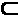R*n 为非空紧集。设*f*为*f*上的连续函数。如果是，则在*f*中存在*f*的全局最低点。

前面的命题只适用于柔性集是紧集的约束问题。为了建立非紧柔性集问题的存在性结果，即在*F=R*n 的情况下，有必要尝试刻画包含问题最优解的*F*的子集。

重要提示

紧空间是拓扑空间，它的每个开覆盖都包含一个完备子覆盖。

一般来说，手头的问题并不总是有一个最优的解决方案，而且，如果存在，也不总是唯一的。

## 解释局部最优

不幸的是，所有全局最优性条件的应用兴趣有限。事实上，它们与容许集上目标函数的整体行为有关，因此，从计算角度来看，它们必然由复杂条件描述。除了通过定义优化模型引入的全局最优性概念之外，还应该定义局部最优性的概念。

我们可以将局部最优定义为问题在可能解的小邻域内的最佳解。在下图中，我们可以确定函数*f（x）*的四个局部最小条件，因此表示局部最优：


图 7.1–f（x）函数的局部最小条件

然而，其中只有一个是全局最优，而其他三个仍然是局部最优。从应用的角度来看，局部最优性条件更有用。这些只是必要条件，但总的来说，它们是不够的。这是因为指定点是最小化问题的局部最小点。因此，从理论上看，它们并没有给出优化问题的局部极小值的令人满意的表征，但它们在定义最小化算法中起着重要的作用。

现实生活中面临的许多问题都可以表示为非线性优化问题。从技术和科学的角度来看，这激发了人们对研究和开发解决这类数学难题的方法的兴趣。

探索梯度下降技术

任何仿真算法的目标都是减少模型预测值与数据返回的实际值之间的差异。这是因为实际值和期望值之间的误差较小，表明该算法的仿真效果良好。减少这种差异仅仅意味着最小化所建立模型所基于的目标函数。

## 确定下降方式

**下降法**是迭代法，从初始点 x0Rn 开始，生成一系列点{xn}nn，由以下等式定义：


这里，向量是一个搜索方向，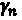标量是一个称为步长的正参数，表示我们在方向上移动的距离。

在下降法中，选择向量和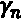参数，以确保目标*f*函数在每次迭代时减少，如下所示：


使用向量，我们取下降方向，即线*x=x*n*+*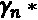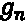与梯度向量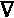f（xn）形成钝角。这样，只要足够小，就可以保证*f*的减少。

根据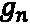的选择，有不同的下降方法。最常见的情况如下：

*   梯度下降法
*   牛顿-拉斐逊法

让我们从分析梯度下降算法开始。

## 逼近梯度下降算法

梯度是一个向量值函数，表示函数图切线的斜率，指示函数最大增长率的方向。让我们考虑下面图中所示的凸函数：

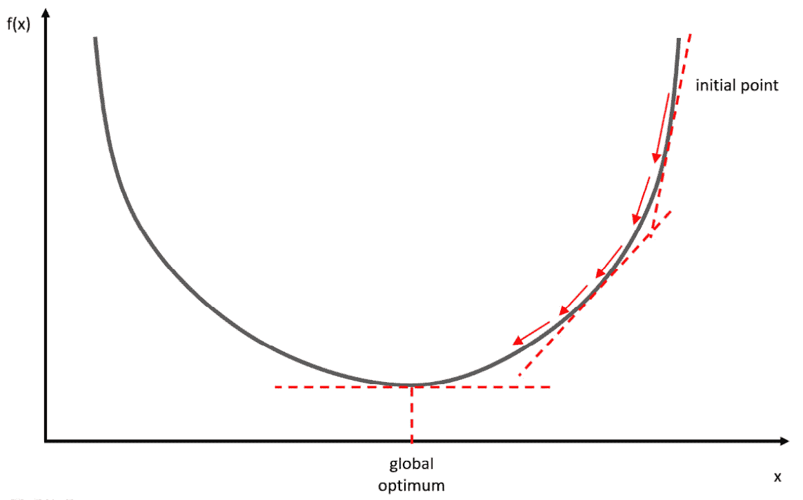

图 7.2–凸函数

梯度下降算法的目标是达到该函数的最低点。在更专业的术语中，梯度表示表示目标函数的斜率或倾斜度的导数。

为了更好地理解这一点，让我们假设我们在夜间能见度低的山中迷路了。我们只能感觉到脚下地面的坡度。我们的目标是到达山的最低点。要做到这一点，我们必须走几步，向最高坡度的方向移动。我们将迭代地这样做，一步一步地移动，直到我们最终到达山谷。

在数学中，导数是函数在给定点的变化率或斜率。导数的值是特定点的斜率。梯度表示同样的东西，另外它是一个存储偏导数的向量值函数。这意味着梯度是一个向量，它的每个分量都是对特定变量的偏导数。

让我们分析一个函数，*f（x，y）*，即一个双变量函数，*x*和*y*。其梯度是一个包含*f*偏导数的向量：第一个相对于*x*，第二个相对于*y*。如果我们计算*f*的偏导数，我们得到以下结果：

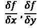

这两个表达式中的第一个称为关于*x*的偏导数，而第二个偏导数称为关于*y*。梯度为以下向量：


前面的方程是一个表示二维空间中的点或二维向量的函数。每个分量表示每个函数变量的最陡爬坡方向。因此，梯度指向函数增加最多的方向。

类似地，如果我们有一个五个变量的函数，我们会得到一个五个偏导数的梯度向量。通常，一个带有*n*变量的函数会产生*n*维梯度向量，如下所示：


然而，对于梯度下降，我们不希望尽可能快地最大化*f*。相反，我们想要最小化它，也就是说，找到最小化函数的最小点。

假设我们有一个函数*y=f（x）*。梯度下降是基于这样的观察，即如果函数 f 在*x*的邻域中定义且可微，那么如果我们沿着负梯度的方向移动，该函数下降得更快。从*x*的值开始，我们可以写出以下内容：


在这里，我们有以下几点：

*   是学习率
*   是坡度

对于足够小的值，该算法在有限的迭代次数内收敛到函数*f*的最小值。

重要提示

基本上，如果梯度为负，则该点的目标函数将减小，这意味着参数必须向更大的值移动才能达到最小值。相反，如果梯度为正，则参数会朝较小的值移动，以达到目标函数的较低值。

## 了解学习率

梯度下降算法通过迭代过程搜索目标函数的最小值。在每一步中，对梯度进行估计，以将下降方向指向使目标函数最小化的方向。在此过程中，**学习率**参数的选择变得至关重要。此参数决定我们将以多快或多慢的速度移动到目标函数的最佳值：

*   如果它太小，我们将需要太多的迭代来收敛到最佳值。
*   如果学习率很高，我们将跳过最优解。

在下图中，您可以看到学习率值施加的两种可能情况：

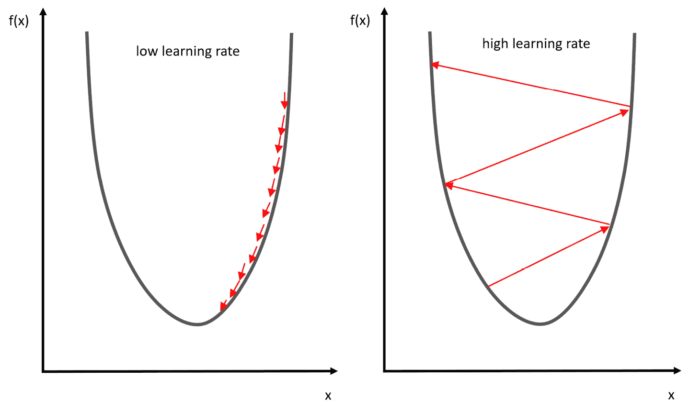

图 7.3–学习率的场景

因此，必须使用良好的学习率。确定最佳学习率的最佳方法是通过反复试验。

## 讲解试错法

术语**反复试验**定义了一种启发式方法，旨在通过尝试并检查是否产生了预期效果来找到问题的解决方案。如果是，则该尝试构成问题的解决方案；否则，我们将继续进行不同的尝试。

让我们分析一下该方法的基本特征：

*   **它面向解决方案**：它的目的不是找出一次尝试的原因，而是简单地寻找它。
*   **它是针对所讨论的问题**的：它没有权利推广到其他问题。
*   **它不是最优的**：它通常局限于寻找一个通常不是最好的解决方案的单一解决方案。
*   **它不需要对它有透彻的了解**：它建议找到一个对它知之甚少或一无所知的问题的解决方案。

试错法可以用来找到问题的所有解决方案，或者如果有多个解决方案，则可以找到其中的最佳解决方案。在这种情况下，我们不会在提供期望结果的第一次尝试时停止，而是注意到它并继续尝试，直到找到所有解决方案。最后，根据给定的标准对它们进行比较，从而确定哪一个被认为是最好的。

## 在 Python 中实现梯度下降

在这一节中，我们将通过完成一个实际示例，将迄今为止所学的应用于梯度下降。我们将定义一个函数，然后使用该方法找到函数的最小点。一如既往，我们将逐行分析代码：

1.  Let's start by importing the necessary libraries:

    ```py
    import numpy as np
    import matplotlib.pyplot as plt
    ```

    `numpy`是一个 Python 库，其中包含许多函数，可帮助我们管理多维矩阵。此外，它还包含大量高级数学函数，我们可以在这些矩阵上使用这些函数。

    `matplotlib`是用于打印高质量图形的 Python 库。使用 matplotlib，可以通过几个命令生成图形、直方图、条形图、功率谱、误差图、散点图等。它是一组命令行函数，类似于 Matlab 软件提供的那些函数。

2.  Now, let's define the function:

    ```py
    x = np.linspace(-1,3,100)
    y=x**2-2*x+1
    ```

    首先，我们为依赖的变量`x`定义了一个区间。我们只需要将函数可视化并绘制图形。为此，我们使用了`linspace()`函数。此函数用于创建数字序列。然后，我们传递了三个参数：起点、终点和要生成的点数。接下来，我们定义了一个抛物线函数。

3.  Now, we can draw a graph and display it:

    ```py
    fig = plt.figure()
    axdef = fig.add_subplot(1, 1, 1)
    axdef.spines['left'].set_position('center')
    axdef.spines['bottom'].set_position('zero')
    axdef.spines['right'].set_color('none')
    axdef.spines['top'].set_color('none')
    axdef.xaxis.set_ticks_position('bottom')
    axdef.yaxis.set_ticks_position('left')
    plt.plot(x,y, 'r')
    plt.show()
    ```

    首先，我们定义了一个新图形，然后设置轴，使 x 轴与函数的最小值重合，y 轴与抛物线的中心重合。这将使更容易直观地定位函数的最小点。打印下图：

    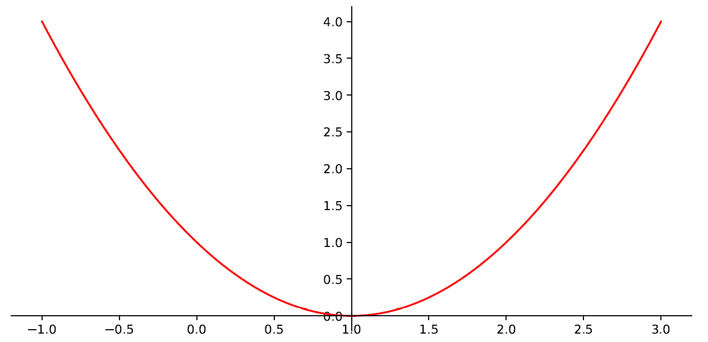

    图 7.4–功能的最小点

    如我们所见，`y = 0`对应的函数的最小值出现在`x`等于`1`的值。这将是我们必须通过梯度下降法确定的值。

4.  Now, let's define the gradient function:

    ```py
    Gradf = lambda x: 2*x-2  
    ```

    回想一下，函数的梯度是它的导数。在这种情况下，这样做很容易，因为它是一个单变量函数。

5.  Before applying the iterative procedure, it is necessary to initialize a series of variables:

    ```py
    actual_X  = 3 
    learning_rate  = 0.01 
    precision_value = 0.000001 
    previous_step_size = 1 
    max_iteration = 10000 
    iteration_counter = 0 
    ```

    如图所示：

    *   `actual_X`变量将包含自变量`x`的当前值。首先，我们在`x = 3`处初始化它，它表示函数在图形中显示范围的最右边的值。
    *   `learning_rate`变量包含学习率。如*了解学习率*部分所述，设置为`0.01`。我们可以试着看看如果我们改变这个值会发生什么。
    *   `precision_value`变量将包含定义我们算法精确度的值。作为一个迭代过程，解在每次迭代时都会被细化并趋于收敛。但是，这种收敛可能发生在大量迭代之后，因此为了节省资源，建议在达到足够精度后停止迭代过程。
    *   `previous_step_size`变量将包含该精度的计算，并将初始化为`1`。
    *   `max_iteration`变量包含我们为算法提供的最大迭代次数。如果该过程不收敛，将使用该值停止该过程。
    *   最后，`iteration_counter`变量将作为迭代计数器。
6.  Now, we are ready for the iteration procedure:

    ```py
    while previous_step_size  > precision_value  and iteration_counter  < max_iteration :
        PreviousX = actual_X 
        actual_X  = actual_X  - learning_rate  * Gradf(PreviousX) 
        previous_step_size  = abs(actual_X  - PreviousX) 
        iteration_counter  = iteration_counter +1 
        print('Number of iterations = ',iteration_counter ,'\nActual value of x  is = ',actual_X ) 
        print('X value of f(x) minimum = ', actual_X ) 
    ```

    迭代过程使用一个`while`循环，该循环将重复自身，直到两个条件都得到验证（`TRUE`。当两个参数中至少有一个假设为`FALSE`值时，循环将停止。这两个条件提供了对精度和迭代次数的检查。

    正如*定义梯度下降*部分中所预期的，该程序要求我们在梯度下降方向上更新*x*的当前值。我们使用以下等式进行计算：

    

    在循环的每个步骤中，`x`的前一个值被存储，以便我们可以计算前一个步骤的精度，作为两个`x`值之差的绝对值。此外，每一步都会增加步进计数器。在每个步骤结束时，打印迭代次数和`x`的当前值，如下所示：

    ```py
    Number of iterations =  520 
    Actual value of x  is =  1.0000547758790321
    Number of iterations =  521 
    Actual value of x  is =  1.0000536803614515
    Number of iterations =  522 
    Actual value of x  is =  1.0000526067542224
    Number of iterations =  523 
    Actual value of x  is =  1.000051554619138
    Number of iterations =  524 
    Actual value of x  is =  1.0000505235267552
    Number of iterations =  525 
    Actual value of x  is =  1.0000495130562201
    Number of iterations =  526 
    Actual value of x  is =  1.0000485227950957
    ```

    正如我们在每个步骤中所看到的，`x`的值逐渐接近精确值。这里执行了`526`迭代。

7.  At the end of the procedure, we can print the result:

    ```py
    print('X value of f(x) minimum = ', actual_X )
    ```

    返回以下结果：

    ```py
    X value of f(x) minimum =  1.0000485227950957
    ```

    我们可以验证，返回值与精确值非常接近，等于`1`。它与我们作为迭代过程的术语施加的精度值完全不同。

# 面对牛顿-拉斐逊法

牛顿法是逼近非线性方程根的主要数值方法。该函数在每次迭代时线性近似，以获得更好的零点估计。

## 使用牛顿-拉斐逊算法寻根

给定一个非线性函数 f 和一个初始近似值*x*0，牛顿方法通过在*x*的邻域中为每个*k*构建函数 f 的线性模型，生成一系列近似值{*x*k}*k>0*并用模型本身近似函数。该模型可从泰勒在属于迭代当前点*x*k 邻域的点*x*处对函数*f*的展开开始构建，如下所示：

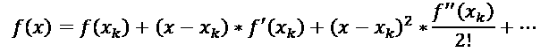

截断泰勒的一阶发展，我们得到以下线性模型：

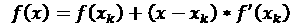

前面的方程在*x*k 的足够小的邻域内仍然有效。

以*x*0 为初始数据，第一次迭代计算*x*1 为*k=0*的前一线性模型的零点，即求解以下标量线性方程：


上一个等式导致下一个迭代的*x*1，形式如下：

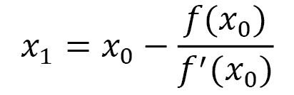

类似地，后续方程迭代*x*2，其中构造*x*3，以便我们可以详细说明一般有效性方程，如下所示：

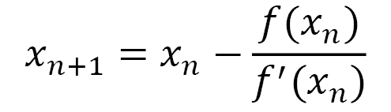

更新方程的形式类似于下降法的通用公式。从几何角度来看，之前的更新方程表示在点（*x*k，*f*（*x*k））处与函数*f*相切的线。正是由于这个原因，该方法也称为切线方法。

从几何角度来看，我们可以通过以下步骤定义此过程：

*   函数的切线在起点*x*0 处绘制。
*   这条线的截距用 x 轴标识。此点表示新值*x*1。
*   重复此过程直到收敛。

下图显示了此过程：


图 7.5–寻找切线的程序

如果每*k*一个*f'（x*k*）=0*，则该算法定义良好。关于计算成本，可以注意到，在每次迭代中，需要对函数*f*及其在点*x*k 之前的导数进行求值。

## 逼近牛顿-拉斐逊进行数值优化

牛顿-拉斐逊法也用于解决数值优化问题。在这种情况下，该方法采用牛顿法求函数零点的形式，但适用于函数*f*的导数。这是因为确定函数*f*的最小点等同于确定一阶导数*f'*的根。

在这种情况下，更新公式采用以下形式：


在上一个等式中，我们有以下等式：

*   是函数*f*的一阶导数
*   is the second derivative of the function *f*

    重要提示

    牛顿-拉斐逊法由于其速度快，通常优于下降梯度法。然而，它需要了解一阶导数和二阶导数的解析表达式，并且不分青红皂白地收敛到极小值和极大值。

有一些变体使该方法全局收敛，并通过避免使用直接方法确定研究方向来降低计算成本。

## 应用牛顿-拉斐逊技术

在本节中，我们将通过完成一个实践练习来应用到目前为止所学的牛顿-拉斐逊法。我们将定义一个函数，然后使用该方法找到函数的最小点。一如既往，我们将逐行分析代码：

1.  让我们从导入必要的库开始：

    ```py
    import numpy as np
    import matplotlib.pyplot as plt
    ```

2.  Now, let's define the function:

    ```py
    x = np.linspace(0,3,100)
    y=x**3 -2*x**2 -x + 2
    ```

    首先，我们为因变量 x 定义了一个区间。为了绘制图形，我们只需要将函数可视化。为此，我们使用了`linspace()`函数。此函数用于创建数字序列。然后，我们传递了三个参数：起点、终点和要生成的点数。接下来，我们定义了一个三次函数。

3.  Now, we can draw a graph and display it:

    ```py
    fig = plt.figure()
    axdef = fig.add_subplot(1, 1, 1)
    axdef.spines['left'].set_position('center')
    axdef.spines['bottom'].set_position('zero')
    axdef.spines['right'].set_color('none')
    axdef.spines['top'].set_color('none')
    axdef.xaxis.set_ticks_position('bottom')
    axdef.yaxis.set_ticks_position('left')
    plt.plot(x,y, 'r')
    plt.show()
    ```

    首先，我们定义了一个新图形，然后设置轴，使 x 轴与函数的最小值重合，y 轴与抛物线的中心重合。这将更容易直观地定位函数的最小点。打印以下图表：

    

    图 7.6–功能的最小点

    在这里，我们可以看到函数的最小值出现在`x`值大致等于`1.5`的情况下。这将是我们必须通过梯度下降法确定的值。但是为了获得精确的值，以便我们可以将其与稍后得到的值进行比较，我们需要提取该值：

    ```py
    print('Value of x at the minimum of the function', x[np.argmin(y)])
    ```

    为了确定这个值，我们使用了 NumPy 的`argmin()`函数。此函数返回向量中最小元素的位置索引。返回以下结果：

    ```py
    Value of x at the minimum of the function 1.5454545454545454
    ```

4.  现在，让我们定义一阶和二阶导数函数：

    ```py
    FirstDerivative = lambda x: 3*x**2-4*x -1 
    SecondDerivative = lambda x: 6*x-4  
    ```

5.  Now, we will initialize some parameters:

    ```py
    actual_X  = 3 
    precision_value  = 0.000001 
    previous_step_size  = 1 
    max_iteration  = 10000 
    iteration_counter  = 0 
    ```

    这些参数具有以下含义：

    *   `actual_X`变量将包含自变量`x`的当前值。首先，我们在`x = 3`处初始化它，它表示函数在图形中显示范围的最右边的值。
    *   `precision_value`变量将包含定义我们算法精确度的值。作为一个迭代过程，解在每次迭代时都会被细化并趋于收敛。但是，这种收敛可能发生在大量迭代之后，因此为了节省资源，建议在达到足够精度后停止迭代过程。
    *   `previous_step_size`变量将包含该精度的计算，并将初始化为`1`。
    *   `max_iteration`变量包含我们为算法提供的最大迭代次数。如果该过程不收敛，将使用该值停止该过程。
    *   最后，`iteration_counter`变量将作为迭代计数器。
6.  Now, we can apply the Newton-Raphson method, as follows:

    ```py
    while previous_step_size  > precision_value  and iteration_counter  < max_iteration :
        PreviousX = actual_X 
        actual_X  = actual_X  - FirstDerivative(PreviousX)/ SecondDerivative(PreviousX)
        previous_step_size  = abs(actual_X  - PreviousX) 
        iteration_counter  = iteration_counter +1 
        print('Number of iterations = ',iteration_counter ,'\nActual value of x  is = ',actual_X )
    ```

    这个过程类似于我们在 Python 部分中*实现梯度下降时所采用的解决问题的方法。这里使用了一个`while`循环，它将重复自身，直到两个条件都得到验证（`TRUE`。当两个参数中至少有一个假设为`FALSE`值时，循环将停止。这两个条件提供了对精度和迭代次数的检查。*

    Newton-Raphson 方法更新 x 的当前值，如下所示：

    

    在循环的每一步中，存储前一步的`x`值，以计算前一步的精度，作为两个`x`值之差的绝对值。此外，每一步都会增加步进计数器。在每一步结束时，打印迭代次数和`x`的当前值，如下所示：

    ```py
    Number of iterations =  1 
    Actual value of x  is =  2.0
    Number of iterations =  2 
    Actual value of x  is =  1.625
    Number of iterations =  3 
    Actual value of x  is =  1.5516304347826086
    Number of iterations =  4 
    Actual value of x  is =  1.5485890147300967
    Number of iterations =  5 
    Actual value of x  is =  1.5485837703704566
    Number of iterations =  6 
    Actual value of x  is =  1.5485837703548635
    ```

    正如我们在数值优化的*接近牛顿-拉斐逊*一节中提到的，达到该解所需的迭代次数严重扭曲。事实上，我们从基于梯度下降的方法收敛所需的 526 次迭代，到牛顿-拉斐逊方法的 6 次迭代。

7.  Finally, we will print the result:

    ```py
    print('X value of f(x) minimum = ', actual_X )
    ```

    返回以下结果：

    ```py
    X value of f(x) minimum =  1.5485837703548635
    ```

    我们可以验证，返回值与精确值非常接近，等于`1.5454545454545454`。它与我们作为迭代过程的术语施加的精度值完全不同。

# 加深对随机梯度下降的认识

正如我们在*探索梯度下降技术*一节中提到的，梯度下降方法的实施包括从维度空间中随机选择的配置开始，对函数及其梯度进行初始评估。

从这里开始，我们尝试沿着梯度指示的方向移动。这确定了下降方向，其中函数趋向于最小值，并检查函数是否实际采用低于先前配置中计算的值。如果是这样，该过程将继续迭代，重新计算新的渐变。这可能与前一个完全不同。在此之后，它再次开始搜索新的最小值。

此迭代过程要求在每个步骤中更新整个系统状态。这意味着必须重新计算系统的所有参数。从计算角度来看，这相当于极其昂贵的运营成本，并大大减慢了估算过程。对于标准梯度下降法，在计算整个数据集的梯度后更新权重，在随机方法中，在一定数量的示例后更新系统参数。这些是随机选择的，以加快过程，并尝试避免任何局部最小情况。

考虑包含 N 个观测现象的数据集。这里，让*f*作为一个目标函数，我们想要最小化一系列参数*x*。在这里，我们可以写出以下等式：

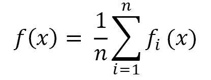

通过对上一个等式的分析，我们可以推断目标函数*f*的评估需要对函数*f*进行 n 次评估，数据集中包含的每个值一次评估。

在经典梯度下降法中，在每一步中，通过以下等式计算与数据集所有值对应的函数梯度：


在某些情况下，对上一个等式中的和的评估可能特别昂贵，例如当数据集特别大且目标函数没有基本表达式时。梯度的随机下降通过引入梯度函数的近似来解决这个问题。在每一步中，梯度的计算仅在数据集的随机子集中使用，而不是与数据集中包含的数据相对应地计算梯度的总和。

因此，前面的等式替换了以下等式：


在前面的等式中，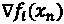是数据集中随机选择的一个观测值的梯度。

这种技术的优点如下：

*   该算法仅基于一部分观测值，允许对参数空间进行更广泛的探索，有更大的可能性找到新的和可能更好的最小点。
*   该算法的一个步骤在计算上要快得多，从而确保更快地收敛到最小点。
*   参数估计值也可以通过一次只将数据集的一部分加载到内存中来计算，从而允许将此方法应用于大型数据集。

# 在 Python 中发现多元优化方法

在本节中，我们将分析 Python SciPy 库中包含的一些数值优化方法。SciPy 是基于 NumPy 的数学算法和函数的集合。它包含一系列可用于操作和显示数据的命令和高级类。有了 SciPy，Python 中增加了功能，使其成为一个数据处理和系统原型环境，类似于商业系统，如 MATLAB。

使用 SciPy 的科学应用程序受益于世界各地开发人员在数值计算的众多领域开发的附加模块。数值优化问题也包含在可用模块中。

SciPy`optimize`模块包含许多用于最小化/最大化目标函数的函数，包括约束函数和非约束函数。它处理非线性问题，同时支持局部和全局优化算法。此外，还讨论了线性规划、约束和非线性最小二乘、寻根和曲线自适应等问题。在下面的部分中，我们将分析其中的一些。

## 内尔德-米德法

大多数著名的优化算法都是基于导数的概念和可以从梯度中推断出的信息。然而，从实际应用中衍生出的许多优化问题的特点是，目标函数的解析表达式未知，这使得无法计算其导数，或者由于其特别复杂，因此对导数进行编码可能需要太长时间。为了解决这类问题，已经开发了几种算法，这些算法不尝试近似梯度，而是使用一组采样点中的函数值通过其他方式确定新的迭代。

Nelder-Mead方法通过评估构成称为单纯形的几何形状的测试点，尝试最小化非线性函数。

重要提示

单纯形被定义为欧几里德空间中的一组闭凸点，使我们能够找到线性规划的典型优化问题的解。

选择单纯形的几何图形主要是由于两个原因：单纯形能够使其形状适应目标函数自身变形的空间趋势，以及它只需要记忆*n+1*点。基于单纯形的直接搜索方法的每次迭代都以单纯形开始，由其*n+1*顶点和相关函数的值指定。计算一个或多个测试点和函数的相应值，迭代以一个新的单纯形结束，以便函数在其顶点处的值满足与先前单纯形相关的某种形式的下降条件。

Nelder-Mead 算法在每次迭代时对函数的求值方面特别节省，因为在实践中，它通常只需要对函数进行一次或两次求值即可构建新的单纯形。但是，由于它不使用任何梯度评估，因此可能需要更长的时间才能找到最小值。

使用 SciPy`optimize`模块的`minimize`例程，该方法在 Python 中很容易实现。让我们看一个使用此方法的简单示例：

1.  Let's start by loading the necessary libraries:

    ```py
    import numpy as np
    from scipy.optimize import minimize
    import matplotlib.pyplot as plt
    from matplotlib import cm
    from matplotlib.ticker import LinearLocator, FormatStrFormatter
    from mpl_toolkits.mplot3d import Axes3D
    ```

    导入生成 3D 图形所需的库（`Axes3D`。

2.  Now, let's define the function:

    ```py
    def matyas(x):
       return 0.26*(x[0]**2+x[1]**2)-0.48*x[0]*x[1]
    ```

    Matyas 函数是连续的、凸的、单峰的、可微的和不可分离的，定义在二维空间上。`matyas`功能定义如下：

    

    这个函数是在 x，ye[-10，10]上定义的。此函数在 f（0，0）=0 中有一个全局最小值。

3.  Let's visualize the `matyas` function:

    ```py
    x = np.linspace(-10,10,100)
    y = np.linspace(-10,10,100)
    x, y = np.meshgrid(x, y)
    z = matyas([x,y])
    fig = plt.figure()
    ax = fig.gca(projection='3d')
    surf = ax.plot_surface(x, y, z, rstride=1, cstride=1, 
                          cmap=cm.RdBu,linewidth=0, antialiased=False)
    ax.zaxis.set_major_locator(LinearLocator(10))
    ax.zaxis.set_major_formatter(FormatStrFormatter('%.02f'))
    fig.colorbar(surf, shrink=0.5, aspect=10)
    plt.show()
    ```

    首先，我们定义了自变量 x 和 y，在我们已经指定的`[-10.10]`范围内。因此，我们使用`numpy meshgrid()`函数创建了一个网格。此函数创建一个数组，其中行和列对应于`x`和`y`的值。我们将使用该矩阵绘制`z`变量的对应点，该变量对应于 Matyas 函数。在定义了`x`、`y`和`z`变量之后，我们绘制了一个三维图形来表示函数。绘制了以下图表：

    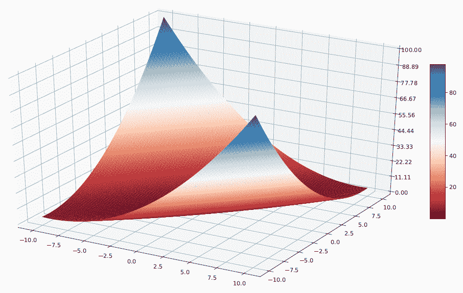

    图 7.7–表示功能的网格图

4.  As we already mentioned, the Nelder-Mead method does not require us to calculate a derivative as it is limited to evaluating the function. This means that we can directly apply the method:

    ```py
    x0 = np.array([-10, 10])
    NelderMeadOptimizeResults = minimize(matyas, x0,
                method='nelder-mead',
                options={'xatol': 1e-8, 'disp': True})
    print(NelderMeadOptimizeResults.x)
    ```

    为了做到这一点，我们首先定义了一个初始点，以开始搜索函数的最小值。因此，我们使用了 SciPy 优化模块的`minimize()`功能。此函数查找一个或多个变量的标量函数的最小值。已传递以下参数：

    *   `matyas`：您希望最小化的功能
    *   `x0`：初始向量
    *   `method = 'nelder-mead'`: The method used for the minimization procedure

        此外，还添加了以下两个选项：

    *   `'xatol': 1e-8`：定义收敛可接受的绝对误差
    *   `'disp': True`：设置为 True 可打印聚合消息
5.  Finally, we printed the results of the optimization method, as follows:

    ```py
    Optimization terminated successfully.
             Current function value: 0.000000
             Iterations: 77
             Function evaluations: 147
    [3.17941614e-09 3.64600127e-09]
    ```

    正如已经预期的那样，最小值是在值`0`中确定的。此外，该值与以下值一致：

    ```py
    X = 3.17941614e-09 
    Y = 3.64600127e-09
    ```

    正如我们所预期的，这些值非常接近于零。与该值的偏差与我们为该方法设置的误差一致。

## 鲍威尔共轭方向算法

共轭方向方法最初是作为迭代方法引入的，用于求解具有对称正定系数矩阵的线性系统，以及最小化严格凸二次函数。

用于最小化二次函数的共轭方向方法的主要特征是，以简单的方式生成一组方向，这些方向除了线性独立外，还具有相互共轭的更重要的特性。

鲍威尔方法的思想是，如果沿着 p（p< n) directions in a stage of the research, then when taking a step along each direction, the final displacement from the beginning up to the *p*的每一步找到二次函数的最小值，则第四步相对于研究的所有*p*子方向共轭。

例如，如果点 1 和 2 是从同一方向但不同起点的一维搜索中获得的，则由 1 和 2 形成的线将指向最大值。这些线表示的方向称为共轭方向。

让我们分析一个应用鲍威尔方法的实际案例。我们将使用我们在*内尔德-米德方法*一节中定义的`matyas`函数：

1.  让我们从加载必要的库开始：

    ```py
    import numpy as np
    from scipy.optimize import minimize
    ```

2.  现在，让我们定义函数：

    ```py
    def matyas (x):
        return 0.26 * (x [0] ** 2 + x [1] ** 2) -0.48 * x [0] * x [1]
    ```

3.  Now, let's apply the method:

    ```py
    x0 = np.array([-10, 10])
    PowellOptimizeResults = minimize(matyas, x0, 
               method='Powell',
               options={'xtol': 1e-8, 'disp': True})
    print(PowellOptimizeResults.x)
    ```

    此处使用了 SciPy 优化模块的`minimize()`功能。此函数查找一个或多个变量的标量函数的最小值。已传递以下参数：

    *   `matyas`：我们想要最小化的功能
    *   `x0`：初始向量
    *   `method = 'Powell'`: The method used for the minimization procedure

        此外，还添加了以下两个选项：

    *   `'xtol': 1e-8`：定义收敛可接受的绝对误差
    *   `'disp': True:`设置为*真*打印汇聚消息
4.  Finally, we printed the results of the optimization method. The following results are returned:

    ```py
    Optimization terminated successfully.
            Current function value: 0.000000
            Iterations: 3
            Function evaluations: 66
    [-6.66133815e-14 -1.32338585e-13]
    ```

    根据*尼尔-米德方法*一节的规定，最小值为 0。此外，该值与以下值一致：

    ```py
    X = -6.66133815e-14
    Y = -1.32338585e-13
    ```

    正如我们所预期的，这些值非常接近于零。现在，我们可以对应用于同一函数的两种方法进行比较。我们可以注意到，对于 Powell 方法，达到收敛所需的迭代次数等于`3`，而对于 Nelder-Mead 方法，它等于`77`。还注意到对该功能的评估数量急剧减少；`66`反对`147`。最后，通过 Powell 方法减小计算值与期望值之间的差异。

## 总结其他优化方法

SciPy optimize 软件包中的`minimize()`例程包含许多用于无约束和约束最小化的方法。我们在前面的章节中详细分析了其中的一些。在以下列表中，我们总结了该软件包提供的最常用方法：

*   **Newton Broyden-Fletcher Goldfarb-Shanno**（**BFGS**）：这是一种迭代无约束优化方法，用于解决非线性问题。此方法查找一阶导数为零的点。
*   **共轭梯度****CG**：该方法属于共轭梯度算法家族，执行一个或多个变量的标量函数最小化。这种方法要求系统矩阵是对称的、正定的。
*   **狗腿信赖域**（**狗腿**）：方法首先围绕当前最佳解定义一个区域，在该区域可以近似原目标函数。因此，该算法在该区域内向前迈出了一步。
*   **牛顿 CG**：这种方法也称为截断牛顿法。这是一种方法，通过采用基于共轭梯度的程序确定研究方向，以粗略最小化二次函数。
*   **有限记忆 BFGS****L-BFGS**：这是拟牛顿方法家族的一部分。它使用 BFGS 方法系统地保存计算机内存。
*   **线性近似约束优化**（**COBYLA**）：运行机制为迭代，利用线性规划的原理对上一步发现的解进行细化。通过逐步降低速度来实现收敛。

# 总结

在本章中，我们学习了如何使用不同的数值优化技术来改进仿真模型提供的解决方案。我们首先介绍了数值优化的基本概念，定义了一个极小化问题，并学习了如何区分局部极小值和全局极小值。然后，我们继续研究基于梯度下降的优化技术。我们定义了该技术的数学公式，并给出了几何表示。此外，我们还加深了对学习率和试错相关概念的了解。通过这样做，我们解决了一个实际案例，以加强我们通过解决搜索二次函数最小值的问题所学到的概念。

随后，我们学习了如何使用 Newton-Raphson 方法搜索函数的根，以及如何利用相同的方法进行数值优化。我们还分析了这项技术的一个实际案例，以立即将我们学到的概念付诸实践。我们通过寻找凸函数的局部极小值来实现这一点。

然后，我们继续研究随机梯度下降算法，这使我们能够大大降低数值优化问题的计算成本。这一结果是通过在每一步使用单一的梯度估计来获得的，该梯度是以随机方式从可用梯度中选择的。

最后，我们探讨了 pythonscipy 包中包含的多元数值优化算法。对于其中一些，我们定义了数学公式，并给出了使用该方法的一个实例。对于其他人，起草了一份摘要，列出他们的特点。

在下一章中，我们将学习如何使用仿真模型来处理财务问题。我们将探索几何布朗运动模型是如何工作的，我们将发现如何使用蒙特卡罗方法进行股票价格预测。最后，我们将学习如何使用马尔可夫链建模信用风险。